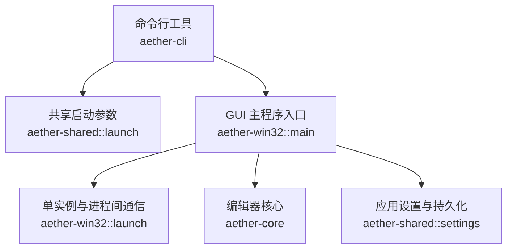
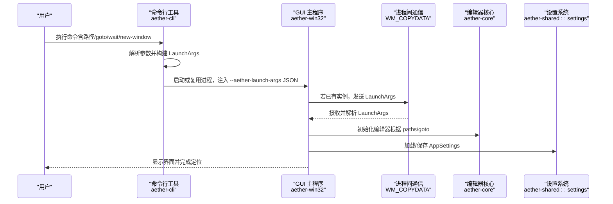
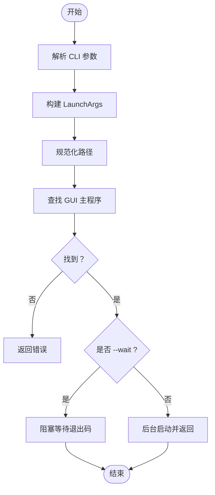
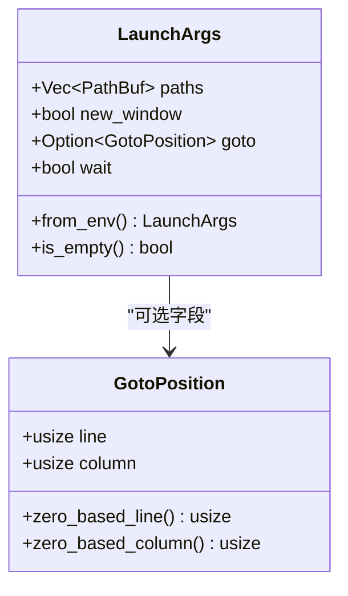
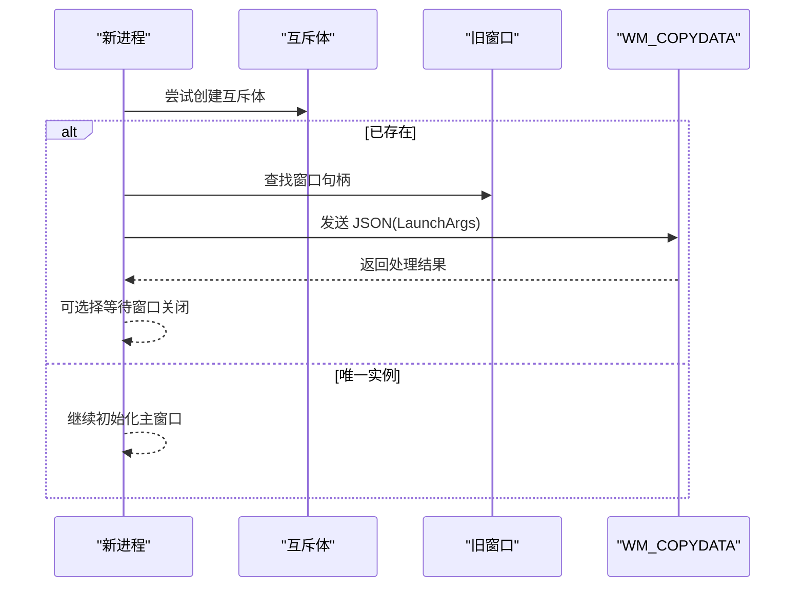
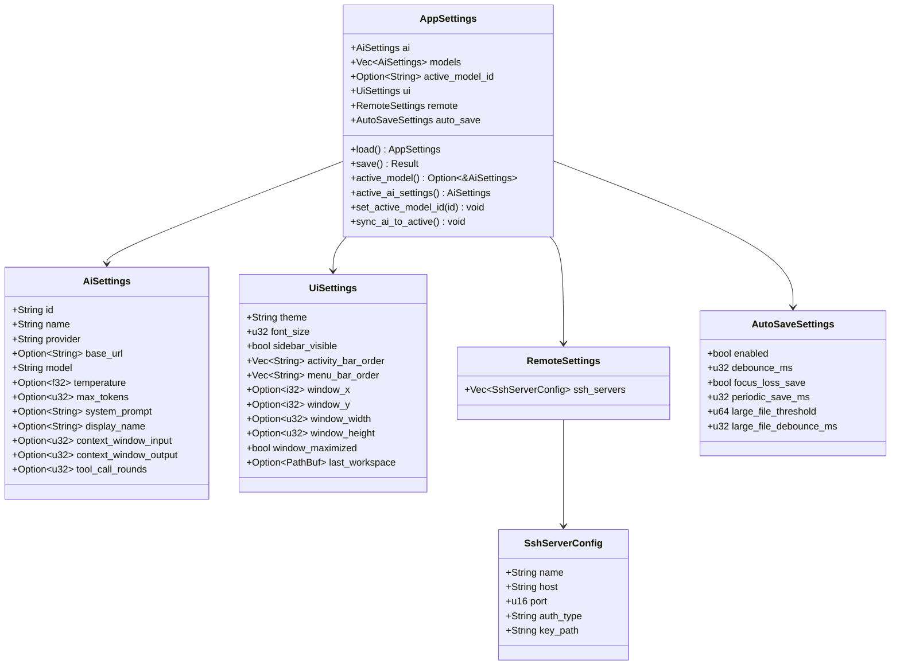
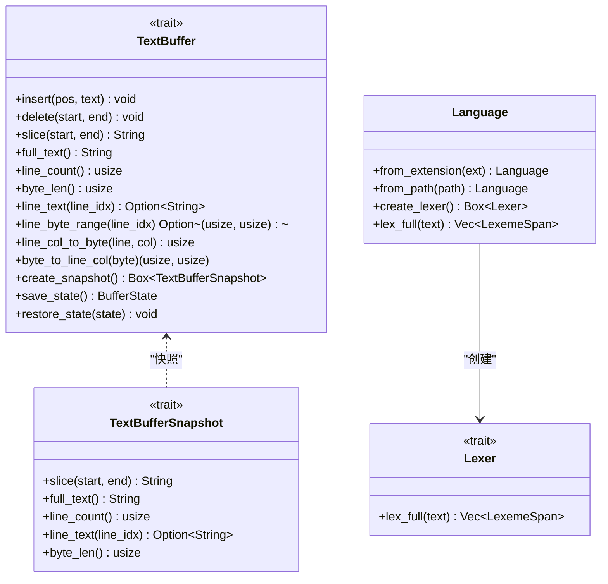
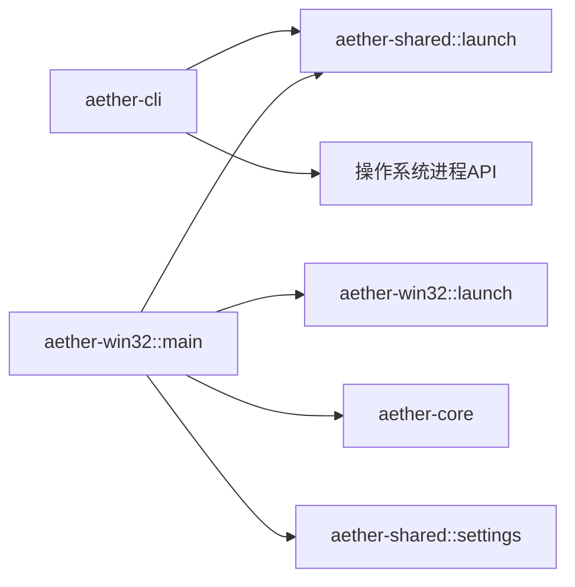

# API 参考

<cite>
**本文引用的文件**
- [README.md](file://README.md)
- [Cargo.toml](file://Cargo.toml)
- [aether-cli/src/main.rs](file://crates/aether-cli/src/main.rs)
- [aether-shared/src/lib.rs](file://crates/aether-shared/src/lib.rs)
- [aether-shared/src/launch.rs](file://crates/aether-shared/src/launch.rs)
- [aether-shared/src/settings.rs](file://crates/aether-shared/src/settings.rs)
- [aether-core/src/lib.rs](file://crates/aether-core/src/lib.rs)
- [aether-core/src/buffer/mod.rs](file://crates/aether-core/src/buffer/mod.rs)
- [aether-core/src/buffer/text_buffer.rs](file://crates/aether-core/src/buffer/text_buffer.rs)
- [aether-core/src/lexer/mod.rs](file://crates/aether-core/src/lexer/mod.rs)
- [aether-win32/src/main.rs](file://crates/aether-win32/src/main.rs)
- [aether-win32/src/launch.rs](file://crates/aether-win32/src/launch.rs)
</cite>

## 目录
1. [简介](#简介)
2. [项目结构](#项目结构)
3. [核心组件](#核心组件)
4. [架构总览](#架构总览)
5. [详细组件分析](#详细组件分析)
6. [依赖关系分析](#依赖关系分析)
7. [性能与稳定性](#性能与稳定性)
8. [故障排查指南](#故障排查指南)
9. [版本兼容性与迁移指南](#版本兼容性与迁移指南)
10. [结论](#结论)

## 简介
本文件为“牧羊人编辑器”（Aether Studio）的 API 参考文档，覆盖以下范围：
- 公共接口定义：函数签名、参数说明、返回值类型与错误处理
- 配置选项结构与含义：UI 设置、AI 配置、工作区与远程等
- 命令行工具参数与用法：启动参数、文件操作、定位跳转与调试选项
- 使用示例与最佳实践：常见模式与注意事项
- 版本兼容性与迁移指南：平滑升级建议

## 项目结构
仓库采用 Cargo Workspace 组织，按职责拆分为多个 Crate。与 API 相关的关键模块包括：
- aether-cli：命令行入口，解析参数并启动 GUI
- aether-shared：共享数据结构（启动参数、设置持久化）
- aether-core：编辑器核心（文本缓冲、词法分析器、搜索等）
- aether-win32：Windows 原生 UI 层与应用入口

图表来源
- [aether-cli/src/main.rs:1-120](file://crates/aether-cli/src/main.rs#L1-L120)
- [aether-shared/src/launch.rs:1-120](file://crates/aether-shared/src/launch.rs#L1-L120)
- [aether-win32/src/main.rs:1-52](file://crates/aether-win32/src/main.rs#L1-L52)
- [aether-win32/src/launch.rs:1-106](file://crates/aether-win32/src/launch.rs#L1-L106)
- [aether-core/src/lib.rs:1-12](file://crates/aether-core/src/lib.rs#L1-L12)
- [aether-shared/src/settings.rs:1-120](file://crates/aether-shared/src/settings.rs#L1-L120)

章节来源
- [README.md:29-46](file://README.md#L29-L46)
- [Cargo.toml:1-32](file://Cargo.toml#L1-L32)

## 核心组件
本节概述对外暴露的主要 API 面，供上层集成与二次开发参考。

- 命令行接口（CLI）
  - 作用：解析用户输入，构造启动参数，启动或复用 GUI 主程序
  - 关键能力：路径打开、新窗口、等待关闭、goto 定位
  - 参考实现：[aether-cli/src/main.rs](file://crates/aether-cli/src/main.rs)

- 共享启动参数（LaunchArgs/GotoPosition）
  - 作用：在 CLI 与 GUI 之间传递结构化启动信息
  - 关键能力：JSON 序列化/反序列化、位置解析、零基转换
  - 参考实现：[aether-shared/src/launch.rs](file://crates/aether-shared/src/launch.rs)

- Windows 单实例与进程间通信
  - 作用：确保单实例运行；通过 WM_COPYDATA 将参数传递给已有窗口
  - 关键能力：互斥体检测、窗口查找、消息发送与接收
  - 参考实现：[aether-win32/src/launch.rs](file://crates/aether-win32/src/launch.rs), [aether-win32/src/main.rs](file://crates/aether-win32/src/main.rs)

- 应用设置（AppSettings/AiSettings/UiSettings/RemoteSettings/AutoSaveSettings）
  - 作用：持久化 UI、AI、远程、自动保存等配置
  - 关键能力：加载/保存、默认值、加密存储密钥、兼容性迁移
  - 参考实现：[aether-shared/src/settings.rs](file://crates/aether-shared/src/settings.rs)

- 编辑器核心（TextBuffer/Lexer）
  - 作用：提供文本编辑抽象与多语言词法分析
  - 关键能力：插入/删除/切片、行号列号转换、不可变快照、多光标、Token 分类
  - 参考实现：[aether-core/src/buffer/text_buffer.rs](file://crates/aether-core/src/buffer/text_buffer.rs), [aether-core/src/lexer/mod.rs](file://crates/aether-core/src/lexer/mod.rs)

章节来源
- [aether-cli/src/main.rs:1-120](file://crates/aether-cli/src/main.rs#L1-L120)
- [aether-shared/src/launch.rs:1-120](file://crates/aether-shared/src/launch.rs#L1-L120)
- [aether-win32/src/launch.rs:1-106](file://crates/aether-win32/src/launch.rs#L1-L106)
- [aether-win32/src/main.rs:1-52](file://crates/aether-win32/src/main.rs#L1-L52)
- [aether-shared/src/settings.rs:1-120](file://crates/aether-shared/src/settings.rs#L1-L120)
- [aether-core/src/buffer/text_buffer.rs:1-120](file://crates/aether-core/src/buffer/text_buffer.rs#L1-L120)
- [aether-core/src/lexer/mod.rs:1-120](file://crates/aether-core/src/lexer/mod.rs#L1-L120)

## 架构总览
下图展示从命令行到 GUI 的完整调用链路与数据流。

图表来源
- [aether-cli/src/main.rs:29-80](file://crates/aether-cli/src/main.rs#L29-L80)
- [aether-shared/src/launch.rs:15-38](file://crates/aether-shared/src/launch.rs#L15-L38)
- [aether-win32/src/main.rs:8-26](file://crates/aether-win32/src/main.rs#L8-L26)
- [aether-win32/src/launch.rs:49-96](file://crates/aether-win32/src/launch.rs#L49-L96)
- [aether-shared/src/settings.rs:240-338](file://crates/aether-shared/src/settings.rs#L240-L338)

## 详细组件分析

### 命令行工具 API（aether-cli）
- 功能概览
  - 解析命令行参数，生成 LaunchArgs
  - 查找 GUI 可执行并启动，支持 wait/new-window/goto
- 关键参数
  - paths：要打开的文件或文件夹路径列表
  - new_window：强制新窗口
  - wait：等待编辑器关闭后返回
  - goto：定位字符串，支持 file.txt:line:column 或 line:column
- 行为说明
  - 相对路径会被规范化为绝对路径
  - goto 中的文件会优先插入到路径列表首位
  - 找不到 GUI 主程序时返回错误
- 错误处理
  - 参数解析失败、路径规范化失败、GUI 启动失败均返回错误并输出诊断信息

图表来源
- [aether-cli/src/main.rs:29-133](file://crates/aether-cli/src/main.rs#L29-L133)

章节来源
- [aether-cli/src/main.rs:10-133](file://crates/aether-cli/src/main.rs#L10-L133)

### 共享启动参数（LaunchArgs / GotoPosition）
- LaunchArgs
  - fields：paths, new_window, goto, wait
  - from_env：从命令行参数中解析 JSON 注入的启动参数
  - is_empty：判断是否为空启动
- GotoPosition
  - fields：line, column（1-based）
  - zero_based_line/column：转换为 0-based 索引
  - Display/FromStr：序列化为 "line:column" 字符串
  - parse_goto：支持 file.txt:line:column 与纯位置解析，兼容 Windows 路径冒号

图表来源
- [aether-shared/src/launch.rs:7-73](file://crates/aether-shared/src/launch.rs#L7-L73)
- [aether-shared/src/launch.rs:110-154](file://crates/aether-shared/src/launch.rs#L110-L154)

章节来源
- [aether-shared/src/launch.rs:1-154](file://crates/aether-shared/src/launch.rs#L1-L154)

### Windows 单实例与进程间通信
- 单实例控制
  - acquire_single_instance：基于全局互斥体判断是否首个实例
  - find_existing_window：按窗口类名查找已运行窗口句柄
- 进程间通信
  - send_to_existing_instance：通过 WM_COPYDATA 发送 JSON 化的 LaunchArgs
  - parse_copydata_lparam：从 lparam 还原 LaunchArgs
  - copydata_result：处理结果回传

图表来源
- [aether-win32/src/launch.rs:15-75](file://crates/aether-win32/src/launch.rs#L15-L75)
- [aether-win32/src/main.rs:14-26](file://crates/aether-win32/src/main.rs#L14-L26)

章节来源
- [aether-win32/src/launch.rs:1-106](file://crates/aether-win32/src/launch.rs#L1-L106)
- [aether-win32/src/main.rs:1-52](file://crates/aether-win32/src/main.rs#L1-L52)

### 应用设置 API（AppSettings 及其子项）
- AppSettings
  - 包含 ai/models/active_model_id/ui/remote/auto_save
  - settings_path/api_keys_path/api_key_path：配置文件与加密密钥文件路径
  - load/save/load_from/save_to：加载/保存，含原子写入与损坏备份
  - active_model/active_ai_settings/set_active_model_id/sync_ai_to_active：激活模型管理
- AiSettings
  - id/name/provider/base_url/model/temperature/max_tokens/system_prompt/display_name/context_window_input/output/tool_call_rounds
  - api_key：不序列化到 JSON，单独 DPAPI 加密存储
- UiSettings
  - theme/font_size/sidebar_visible/activity_bar_order/menu_bar_order/window_x/y/width/height/maximized/last_workspace
- RemoteSettings/SshServerConfig
  - ssh_servers：name/host/port/auth_type/key_path
  - 密码认证禁用迁移：加载时将 password 迁移为 agent
- AutoSaveSettings
  - enabled/debounce_ms/focus_loss_save/periodic_save_ms/large_file_threshold/large_file_debounce_ms

图表来源
- [aether-shared/src/settings.rs:7-122](file://crates/aether-shared/src/settings.rs#L7-L122)
- [aether-shared/src/settings.rs:143-212](file://crates/aether-shared/src/settings.rs#L143-L212)
- [aether-shared/src/settings.rs:214-444](file://crates/aether-shared/src/settings.rs#L214-L444)

章节来源
- [aether-shared/src/settings.rs:1-444](file://crates/aether-shared/src/settings.rs#L1-L444)

### 编辑器核心 API（TextBuffer 与 Lexer）
- TextBuffer trait
  - insert/delete/slice/full_text/line_count/byte_len
  - line_text/line_byte_range
  - line_col_to_byte/byte_to_line_col
  - create_snapshot/save_state/restore_state
- 辅助类型
  - BufferState：轻量状态快照（用于 Undo/Redo）
  - Cursor/Selection/MultiCursorState：光标与选择区域
  - EditOp/EditResult：编辑操作与影响范围
- Lexer trait 与 Language
  - Lexer.lex_full：对单行进行全量词法分析
  - TokenKind：跨语言统一 Token 分类
  - Language.from_extension/from_path/create_lexer/lex_full：语言检测与静态分发

图表来源
- [aether-core/src/buffer/text_buffer.rs:1-120](file://crates/aether-core/src/buffer/text_buffer.rs#L1-L120)
- [aether-core/src/lexer/mod.rs:1-182](file://crates/aether-core/src/lexer/mod.rs#L1-L182)

章节来源
- [aether-core/src/buffer/text_buffer.rs:1-120](file://crates/aether-core/src/buffer/text_buffer.rs#L1-L120)
- [aether-core/src/lexer/mod.rs:1-182](file://crates/aether-core/src/lexer/mod.rs#L1-L182)

## 依赖关系分析
- 模块耦合
  - CLI 依赖 shared::launch 与 OS 进程 API
  - GUI 主程序依赖 win32::launch 与 shared::launch
  - 核心逻辑（core）被 GUI 层消费，提供文本与词法能力
  - 设置系统（shared::settings）贯穿 GUI 生命周期
- 外部依赖
  - serde_json：参数与设置的序列化/反序列化
  - clap：CLI 参数解析
  - windows crate：Win32 API 访问

图表来源
- [aether-cli/src/main.rs:1-120](file://crates/aether-cli/src/main.rs#L1-L120)
- [aether-win32/src/main.rs:1-52](file://crates/aether-win32/src/main.rs#L1-L52)
- [aether-win32/src/launch.rs:1-106](file://crates/aether-win32/src/launch.rs#L1-L106)
- [aether-shared/src/launch.rs:1-120](file://crates/aether-shared/src/launch.rs#L1-L120)
- [aether-shared/src/settings.rs:1-120](file://crates/aether-shared/src/settings.rs#L1-L120)
- [aether-core/src/lib.rs:1-12](file://crates/aether-core/src/lib.rs#L1-L12)

章节来源
- [Cargo.toml:1-32](file://Cargo.toml#L1-L32)

## 性能与稳定性
- 渲染与编辑
  - 自绘渲染与脏矩形优化减少重绘开销
  - Piece Table 文本缓冲提升大文件编辑性能
- 词法分析
  - 静态分发避免动态分配与虚调用开销
  - 增量高亮与缓存策略降低重复计算
- 设置持久化
  - 原子写入（临时文件+fsync+rename）保证一致性
  - 损坏备份机制防止配置丢失
- 进程间通信
  - WM_COPYDATA 同步传输适合小体积参数，避免竞态

[本节为通用指导，无需具体文件引用]

## 故障排查指南
- CLI 无法启动 GUI
  - 现象：提示找不到 GUI 主程序
  - 排查：确认 aether 与 aether-app.exe 在同一目录
  - 参考：[aether-cli/src/main.rs:107-133](file://crates/aether-cli/src/main.rs#L107-L133)
- goto 参数格式错误
  - 现象：解析失败报错
  - 排查：检查格式为 file.txt:line:column 或 line:column，行号从 1 开始
  - 参考：[aether-shared/src/launch.rs:76-154](file://crates/aether-shared/src/launch.rs#L76-L154)
- 设置文件损坏
  - 现象：加载失败回退默认设置并备份原文件
  - 排查：查看 .json.corrupt 备份，修复后重试
  - 参考：[aether-shared/src/settings.rs:327-338](file://crates/aether-shared/src/settings.rs#L327-L338)
- 单实例冲突
  - 现象：多次启动未打开新窗口
  - 排查：确认互斥体名称与窗口类名一致，检查 WM_COPYDATA 处理
  - 参考：[aether-win32/src/launch.rs:15-75](file://crates/aether-win32/src/launch.rs#L15-L75)

章节来源
- [aether-cli/src/main.rs:107-133](file://crates/aether-cli/src/main.rs#L107-L133)
- [aether-shared/src/launch.rs:76-154](file://crates/aether-shared/src/launch.rs#L76-L154)
- [aether-shared/src/settings.rs:327-338](file://crates/aether-shared/src/settings.rs#L327-L338)
- [aether-win32/src/launch.rs:15-75](file://crates/aether-win32/src/launch.rs#L15-L75)

## 版本兼容性与迁移指南
- 多模型 AI 配置
  - 新增 models 列表与 active_model_id，ai 字段保持向后兼容
  - 加载时若 models 为空，会将旧 ai 迁移入列表，并设置默认激活模型
  - 参考：[aether-shared/src/settings.rs:256-276](file://crates/aether-shared/src/settings.rs#L256-L276)
- API 密钥安全存储
  - api_key 不再明文写入 settings.json，改为 DPAPI 加密文件
  - 加载时从加密文件恢复各模型的 api_key
  - 参考：[aether-shared/src/settings.rs:278-316](file://crates/aether-shared/src/settings.rs#L278-L316)
- SSH 密码认证禁用
  - 加载时扫描遗留 password 配置，迁移为 agent 并持久化
  - 参考：[aether-shared/src/settings.rs:303-325](file://crates/aether-shared/src/settings.rs#L303-L325)
- 原子写入与损坏保护
  - 写入使用临时文件+fsync+rename，失败清理临时文件
  - 解析失败时备份原文件并回退默认设置
  - 参考：[aether-shared/src/settings.rs:354-397](file://crates/aether-shared/src/settings.rs#L354-L397), [aether-shared/src/settings.rs:327-338](file://crates/aether-shared/src/settings.rs#L327-L338)
- 版本信息
  - 工作区版本：0.1.0，Rust 版本要求：1.70+
  - 参考：[Cargo.toml:17-22](file://Cargo.toml#L17-L22)

章节来源
- [aether-shared/src/settings.rs:256-325](file://crates/aether-shared/src/settings.rs#L256-L325)
- [aether-shared/src/settings.rs:354-397](file://crates/aether-shared/src/settings.rs#L354-L397)
- [Cargo.toml:17-22](file://Cargo.toml#L17-L22)

## 结论
本文档系统化梳理了牧羊人编辑器的 API 面，涵盖 CLI、共享参数、Windows 进程间通信、设置系统与编辑器核心。通过图示与源码路径指引，开发者可以快速理解接口契约、配置结构与错误处理策略，并结合迁移指南完成平滑升级。建议在集成过程中遵循原子写入、最小权限与健壮的错误处理原则，以获得稳定高效的体验。