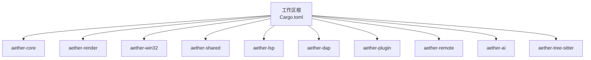
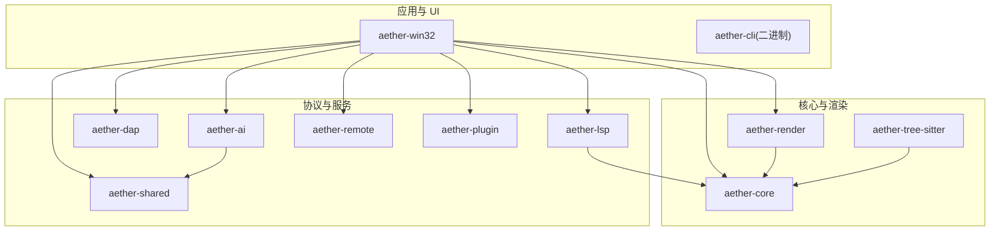
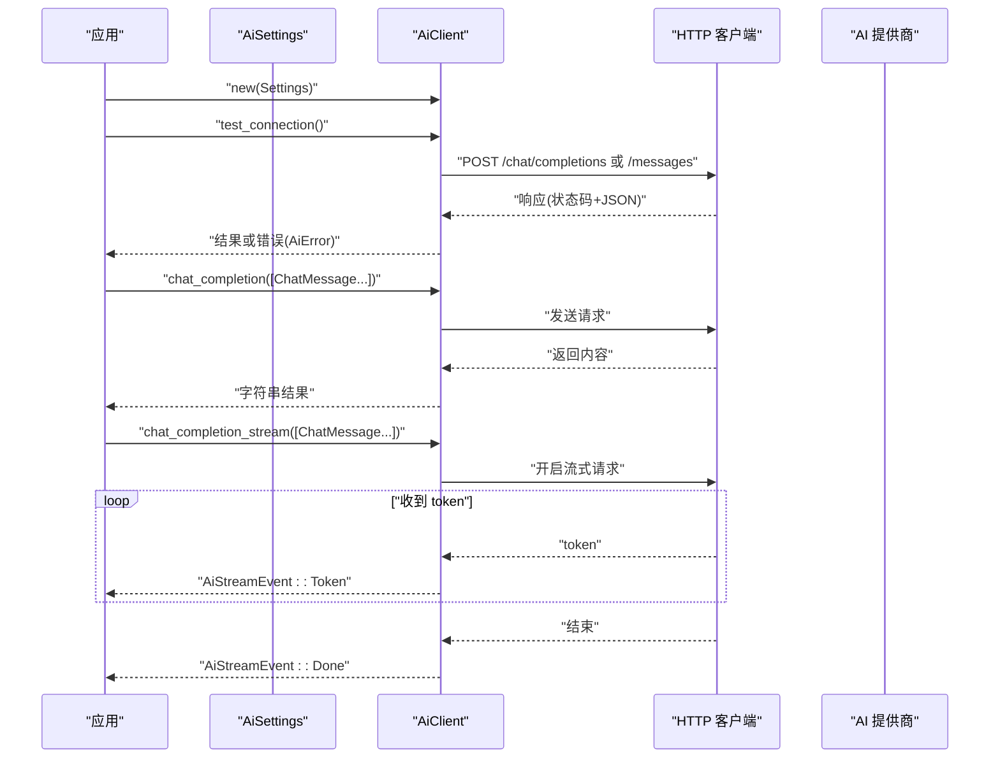
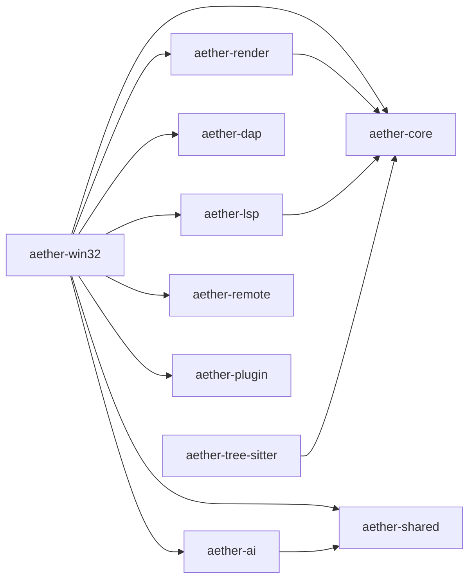

# 公共接口

<cite>
**本文引用的文件**
- [Cargo.toml](file://Cargo.toml)
- [README.md](file://README.md)
- [aether-core/Cargo.toml](file://crates/aether-core/Cargo.toml)
- [aether-core/src/lib.rs](file://crates/aether-core/src/lib.rs)
- [aether-render/Cargo.toml](file://crates/aether-render/Cargo.toml)
- [aether-render/src/lib.rs](file://crates/aether-render/src/lib.rs)
- [aether-win32/Cargo.toml](file://crates/aether-win32/Cargo.toml)
- [aether-win32/src/lib.rs](file://crates/aether-win32/src/lib.rs)
- [aether-shared/Cargo.toml](file://crates/aether-shared/Cargo.toml)
- [aether-shared/src/lib.rs](file://crates/aether-shared/src/lib.rs)
- [aether-lsp/Cargo.toml](file://crates/aether-lsp/Cargo.toml)
- [aether-lsp/src/lib.rs](file://crates/aether-lsp/src/lib.rs)
- [aether-dap/src/lib.rs](file://crates/aether-dap/src/lib.rs)
- [aether-plugin/src/lib.rs](file://crates/aether-plugin/src/lib.rs)
- [aether-remote/src/lib.rs](file://crates/aether-remote/src/lib.rs)
- [aether-ai/src/lib.rs](file://crates/aether-ai/src/lib.rs)
- [aether-tree-sitter/src/lib.rs](file://crates/aether-tree-sitter/src/lib.rs)
</cite>

## 目录
1. [简介](#简介)
2. [项目结构](#项目结构)
3. [核心组件](#核心组件)
4. [架构总览](#架构总览)
5. [详细组件分析](#详细组件分析)
6. [依赖关系分析](#依赖关系分析)
7. [性能考量](#性能考量)
8. [故障排查指南](#故障排查指南)
9. [结论](#结论)
10. [附录：版本兼容与迁移](#附录版本兼容与迁移)

## 简介
本文件为牧羊人编辑器（Aether Studio）的公共接口文档，聚焦于对外暴露的 Rust crate 公共 API。内容覆盖模块结构、公共函数签名、数据结构定义与 trait 接口，说明各接口的用途、参数类型、返回值与错误处理机制，并提供常见初始化模式、配置设置与生命周期管理示例。同时解释接口之间的依赖关系与调用顺序，帮助开发者理解整体架构。文末包含版本兼容性说明与迁移指南。

## 项目结构
仓库采用 Cargo Workspace 组织，按职责拆分为多个 Crate。顶层工作区定义了成员 crate、统一版本号与构建配置。

图表来源
- [Cargo.toml:1-32](file://Cargo.toml#L1-L32)

章节来源
- [Cargo.toml:1-32](file://Cargo.toml#L1-L32)
- [README.md:29-46](file://README.md#L29-L46)

## 核心组件
本节概述各 crate 的公共入口与主要导出，便于快速定位 API。

- aether-core
  - 模块：buffer、char_width、incremental_lexer、lexer、persistent_history、render_prep、search、simd_utils、workspace、benchmarks
  - 作用：文本缓冲（Piece Table）、历史栈、词法分析器、文件树数据结构、搜索等编辑核心能力

- aether-render
  - 模块：d2d、theme、vscode_theme
  - 作用：Direct2D/DirectWrite 渲染抽象、主题系统、画笔与文本格式缓存

- aether-win32
  - 模块：window、editor、render、layout、input、keyboard_hook、mouse_handler、menu_bar、tabs、terminal、conpty、diff_view、dirty_rect、events、focus_manager、launch、render_context 等
  - 作用：Windows 原生 UI 层、窗口消息循环、布局、事件处理与应用入口

- aether-shared
  - 模块：launch、settings
  - 作用：共享配置与持久化设置（UI 设置、AI 设置、最近项目、窗口状态、启动参数）

- aether-lsp
  - 模块：client、incremental_sync、semantic_tokens、server、sync、transport、types
  - 作用：Language Server Protocol 客户端实现（同步、增量同步、语义 token）

- aether-dap
  - 模块：client、session、transport、types
  - 作用：Debug Adapter Protocol 客户端基础实现

- aether-plugin
  - 模块：permissions、registry、runtime
  - 作用：插件注册、权限与运行时

- aether-remote
  - 模块：container、git、remote_fs、ssh、workspace
  - 作用：SSH/Git/容器远程操作抽象

- aether-ai
  - 作用：AI 服务接口与请求处理（OpenAI/Claude/Kimi/DeepSeek/Azure/Custom），含流式响应与安全校验

- aether-tree-sitter
  - 模块：background、highlighter、language、theme_mapping
  - 作用：Tree-sitter 语法解析、语言检测、主题映射与高亮

章节来源
- [aether-core/src/lib.rs:1-12](file://crates/aether-core/src/lib.rs#L1-L12)
- [aether-render/src/lib.rs:1-4](file://crates/aether-render/src/lib.rs#L1-L4)
- [aether-win32/src/lib.rs:1-54](file://crates/aether-win32/src/lib.rs#L1-L54)
- [aether-shared/src/lib.rs:1-3](file://crates/aether-shared/src/lib.rs#L1-L3)
- [aether-lsp/src/lib.rs:1-16](file://crates/aether-lsp/src/lib.rs#L1-L16)
- [aether-dap/src/lib.rs:1-8](file://crates/aether-dap/src/lib.rs#L1-L8)
- [aether-plugin/src/lib.rs:1-8](file://crates/aether-plugin/src/lib.rs#L1-L8)
- [aether-remote/src/lib.rs:1-18](file://crates/aether-remote/src/lib.rs#L1-L18)
- [aether-tree-sitter/src/lib.rs:1-10](file://crates/aether-tree-sitter/src/lib.rs#L1-L10)

## 架构总览
下图展示了高层模块间的依赖与交互关系，体现“UI 层 -> 核心/渲染/协议 -> 外部服务”的分层设计。

图表来源
- [aether-win32/Cargo.toml:14-22](file://crates/aether-win32/Cargo.toml#L14-L22)
- [aether-render/Cargo.toml:6-11](file://crates/aether-render/Cargo.toml#L6-L11)
- [aether-lsp/Cargo.toml:6-16](file://crates/aether-lsp/Cargo.toml#L6-L16)
- [aether-ai/src/lib.rs:1-2](file://crates/aether-ai/src/lib.rs#L1-L2)

## 详细组件分析

### aether-core 公共接口概览
- 模块与职责
  - buffer：文本缓冲（Piece Table）、撤销/重做历史
  - lexer：多语言词法分析器（C/Rust/JS/Python/JSON/TOML/HTML/Markdown）
  - incremental_lexer：增量词法更新
  - search：查找替换
  - workspace：文件树与工作区数据结构
  - render_prep：渲染预处理数据
  - char_width/simd_utils/benchmarks：工具与基准

- 典型使用流程（概念性）
  - 初始化 Piece Table 缓冲 -> 写入文本 -> 触发增量词法分析 -> 生成渲染准备数据 -> 交由渲染层绘制

章节来源
- [aether-core/src/lib.rs:1-12](file://crates/aether-core/src/lib.rs#L1-L12)
- [aether-core/Cargo.toml:1-20](file://crates/aether-core/Cargo.toml#L1-L20)

### aether-render 公共接口概览
- 模块与职责
  - d2d：Direct2D/DirectWrite 渲染抽象、画笔与文本格式缓存
  - theme：主题系统
  - vscode_theme：VSCode 主题映射

- 典型使用流程（概念性）
  - 从 core 获取渲染准备数据 -> 根据主题选择画笔/字体 -> 在 Direct2D 上下文中绘制

章节来源
- [aether-render/src/lib.rs:1-4](file://crates/aether-render/src/lib.rs#L1-L4)
- [aether-render/Cargo.toml:6-11](file://crates/aether-render/Cargo.toml#L6-L11)

### aether-win32 公共接口概览
- 模块与职责
  - window/editor/render/layout/input/keyboard_hook/mouse_handler/menu_bar/tabs/terminal/conpty/diff_view/dirty_rect/events/focus_manager/launch/render_context 等
  - 负责 Windows 原生窗口、消息循环、输入事件、布局、渲染上下文、终端子进程等

- 典型使用流程（概念性）
  - 初始化窗口与渲染上下文 -> 加载主题与设置 -> 创建编辑器实例 -> 绑定输入与菜单 -> 进入消息循环

章节来源
- [aether-win32/src/lib.rs:1-54](file://crates/aether-win32/src/lib.rs#L1-L54)
- [aether-win32/Cargo.toml:14-35](file://crates/aether-win32/Cargo.toml#L14-L35)

### aether-shared 公共接口概览
- 模块与职责
  - launch：启动参数与命令行解析
  - settings：UI 设置、AI 设置、最近项目、窗口状态等持久化

- 典型使用流程（概念性）
  - 读取/保存设置 -> 传递给 AI 客户端或 UI 组件

章节来源
- [aether-shared/src/lib.rs:1-3](file://crates/aether-shared/src/lib.rs#L1-L3)
- [aether-shared/Cargo.toml:1-13](file://crates/aether-shared/Cargo.toml#L1-L13)

### aether-lsp 公共接口概览
- 模块与职责
  - client：LSP 客户端
  - incremental_sync：增量同步
  - semantic_tokens：语义 token
  - server/sync/transport/types：协议传输与类型

- 关键导出
  - LspClient、增量同步相关类型、语义 token 相关类型、通用类型与 lsp-types 重新导出

- 典型使用流程（概念性）
  - 创建 LspClient -> 连接语言服务器 -> 发送文档同步/语义请求 -> 接收并应用到编辑器

章节来源
- [aether-lsp/src/lib.rs:1-16](file://crates/aether-lsp/src/lib.rs#L1-L16)
- [aether-lsp/Cargo.toml:6-20](file://crates/aether-lsp/Cargo.toml#L6-L20)

### aether-dap 公共接口概览
- 模块与职责
  - client：DAP 客户端
  - session：调试会话
  - transport：传输
  - types：类型定义

- 关键导出
  - DapClient、DAP 类型集合

- 典型使用流程（概念性）
  - 创建 DapClient -> 启动调试适配器 -> 建立会话 -> 执行断点/步进/变量查询等操作

章节来源
- [aether-dap/src/lib.rs:1-8](file://crates/aether-dap/src/lib.rs#L1-L8)

### aether-plugin 公共接口概览
- 模块与职责
  - permissions：权限模型
  - registry：插件注册表
  - runtime：插件运行时

- 关键导出
  - PermissionGrant、PermissionLevel、PluginRegistry、PluginId、PluginRuntime

- 典型使用流程（概念性）
  - 注册插件 -> 授予权限 -> 通过运行时加载与调用插件能力

章节来源
- [aether-plugin/src/lib.rs:1-8](file://crates/aether-plugin/src/lib.rs#L1-L8)

### aether-remote 公共接口概览
- 模块与职责
  - container：容器后端
  - git：Git 仓库操作
  - remote_fs：远程文件系统
  - ssh：SSH 连接
  - workspace：远程工作区

- 关键导出
  - ContainerBackend、ContainerConfig、ContainerRemoteFs
  - GitCommit、GitError、GitRepoConfig、GitRepoType、GitRepository、GitStatus、GIT_DOWNLOAD_URL
  - FsEvent、GitRemoteInfo、GitSshRepo、RemoteDirEntry、RemoteFs、Result
  - SshAuth、SshConfig、SshRemoteFs、SSH_DOWNLOAD_URL
  - RemoteWorkspace

- 典型使用流程（概念性）
  - 配置 SSH/Git -> 连接远程 -> 浏览/拉取代码 -> 打开远程工作区

章节来源
- [aether-remote/src/lib.rs:1-18](file://crates/aether-remote/src/lib.rs#L1-L18)

### aether-ai 公共接口概览
- 关键类型与枚举
  - AiProvider：支持的提供商（OpenAi、Claude、Kimi、DeepSeek、Azure、Custom）
  - AiConfig：AI 配置（provider、api_key、base_url、model、temperature、max_tokens、system_prompt）
  - ChatMessage：对话消息（role、content）
  - AiStreamEvent：流式事件（Token、Done、Error）
  - AiError：错误类型（Http、Parse、Config、Api{code,message}）

- 关键方法（AiClient）
  - new(config: &AiSettings) -> Self
  - test_connection() -> Result<String, AiError>
  - test_connection_safe() -> Result<String, String>
  - complete(prompt: &str) -> Result<String, AiError>
  - chat_completion(messages: &[ChatMessage]) -> Result<String, AiError>
  - chat_completion_stream(messages: &[ChatMessage]) -> Result<mpsc::Receiver<AiStreamEvent>, AiError>

- 安全与健壮性
  - HTTPS 强制校验、私有/保留 IP 阻断、DNS TOCTOU 二次校验、SSRF 黑名单、响应体大小限制、错误信息脱敏

- 典型使用流程（序列图）

图表来源
- [aether-ai/src/lib.rs:17-146](file://crates/aether-ai/src/lib.rs#L17-L146)
- [aether-ai/src/lib.rs:194-258](file://crates/aether-ai/src/lib.rs#L194-L258)
- [aether-ai/src/lib.rs:438-458](file://crates/aether-ai/src/lib.rs#L438-L458)
- [aether-ai/src/lib.rs:710-718](file://crates/aether-ai/src/lib.rs#L710-L718)

章节来源
- [aether-ai/src/lib.rs:17-146](file://crates/aether-ai/src/lib.rs#L17-L146)
- [aether-ai/src/lib.rs:194-258](file://crates/aether-ai/src/lib.rs#L194-L258)
- [aether-ai/src/lib.rs:438-458](file://crates/aether-ai/src/lib.rs#L438-L458)
- [aether-ai/src/lib.rs:710-718](file://crates/aether-ai/src/lib.rs#L710-L718)

### aether-tree-sitter 公共接口概览
- 关键导出
  - BackgroundHighlighter、HighlightResult
  - TreeSitterHighlighter
  - get_language
  - capture_to_textmate_scope

- 典型使用流程（概念性）
  - 根据文件扩展名获取语言 -> 后台增量高亮 -> 将捕获范围映射到 TextMate 主题 -> 输出高亮结果供渲染

章节来源
- [aether-tree-sitter/src/lib.rs:1-10](file://crates/aether-tree-sitter/src/lib.rs#L1-L10)

## 依赖关系分析
- 直接依赖
  - aether-win32 依赖 aether-core、aether-render、aether-ai、aether-shared、aether-remote、aether-lsp、aether-tree-sitter
  - aether-render 依赖 aether-core
  - aether-lsp 依赖 aether-core
  - aether-ai 依赖 aether-shared

- 间接依赖
  - aether-tree-sitter 依赖 aether-core（用于文本与缓冲区数据）

图表来源
- [aether-win32/Cargo.toml:14-22](file://crates/aether-win32/Cargo.toml#L14-L22)
- [aether-render/Cargo.toml:6-11](file://crates/aether-render/Cargo.toml#L6-L11)
- [aether-lsp/Cargo.toml:6-16](file://crates/aether-lsp/Cargo.toml#L6-L16)
- [aether-ai/src/lib.rs:1-2](file://crates/aether-ai/src/lib.rs#L1-L2)

章节来源
- [aether-win32/Cargo.toml:14-22](file://crates/aether-win32/Cargo.toml#L14-L22)
- [aether-render/Cargo.toml:6-11](file://crates/aether-render/Cargo.toml#L6-L11)
- [aether-lsp/Cargo.toml:6-16](file://crates/aether-lsp/Cargo.toml#L6-L16)
- [aether-ai/src/lib.rs:1-2](file://crates/aether-ai/src/lib.rs#L1-L2)

## 性能考量
- 渲染优化
  - 脏矩形与缓存减少重绘
  - 文本格式与画笔缓存降低分配开销
- 文本处理
  - Piece Table 高效插入/删除
  - 增量词法分析避免全量重算
- 网络与 IO
  - 限制响应体大小，避免内存膨胀
  - 禁用自动重定向，防止 SSRF 与额外跳转开销

[本节为通用指导，不直接分析具体文件]

## 故障排查指南
- AI 客户端错误
  - 检查 HTTPS 与 Base URL 是否合法
  - 确认 API Key 已设置且有效
  - 查看 DNS 解析是否命中私有/保留地址
  - 使用 safe_display 展示用户友好错误信息
- LSP/DAP 连接问题
  - 检查语言服务器/调试适配器路径与端口
  - 查看传输日志与错误类型
- 渲染异常
  - 确认主题与字体资源可用
  - 检查 Direct2D/DirectWrite 上下文初始化

章节来源
- [aether-ai/src/lib.rs:113-136](file://crates/aether-ai/src/lib.rs#L113-L136)
- [aether-ai/src/lib.rs:250-258](file://crates/aether-ai/src/lib.rs#L250-L258)

## 结论
本项目以模块化 Crate 为核心，分层清晰：UI 层（aether-win32）协调核心（aether-core）、渲染（aether-render）、协议（aether-lsp/aether-dap）、远程（aether-remote）、AI（aether-ai）与插件（aether-plugin）。通过共享配置（aether-shared）与 Tree-sitter 高亮（aether-tree-sitter），形成高性能、可扩展的编辑器生态。公共接口文档有助于快速集成与扩展功能。

[本节为总结，不直接分析具体文件]

## 附录：版本兼容与迁移
- 版本与平台
  - Rust 版本要求：1.70 及以上
  - 目标平台：Windows（Win32 + Direct2D/DirectWrite）
- 构建与运行
  - GUI 主程序：cargo build/run -p aether-win32 --bin aether-app
  - CLI 工具：cargo build/run -p aether-cli --bin aether
- 迁移建议
  - 升级 Rust 至最新稳定版时，关注 windows crate 特性变更
  - 若自定义 AI 提供商，遵循 AiProvider 枚举与 AiConfig 字段约定
  - 插件开发需遵循 PluginRegistry 与 PluginRuntime 接口契约

章节来源
- [Cargo.toml:17-22](file://Cargo.toml#L17-L22)
- [README.md:49-88](file://README.md#L49-L88)