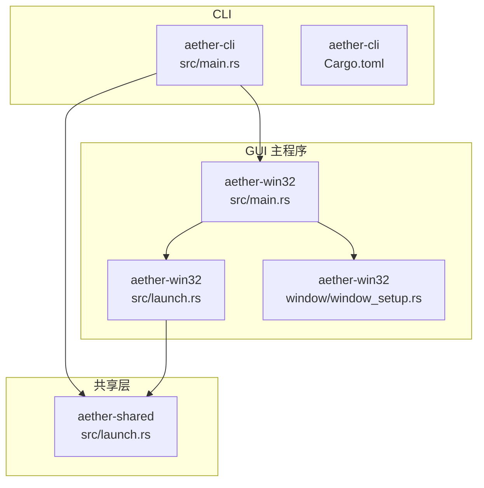
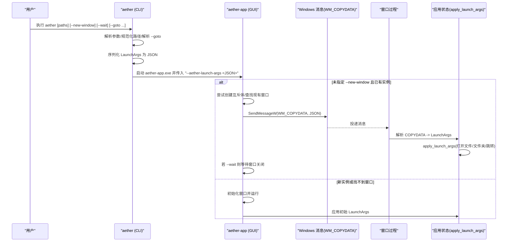
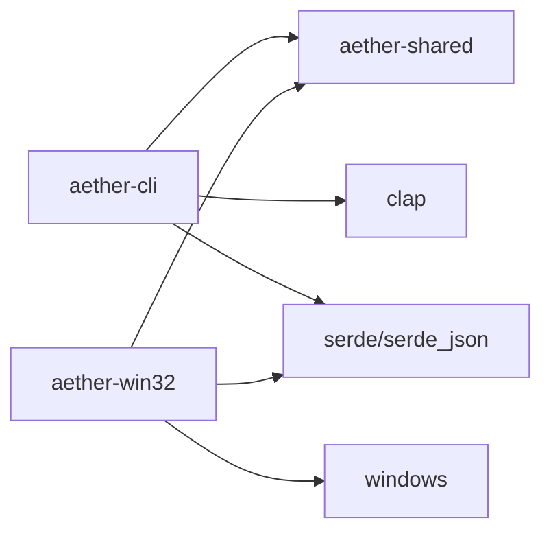

# 命令行接口

<cite>
**本文引用的文件**
- [crates/aether-cli/src/main.rs](file://crates/aether-cli/src/main.rs)
- [crates/aether-cli/Cargo.toml](file://crates/aether-cli/Cargo.toml)
- [crates/aether-shared/src/launch.rs](file://crates/aether-shared/src/launch.rs)
- [crates/aether-win32/src/main.rs](file://crates/aether-win32/src/main.rs)
- [crates/aether-win32/src/launch.rs](file://crates/aether-win32/src/launch.rs)
- [crates/aether-win32/src/window/window_setup.rs](file://crates/aether-win32/src/window/window_setup.rs)
- [README.md](file://README.md)
</cite>

## 目录
1. [简介](#简介)
2. [项目结构](#项目结构)
3. [核心组件](#核心组件)
4. [架构总览](#架构总览)
5. [详细组件分析](#详细组件分析)
6. [依赖关系分析](#依赖关系分析)
7. [性能与行为特性](#性能与行为特性)
8. [故障排查指南](#故障排查指南)
9. [结论](#结论)
10. [附录：命令速查与示例](#附录命令速查与示例)

## 简介
本文件为牧羊人编辑器（Aether Studio）的命令行接口文档，聚焦 aether CLI 工具。内容涵盖：
- 所有命令与参数选项的语法、必需/可选说明与使用场景
- 参数解析逻辑与错误处理机制
- 与 GUI 主程序的交互方式与进程间通信协议
- 丰富的使用示例，包括基本文件操作、批量处理与自动化脚本集成

aether CLI 负责解析用户输入，构造启动参数并启动 GUI 主程序；GUI 主程序支持单实例复用窗口、通过 Windows 消息传递接收参数并打开文件或定位行列。

## 项目结构
CLI 相关代码位于 crates/aether-cli，共享数据结构与解析逻辑位于 crates/aether-shared，GUI 主程序在 crates/aether-win32。

图表来源
- [crates/aether-cli/src/main.rs:1-133](file://crates/aether-cli/src/main.rs#L1-L133)
- [crates/aether-shared/src/launch.rs:1-154](file://crates/aether-shared/src/launch.rs#L1-L154)
- [crates/aether-win32/src/main.rs:1-26](file://crates/aether-win32/src/main.rs#L1-L26)
- [crates/aether-win32/src/launch.rs:1-106](file://crates/aether-win32/src/launch.rs#L1-L106)
- [crates/aether-win32/src/window/window_setup.rs:220-267](file://crates/aether-win32/src/window/window_setup.rs#L220-L267)

章节来源
- [crates/aether-cli/Cargo.toml:1-19](file://crates/aether-cli/Cargo.toml#L1-L19)
- [README.md:23-81](file://README.md#L23-L81)

## 核心组件
- CLI 入口与参数解析：定义命令名、位置参数与可选开关，构建 LaunchArgs 并启动 GUI 主程序。
- 共享启动参数模型：LaunchArgs、GotoPosition 及 goto 字符串解析器。
- GUI 主程序入口：解析 JSON 启动参数，实现单实例控制与窗口复用。
- 进程间通信：通过 WM_COPYDATA 将 JSON 序列化的 LaunchArgs 传递给已运行的 GUI 窗口。
- 应用启动参数应用：根据路径列表打开文件夹/文件，并根据 goto 定位行列。

章节来源
- [crates/aether-cli/src/main.rs:10-133](file://crates/aether-cli/src/main.rs#L10-L133)
- [crates/aether-shared/src/launch.rs:7-154](file://crates/aether-shared/src/launch.rs#L7-L154)
- [crates/aether-win32/src/main.rs:8-26](file://crates/aether-win32/src/main.rs#L8-L26)
- [crates/aether-win32/src/launch.rs:13-75](file://crates/aether-win32/src/launch.rs#L13-L75)
- [crates/aether-win32/src/window/window_setup.rs:220-267](file://crates/aether-win32/src/window/window_setup.rs#L220-L267)

## 架构总览
下图展示了从 CLI 到 GUI 的完整调用链与数据流。

图表来源
- [crates/aether-cli/src/main.rs:36-58](file://crates/aether-cli/src/main.rs#L36-L58)
- [crates/aether-win32/src/main.rs:8-26](file://crates/aether-win32/src/main.rs#L8-L26)
- [crates/aether-win32/src/launch.rs:13-75](file://crates/aether-win32/src/launch.rs#L13-L75)
- [crates/aether-win32/src/window/window_setup.rs:251-267](file://crates/aether-win32/src/window/window_setup.rs#L251-L267)

## 详细组件分析

### CLI 命令与参数
- 命令名：aether
- 位置参数：
  - paths: 一个或多个文件或文件夹路径（可重复）。用于打开文件或工作区。
- 可选参数：
  - --new-window: 强制打开新窗口，不复用已有窗口。
  - --wait: 等待编辑器关闭后再返回（仅在复用已有窗口时有效）。
  - --goto: 打开文件并定位，格式支持：
    - file.txt:行:列
    - file.txt:行
    - 行:列（配合 paths 中的首个文件生效）
    - 支持 Windows 绝对路径中包含冒号的情况（如 C:\...）

注意：
- 当 --goto 包含文件名时，该文件会被插入到路径列表最前面，确保优先加载并跳转。
- 相对路径会被规范化为绝对路径。

章节来源
- [crates/aether-cli/src/main.rs:10-27](file://crates/aether-cli/src/main.rs#L10-L27)
- [crates/aether-cli/src/main.rs:60-105](file://crates/aether-cli/src/main.rs#L60-L105)
- [crates/aether-shared/src/launch.rs:104-154](file://crates/aether-shared/src/launch.rs#L104-L154)

### 参数解析与错误处理
- 参数解析：
  - 使用 clap 解析 CLI 参数。
  - 使用共享模块 parse_goto 解析 --goto 字符串，返回（可选文件路径，位置）。
  - normalize_paths 将相对路径转为绝对路径。
- 错误处理：
  - 任何失败都会输出错误信息并以非零退出码结束。
  - 找不到 GUI 主程序会给出明确提示。
  - --goto 格式错误会返回具体错误原因。

章节来源
- [crates/aether-cli/src/main.rs:36-58](file://crates/aether-cli/src/main.rs#L36-L58)
- [crates/aether-cli/src/main.rs:81-105](file://crates/aether-cli/src/main.rs#L81-L105)
- [crates/aether-shared/src/launch.rs:75-154](file://crates/aether-shared/src/launch.rs#L75-L154)

### 与 GUI 主程序的交互
- 启动流程：
  - CLI 找到同目录下的 GUI 主程序（aether-app.exe 或 aether-app），以子进程方式启动。
  - 通过命令行参数 --aether-launch-args 传递 JSON 序列化的 LaunchArgs。
- 单实例与窗口复用：
  - GUI 主程序尝试创建全局互斥体判断是否已有实例。
  - 若非新窗口模式且存在已有窗口，则通过 WM_COPYDATA 发送 JSON 参数给已有窗口，当前进程可选择等待窗口关闭后退出。
- 进程间通信协议：
  - 传输载体：WM_COPYDATA 消息。
  - 载荷：UTF-16 编码的 JSON 字符串，内容为 LaunchArgs。
  - 接收端解析：parse_copydata_lparam 还原 LaunchArgs。
  - 返回值：copydata_result 指示是否成功处理。

章节来源
- [crates/aether-cli/src/main.rs:107-133](file://crates/aether-cli/src/main.rs#L107-L133)
- [crates/aether-win32/src/main.rs:8-26](file://crates/aether-win32/src/main.rs#L8-L26)
- [crates/aether-win32/src/launch.rs:13-75](file://crates/aether-win32/src/launch.rs#L13-L75)
- [crates/aether-win32/src/launch.rs:77-106](file://crates/aether-win32/src/launch.rs#L77-L106)

### GUI 对启动参数的应用
- 应用逻辑：
  - 遍历 paths：
    - 若为目录：打开为工作区。
    - 若为文件：先打开其父目录作为工作区，再加载文件到标签页。
  - 若提供 goto：
    - 目标文件优先选择第一个被加载的文件；若无则回退到 paths 的第一个元素。
    - 若目标文件存在，调用跳转至指定行列。
  - 标记全窗口脏区域触发重绘。

章节来源
- [crates/aether-win32/src/window/window_setup.rs:220-249](file://crates/aether-win32/src/window/window_setup.rs#L220-L249)
- [crates/aether-win32/src/window/window_setup.rs:251-267](file://crates/aether-win32/src/window/window_setup.rs#L251-L267)

## 依赖关系分析
- CLI 依赖：
  - clap 用于参数解析。
  - serde/serde_json 用于序列化 LaunchArgs。
  - anyhow 用于错误包装。
  - aether-shared 提供 LaunchArgs/GotoPosition 与 parse_goto。
- GUI 依赖：
  - windows crate 用于 Win32 API（互斥体、窗口查找、消息发送）。
  - serde/serde_json 用于反序列化 JSON。
  - aether-shared 提供 LaunchArgs/GotoPosition。

图表来源
- [crates/aether-cli/Cargo.toml:13-19](file://crates/aether-cli/Cargo.toml#L13-L19)
- [crates/aether-win32/src/launch.rs:1-10](file://crates/aether-win32/src/launch.rs#L1-L10)

章节来源
- [crates/aether-cli/Cargo.toml:1-19](file://crates/aether-cli/Cargo.toml#L1-L19)
- [crates/aether-win32/src/launch.rs:1-10](file://crates/aether-win32/src/launch.rs#L1-L10)

## 性能与行为特性
- 进程启动开销：CLI 每次调用都会尝试启动 GUI 子进程；若启用单实例复用，则通过 WM_COPYDATA 快速传递参数，避免重复启动。
- 同步等待：--wait 模式下，CLI 会阻塞直到目标窗口关闭，适合需要顺序执行的脚本。
- 路径规范化：相对路径转换为绝对路径，减少后续 IO 不确定性。
- 渲染优化：GUI 侧应用启动参数后仅标记脏区域，由消息循环触发 WM_PAINT，避免直接重绘带来的额外开销。

[本节为通用指导，无需源码引用]

## 故障排查指南
- 找不到 GUI 主程序：
  - 现象：CLI 报错提示找不到 aether-app。
  - 原因：CLI 与 GUI 不在同一目录。
  - 解决：确保 aether 与 aether-app 在同一目录。
- --goto 参数错误：
  - 现象：解析失败，提示格式错误或行号为 0。
  - 原因：--goto 不符合“行”或“行:列”，或包含非法字符。
  - 解决：修正为合法格式，例如 10:5 或 file.txt:10:5。
- 单实例冲突：
  - 现象：多次调用只在一个窗口中打开。
  - 解释：这是预期行为；如需多窗口请使用 --new-window。
- 等待超时或无响应：
  - 现象：--wait 模式下 CLI 一直不退出。
  - 原因：目标窗口未关闭或句柄无效。
  - 解决：检查 GUI 是否正常显示与关闭；必要时移除 --wait。

章节来源
- [crates/aether-cli/src/main.rs:107-133](file://crates/aether-cli/src/main.rs#L107-L133)
- [crates/aether-shared/src/launch.rs:75-154](file://crates/aether-shared/src/launch.rs#L75-L154)
- [crates/aether-win32/src/main.rs:8-26](file://crates/aether-win32/src/main.rs#L8-L26)

## 结论
aether CLI 提供了简洁而强大的命令行入口，能够：
- 打开文件或文件夹
- 定位到指定行列
- 控制窗口复用与新窗口
- 支持等待模式以便脚本编排
结合 GUI 的单实例与 WM_COPYDATA 通信机制，实现了高效、稳定的跨进程协作体验。

[本节为总结性内容，无需源码引用]

## 附录：命令速查与示例

### 语法总览
- 基本语法：
  - aether [路径...] [--new-window] [--wait] [--goto 值]
- 参数说明：
  - 路径：文件或文件夹，可重复。
  - --new-window：强制新窗口。
  - --wait：等待窗口关闭后退出。
  - --goto：支持 file:行:列、file:行、行:列。

### 使用示例
- 打开单个文件：
  - aether src/main.rs
- 打开多个文件：
  - aether src/main.rs src/lib.rs
- 打开文件夹作为工作区：
  - aether ./project
- 打开文件并定位到第 10 行第 5 列：
  - aether src/main.rs --goto 10:5
- 打开指定文件的特定行列（含文件名）：
  - aether --goto src/main.rs:10:5
- 强制新窗口：
  - aether src/main.rs --new-window
- 等待窗口关闭后退出（适用于批处理）：
  - aether src/main.rs --wait

### 与 GUI 的交互要点
- 默认复用已有窗口；如需多窗口请显式使用 --new-window。
- --wait 仅在复用窗口时有效，CLI 会轮询窗口是否存在直至关闭。
- 进程间通信采用 WM_COPYDATA 传递 JSON 形式的 LaunchArgs。

章节来源
- [crates/aether-cli/src/main.rs:10-27](file://crates/aether-cli/src/main.rs#L10-L27)
- [crates/aether-cli/src/main.rs:36-58](file://crates/aether-cli/src/main.rs#L36-L58)
- [crates/aether-win32/src/main.rs:8-26](file://crates/aether-win32/src/main.rs#L8-L26)
- [crates/aether-win32/src/launch.rs:13-75](file://crates/aether-win32/src/launch.rs#L13-L75)
- [README.md:76-81](file://README.md#L76-L81)