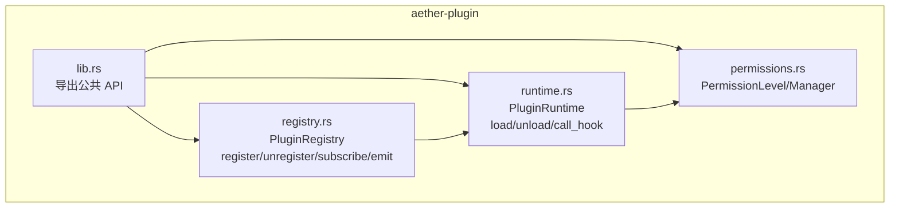
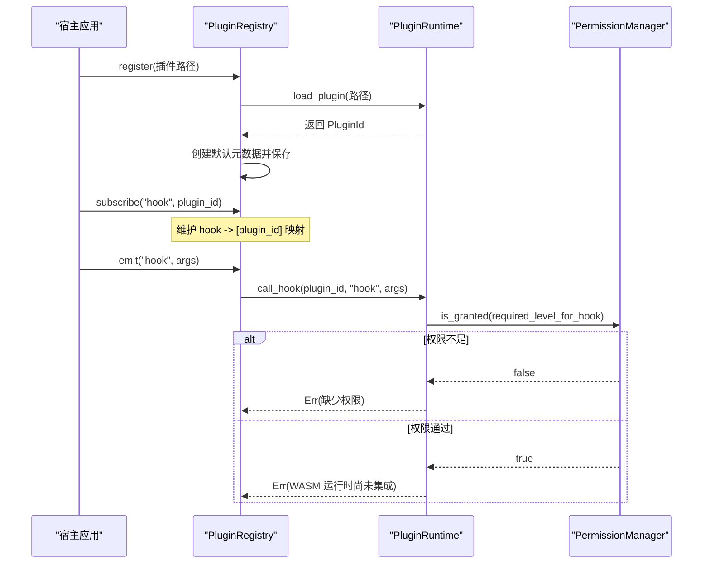
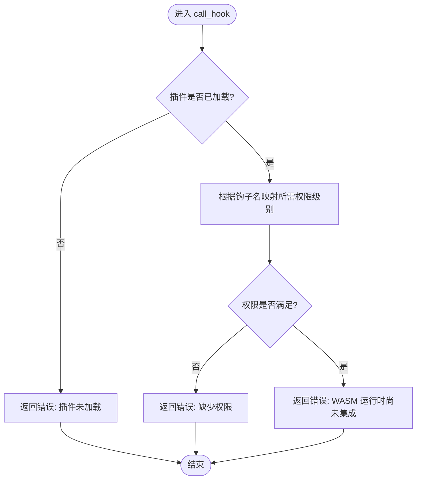
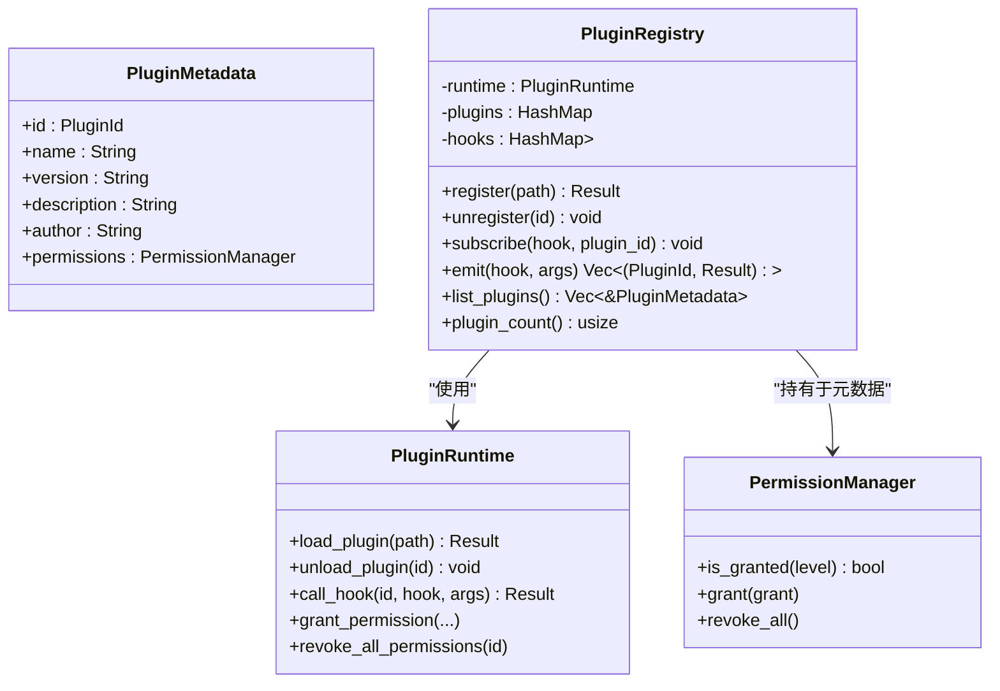
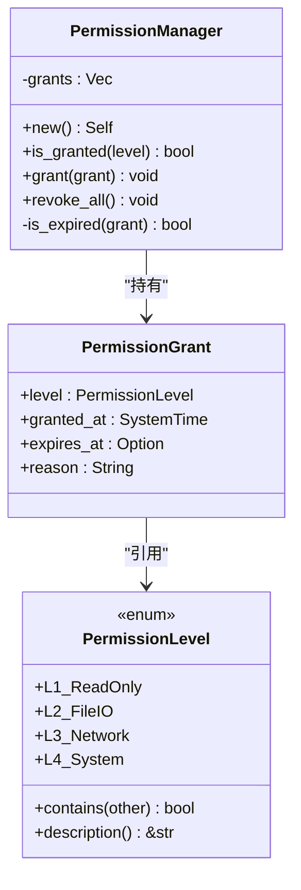
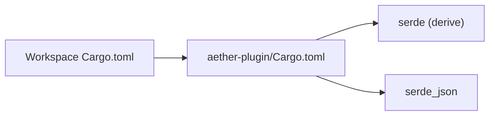

# WASM 运行时接口

<cite>
**本文引用的文件**
- [crates/aether-plugin/src/lib.rs](file://crates/aether-plugin/src/lib.rs)
- [crates/aether-plugin/src/runtime.rs](file://crates/aether-plugin/src/runtime.rs)
- [crates/aether-plugin/src/registry.rs](file://crates/aether-plugin/src/registry.rs)
- [crates/aether-plugin/src/permissions.rs](file://crates/aether-plugin/src/permissions.rs)
- [Cargo.toml](file://Cargo.toml)
- [crates/aether-plugin/Cargo.toml](file://crates/aether-plugin/Cargo.toml)
</cite>

## 目录
1. [简介](#简介)
2. [项目结构](#项目结构)
3. [核心组件](#核心组件)
4. [架构总览](#架构总览)
5. [详细组件分析](#详细组件分析)
6. [依赖关系分析](#依赖关系分析)
7. [性能与资源限制](#性能与资源限制)
8. [安全与隔离机制](#安全与隔离机制)
9. [插件开发指南](#插件开发指南)
10. [故障排查](#故障排查)
11. [结论](#结论)

## 简介
本文件面向“牧羊人编辑器”的插件开发者，系统化说明当前仓库中已实现的 WASM 插件运行时接口与权限模型。需要特别说明的是：当前 aether-plugin 模块提供的是“架构占位实现”，已完成插件加载、元数据管理、事件钩子分发与细粒度权限控制等骨架逻辑；实际的 WASM 函数调用尚未集成（注释明确标注需要 wasmtime 依赖）。因此，本文档在描述“WASM 运行时接口”时，会严格区分“已实现能力”和“待实现能力”，并给出后续扩展建议与集成路径。

## 项目结构
aether-plugin 模块位于 crates/aether-plugin，包含以下关键源文件：
- lib.rs：对外暴露公共类型与模块
- runtime.rs：插件生命周期与钩子调用入口（占位）
- registry.rs：插件注册表与事件订阅/触发
- permissions.rs：权限级别与授权记录

图表来源
- [crates/aether-plugin/src/lib.rs:1-8](file://crates/aether-plugin/src/lib.rs#L1-L8)
- [crates/aether-plugin/src/runtime.rs:16-21](file://crates/aether-plugin/src/runtime.rs#L16-L21)
- [crates/aether-plugin/src/registry.rs:19-23](file://crates/aether-plugin/src/registry.rs#L19-L23)
- [crates/aether-plugin/src/permissions.rs:8-13](file://crates/aether-plugin/src/permissions.rs#L8-L13)

章节来源
- [crates/aether-plugin/src/lib.rs:1-8](file://crates/aether-plugin/src/lib.rs#L1-L8)
- [crates/aether-plugin/src/runtime.rs:16-21](file://crates/aether-plugin/src/runtime.rs#L16-L21)
- [crates/aether-plugin/src/registry.rs:19-23](file://crates/aether-plugin/src/registry.rs#L19-L23)
- [crates/aether-plugin/src/permissions.rs:8-13](file://crates/aether-plugin/src/permissions.rs#L8-L13)

## 核心组件
- PluginId：插件唯一标识，用于在运行时跟踪每个插件实例。
- PluginRuntime：插件运行时，负责加载/卸载 WASM 插件、授予/撤销权限、按钩子名称进行权限校验与调用（当前为占位）。
- PluginRegistry：插件注册表，维护插件元数据、订阅关系，并提供 emit 统一触发钩子。
- PermissionLevel/PermissionManager：权限级别与授权管理器，支持 L1~L4 分级与过期时间控制。

章节来源
- [crates/aether-plugin/src/runtime.rs:10-21](file://crates/aether-plugin/src/runtime.rs#L10-L21)
- [crates/aether-plugin/src/registry.rs:7-23](file://crates/aether-plugin/src/registry.rs#L7-L23)
- [crates/aether-plugin/src/permissions.rs:8-13](file://crates/aether-plugin/src/permissions.rs#L8-L13)
- [crates/aether-plugin/src/permissions.rs:58-94](file://crates/aether-plugin/src/permissions.rs#L58-L94)

## 架构总览
整体流程围绕“注册表 + 运行时 + 权限”三层展开：
- 注册表负责插件发现与订阅关系维护
- 运行时负责插件加载、权限检查与钩子调用（当前未接入 WASM 引擎）
- 权限系统对每次钩子调用进行最小权限校验

图表来源
- [crates/aether-plugin/src/registry.rs:35-54](file://crates/aether-plugin/src/registry.rs#L35-L54)
- [crates/aether-plugin/src/registry.rs:68-91](file://crates/aether-plugin/src/registry.rs#L68-L91)
- [crates/aether-plugin/src/runtime.rs:60-87](file://crates/aether-plugin/src/runtime.rs#L60-L87)
- [crates/aether-plugin/src/runtime.rs:132-157](file://crates/aether-plugin/src/runtime.rs#L132-L157)
- [crates/aether-plugin/src/permissions.rs:68-72](file://crates/aether-plugin/src/permissions.rs#L68-L72)

## 详细组件分析

### 插件运行时（PluginRuntime）
职责
- 验证 WASM 文件格式与大小（魔数校验、最大体积限制）
- 分配并维护插件 ID
- 为新加载插件授予默认最低权限（只读）
- 根据钩子名判定所需权限级别并进行校验
- 调用钩子（当前返回“未集成”错误，避免误判成功）

关键行为
- 加载前校验：存在性、魔数、大小上限
- 权限默认策略：新插件仅拥有 L1_ReadOnly
- 钩子权限映射：不同钩子对应不同权限级别（如 on_save/write_file 需 L2_FileIO）
- 调用失败语义：即使权限通过，也返回“未集成”错误，确保上层能感知真实状态

图表来源
- [crates/aether-plugin/src/runtime.rs:132-157](file://crates/aether-plugin/src/runtime.rs#L132-L157)
- [crates/aether-plugin/src/runtime.rs:160-175](file://crates/aether-plugin/src/runtime.rs#L160-L175)

章节来源
- [crates/aether-plugin/src/runtime.rs:34-57](file://crates/aether-plugin/src/runtime.rs#L34-L57)
- [crates/aether-plugin/src/runtime.rs:60-87](file://crates/aether-plugin/src/runtime.rs#L60-L87)
- [crates/aether-plugin/src/runtime.rs:132-157](file://crates/aether-plugin/src/runtime.rs#L132-L157)
- [crates/aether-plugin/src/runtime.rs:160-175](file://crates/aether-plugin/src/runtime.rs#L160-L175)

### 插件注册表（PluginRegistry）
职责
- 注册/卸载插件，维护插件元数据
- 维护钩子订阅关系
- 统一触发钩子，收集各插件结果

关键行为
- 注册时自动加载插件并赋予默认权限
- 注销时清理插件、元数据与所有订阅关系
- emit 遍历订阅者，逐个调用运行时钩子并收集结果

图表来源
- [crates/aether-plugin/src/registry.rs:7-23](file://crates/aether-plugin/src/registry.rs#L7-L23)
- [crates/aether-plugin/src/registry.rs:35-91](file://crates/aether-plugin/src/registry.rs#L35-L91)
- [crates/aether-plugin/src/runtime.rs:16-21](file://crates/aether-plugin/src/runtime.rs#L16-L21)
- [crates/aether-plugin/src/permissions.rs:58-94](file://crates/aether-plugin/src/permissions.rs#L58-L94)

章节来源
- [crates/aether-plugin/src/registry.rs:35-91](file://crates/aether-plugin/src/registry.rs#L35-L91)
- [crates/aether-plugin/src/registry.rs:94-102](file://crates/aether-plugin/src/registry.rs#L94-L102)

### 权限系统（PermissionLevel / PermissionManager）
职责
- 定义 L1~L4 四级权限，支持层级包含关系
- 管理授权记录，支持过期时间与原因记录
- 提供 is_granted 判断与 revoke_all 清理

关键行为
- contains 显式匹配，避免枚举变体重排导致静默破坏
- is_expired 同时校验 granted_at 与 expires_at，防止未来授予或过去过期
- 默认授予策略：新插件仅获得 L1_ReadOnly

图表来源
- [crates/aether-plugin/src/permissions.rs:8-13](file://crates/aether-plugin/src/permissions.rs#L8-L13)
- [crates/aether-plugin/src/permissions.rs:48-54](file://crates/aether-plugin/src/permissions.rs#L48-L54)
- [crates/aether-plugin/src/permissions.rs:58-94](file://crates/aether-plugin/src/permissions.rs#L58-L94)

章节来源
- [crates/aether-plugin/src/permissions.rs:15-44](file://crates/aether-plugin/src/permissions.rs#L15-L44)
- [crates/aether-plugin/src/permissions.rs:68-94](file://crates/aether-plugin/src/permissions.rs#L68-L94)

## 依赖关系分析
- 顶层工作区 Cargo.toml 声明了 aether-plugin 作为成员之一
- aether-plugin 包依赖 serde 与 serde_json，用于序列化/反序列化钩子参数与返回值
- 当前未引入 wasmtime/wasm-bindgen 等 WASM 运行时依赖（注释明确指出需要 wasmtime 依赖）

图表来源
- [Cargo.toml:1-14](file://Cargo.toml#L1-L14)
- [crates/aether-plugin/Cargo.toml:1-9](file://crates/aether-plugin/Cargo.toml#L1-L9)

章节来源
- [Cargo.toml:1-14](file://Cargo.toml#L1-L14)
- [crates/aether-plugin/Cargo.toml:1-9](file://crates/aether-plugin/Cargo.toml#L1-L9)

## 性能与资源限制
- 插件文件大小限制：加载前校验最大体积（常量 MAX_PLUGIN_SIZE），防止过大文件影响内存与 I/O
- 插件 ID 溢出保护：当 u32::MAX 耗尽时拒绝加载，避免 ID 冲突
- 权限检查开销：每次钩子调用都会进行权限判定，但数据结构简单，开销可控
- 钩子调用现状：由于 WASM 未集成，当前 call_hook 直接返回错误，无实际执行成本

章节来源
- [crates/aether-plugin/src/runtime.rs:6-7](file://crates/aether-plugin/src/runtime.rs#L6-L7)
- [crates/aether-plugin/src/runtime.rs:34-57](file://crates/aether-plugin/src/runtime.rs#L34-L57)
- [crates/aether-plugin/src/runtime.rs:60-87](file://crates/aether-plugin/src/runtime.rs#L60-L87)

## 安全与隔离机制
- 最小权限原则：新加载插件仅授予 L1_ReadOnly，其他敏感操作需显式授权
- 权限层级包含：L4 包含所有，L3 包含 L3/L2/L1，L2 包含 L2/L1，L1 仅自身
- 过期时间控制：授权可设置 expires_at，且不允许过去时间或未来授予时间
- 钩子权限映射：不同钩子要求不同权限级别，未知钩子默认要求 L1（最安全）
- 沙箱隔离现状：当前未集成 WASM 引擎，实际代码隔离由运行时层承担（待 wasmtime 集成后生效）

章节来源
- [crates/aether-plugin/src/permissions.rs:15-44](file://crates/aether-plugin/src/permissions.rs#L15-L44)
- [crates/aether-plugin/src/permissions.rs:84-93](file://crates/aether-plugin/src/permissions.rs#L84-L93)
- [crates/aether-plugin/src/runtime.rs:160-175](file://crates/aether-plugin/src/runtime.rs#L160-L175)
- [crates/aether-plugin/src/runtime.rs:132-157](file://crates/aether-plugin/src/runtime.rs#L132-L157)

## 插件开发指南
注意：当前仓库未提供完整的 WASM 插件 SDK 与示例代码，以下为基于现有接口的开发指引与后续集成建议。

- 编译目标与工具链
  - 目标平台：wasm32-unknown-unknown（标准 WASM 目标）
  - 构建工具：cargo build --target wasm32-unknown-unknown
  - 产物：*.wasm 二进制文件，需符合 WASM 魔数校验

- 依赖管理
  - 若采用 Rust 编写插件，建议使用 wasm-bindgen 暴露函数到 JS 或直接导出原生符号（取决于宿主集成方式）
  - 当前宿主未引入 wasmtime，需在宿主侧添加相应依赖以加载与执行插件

- 数据类型与序列化协议
  - 宿主侧钩子参数与返回值使用 serde_json::Value 传递
  - 插件侧应约定 JSON 结构，确保与宿主一致
  - 建议在插件文档中明确字段含义、必填项与取值范围

- 同步与异步通信
  - 当前 emit 为同步遍历调用，阻塞主线程风险需关注
  - 后续可在宿主侧引入任务队列或异步调度，避免 UI 卡顿

- 权限申请与生命周期
  - 插件按需申请更高权限（如 L2_FileIO、L3_Network、L4_System）
  - 合理设置授权过期时间，降低长期驻留风险

- 性能优化技巧
  - 减少大对象频繁序列化/反序列化
  - 批量处理钩子事件，合并多次调用
  - 避免在热路径中进行文件系统或网络 IO

- 第一个插件示例（概念步骤）
  - 新建 Rust 工程，配置 wasm32-unknown-unknown 目标
  - 导出若干函数，遵循宿主约定的 JSON 输入输出格式
  - 构建生成 *.wasm
  - 将插件路径交给宿主注册表 register
  - 通过 subscribe 订阅所需钩子
  - 触发 emit 测试回调

[本节为概念性指导，不直接分析具体源码文件]

## 故障排查
常见问题与定位要点：
- 插件文件不存在：加载前会检查路径存在性
- 非有效 WASM 格式：魔数校验失败
- 插件文件过大：超过 MAX_PLUGIN_SIZE 被拒绝
- 权限不足：钩子调用返回“缺少权限”错误
- WASM 未集成：即使权限通过，仍返回“WASM 运行时尚未集成”错误

章节来源
- [crates/aether-plugin/src/runtime.rs:60-87](file://crates/aether-plugin/src/runtime.rs#L60-L87)
- [crates/aether-plugin/src/runtime.rs:132-157](file://crates/aether-plugin/src/runtime.rs#L132-L157)

## 结论
当前 aether-plugin 模块提供了完善的插件生命周期与权限控制骨架，明确了钩子命名与权限映射规则，并通过注册表统一管理插件与事件。由于 WASM 引擎尚未集成，call_hook 目前返回“未集成”错误，这为后续接入 wasmtime 预留了清晰的扩展点。下一步建议：
- 在宿主侧引入 wasmtime 依赖，完成插件加载与函数调用
- 定义稳定的插件 ABI（函数签名、JSON 协议）
- 完善异步调度与资源配额控制，提升安全性与性能

[本节为总结性内容，不直接分析具体源码文件]