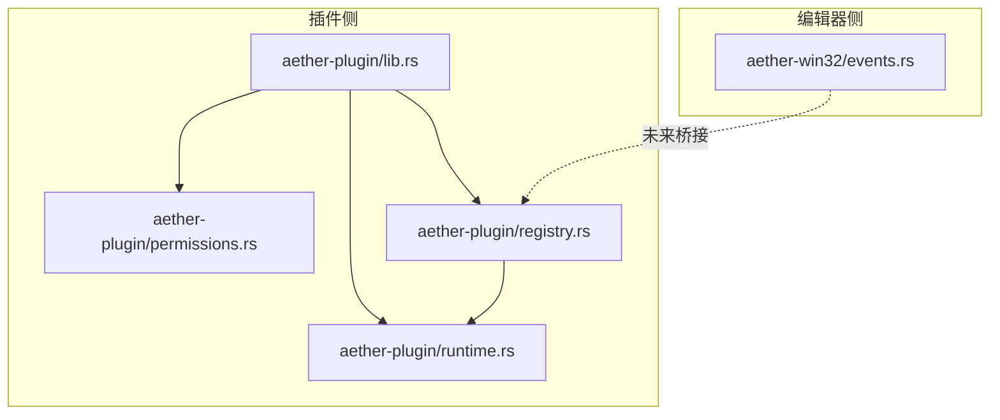
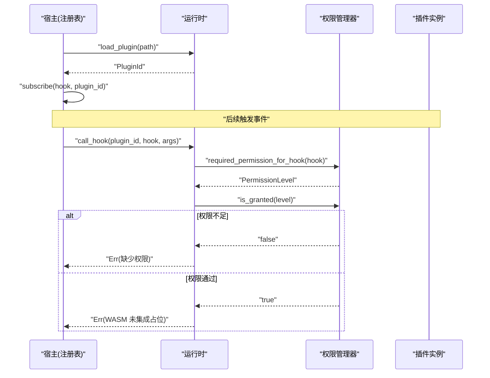
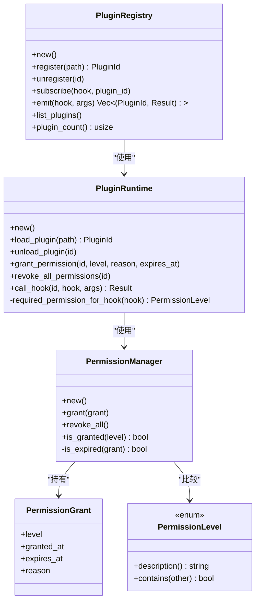
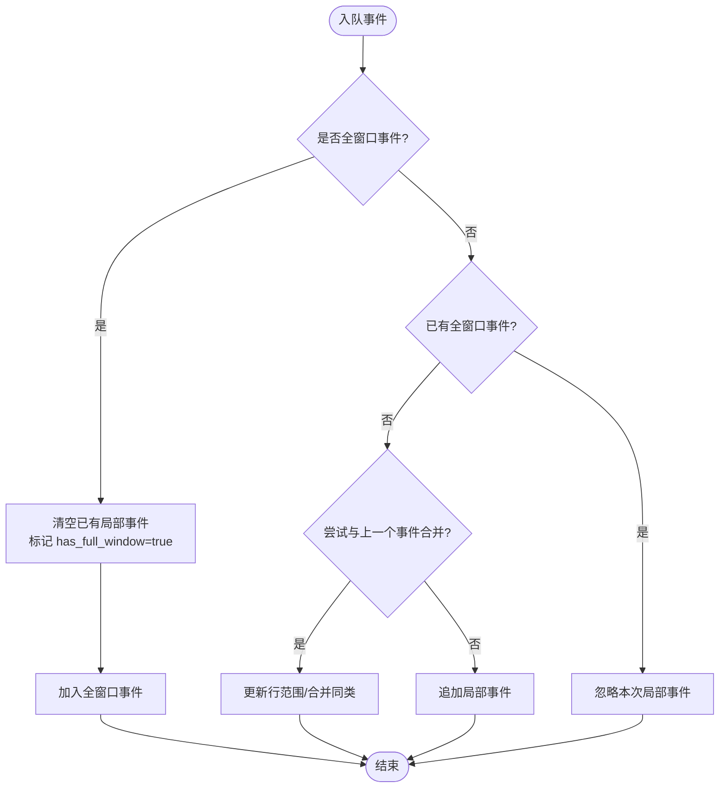

# 事件钩子系统

<cite>
**本文引用的文件**
- [crates/aether-plugin/src/lib.rs](file://crates/aether-plugin/src/lib.rs)
- [crates/aether-plugin/src/permissions.rs](file://crates/aether-plugin/src/permissions.rs)
- [crates/aether-plugin/src/registry.rs](file://crates/aether-plugin/src/registry.rs)
- [crates/aether-plugin/src/runtime.rs](file://crates/aether-plugin/src/runtime.rs)
- [crates/aether-win32/src/events.rs](file://crates/aether-win32/src/events.rs)
</cite>

## 目录
1. [简介](#简介)
2. [项目结构](#项目结构)
3. [核心组件](#核心组件)
4. [架构总览](#架构总览)
5. [详细组件分析](#详细组件分析)
6. [依赖关系分析](#依赖关系分析)
7. [性能考量](#性能考量)
8. [故障排查指南](#故障排查指南)
9. [结论](#结论)
10. [附录](#附录)

## 简介
本文件面向插件开发者，系统化说明牧羊人编辑器的事件钩子系统。内容涵盖：
- 插件可监听与响应的事件类型（文件操作、编辑、UI 交互、系统）
- 事件注册机制（订阅/触发）、参数配置与过滤规则
- 事件处理函数的执行模型与错误处理策略
- 不同类型事件的触发时机与数据格式
- 典型场景示例（保存监听、文本变更响应、输入拦截等）
- 性能优化技巧与最佳实践

注意：当前仓库中“插件钩子”的运行时集成处于占位阶段，权限校验已实现，WASM 调用尚未接入；同时存在一套内部“编辑器事件总线”，用于 UI 渲染批处理与脏区域合并。两者职责不同，下文将分别阐述并给出映射关系。

## 项目结构
与事件钩子系统直接相关的代码位于两个 crate：
- aether-plugin：插件生命周期、权限控制、钩子注册与分发（面向插件侧）
- aether-win32：编辑器内部事件总线（面向 UI 渲染层）

图表来源
- [crates/aether-plugin/src/lib.rs:1-8](file://crates/aether-plugin/src/lib.rs#L1-L8)
- [crates/aether-plugin/src/permissions.rs:1-94](file://crates/aether-plugin/src/permissions.rs#L1-L94)
- [crates/aether-plugin/src/registry.rs:17-91](file://crates/aether-plugin/src/registry.rs#L17-L91)
- [crates/aether-plugin/src/runtime.rs:16-181](file://crates/aether-plugin/src/runtime.rs#L16-L181)
- [crates/aether-win32/src/events.rs:1-64](file://crates/aether-win32/src/events.rs#L1-L64)

章节来源
- [crates/aether-plugin/src/lib.rs:1-8](file://crates/aether-plugin/src/lib.rs#L1-L8)
- [crates/aether-plugin/src/registry.rs:17-91](file://crates/aether-plugin/src/registry.rs#L17-L91)
- [crates/aether-plugin/src/runtime.rs:16-181](file://crates/aether-plugin/src/runtime.rs#L16-L181)
- [crates/aether-win32/src/events.rs:1-64](file://crates/aether-win32/src/events.rs#L1-L64)

## 核心组件
- 权限级别与授权记录：定义 L1~L4 四级权限，支持过期时间、授予原因等元信息，提供包含关系判断与有效性检查。
- 插件运行时：负责加载/卸载插件、权限授予与撤销、按钩子名判定所需权限级别、调用钩子（当前为占位）。
- 插件注册表：维护插件集合与钩子订阅关系，负责向所有订阅者广播事件（emit），收集每个插件的执行结果。
- 编辑器事件总线：定义 EditorEvent 枚举与 EventQueue，对高频 UI 事件进行批量入队、同类合并、全窗口降级与脏区域映射。

章节来源
- [crates/aether-plugin/src/permissions.rs:1-94](file://crates/aether-plugin/src/permissions.rs#L1-L94)
- [crates/aether-plugin/src/runtime.rs:16-181](file://crates/aether-plugin/src/runtime.rs#L16-L181)
- [crates/aether-plugin/src/registry.rs:17-91](file://crates/aether-plugin/src/registry.rs#L17-L91)
- [crates/aether-win32/src/events.rs:1-64](file://crates/aether-win32/src/events.rs#L1-L64)

## 架构总览
下图展示插件钩子从注册到触发的完整流程，以及权限校验与结果收集路径。

图表来源
- [crates/aether-plugin/src/registry.rs:67-91](file://crates/aether-plugin/src/registry.rs#L67-L91)
- [crates/aether-plugin/src/runtime.rs:132-175](file://crates/aether-plugin/src/runtime.rs#L132-L175)
- [crates/aether-plugin/src/permissions.rs:62-94](file://crates/aether-plugin/src/permissions.rs#L62-L94)

## 详细组件分析

### 插件钩子系统（面向插件）
- 钩子命名与权限映射
  - 只读类：on_activate、on_deactivate、get_theme、get_language → L1_ReadOnly
  - 文件类：on_save、on_open、read_file、write_file → L2_FileIO
  - 网络类：fetch、http_request、websocket → L3_Network
  - 系统类：exec、spawn、shell、run_command → L4_System
  - 未知钩子默认要求 L1_ReadOnly（最小权限原则）
- 订阅与触发
  - 订阅：通过注册表的 subscribe(hook, plugin_id) 完成
  - 触发：emit(hook, args) 遍历订阅者，逐个调用 call_hook，返回 (plugin_id, Result<Value, String>) 列表
- 异步执行模型
  - 当前 emit 同步遍历调用 call_hook，无并发调度；WASM 调用为占位实现，实际执行需后续集成
- 错误处理策略
  - 权限不足：返回明确错误，包含缺失的权限级别
  - 插件未加载：返回未加载错误
  - WASM 未集成：即使权限通过也返回“无法执行：WASM 运行时尚未集成”的错误，避免误判成功
- 事件过滤规则
  - 基于钩子名与权限级别的匹配；注册表不内置语义过滤，可在上层根据 args 字段做二次筛选

图表来源
- [crates/aether-plugin/src/permissions.rs:1-94](file://crates/aether-plugin/src/permissions.rs#L1-L94)
- [crates/aether-plugin/src/runtime.rs:16-181](file://crates/aether-plugin/src/runtime.rs#L16-L181)
- [crates/aether-plugin/src/registry.rs:17-91](file://crates/aether-plugin/src/registry.rs#L17-L91)

章节来源
- [crates/aether-plugin/src/runtime.rs:159-175](file://crates/aether-plugin/src/runtime.rs#L159-L175)
- [crates/aether-plugin/src/registry.rs:67-91](file://crates/aether-plugin/src/registry.rs#L67-L91)
- [crates/aether-plugin/src/permissions.rs:1-94](file://crates/aether-plugin/src/permissions.rs#L1-L94)

### 编辑器事件总线（面向 UI 渲染）
- 事件类型
  - 文本变化、光标移动、选择变化、滚动偏移变化
  - 标签页变化、侧边栏变化、右侧面板变化、底部面板变化、状态栏变化
  - 窗口尺寸/DPI 变化、查找替换面板变化、对话框显示/隐藏
- 事件队列与合并
  - 同帧内批量入队，自动合并连续同类事件（如多次滚动/光标移动/选择变化）
  - 文本变化会合并行范围，减少重绘区域
  - 全窗口事件会清空局部事件并标记全窗口重绘
- 脏区域映射
  - 每种事件映射到对应的 DirtyRegionType，最终由 DirtyRectTracker 计算需要重绘的区域

图表来源
- [crates/aether-win32/src/events.rs:84-143](file://crates/aether-win32/src/events.rs#L84-L143)

章节来源
- [crates/aether-win32/src/events.rs:10-64](file://crates/aether-win32/src/events.rs#L10-L64)
- [crates/aether-win32/src/events.rs:84-143](file://crates/aether-win32/src/events.rs#L84-L143)

## 依赖关系分析
- 插件侧
  - registry 依赖 runtime 与 permissions
  - runtime 依赖 permissions 进行权限判定
  - 三者共同构成“钩子注册—权限校验—调用分发”的最小闭环
- 编辑器侧
  - events 模块独立于插件侧，专注于 UI 渲染批处理与脏区域计算
  - 未来可通过注册表将编辑器事件桥接到插件钩子（例如 TextChanged → on_text_change）

图表来源
- [crates/aether-plugin/src/registry.rs:17-91](file://crates/aether-plugin/src/registry.rs#L17-L91)
- [crates/aether-plugin/src/runtime.rs:16-181](file://crates/aether-plugin/src/runtime.rs#L16-L181)
- [crates/aether-plugin/src/permissions.rs:1-94](file://crates/aether-plugin/src/permissions.rs#L1-L94)
- [crates/aether-win32/src/events.rs:1-64](file://crates/aether-win32/src/events.rs#L1-L64)

章节来源
- [crates/aether-plugin/src/registry.rs:17-91](file://crates/aether-plugin/src/registry.rs#L17-L91)
- [crates/aether-plugin/src/runtime.rs:16-181](file://crates/aether-plugin/src/runtime.rs#L16-L181)
- [crates/aether-plugin/src/permissions.rs:1-94](file://crates/aether-plugin/src/permissions.rs#L1-L94)
- [crates/aether-win32/src/events.rs:1-64](file://crates/aether-win32/src/events.rs#L1-L64)

## 性能考量
- 插件钩子
  - 当前 emit 为同步遍历，建议在高并发场景下引入任务队列或线程池，避免阻塞主循环
  - 对高频事件（如文本变更）应限制插件处理频率，采用节流/去抖策略
  - 谨慎在钩子中进行 I/O 或网络请求，必要时异步化并尽快返回
- 编辑器事件总线
  - 利用事件合并与全窗口降级，显著降低重绘次数
  - 合理设置初始容量与扩容策略，减少内存分配抖动
  - 将事件转换为矩形时尽量复用缓冲区，避免频繁分配

[本节为通用指导，无需源码引用]

## 故障排查指南
- 常见错误与定位
  - “缺少执行/权限不足”：检查插件是否被授予对应权限级别（L1~L4）
  - “插件未加载”：确认插件已成功 load_plugin 且未被 unload
  - “WASM 运行时尚未集成”：当前为占位实现，需集成 wasmtime 后才能真正执行钩子
- 调试建议
  - 打印 emit 返回的结果列表，逐条检查每个插件的 Err 信息
  - 核对 required_permission_for_hook 的映射是否符合预期
  - 对于 UI 相关异常，结合 EventQueue 的 len/is_empty 与脏区域统计定位问题

章节来源
- [crates/aether-plugin/src/runtime.rs:132-175](file://crates/aether-plugin/src/runtime.rs#L132-L175)
- [crates/aether-plugin/src/registry.rs:75-91](file://crates/aether-plugin/src/registry.rs#L75-L91)

## 结论
- 插件钩子系统已完成权限框架与注册分发骨架，具备安全边界与可扩展性
- 编辑器事件总线提供了高性能的 UI 事件批处理与脏区域合并能力
- 下一步重点在于：
  - 集成 WASM 运行时以真实执行插件钩子
  - 建立编辑器事件到插件钩子的桥接层
  - 完善异步执行模型与错误传播机制
  - 补充更多预定义钩子与文档化的事件数据格式

[本节为总结，无需源码引用]

## 附录

### 事件类型与触发时机（插件钩子）
- 文件操作
  - on_save：用户触发保存或自动保存前
  - on_open：打开文件后
  - read_file/write_file：读取/写入文件
- 编辑与 UI
  - on_activate/on_deactivate：插件激活/停用
  - get_theme/get_language：查询主题/语言信息
- 系统与网络
  - fetch/http_request/websocket：网络访问
  - exec/spawn/shell/run_command：系统命令执行

章节来源
- [crates/aether-plugin/src/runtime.rs:159-175](file://crates/aether-plugin/src/runtime.rs#L159-L175)

### 事件注册与过滤
- 注册
  - 通过注册表 subscribe(hook, plugin_id) 完成
- 触发
  - emit(hook, args) 遍历订阅者并调用 call_hook
- 过滤
  - 基于钩子名与权限级别；上层可按 args 字段进行二次过滤

章节来源
- [crates/aether-plugin/src/registry.rs:67-91](file://crates/aether-plugin/src/registry.rs#L67-L91)
- [crates/aether-plugin/src/runtime.rs:132-175](file://crates/aether-plugin/src/runtime.rs#L132-L175)

### 事件处理函数执行模型与错误处理
- 执行模型
  - 当前同步遍历；后续可改为异步任务队列
- 错误处理
  - 权限不足：返回包含所需权限级别的错误
  - 插件未加载：返回未加载错误
  - WASM 未集成：返回“无法执行：WASM 运行时尚未集成”的错误

章节来源
- [crates/aether-plugin/src/runtime.rs:132-175](file://crates/aether-plugin/src/runtime.rs#L132-L175)

### 事件数据格式（示例约定）
- on_save
  - 输入：{ "file_path": "string", "content_hash": "string", "timestamp": "number" }
  - 输出：{ "allowed": "boolean", "message": "string" }
- on_open
  - 输入：{ "file_path": "string", "language": "string" }
  - 输出：{ "config_overrides": "object" }
- on_text_change（若桥接）
  - 输入：{ "start_line": "number", "end_line": "number", "delta_lines": "number" }
  - 输出：{ "ignored": "boolean" }

[本节为约定示例，便于对接，非现有实现细节]

### 典型场景示例（思路与步骤）
- 文件保存监听
  - 订阅 on_save，在钩子中校验路径与内容哈希，必要时拒绝保存或提示用户
- 文本变更响应
  - 订阅 on_text_change（桥接后），根据变更行范围增量刷新诊断或索引
- 用户输入拦截
  - 在字符输入钩子中判断上下文，阻止非法输入或插入模板片段

[本节为设计思路，具体 API 待桥接层实现后固化]