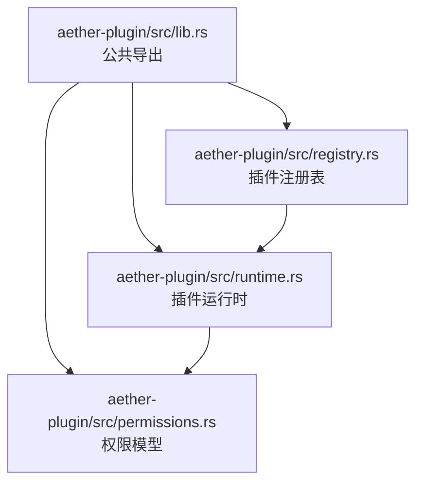
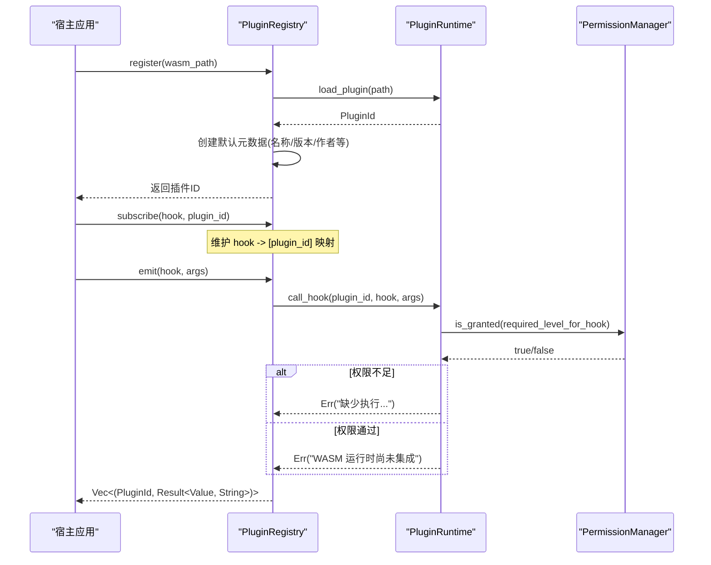
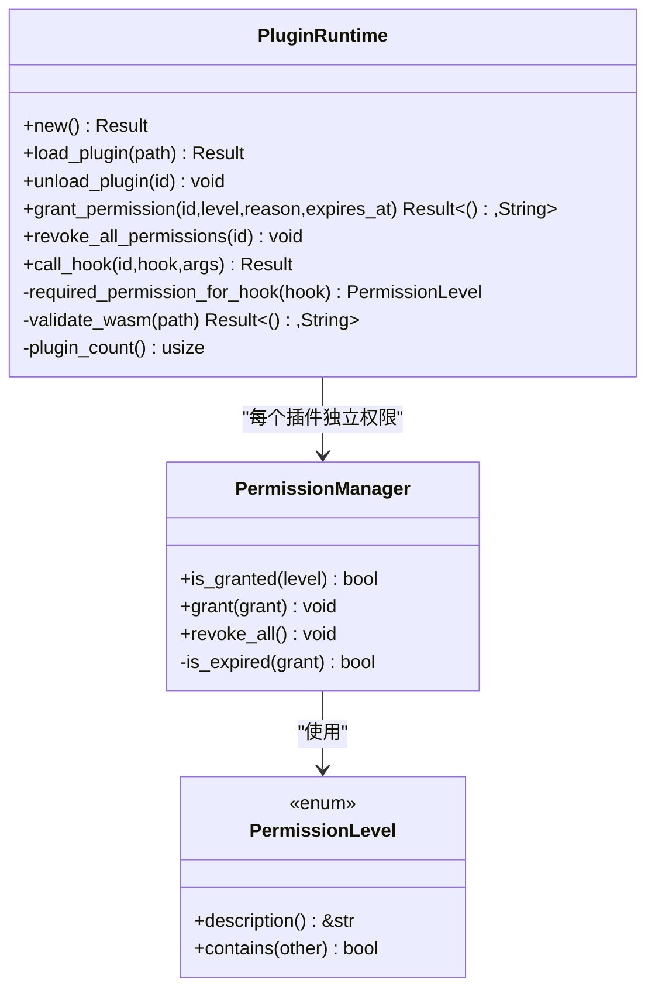
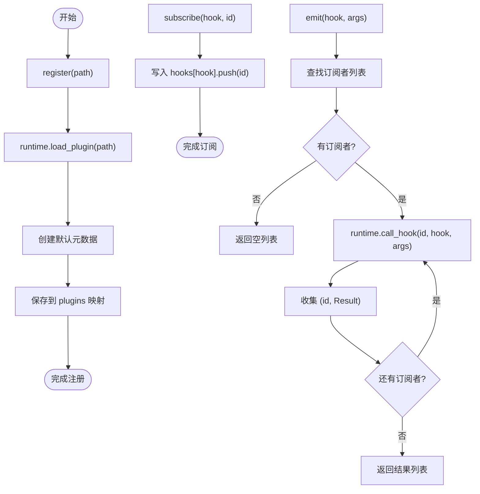
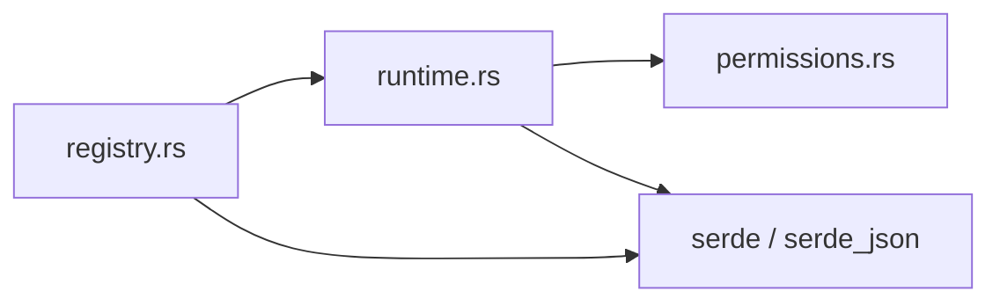

# 插件开发接口

<cite>
**本文引用的文件**
- [crates/aether-plugin/src/lib.rs](file://crates/aether-plugin/src/lib.rs)
- [crates/aether-plugin/src/registry.rs](file://crates/aether-plugin/src/registry.rs)
- [crates/aether-plugin/src/runtime.rs](file://crates/aether-plugin/src/runtime.rs)
- [crates/aether-plugin/src/permissions.rs](file://crates/aether-plugin/src/permissions.rs)
- [crates/aether-plugin/Cargo.toml](file://crates/aether-plugin/Cargo.toml)
- [crates/aether-core/src/buffer/mod.rs](file://crates/aether-core/src/buffer/mod.rs)
- [crates/aether-win32/src/editor.rs](file://crates/aether-win32/src/editor.rs)
</cite>

## 目录
1. [简介](#简介)
2. [项目结构](#项目结构)
3. [核心组件](#核心组件)
4. [架构总览](#架构总览)
5. [详细组件分析](#详细组件分析)
6. [依赖分析](#依赖分析)
7. [性能与安全考虑](#性能与安全考虑)
8. [故障排查指南](#故障排查指南)
9. [结论](#结论)
10. [附录：钩子与权限规范、示例与最佳实践](#附录：钩子与权限规范示例与最佳实践)

## 简介
本文件为牧羊人编辑器的插件开发接口文档，聚焦于 aether-plugin 子系统。当前实现提供了插件注册表、运行时沙箱（占位）、权限模型与事件钩子分发机制的完整骨架，并预留了 WASM 运行时集成点。文档将系统性地说明：
- 插件生命周期管理（加载、卸载、元数据）
- 事件钩子系统（订阅、触发、回调参数约定）
- 权限控制模型（L1-L4 分级、授予/撤销、过期策略）
- WASM 运行时接口（占位实现与后续集成路径）
- 插件打包、分发与版本管理的建议流程
- 安全模型与沙箱限制、资源访问控制原则

## 项目结构
aether-plugin 采用模块化设计，按职责拆分为：
- 公共导出层：对外暴露类型与模块
- 注册表：插件生命周期与事件分发
- 运行时：WASM 插件加载、权限检查、钩子调用入口
- 权限：权限级别定义与授权记录管理

图表来源
- [crates/aether-plugin/src/lib.rs:1-8](file://crates/aether-plugin/src/lib.rs#L1-L8)
- [crates/aether-plugin/src/registry.rs:1-108](file://crates/aether-plugin/src/registry.rs#L1-L108)
- [crates/aether-plugin/src/runtime.rs:1-187](file://crates/aether-plugin/src/runtime.rs#L1-L187)
- [crates/aether-plugin/src/permissions.rs:1-100](file://crates/aether-plugin/src/permissions.rs#L1-L100)

章节来源
- [crates/aether-plugin/src/lib.rs:1-8](file://crates/aether-plugin/src/lib.rs#L1-L8)
- [crates/aether-plugin/Cargo.toml:1-9](file://crates/aether-plugin/Cargo.toml#L1-L9)

## 核心组件
- 插件标识与运行时
  - PluginId：唯一标识已加载插件
  - PluginRuntime：负责插件加载、权限管理、钩子调用入口（当前为占位实现）
- 插件注册表
  - PluginRegistry：维护已加载插件、元数据、钩子订阅关系，提供 emit 分发
- 权限模型
  - PermissionLevel：L1_ReadOnly、L2_FileIO、L3_Network、L4_System
  - PermissionManager：维护授权记录、过期校验、包含关系判断

章节来源
- [crates/aether-plugin/src/runtime.rs:9-187](file://crates/aether-plugin/src/runtime.rs#L9-L187)
- [crates/aether-plugin/src/registry.rs:6-108](file://crates/aether-plugin/src/registry.rs#L6-L108)
- [crates/aether-plugin/src/permissions.rs:1-100](file://crates/aether-plugin/src/permissions.rs#L1-L100)

## 架构总览
下图展示了编辑器主进程通过注册表与运行时协作，完成插件加载、权限校验与钩子调用的整体流程。

图表来源
- [crates/aether-plugin/src/registry.rs:34-91](file://crates/aether-plugin/src/registry.rs#L34-L91)
- [crates/aether-plugin/src/runtime.rs:59-157](file://crates/aether-plugin/src/runtime.rs#L59-L157)
- [crates/aether-plugin/src/permissions.rs:62-94](file://crates/aether-plugin/src/permissions.rs#L62-L94)

## 详细组件分析

### 插件运行时（PluginRuntime）
- 功能要点
  - 验证 WASM 魔数与大小上限（防止恶意或异常文件）
  - 分配递增 ID，避免溢出
  - 为新插件默认授予 L1_ReadOnly 基础权限
  - 支持授予/撤销权限，支持过期时间校验
  - 根据钩子名映射所需权限级别，并在 call_hook 前进行权限检查
  - 当前为占位实现：权限通过后返回“WASM 运行时尚未集成”错误，避免误判成功
- 关键约束
  - 最大插件文件大小：50MB
  - 未知钩子默认要求 L1（最小权限）
  - 过期时间不能是过去时间；若 granted_at 在未来且 expires_at 存在，则视为无效

图表来源
- [crates/aether-plugin/src/runtime.rs:16-187](file://crates/aether-plugin/src/runtime.rs#L16-L187)
- [crates/aether-plugin/src/permissions.rs:8-45](file://crates/aether-plugin/src/permissions.rs#L8-L45)
- [crates/aether-plugin/src/permissions.rs:56-94](file://crates/aether-plugin/src/permissions.rs#L56-L94)

章节来源
- [crates/aether-plugin/src/runtime.rs:33-187](file://crates/aether-plugin/src/runtime.rs#L33-L187)
- [crates/aether-plugin/src/permissions.rs:1-100](file://crates/aether-plugin/src/permissions.rs#L1-L100)

### 插件注册表（PluginRegistry）
- 功能要点
  - 注册插件：加载 WASM、生成默认元数据（名称、版本、描述、作者、权限管理器）
  - 卸载插件：清理运行时与所有钩子订阅
  - 订阅钩子：维护 hook -> [plugin_id] 列表
  - 触发钩子：遍历订阅者，调用运行时 call_hook，收集结果
- 行为特性
  - 无订阅者时 emit 返回空列表
  - 权限不足时返回明确的错误信息
  - 多订阅者可同时收到同一钩子事件

图表来源
- [crates/aether-plugin/src/registry.rs:25-108](file://crates/aether-plugin/src/registry.rs#L25-L108)

章节来源
- [crates/aether-plugin/src/registry.rs:1-108](file://crates/aether-plugin/src/registry.rs#L1-L108)

### 权限模型（PermissionManager 与 PermissionLevel）
- 权限级别
  - L1_ReadOnly：只读 UI 访问
  - L2_FileIO：文件读写
  - L3_Network：网络访问
  - L4_System：系统命令执行
- 包含关系
  - L4 包含所有级别
  - L3 包含 L3/L2/L1
  - L2 包含 L2/L1
  - L1 仅包含自身
- 授权记录
  - 记录授予时间、可选过期时间、原因
  - 过期判定：expires_at 为过去或 granted_at 在未来（当 expires_at 存在）均视为无效
- 典型用法
  - 新插件默认授予 L1_ReadOnly
  - 按需授予更高权限，可设置过期时间
  - 支持一次性撤销全部权限

章节来源
- [crates/aether-plugin/src/permissions.rs:1-100](file://crates/aether-plugin/src/permissions.rs#L1-L100)

## 依赖分析
- 内部依赖
  - registry 依赖 runtime 与 permissions
  - runtime 依赖 permissions
- 外部依赖
  - serde、serde_json：用于 JSON 序列化/反序列化（事件参数与返回值）
- 与宿主集成点
  - 宿主在编辑器事件发生时（如文本变更、光标移动）可通过注册表触发对应钩子
  - 当前钩子名与权限映射由运行时内部决定，宿主无需关心具体权限级别

图表来源
- [crates/aether-plugin/src/registry.rs:1-108](file://crates/aether-plugin/src/registry.rs#L1-L108)
- [crates/aether-plugin/src/runtime.rs:1-187](file://crates/aether-plugin/src/runtime.rs#L1-L187)
- [crates/aether-plugin/Cargo.toml:6-9](file://crates/aether-plugin/Cargo.toml#L6-L9)

章节来源
- [crates/aether-plugin/Cargo.toml:1-9](file://crates/aether-plugin/Cargo.toml#L1-L9)

## 性能与安全考虑
- 性能
  - 插件大小限制为 50MB，避免过大二进制影响加载与内存占用
  - 钩子分发顺序为订阅顺序，注意避免长耗时逻辑阻塞主循环
  - 建议在插件侧对高频事件做节流/合并处理
- 安全
  - 基于权限级别的白名单式访问控制，未知钩子默认最低权限
  - 过期时间校验防止“永久有效”的漏洞
  - 当前 WASM 运行尚未集成，实际执行环境需结合 Wasmtime 的沙箱能力（内存、I/O、网络、系统调用隔离）

[本节为通用指导，不直接分析具体文件]

## 故障排查指南
- 常见错误与定位
  - “插件文件不存在”：确认路径正确、文件存在
  - “不是有效的 WASM 格式”：确认输出为合法 wasm 二进制
  - “插件文件过大”：压缩或拆分插件体积
  - “插件 ID 已耗尽”：重启宿主或修复 ID 分配逻辑
  - “缺少执行 ... 权限”：为插件授予相应权限级别
  - “WASM 运行时尚未集成”：当前为占位实现，待集成 wasmtime 后生效
- 调试建议
  - 打印 emit 返回的结果列表，逐条检查每个插件的 Result
  - 使用 revoke_all_permissions 快速恢复最小权限状态
  - 在 grant_permission 时记录 reason 与 expires_at，便于审计

章节来源
- [crates/aether-plugin/src/runtime.rs:59-157](file://crates/aether-plugin/src/runtime.rs#L59-L157)
- [crates/aether-plugin/src/registry.rs:75-91](file://crates/aether-plugin/src/registry.rs#L75-L91)

## 结论
aether-plugin 提供了可扩展的插件框架基础：注册表负责生命周期与事件分发，运行时负责加载与权限校验，权限模型提供细粒度访问控制。当前处于占位阶段，待集成 WASM 运行时后即可形成完整的沙箱化插件生态。建议遵循最小权限原则，合理划分钩子与权限，完善打包与版本管理流程，确保插件的安全性与可维护性。

[本节为总结，不直接分析具体文件]

## 附录：钩子与权限规范、示例与最佳实践

### 钩子清单与权限映射
以下为运行时内置的钩子名与所需权限级别映射（未知钩子默认 L1）：
- L1_ReadOnly：on_activate、on_deactivate、get_theme、get_language
- L2_FileIO：on_save、on_open、read_file、write_file
- L3_Network：fetch、http_request、websocket
- L4_System：exec、spawn、shell、run_command

章节来源
- [crates/aether-plugin/src/runtime.rs:159-175](file://crates/aether-plugin/src/runtime.rs#L159-L175)

### 事件参数与返回值约定
- 参数与返回值统一使用 JSON 值（serde_json::Value），便于跨语言与跨运行时传递
- 宿主在 emit 时传入 args，插件侧应能解析该 JSON 结构
- 返回值为 Result<Value, String>，错误以字符串形式返回，便于诊断

章节来源
- [crates/aether-plugin/src/registry.rs:75-91](file://crates/aether-plugin/src/registry.rs#L75-L91)
- [crates/aether-plugin/src/runtime.rs:132-157](file://crates/aether-plugin/src/runtime.rs#L132-L157)

### 插件生命周期与注册流程
- 注册：宿主调用 register(path)，运行时验证 WASM 并分配 ID，注册表创建默认元数据
- 订阅：宿主调用 subscribe(hook, id) 建立事件订阅
- 触发：宿主调用 emit(hook, args)，注册表遍历订阅者并调用运行时 call_hook
- 卸载：宿主调用 unregister(id)，清理运行时与订阅关系

章节来源
- [crates/aether-plugin/src/registry.rs:34-108](file://crates/aether-plugin/src/registry.rs#L34-L108)
- [crates/aether-plugin/src/runtime.rs:59-125](file://crates/aether-plugin/src/runtime.rs#L59-L125)

### 权限授予与撤销
- 默认权限：新插件仅拥有 L1_ReadOnly
- 授予：grant_permission(id, level, reason, expires_at)，支持过期时间
- 撤销：revoke_all_permissions(id) 清空所有授权
- 过期校验：expires_at 不能是过去时间；若 granted_at 在未来且 expires_at 存在，视为无效

章节来源
- [crates/aether-plugin/src/runtime.rs:95-125](file://crates/aether-plugin/src/runtime.rs#L95-L125)
- [crates/aether-plugin/src/permissions.rs:84-94](file://crates/aether-plugin/src/permissions.rs#L84-L94)

### 简单文本处理插件示例（概念流程）
- 目标：监听文本变更事件，对选中内容进行预处理（例如转大写）
- 步骤
  - 注册插件并订阅 on_save 或自定义文本变更钩子
  - 在钩子回调中读取当前缓冲区内容（需要 L2_FileIO 或专用 API）
  - 执行转换逻辑，返回修改后的内容或操作指令
  - 宿主根据返回值更新编辑器状态
- 注意：当前钩子调用返回“WASM 运行时尚未集成”，需在集成 wasmtime 后生效

[本节为概念性示例，不直接分析具体文件]

### 复杂 UI 扩展插件示例（概念流程）
- 目标：在编辑器右侧面板展示实时统计信息（行数、字符数、语法高亮状态）
- 步骤
  - 订阅 get_theme、get_language 等 L1 钩子获取主题与语言信息
  - 订阅编辑器相关事件（如文本变更、光标移动）
  - 计算统计指标并通过 UI 渲染
  - 遵守权限边界，不越权访问文件系统或网络
- 注意：UI 渲染需通过宿主提供的 UI 扩展点（未来可在运行时暴露）

[本节为概念性示例，不直接分析具体文件]

### 安全模型与沙箱限制
- 权限分级：按资源域划分，遵循最小权限原则
- 过期策略：支持临时授权，降低长期风险
- 沙箱隔离：待集成 wasmtime 后，限制内存、I/O、网络、系统调用
- 错误可见性：权限不足与未集成错误明确区分，便于诊断

章节来源
- [crates/aether-plugin/src/runtime.rs:132-175](file://crates/aether-plugin/src/runtime.rs#L132-L175)
- [crates/aether-plugin/src/permissions.rs:1-45](file://crates/aether-plugin/src/permissions.rs#L1-L45)

### 打包、分发与版本管理最佳实践
- 构建产物：输出标准 WASM 二进制，确保魔数正确、体积受控
- 元数据：在注册表中维护 name、version、author、description，便于管理与展示
- 版本策略：语义化版本，兼容性与破坏性变更需明确标注
- 分发渠道：私有仓库或平台化商店，附带签名与校验流程
- 依赖管理：保持插件依赖精简，避免引入不安全或重型库

章节来源
- [crates/aether-plugin/src/registry.rs:34-54](file://crates/aether-plugin/src/registry.rs#L34-L54)
- [crates/aether-plugin/Cargo.toml:1-9](file://crates/aether-plugin/Cargo.toml#L1-L9)

### 与编辑器核心集成的参考点
- 编辑器事件：文本变更、光标移动等事件可作为触发插件钩子的时机
- 缓冲区抽象：TextBuffer 提供行、列、选择区等数据结构，供插件读取与处理

章节来源
- [crates/aether-win32/src/editor.rs:1450-1458](file://crates/aether-win32/src/editor.rs#L1450-L1458)
- [crates/aether-core/src/buffer/mod.rs:1-8](file://crates/aether-core/src/buffer/mod.rs#L1-L8)