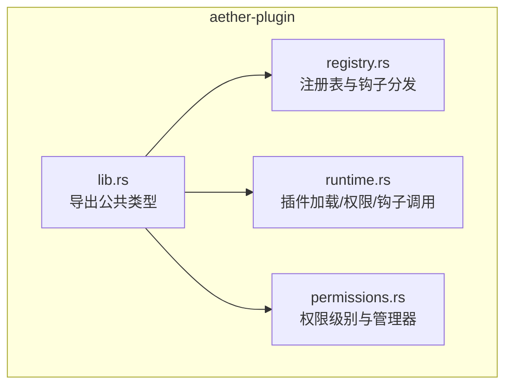
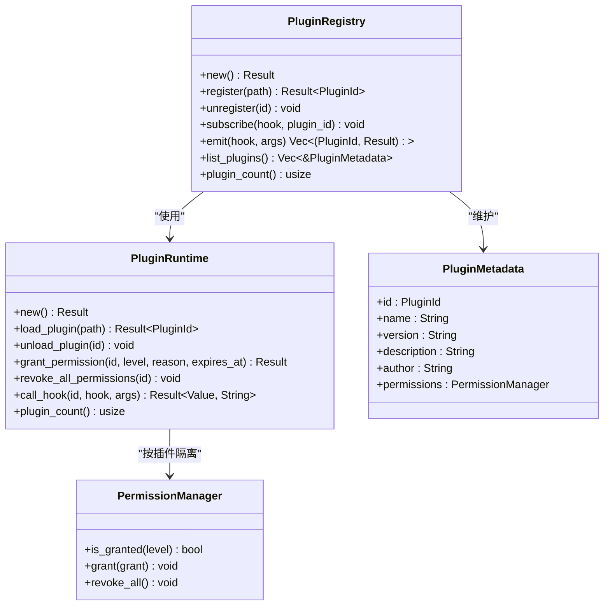
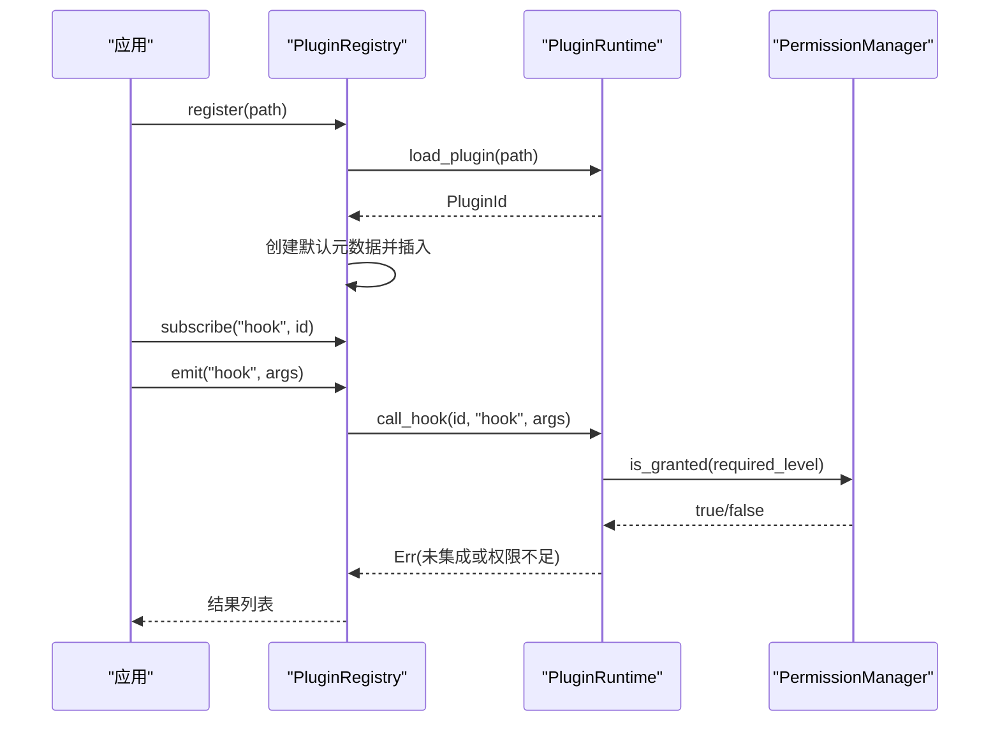
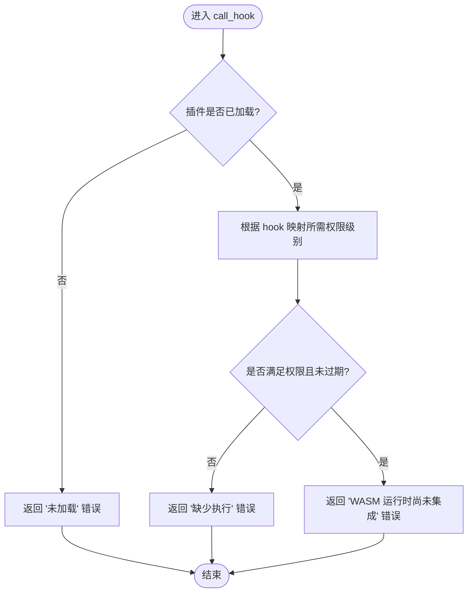

# 插件注册中心

<cite>
**本文引用的文件列表**
- [crates/aether-plugin/src/lib.rs](file://crates/aether-plugin/src/lib.rs)
- [crates/aether-plugin/src/registry.rs](file://crates/aether-plugin/src/registry.rs)
- [crates/aether-plugin/src/runtime.rs](file://crates/aether-plugin/src/runtime.rs)
- [crates/aether-plugin/src/permissions.rs](file://crates/aether-plugin/src/permissions.rs)
- [crates/aether-plugin/Cargo.toml](file://crates/aether-plugin/Cargo.toml)
</cite>

## 目录
1. [简介](#简介)
2. [项目结构](#项目结构)
3. [核心组件](#核心组件)
4. [架构总览](#架构总览)
5. [详细组件分析](#详细组件分析)
6. [依赖关系与冲突处理](#依赖关系与冲突处理)
7. [插件仓库与安装卸载](#插件仓库与安装卸载)
8. [缓存机制与性能优化](#缓存机制与性能优化)
9. [故障排查指南](#故障排查指南)
10. [结论](#结论)

## 简介
本文件面向“牧羊人编辑器”的插件系统，聚焦于插件注册中心（PluginRegistry）及其相关运行时、权限模型。文档覆盖以下目标：
- 插件发现、加载、生命周期管理、钩子分发
- 插件元数据与配置规范（含 manifest.json 字段定义与校验规则）
- 版本管理与依赖解析策略
- 插件安装与卸载的管理接口（含批量操作与事务处理）
- 插件仓库集成示例（商店与自动更新）
- 插件缓存机制与性能优化策略

说明：当前代码库中的 aether-plugin 模块提供了注册表、运行时与权限管理的骨架实现；部分高级能力（如 manifest 解析、依赖解析、仓库集成、缓存）尚未在源码中落地，本文在“现状”基础上给出扩展设计与建议，并明确标注哪些为现有实现、哪些为规划方案。

## 项目结构
aether-plugin 是独立的 Rust crate，提供插件注册中心的基础设施。其内部包含三个主要模块：
- 注册表（registry）：对外暴露插件注册、卸载、订阅与事件分发等 API
- 运行时（runtime）：负责插件加载、ID 分配、权限授予、钩子调用入口
- 权限（permissions）：定义权限级别、授权记录与检查逻辑

图表来源
- [crates/aether-plugin/src/lib.rs:1-8](file://crates/aether-plugin/src/lib.rs#L1-L8)
- [crates/aether-plugin/src/registry.rs:1-108](file://crates/aether-plugin/src/registry.rs#L1-L108)
- [crates/aether-plugin/src/runtime.rs:1-187](file://crates/aether-plugin/src/runtime.rs#L1-L187)
- [crates/aether-plugin/src/permissions.rs:1-100](file://crates/aether-plugin/src/permissions.rs#L1-L100)

章节来源
- [crates/aether-plugin/src/lib.rs:1-8](file://crates/aether-plugin/src/lib.rs#L1-L8)
- [crates/aether-plugin/Cargo.toml:1-9](file://crates/aether-plugin/Cargo.toml#L1-L9)

## 核心组件
- PluginRegistry（注册表）
  - 职责：维护已加载插件集合、钩子订阅映射、统一触发钩子
  - 关键方法：register、unregister、subscribe、emit、list_plugins、plugin_count
- PluginRuntime（运行时）
  - 职责：WASM 插件加载、ID 分配、权限授予、钩子调用入口（当前为占位，未集成 wasmtime）
  - 关键方法：load_plugin、unload_plugin、grant_permission、revoke_all_permissions、call_hook
- PermissionManager（权限管理器）
  - 职责：维护授权记录、支持过期时间、层级包含关系判断
  - 关键方法：is_granted、grant、revoke_all

章节来源
- [crates/aether-plugin/src/registry.rs:19-108](file://crates/aether-plugin/src/registry.rs#L19-L108)
- [crates/aether-plugin/src/runtime.rs:16-187](file://crates/aether-plugin/src/runtime.rs#L16-L187)
- [crates/aether-plugin/src/permissions.rs:56-100](file://crates/aether-plugin/src/permissions.rs#L56-L100)

## 架构总览
注册中心采用“注册表 + 运行时 + 权限”三层结构：
- 注册表持有运行时实例与插件元数据映射，并提供钩子订阅与广播
- 运行时负责插件加载、权限控制与钩子调用入口
- 权限层提供细粒度权限判定与过期控制

图表来源
- [crates/aether-plugin/src/registry.rs:19-108](file://crates/aether-plugin/src/registry.rs#L19-L108)
- [crates/aether-plugin/src/runtime.rs:16-187](file://crates/aether-plugin/src/runtime.rs#L16-L187)
- [crates/aether-plugin/src/permissions.rs:56-100](file://crates/aether-plugin/src/permissions.rs#L56-L100)

## 详细组件分析

### 注册表（PluginRegistry）
- 插件注册流程
  - 通过 register(path) 委托给运行时加载插件，返回唯一 ID
  - 创建默认元数据（名称来自文件名、版本固定默认值），并初始化权限管理器
  - 将插件元数据加入内存映射
- 插件卸载
  - 从运行时卸载，并从元数据与钩子订阅中移除
- 钩子订阅与触发
  - subscribe(hook, plugin_id) 建立订阅关系
  - emit(hook, args) 遍历订阅者，调用运行时 call_hook，收集结果

图表来源
- [crates/aether-plugin/src/registry.rs:35-91](file://crates/aether-plugin/src/registry.rs#L35-L91)
- [crates/aether-plugin/src/runtime.rs:132-175](file://crates/aether-plugin/src/runtime.rs#L132-L175)
- [crates/aether-plugin/src/permissions.rs:68-94](file://crates/aether-plugin/src/permissions.rs#L68-L94)

章节来源
- [crates/aether-plugin/src/registry.rs:19-108](file://crates/aether-plugin/src/registry.rs#L19-L108)

### 运行时（PluginRuntime）
- WASM 验证
  - 检查文件大小上限（50MB）
  - 读取前 4 字节魔数，必须匹配 WASM 头
- 插件加载
  - 生成递增 ID，防止溢出
  - 为新插件授予基础只读权限（L1_ReadOnly）
- 权限授予与撤销
  - grant_permission 支持设置过期时间，拒绝过去时间
  - revoke_all_permissions 清空所有授权
- 钩子调用
  - 根据 hook 名称映射所需权限级别（未知 hook 默认 L1）
  - 若权限不足则拒绝；当前未集成 wasmtime，会返回“未集成”错误

图表来源
- [crates/aether-plugin/src/runtime.rs:132-175](file://crates/aether-plugin/src/runtime.rs#L132-L175)
- [crates/aether-plugin/src/runtime.rs:34-57](file://crates/aether-plugin/src/runtime.rs#L34-L57)
- [crates/aether-plugin/src/runtime.rs:96-125](file://crates/aether-plugin/src/runtime.rs#L96-L125)

章节来源
- [crates/aether-plugin/src/runtime.rs:16-187](file://crates/aether-plugin/src/runtime.rs#L16-L187)

### 权限模型（PermissionManager）
- 权限级别
  - L1_ReadOnly：只读 UI 访问
  - L2_FileIO：文件读写
  - L3_Network：网络访问
  - L4_System：系统命令执行
- 包含关系
  - 高权限包含低权限（例如 L4 包含 L3/L2/L1）
- 授权记录
  - 支持 granted_at、expires_at、reason
  - 过期判定：若 expires_at 存在且早于当前时间，或 granted_at 晚于当前时间，视为无效

章节来源
- [crates/aether-plugin/src/permissions.rs:1-45](file://crates/aether-plugin/src/permissions.rs#L1-L45)
- [crates/aether-plugin/src/permissions.rs:47-94](file://crates/aether-plugin/src/permissions.rs#L47-L94)

## 依赖关系与冲突处理
- 当前状态
  - 源码中未发现显式的插件依赖声明与解析逻辑
  - 注册表仅维护插件元数据与钩子订阅，不处理插件间依赖
- 建议设计（扩展方向）
  - 在 PluginMetadata 中增加 dependencies 字段，描述对其它插件的依赖（以插件 ID 或包名+版本范围表示）
  - 引入依赖图构建与环检测算法（拓扑排序），在加载阶段进行一致性校验
  - 冲突解决策略
    - 版本兼容：基于语义化版本约束，选择满足范围的最低兼容版本
    - 命名空间隔离：同功能插件按命名空间区分，避免同名冲突
    - 回滚与补偿：当某插件加载失败时，回滚已加载的依赖链，保证原子性

章节来源
- [crates/aether-plugin/src/registry.rs:19-108](file://crates/aether-plugin/src/registry.rs#L19-L108)

## 插件仓库与安装卸载
- 现状
  - 注册表提供 register/unregister 单插件操作
  - 未实现仓库拉取、清单解析、批量安装/卸载与事务
- 建议设计（扩展方向）
  - 仓库协议
    - 提供索引清单（index.json），列出可用插件及版本信息
    - 每个插件包包含 WASM 二进制与 manifest.json
  - 清单格式（manifest.json）
    - 字段建议：id、name、version、description、author、dependencies、permissions、entrypoint、hooks
    - 校验规则：必填字段非空、版本号符合语义化版本、依赖项存在且版本范围合法、权限请求不超过实际授予
  - 安装流程
    - 下载插件包到本地缓存目录
    - 解析 manifest.json 并校验
    - 构建依赖图并解析版本冲突
    - 按拓扑顺序加载插件，任一失败则整体回滚
  - 卸载流程
    - 反向拓扑顺序卸载，清理元数据与钩子订阅
    - 释放权限并清理缓存
  - 批量操作与事务
    - 使用事务包装多插件安装/卸载，确保一致性
    - 支持快照与回滚点，失败时恢复至前一状态

章节来源
- [crates/aether-plugin/src/registry.rs:35-65](file://crates/aether-plugin/src/registry.rs#L35-L65)

## 缓存机制与性能优化
- 现状
  - 运行时未实现插件缓存；每次加载均进行文件校验
  - 注册表仅维护内存映射，无持久化缓存
- 建议设计（扩展方向）
  - 插件缓存
    - 以插件 ID 与版本作为键，缓存已校验的 WASM 二进制与解析后的 manifest
    - 缓存失效策略：版本变更、manifest 哈希变化、安全策略更新
  - 预加载与懒加载
    - 启动时预加载常用插件，按需懒加载低频插件
  - 并发与锁
    - 注册表与运行时使用细粒度锁保护共享状态
    - 钩子触发可并行调用各插件（需考虑插件内状态隔离）
  - 资源限制
    - 限制单个插件内存与 CPU 配额（待集成沙箱后实施）
    - 限制钩子调用超时与重试次数

章节来源
- [crates/aether-plugin/src/runtime.rs:34-57](file://crates/aether-plugin/src/runtime.rs#L34-L57)

## 故障排查指南
- 常见错误与定位
  - 插件文件不存在：检查路径是否正确，确认文件存在
  - 不是有效的 WASM 格式：确认二进制是否为标准 WASM 文件，魔数正确
  - 插件文件过大：超过 50MB 将被拒绝，压缩或拆分插件
  - 插件 ID 已耗尽：重启进程或修复 ID 分配逻辑
  - 权限不足：检查插件所需的权限级别与实际授予是否匹配
  - 钩子无法执行：当前未集成 wasmtime，会返回“未集成”提示
- 调试建议
  - 启用日志输出，记录加载与权限决策过程
  - 使用最小复现用例，逐步缩小问题范围
  - 检查 manifest.json 与依赖解析结果是否符合预期

章节来源
- [crates/aether-plugin/src/runtime.rs:60-87](file://crates/aether-plugin/src/runtime.rs#L60-L87)
- [crates/aether-plugin/src/runtime.rs:132-175](file://crates/aether-plugin/src/runtime.rs#L132-L175)

## 结论
当前 aether-plugin 模块提供了插件注册中心的核心骨架：注册表、运行时与权限模型。已实现的亮点包括：
- 严格的 WASM 文件校验与大小限制
- 基于权限级别的钩子访问控制
- 清晰的注册/卸载与钩子订阅/触发流程

下一步建议优先完善：
- 插件清单（manifest.json）解析与校验
- 依赖解析与冲突处理
- 仓库集成与安装/卸载事务
- 缓存机制与性能优化

这些扩展将使插件生态更加健壮、可扩展与易用。