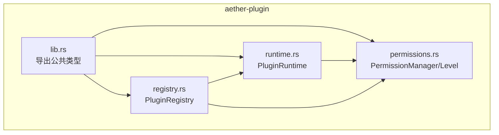
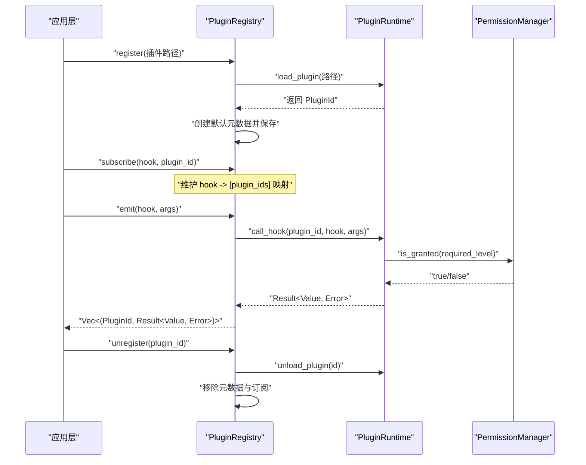
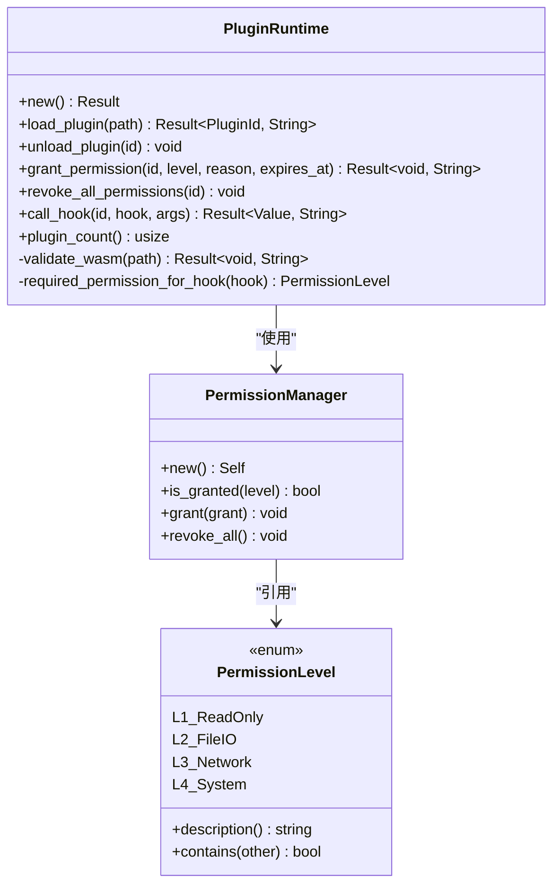
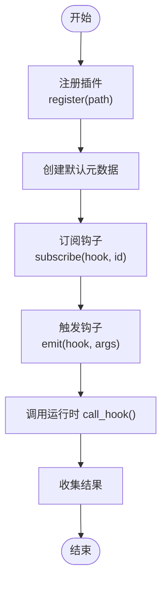
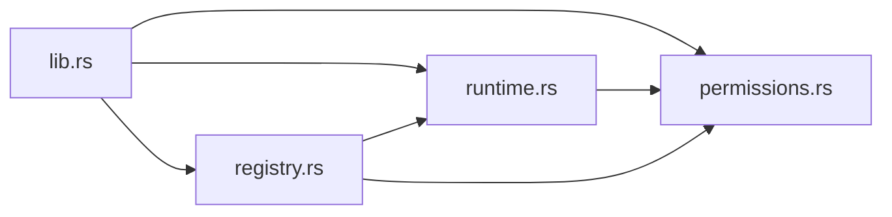

# 插件生命周期管理

<cite>
**本文引用的文件**
- [crates/aether-plugin/src/lib.rs](file://crates/aether-plugin/src/lib.rs)
- [crates/aether-plugin/src/runtime.rs](file://crates/aether-plugin/src/runtime.rs)
- [crates/aether-plugin/src/registry.rs](file://crates/aether-plugin/src/registry.rs)
- [crates/aether-plugin/src/permissions.rs](file://crates/aether-plugin/src/permissions.rs)
- [crates/aether-plugin/Cargo.toml](file://crates/aether-plugin/Cargo.toml)
</cite>

## 目录
1. [简介](#简介)
2. [项目结构](#项目结构)
3. [核心组件](#核心组件)
4. [架构总览](#架构总览)
5. [详细组件分析](#详细组件分析)
6. [依赖关系分析](#依赖关系分析)
7. [性能与安全性考量](#性能与安全性考量)
8. [故障排查指南](#故障排查指南)
9. [结论](#结论)
10. [附录：示例流程与最佳实践](#附录示例流程与最佳实践)

## 简介
本文件面向“牧羊人编辑器”的插件系统，聚焦于插件从加载到卸载的完整生命周期管理。文档围绕以下目标展开：
- 全面记录插件生命周期各阶段（初始化、启动、运行、销毁）的 API 接口与调用约定
- 详细说明 PluginRuntime 的核心方法：load_plugin()、start_plugin()、stop_plugin()、unload_plugin() 的使用方式与状态语义
- 解释插件状态管理机制（活跃、暂停、错误）的处理策略
- 提供插件生命周期钩子函数的定义规范与回调参数约定
- 给出完整的生命周期示例代码路径，展示如何正确实现插件的初始化和清理逻辑

说明：当前仓库中的 aether-plugin 模块提供了插件运行时与注册表的骨架实现，包含权限模型、WASM 校验、钩子分发等关键能力。部分功能（如 WASM 引擎集成）为占位实现，但已具备完整的权限检查与错误语义，便于后续扩展。

## 项目结构
aether-plugin 模块采用分层组织：
- 顶层 lib.rs 暴露公共类型与模块
- runtime.rs 提供插件运行时（PluginRuntime），负责插件加载、卸载、权限控制与钩子调用
- registry.rs 提供插件注册表（PluginRegistry），封装注册、订阅、事件分发等高层能力
- permissions.rs 提供权限级别与权限管理器，支撑最小权限原则与动态授权

图表来源
- [crates/aether-plugin/src/lib.rs:1-8](file://crates/aether-plugin/src/lib.rs#L1-L8)
- [crates/aether-plugin/src/runtime.rs:1-22](file://crates/aether-plugin/src/runtime.rs#L1-L22)
- [crates/aether-plugin/src/registry.rs:1-23](file://crates/aether-plugin/src/registry.rs#L1-L23)
- [crates/aether-plugin/src/permissions.rs:1-13](file://crates/aether-plugin/src/permissions.rs#L1-L13)

章节来源
- [crates/aether-plugin/src/lib.rs:1-8](file://crates/aether-plugin/src/lib.rs#L1-L8)
- [crates/aether-plugin/Cargo.toml:1-9](file://crates/aether-plugin/Cargo.toml#L1-L9)

## 核心组件
- PluginId：插件唯一标识，用于在运行时区分不同插件实例
- PluginRuntime：插件运行时，负责：
  - 加载与验证 WASM 插件文件
  - 分配并维护插件 ID
  - 授予/撤销权限
  - 调用插件生命周期钩子（含权限检查）
  - 统计已加载插件数量
- PluginRegistry：插件注册表，负责：
  - 注册/卸载插件（内部委托给运行时）
  - 维护插件元数据
  - 订阅/触发钩子事件（批量分发）
- PermissionManager / PermissionLevel：权限模型，支持多级权限与过期时间控制

章节来源
- [crates/aether-plugin/src/runtime.rs:9-21](file://crates/aether-plugin/src/runtime.rs#L9-L21)
- [crates/aether-plugin/src/registry.rs:6-23](file://crates/aether-plugin/src/registry.rs#L6-L23)
- [crates/aether-plugin/src/permissions.rs:1-13](file://crates/aether-plugin/src/permissions.rs#L1-L13)

## 架构总览
下图展示了插件生命周期中主要组件的交互关系：注册表协调运行时，运行时执行权限检查与钩子调用；权限管理器贯穿其中，确保最小权限原则。

图表来源
- [crates/aether-plugin/src/registry.rs:34-91](file://crates/aether-plugin/src/registry.rs#L34-L91)
- [crates/aether-plugin/src/runtime.rs:60-181](file://crates/aether-plugin/src/runtime.rs#L60-L181)
- [crates/aether-plugin/src/permissions.rs:62-94](file://crates/aether-plugin/src/permissions.rs#L62-L94)

## 详细组件分析

### 插件运行时（PluginRuntime）
职责与关键点：
- 加载与验证：load_plugin() 会检查文件存在性、大小限制与 WASM 魔数，随后分配唯一 ID 并建立权限上下文
- 卸载：unload_plugin() 清理插件与权限信息
- 权限：grant_permission() 与 revoke_all_permissions() 支持按级别与过期时间进行授权
- 钩子调用：call_hook() 根据钩子名称判定所需权限级别，通过权限检查后尝试调用（当前为占位实现，返回未集成错误）
- 统计：plugin_count() 返回已加载插件数量

图表来源
- [crates/aether-plugin/src/runtime.rs:23-181](file://crates/aether-plugin/src/runtime.rs#L23-L181)
- [crates/aether-plugin/src/permissions.rs:56-94](file://crates/aether-plugin/src/permissions.rs#L56-L94)
- [crates/aether-plugin/src/permissions.rs:1-13](file://crates/aether-plugin/src/permissions.rs#L1-L13)

章节来源
- [crates/aether-plugin/src/runtime.rs:23-181](file://crates/aether-plugin/src/runtime.rs#L23-L181)

#### 钩子权限映射
call_hook() 内部通过 required_permission_for_hook() 将钩子名映射到所需权限级别：
- 只读类：on_activate、on_deactivate、get_theme、get_language → L1_ReadOnly
- 文件类：on_save、on_open、read_file、write_file → L2_FileIO
- 网络类：fetch、http_request、websocket → L3_Network
- 系统类：exec、spawn、shell、run_command → L4_System
- 未知钩子默认要求 L1_ReadOnly（安全优先）

章节来源
- [crates/aether-plugin/src/runtime.rs:159-175](file://crates/aether-plugin/src/runtime.rs#L159-L175)

### 插件注册表（PluginRegistry）
职责与关键点：
- register()：调用运行时加载插件，并创建默认元数据（名称、版本、描述、作者、权限管理器）
- unregister()：卸载插件并从所有钩子订阅列表中移除该插件
- subscribe()：将插件订阅到指定钩子
- emit()：遍历订阅者，依次调用运行时 call_hook()，收集结果
- list_plugins() / plugin_count()：查询已加载插件列表与数量

图表来源
- [crates/aether-plugin/src/registry.rs:34-91](file://crates/aether-plugin/src/registry.rs#L34-L91)

章节来源
- [crates/aether-plugin/src/registry.rs:17-102](file://crates/aether-plugin/src/registry.rs#L17-L102)

### 权限模型（PermissionManager / PermissionLevel）
- 权限级别：L1_ReadOnly、L2_FileIO、L3_Network、L4_System，支持层级包含关系（高权限包含低权限）
- 授权记录：包含级别、授予时间、可选过期时间与原因
- 过期检查：当 grants.expires_at 为 Some 时，若当前时间超过过期时间或授予时间为未来时间，则视为无效
- 撤销：revoke_all() 清空所有授权

章节来源
- [crates/aether-plugin/src/permissions.rs:1-13](file://crates/aether-plugin/src/permissions.rs#L1-L13)
- [crates/aether-plugin/src/permissions.rs:47-94](file://crates/aether-plugin/src/permissions.rs#L47-L94)

## 依赖关系分析
- 模块内依赖：
  - runtime.rs 依赖 permissions.rs（权限检查）
  - registry.rs 依赖 runtime.rs 与 permissions.rs（注册与事件分发）
  - lib.rs 统一导出公共类型
- 外部依赖：
  - serde、serde_json：用于序列化钩子参数与返回值
  - wasmtime：当前为占位实现，尚未引入实际依赖

图表来源
- [crates/aether-plugin/src/lib.rs:1-8](file://crates/aether-plugin/src/lib.rs#L1-L8)
- [crates/aether-plugin/src/runtime.rs:1-5](file://crates/aether-plugin/src/runtime.rs#L1-L5)
- [crates/aether-plugin/src/registry.rs:1-5](file://crates/aether-plugin/src/registry.rs#L1-L5)
- [crates/aether-plugin/Cargo.toml:6-9](file://crates/aether-plugin/Cargo.toml#L6-L9)

章节来源
- [crates/aether-plugin/Cargo.toml:1-9](file://crates/aether-plugin/Cargo.toml#L1-L9)

## 性能与安全性考量
- 文件大小限制：MAX_PLUGIN_SIZE 限制单个插件体积，防止资源耗尽
- WASM 魔数校验：避免加载非 WASM 文件，减少误用风险
- 权限最小化：新加载插件仅授予 L1_ReadOnly，按需提升权限
- 过期时间校验：拒绝过去时间的过期时间，同时校验授予时间不能在未来
- 钩子权限映射：未知钩子默认要求最低权限，遵循安全优先原则

章节来源
- [crates/aether-plugin/src/runtime.rs:6-7](file://crates/aether-plugin/src/runtime.rs#L6-L7)
- [crates/aether-plugin/src/runtime.rs:33-57](file://crates/aether-plugin/src/runtime.rs#L33-L57)
- [crates/aether-plugin/src/runtime.rs:76-84](file://crates/aether-plugin/src/runtime.rs#L76-L84)
- [crates/aether-plugin/src/permissions.rs:84-93](file://crates/aether-plugin/src/permissions.rs#L84-L93)

## 故障排查指南
常见问题与定位建议：
- 插件文件不存在：load_plugin() 返回错误提示文件不存在
- 非有效 WASM 格式：load_plugin() 返回错误提示不是有效的 WASM 格式
- 插件过大：load_plugin() 返回错误提示超出最大大小
- 权限不足：call_hook() 返回错误提示缺少相应权限级别
- 插件未加载：call_hook() 返回错误提示插件未加载
- WASM 运行时尚未集成：call_hook() 返回错误提示需要 wasmtime 依赖

章节来源
- [crates/aether-plugin/src/runtime.rs:60-87](file://crates/aether-plugin/src/runtime.rs#L60-L87)
- [crates/aether-plugin/src/runtime.rs:132-157](file://crates/aether-plugin/src/runtime.rs#L132-L157)

## 结论
当前 aether-plugin 模块提供了插件生命周期的基础框架：
- 通过 PluginRuntime 完成插件加载、权限控制与钩子调用
- 通过 PluginRegistry 提供注册、订阅与事件分发的上层抽象
- 通过 PermissionManager 实现细粒度权限管理与过期控制
- 钩子权限映射明确且安全优先，便于后续扩展更多钩子类型

下一步建议：
- 集成 wasmtime 以真正实现 WASM 函数调用
- 完善 start_plugin()/stop_plugin() 的状态机与错误恢复
- 增加更丰富的生命周期钩子与回调参数规范
- 补充单元测试覆盖边界条件与并发场景

## 附录：示例流程与最佳实践

### 生命周期 API 概览
- 初始化与加载
  - 使用 PluginRuntime::new() 创建运行时
  - 使用 load_plugin(path) 加载 WASM 插件，获取 PluginId
- 启动与运行
  - 使用 PluginRegistry::register(path) 注册插件并创建元数据
  - 使用 subscribe(hook, id) 订阅钩子
  - 使用 emit(hook, args) 触发钩子，由运行时进行权限检查与调用
- 停止与销毁
  - 使用 unload_plugin(id) 卸载插件
  - 使用 unregister(id) 从注册表中移除插件与订阅
  - 使用 revoke_all_permissions(id) 撤销所有权限

章节来源
- [crates/aether-plugin/src/runtime.rs:23-93](file://crates/aether-plugin/src/runtime.rs#L23-L93)
- [crates/aether-plugin/src/registry.rs:34-91](file://crates/aether-plugin/src/registry.rs#L34-L91)

### 插件状态管理（活跃、暂停、错误）
当前实现未显式维护插件状态枚举，但可通过以下约定进行状态管理：
- 活跃：成功加载且未被卸载（存在于 _plugins 映射中）
- 暂停：可结合权限撤销（revoke_all_permissions）与钩子订阅移除（unregister）模拟暂停行为
- 错误：load_plugin/call_hook 等方法返回错误时，调用方应记录错误并决定重试或降级策略

章节来源
- [crates/aether-plugin/src/runtime.rs:60-93](file://crates/aether-plugin/src/runtime.rs#L60-L93)
- [crates/aether-plugin/src/registry.rs:56-65](file://crates/aether-plugin/src/registry.rs#L56-L65)

### 钩子函数定义规范与回调参数
- 钩子命名：建议使用 on_* 前缀表示生命周期钩子（如 on_activate、on_deactivate、on_save、on_open）
- 权限级别：根据钩子操作类型映射到对应权限级别（见“钩子权限映射”）
- 回调参数：args 使用 serde_json::Value 传递，返回值同样为 Value；具体字段由钩子契约约定
- 错误处理：call_hook 返回 Err 时，调用方应捕获并记录错误，避免误判为成功

章节来源
- [crates/aether-plugin/src/runtime.rs:159-175](file://crates/aether-plugin/src/runtime.rs#L159-L175)
- [crates/aether-plugin/src/runtime.rs:132-157](file://crates/aether-plugin/src/runtime.rs#L132-L157)

### 完整生命周期示例（代码片段路径）
以下为典型的生命周期使用流程，请参照测试用例中的路径了解具体实现细节：
- 创建运行时与加载插件
  - 参考：[crates/aether-plugin/src/runtime.rs:243-254](file://crates/aether-plugin/src/runtime.rs#L243-L254)
- 注册插件与订阅钩子
  - 参考：[crates/aether-plugin/src/registry.rs:141-152](file://crates/aether-plugin/src/registry.rs#L141-L152)
  - 参考：[crates/aether-plugin/src/registry.rs:206-227](file://crates/aether-plugin/src/registry.rs#L206-L227)
- 触发钩子与权限检查
  - 参考：[crates/aether-plugin/src/registry.rs:75-91](file://crates/aether-plugin/src/registry.rs#L75-L91)
  - 参考：[crates/aether-plugin/src/runtime.rs:132-157](file://crates/aether-plugin/src/runtime.rs#L132-L157)
- 撤销权限与卸载插件
  - 参考：[crates/aether-plugin/src/runtime.rs:120-125](file://crates/aether-plugin/src/runtime.rs#L120-L125)
  - 参考：[crates/aether-plugin/src/registry.rs:56-65](file://crates/aether-plugin/src/registry.rs#L56-L65)

注意：上述示例均为仓库内现有测试与实现的引用路径，不包含具体代码内容。