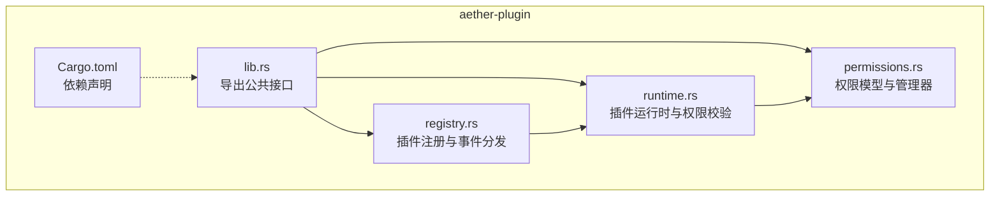
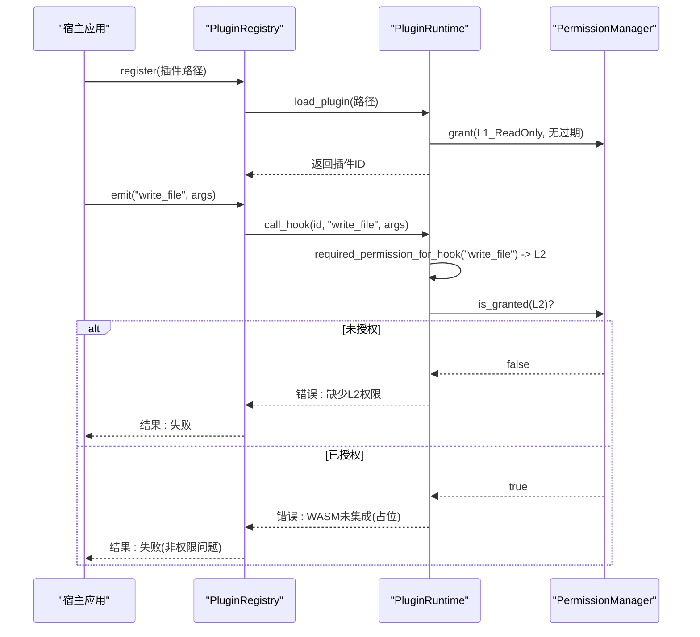
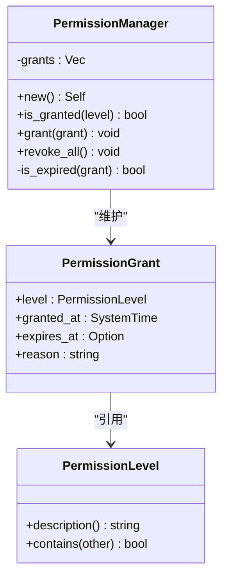
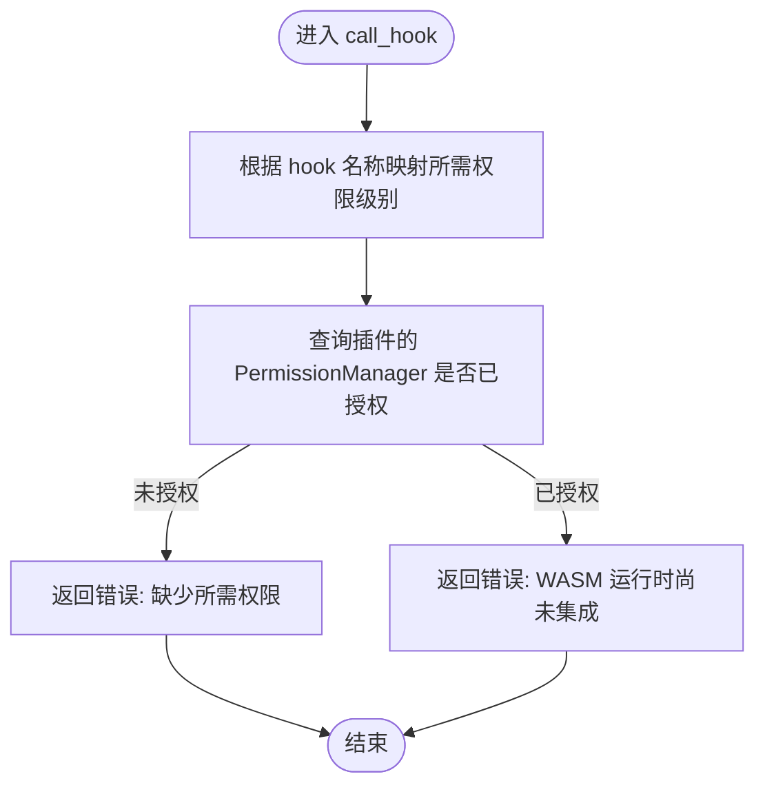
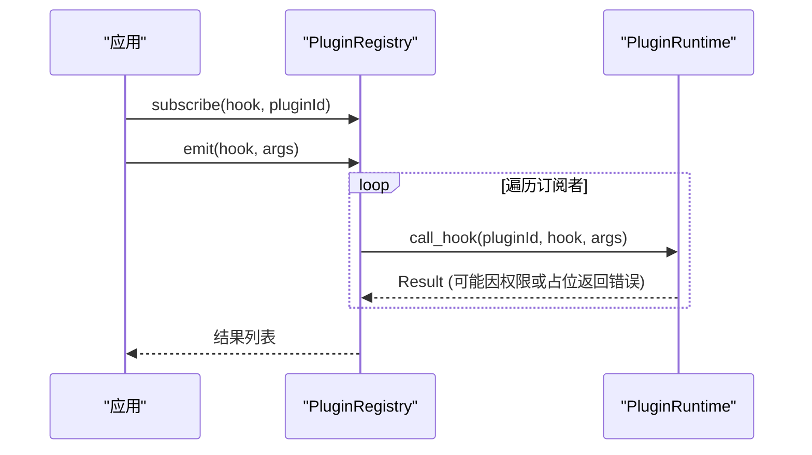
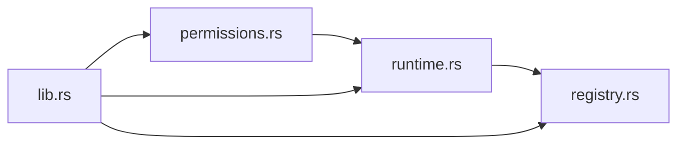

# 权限控制系统

<cite>
**本文引用的文件**
- [crates/aether-plugin/src/permissions.rs](file://crates/aether-plugin/src/permissions.rs)
- [crates/aether-plugin/src/runtime.rs](file://crates/aether-plugin/src/runtime.rs)
- [crates/aether-plugin/src/registry.rs](file://crates/aether-plugin/src/registry.rs)
- [crates/aether-plugin/src/lib.rs](file://crates/aether-plugin/src/lib.rs)
- [crates/aether-plugin/Cargo.toml](file://crates/aether-plugin/Cargo.toml)
</cite>

## 目录
1. [简介](#简介)
2. [项目结构](#项目结构)
3. [核心组件](#核心组件)
4. [架构总览](#架构总览)
5. [详细组件分析](#详细组件分析)
6. [依赖关系分析](#依赖关系分析)
7. [性能与安全考量](#性能与安全考量)
8. [故障排查指南](#故障排查指南)
9. [结论](#结论)
10. [附录：权限配置与最佳实践](#附录：权限配置与最佳实践)

## 简介
本文件系统性梳理牧羊人编辑器的插件权限控制系统，覆盖以下方面：
- 权限模型设计：PermissionLevel 枚举与 PermissionGrant 结构体的语义、组合与生命周期。
- 权限级别与访问范围：L1 只读 UI、L2 文件读写、L3 网络访问、L4 系统命令执行。
- 权限申请与授权流程：动态检查（运行时）与静态声明（清单）的协作方式。
- 权限配置示例：如何在插件清单中声明所需权限。
- 安全最佳实践：避免滥用与漏洞的策略。
- 调试与监控：如何定位权限问题并观察授权状态。

## 项目结构
权限控制相关代码集中在 aether-plugin 子模块中，核心文件如下：
- permissions.rs：定义权限级别、授予记录与权限管理器。
- runtime.rs：插件运行时，负责加载插件、维护每个插件的权限上下文，并在调用钩子前进行权限校验。
- registry.rs：插件注册表，管理插件生命周期与事件分发，间接使用权限检查。
- lib.rs：对外暴露公共类型与模块。
- Cargo.toml：插件库的依赖声明。

图表来源
- [crates/aether-plugin/src/lib.rs:1-8](file://crates/aether-plugin/src/lib.rs#L1-L8)
- [crates/aether-plugin/src/permissions.rs:1-100](file://crates/aether-plugin/src/permissions.rs#L1-L100)
- [crates/aether-plugin/src/runtime.rs:1-120](file://crates/aether-plugin/src/runtime.rs#L1-L120)
- [crates/aether-plugin/src/registry.rs:1-100](file://crates/aether-plugin/src/registry.rs#L1-L100)
- [crates/aether-plugin/Cargo.toml:1-9](file://crates/aether-plugin/Cargo.toml#L1-L9)

章节来源
- [crates/aether-plugin/src/lib.rs:1-8](file://crates/aether-plugin/src/lib.rs#L1-L8)
- [crates/aether-plugin/Cargo.toml:1-9](file://crates/aether-plugin/Cargo.toml#L1-L9)

## 核心组件
- PermissionLevel：表示权限级别，包含 L1_ReadOnly、L2_FileIO、L3_Network、L4_System，并提供 contains 方法表达层级包含关系。
- PermissionGrant：表示一次权限授予，包含级别、授予时间、可选过期时间与原因。
- PermissionManager：维护一组 PermissionGrant，提供 is_granted、grant、revoke_all 等方法，内部实现过期校验。
- PluginRuntime：为每个已加载插件维护一个 PermissionManager，在 load_plugin 时默认授予 L1；在 call_hook 前根据 hook 名称映射到所需权限级别并进行检查。
- PluginRegistry：管理插件注册、卸载与事件分发，emit 会调用 runtime.call_hook，从而触发权限检查。

章节来源
- [crates/aether-plugin/src/permissions.rs:1-100](file://crates/aether-plugin/src/permissions.rs#L1-L100)
- [crates/aether-plugin/src/runtime.rs:1-180](file://crates/aether-plugin/src/runtime.rs#L1-L180)
- [crates/aether-plugin/src/registry.rs:1-100](file://crates/aether-plugin/src/registry.rs#L1-L100)

## 架构总览
权限控制贯穿“插件注册—运行—钩子调用”的全链路。核心流程如下：
- 加载插件：创建独立 PermissionManager，默认授予 L1。
- 动态授权：通过 grant_permission 增加更高级别权限，支持设置过期时间。
- 钩子调用：根据 hook 名称确定所需权限级别，若未满足则拒绝执行。
- 撤销权限：revoke_all_permissions 清空所有授予。

图表来源
- [crates/aether-plugin/src/runtime.rs:60-120](file://crates/aether-plugin/src/runtime.rs#L60-L120)
- [crates/aether-plugin/src/runtime.rs:132-175](file://crates/aether-plugin/src/runtime.rs#L132-L175)
- [crates/aether-plugin/src/registry.rs:76-91](file://crates/aether-plugin/src/registry.rs#L76-L91)

## 详细组件分析

### 权限级别 PermissionLevel
- 语义与范围
  - L1_ReadOnly：只读 UI 访问，如获取主题、语言信息等。
  - L2_FileIO：文件系统访问，如读取/保存文件。
  - L3_Network：网络请求，如 HTTP/WebSocket。
  - L4_System：系统命令执行，如 exec/shell。
- 层级包含
  - L4 包含所有级别；L3 包含 L3/L2/L1；L2 包含 L2/L1；L1 仅包含自身。
- 复杂度
  - contains 采用显式匹配，避免枚举变体重排导致静默破坏，时间复杂度 O(1)。

图表来源
- [crates/aether-plugin/src/permissions.rs:1-100](file://crates/aether-plugin/src/permissions.rs#L1-L100)

章节来源
- [crates/aether-plugin/src/permissions.rs:1-100](file://crates/aether-plugin/src/permissions.rs#L1-L100)

### 插件运行时 PluginRuntime 与权限校验
- 加载插件
  - 验证 WASM 魔数与大小限制（最大 50MB）。
  - 为新插件创建 PermissionManager 并授予 L1。
- 动态授权
  - grant_permission 支持设置 expires_at，拒绝过去时间的过期时间。
- 钩子调用
  - required_permission_for_hook 将 hook 名映射到所需权限级别。
  - call_hook 先做权限检查，再尝试执行（当前为占位实现，返回“WASM 未集成”的错误以提示尚未接入）。

图表来源
- [crates/aether-plugin/src/runtime.rs:132-175](file://crates/aether-plugin/src/runtime.rs#L132-L175)

章节来源
- [crates/aether-plugin/src/runtime.rs:33-120](file://crates/aether-plugin/src/runtime.rs#L33-L120)
- [crates/aether-plugin/src/runtime.rs:132-175](file://crates/aether-plugin/src/runtime.rs#L132-L175)

### 插件注册表 PluginRegistry 与事件分发
- 注册与卸载
  - register 调用 runtime.load_plugin 并创建元数据（含独立的 PermissionManager）。
  - unregister 清理插件与钩子订阅。
- 事件分发
  - emit 遍历订阅者，逐个调用 runtime.call_hook，收集结果。

图表来源
- [crates/aether-plugin/src/registry.rs:68-91](file://crates/aether-plugin/src/registry.rs#L68-L91)
- [crates/aether-plugin/src/runtime.rs:132-175](file://crates/aether-plugin/src/runtime.rs#L132-L175)

章节来源
- [crates/aether-plugin/src/registry.rs:1-100](file://crates/aether-plugin/src/registry.rs#L1-L100)

## 依赖关系分析
- 模块内依赖
  - runtime 依赖 permissions 中的 PermissionManager、PermissionLevel、PermissionGrant。
  - registry 依赖 runtime 与 permissions。
- 外部依赖
  - serde_json 用于钩子参数与返回值序列化。
  - 其他第三方依赖未在权限核心逻辑中使用。

图表来源
- [crates/aether-plugin/src/lib.rs:1-8](file://crates/aether-plugin/src/lib.rs#L1-L8)
- [crates/aether-plugin/src/permissions.rs:1-100](file://crates/aether-plugin/src/permissions.rs#L1-L100)
- [crates/aether-plugin/src/runtime.rs:1-120](file://crates/aether-plugin/src/runtime.rs#L1-L120)
- [crates/aether-plugin/src/registry.rs:1-100](file://crates/aether-plugin/src/registry.rs#L1-L100)

章节来源
- [crates/aether-plugin/Cargo.toml:1-9](file://crates/aether-plugin/Cargo.toml#L1-L9)

## 性能与安全考量
- 性能
  - 权限检查为 O(n) 扫描 grants 列表，n 为授予次数。通常较小，可接受。
  - 如需高频检查，可考虑缓存最近检查结果或使用更高效的数据结构。
- 安全
  - 默认最小权限原则：新插件仅拥有 L1。
  - 过期时间校验：拒绝过去时间，防止“永久有效”的异常授权。
  - 未知 hook 默认要求 L1，遵循最保守策略。
  - 插件大小限制与魔数校验，降低恶意载荷风险。

[本节为通用指导，不直接分析具体文件]

## 故障排查指南
- 常见问题
  - 权限不足：当调用需要 L2/L3/L4 的 hook 时，若未授权，将返回“缺少执行所需权限”的错误。
  - 过期授权：若 expires_at 早于当前时间，该授权将被视为无效。
  - 未来授予：若 granted_at 在未来且存在 expires_at，也会被判定为无效。
  - 未集成钩子：即使权限通过，当前仍会返回“WASM 运行时尚未集成”的错误，这是占位实现的预期行为。
- 定位步骤
  - 确认插件是否已加载并拥有对应权限。
  - 检查 grant_permission 的过期时间是否合理。
  - 核对 hook 名称与权限映射是否正确。
  - 查看 emit 返回的结果列表，定位具体插件 ID 与错误信息。

章节来源
- [crates/aether-plugin/src/runtime.rs:95-120](file://crates/aether-plugin/src/runtime.rs#L95-L120)
- [crates/aether-plugin/src/runtime.rs:132-175](file://crates/aether-plugin/src/runtime.rs#L132-L175)
- [crates/aether-plugin/src/permissions.rs:84-94](file://crates/aether-plugin/src/permissions.rs#L84-L94)

## 结论
牧羊人编辑器的权限控制系统以“最小权限”为核心，通过明确的权限级别与严格的运行时检查，确保插件在受控环境中执行。结合动态授权与过期机制，既满足灵活性又保障安全性。后续可在 WASM 集成后扩展更多细粒度资源访问控制与审计能力。

[本节为总结性内容，不直接分析具体文件]

## 附录：权限配置与最佳实践

### 权限级别与访问范围对照
- L1_ReadOnly：只读 UI 访问（如 on_activate、get_theme）。
- L2_FileIO：文件读写（如 on_save、read_file、write_file）。
- L3_Network：网络访问（如 fetch、http_request、websocket）。
- L4_System：系统命令执行（如 exec、spawn、shell、run_command）。

章节来源
- [crates/aether-plugin/src/runtime.rs:160-175](file://crates/aether-plugin/src/runtime.rs#L160-L175)

### 权限申请与授权流程
- 静态声明（插件清单）
  - 建议在插件清单文件中声明所需权限，以便在安装或启用时进行预检与用户确认。
  - 清单字段建议包括：插件标识、版本、描述、作者、所需权限级别列表、有效期策略等。
- 动态授权（运行时）
  - 宿主在加载插件后，可根据清单或管理员决策调用 grant_permission 授予更高权限。
  - 可为临时任务设置 expires_at，到期自动失效。
- 权限检查
  - 每次调用钩子前，由 runtime.required_permission_for_hook 确定所需级别，并由 PermissionManager.is_granted 判断是否允许。

章节来源
- [crates/aether-plugin/src/runtime.rs:60-120](file://crates/aether-plugin/src/runtime.rs#L60-L120)
- [crates/aether-plugin/src/runtime.rs:132-175](file://crates/aether-plugin/src/runtime.rs#L132-L175)

### 权限配置示例（清单片段示意）
以下为清单字段的示例说明（非源码片段）：
- name: 插件名称
- version: 版本号
- description: 功能描述
- author: 作者信息
- permissions: 数组，元素为权限级别字符串（如 "L2_FileIO"、"L3_Network"）
- expiry_policy: 可选，全局或按权限项设置过期策略（如 "session"、"24h"）

章节来源
- [crates/aether-plugin/src/registry.rs:6-16](file://crates/aether-plugin/src/registry.rs#L6-L16)

### 安全最佳实践
- 最小权限原则：仅授予必要权限，优先使用 L1，按需提升。
- 短期授权：对敏感操作使用 expires_at 限制有效期。
- 白名单 Hook：明确支持的 hook 列表，未知 hook 默认要求 L1。
- 输入校验：对传入钩子的参数进行严格校验，避免注入与越界。
- 审计日志：记录授权与拒绝事件，便于追踪与复盘。
- 隔离执行：结合沙箱与资源限制（CPU、内存、I/O），降低潜在危害。

[本节为通用指导，不直接分析具体文件]

### 调试与监控工具
- 日志输出
  - 在权限检查失败时，错误消息包含插件 ID、hook 名称与所需权限级别，便于快速定位。
- 状态查询
  - 可通过 list_plugins 与插件元数据中的权限管理器，了解当前授权情况。
- 测试用例
  - 单元测试覆盖了权限层级、过期处理、撤销与默认行为，可作为参考实现与回归保障。

章节来源
- [crates/aether-plugin/src/runtime.rs:132-175](file://crates/aether-plugin/src/runtime.rs#L132-L175)
- [crates/aether-plugin/src/registry.rs:94-101](file://crates/aether-plugin/src/registry.rs#L94-L101)
- [crates/aether-plugin/src/permissions.rs:102-293](file://crates/aether-plugin/src/permissions.rs#L102-L293)