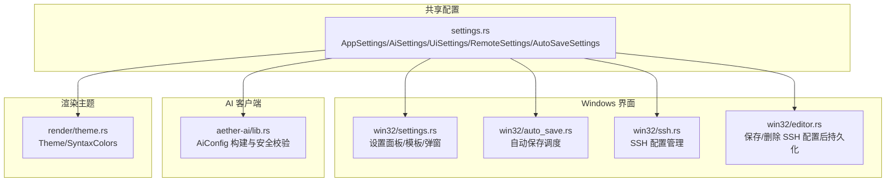
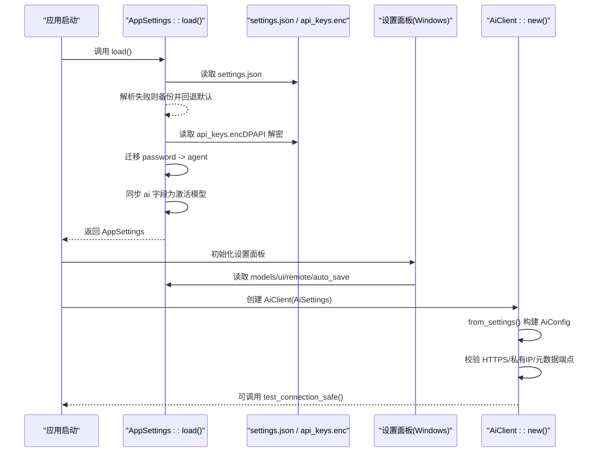
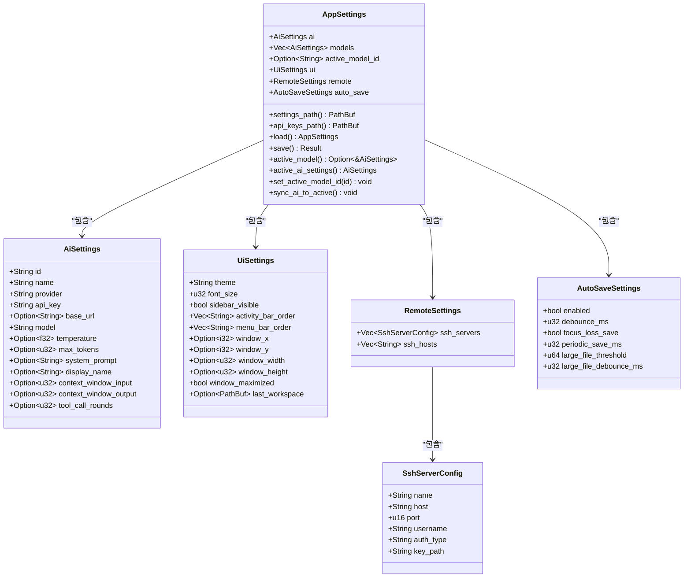
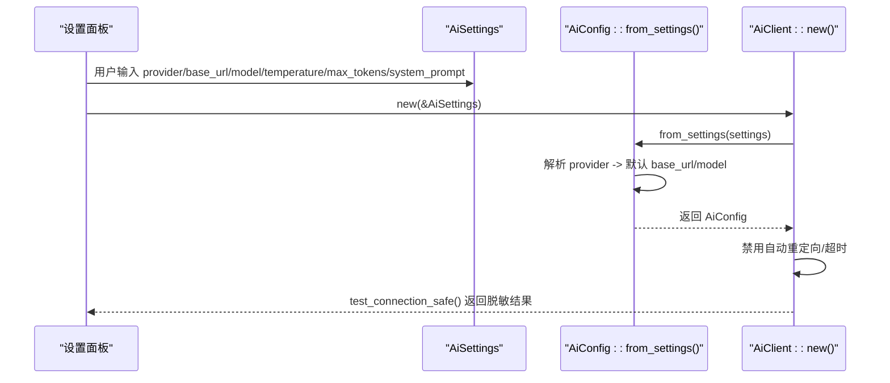
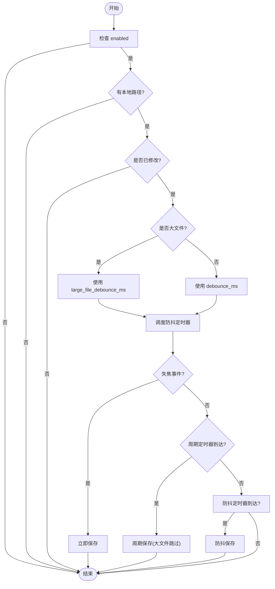
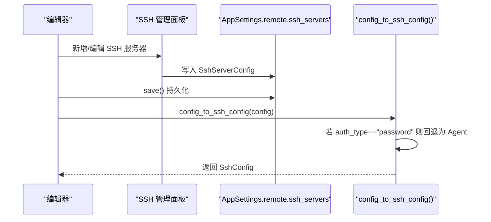
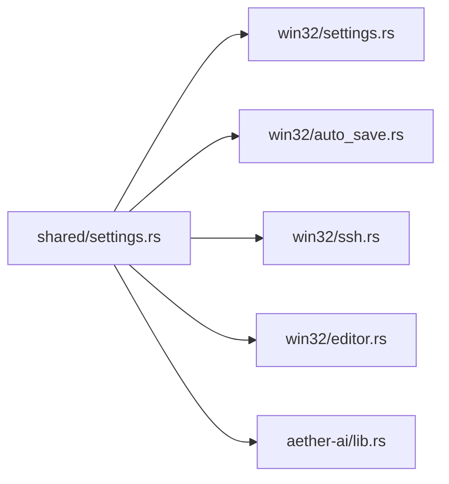

# 配置接口

<cite>
**本文引用的文件**
- [crates/aether-shared/src/settings.rs](file://crates/aether-shared/src/settings.rs)
- [crates/aether-win32/src/settings.rs](file://crates/aether-win32/src/settings.rs)
- [crates/aether-ai/src/lib.rs](file://crates/aether-ai/src/lib.rs)
- [crates/aether-win32/src/auto_save.rs](file://crates/aether-win32/src/auto_save.rs)
- [crates/aether-win32/src/ssh.rs](file://crates/aether-win32/src/ssh.rs)
- [crates/aether-win32/src/editor.rs](file://crates/aether-win32/src/editor.rs)
- [crates/aether-render/src/theme.rs](file://crates/aether-render/src/theme.rs)
</cite>

## 目录
1. [简介](#简介)
2. [项目结构](#项目结构)
3. [核心组件](#核心组件)
4. [架构总览](#架构总览)
5. [详细组件分析](#详细组件分析)
6. [依赖关系分析](#依赖关系分析)
7. [性能与可靠性考虑](#性能与可靠性考虑)
8. [故障排查指南](#故障排查指南)
9. [结论](#结论)
10. [附录：配置示例与迁移指南](#附录配置示例与迁移指南)

## 简介
本文件为牧羊人编辑器的“配置接口”权威文档，覆盖以下范围：
- UI 设置、主题相关字段
- AI 服务配置（多模型管理、密钥安全存储）
- 远程工作区（SSH）配置
- 自动保存策略配置
- 配置的加载优先级、热重载机制与验证流程
- 配置文件示例与代码中使用配置的示例路径
- 配置迁移指南与最佳实践

## 项目结构
配置相关的关键模块与职责：
- aether-shared/settings：定义所有持久化配置的数据结构与默认值，提供加载/保存、加密/解密、迁移逻辑
- aether-win32/settings：UI 侧的设置面板状态、模板、下拉项、弹窗等交互态数据
- aether-ai：从 AiSettings 构建运行时 AiConfig，并执行连接测试与安全校验
- aether-win32/auto_save：基于 AutoSaveSettings 的自动保存调度与降级策略
- aether-win32/ssh：SSH 服务器配置管理与认证类型约束
- aether-render/theme：主题数据结构（供 UI 渲染使用）



图表来源
- [crates/aether-shared/src/settings.rs:1-120](file://crates/aether-shared/src/settings.rs#L1-L120)
- [crates/aether-win32/src/settings.rs:1-120](file://crates/aether-win32/src/settings.rs#L1-L120)
- [crates/aether-ai/src/lib.rs:138-192](file://crates/aether-ai/src/lib.rs#L138-L192)
- [crates/aether-win32/src/auto_save.rs:1-120](file://crates/aether-win32/src/auto_save.rs#L1-L120)
- [crates/aether-win32/src/ssh.rs:43-120](file://crates/aether-win32/src/ssh.rs#L43-L120)
- [crates/aether-render/src/theme.rs:1-80](file://crates/aether-render/src/theme.rs#L1-L80)

章节来源
- [crates/aether-shared/src/settings.rs:1-120](file://crates/aether-shared/src/settings.rs#L1-L120)
- [crates/aether-win32/src/settings.rs:1-120](file://crates/aether-win32/src/settings.rs#L1-L120)

## 核心组件
本节概述所有配置项的结构定义、数据类型、默认值、取值范围与验证规则。

### AppSettings（应用根配置）
- ai: AiSettings（当前激活模型的快照，兼容旧代码）
- models: Vec<AiSettings>（多模型列表）
- active_model_id: Option<String>（当前激活模型 ID）
- ui: UiSettings（UI 设置）
- remote: RemoteSettings（远程/SSH 设置）
- auto_save: AutoSaveSettings（自动保存策略）

章节来源
- [crates/aether-shared/src/settings.rs:7-18](file://crates/aether-shared/src/settings.rs#L7-L18)

### AiSettings（AI 服务配置）
- id: String（默认 "default"）
- name: String（默认 "Default"）
- provider: String（默认 "openai"）
- api_key: String（不序列化到 JSON，单独 DPAPI 加密存储）
- base_url: Option<String>（为空时由 provider 决定默认值）
- model: String（默认 "gpt-4"）
- temperature: Option<f32>（默认 0.7）
- max_tokens: Option<u32>（默认 2048）
- system_prompt: Option<String>
- display_name: Option<String>（展示名称，None 表示使用 model）
- context_window_input: Option<u32>
- context_window_output: Option<u32>
- tool_call_rounds: Option<u32>

注意：
- 加载时若 models 为空，会将 ai 克隆进 models；并为每个模型补全 id/name
- active_model_id 未设置时，默认选择 models 第一个
- 同步 ai 字段为当前激活模型，保持旧代码兼容

章节来源
- [crates/aether-shared/src/settings.rs:75-122](file://crates/aether-shared/src/settings.rs#L75-L122)
- [crates/aether-shared/src/settings.rs:240-338](file://crates/aether-shared/src/settings.rs#L240-L338)

### UiSettings（UI 设置）
- theme: String（空字符串表示默认深色）
- font_size: u32（默认 0）
- sidebar_visible: bool（默认 false）
- activity_bar_order: Vec<String>（空表示默认顺序）
- menu_bar_order: Vec<String>（空表示默认顺序）
- window_x/window_y: Option<i32>（屏幕坐标，None 表示默认位置）
- window_width/window_height: Option<u32>（像素，None 表示默认尺寸）
- window_maximized: bool（默认 false）
- last_workspace: Option<PathBuf>（上次打开的工作区路径）

章节来源
- [crates/aether-shared/src/settings.rs:143-173](file://crates/aether-shared/src/settings.rs#L143-L173)

### RemoteSettings 与 SshServerConfig（远程/SSH）
- ssh_servers: Vec<SshServerConfig>
- ssh_hosts: Vec<String>（兼容旧版，读取忽略）

SshServerConfig：
- name: String
- host: String
- port: u16（默认 22）
- username: String
- auth_type: String（默认 "agent"；仅支持 "key"/"agent"，"password" 在加载时被迁移为 "agent"）
- key_path: String（auth_type == "key" 时使用）

章节来源
- [crates/aether-shared/src/settings.rs:175-212](file://crates/aether-shared/src/settings.rs#L175-L212)
- [crates/aether-shared/src/settings.rs:305-325](file://crates/aether-shared/src/settings.rs#L305-L325)

### AutoSaveSettings（自动保存策略）
- enabled: bool（默认 true）
- debounce_ms: u32（默认 1000）
- focus_loss_save: bool（默认 true）
- periodic_save_ms: u32（默认 30000；0 表示关闭周期兜底）
- large_file_threshold: u64（默认 2MB）
- large_file_debounce_ms: u32（默认 5000）

行为要点：
- 组合式触发：空闲防抖 + 失焦立即保存 + 周期兜底
- 大文件降级：超过阈值则延长防抖、关闭周期保存
- 内容去重：buffer_version 未变跳过写盘
- 冲突检测：外部修改（mtime 变化）暂停自动保存并提示

章节来源
- [crates/aether-shared/src/settings.rs:33-65](file://crates/aether-shared/src/settings.rs#L33-L65)
- [crates/aether-win32/src/auto_save.rs:1-120](file://crates/aether-win32/src/auto_save.rs#L1-L120)

### 主题（Theme）
- Theme 包含编辑器背景、行号、选择高亮、光标、侧边栏、标签页、文本颜色等
- SyntaxColors 包含语法着色与语义 token 颜色
- glass() 与 dark() 两种主题构造方法

章节来源
- [crates/aether-render/src/theme.rs:1-80](file://crates/aether-render/src/theme.rs#L1-L80)
- [crates/aether-render/src/theme.rs:148-200](file://crates/aether-render/src/theme.rs#L148-L200)

## 架构总览
配置加载与运行期使用的整体流程如下：



图表来源
- [crates/aether-shared/src/settings.rs:240-338](file://crates/aether-shared/src/settings.rs#L240-L338)
- [crates/aether-ai/src/lib.rs:166-192](file://crates/aether-ai/src/lib.rs#L166-L192)
- [crates/aether-ai/src/lib.rs:239-258](file://crates/aether-ai/src/lib.rs#L239-L258)

## 详细组件分析

### 配置对象模型（类图）


图表来源
- [crates/aether-shared/src/settings.rs:7-173](file://crates/aether-shared/src/settings.rs#L7-L173)

章节来源
- [crates/aether-shared/src/settings.rs:7-173](file://crates/aether-shared/src/settings.rs#L7-L173)

### AI 配置构建与安全校验（序列图）


图表来源
- [crates/aether-ai/src/lib.rs:166-192](file://crates/aether-ai/src/lib.rs#L166-L192)
- [crates/aether-ai/src/lib.rs:239-258](file://crates/aether-ai/src/lib.rs#L239-L258)

章节来源
- [crates/aether-ai/src/lib.rs:138-192](file://crates/aether-ai/src/lib.rs#L138-L192)
- [crates/aether-ai/src/lib.rs:239-258](file://crates/aether-ai/src/lib.rs#L239-L258)

### 自动保存策略（流程图）


图表来源
- [crates/aether-win32/src/auto_save.rs:48-137](file://crates/aether-win32/src/auto_save.rs#L48-L137)

章节来源
- [crates/aether-win32/src/auto_save.rs:1-120](file://crates/aether-win32/src/auto_save.rs#L1-L120)

### SSH 配置管理与认证约束（序列图）


图表来源
- [crates/aether-win32/src/editor.rs:3373-3434](file://crates/aether-win32/src/editor.rs#L3373-L3434)
- [crates/aether-win32/src/ssh.rs:566-609](file://crates/aether-win32/src/ssh.rs#L566-L609)

章节来源
- [crates/aether-win32/src/ssh.rs:43-120](file://crates/aether-win32/src/ssh.rs#L43-L120)
- [crates/aether-win32/src/editor.rs:3373-3434](file://crates/aether-win32/src/editor.rs#L3373-L3434)

## 依赖关系分析
- aether-shared/settings 被 Windows 界面、AI 客户端、自动保存模块共同消费
- Windows 界面负责将用户输入转换为 AiSettings/RemoteSettings/AutoSaveSettings，并在保存时调用 AppSettings.save()
- AI 客户端从 AiSettings 构建 AiConfig，并进行严格的安全校验（HTTPS、私有 IP、云元数据黑名单）
- 自动保存模块根据 AutoSaveSettings 调度定时器，结合编辑器状态进行原子写入



图表来源
- [crates/aether-shared/src/settings.rs:1-120](file://crates/aether-shared/src/settings.rs#L1-L120)
- [crates/aether-win32/src/settings.rs:1-120](file://crates/aether-win32/src/settings.rs#L1-L120)
- [crates/aether-win32/src/auto_save.rs:1-120](file://crates/aether-win32/src/auto_save.rs#L1-L120)
- [crates/aether-win32/src/ssh.rs:43-120](file://crates/aether-win32/src/ssh.rs#L43-L120)
- [crates/aether-win32/src/editor.rs:3373-3434](file://crates/aether-win32/src/editor.rs#L3373-L3434)
- [crates/aether-ai/src/lib.rs:166-192](file://crates/aether-ai/src/lib.rs#L166-L192)

章节来源
- [crates/aether-shared/src/settings.rs:1-120](file://crates/aether-shared/src/settings.rs#L1-L120)

## 性能与可靠性考虑
- 原子写入：settings.json 采用临时文件 + fsync + rename，避免崩溃导致损坏
- 密钥安全：api_key 不写入 JSON，使用 DPAPI 加密存储于独立文件
- 自动保存：组合式触发与大文件降级，减少 IO 开销与卡顿
- AI 安全：禁用自动重定向、强制 HTTPS、拒绝私有 IP 与云元数据端点

章节来源
- [crates/aether-shared/src/settings.rs:344-417](file://crates/aether-shared/src/settings.rs#L344-L417)
- [crates/aether-win32/src/auto_save.rs:1-120](file://crates/aether-win32/src/auto_save.rs#L1-L120)
- [crates/aether-ai/src/lib.rs:239-258](file://crates/aether-ai/src/lib.rs#L239-L258)

## 故障排查指南
- settings.json 解析失败：会记录警告并将原文件备份为 .json.corrupt，随后回退到默认设置
- API 密钥缺失或损坏：加载时尝试解密，失败则清空对应模型 api_key；保存时若无任何非空 api_key 则删除加密文件
- SSH 密码认证：加载时将 "password" 迁移为 "agent"；连接前再次拦截，确保不会生成 Password 认证
- 自动保存冲突：检测到外部修改（mtime 变化）会暂停自动保存并提示，需手动处理

章节来源
- [crates/aether-shared/src/settings.rs:327-338](file://crates/aether-shared/src/settings.rs#L327-L338)
- [crates/aether-shared/src/settings.rs:305-325](file://crates/aether-shared/src/settings.rs#L305-L325)
- [crates/aether-win32/src/auto_save.rs:200-267](file://crates/aether-win32/src/auto_save.rs#L200-L267)

## 结论
牧羊人编辑器的配置系统以共享结构为核心，结合 Windows 界面与 AI 客户端实现完整生命周期管理。通过原子写入、密钥加密、安全校验与自动保存降级策略，系统在可用性与安全性之间取得良好平衡。建议遵循本文档的配置规范与最佳实践，以获得稳定可靠的体验。

## 附录：配置示例与迁移指南

### 配置文件示例（settings.json）
以下为最小可用的 settings.json 示例（不包含明文 api_key）：
```json
{
  "ai": {
    "provider": "openai",
    "model": "gpt-4",
    "temperature": 0.7,
    "max_tokens": 2048
  },
  "models": [
    {
      "id": "default",
      "name": "Default",
      "provider": "openai",
      "model": "gpt-4",
      "temperature": 0.7,
      "max_tokens": 2048
    }
  ],
  "active_model_id": "default",
  "ui": {
    "theme": "",
    "font_size": 14,
    "sidebar_visible": false,
    "window_x": 100,
    "window_y": 200,
    "window_width": 1280,
    "window_height": 720,
    "window_maximized": false,
    "activity_bar_order": ["files", "search"],
    "menu_bar_order": ["file", "edit"],
    "last_workspace": "C:\\proj"
  },
  "remote": {
    "ssh_servers": []
  },
  "auto_save": {
    "enabled": true,
    "debounce_ms": 1000,
    "focus_loss_save": true,
    "periodic_save_ms": 30000,
    "large_file_threshold": 2097152,
    "large_file_debounce_ms": 5000
  }
}
```

说明：
- api_key 不在 JSON 中，保存在 api_keys.enc（DPAPI 加密）
- theme 为空字符串表示使用默认深色主题
- models 为空时，加载会自动将 ai 克隆进 models 并设置 active_model_id

章节来源
- [crates/aether-shared/src/settings.rs:240-338](file://crates/aether-shared/src/settings.rs#L240-L338)
- [crates/aether-shared/src/settings.rs:143-173](file://crates/aether-shared/src/settings.rs#L143-L173)
- [crates/aether-shared/src/settings.rs:33-65](file://crates/aether-shared/src/settings.rs#L33-L65)

### 代码中使用配置的示例路径
- 从设置面板创建 AiSettings 并保存到 models：[crates/aether-win32/src/settings.rs:458-481](file://crates/aether-win32/src/settings.rs#L458-L481)
- 从 AppSettings 获取当前激活模型：[crates/aether-shared/src/settings.rs:419-444](file://crates/aether-shared/src/settings.rs#L419-L444)
- 构建 AiConfig 并创建 AiClient：[crates/aether-ai/src/lib.rs:166-192](file://crates/aether-ai/src/lib.rs#L166-L192)
- 自动保存调度与触发：[crates/aether-win32/src/auto_save.rs:64-137](file://crates/aether-win32/src/auto_save.rs#L64-L137)
- SSH 配置持久化与删除：[crates/aether-win32/src/editor.rs:3373-3434](file://crates/aether-win32/src/editor.rs#L3373-L3434)

### 配置加载优先级与热重载机制
- 加载优先级：
  - 首先读取 settings.json
  - 若解析失败，备份原文件并回退到默认设置
  - 读取 api_keys.enc（DPAPI 解密），填充各模型的 api_key
  - 迁移 password -> agent，并尽可能持久化迁移结果
  - 同步 ai 字段为当前激活模型
- 热重载机制：
  - 当前仓库未发现对 settings.json 的文件监听与热重载实现
  - 建议在需要时引入文件系统事件监听，并在变更时重新加载与同步 UI

章节来源
- [crates/aether-shared/src/settings.rs:240-338](file://crates/aether-shared/src/settings.rs#L240-L338)

### 配置验证流程
- URL 安全校验：
  - 必须使用 HTTPS
  - 禁止访问私有 IP、链路本地地址与常见云元数据端点
  - DNS 解析后进行二次校验（TOCTOU 防护）
- SSH 认证类型：
  - 仅允许 "key" 与 "agent"；"password" 在加载与连接前均会被迁移/回退为 "agent"
- 自动保存：
  - 大文件阈值与防抖延迟按配置生效
  - 冲突检测阻止静默覆盖外部修改

章节来源
- [crates/aether-ai/src/lib.rs:260-329](file://crates/aether-ai/src/lib.rs#L260-L329)
- [crates/aether-shared/src/settings.rs:305-325](file://crates/aether-shared/src/settings.rs#L305-L325)
- [crates/aether-win32/src/auto_save.rs:200-267](file://crates/aether-win32/src/auto_save.rs#L200-L267)

### 配置迁移指南
- 单模型到多模型：
  - 若 models 为空，加载时自动将 ai 克隆进 models，并为每个模型补全 id/name
  - 若 active_model_id 未设置，默认选择 models 第一个
- API 密钥迁移：
  - 旧版 api_key.enc 迁移到 api_keys.enc（多模型映射）
  - 迁移完成后删除旧版单 key 文件
- SSH 认证迁移：
  - 加载时将 "password" 迁移为 "agent"，并持久化迁移结果

章节来源
- [crates/aether-shared/src/settings.rs:256-325](file://crates/aether-shared/src/settings.rs#L256-L325)
- [crates/aether-shared/src/settings.rs:414-417](file://crates/aether-shared/src/settings.rs#L414-L417)

### 最佳实践建议
- 使用多模型管理不同提供商与参数，合理设置 active_model_id
- 不要直接编辑 api_keys.enc，应通过设置面板修改
- 自定义 base_url 时务必使用 HTTPS，并确保目标主机非私有 IP
- 对于大文件项目，适当增大 large_file_threshold 与 large_file_debounce_ms，避免频繁 IO
- 定期备份 settings.json 与 api_keys.enc，防止意外损坏