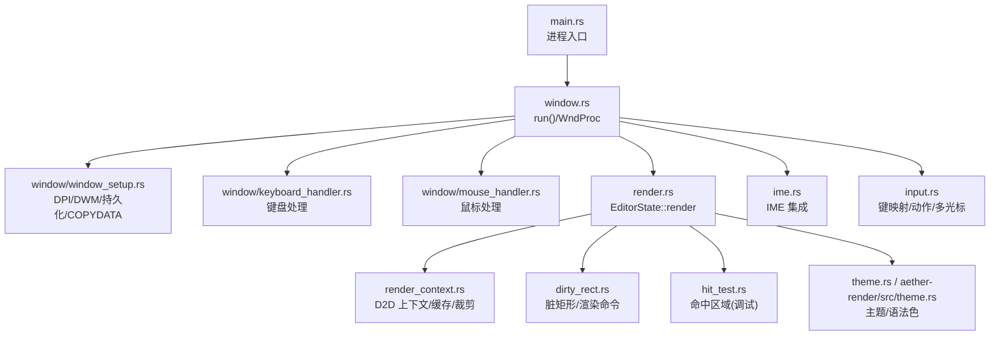
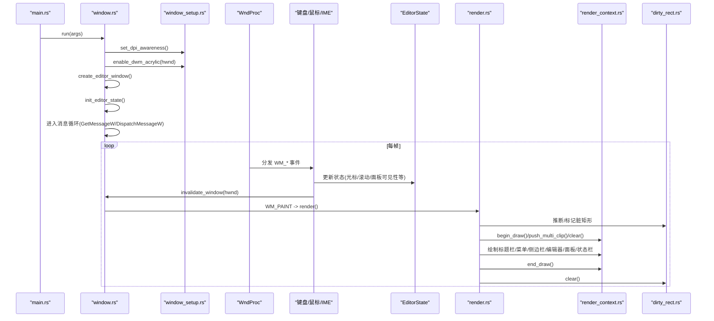
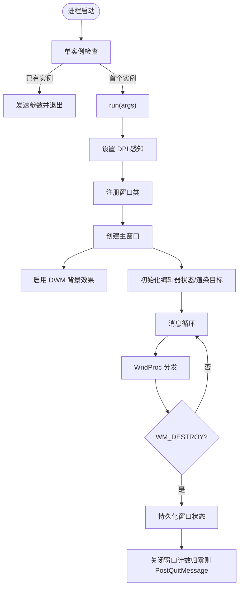
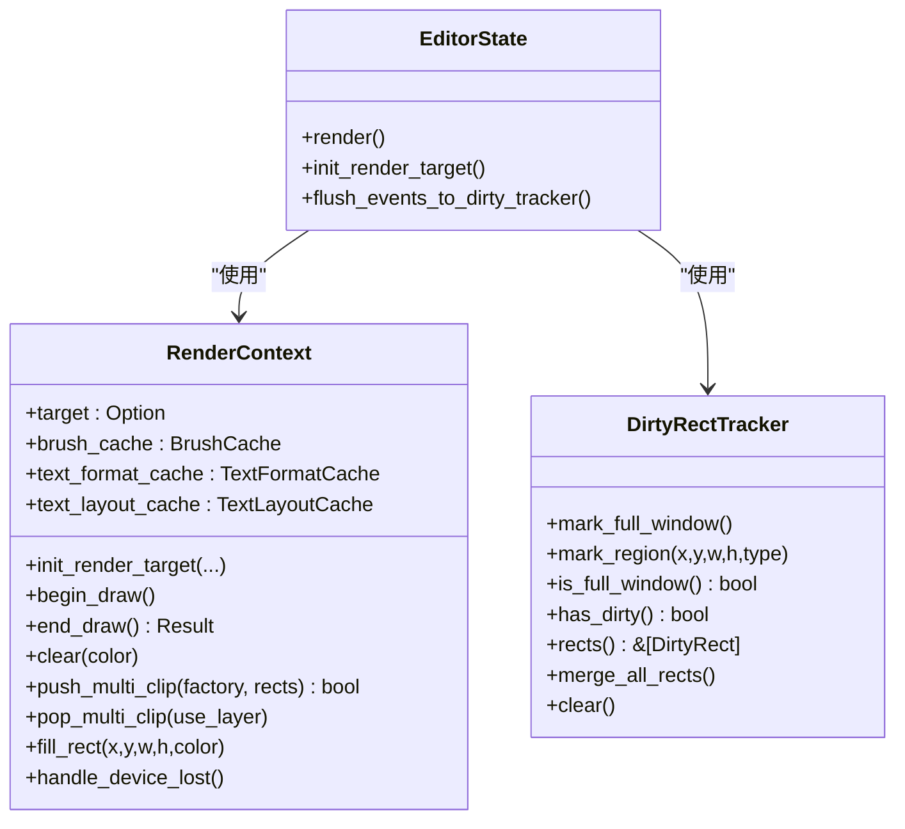
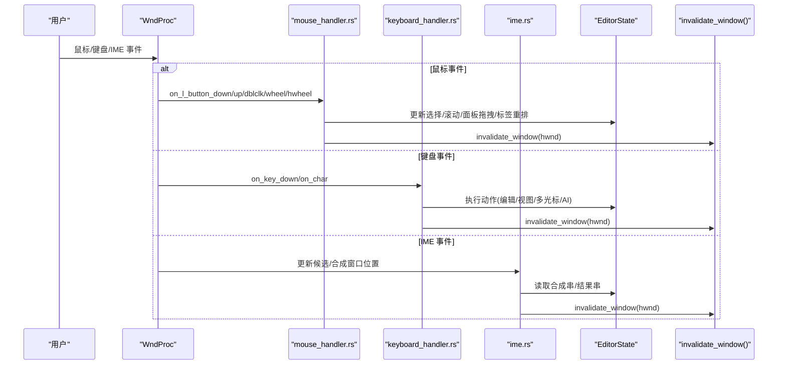
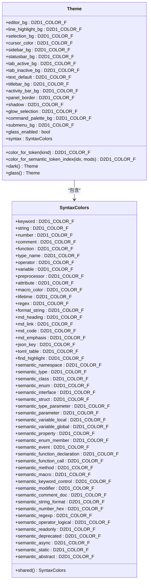
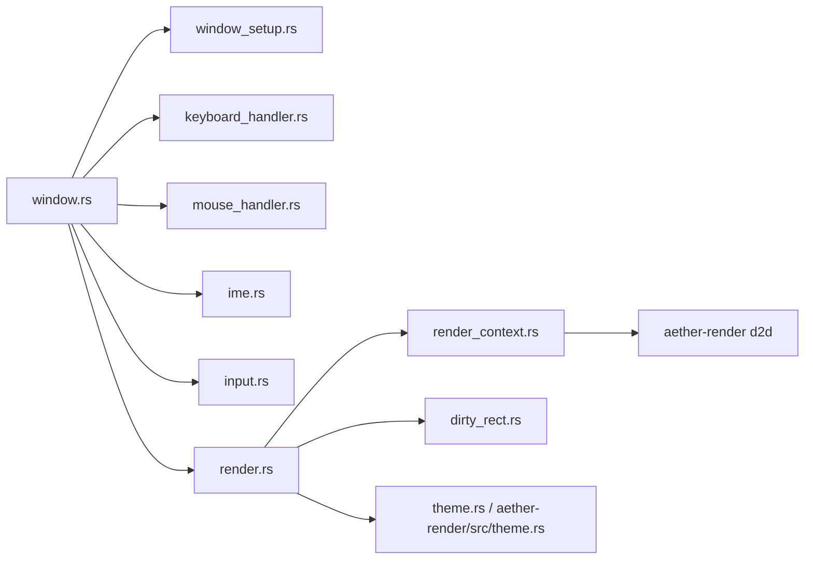

# UI 系统

<cite>
**本文引用的文件**   
- [main.rs](file://crates/aether-win32/src/main.rs)
- [window.rs](file://crates/aether-win32/src/window.rs)
- [window_setup.rs](file://crates/aether-win32/src/window/window_setup.rs)
- [render.rs](file://crates/aether-win32/src/render.rs)
- [render_context.rs](file://crates/aether-win32/src/render_context.rs)
- [dirty_rect.rs](file://crates/aether-win32/src/dirty_rect.rs)
- [hit_test.rs](file://crates/aether-win32/src/hit_test.rs)
- [input.rs](file://crates/aether-win32/src/input.rs)
- [ime.rs](file://crates/aether-win32/src/ime.rs)
- [keyboard_handler.rs](file://crates/aether-win32/src/window/keyboard_handler.rs)
- [mouse_handler.rs](file://crates/aether-win32/src/window/mouse_handler.rs)
- [theme.rs](file://crates/aether-win32/src/theme.rs)
- [aether-render_theme.rs](file://crates/aether-render/src/theme.rs)
- [aether-render_lib.rs](file://crates/aether-render/src/lib.rs)
</cite>

## 更新摘要
**所做更改**   
- 移除了账户管理页面相关的所有UI组件和渲染逻辑
- 简化了用户界面架构，删除了account相关的渲染模块
- 更新了渲染流程以反映简化的UI结构
- 清理了与账户管理相关的依赖关系

## 目录
1. [简介](#简介)
2. [项目结构](#项目结构)
3. [核心组件](#核心组件)
4. [架构总览](#架构总览)
5. [详细组件分析](#详细组件分析)
6. [依赖关系分析](#依赖关系分析)
7. [性能考量](#性能考量)
8. [故障排查指南](#故障排查指南)
9. [结论](#结论)
10. [附录](#附录)

## 简介
本技术文档面向牧羊人编辑器的 UI 子系统，聚焦以下方面：
- Win32 窗口管理机制：窗口创建、消息循环与事件分发
- Direct2D/DirectWrite 渲染集成：绘制上下文管理、脏矩形优化与动画效果
- 输入事件处理：键盘映射、鼠标交互与输入法（IME）支持
- 主题系统：颜色管理、样式继承与动态切换
- UI 组件开发最佳实践与性能优化技巧

**已更新** 移除了账户管理页面功能，简化了UI架构

## 项目结构
UI 子系统主要位于 aether-win32 crate 中，围绕 window 模块组织；渲染相关能力由 aether-render crate 提供。关键入口与职责如下：
- main.rs：进程启动、单实例控制、调用 run(args)
- window.rs：注册窗口类、创建主窗口、消息循环、WndProc 分发
- window/window_setup.rs：DPI 感知、DWM 背景效果、窗口持久化、COPYDATA 处理
- render.rs：EditorState::render 主渲染流程、区域裁剪、设备丢失恢复
- render_context.rs：Direct2D 渲染目标封装、画刷/文本格式缓存、多矩形裁剪
- dirty_rect.rs：脏矩形追踪与渲染命令推断
- hit_test.rs：命中区域记录（调试/测试构建）
- input.rs：按键类型、快捷键绑定、动作枚举、多光标模型
- ime.rs：IMM32 集成，候选/合成窗口定位与 DPI 缩放
- window/keyboard_handler.rs、window/mouse_handler.rs：键盘/鼠标事件拆分处理
- theme.rs：UI 设置与默认主题工厂
- aether-render/src/theme.rs：Theme/SyntaxColors 定义与颜色映射

**图表来源** 
- [main.rs:1-52](file://crates/aether-win32/src/main.rs#L1-L52)
- [window.rs:114-173](file://crates/aether-win32/src/window.rs#L114-L173)
- [window_setup.rs:18-86](file://crates/aether-win32/src/window/window_setup.rs#L18-L86)
- [render.rs:62-780](file://crates/aether-win32/src/render.rs#L62-L780)
- [render_context.rs:1-226](file://crates/aether-win32/src/render_context.rs#L1-L226)
- [dirty_rect.rs:1-707](file://crates/aether-win32/src/dirty_rect.rs#L1-L707)
- [hit_test.rs:1-245](file://crates/aether-win32/src/hit_test.rs#L1-L245)
- [ime.rs:1-255](file://crates/aether-win32/src/ime.rs#L1-L255)
- [input.rs:1-355](file://crates/aether-win32/src/input.rs#L1-L355)
- [theme.rs:1-26](file://crates/aether-win32/src/theme.rs#L1-L26)
- [aether-render_theme.rs:1-485](file://crates/aether-render/src/theme.rs#L1-L485)

**章节来源**
- [main.rs:1-52](file://crates/aether-win32/src/main.rs#L1-L52)
- [window.rs:114-173](file://crates/aether-win32/src/window.rs#L114-L173)

## 核心组件
- 窗口与消息循环
  - 注册窗口类、创建主窗口、设置 DPI 感知与 DWM 背景效果
  - 全局窗口计数确保多窗口正确退出
  - WndProc 统一分发到各处理器
- 渲染管线
  - EditorState::render 负责布局计算、脏区推断、裁剪与绘制
  - RenderContext 封装 D2D 目标、画刷/文本格式缓存、多矩形裁剪
  - DirtyRectTracker 维护脏矩形并推断最小重绘范围
- 输入系统
  - KeyMap 将虚拟键码转换为编辑器动作
  - 鼠标/滚轮处理覆盖标签栏、侧边栏、终端等区域
  - IME 集成支持候选/合成窗口定位与 DPI 缩放
- 主题系统
  - Theme 提供玻璃/深色两套配色，SyntaxColors 集中管理语法着色
  - 通过 BrushCache/TextFormatCache 预初始化常用资源

**已更新** 移除了账户管理相关的渲染组件，简化了渲染管线

**章节来源**
- [window.rs:175-297](file://crates/aether-win32/src/window.rs#L175-L297)
- [render.rs:62-780](file://crates/aether-win32/src/render.rs#L62-L780)
- [render_context.rs:1-226](file://crates/aether-win32/src/render_context.rs#L1-L226)
- [dirty_rect.rs:1-707](file://crates/aether-win32/src/dirty_rect.rs#L1-L707)
- [input.rs:1-355](file://crates/aether-win32/src/input.rs#L1-L355)
- [ime.rs:1-255](file://crates/aether-win32/src/ime.rs#L1-L255)
- [theme.rs:1-26](file://crates/aether-win32/src/theme.rs#L1-L26)
- [aether-render_theme.rs:1-485](file://crates/aether-render/src/theme.rs#L1-L485)

## 架构总览
下图展示从进程启动到渲染输出的关键路径，以及输入事件如何驱动状态变更与重绘。

**图表来源** 
- [main.rs:1-52](file://crates/aether-win32/src/main.rs#L1-L52)
- [window.rs:114-173](file://crates/aether-win32/src/window.rs#L114-L173)
- [window_setup.rs:18-86](file://crates/aether-win32/src/window/window_setup.rs#L18-L86)
- [render.rs:62-780](file://crates/aether-win32/src/render.rs#L62-L780)
- [render_context.rs:66-155](file://crates/aether-win32/src/render_context.rs#L66-L155)
- [dirty_rect.rs:387-426](file://crates/aether-win32/src/dirty_rect.rs#L387-L426)

## 详细组件分析

### Win32 窗口管理与消息循环
- 窗口类注册与创建
  - 使用 RegisterClassW 注册窗口类，CreateWindowExW 创建主窗口
  - 启用 CS_DBLCLKS 以接收双击消息
  - 应用 DWM 属性实现 Acrylic/Mica 背景与透明客户区穿透
- DPI 感知与尺寸恢复
  - 优先使用 Per-Monitor V2 DPI 感知，失败回退至 Per-Monitor
  - 根据持久化 settings 计算窗口矩形，校验显示器存在性
  - 最大化状态在创建后通过 ShowWindow(SW_MAXIMIZE) 恢复
- 消息循环与分发
  - GetMessageW/TranslateMessage/DispatchMessageW 标准循环
  - WndProc 内 catch_unwind 包裹，异常时回退 DefWindowProcW
  - 自定义消息用于低层键盘钩子投递（终端直接接收编辑键）
- 窗口生命周期与持久化
  - WM_DESTROY 中卸载键盘钩子、持久化窗口位置/最大化/工作区
  - 全局窗口计数保证所有窗口关闭才退出应用

**图表来源** 
- [main.rs:1-52](file://crates/aether-win32/src/main.rs#L1-L52)
- [window.rs:114-173](file://crates/aether-win32/src/window.rs#L114-L173)
- [window_setup.rs:18-86](file://crates/aether-win32/src/window/window_setup.rs#L18-L86)
- [window_setup.rs:110-178](file://crates/aether-win32/src/window/window_setup.rs#L110-L178)
- [window_setup.rs:188-217](file://crates/aether-win32/src/window/window_setup.rs#L188-L217)
- [window.rs:299-373](file://crates/aether-win32/src/window.rs#L299-L373)

**章节来源**
- [window.rs:175-297](file://crates/aether-win32/src/window.rs#L175-L297)
- [window_setup.rs:18-86](file://crates/aether-win32/src/window/window_setup.rs#L18-L86)
- [window_setup.rs:110-178](file://crates/aether-win32/src/window/window_setup.rs#L110-L178)
- [window_setup.rs:188-217](file://crates/aether-win32/src/window/window_setup.rs#L188-L217)
- [window.rs:299-373](file://crates/aether-win32/src/window.rs#L299-L373)

### Direct2D/DirectWrite 渲染集成
- 绘制上下文管理
  - RenderContext 封装 ID2D1HwndRenderTarget、BrushCache、TextFormatCache、TextLayoutCache
  - 设备丢失时清理并重建资源，避免崩溃
- 脏矩形与裁剪
  - DirtyRectTracker 按区域类型合并重叠矩形，超过阈值降级为全窗口重绘
  - RenderContext::push_multi_clip 支持多矩形并集裁剪，失败回退包围盒
- 渲染流程
  - EditorState::render 先计算布局与可见行范围，重建增量缓存
  - 根据状态变化推断 RenderCommand，仅标记必要脏区域
  - 按层级绘制：标题栏→菜单栏→活动栏→侧边栏→标签栏→编辑器/欢迎页/设置→右侧面板→底部面板→状态栏→弹出菜单/对话框
  - 最后清除脏标记并输出命中区域（调试）

**已更新** 移除了账户管理页面的渲染逻辑，简化了绘制层级

**图表来源** 
- [render_context.rs:1-226](file://crates/aether-win32/src/render_context.rs#L1-L226)
- [dirty_rect.rs:1-707](file://crates/aether-win32/src/dirty_rect.rs#L1-L707)
- [render.rs:62-780](file://crates/aether-win32/src/render.rs#L62-L780)

**章节来源**
- [render.rs:62-780](file://crates/aether-win32/src/render.rs#L62-L780)
- [render_context.rs:1-226](file://crates/aether-win32/src/render_context.rs#L1-L226)
- [dirty_rect.rs:1-707](file://crates/aether-win32/src/dirty_rect.rs#L1-L707)

### 输入事件处理系统
- 键盘映射
  - KeyMap 将 VK 码与修饰键组合映射到 EditorAction
  - vk_to_char 使用 ToUnicode 获取当前键盘布局字符，支持多语言
- 鼠标交互
  - 左键按下/抬起/双击：选择、拖拽、标签重排、长按检测
  - 滚轮：标签栏横向滚动、Shift+滚轮横向滚动、终端面板滚动、侧边栏滚动
  - 水平滚轮：编辑器内容横向滚动
- IME 支持
  - IMM32 集成：ImmGetContext/ImmSetCandidateWindow/ImmSetCompositionWindow
  - 候选/合成窗口尺寸随 DPI 缩放，跟随光标定位
  - 支持临时解除 IME 关联以旁路系统级拦截（如终端删除汉字问题）

**图表来源** 
- [window.rs:301-373](file://crates/aether-win32/src/window.rs#L301-L373)
- [mouse_handler.rs:1-277](file://crates/aether-win32/src/window/mouse_handler.rs#L1-L277)
- [keyboard_handler.rs:1-13](file://crates/aether-win32/src/window/keyboard_handler.rs#L1-L13)
- [ime.rs:1-255](file://crates/aether-win32/src/ime.rs#L1-L255)
- [input.rs:1-355](file://crates/aether-win32/src/input.rs#L1-L355)

**章节来源**
- [input.rs:1-355](file://crates/aether-win32/src/input.rs#L1-L355)
- [mouse_handler.rs:1-277](file://crates/aether-win32/src/window/mouse_handler.rs#L1-L277)
- [keyboard_handler.rs:1-13](file://crates/aether-win32/src/window/keyboard_handler.rs#L1-L13)
- [ime.rs:1-255](file://crates/aether-win32/src/ime.rs#L1-L255)

### 主题系统
- 颜色管理
  - Theme 包含编辑器背景、行号、选择高亮、侧边栏、状态栏、标签栏、标题栏、阴影、光晕等字段
  - SyntaxColors 统一管理关键字、字符串、注释、函数、类型名、语义令牌等颜色
  - color_for_token/color_for_semantic_token_index 提供通用 token 与语义令牌的颜色查找
- 样式继承与默认值
  - dark() 与 glass() 共享 SyntaxColors::shared()，减少重复
  - Default 实现返回 glass 主题
- 动态切换
  - 通过 brush_cache.init_common_brushes 与 text_format_cache.init_common_formats 预初始化常用资源
  - 设备丢失或主题切换时重建缓存

**图表来源** 
- [aether-render_theme.rs:1-485](file://crates/aether-render/src/theme.rs#L1-L485)

**章节来源**
- [aether-render_theme.rs:1-485](file://crates/aether-render/src/theme.rs#L1-L485)
- [theme.rs:1-26](file://crates/aether-win32/src/theme.rs#L1-L26)
- [render_context.rs:189-217](file://crates/aether-win32/src/render_context.rs#L189-L217)

## 依赖关系分析
- 模块耦合
  - window.rs 依赖 window_setup、keyboard_handler、mouse_handler、render、ime、input
  - render.rs 依赖 render_context、dirty_rect、theme、layout、icons 等
  - render_context.rs 依赖 aether-render d2d factory/brush/text 缓存
- 外部依赖
  - Windows API：窗口、消息、DWM、GDI、HiDpi、IME、Direct2D、DirectWrite
  - aether-core：字符宽度、词法分析器语言枚举
  - aether-shared：AppSettings 持久化

**已更新** 移除了账户管理相关的依赖关系，简化了模块耦合

**图表来源** 
- [window.rs:1-373](file://crates/aether-win32/src/window.rs#L1-L373)
- [render.rs:1-800](file://crates/aether-win32/src/render.rs#L1-L800)
- [render_context.rs:1-226](file://crates/aether-win32/src/render_context.rs#L1-L226)
- [dirty_rect.rs:1-707](file://crates/aether-win32/src/dirty_rect.rs#L1-L707)
- [aether-render_lib.rs:1-4](file://crates/aether-render/src/lib.rs#L1-L4)

**章节来源**
- [window.rs:1-373](file://crates/aether-win32/src/window.rs#L1-L373)
- [render.rs:1-800](file://crates/aether-win32/src/render.rs#L1-L800)
- [render_context.rs:1-226](file://crates/aether-win32/src/render_context.rs#L1-L226)
- [dirty_rect.rs:1-707](file://crates/aether-win32/src/dirty_rect.rs#L1-L707)
- [aether-render_lib.rs:1-4](file://crates/aether-render/src/lib.rs#L1-L4)

## 性能考量
- 脏矩形优化
  - 按区域类型合并重叠矩形，数量超过阈值自动降级为全窗口重绘
  - 无状态变化时跳过渲染（RenderCommand::None），避免空转
- 裁剪策略
  - 多矩形并集裁剪减少无效绘制，失败回退包围盒保证稳定性
- 资源缓存
  - 画刷与文本格式缓存避免每帧创建 COM 对象
  - 设备丢失时快速重建并恢复缓存
- 命中区域记录
  - debug 构建下记录可点击区域，release 构建零开销

**已更新** 移除账户管理页面减少了渲染复杂度，提升了整体性能

[本节为通用指导，不直接分析具体文件]

## 故障排查指南
- 窗口未显示或黑屏
  - 检查 DPI 感知是否成功设置，DWM 背景效果是否启用
  - 确认渲染目标已初始化且尺寸有效
- 中文输入异常
  - 验证 IME 候选/合成窗口位置是否正确更新
  - 终端场景下确认是否临时解除了 IME 关联
- 频繁全量重绘
  - 检查脏矩形标记逻辑，确认是否误触发 FullRedraw
  - 观察是否有过多不相交脏矩形导致阈值触发
- 设备丢失导致崩溃
  - 捕获错误码并调用 handle_device_lost，重建渲染目标与缓存

**章节来源**
- [window_setup.rs:18-86](file://crates/aether-win32/src/window/window_setup.rs#L18-L86)
- [render.rs:704-746](file://crates/aether-win32/src/render.rs#L704-L746)
- [render_context.rs:219-225](file://crates/aether-win32/src/render_context.rs#L219-L225)
- [ime.rs:208-243](file://crates/aether-win32/src/ime.rs#L208-L243)
- [dirty_rect.rs:387-426](file://crates/aether-win32/src/dirty_rect.rs#L387-L426)

## 结论
牧羊人编辑器的 UI 系统采用清晰的 Win32 窗口管理与 Direct2D/DirectWrite 渲染分层设计，结合脏矩形与多矩形裁剪显著降低重绘成本。随着账户管理页面功能的移除，UI 架构得到进一步简化，提高了系统的可维护性和性能。输入系统通过模块化键盘/鼠标/IME 处理提升可维护性，主题系统提供灵活的配色与语法着色方案。遵循本文的最佳实践与性能建议，可进一步提升 UI 响应性与稳定性。

**已更新** 反映了账户管理页面移除后的简化架构

[本节为总结，不直接分析具体文件]

## 附录
- 术语
  - DPI：每英寸点数，影响 UI 缩放
  - DWM：桌面窗口管理器，提供 Acrylic/Mica 背景
  - IMM32：输入法管理器，用于 IME 集成
  - D2D/DWrite：Direct2D/DirectWrite，GPU 加速图形与文本渲染
- 参考路径
  - 窗口创建与设置：[window_setup.rs](file://crates/aether-win32/src/window/window_setup.rs)
  - 渲染主流程：[render.rs](file://crates/aether-win32/src/render.rs)
  - 渲染上下文：[render_context.rs](file://crates/aether-win32/src/render_context.rs)
  - 脏矩形系统：[dirty_rect.rs](file://crates/aether-win32/src/dirty_rect.rs)
  - 输入与 IME：[input.rs](file://crates/aether-win32/src/input.rs)、[ime.rs](file://crates/aether-win32/src/ime.rs)
  - 主题系统：[theme.rs](file://crates/aether-win32/src/theme.rs)、[aether-render/src/theme.rs](file://crates/aether-render/src/theme.rs)

**已更新** 移除了账户管理相关的参考路径

[本节为附录，不直接分析具体文件]