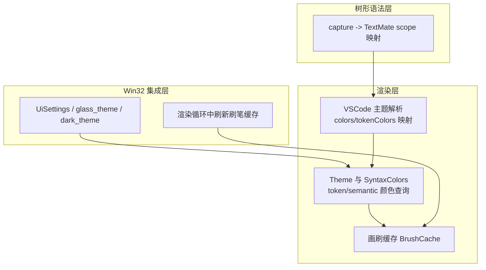
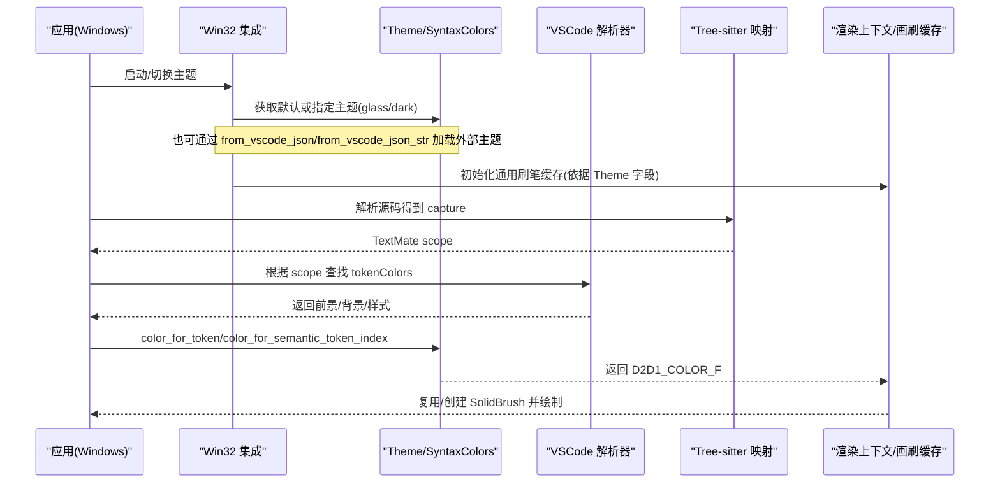
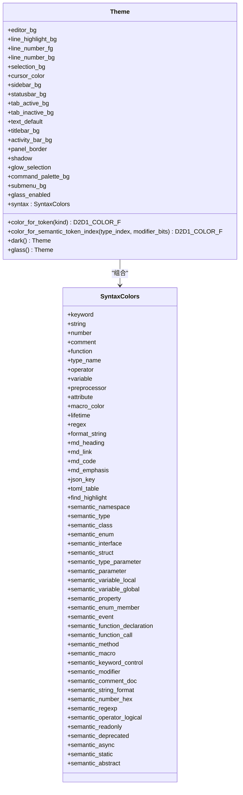
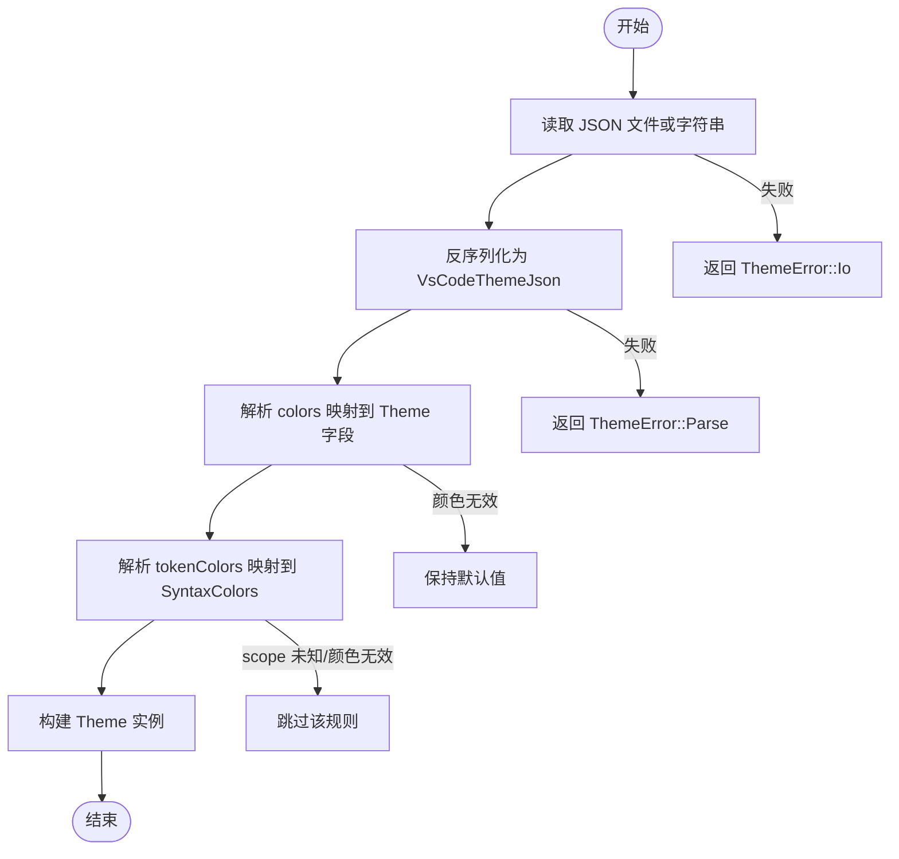
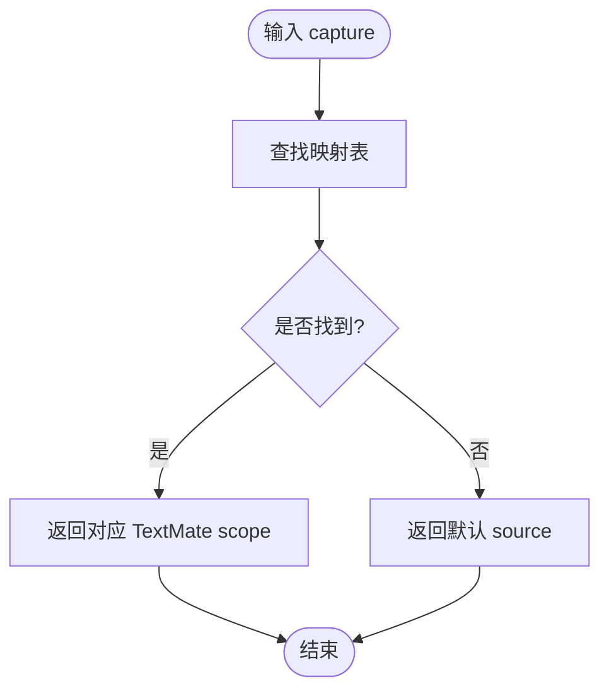
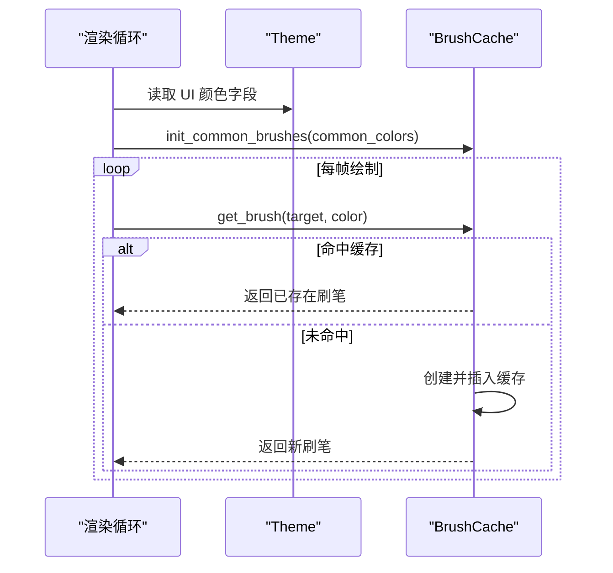
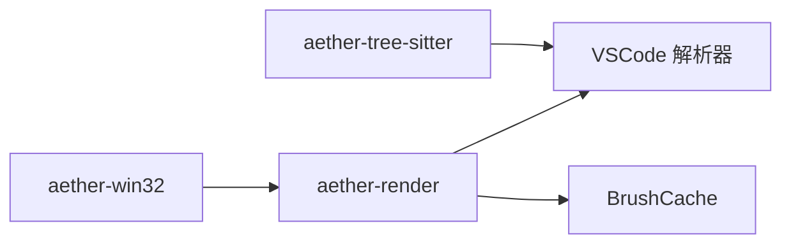

# 主题系统

<cite>
**本文引用的文件**   
- [crates/aether-render/src/theme.rs](file://crates/aether-render/src/theme.rs)
- [crates/aether-render/src/vscode_theme.rs](file://crates/aether-render/src/vscode_theme.rs)
- [crates/aether-tree-sitter/src/theme_mapping.rs](file://crates/aether-tree-sitter/src/theme_mapping.rs)
- [crates/aether-win32/src/theme.rs](file://crates/aether-win32/src/theme.rs)
- [crates/aether-win32/src/render.rs](file://crates/aether-win32/src/render.rs)
- [crates/aether-render/src/d2d/brush_cache.rs](file://crates/aether-render/src/d2d/brush_cache.rs)
</cite>

## 目录
1. [简介](#简介)
2. [项目结构](#项目结构)
3. [核心组件](#核心组件)
4. [架构总览](#架构总览)
5. [详细组件分析](#详细组件分析)
6. [依赖关系分析](#依赖关系分析)
7. [性能与内存管理](#性能与内存管理)
8. [可访问性与对比度检查](#可访问性与对比度检查)
9. [VSCode 主题兼容性](#vscode-主题兼容性)
10. [主题开发与最佳实践](#主题开发与最佳实践)
11. [故障排查指南](#故障排查指南)
12. [结论](#结论)

## 简介
本技术文档围绕牧羊人编辑器的“主题系统”，系统性阐述以下方面：
- 主题配置结构：颜色定义、字体设置、语法高亮规则与 UI 样式配置。
- 主题加载与切换机制：动态应用、缓存策略与内存管理。
- VSCode 主题兼容：JSON 解析、属性映射与默认值处理。
- 颜色空间转换与可访问性：十六进制到渲染颜色空间的转换，以及对比度建议。
- 主题开发指南与自定义主题最佳实践。

## 项目结构
主题系统涉及渲染层、Win32 集成层与 Tree-sitter 语义映射模块：
- aether-render：主题数据模型、VSCode 主题解析、Token/Semantic 颜色查找。
- aether-win32：UI 设置、主题入口函数、渲染时刷笔缓存初始化。
- aether-tree-sitter：Tree-sitter capture 到 TextMate scope 的映射，支撑 VSCode 生态主题匹配。

图表来源
- [crates/aether-render/src/theme.rs](file://crates/aether-render/src/theme.rs)
- [crates/aether-render/src/vscode_theme.rs](file://crates/aether-render/src/vscode_theme.rs)
- [crates/aether-tree-sitter/src/theme_mapping.rs](file://crates/aether-tree-sitter/src/theme_mapping.rs)
- [crates/aether-win32/src/theme.rs](file://crates/aether-win32/src/theme.rs)
- [crates/aether-win32/src/render.rs](file://crates/aether-win32/src/render.rs)
- [crates/aether-render/src/d2d/brush_cache.rs](file://crates/aether-render/src/d2d/brush_cache.rs)

章节来源
- [crates/aether-render/src/theme.rs](file://crates/aether-render/src/theme.rs)
- [crates/aether-render/src/vscode_theme.rs](file://crates/aether-render/src/vscode_theme.rs)
- [crates/aether-tree-sitter/src/theme_mapping.rs](file://crates/aether-tree-sitter/src/theme_mapping.rs)
- [crates/aether-win32/src/theme.rs](file://crates/aether-win32/src/theme.rs)
- [crates/aether-win32/src/render.rs](file://crates/aether-win32/src/render.rs)
- [crates/aether-render/src/d2d/brush_cache.rs](file://crates/aether-render/src/d2d/brush_cache.rs)

## 核心组件
- Theme 与 SyntaxColors：承载编辑器背景、行号、选择、光标、侧边栏、状态栏、标签页、文本默认色等 UI 颜色，以及关键字、字符串、数字、注释、函数、类型名、操作符、变量、预处理、属性、宏、生命周期、正则、格式化字符串、Markdown、JSON/TOML 等语法颜色；同时提供 Token 与 Semantic token 的颜色查询接口。
- VSCode 主题解析器：支持从 JSON 文件或字符串加载 VSCode 主题，解析 colors 与 tokenColors，并映射到内部 Theme/SyntaxColors；包含错误类型与健壮的回退策略。
- Tree-sitter 映射：将 Tree-sitter capture 名称映射为 TextMate scope，使基于 TextMate 的 VSCode 主题能正确匹配语义元素。
- Win32 集成：提供 UiSettings 与 glass_theme/dark_theme 入口；在渲染循环中根据当前主题批量初始化刷笔缓存。
- 画刷缓存：按颜色键缓存 ID2D1SolidColorBrush，避免频繁创建 COM 对象，提升渲染性能。

章节来源
- [crates/aether-render/src/theme.rs](file://crates/aether-render/src/theme.rs)
- [crates/aether-render/src/vscode_theme.rs](file://crates/aether-render/src/vscode_theme.rs)
- [crates/aether-tree-sitter/src/theme_mapping.rs](file://crates/aether-tree-sitter/src/theme_mapping.rs)
- [crates/aether-win32/src/theme.rs](file://crates/aether-win32/src/theme.rs)
- [crates/aether-win32/src/render.rs](file://crates/aether-win32/src/render.rs)
- [crates/aether-render/src/d2d/brush_cache.rs](file://crates/aether-render/src/d2d/brush_cache.rs)

## 架构总览
主题系统的数据流与调用链如下：

图表来源
- [crates/aether-win32/src/theme.rs](file://crates/aether-win32/src/theme.rs)
- [crates/aether-render/src/theme.rs](file://crates/aether-render/src/theme.rs)
- [crates/aether-render/src/vscode_theme.rs](file://crates/aether-render/src/vscode_theme.rs)
- [crates/aether-tree-sitter/src/theme_mapping.rs](file://crates/aether-tree-sitter/src/theme_mapping.rs)
- [crates/aether-win32/src/render.rs](file://crates/aether-win32/src/render.rs)
- [crates/aether-render/src/d2d/brush_cache.rs](file://crates/aether-render/src/d2d/brush_cache.rs)

## 详细组件分析

### 主题数据结构与颜色查询
- Theme 包含大量 UI 颜色字段（编辑器背景、行号、选择、光标、侧边栏、状态栏、标签页、标题栏、活动栏、面板边框、阴影、光晕选择、命令面板、子菜单等），并提供 glass_enabled 开关以启用毛玻璃效果。
- SyntaxColors 覆盖广泛语法类别，包括基础语法与语义令牌（命名空间、类型、类、枚举、接口、结构体、参数、变量、属性、事件、函数声明/调用/方法、宏、控制关键字、修饰符、文档注释、格式化字符串、十六进制数、正则、逻辑运算符、只读、废弃、异步、静态、抽象等）。
- 提供两类查询：
  - 基于 TokenKind 的通用 token 颜色查询。
  - 基于语义令牌索引的语义颜色查询，用于 LSP/Tree-sitter 语义高亮。

图表来源
- [crates/aether-render/src/theme.rs](file://crates/aether-render/src/theme.rs)

章节来源
- [crates/aether-render/src/theme.rs](file://crates/aether-render/src/theme.rs)

### VSCode 主题兼容实现
- 支持从路径或字符串加载 VSCode 主题 JSON，解析 name、type、colors、tokenColors、semanticHighlighting、semanticTokenColors 等字段。
- colors 映射：将 editor.background、editor.foreground、editor.selectionBackground、editorCursor.foreground、editorLineNumber.foreground、editor.lineHighlightBackground、sideBar.background、statusBar.background、tab.activeBackground、tab.inactiveBackground 等映射到 Theme 对应字段；可选扩展键如 titleBar.activeBackground、activityBar.background、sideBar.border、dropdown.background、menu.background 映射到毛玻璃相关字段。
- tokenColors 映射：将 TextMate scope 列表中的常见 scope 映射到 SyntaxColors 字段（如 keyword、string、comment、constant.numeric、entity.name.function、entity.name.type、markup.heading/markup.link/markup.inline.raw/markup.fenced_code.block/markup.italic/markup.bold 等）。
- 颜色解析：支持 #RGB、#RRGGBB、#RRGGBBAA 格式，自动去除前导 # 与空白，非法颜色回退到默认值。
- 错误处理：定义 ThemeError（IO、Parse、InvalidColor）并实现 Display/Error。

图表来源
- [crates/aether-render/src/vscode_theme.rs](file://crates/aether-render/src/vscode_theme.rs)

章节来源
- [crates/aether-render/src/vscode_theme.rs](file://crates/aether-render/src/vscode_theme.rs)

### Tree-sitter 到 TextMate 的映射
- 提供 capture_to_textmate_scope 函数，将 Tree-sitter capture 名称映射为 TextMate scope，涵盖变量、常量、模块/命名空间、类型、类/接口/枚举/结构体、函数/方法/构造/调用、属性、关键字、运算符、注释、字符串、数字、标签/属性、标点、标签/生命周期、宏、include、异常等。
- build_theme_mapping 构建完整映射表，便于后续匹配。

图表来源
- [crates/aether-tree-sitter/src/theme_mapping.rs](file://crates/aether-tree-sitter/src/theme_mapping.rs)

章节来源
- [crates/aether-tree-sitter/src/theme_mapping.rs](file://crates/aether-tree-sitter/src/theme_mapping.rs)

### 渲染层刷笔缓存与主题应用
- 在渲染循环中，当检测到主题变化时，将 Theme 的各颜色字段收集为 common_colors，并调用 brush_cache.init_common_brushes 预计算常用刷笔，减少重复创建开销。
- 文本渲染过程中按需通过 brush_cache.get_brush 获取 SolidBrush，命中预存数组或 HashMap 则直接复用，未命中则创建并缓存。
- 设备丢失时可清空缓存，确保资源重建。

图表来源
- [crates/aether-win32/src/render.rs](file://crates/aether-win32/src/render.rs)
- [crates/aether-render/src/d2d/brush_cache.rs](file://crates/aether-render/src/d2d/brush_cache.rs)

章节来源
- [crates/aether-win32/src/render.rs](file://crates/aether-win32/src/render.rs)
- [crates/aether-render/src/d2d/brush_cache.rs](file://crates/aether-render/src/d2d/brush_cache.rs)

## 依赖关系分析
- aether-win32 依赖 aether-render 的 Theme 与 VSCode 解析能力，并在渲染阶段使用 BrushCache。
- aether-render 的 VSCode 解析器依赖 serde/serde_json 进行 JSON 反序列化，并将结果映射到 Theme/SyntaxColors。
- aether-tree-sitter 的 theme_mapping 为 VSCode 主题生态提供 bridge，使得基于 TextMate 的规则能够匹配 Tree-sitter 捕获。

图表来源
- [crates/aether-win32/src/theme.rs](file://crates/aether-win32/src/theme.rs)
- [crates/aether-render/src/vscode_theme.rs](file://crates/aether-render/src/vscode_theme.rs)
- [crates/aether-tree-sitter/src/theme_mapping.rs](file://crates/aether-tree-sitter/src/theme_mapping.rs)
- [crates/aether-render/src/d2d/brush_cache.rs](file://crates/aether-render/src/d2d/brush_cache.rs)

章节来源
- [crates/aether-win32/src/theme.rs](file://crates/aether-win32/src/theme.rs)
- [crates/aether-render/src/vscode_theme.rs](file://crates/aether-render/src/vscode_theme.rs)
- [crates/aether-tree-sitter/src/theme_mapping.rs](file://crates/aether-tree-sitter/src/theme_mapping.rs)
- [crates/aether-render/src/d2d/brush_cache.rs](file://crates/aether-render/src/d2d/brush_cache.rs)

## 性能与内存管理
- 刷笔缓存策略：
  - 预存数组优先查找（适合少量常用颜色）。
  - HashMap 作为主缓存，超过最大条目数时清空回退缓存，避免无限增长。
  - 设备丢失时清空缓存，确保资源重建。
- 主题切换优化：
  - 仅在主题变化时批量初始化通用刷笔与文本格式缓存，避免每帧重复创建。
- 内存管理建议：
  - 合理限制 BrushCache 的最大条目数，防止长期运行后内存膨胀。
  - 对大型主题（大量 tokenColors）进行增量解析与懒加载，减少一次性解析开销。

章节来源
- [crates/aether-render/src/d2d/brush_cache.rs](file://crates/aether-render/src/d2d/brush_cache.rs)
- [crates/aether-win32/src/render.rs](file://crates/aether-win32/src/render.rs)

## 可访问性与对比度检查
- 颜色空间转换：
  - 支持 #RGB、#RRGGBB、#RRGGBBAA 格式，转换为渲染层的归一化浮点 RGBA。
- 对比度建议：
  - 为保证可读性，建议文本前景与背景的相对对比度至少达到 WCAG AA 标准（普通文本 4.5:1，大文本 3:1）。
  - 对于半透明背景（毛玻璃模式），需确保叠加后的有效对比度仍满足要求。
- 实施建议：
  - 在主题加载后执行对比度校验，若低于阈值则提示用户调整或自动回退到更安全的配色。
  - 针对低视力用户，提供高对比度主题选项。

[本节为通用指导，不直接分析具体文件]

## VSCode 主题兼容性
- JSON 结构：
  - name、type、colors、tokenColors、semanticHighlighting、semanticTokenColors。
- 属性映射：
  - colors 键到 Theme 字段的映射（编辑器背景、前景、选择、光标、行号、行高亮、侧边栏、状态栏、标签页、标题栏、活动栏、面板边框、下拉框、菜单等）。
  - tokenColors 的 TextMate scope 到 SyntaxColors 字段的映射（关键字、字符串、注释、数字、函数、类型、标记、链接、内联代码、强调等）。
- 默认值处理：
  - 解析失败或颜色无效时回退到 Theme::dark 的默认值。
  - 未知 scope 或无 foreground 的规则被跳过。

章节来源
- [crates/aether-render/src/vscode_theme.rs](file://crates/aether-render/src/vscode_theme.rs)

## 主题开发与最佳实践
- 主题结构设计：
  - 明确区分 UI 颜色与语法颜色，保持字段命名清晰。
  - 为毛玻璃效果提供半透明与边框、阴影、光晕等增强字段。
- 颜色选择：
  - 遵循 WCAG 对比度标准，确保文本可读性。
  - 在暗色主题下避免过于饱和的颜色，降低视觉疲劳。
- Token 规则编写：
  - 使用标准 TextMate scope，提高与社区主题的兼容性。
  - 为常见语言元素提供明确的 scope 映射，避免模糊匹配。
- 性能优化：
  - 控制 tokenColors 数量，避免过多规则导致解析缓慢。
  - 利用刷笔缓存与文本格式缓存，减少重复创建。
- 测试与验证：
  - 对关键映射与颜色解析编写单元测试，确保鲁棒性。
  - 在不同 DPI 与窗口尺寸下验证布局与可读性。

[本节为通用指导，不直接分析具体文件]

## 故障排查指南
- 常见问题：
  - JSON 解析失败：检查文件格式与字段拼写，确认 colors 与 tokenColors 结构正确。
  - 颜色无效：确认十六进制格式合法（#RGB/#RRGGBB/#RRGGBBAA），避免非法字符。
  - 主题未生效：确认渲染循环中已触发刷笔缓存初始化，且主题字段更新后进行了重绘。
- 定位步骤：
  - 打印 ThemeError 信息，区分 IO、Parse、InvalidColor 错误。
  - 检查 tokenColors 的 scope 是否与 Tree-sitter capture 映射一致。
  - 验证 BrushCache 是否命中缓存，必要时清空缓存以重建资源。

章节来源
- [crates/aether-render/src/vscode_theme.rs](file://crates/aether-render/src/vscode_theme.rs)
- [crates/aether-win32/src/render.rs](file://crates/aether-win32/src/render.rs)
- [crates/aether-render/src/d2d/brush_cache.rs](file://crates/aether-render/src/d2d/brush_cache.rs)

## 结论
牧羊人编辑器的主题系统通过清晰的 Theme/SyntaxColors 数据结构、健壮的 VSCode 主题解析与映射、高效的刷笔缓存与渲染集成，实现了高性能、可扩展的主题生态。结合 Tree-sitter 到 TextMate 的映射，开发者可以无缝复用社区主题，并通过合理的颜色选择与对比度检查保障可访问性。建议在主题开发中遵循最佳实践，持续优化性能与用户体验。