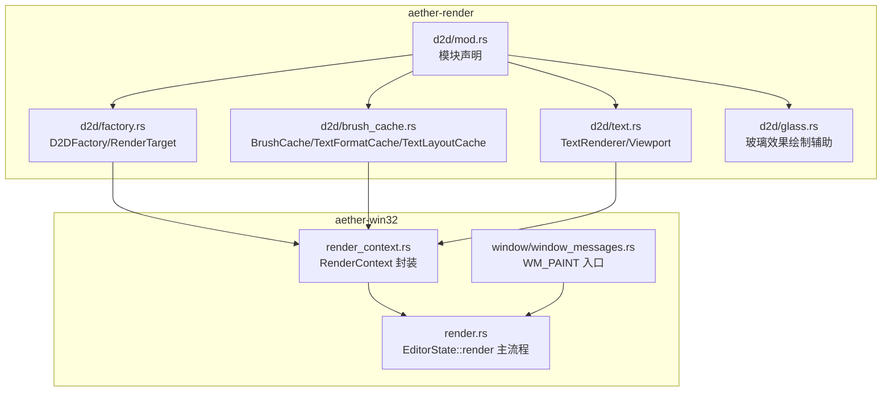
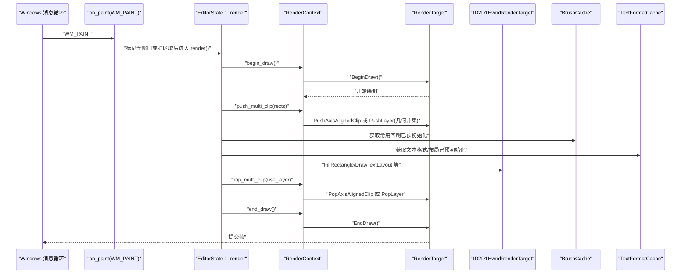
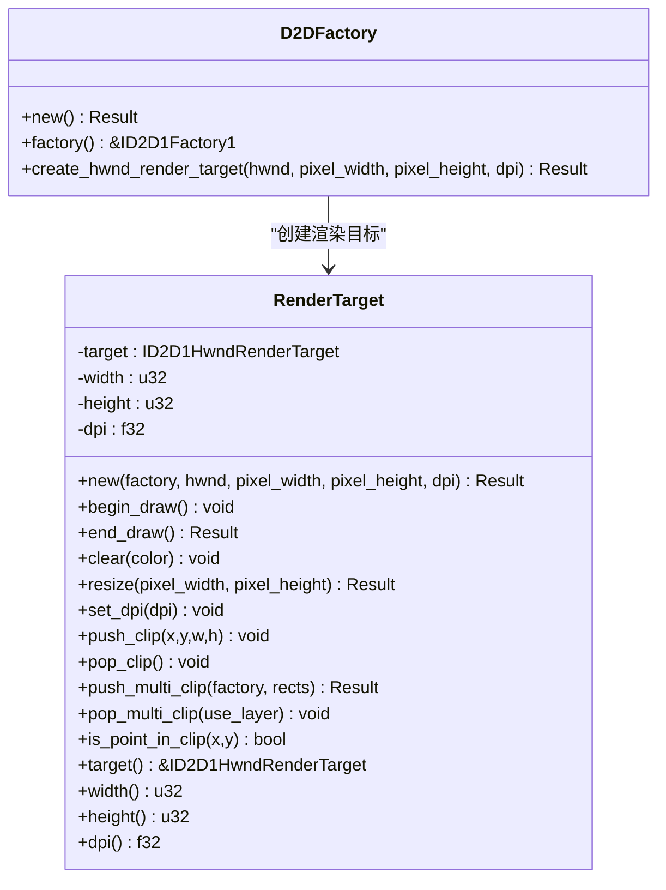
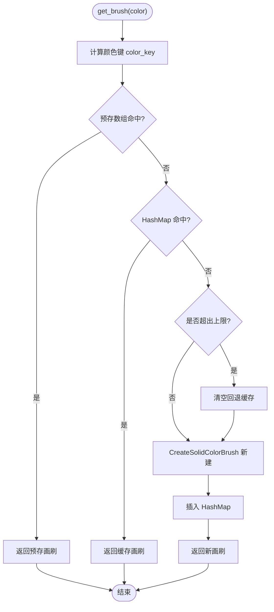
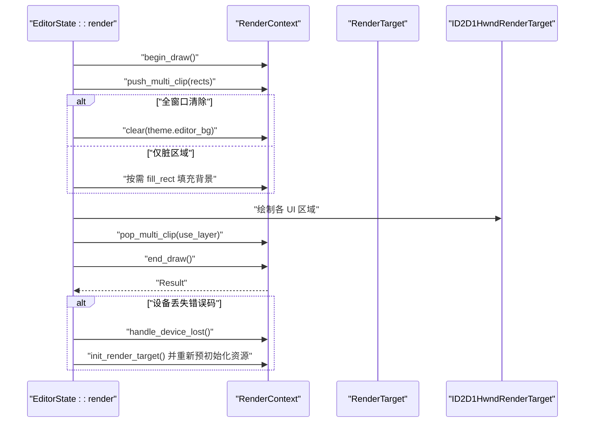
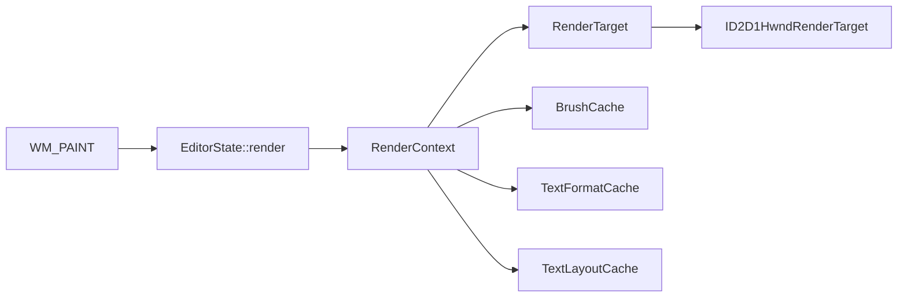

# Direct2D 集成

<cite>
**本文引用的文件**   
- [crates/aether-render/src/d2d/mod.rs](file://crates/aether-render/src/d2d/mod.rs)
- [crates/aether-render/src/d2d/factory.rs](file://crates/aether-render/src/d2d/factory.rs)
- [crates/aether-render/src/d2d/brush_cache.rs](file://crates/aether-render/src/d2d/brush_cache.rs)
- [crates/aether-render/src/d2d/text.rs](file://crates/aether-render/src/d2d/text.rs)
- [crates/aether-render/src/d2d/glass.rs](file://crates/aether-render/src/d2d/glass.rs)
- [crates/aether-win32/src/render_context.rs](file://crates/aether-win32/src/render_context.rs)
- [crates/aether-win32/src/render.rs](file://crates/aether-win32/src/render.rs)
- [crates/aether-win32/src/window/window_messages.rs](file://crates/aether-win32/src/window/window_messages.rs)
</cite>

## 目录
1. [简介](#简介)
2. [项目结构](#项目结构)
3. [核心组件](#核心组件)
4. [架构总览](#架构总览)
5. [详细组件分析](#详细组件分析)
6. [依赖关系分析](#依赖关系分析)
7. [性能考量](#性能考量)
8. [故障排查指南](#故障排查指南)
9. [结论](#结论)
10. [附录](#附录)

## 简介
本技术文档聚焦于 Direct2D 集成层，围绕以下目标展开：
- D2DFactory 的初始化与生命周期管理（COM 对象创建、资源清理、错误处理）
- RenderTarget 的实现细节（HWND 渲染目标创建、DPI 感知支持、设备丢失处理与重绘机制）
- 画刷缓存系统 BrushCache 的设计原理（颜色到画刷映射、内存管理与性能优化）
- Direct2D API 调用的最佳实践与常见问题解决方案

## 项目结构
Direct2D 相关代码主要分布在 aether-render 与 aether-win32 两个 crate 中：
- aether-render/src/d2d：封装 D2D/DWrite 基础能力（工厂、渲染目标、画刷与文本缓存、玻璃效果绘制等）
- aether-win32/src/render_context.rs：将渲染目标、画刷与文本格式缓存统一为“渲染上下文”，提供 begin/end_draw、裁剪、DPI 更新、设备丢失处理等高层接口
- aether-win32/src/render.rs：应用级渲染编排（脏矩形、多矩形裁剪、设备丢失恢复、主题资源预初始化）
- aether-win32/src/window/window_messages.rs：窗口消息入口（WM_PAINT 触发渲染、panic 兜底）

图表来源
- [crates/aether-render/src/d2d/mod.rs:1-5](file://crates/aether-render/src/d2d/mod.rs#L1-L5)
- [crates/aether-render/src/d2d/factory.rs:14-129](file://crates/aether-render/src/d2d/factory.rs#L14-L129)
- [crates/aether-render/src/d2d/brush_cache.rs:25-106](file://crates/aether-render/src/d2d/brush_cache.rs#L25-L106)
- [crates/aether-render/src/d2d/text.rs:14-57](file://crates/aether-render/src/d2d/text.rs#L14-L57)
- [crates/aether-render/src/d2d/glass.rs:1-20](file://crates/aether-render/src/d2d/glass.rs#L1-L20)
- [crates/aether-win32/src/render_context.rs:10-31](file://crates/aether-win32/src/render_context.rs#L10-L31)
- [crates/aether-win32/src/render.rs:62-134](file://crates/aether-win32/src/render.rs#L62-L134)
- [crates/aether-win32/src/window/window_messages.rs:478-514](file://crates/aether-win32/src/window/window_messages.rs#L478-L514)

章节来源
- [crates/aether-render/src/d2d/mod.rs:1-5](file://crates/aether-render/src/d2d/mod.rs#L1-L5)
- [crates/aether-win32/src/render_context.rs:10-31](file://crates/aether-win32/src/render_context.rs#L10-L31)
- [crates/aether-win32/src/render.rs:62-134](file://crates/aether-win32/src/render.rs#L62-L134)
- [crates/aether-win32/src/window/window_messages.rs:478-514](file://crates/aether-win32/src/window/window_messages.rs#L478-L514)

## 核心组件
- D2DFactory：封装 ID2D1Factory1 的创建与 HWND 渲染目标的构建，提供 DPI 与像素尺寸参数。
- RenderTarget：对 ID2D1HwndRenderTarget 的轻量封装，提供 begin/end_draw、clear、resize、set_dpi、单矩形/多矩形裁剪等。
- BrushCache：颜色到画刷的映射缓存，采用“预存数组 + HashMap”两级策略，避免每帧重复创建 COM 对象。
- TextFormatCache / TextLayoutCache：DirectWrite 文本格式与布局对象的缓存，减少频繁创建开销。
- RenderContext：在 Win32 侧聚合所有 D2D/DWrite 资源，提供统一的 begin/end_draw、裁剪、DPI 更新、设备丢失处理等接口。
- EditorState::render：应用级渲染编排，负责脏矩形推断、多矩形裁剪、主题资源预初始化、设备丢失恢复。

章节来源
- [crates/aether-render/src/d2d/factory.rs:14-129](file://crates/aether-render/src/d2d/factory.rs#L14-L129)
- [crates/aether-render/src/d2d/brush_cache.rs:25-106](file://crates/aether-render/src/d2d/brush_cache.rs#L25-L106)
- [crates/aether-render/src/d2d/brush_cache.rs:108-314](file://crates/aether-render/src/d2d/brush_cache.rs#L108-L314)
- [crates/aether-win32/src/render_context.rs:10-31](file://crates/aether-win32/src/render_context.rs#L10-L31)
- [crates/aether-win32/src/render.rs:62-134](file://crates/aether-win32/src/render.rs#L62-L134)

## 架构总览
下图展示了从 WM_PAINT 到 D2D 渲染的关键调用链与资源协作关系。

图表来源
- [crates/aether-win32/src/window/window_messages.rs:478-514](file://crates/aether-win32/src/window/window_messages.rs#L478-L514)
- [crates/aether-win32/src/render.rs:385-410](file://crates/aether-win32/src/render.rs#L385-L410)
- [crates/aether-win32/src/render.rs:698-746](file://crates/aether-win32/src/render.rs#L698-L746)
- [crates/aether-win32/src/render_context.rs:65-79](file://crates/aether-win32/src/render_context.rs#L65-L79)
- [crates/aether-win32/src/render_context.rs:107-155](file://crates/aether-win32/src/render_context.rs#L107-L155)
- [crates/aether-render/src/d2d/factory.rs:90-129](file://crates/aether-render/src/d2d/factory.rs#L90-L129)

## 详细组件分析

### D2DFactory 与 RenderTarget
- D2DFactory
  - 使用单线程工厂类型创建 ID2D1Factory1。
  - 提供 create_hwnd_render_target，按物理像素与 DPI 构造 ID2D1HwndRenderTarget。
- RenderTarget
  - 封装 BeginDraw/EndDraw/Clear/Resize/SetDpi。
  - 支持单矩形裁剪（PushAxisAlignedClip）与多矩形裁剪（GeometryGroup + PushLayer）。
  - 暴露 width/height/dpi 访问器，便于上层计算布局。

图表来源
- [crates/aether-render/src/d2d/factory.rs:14-63](file://crates/aether-render/src/d2d/factory.rs#L14-L63)
- [crates/aether-render/src/d2d/factory.rs:65-271](file://crates/aether-render/src/d2d/factory.rs#L65-L271)

章节来源
- [crates/aether-render/src/d2d/factory.rs:14-63](file://crates/aether-render/src/d2d/factory.rs#L14-L63)
- [crates/aether-render/src/d2d/factory.rs:65-271](file://crates/aether-render/src/d2d/factory.rs#L65-L271)

### 画刷缓存系统 BrushCache
- 设计要点
  - 预存常用颜色画刷（小容量线性扫描），未命中时回退到 HashMap。
  - 超过最大条目数时清空回退缓存，避免无界增长。
  - 通过 color_key 将 D2D1_COLOR_F 转为 u32 键，消除浮点精度导致的缓存失效。
- 典型用法
  - 在渲染目标就绪后，调用 init_common_brushes 预初始化主题常用色。
  - 渲染路径中通过 get_brush 复用画刷，避免每帧 CreateSolidColorBrush。

图表来源
- [crates/aether-render/src/d2d/brush_cache.rs:25-106](file://crates/aether-render/src/d2d/brush_cache.rs#L25-L106)
- [crates/aether-render/src/d2d/brush_cache.rs:479-487](file://crates/aether-render/src/d2d/brush_cache.rs#L479-L487)

章节来源
- [crates/aether-render/src/d2d/brush_cache.rs:25-106](file://crates/aether-render/src/d2d/brush_cache.rs#L25-L106)
- [crates/aether-render/src/d2d/brush_cache.rs:479-487](file://crates/aether-render/src/d2d/brush_cache.rs#L479-L487)

### 文本格式与布局缓存（TextFormatCache / TextLayoutCache）
- TextFormatCache
  - 预初始化常用格式（左对齐、右对齐、居中），其余走 HashMap。
  - 提供 measure_text_width 与 text_position_x 等测量工具。
- TextLayoutCache
  - 基于文本内容缓存 IDWriteTextLayout，字体大小变化时自动清空。
  - 提供 create_ellipsis_layout 用于带省略号的单行场景。

章节来源
- [crates/aether-render/src/d2d/brush_cache.rs:108-314](file://crates/aether-render/src/d2d/brush_cache.rs#L108-L314)
- [crates/aether-render/src/d2d/brush_cache.rs:376-477](file://crates/aether-render/src/d2d/brush_cache.rs#L376-L477)

### 玻璃效果绘制辅助（glass.rs）
- 提供 draw_glass_panel、draw_glow_selection、draw_panel_shadow、draw_rounded_panel 等函数，配合 BrushCache 快速绘制半透明面板、柔光选择高亮、阴影与圆角模拟。

章节来源
- [crates/aether-render/src/d2d/glass.rs:1-161](file://crates/aether-render/src/d2d/glass.rs#L1-L161)

### 文本渲染器（TextRenderer）
- 维护 DirectWrite 工厂与文本格式，支持 DPI 缩放与字体大小调整。
- 提供 render_line 与 render_visible_lines，结合 Viewport 进行可见区域渲染。

章节来源
- [crates/aether-render/src/d2d/text.rs:14-132](file://crates/aether-render/src/d2d/text.rs#L14-L132)
- [crates/aether-render/src/d2d/text.rs:138-221](file://crates/aether-render/src/d2d/text.rs#L138-L221)
- [crates/aether-render/src/d2d/text.rs:272-292](file://crates/aether-render/src/d2d/text.rs#L272-L292)

### 渲染上下文（RenderContext）
- 聚合 RenderTarget、BrushCache、TextFormatCache、TextLayoutCache。
- 提供 begin/end_draw、clear、push/pop_clip、push_multi_clip/pop_multi_clip、fill_rect、set_dpi、init_common_resources、handle_device_lost 等统一接口。
- 在多矩形裁剪失败时回退为包围盒裁剪，保证鲁棒性。

章节来源
- [crates/aether-win32/src/render_context.rs:10-31](file://crates/aether-win32/src/render_context.rs#L10-L31)
- [crates/aether-win32/src/render_context.rs:33-53](file://crates/aether-win32/src/render_context.rs#L33-L53)
- [crates/aether-win32/src/render_context.rs:65-86](file://crates/aether-win32/src/render_context.rs#L65-L86)
- [crates/aether-win32/src/render_context.rs:107-155](file://crates/aether-win32/src/render_context.rs#L107-L155)
- [crates/aether-win32/src/render_context.rs:182-225](file://crates/aether-win32/src/render_context.rs#L182-L225)

### 应用级渲染流程（EditorState::render）
- 首次渲染目标就绪后，预初始化常用画刷与文本格式。
- 根据状态变化推断最优渲染命令，标记脏区域；若无脏区则跳过绘制。
- 使用 push_multi_clip 实现多矩形并集裁剪，提升局部重绘效率。
- 在 end_draw 捕获设备丢失错误码，执行 handle_device_lost 并重建渲染目标与资源。

图表来源
- [crates/aether-win32/src/render.rs:100-134](file://crates/aether-win32/src/render.rs#L100-L134)
- [crates/aether-win32/src/render.rs:385-410](file://crates/aether-win32/src/render.rs#L385-L410)
- [crates/aether-win32/src/render.rs:698-746](file://crates/aether-win32/src/render.rs#L698-L746)
- [crates/aether-win32/src/render_context.rs:65-79](file://crates/aether-win32/src/render_context.rs#L65-L79)
- [crates/aether-win32/src/render_context.rs:107-155](file://crates/aether-win32/src/render_context.rs#L107-L155)
- [crates/aether-win32/src/render_context.rs:219-225](file://crates/aether-win32/src/render_context.rs#L219-L225)

章节来源
- [crates/aether-win32/src/render.rs:100-134](file://crates/aether-win32/src/render.rs#L100-L134)
- [crates/aether-win32/src/render.rs:385-410](file://crates/aether-win32/src/render.rs#L385-L410)
- [crates/aether-win32/src/render.rs:698-746](file://crates/aether-win32/src/render.rs#L698-L746)
- [crates/aether-win32/src/render_context.rs:219-225](file://crates/aether-win32/src/render_context.rs#L219-L225)

## 依赖关系分析
- aether-render/d2d 提供底层 D2D/DWrite 能力，被 aether-win32 的渲染上下文与应用渲染流程消费。
- RenderContext 作为中间层，屏蔽 COM 对象细节，向上提供安全且易用的渲染接口。
- window_messages.rs 的 WM_PAINT 作为入口，确保每次绘制前强制标记脏区，并在 panic 情况下优雅恢复。

图表来源
- [crates/aether-win32/src/window/window_messages.rs:478-514](file://crates/aether-win32/src/window/window_messages.rs#L478-L514)
- [crates/aether-win32/src/render.rs:62-134](file://crates/aether-win32/src/render.rs#L62-L134)
- [crates/aether-win32/src/render_context.rs:10-31](file://crates/aether-win32/src/render_context.rs#L10-L31)
- [crates/aether-render/src/d2d/factory.rs:65-129](file://crates/aether-render/src/d2d/factory.rs#L65-L129)

章节来源
- [crates/aether-win32/src/window/window_messages.rs:478-514](file://crates/aether-win32/src/window/window_messages.rs#L478-L514)
- [crates/aether-win32/src/render.rs:62-134](file://crates/aether-win32/src/render.rs#L62-L134)
- [crates/aether-win32/src/render_context.rs:10-31](file://crates/aether-win32/src/render_context.rs#L10-L31)
- [crates/aether-render/src/d2d/factory.rs:65-129](file://crates/aether-render/src/d2d/factory.rs#L65-L129)

## 性能考量
- 画刷与文本对象缓存
  - 使用预存数组 + HashMap 两级缓存，显著降低 COM 对象分配频率。
  - 设置最大条目数并在超限时清空回退缓存，避免内存无界增长。
- 多矩形裁剪
  - 通过 GeometryGroup 并集 + PushLayer 实现精确裁剪，避免合并为单一包围盒导致的重绘面积膨胀。
  - 单矩形走快路径（PushAxisAlignedClip），减少额外开销。
- 脏矩形驱动
  - 仅在状态变化时标记脏区，无变化时跳过绘制，降低 GPU/CPU 压力。
- DPI 自适应
  - 在 DPI 变化时更新渲染目标 DPI 与文本格式，保持视觉一致性。

[本节为通用指导，不直接分析具体文件]

## 故障排查指南
- 设备丢失（D2DERR_RECREATE_TARGET）
  - 现象：EndDraw 返回特定错误码，UI 停止刷新或崩溃。
  - 处理：在 end_draw 错误分支中检测错误码，调用 handle_device_lost 清理资源，重建渲染目标并重新预初始化常用资源。
- 无变化仍出现重影
  - 现象：WM_PAINT 到达但内部脏区为空，导致上一帧残留。
  - 处理：在 on_paint 中若脏区为空，强制标记全窗口重绘。
- 多矩形裁剪异常
  - 现象：push_multi_clip 失败或显示异常。
  - 处理：RenderContext 在失败时回退为包围盒裁剪，确保可继续渲染；检查传入矩形宽高有效性。
- 文本错位或光标位置偏差
  - 现象：基于字符宽度计算的光标/点击位置与实际渲染不一致。
  - 处理：确保 TextLayout 创建时不带 null 终止符，与测量逻辑保持一致；必要时使用 HitTestTextPosition 精确定位。

章节来源
- [crates/aether-win32/src/render.rs:698-746](file://crates/aether-win32/src/render.rs#L698-L746)
- [crates/aether-win32/src/window/window_messages.rs:478-514](file://crates/aether-win32/src/window/window_messages.rs#L478-L514)
- [crates/aether-win32/src/render_context.rs:107-155](file://crates/aether-win32/src/render_context.rs#L107-L155)
- [crates/aether-render/src/d2d/brush_cache.rs:429-441](file://crates/aether-render/src/d2d/brush_cache.rs#L429-L441)

## 结论
本集成层通过分层设计与缓存策略，实现了高效稳定的 Direct2D 渲染：
- D2DFactory/RenderTarget 提供可靠的底层能力与 DPI 支持
- RenderContext 抽象出统一接口，简化上层调用并增强鲁棒性
- BrushCache/TextFormatCache/TextLayoutCache 有效降低 COM 对象创建成本
- 多矩形裁剪与脏矩形驱动显著提升局部重绘性能
- 完善的设备丢失处理与错误兜底保障稳定性

[本节为总结性内容，不直接分析具体文件]

## 附录
- 最佳实践建议
  - 始终在渲染目标就绪后预初始化常用画刷与文本格式。
  - 优先使用多矩形裁剪，避免不必要的整屏重绘。
  - 在 DPI 变化时同步更新渲染目标与文本格式。
  - 对可能失败的 D2D/DWrite 调用进行错误处理与回退。
  - 使用 HitTestTextPosition 进行精确文本定位，避免手动计算的误差。

[本节为通用指导，不直接分析具体文件]