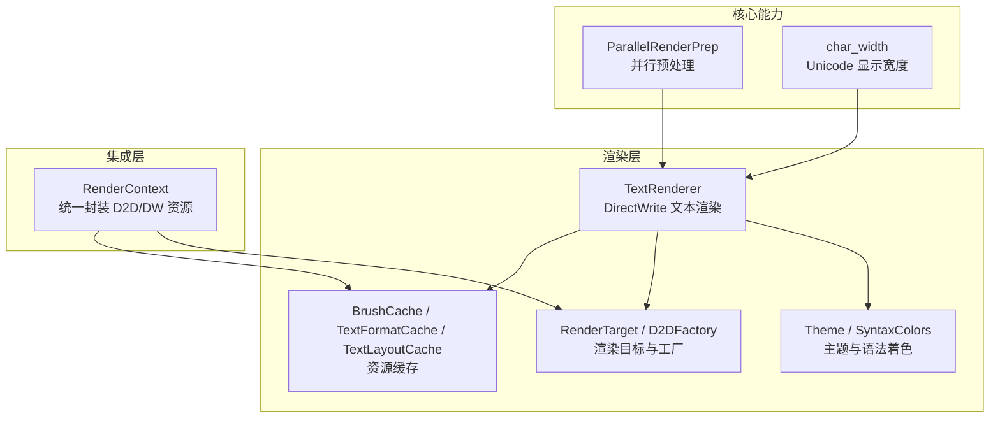
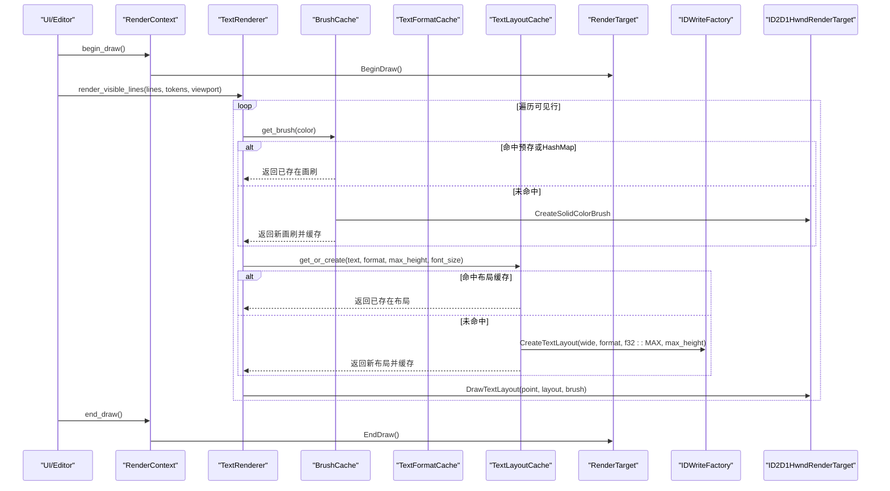
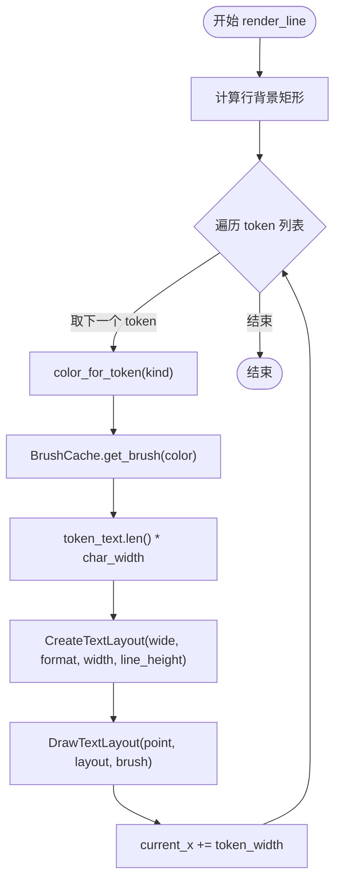
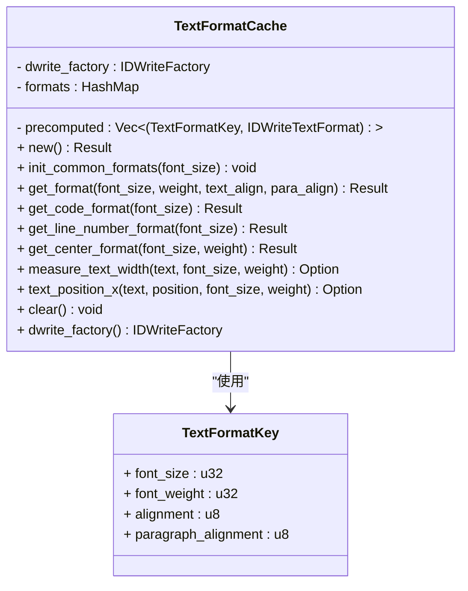
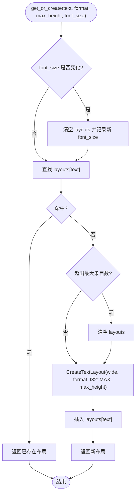
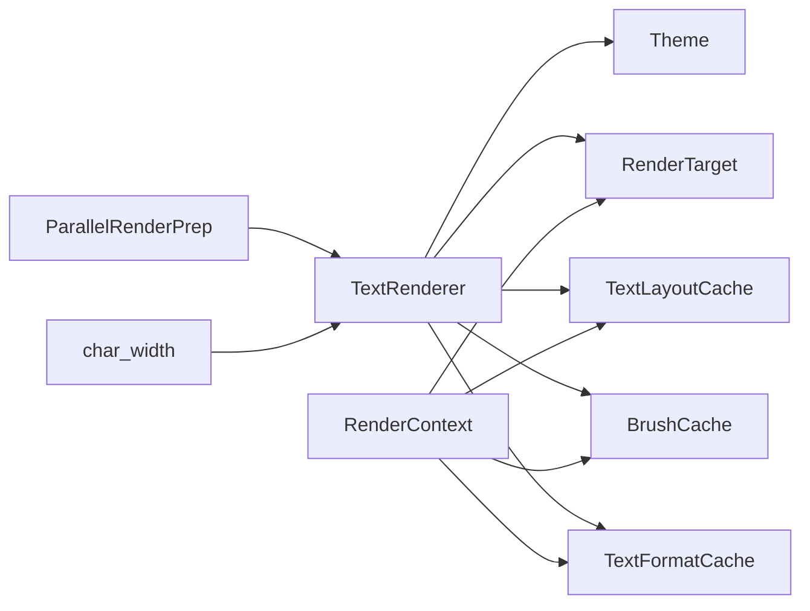

# 文本渲染

<cite>
**本文引用的文件**   
- [text.rs](file://crates/aether-render/src/d2d/text.rs)
- [brush_cache.rs](file://crates/aether-render/src/d2d/brush_cache.rs)
- [factory.rs](file://crates/aether-render/src/d2d/factory.rs)
- [mod.rs](file://crates/aether-render/src/d2d/mod.rs)
- [render_context.rs](file://crates/aether-win32/src/render_context.rs)
- [char_width.rs](file://crates/aether-core/src/char_width.rs)
- [render_prep.rs](file://crates/aether-core/src/render_prep.rs)
- [theme.rs](file://crates/aether-render/src/theme.rs)
</cite>

## 目录
1. [简介](#简介)
2. [项目结构](#项目结构)
3. [核心组件](#核心组件)
4. [架构总览](#架构总览)
5. [详细组件分析](#详细组件分析)
6. [依赖关系分析](#依赖关系分析)
7. [性能考虑](#性能考虑)
8. [故障排查指南](#故障排查指南)
9. [结论](#结论)
10. [附录](#附录)

## 简介
本技术文档聚焦于文本渲染子系统，围绕 DirectWrite 集成、字体加载与测量、行高计算、换行策略、格式与布局缓存设计、绘制流程（字符定位、颜色应用、阴影与抗锯齿）以及性能优化与跨平台兼容性展开。系统基于 Windows 平台的 Direct2D/DirectWrite 实现，通过画刷与文本格式/布局的缓存机制显著降低 COM 对象创建开销，并结合可见区域裁剪与并行预处理提升整体渲染效率。

## 项目结构
文本渲染相关代码主要分布在以下模块：
- aether-render: 提供 D2D/DW 封装、主题与颜色映射、画刷与文本缓存等
- aether-win32: 将渲染上下文与窗口消息、UI 绘制逻辑整合
- aether-core: 提供 Unicode 宽度计算与渲染前预处理（并行 token 化）

图表来源
- [text.rs:14-270](file://crates/aether-render/src/d2d/text.rs#L14-L270)
- [brush_cache.rs:30-477](file://crates/aether-render/src/d2d/brush_cache.rs#L30-L477)
- [factory.rs:15-271](file://crates/aether-render/src/d2d/factory.rs#L15-L271)
- [theme.rs:8-277](file://crates/aether-render/src/theme.rs#L8-L277)
- [render_context.rs:10-226](file://crates/aether-win32/src/render_context.rs#L10-L226)
- [render_prep.rs:17-131](file://crates/aether-core/src/render_prep.rs#L17-L131)
- [char_width.rs:12-32](file://crates/aether-core/src/char_width.rs#L12-L32)

章节来源
- [mod.rs:1-5](file://crates/aether-render/src/d2d/mod.rs#L1-L5)

## 核心组件
- TextRenderer：封装 DirectWrite 工厂与文本格式，负责单行渲染、可见行批量渲染、DPI/字号缩放、字符宽度与行高计算。
- BrushCache：画刷缓存，预存常用颜色画笔并回退到 HashMap，避免每帧重复创建 ID2D1SolidColorBrush。
- TextFormatCache：文本格式缓存，预存常用对齐/段落对齐组合，并提供文本宽度与光标位置测量工具。
- TextLayoutCache：IDWriteTextLayout 缓存，按文本内容复用布局，减少 COM 对象分配。
- RenderTarget/D2DFactory：HWND 渲染目标与工厂封装，支持 DPI 更新、多矩形裁剪等。
- Theme/SyntaxColors：主题与语法着色映射，为 TokenKind 提供颜色。
- ParallelRenderPrep：并行预处理可见行的词法 token，加速着色。
- char_width：Unicode East Asian Width 精简实现，用于零宽/全角/Emoji 等宽度判断。

章节来源
- [text.rs:14-270](file://crates/aether-render/src/d2d/text.rs#L14-L270)
- [brush_cache.rs:30-477](file://crates/aether-render/src/d2d/brush_cache.rs#L30-L477)
- [factory.rs:15-271](file://crates/aether-render/src/d2d/factory.rs#L15-L271)
- [theme.rs:8-277](file://crates/aether-render/src/theme.rs#L8-L277)
- [render_prep.rs:17-131](file://crates/aether-core/src/render_prep.rs#L17-L131)
- [char_width.rs:12-32](file://crates/aether-core/src/char_width.rs#L12-L32)

## 架构总览
下图展示了从 UI 调用到 DirectWrite/Direct2D 绘制的端到端流程，包括缓存命中路径与设备丢失恢复。

图表来源
- [render_context.rs:66-79](file://crates/aether-win32/src/render_context.rs#L66-L79)
- [text.rs:190-221](file://crates/aether-render/src/d2d/text.rs#L190-L221)
- [brush_cache.rs:71-99](file://crates/aether-render/src/d2d/brush_cache.rs#L71-L99)
- [brush_cache.rs:405-442](file://crates/aether-render/src/d2d/brush_cache.rs#L405-L442)
- [factory.rs:90-98](file://crates/aether-render/src/d2d/factory.rs#L90-L98)

## 详细组件分析

### TextRenderer：DirectWrite 集成与绘制流程
- 字体加载与格式初始化
  - 使用共享工厂创建 IDWriteFactory，构造默认 Consolas 字体的 IDWriteTextFormat，设置左对齐与顶部段落对齐。
  - 通过实测“W”字符的 IDWriteTextLayout 度量获取等宽推进宽度，替代硬编码比例。
- DPI 与字号缩放
  - set_dpi_scale/set_font_size 会重建 text_format，并重新测量字符宽度与行高，确保在不同 DPI/字号下布局一致。
- 行高与字符宽度
  - 行高 = 字号 × 系数；字符宽度由 DirectWrite 实际度量得到，保证与布局一致。
- 单行渲染
  - 对每个 token 片段：根据 TokenKind 选择颜色 → 获取 SolidColorBrush → 用 token 文本长度 × char_width 作为最大宽度创建 IDWriteTextLayout → DrawTextLayout 绘制。
- 可见区域渲染
  - 依据滚动偏移与视口高度计算首尾行索引，仅渲染可见行，减少绘制量。
- 颜色映射
  - color_for_token 将 TokenKind 映射到主题色（如关键字、字符串、注释等）。

图表来源
- [text.rs:138-187](file://crates/aether-render/src/d2d/text.rs#L138-L187)
- [text.rs:224-253](file://crates/aether-render/src/d2d/text.rs#L224-L253)

章节来源
- [text.rs:24-132](file://crates/aether-render/src/d2d/text.rs#L24-L132)
- [text.rs:138-221](file://crates/aether-render/src/d2d/text.rs#L138-L221)
- [text.rs:224-253](file://crates/aether-render/src/d2d/text.rs#L224-L253)

### TextFormatCache：格式对象复用与测量工具
- 设计要点
  - 预存最常用的三种格式（代码左对齐、行号右对齐、居中），其余回退到 HashMap。
  - Key 包含字号（缩放到整数）、字重、文本对齐与段落对齐，避免浮点精度问题。
- 测量能力
  - measure_text_width：创建临时 TextLayout 获取包含尾部空格的宽度。
  - text_position_x：使用 HitTestTextPosition 获取指定 UTF-16 位置的 x 坐标，用于精确光标定位。
- 生命周期管理
  - clear 清空所有格式对象；init_common_formats 在字体大小确定后预创建常用格式。

图表来源
- [brush_cache.rs:113-374](file://crates/aether-render/src/d2d/brush_cache.rs#L113-L374)

章节来源
- [brush_cache.rs:113-374](file://crates/aether-render/src/d2d/brush_cache.rs#L113-L374)

### TextLayoutCache：布局缓存策略与内存管理
- 缓存键与失效
  - 以文本内容为键，按当前 font_size 一致性检查；当字号变化超过阈值时清空缓存。
- 容量控制
  - 超过最大条目数时清空回退缓存（简单淘汰策略），避免无界增长。
- 省略号布局
  - create_ellipsis_layout 用于单行可变宽度场景，设置不自动换行与字符级省略号。
- 注意事项
  - 传入的 UTF-16 数据不含 null 终止符，以保证宽度与基于 char_width 的计算一致。

图表来源
- [brush_cache.rs:384-477](file://crates/aether-render/src/d2d/brush_cache.rs#L384-L477)

章节来源
- [brush_cache.rs:384-477](file://crates/aether-render/src/d2d/brush_cache.rs#L384-L477)

### BrushCache：画刷缓存与颜色键
- 预存与回退
  - 预存常用颜色画笔（线性扫描快路径），未命中则回退 HashMap，并在超限时清空回退表。
- 颜色键生成
  - 将 RGBA 分量四舍五入到 0-255 范围打包为 u32，避免浮点精度导致的键不一致。
- 设备丢失处理
  - clear 清空所有画刷，配合 RenderContext.handle_device_lost 进行重建。

章节来源
- [brush_cache.rs:30-106](file://crates/aether-render/src/d2d/brush_cache.rs#L30-L106)
- [brush_cache.rs:479-487](file://crates/aether-render/src/d2d/brush_cache.rs#L479-L487)

### RenderTarget/D2DFactory：渲染目标与裁剪
- 渲染目标
  - 支持硬件渲染目标创建、Begin/EndDraw、Clear、Resize、SetDpi。
- 裁剪区域
  - push_clip/pop_clip 用于轴对齐裁剪；push_multi_clip/pop_multi_clip 使用 GeometryGroup + PushLayer 实现多矩形并集裁剪，失败时回退到包围盒裁剪。
- 工厂
  - D2DFactory 创建 ID2D1Factory1，供 RenderTarget 使用。

章节来源
- [factory.rs:15-271](file://crates/aether-render/src/d2d/factory.rs#L15-L271)

### Theme/SyntaxColors：主题与语法着色
- 主题字段覆盖编辑器背景、行号、选择、状态栏、标题栏、毛玻璃效果等。
- SyntaxColors 提供关键字、字符串、数字、注释、函数、类型名、操作符、变量、预处理、属性、宏、生命周期、正则、格式化字符串、Markdown、JSON/TOML 等语义颜色。
- 提供 color_for_token 与 color_for_semantic_token_index 两种映射方式。

章节来源
- [theme.rs:8-277](file://crates/aether-render/src/theme.rs#L8-L277)

### ParallelRenderPrep 与 char_width：预处理与宽度计算
- ParallelRenderPrep
  - 使用 rayon 并行 map-reduce 对可见行进行词法分析，行数较少时回退单线程。
- char_width
  - 基于 Unicode East Asian Width 的精简实现，区分零宽、宽字符（CJK/Emoji）与窄字符，用于辅助布局与交互。

章节来源
- [render_prep.rs:17-131](file://crates/aether-core/src/render_prep.rs#L17-L131)
- [char_width.rs:12-32](file://crates/aether-core/src/char_width.rs#L12-L32)

## 依赖关系分析

图表来源
- [text.rs:14-270](file://crates/aether-render/src/d2d/text.rs#L14-L270)
- [brush_cache.rs:30-477](file://crates/aether-render/src/d2d/brush_cache.rs#L30-L477)
- [factory.rs:15-271](file://crates/aether-render/src/d2d/factory.rs#L15-L271)
- [render_context.rs:10-226](file://crates/aether-win32/src/render_context.rs#L10-L226)
- [render_prep.rs:17-131](file://crates/aether-core/src/render_prep.rs#L17-L131)
- [char_width.rs:12-32](file://crates/aether-core/src/char_width.rs#L12-L32)

章节来源
- [mod.rs:1-5](file://crates/aether-render/src/d2d/mod.rs#L1-L5)

## 性能考虑
- 减少 COM 对象创建
  - 使用 BrushCache/TextFormatCache/TextLayoutCache 复用画刷、格式与布局对象，显著降低每帧分配与销毁成本。
- 可见区域裁剪
  - 仅渲染视口内的行，结合多矩形裁剪减少无效绘制。
- 并行预处理
  - 对大量可见行采用 rayon 并行词法分析，提高着色准备速度。
- 缓存淘汰策略
  - 对回退 HashMap 设置最大条目数，超限清空以避免内存膨胀。
- 字号与 DPI 变更
  - 仅在必要时重建 text_format 与度量值，避免频繁重建导致抖动。
- 抗锯齿与阴影
  - 当前文本绘制未启用额外阴影或特殊抗锯齿模式；如需更柔和边缘，可在渲染管线中引入图层与混合模式（需评估性能影响）。

[本节为通用指导，无需具体文件引用]

## 故障排查指南
- 设备丢失（显卡驱动重置、切换显示器等）
  - 现象：绘制异常或崩溃。
  - 处理：调用 RenderContext.handle_device_lost 清除所有资源，随后重建渲染目标与缓存。
- DPI 变化导致错位
  - 现象：字符宽度/行高不正确。
  - 处理：调用 TextRenderer.set_dpi_scale 与 set_font_size，确保重建格式与度量。
- 多矩形裁剪失败
  - 现象：局部重绘区域过大或无效。
  - 处理：push_multi_clip 失败时会回退到包围盒裁剪；确认 rects 有效性（宽高 > 0）。
- 布局宽度偏差
  - 现象：点击/光标位置与渲染不一致。
  - 处理：确保 UTF-16 数据不含 null 终止符，且与 measure_monospace_width 保持一致。

章节来源
- [render_context.rs:219-225](file://crates/aether-win32/src/render_context.rs#L219-L225)
- [text.rs:74-132](file://crates/aether-render/src/d2d/text.rs#L74-L132)
- [factory.rs:172-263](file://crates/aether-render/src/d2d/factory.rs#L172-L263)
- [brush_cache.rs:405-442](file://crates/aether-render/src/d2d/brush_cache.rs#L405-L442)

## 结论
该文本渲染子系统通过 DirectWrite/Direct2D 的高效 API 与多层缓存策略，实现了高性能的代码编辑体验。关键优化点包括：画刷与布局对象的复用、可见区域裁剪、并行预处理与严格的 DPI/字号管理。未来可进一步探索更精细的阴影与抗锯齿方案，同时保持对设备丢失与多显示器环境的健壮性。

[本节为总结，无需具体文件引用]

## 附录
- 术语
  - 文本格式：包含字体族、字号、字重、对齐方式的描述对象。
  - 文本布局：将文本与格式绑定后的可度量/可绘制对象。
  - 画刷：用于填充或描边的颜色/渐变对象。
- 最佳实践
  - 在初始化阶段预创建常用画刷与文本格式。
  - 使用 TextLayoutCache 缓存高频重复文本布局。
  - 对大段文本优先使用可见区域裁剪与多矩形裁剪。
  - 在 DPI/字号变化时及时重建格式与度量，避免视觉错位。

[本节为概念性说明，无需具体文件引用]