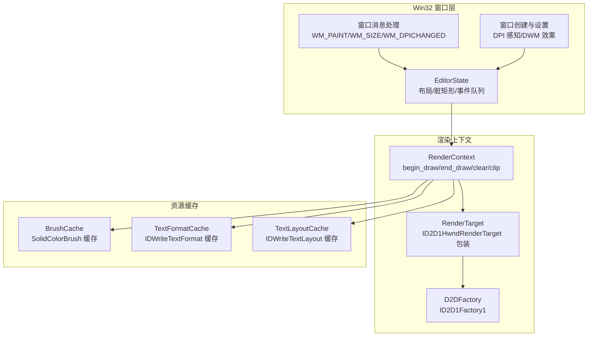
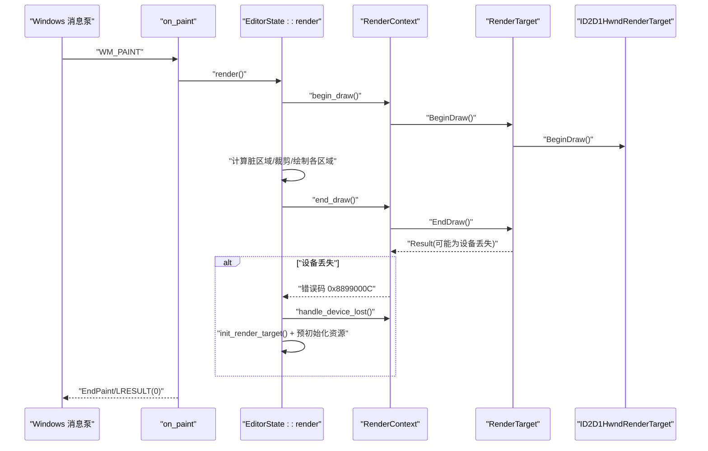
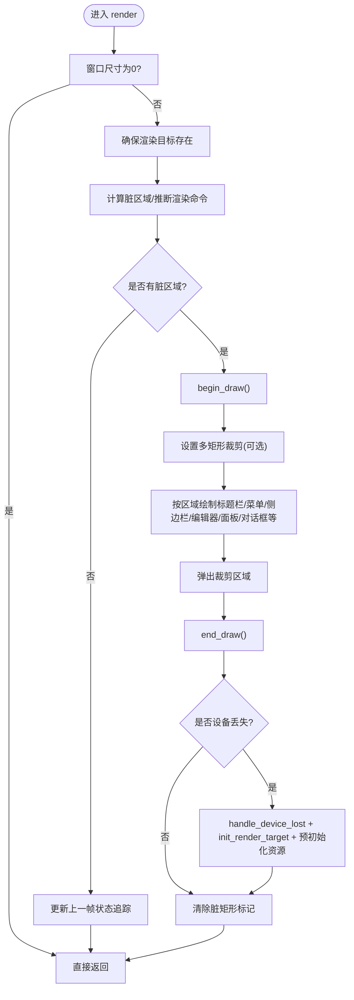
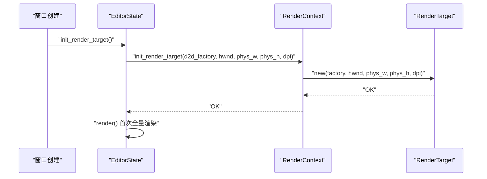
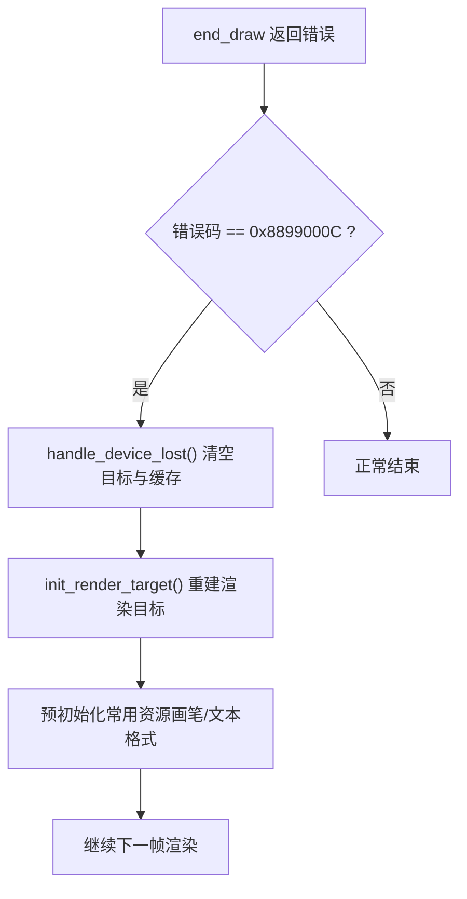
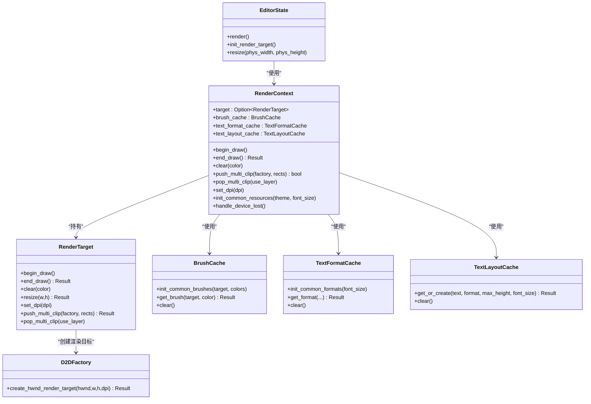

# 渲染生命周期

<cite>
**本文引用的文件**   
- [render.rs](file://crates/aether-win32/src/render.rs)
- [render_context.rs](file://crates/aether-win32/src/render_context.rs)
- [factory.rs](file://crates/aether-render/src/d2d/factory.rs)
- [brush_cache.rs](file://crates/aether-render/src/d2d/brush_cache.rs)
- [window_messages.rs](file://crates/aether-win32/src/window/window_messages.rs)
- [window_setup.rs](file://crates/aether-win32/src/window/window_setup.rs)
- [editor.rs](file://crates/aether-win32/src/editor.rs)
- [window.rs](file://crates/aether-win32/src/window.rs)
</cite>

## 目录
1. [简介](#简介)
2. [项目结构](#项目结构)
3. [核心组件](#核心组件)
4. [架构总览](#架构总览)
5. [详细组件分析](#详细组件分析)
6. [依赖关系分析](#依赖关系分析)
7. [性能考量](#性能考量)
8. [故障排查指南](#故障排查指南)
9. [结论](#结论)
10. [附录](#附录)

## 简介
本技术文档聚焦于渲染生命周期管理，围绕以下目标展开：
- 深入解释渲染循环的实现，包括 begin_draw/end_draw 调用时机、帧率控制与同步机制。
- 详细说明渲染目标的初始化流程，包括 DPI 设置、尺寸调整与窗口消息处理。
- 阐述设备丢失恢复机制，包括资源重建、状态保存与错误恢复策略。
- 提供渲染性能监控与调试工具的使用方法。

## 项目结构
本项目采用分层组织方式：
- aether-win32：Windows 平台窗口与消息循环、编辑器 UI 状态与渲染编排。
- aether-render：Direct2D/DirectWrite 的封装（工厂、渲染目标、画刷与文本格式缓存）。
- aether-core 等：文本缓冲、词法分析、工作区等上层逻辑（与渲染相关部分在 win32 层编排）。

图表来源
- [window_messages.rs:478-514](file://crates/aether-win32/src/window/window_messages.rs#L478-L514)
- [window_setup.rs:18-86](file://crates/aether-win32/src/window/window_setup.rs#L18-L86)
- [render.rs:62-780](file://crates/aether-win32/src/render.rs#L62-L780)
- [render_context.rs:1-226](file://crates/aether-win32/src/render_context.rs#L1-L226)
- [factory.rs:14-141](file://crates/aether-render/src/d2d/factory.rs#L14-L141)
- [brush_cache.rs:25-106](file://crates/aether-render/src/d2d/brush_cache.rs#L25-L106)

章节来源
- [window_messages.rs:478-514](file://crates/aether-win32/src/window/window_messages.rs#L478-L514)
- [window_setup.rs:18-86](file://crates/aether-win32/src/window/window_setup.rs#L18-L86)
- [render.rs:62-780](file://crates/aether-win32/src/render.rs#L62-L780)
- [render_context.rs:1-226](file://crates/aether-win32/src/render_context.rs#L1-L226)
- [factory.rs:14-141](file://crates/aether-render/src/d2d/factory.rs#L14-L141)
- [brush_cache.rs:25-106](file://crates/aether-render/src/d2d/brush_cache.rs#L25-L106)

## 核心组件
- EditorState::render：每帧渲染编排入口，负责脏区域推断、裁剪、绘制各 UI 区域、end_draw 及异常恢复。
- RenderContext：封装 Direct2D 渲染目标与常用资源缓存，统一 begin_draw/end_draw/clear/clip 等操作。
- RenderTarget：对 ID2D1HwndRenderTarget 的薄封装，支持 resize/set_dpi/push_multi_clip/pop_multi_clip。
- BrushCache/TextFormatCache/TextLayoutCache：避免每帧重复创建 COM 对象，降低分配开销。
- 窗口消息处理：WM_PAINT 触发渲染；WM_SIZE/WM_DPICHANGED 驱动尺寸与 DPI 更新并重建渲染目标。

章节来源
- [render.rs:62-780](file://crates/aether-win32/src/render.rs#L62-L780)
- [render_context.rs:1-226](file://crates/aether-win32/src/render_context.rs#L1-L226)
- [factory.rs:66-141](file://crates/aether-render/src/d2d/factory.rs#L66-L141)
- [brush_cache.rs:25-106](file://crates/aether-render/src/d2d/brush_cache.rs#L25-L106)
- [window_messages.rs:478-514](file://crates/aether-win32/src/window/window_messages.rs#L478-L514)

## 架构总览
渲染主循环由 Windows 消息泵驱动，WM_PAINT 进入 EditorState::render，内部通过 RenderContext 调用 begin_draw/end_draw，并在 end_draw 失败时检测设备丢失并恢复。

图表来源
- [window_messages.rs:478-514](file://crates/aether-win32/src/window/window_messages.rs#L478-L514)
- [render.rs:386-746](file://crates/aether-win32/src/render.rs#L386-L746)
- [render_context.rs:65-79](file://crates/aether-win32/src/render_context.rs#L65-L79)
- [factory.rs:90-98](file://crates/aether-render/src/d2d/factory.rs#L90-L98)

## 详细组件分析

### 渲染循环与 begin_draw/end_draw 调用时机
- 入口：WM_PAINT 回调 on_paint 中强制标记全窗口重绘（当脏区为空时），随后调用 EditorState::render。
- 开始绘制：在确定有脏区域后，调用 RenderContext::begin_draw，底层调用 BeginDraw。
- 结束绘制：所有绘制完成后调用 RenderContext::end_draw，底层调用 EndDraw。若返回设备丢失错误码，则进入恢复流程。
- 无变化跳过：若无脏区域，直接返回，不执行 begin_draw/end_draw，减少 GPU/CPU 压力。

图表来源
- [render.rs:62-780](file://crates/aether-win32/src/render.rs#L62-L780)
- [render_context.rs:65-79](file://crates/aether-win32/src/render_context.rs#L65-L79)
- [factory.rs:90-98](file://crates/aether-render/src/d2d/factory.rs#L90-L98)

章节来源
- [window_messages.rs:478-514](file://crates/aether-win32/src/window/window_messages.rs#L478-L514)
- [render.rs:62-780](file://crates/aether-win32/src/render.rs#L62-L780)

### 帧率控制与同步机制
- 当前实现未引入显式 vsync 或帧率限制，渲染频率由系统 WM_PAINT 调度与 invalidate_window 触发决定。
- 定时器用于辅助刷新（如终端输出轮询、悬停提示防抖、自动保存等），并不直接绑定到固定帧率。
- 建议：如需稳定帧率，可在消息循环中加入基于时间片的节流策略，或在 WM_PAINT 前进行最小间隔判断。

章节来源
- [window_messages.rs:19-40](file://crates/aether-win32/src/window/window_messages.rs#L19-L40)
- [window_messages.rs:63-79](file://crates/aether-win32/src/window/window_messages.rs#L63-L79)

### 渲染目标初始化流程（DPI、尺寸、窗口消息）
- 首次创建窗口后，立即初始化渲染目标并执行一次全量渲染。
- WM_SIZE：根据客户区大小更新逻辑像素尺寸，调用 resize 更新布局与渲染目标物理尺寸。
- WM_DPICHANGED：更新 dpi_scale、设置渲染目标 DPI、重新缩放布局常量、IME 尺寸、重建渲染目标并重建常用资源缓存。

图表来源
- [window.rs:276-280](file://crates/aether-win32/src/window.rs#L276-L280)
- [editor.rs:1357-1369](file://crates/aether-win32/src/editor.rs#L1357-L1369)
- [render_context.rs:33-46](file://crates/aether-win32/src/render_context.rs#L33-L46)
- [factory.rs:74-88](file://crates/aether-render/src/d2d/factory.rs#L74-L88)

章节来源
- [window.rs:276-280](file://crates/aether-win32/src/window.rs#L276-L280)
- [editor.rs:1357-1369](file://crates/aether-win32/src/editor.rs#L1357-L1369)
- [window_messages.rs:320-394](file://crates/aether-win32/src/window/window_messages.rs#L320-L394)
- [render_context.rs:33-46](file://crates/aether-win32/src/render_context.rs#L33-L46)
- [factory.rs:74-88](file://crates/aether-render/src/d2d/factory.rs#L74-L88)

### 尺寸调整与 DPI 处理
- 逻辑像素与物理像素转换：resize 接收物理像素，内部转换为逻辑像素更新布局与脏矩形追踪器，再调用渲染目标 resize。
- DPI 切换：更新 dpi_scale、设置渲染目标 DPI、应用 DPI 缩放的布局常量、重建渲染目标与常用资源缓存（画笔/文本格式）。

章节来源
- [editor.rs:1372-1382](file://crates/aether-win32/src/editor.rs#L1372-L1382)
- [render_context.rs:48-53](file://crates/aether-win32/src/render_context.rs#L48-L53)
- [window_messages.rs:345-394](file://crates/aether-win32/src/window/window_messages.rs#L345-L394)
- [factory.rs:119-125](file://crates/aether-render/src/d2d/factory.rs#L119-L125)

### 设备丢失恢复机制
- 触发条件：end_draw 返回错误码 0x8899000C（D2DERR_RECREATE_TARGET）。
- 恢复步骤：
  - 清理渲染上下文中的目标与缓存（handle_device_lost）。
  - 重建渲染目标（init_render_target）。
  - 预初始化常用资源（画笔与文本格式）。
  - 清理图标几何缓存，确保下次绘制使用新 factory。
- 异常防护：WM_PAINT 中对 render 路径使用 catch_unwind，捕获 panic 并记录诊断信息，避免崩溃传播。

图表来源
- [render.rs:704-746](file://crates/aether-win32/src/render.rs#L704-L746)
- [render_context.rs:219-225](file://crates/aether-win32/src/render_context.rs#L219-L225)
- [brush_cache.rs:101-106](file://crates/aether-render/src/d2d/brush_cache.rs#L101-L106)
- [window_messages.rs:497-514](file://crates/aether-win32/src/window/window_messages.rs#L497-L514)

章节来源
- [render.rs:704-746](file://crates/aether-win32/src/render.rs#L704-L746)
- [render_context.rs:219-225](file://crates/aether-win32/src/render_context.rs#L219-L225)
- [brush_cache.rs:101-106](file://crates/aether-render/src/d2d/brush_cache.rs#L101-L106)
- [window_messages.rs:497-514](file://crates/aether-win32/src/window/window_messages.rs#L497-L514)

### 裁剪与脏矩形优化
- 单矩形快路径：push_multi_clip 在只有一个矩形时走 PushAxisAlignedClip。
- 多矩形并集：使用 GeometryGroup（Union）+ PushLayer 实现真正的多矩形裁剪，避免合并包围盒导致重绘面积膨胀。
- 回退策略：多矩形裁剪失败时回退为合并包围盒的 AxisAlignedClip。
- 脏区域推断：根据光标移动、滚动、选择、侧边栏/右侧面板可见性变化等推断最优渲染命令，减少不必要的重绘。

章节来源
- [render_context.rs:107-155](file://crates/aether-win32/src/render_context.rs#L107-L155)
- [factory.rs:172-263](file://crates/aether-render/src/d2d/factory.rs#L172-L263)
- [render.rs:386-409](file://crates/aether-win32/src/render.rs#L386-L409)
- [render.rs:284-365](file://crates/aether-win32/src/render.rs#L284-L365)

### 资源缓存与性能
- 画刷缓存：预存常用颜色画笔，未命中时回退 HashMap，超过上限时清空重建以避免无界增长。
- 文本格式缓存：预存常用格式（代码/行号/居中），其他格式回退 HashMap，超过上限时清空重建。
- 文本布局缓存：复用 IDWriteTextLayout，显著减少 COM 对象分配开销。

章节来源
- [brush_cache.rs:25-106](file://crates/aether-render/src/d2d/brush_cache.rs#L25-L106)
- [brush_cache.rs:108-314](file://crates/aether-render/src/d2d/brush_cache.rs#L108-L314)
- [brush_cache.rs:376-477](file://crates/aether-render/src/d2d/brush_cache.rs#L376-L477)

## 依赖关系分析
- 窗口消息层依赖 EditorState 与 RenderContext，负责触发渲染与尺寸/DPI 更新。
- EditorState 依赖 RenderContext 进行 begin_draw/end_draw 与资源管理。
- RenderContext 依赖 RenderTarget 与各类缓存（BrushCache/TextFormatCache/TextLayoutCache）。
- RenderTarget 依赖 D2DFactory 与 ID2D1HwndRenderTarget。

图表来源
- [render.rs:62-780](file://crates/aether-win32/src/render.rs#L62-L780)
- [render_context.rs:1-226](file://crates/aether-win32/src/render_context.rs#L1-L226)
- [factory.rs:14-141](file://crates/aether-render/src/d2d/factory.rs#L14-L141)
- [brush_cache.rs:25-106](file://crates/aether-render/src/d2d/brush_cache.rs#L25-L106)
- [brush_cache.rs:108-314](file://crates/aether-render/src/d2d/brush_cache.rs#L108-L314)
- [brush_cache.rs:376-477](file://crates/aether-render/src/d2d/brush_cache.rs#L376-L477)

章节来源
- [render.rs:62-780](file://crates/aether-win32/src/render.rs#L62-L780)
- [render_context.rs:1-226](file://crates/aether-win32/src/render_context.rs#L1-L226)
- [factory.rs:14-141](file://crates/aether-render/src/d2d/factory.rs#L14-L141)
- [brush_cache.rs:25-106](file://crates/aether-render/src/d2d/brush_cache.rs#L25-L106)
- [brush_cache.rs:108-314](file://crates/aether-render/src/d2d/brush_cache.rs#L108-L314)
- [brush_cache.rs:376-477](file://crates/aether-render/src/d2d/brush_cache.rs#L376-L477)

## 性能考量
- 脏矩形与多矩形裁剪：仅在必要时重绘，并使用多矩形并集裁剪避免大面积重绘。
- 资源缓存：画刷、文本格式与文本布局缓存显著减少 COM 对象分配与销毁开销。
- 零尺寸保护：窗口尺寸为 0 时跳过渲染，避免无效绘制。
- 建议：
  - 可加入帧率限制（如基于时间片的最小间隔）以稳定 CPU/GPU 占用。
  - 对高频文本渲染进一步复用 TextLayout 与字体度量结果。
  - 在大型项目中考虑增量布局与按需加载 UI 元素以减少每帧计算。

[本节为通用指导，无需特定文件引用]

## 故障排查指南
- 设备丢失（GPU 驱动崩溃、显示模式切换）：
  - 现象：end_draw 返回 0x8899000C，界面闪烁或黑屏。
  - 处理：自动清理资源并重建渲染目标，预初始化常用资源，清理图标几何缓存。
- 渲染 panic：
  - 现象：D2D 资源创建 .unwrap() 导致 panic。
  - 处理：WM_PAINT 中使用 catch_unwind 捕获并记录诊断信息，避免进程崩溃。
- DPI 切换问题：
  - 现象：字体尺寸不一致、UI 错位。
  - 处理：WM_DPICHANGED 中更新 dpi_scale、设置渲染目标 DPI、重建渲染目标与常用资源缓存。

章节来源
- [render.rs:704-746](file://crates/aether-win32/src/render.rs#L704-L746)
- [window_messages.rs:497-514](file://crates/aether-win32/src/window/window_messages.rs#L497-L514)
- [window_messages.rs:345-394](file://crates/aether-win32/src/window/window_messages.rs#L345-L394)

## 结论
该渲染生命周期以 Windows 消息泵为核心驱动，结合脏矩形与多矩形裁剪优化，配合资源缓存与设备丢失恢复机制，实现了高效且健壮的 UI 渲染。建议在后续迭代中引入帧率限制与更细粒度的增量渲染策略，进一步提升性能与稳定性。

[本节为总结，无需特定文件引用]

## 附录
- 关键函数路径参考：
  - 渲染入口与流程：[render.rs:62-780](file://crates/aether-win32/src/render.rs#L62-L780)
  - 渲染上下文封装：[render_context.rs:1-226](file://crates/aether-win32/src/render_context.rs#L1-L226)
  - 渲染目标与裁剪：[factory.rs:66-263](file://crates/aether-render/src/d2d/factory.rs#L66-L263)
  - 资源缓存：[brush_cache.rs:25-477](file://crates/aether-render/src/d2d/brush_cache.rs#L25-L477)
  - 窗口消息与 DPI：[window_messages.rs:320-394](file://crates/aether-win32/src/window/window_messages.rs#L320-L394)
  - 窗口创建与首次渲染：[window.rs:276-280](file://crates/aether-win32/src/window.rs#L276-L280)
  - 渲染目标初始化：[editor.rs:1357-1369](file://crates/aether-win32/src/editor.rs#L1357-L1369)