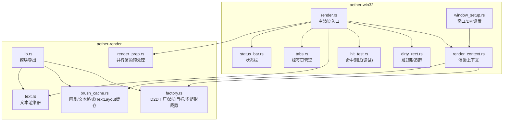
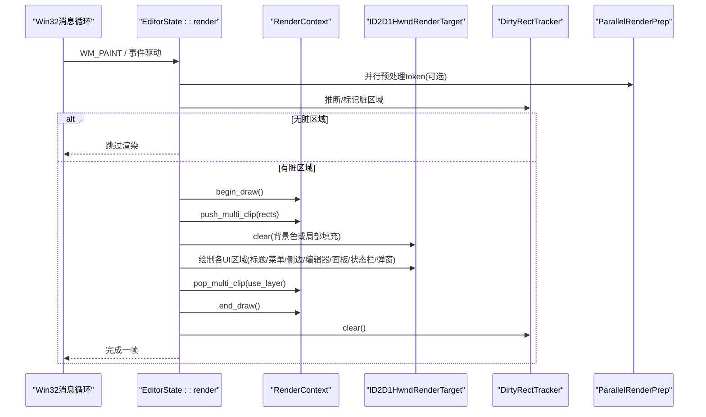
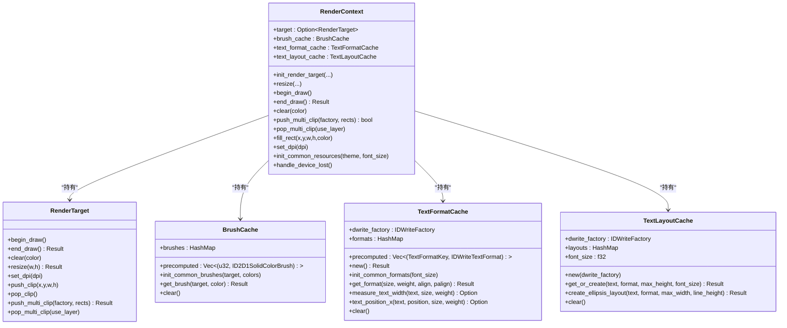
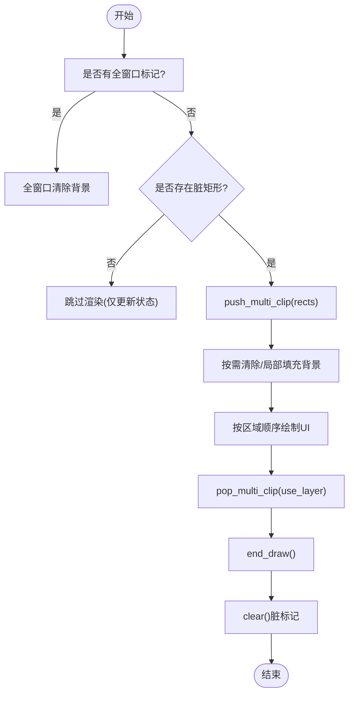
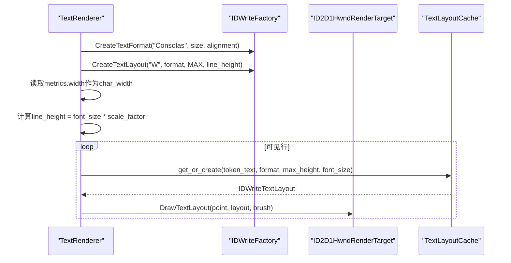
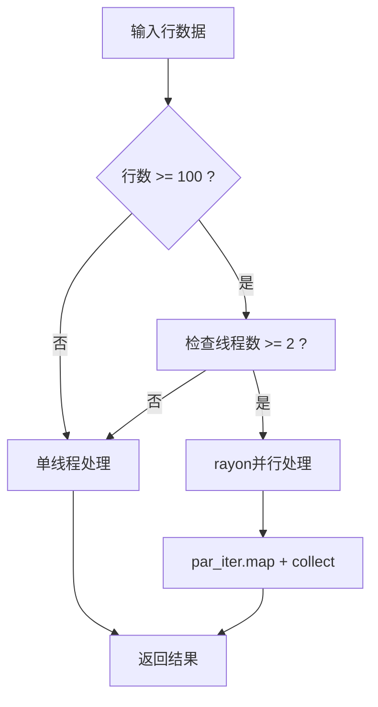
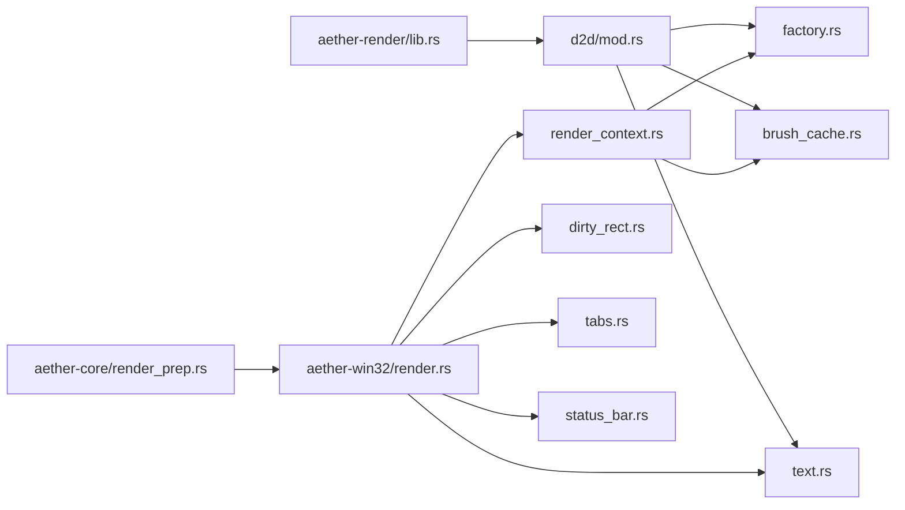

# 渲染管线

<cite>
**本文引用的文件**
- [render.rs](file://crates/aether-win32/src/render.rs)
- [render_context.rs](file://crates/aether-win32/src/render_context.rs)
- [dirty_rect.rs](file://crates/aether-win32/src/dirty_rect.rs)
- [factory.rs](file://crates/aether-render/src/d2d/factory.rs)
- [brush_cache.rs](file://crates/aether-render/src/d2d/brush_cache.rs)
- [text.rs](file://crates/aether-render/src/d2d/text.rs)
- [lib.rs](file://crates/aether-render/src/lib.rs)
- [window_setup.rs](file://crates/aether-win32/src/window/window_setup.rs)
- [hit_test.rs](file://crates/aether-win32/src/hit_test.rs)
- [tabs.rs](file://crates/aether-win32/src/tabs.rs)
- [status_bar.rs](file://crates/aether-win32/src/status_bar.rs)
- [render_prep.rs](file://crates/aether-core/src/render_prep.rs)
</cite>

## 更新摘要
**所做更改**
- 更新了脏矩形追踪系统，增强了区域类型标记和智能合并策略
- 优化了文本渲染路径，实现了DirectWrite实测字符宽度和DPI自适应
- 改进了内存管理机制，添加了缓存容量上限和自动清理策略
- 增强了标签管理系统，支持不同类型标签的统一状态处理
- 优化了状态消息格式化，实现了动态宽度计算和图标集成

## 目录
1. [简介](#简介)
2. [项目结构](#项目结构)
3. [核心组件](#核心组件)
4. [架构总览](#架构总览)
5. [详细组件分析](#详细组件分析)
6. [依赖关系分析](#依赖关系分析)
7. [性能考量](#性能考量)
8. [故障排查指南](#故障排查指南)
9. [结论](#结论)
10. [附录](#附录)

## 简介
本技术文档聚焦于牧羊人编辑器的渲染管线，围绕 Direct2D/DirectWrite 集成、绘制上下文管理、资源初始化与图形对象创建、脏矩形优化算法（区域计算、增量更新、重绘策略）、文本渲染流程（字体加载、字符测量、行高计算、换行处理）以及动画系统与性能监控进行系统化说明。文档同时提供代码级架构图与流程图，帮助读者快速理解并高效调试。

## 项目结构
渲染相关代码主要分布在两个 crate：
- aether-win32：窗口消息循环、UI 状态、渲染调度、脏矩形追踪、命中测试等
- aether-render：Direct2D/DirectWrite 封装、画刷与文本格式缓存、多矩形裁剪实现等

**图表来源**
- [render.rs:1-800](file://crates/aether-win32/src/render.rs#L1-L800)
- [render_context.rs:1-226](file://crates/aether-win32/src/render_context.rs#L1-L226)
- [dirty_rect.rs:1-707](file://crates/aether-win32/src/dirty_rect.rs#L1-L707)
- [factory.rs:1-487](file://crates/aether-render/src/d2d/factory.rs#L1-L487)
- [brush_cache.rs:1-514](file://crates/aether-render/src/d2d/brush_cache.rs#L1-L514)
- [text.rs:1-319](file://crates/aether-render/src/d2d/text.rs#L1-L319)
- [lib.rs:1-4](file://crates/aether-render/src/lib.rs#L1-L4)
- [window_setup.rs:160-170](file://crates/aether-win32/src/window/window_setup.rs#L160-L170)
- [tabs.rs:1-315](file://crates/aether-win32/src/tabs.rs#L1-L315)
- [status_bar.rs:1-326](file://crates/aether-win32/src/status_bar.rs#L1-L326)
- [render_prep.rs:1-194](file://crates/aether-core/src/render_prep.rs#L1-L194)

**章节来源**
- [render.rs:1-800](file://crates/aether-win32/src/render.rs#L1-L800)
- [render_context.rs:1-226](file://crates/aether-win32/src/render_context.rs#L1-L226)
- [dirty_rect.rs:1-707](file://crates/aether-win32/src/dirty_rect.rs#L1-L707)
- [factory.rs:1-487](file://crates/aether-render/src/d2d/factory.rs#L1-L487)
- [brush_cache.rs:1-514](file://crates/aether-render/src/d2d/brush_cache.rs#L1-L514)
- [text.rs:1-319](file://crates/aether-render/src/d2d/text.rs#L1-L319)
- [lib.rs:1-4](file://crates/aether-render/src/lib.rs#L1-L4)
- [window_setup.rs:160-170](file://crates/aether-win32/src/window/window_setup.rs#L160-L170)
- [tabs.rs:1-315](file://crates/aether-win32/src/tabs.rs#L1-L315)
- [status_bar.rs:1-326](file://crates/aether-win32/src/status_bar.rs#L1-L326)
- [render_prep.rs:1-194](file://crates/aether-core/src/render_prep.rs#L1-L194)

## 核心组件
- 渲染上下文 RenderContext：封装 D2D 渲染目标、画刷缓存、文本格式缓存与 TextLayout 缓存，统一 begin/end draw、clear、clip、resize、设备丢失恢复等能力。
- 脏矩形追踪 DirtyRectTracker：记录需要重绘的区域，支持按区域类型标记、重叠合并、阈值降级为全窗口重绘，并提供"无变化不渲染"的优化路径。
- Direct2D 工厂与渲染目标 D2DFactory/RenderTarget：创建硬件加速的 HWND 渲染目标，支持 DPI 更新、轴对齐裁剪与多矩形几何裁剪。
- 画刷与文本缓存 BrushCache/TextFormatCache/TextLayoutCache：避免每帧重复创建 COM 对象，预置常用颜色与文本格式，限制最大条目数防止内存增长。
- 文本渲染器 TextRenderer：基于 DirectWrite 的字体加载、字符宽度实测、行高计算、可见行渲染与 token 着色。
- 并行渲染预处理 ParallelRenderPrep：使用 rayon 线程池并行处理行的 token 分析，提升大文件渲染性能。
- 标签页管理 TabContent：统一管理 per-tab 编辑状态，通过 std::mem::swap 实现高效的标签切换。
- 状态栏 StatusBar：支持动态宽度计算、图标集成和区域点击检测。
- 主渲染入口 EditorState::render：综合布局、脏矩形推断、裁剪、逐区域绘制、对话框与菜单覆盖层绘制、结束绘制与错误恢复。

**章节来源**
- [render_context.rs:1-226](file://crates/aether-win32/src/render_context.rs#L1-L226)
- [dirty_rect.rs:1-707](file://crates/aether-win32/src/dirty_rect.rs#L1-L707)
- [factory.rs:1-487](file://crates/aether-render/src/d2d/factory.rs#L1-L487)
- [brush_cache.rs:1-514](file://crates/aether-render/src/d2d/brush_cache.rs#L1-L514)
- [text.rs:1-319](file://crates/aether-render/src/d2d/text.rs#L1-L319)
- [render.rs:1-800](file://crates/aether-win32/src/render.rs#L1-L800)
- [render_prep.rs:1-194](file://crates/aether-core/src/render_prep.rs#L1-L194)
- [tabs.rs:1-315](file://crates/aether-win32/src/tabs.rs#L1-L315)
- [status_bar.rs:1-326](file://crates/aether-win32/src/status_bar.rs#L1-L326)

## 架构总览
渲染管线从窗口消息触发开始，进入 EditorState::render，依据脏矩形策略选择是否跳过渲染；若需渲染，则通过 RenderContext 控制 D2D 生命周期，使用多矩形裁剪减少无效绘制，再依次绘制标题栏、菜单栏、活动栏、侧边栏、标签栏、编辑器内容、右侧面板、底部面板、状态栏、各类弹出菜单与对话框，最后结束绘制并清理脏标记。

**图表来源**
- [render.rs:1-800](file://crates/aether-win32/src/render.rs#L1-L800)
- [render_context.rs:1-226](file://crates/aether-win32/src/render_context.rs#L1-L226)
- [dirty_rect.rs:1-707](file://crates/aether-win32/src/dirty_rect.rs#L1-L707)
- [factory.rs:1-487](file://crates/aether-render/src/d2d/factory.rs#L1-L487)
- [render_prep.rs:1-194](file://crates/aether-core/src/render_prep.rs#L1-L194)

## 详细组件分析

### 绘制上下文管理与资源初始化
- 渲染目标创建与 DPI 适配：在窗口初始化阶段根据物理像素与 DPI 创建 ID2D1HwndRenderTarget，并在 DPI 变化时更新。
- 常见资源预初始化：渲染目标就绪后，预创建主题常用颜色的 SolidBrush 与三种常用文本格式（左对齐、右对齐、居中），显著降低每帧分配开销。
- 设备丢失恢复：end_draw 返回特定错误码时，清空所有 COM 资源并重建渲染目标与缓存。

**图表来源**
- [render_context.rs:1-226](file://crates/aether-win32/src/render_context.rs#L1-L226)
- [factory.rs:1-487](file://crates/aether-render/src/d2d/factory.rs#L1-L487)
- [brush_cache.rs:1-514](file://crates/aether-render/src/d2d/brush_cache.rs#L1-L514)

**章节来源**
- [render_context.rs:1-226](file://crates/aether-win32/src/render_context.rs#L1-L226)
- [factory.rs:1-487](file://crates/aether-render/src/d2d/factory.rs#L1-L487)
- [brush_cache.rs:1-514](file://crates/aether-render/src/d2d/brush_cache.rs#L1-L514)

### 脏矩形优化算法
- 区域类型与合并策略：按 UI 区域类型（编辑器、侧边栏、状态栏等）分别标记，同类型且相交的矩形会合并，减少绘制调用次数。
- 智能降级机制：当脏矩形数量超过阈值或过多时，自动降级为全窗口重绘，保证稳定性。
- 无变化不渲染：当没有脏区域时直接跳过整帧渲染，仅更新上一帧状态跟踪变量，避免不必要的 GPU/CPU 负载。
- 多矩形裁剪：对多个独立脏矩形采用几何并集+Layer 的方式精确裁剪，避免合并为单一包围盒导致的过度重绘。
- 渲染命令推断：根据状态变化自动推断最优渲染命令，支持精细化的局部重绘。

**图表来源**
- [dirty_rect.rs:1-707](file://crates/aether-win32/src/dirty_rect.rs#L1-L707)
- [render.rs:1-800](file://crates/aether-win32/src/render.rs#L1-L800)
- [render_context.rs:1-226](file://crates/aether-win32/src/render_context.rs#L1-L226)
- [factory.rs:1-487](file://crates/aether-render/src/d2d/factory.rs#L1-L487)

**章节来源**
- [dirty_rect.rs:1-707](file://crates/aether-win32/src/dirty_rect.rs#L1-L707)
- [render.rs:1-800](file://crates/aether-win32/src/render.rs#L1-L800)

### 文本渲染流程（字体加载、字符测量、行高计算、换行处理）
- 字体加载与格式：使用 DirectWrite 创建 Consolas 字体格式，设置对齐方式与段落对齐。
- **新增** 字符宽度实测：通过 CreateTextLayout 测量单字符推进宽度，替代硬编码比例，确保在不同 DPI 下准确。
- **新增** DPI 自适应：支持运行时调整字体大小和 DPI 缩放因子，自动重新创建文本格式。
- 行高计算：行高 = 字体大小 × 系数（考虑 DPI 缩放）。
- 可见行渲染：根据滚动偏移与视口高度计算起始/结束行，逐行绘制，token 级别着色。
- 换行处理：代码编辑器场景通常不需要自动换行，TextLayout 使用极大宽度以避免换行；对于需要省略的场景（如文件树名称），使用 SetTrimming 配置"…"省略号。

**图表来源**
- [text.rs:1-319](file://crates/aether-render/src/d2d/text.rs#L1-L319)
- [brush_cache.rs:1-514](file://crates/aether-render/src/d2d/brush_cache.rs#L1-L514)

**章节来源**
- [text.rs:1-319](file://crates/aether-render/src/d2d/text.rs#L1-L319)
- [brush_cache.rs:1-514](file://crates/aether-render/src/d2d/brush_cache.rs#L1-L514)

### 并行渲染预处理
- **新增** 并行token分析：使用 rayon 线程池并行处理行的 token 分析，显著提升大文件渲染性能。
- 自适应并行度：根据可用CPU核心数和行数自动选择并行或串行处理。
- 线程池复用：rayon 内置线程池，避免每次调用创建/销毁线程的开销。
- 缓存失效检测：通过版本号机制确保缓存数据的有效性。

**图表来源**
- [render_prep.rs:1-194](file://crates/aether-core/src/render_prep.rs#L1-L194)

**章节来源**
- [render_prep.rs:1-194](file://crates/aether-core/src/render_prep.rs#L1-L194)

### 标签页管理系统
- **新增** 统一状态管理：TabContent 集中管理所有 per-tab 编辑状态，消除重复字段。
- **新增** 高效切换机制：通过 std::mem::swap 实现标签切换，避免手动字段同步。
- **新增** 自动保存集成：包含 buffer_version、mtime 检测和冲突处理。
- **新增** 大文件优化：支持大文件标记和行 Y 偏移前缀和缓存。
- **新增** 内联补全支持：集成 inline_completion 功能。

**章节来源**
- [tabs.rs:1-315](file://crates/aether-win32/src/tabs.rs#L1-L315)

### 状态栏增强
- **新增** 动态宽度计算：使用 DirectWrite 测量文本宽度，叠加图标占用和内边距。
- **新增** 图标集成：支持矢量图标替代 emoji，提升视觉一致性。
- **新增** 区域点击检测：精确的 hit_test 支持，返回原始索引而非区域索引。
- **新增** 隐藏分区支持：width <= 0.0 的分区会被跳过，其他分区自动填补空缺。

**章节来源**
- [status_bar.rs:1-326](file://crates/aether-win32/src/status_bar.rs#L1-L326)

### 动画系统与帧率控制
- 当前实现未包含显式的过渡动画系统；UI 交互以即时响应为主，通过脏矩形最小化重绘范围提升流畅度。
- 终端输出刷新间隔约 20fps，足以实时显示 shell 输出，避免频繁刷新带来的性能压力。
- 悬停提示（hover tooltip）具备延迟显示逻辑，避免频繁闪烁。

**章节来源**
- [render.rs:1-800](file://crates/aether-win32/src/render.rs#L1-L800)

### 性能监控与调试技巧
- 命中测试（debug 构建）：记录可点击区域到 JSONL 文件，便于自动化测试与可视化验证；release 构建中该功能被完全移除，零运行时开销。
- 日志与 trace：渲染关键路径使用 tracing::trace 输出轻量日志，生产环境降噪。
- 设备丢失检测：捕获特定错误码后重建渲染目标与缓存，保障稳定性。

**章节来源**
- [hit_test.rs:1-244](file://crates/aether-win32/src/hit_test.rs#L1-L244)
- [render.rs:1-800](file://crates/aether-win32/src/render.rs#L1-L800)

## 依赖关系分析
- 模块导出：aether-render 通过 lib.rs 暴露 d2d、theme、vscode_theme 子模块。
- 渲染上下文依赖：RenderContext 组合了 BrushCache、TextFormatCache、TextLayoutCache，并通过 RenderTarget 访问 D2D 底层 API。
- 多矩形裁剪：RenderTarget::push_multi_clip 使用 ID2D1GeometryGroup（Union）+ PushLayer 实现真正的多矩形裁剪，失败时回退为轴对齐裁剪。
- 文本渲染依赖：TextRenderer 依赖 IDWriteFactory 与 IDWriteTextFormat，结合 BrushCache 获取画笔，使用 TextLayoutCache 复用布局对象。
- **新增** 并行渲染依赖：ParallelRenderPrep 使用 rayon 线程池进行并行处理。

**图表来源**
- [lib.rs:1-4](file://crates/aether-render/src/lib.rs#L1-L4)
- [render.rs:1-800](file://crates/aether-win32/src/render.rs#L1-L800)
- [render_context.rs:1-226](file://crates/aether-win32/src/render_context.rs#L1-L226)
- [dirty_rect.rs:1-707](file://crates/aether-win32/src/dirty_rect.rs#L1-L707)
- [factory.rs:1-487](file://crates/aether-render/src/d2d/factory.rs#L1-L487)
- [brush_cache.rs:1-514](file://crates/aether-render/src/d2d/brush_cache.rs#L1-L514)
- [text.rs:1-319](file://crates/aether-render/src/d2d/text.rs#L1-L319)
- [render_prep.rs:1-194](file://crates/aether-core/src/render_prep.rs#L1-L194)

**章节来源**
- [lib.rs:1-4](file://crates/aether-render/src/lib.rs#L1-L4)
- [render.rs:1-800](file://crates/aether-win32/src/render.rs#L1-L800)
- [render_context.rs:1-226](file://crates/aether-win32/src/render_context.rs#L1-L226)
- [dirty_rect.rs:1-707](file://crates/aether-win32/src/dirty_rect.rs#L1-L707)
- [factory.rs:1-487](file://crates/aether-render/src/d2d/factory.rs#L1-L487)
- [brush_cache.rs:1-514](file://crates/aether-render/src/d2d/brush_cache.rs#L1-L514)
- [text.rs:1-319](file://crates/aether-render/src/d2d/text.rs#L1-L319)
- [render_prep.rs:1-194](file://crates/aether-core/src/render_prep.rs#L1-L194)

## 性能考量
- 资源缓存优先：预存常用画刷与文本格式，TextLayout 共享缓存，避免每帧创建 COM 对象。
- **新增** 内存管理优化：画刷与文本格式缓存设置最大条目数（64），超出时清空回退缓存，防止内存无界增长。
- 多矩形裁剪：使用几何并集+Layer 精确裁剪，避免合并为单一包围盒导致重绘面积膨胀。
- 无变化不渲染：当没有脏区域时直接跳过渲染，减少 CPU/GPU 负载。
- **新增** 并行渲染：使用 rayon 线程池并行处理大文件的 token 分析，提升渲染性能。
- **新增** 智能降级：脏矩形数量超过阈值时自动降级为全窗口重绘，保证稳定性。
- **新增** 字符宽度实测：通过 DirectWrite 实测字符宽度，替代硬编码比例，确保跨 DPI 准确性。
- 终端刷新节流：终端输出刷新间隔约 20fps，平衡实时性与性能。
- 命中测试仅在 debug 构建启用，release 构建零开销。

## 故障排查指南
- 设备丢失（D2DERR_RECREATE_TARGET）：在 end_draw 捕获错误码，清空所有资源并重建渲染目标与缓存。
- 欢迎页与脏矩形裁剪的背景空洞：在欢迎页状态下手动填充侧边栏/活动栏/右侧面板/底部面板背景，避免黑色空洞。
- 多矩形裁剪失败回退：当 push_multi_clip 失败时，回退为合并包围盒的轴对齐裁剪，确保渲染继续。
- 命中测试数据：在 debug 构建中检查生成的 JSONL 文件，确认可点击区域是否正确记录。
- **新增** 缓存溢出问题：检查 BrushCache 和 TextFormatCache 的最大条目数设置，必要时调整 MAX_BRUSH_CACHE_ENTRIES 常量。
- **新增** 并行渲染性能：确认 rayon 线程池配置合理，避免过小或过大的线程数影响性能。

**章节来源**
- [render.rs:1-800](file://crates/aether-win32/src/render.rs#L1-L800)
- [render_context.rs:1-226](file://crates/aether-win32/src/render_context.rs#L1-L226)
- [factory.rs:1-487](file://crates/aether-render/src/d2d/factory.rs#L1-L487)
- [hit_test.rs:1-244](file://crates/aether-win32/src/hit_test.rs#L1-L244)
- [brush_cache.rs:1-514](file://crates/aether-render/src/d2d/brush_cache.rs#L1-L514)
- [render_prep.rs:1-194](file://crates/aether-core/src/render_prep.rs#L1-L194)

## 结论
本渲染管线通过精细的脏矩形追踪、多矩形裁剪、资源缓存与设备丢失恢复机制，在保证视觉正确性的前提下实现了高效的增量更新与稳定的运行表现。文本渲染基于 DirectWrite 的实测字符宽度与行高计算，确保了跨 DPI 的一致性。**新增的并行渲染预处理、智能内存管理和增强的标签系统进一步提升了整体性能和用户体验**。未来可在保持现有稳定性的基础上引入更丰富的过渡动画与更细粒度的性能监控指标。

## 附录
- 窗口/DPI 设置：窗口初始化阶段根据矩形区域获取显示器信息并设置 DPI，影响渲染目标与字体测量。
- 模块导出：aether-render 通过 lib.rs 暴露 d2d、theme、vscode_theme 子模块，供上层使用。
- **新增** 并行渲染配置：ParallelRenderPrep 根据可用CPU核心数自动配置线程池大小，默认不超过8个线程。
- **新增** 状态栏区域索引：StatusBarIndex 枚举确保 hit_test 返回的索引与 sections 保持一致。

**章节来源**
- [window_setup.rs:160-170](file://crates/aether-win32/src/window/window_setup.rs#L160-L170)
- [lib.rs:1-4](file://crates/aether-render/src/lib.rs#L1-L4)
- [render_prep.rs:1-194](file://crates/aether-core/src/render_prep.rs#L1-L194)
- [status_bar.rs:1-326](file://crates/aether-win32/src/status_bar.rs#L1-L326)