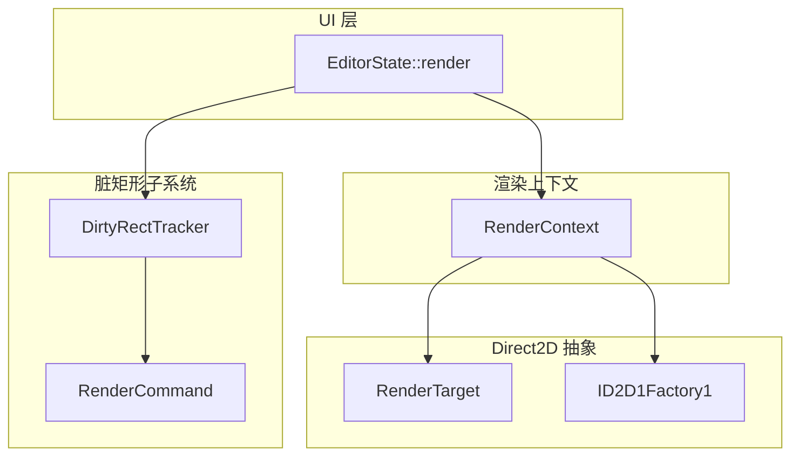
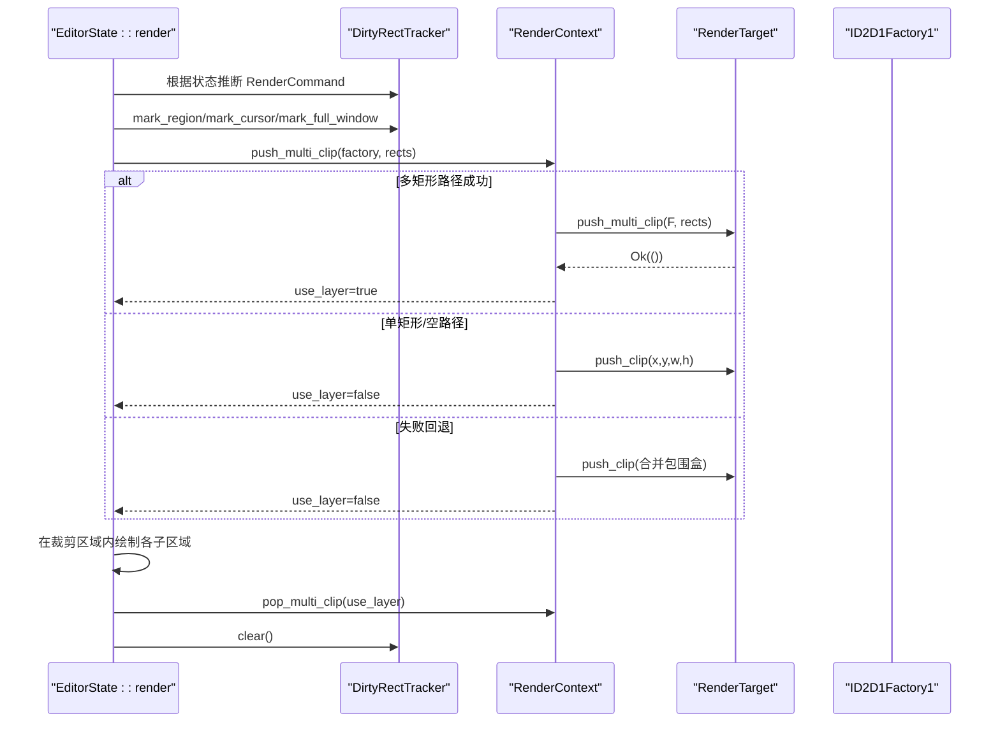
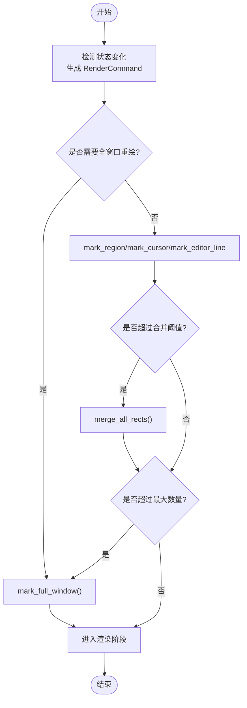
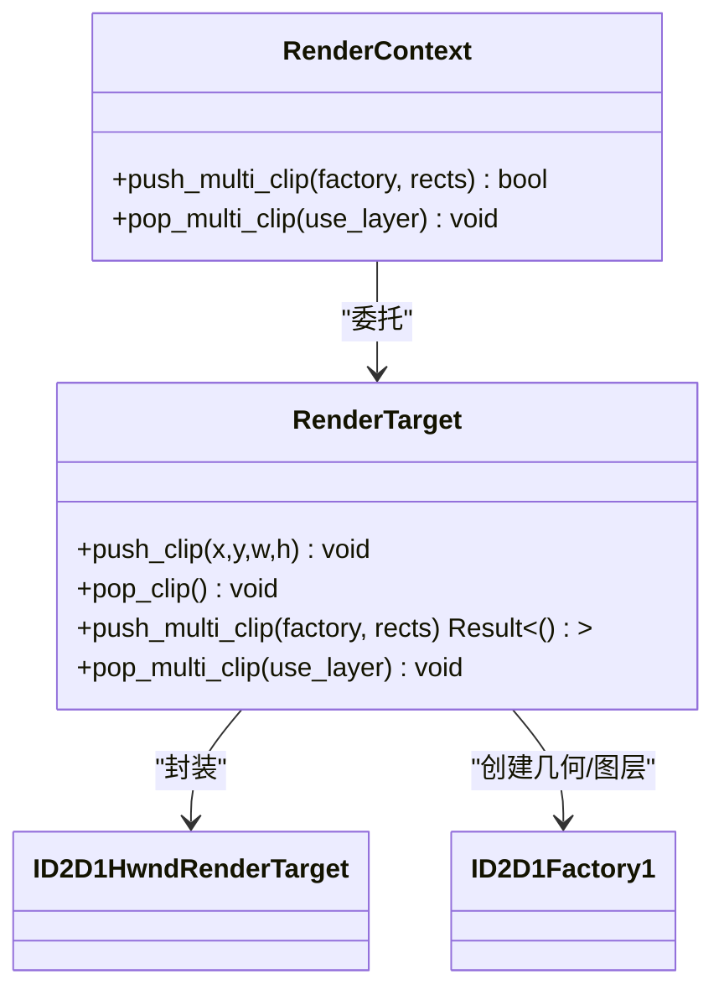
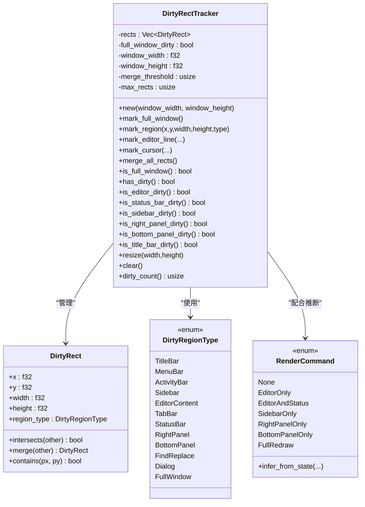
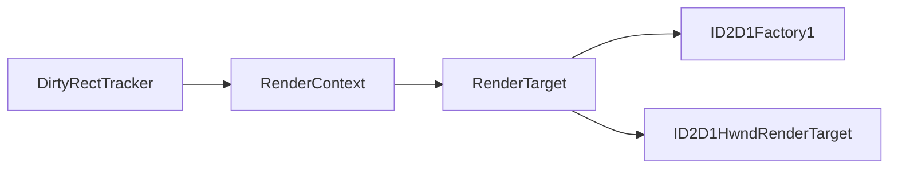

# 脏矩形优化

<cite>
**本文引用的文件**
- [dirty_rect.rs](file://crates/aether-win32/src/dirty_rect.rs)
- [render_context.rs](file://crates/aether-win32/src/render_context.rs)
- [factory.rs](file://crates/aether-render/src/d2d/factory.rs)
- [render.rs](file://crates/aether-win32/src/render.rs)
</cite>

## 目录
1. [简介](#简介)
2. [项目结构](#项目结构)
3. [核心组件](#核心组件)
4. [架构总览](#架构总览)
5. [详细组件分析](#详细组件分析)
6. [依赖关系分析](#依赖关系分析)
7. [性能考量](#性能考量)
8. [故障排查指南](#故障排查指南)
9. [结论](#结论)
10. [附录](#附录)

## 简介
本技术文档围绕“脏矩形优化系统”展开，系统性阐述以下方面：
- 脏区域计算算法：增量更新策略、区域合并与降级机制、精确裁剪。
- 多矩形裁剪系统：push_multi_clip 与 pop_multi_clip 的工作原理、Layer 模式与 AxisAlignedClip 的选择逻辑。
- 渲染区域的精确计算：可见性检测、重叠区域处理、性能监控与降级策略。
- 配置选项与调试技巧：如何调优阈值、观察命中区域、定位重绘热点。

## 项目结构
脏矩形优化涉及四个关键模块：
- 脏矩形追踪器（DirtyRectTracker）：负责记录并合并脏区域，提供按区域类型的查询接口。
- 渲染上下文（RenderContext）：封装 Direct2D 的裁剪设置与资源缓存，协调多矩形裁剪。
- 渲染目标（RenderTarget）：底层 D2D 包装，实现单矩形与多矩形裁剪路径。
- 主渲染流程（EditorState::render）：状态变化到脏区域标记、裁剪设置、绘制与清理。

图表来源
- [render.rs:394-410](file://crates/aether-win32/src/render.rs#L394-L410)
- [render_context.rs:102-155](file://crates/aether-win32/src/render_context.rs#L102-L155)
- [factory.rs:172-263](file://crates/aether-render/src/d2d/factory.rs#L172-L263)
- [dirty_rect.rs:87-162](file://crates/aether-win32/src/dirty_rect.rs#L87-L162)

章节来源
- [render.rs:394-410](file://crates/aether-win32/src/render.rs#L394-L410)
- [render_context.rs:102-155](file://crates/aether-win32/src/render_context.rs#L102-L155)
- [factory.rs:172-263](file://crates/aether-render/src/d2d/factory.rs#L172-L263)
- [dirty_rect.rs:87-162](file://crates/aether-win32/src/dirty_rect.rs#L87-L162)

## 核心组件
- DirtyRectTracker：维护当前帧的脏矩形列表与全窗口标志；支持按区域类型合并与降级为全窗口重绘；提供 is_editor_dirty/is_status_bar_dirty 等便捷判断。
- RenderCommand：根据 UI 状态变化推断最小必要重绘范围（如仅编辑器、仅侧边栏、全量等）。
- RenderContext：对外暴露 push_multi_clip/pop_multi_clip，内部选择 PushAxisAlignedClip 或 PushLayer + GeometryGroup 的多矩形裁剪路径。
- RenderTarget：封装 Direct2D API，实现单矩形快路径与多矩形几何组裁剪路径。

章节来源
- [dirty_rect.rs:87-162](file://crates/aether-win32/src/dirty_rect.rs#L87-L162)
- [dirty_rect.rs:368-426](file://crates/aether-win32/src/dirty_rect.rs#L368-L426)
- [render_context.rs:102-155](file://crates/aether-win32/src/render_context.rs#L102-L155)
- [factory.rs:143-263](file://crates/aether-render/src/d2d/factory.rs#L143-L263)

## 架构总览
脏矩形优化的端到端流程如下：
- 状态变化检测：对比上一帧状态，生成 RenderCommand。
- 脏区域标记：将变化映射为具体区域（行级、光标、面板等），并进行同类型重叠合并。
- 裁剪决策：若非全窗口且存在脏区域，则使用多矩形并集裁剪；失败时回退为包围盒 AxisAlignedClip。
- 绘制与清理：在裁剪区域内执行局部绘制，结束后弹出裁剪并清除脏标记。

图表来源
- [render.rs:394-410](file://crates/aether-win32/src/render.rs#L394-L410)
- [render_context.rs:102-155](file://crates/aether-win32/src/render_context.rs#L102-L155)
- [factory.rs:172-263](file://crates/aether-render/src/d2d/factory.rs#L172-L263)
- [dirty_rect.rs:120-162](file://crates/aether-win32/src/dirty_rect.rs#L120-L162)

## 详细组件分析

### 脏区域计算算法
- 增量更新策略
  - 通过对比上一帧状态（光标位置、滚动、选择、侧边栏内容、面板可见性等）推断最小重绘范围，避免无变化时的全窗口重绘。
  - 特殊场景（标签切换、底部面板可见性变化）强制全窗口重绘，以避免旧像素残留。
- 区域合并
  - 同一区域类型的相邻或相交矩形会被合并，减少绘制调用次数。
  - 当脏矩形数量超过阈值时触发批量合并；超过最大数量时降级为全窗口重绘，保证稳定性。
- 精确裁剪
  - 非全窗口且有脏区域时，采用多矩形并集裁剪，避免合并为单一包围盒导致的额外重绘面积膨胀。
  - 若多矩形路径失败，回退为包围盒 AxisAlignedClip，确保正确性。

图表来源
- [render.rs:284-365](file://crates/aether-win32/src/render.rs#L284-L365)
- [dirty_rect.rs:120-162](file://crates/aether-win32/src/dirty_rect.rs#L120-L162)
- [dirty_rect.rs:336-356](file://crates/aether-win32/src/dirty_rect.rs#L336-L356)

章节来源
- [render.rs:284-365](file://crates/aether-win32/src/render.rs#L284-L365)
- [dirty_rect.rs:120-162](file://crates/aether-win32/src/dirty_rect.rs#L120-L162)
- [dirty_rect.rs:336-356](file://crates/aether-win32/src/dirty_rect.rs#L336-L356)

### 多矩形裁剪系统：push_multi_clip 与 pop_multi_clip
- 选择逻辑
  - 单矩形：走 PushAxisAlignedClip 快路径，返回 false（表示未使用 Layer）。
  - 多矩形：创建 ID2D1RectangleGeometry 集合，组合为 ID2D1GeometryGroup（Union 模式），以几何掩码 PushLayer 实现真正的多矩形裁剪，返回 true（表示使用 Layer）。
  - 失败回退：计算所有矩形的包围盒，使用单个 AxisAlignedClip 作为兜底，返回 false。
- 弹出配对
  - pop_multi_clip 依据 use_layer 标志决定调用 PopLayer 还是 PopAxisAlignedClip，确保栈平衡。

图表来源
- [render_context.rs:102-155](file://crates/aether-win32/src/render_context.rs#L102-L155)
- [factory.rs:172-263](file://crates/aether-render/src/d2d/factory.rs#L172-L263)

章节来源
- [render_context.rs:102-155](file://crates/aether-win32/src/render_context.rs#L102-L155)
- [factory.rs:172-263](file://crates/aether-render/src/d2d/factory.rs#L172-L263)

### 渲染区域的精确计算
- 可见性检测
  - 通过 is_full_window()/is_editor_dirty()/is_status_bar_dirty() 等接口快速判定哪些区域需要绘制。
  - 欢迎页状态下，对未被裁剪覆盖的区域进行背景填充，避免黑色空洞。
- 重叠区域处理
  - 同类型脏矩形在标记阶段即进行相交合并，减少最终裁剪区域数量。
  - 多矩形并集裁剪进一步避免包围盒膨胀带来的多余绘制。
- 性能监控
  - 使用 tracing::trace 输出关键渲染节点信息，便于定位热点。
  - 命中区域记录（debug 构建）可导出 JSONL 用于可视化分析。

章节来源
- [dirty_rect.rs:231-321](file://crates/aether-win32/src/dirty_rect.rs#L231-L321)
- [render.rs:412-474](file://crates/aether-win32/src/render.rs#L412-L474)
- [render.rs:94-98](file://crates/aether-win32/src/render.rs#L94-L98)

### 类图：脏矩形追踪器与命令

图表来源
- [dirty_rect.rs:8-35](file://crates/aether-win32/src/dirty_rect.rs#L8-L35)
- [dirty_rect.rs:37-85](file://crates/aether-win32/src/dirty_rect.rs#L37-L85)
- [dirty_rect.rs:87-162](file://crates/aether-win32/src/dirty_rect.rs#L87-L162)
- [dirty_rect.rs:368-426](file://crates/aether-win32/src/dirty_rect.rs#L368-L426)

章节来源
- [dirty_rect.rs:8-35](file://crates/aether-win32/src/dirty_rect.rs#L8-L35)
- [dirty_rect.rs:37-85](file://crates/aether-win32/src/dirty_rect.rs#L37-L85)
- [dirty_rect.rs:87-162](file://crates/aether-win32/src/dirty_rect.rs#L87-L162)
- [dirty_rect.rs:368-426](file://crates/aether-win32/src/dirty_rect.rs#L368-L426)

## 依赖关系分析
- 耦合与内聚
  - DirtyRectTracker 与 RenderCommand 解耦良好，前者专注区域管理，后者专注状态到命令的映射。
  - RenderContext 作为中间层屏蔽 Direct2D 细节，提高内聚性与可测试性。
- 外部依赖
  - Direct2D 工厂与渲染目标：几何组与图层操作依赖 ID2D1Factory1 与 ID2D1HwndRenderTarget。
- 潜在循环依赖
  - 当前分层清晰，未见循环依赖迹象。

图表来源
- [render_context.rs:102-155](file://crates/aether-win32/src/render_context.rs#L102-L155)
- [factory.rs:172-263](file://crates/aether-render/src/d2d/factory.rs#L172-L263)

章节来源
- [render_context.rs:102-155](file://crates/aether-win32/src/render_context.rs#L102-L155)
- [factory.rs:172-263](file://crates/aether-render/src/d2d/factory.rs#L172-L263)

## 性能考量
- 增量更新优先：仅在必要时标记脏区域，无变化时跳过渲染。
- 区域合并与降级：控制脏矩形数量，避免过多小矩形导致裁剪开销上升。
- 多矩形裁剪：尽量使用 Layer + GeometryGroup 实现精确裁剪，降低无效绘制。
- 设备丢失恢复：捕获 D2DERR_RECREATE_TARGET 错误，重建渲染目标与资源，保障稳定性。

[本节为通用指导，不直接分析具体文件]

## 故障排查指南
- 常见问题
  - 黑屏或区域缺失：检查欢迎页模式下裁剪区域外的背景填充逻辑是否正确。
  - 重影或残留像素：确认标签切换、底部面板可见性变化等场景是否触发了全窗口重绘。
  - 多矩形裁剪失败：查看回退逻辑是否生效，确保包围盒 AxisAlignedClip 被正确应用。
- 调试技巧
  - 启用 tracing::trace 输出关键渲染节点，定位耗时环节。
  - 在 debug 构建下导出命中区域 JSONL，结合可视化工具分析热点。
  - 调整 merge_threshold 与 max_rects，观察脏矩形数量与重绘面积的变化。

章节来源
- [render.rs:412-474](file://crates/aether-win32/src/render.rs#L412-L474)
- [render.rs:704-746](file://crates/aether-win32/src/render.rs#L704-L746)
- [render.rs:94-98](file://crates/aether-win32/src/render.rs#L94-L98)

## 结论
该脏矩形优化系统通过精细的状态变化检测、区域合并与多矩形裁剪，显著降低了不必要的重绘面积与绘制调用次数。其设计兼顾了正确性与性能，并在异常情况下提供了稳健的回退策略。通过合理的配置与调试手段，可在不同场景下取得更优的渲染表现。

[本节为总结，不直接分析具体文件]

## 附录
- 配置项建议
  - merge_threshold：根据界面复杂度与交互频率调整，通常 8 左右较为均衡。
  - max_rects：限制脏矩形上限，防止极端情况退化。
- 最佳实践
  - 优先使用细粒度标记（行级、光标、面板），避免频繁的全窗口重绘。
  - 在多矩形裁剪失败时，确保包围盒回退逻辑可用，维持视觉一致性。
  - 定期评估 tracing 日志与命中区域数据，持续优化渲染路径。

[本节为通用指导，不直接分析具体文件]