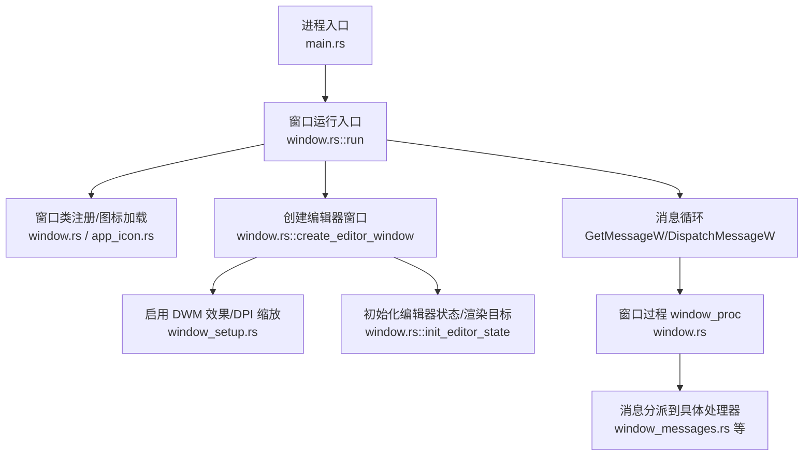
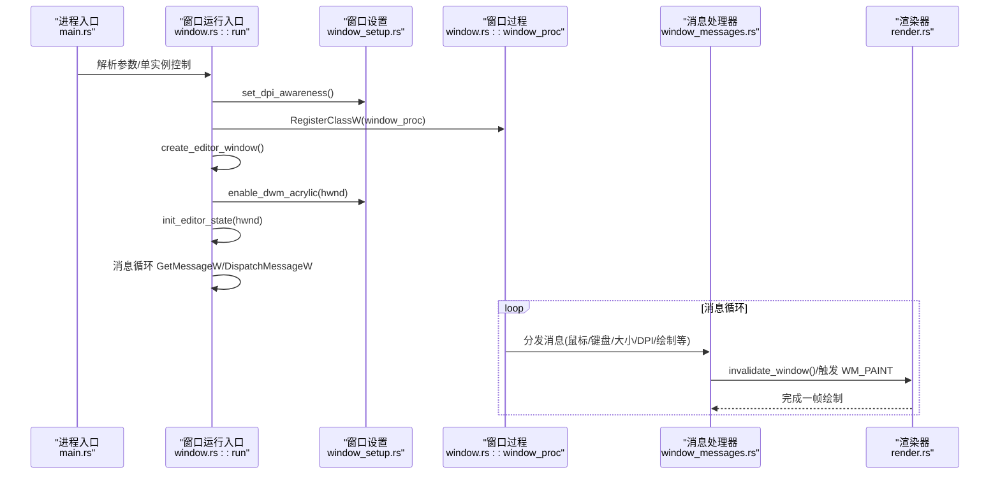
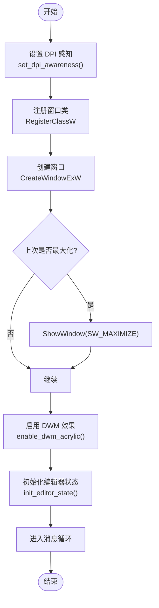
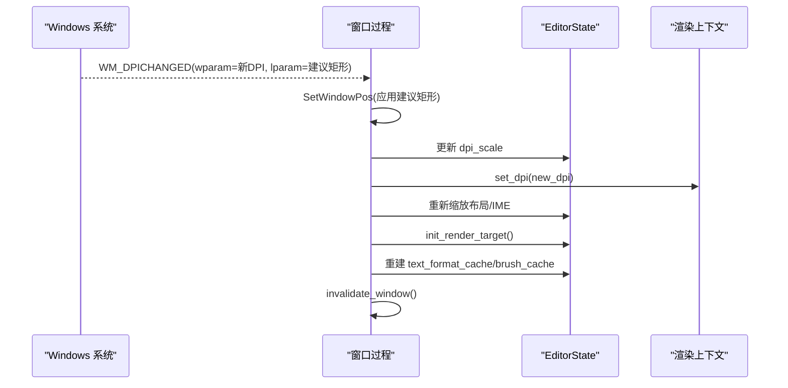
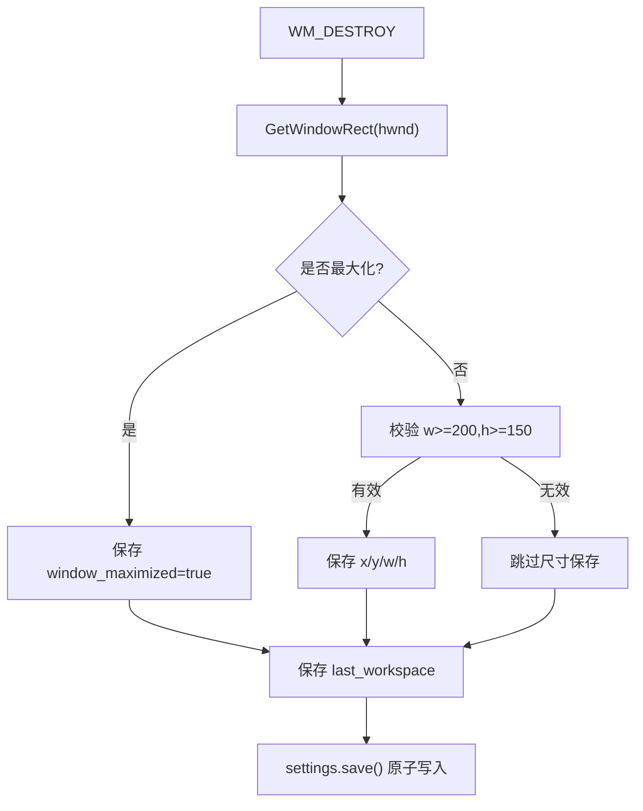
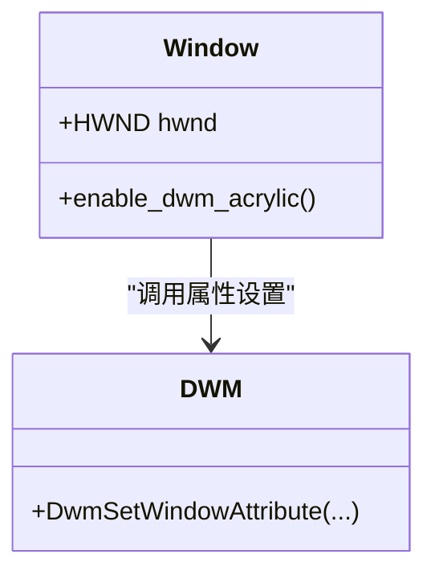
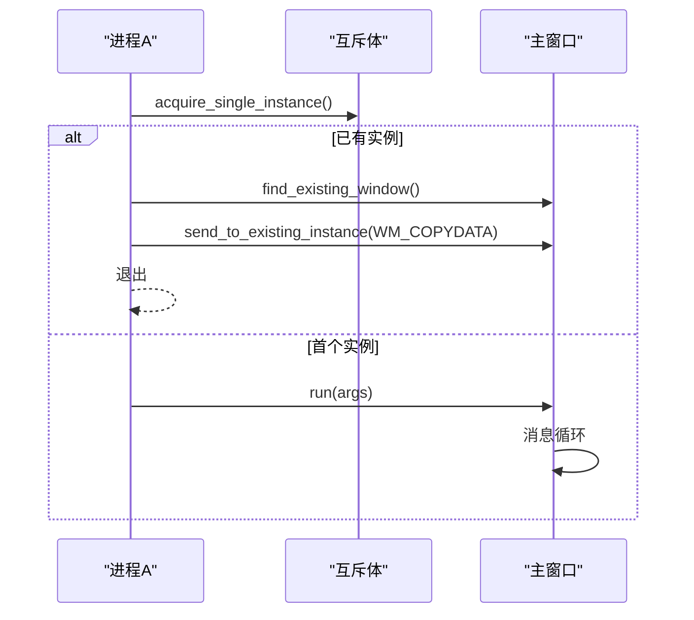
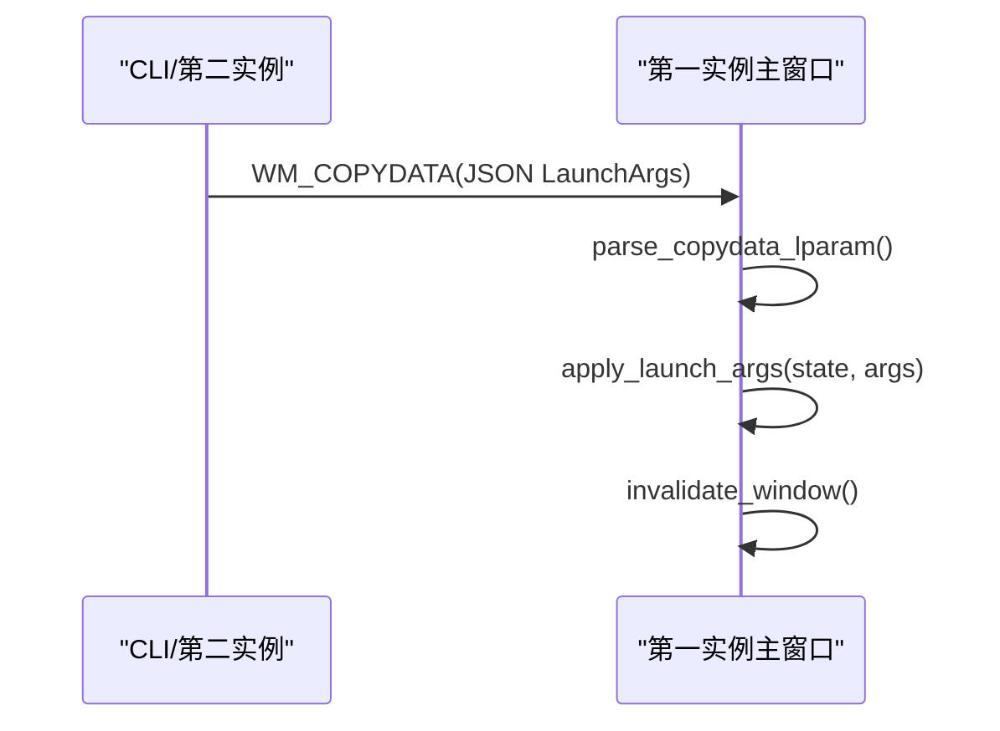
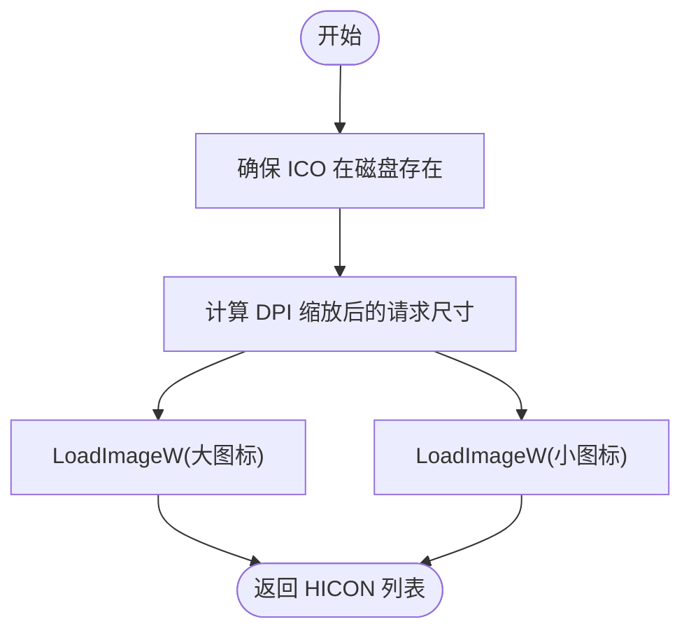
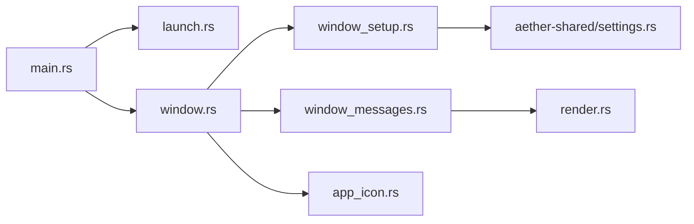

# 窗口管理系统

<cite>
**本文引用的文件**   
- [main.rs](file://crates/aether-win32/src/main.rs)
- [window.rs](file://crates/aether-win32/src/window.rs)
- [window_setup.rs](file://crates/aether-win32/src/window/window_setup.rs)
- [window_messages.rs](file://crates/aether-win32/src/window/window_messages.rs)
- [app_icon.rs](file://crates/aether-win32/src/window/app_icon.rs)
- [launch.rs](file://crates/aether-win32/src/launch.rs)
- [settings.rs](file://crates/aether-shared/src/settings.rs)
- [render.rs](file://crates/aether-win32/src/render.rs)
</cite>

## 目录
1. [简介](#简介)
2. [项目结构](#项目结构)
3. [核心组件](#核心组件)
4. [架构总览](#架构总览)
5. [详细组件分析](#详细组件分析)
6. [依赖关系分析](#依赖关系分析)
7. [性能考量](#性能考量)
8. [故障排查指南](#故障排查指南)
9. [结论](#结论)

## 简介
本技术文档聚焦于牧羊人编辑器的窗口管理系统，围绕 Win32 窗口创建与初始化、DPI 感知与多显示器适配、窗口状态持久化、DWM Acrylic/Mica 效果集成以及窗口生命周期管理与性能优化进行系统化阐述。文档面向具备一定 Windows/GUI 开发背景的读者，同时尽量以循序渐进的方式帮助非专业用户理解关键机制。

## 项目结构
窗口管理相关代码主要位于 aether-win32 模块中，采用“入口 + 窗口核心 + 消息处理 + 设置/启动参数”的分层组织方式：
- 进程入口负责单实例控制与主循环调度
- 窗口核心负责类注册、窗口创建、状态初始化与消息分发
- 消息处理按功能拆分到子模块（键盘、鼠标、IME、通用消息等）
- 设置与持久化由共享配置模块提供

图示来源
- [main.rs:1-52](file://crates/aether-win32/src/main.rs#L1-L52)
- [window.rs:114-173](file://crates/aether-win32/src/window.rs#L114-L173)
- [window.rs:179-246](file://crates/aether-win32/src/window.rs#L179-L246)
- [window_setup.rs:18-86](file://crates/aether-win32/src/window/window_setup.rs#L18-L86)
- [window_messages.rs:301-372](file://crates/aether-win32/src/window/window_messages.rs#L301-L372)

章节来源
- [main.rs:1-52](file://crates/aether-win32/src/main.rs#L1-L52)
- [window.rs:114-173](file://crates/aether-win32/src/window.rs#L114-L173)

## 核心组件
- 进程入口与单实例控制：通过互斥体与窗口查找实现单实例，并将启动参数转发至已有实例。
- 窗口核心：完成 DPI 感知设置、窗口类注册、窗口创建、DWM 效果启用、编辑器状态初始化与消息循环。
- 消息处理：统一在窗口过程中捕获 panic，将消息路由到各处理器；对 WM_PAINT 做统一渲染驱动。
- 设置与持久化：保存/恢复窗口位置、尺寸、最大化状态与工作区路径。
- 启动参数应用：支持打开文件夹/文件、定位行号列号、跨实例传递参数。

章节来源
- [launch.rs:1-106](file://crates/aether-win32/src/launch.rs#L1-L106)
- [window.rs:114-173](file://crates/aether-win32/src/window.rs#L114-L173)
- [window_messages.rs:301-372](file://crates/aether-win32/src/window/window_messages.rs#L301-L372)
- [window_setup.rs:180-217](file://crates/aether-win32/src/window/window_setup.rs#L180-L217)
- [settings.rs:143-173](file://crates/aether-shared/src/settings.rs#L143-L173)

## 架构总览
下图展示了从进程启动到窗口创建、消息分发与渲染的整体流程，并标注了关键函数与模块的对应关系。

图示来源
- [main.rs:8-26](file://crates/aether-win32/src/main.rs#L8-L26)
- [window.rs:114-173](file://crates/aether-win32/src/window.rs#L114-L173)
- [window_setup.rs:18-86](file://crates/aether-win32/src/window/window_setup.rs#L18-L86)
- [window_messages.rs:301-372](file://crates/aether-win32/src/window/window_messages.rs#L301-L372)
- [render.rs:62-134](file://crates/aether-win32/src/render.rs#L62-L134)

## 详细组件分析

### Win32 窗口创建与初始化流程
- DPI 感知设置：优先使用 Per-Monitor V2，失败回退到 Per-Monitor。
- 窗口类注册：设置样式（如双击）、光标、背景画刷、图标，绑定窗口过程。
- 窗口创建：根据是否主窗口选择是否从持久化设置恢复矩形；设置扩展样式与常规样式；必要时立即最大化。
- DWM 效果启用：沉浸式暗色模式、主机 backdrop brush、系统 backdrop 类型、旧版 Mica 兼容、非客户区策略。
- 编辑器状态初始化：获取实际 DPI 与缩放因子、更新布局与 IME 尺寸、计算客户区尺寸、初始化渲染目标并首次渲染、安装低层键盘钩子、将状态指针保存到 GWLP_USERDATA。

图示来源
- [window_setup.rs:18-30](file://crates/aether-win32/src/window/window_setup.rs#L18-L30)
- [window.rs:134-173](file://crates/aether-win32/src/window.rs#L134-L173)
- [window.rs:179-246](file://crates/aether-win32/src/window.rs#L179-L246)
- [window.rs:249-297](file://crates/aether-win32/src/window.rs#L249-L297)

章节来源
- [window_setup.rs:18-86](file://crates/aether-win32/src/window/window_setup.rs#L18-L86)
- [window.rs:134-173](file://crates/aether-win32/src/window.rs#L134-L173)
- [window.rs:179-246](file://crates/aether-win32/src/window.rs#L179-L246)
- [window.rs:249-297](file://crates/aether-win32/src/window.rs#L249-L297)

### DPI 感知与多显示器适配
- 进程级 DPI 感知：Per-Monitor V2 优先，失败回退到 Per-Monitor。
- 窗口级 DPI 变化：处理 WM_DPICHANGED，更新 dpi_scale、渲染上下文 DPI、文本渲染器 DPI、布局常量、IME 尺寸，重建渲染目标与缓存资源，标记重绘。
- 初始默认尺寸：基于系统 DPI 计算逻辑像素尺寸作为回退值。
- 多显示器校验：恢复窗口矩形时，使用 MonitorFromRect 检查是否与任意已连接显示器相交，避免窗口出现在已拔出的显示器上。

图示来源
- [window_setup.rs:18-30](file://crates/aether-win32/src/window/window_setup.rs#L18-L30)
- [window_setup.rs:88-99](file://crates/aether-win32/src/window/window_setup.rs#L88-L99)
- [window_setup.rs:110-178](file://crates/aether-win32/src/window/window_setup.rs#L110-L178)
- [window_messages.rs:346-394](file://crates/aether-win32/src/window/window_messages.rs#L346-L394)

章节来源
- [window_setup.rs:18-30](file://crates/aether-win32/src/window/window_setup.rs#L18-L30)
- [window_setup.rs:88-99](file://crates/aether-win32/src/window/window_setup.rs#L88-L99)
- [window_setup.rs:110-178](file://crates/aether-win32/src/window/window_setup.rs#L110-L178)
- [window_messages.rs:346-394](file://crates/aether-win32/src/window/window_messages.rs#L346-L394)

### 窗口状态持久化系统
- 持久化时机：主窗口销毁前（WM_DESTROY），仅主窗口持久化。
- 持久化内容：窗口最大化标志、正常状态下的 x/y/width/height（拒绝异常尺寸）、当前工作区路径。
- 恢复逻辑：创建窗口时读取设置，若上次为最大化则使用默认矩形并在创建后 SW_MAXIMIZE；否则校验持久化矩形是否落在任一显示器内，有效则使用，否则回退默认。
- 存储格式：AppSettings.ui 字段，原子写入 settings.json，API 密钥单独加密存储。

图示来源
- [window_setup.rs:180-217](file://crates/aether-win32/src/window/window_setup.rs#L180-L217)
- [window_setup.rs:110-178](file://crates/aether-win32/src/window/window_setup.rs#L110-L178)
- [settings.rs:340-417](file://crates/aether-shared/src/settings.rs#L340-L417)

章节来源
- [window_setup.rs:180-217](file://crates/aether-win32/src/window/window_setup.rs#L180-L217)
- [window_setup.rs:110-178](file://crates/aether-win32/src/window/window_setup.rs#L110-L178)
- [settings.rs:340-417](file://crates/aether-shared/src/settings.rs#L340-L417)

### DWM Acrylic/Mica 效果集成
- 沉浸式暗色模式：启用深色主题。
- 主机 backdrop brush：允许使用系统提供的 backdrop（Acrylic/Mica）。
- 系统 backdrop 类型：Windows 11 22H2+ 使用 DWMWA_SYSTEMBACKDROP_TYPE，选择 Mica Alt 以获得标题栏与客户区透出的视觉效果。
- 兼容性：保留旧版 attribute 1029 的 Mica 开关以兼容更早版本。
- 非客户区策略：禁用系统 NC 绘制以避免白色边框干扰。

图示来源
- [window_setup.rs:33-86](file://crates/aether-win32/src/window/window_setup.rs#L33-L86)

章节来源
- [window_setup.rs:33-86](file://crates/aether-win32/src/window/window_setup.rs#L33-L86)

### 窗口生命周期管理与最佳实践
- 单实例控制：通过全局互斥体与 FindWindowW 查找主窗口，第二个实例通过 WM_COPYDATA 发送 JSON 序列化参数，接收方解析后应用并触发重绘。
- 窗口计数与退出：全局原子计数器 UI-C02，当最后一个窗口销毁时 PostQuitMessage 终止消息循环。
- 窗口过程健壮性：catch_unwind 包裹整个窗口过程，panic 时回退到 DefWindowProcW，避免崩溃。
- 渲染一致性：事件处理只标记脏区域，统一由 WM_PAINT 驱动渲染，避免双重渲染；WM_ERASEBKGND 返回 TRUE 阻止系统擦除背景，减少闪烁。
- 无边框交互：自定义 NCHITTEST 实现调整大小与拖动，结合 DPI 自适应边框宽度。

图示来源
- [launch.rs:15-75](file://crates/aether-win32/src/launch.rs#L15-L75)
- [window.rs:301-372](file://crates/aether-win32/src/window.rs#L301-L372)
- [window_messages.rs:269-324](file://crates/aether-win32/src/window/window_messages.rs#L269-L324)

章节来源
- [launch.rs:15-75](file://crates/aether-win32/src/launch.rs#L15-L75)
- [window.rs:301-372](file://crates/aether-win32/src/window.rs#L301-L372)
- [window_messages.rs:269-324](file://crates/aether-win32/src/window/window_messages.rs#L269-L324)

### 启动参数与应用流程
- 启动参数解析：LaunchArgs 包含路径列表与 goto 定位信息。
- 应用逻辑：打开文件夹或文件（文件会先打开父目录作为工作区），支持 goto 定位到指定行列。
- 跨实例传递：WM_COPYDATA 传输 JSON，接收方解析后 apply_launch_args 并触发重绘。

图示来源
- [launch.rs:77-106](file://crates/aether-win32/src/launch.rs#L77-L106)
- [window_setup.rs:219-249](file://crates/aether-win32/src/window/window_setup.rs#L219-L249)
- [window_messages.rs:251-267](file://crates/aether-win32/src/window/window_messages.rs#L251-L267)

章节来源
- [launch.rs:77-106](file://crates/aether-win32/src/launch.rs#L77-L106)
- [window_setup.rs:219-249](file://crates/aether-win32/src/window/window_setup.rs#L219-L249)
- [window_messages.rs:251-267](file://crates/aether-win32/src/window/window_messages.rs#L251-L267)

### 图标加载与 DPI 自适应
- 多尺寸 ICO 嵌入：编译期 include_bytes! 将 aether.ico 嵌入二进制。
- 运行时写出：将 ICO 写到 exe 同目录或临时目录，避免引入额外资源工具链。
- DPI 自适应：根据系统 DPI 计算大/小图标请求尺寸，从 ICO 中选择最接近的高分辨率位图。

图示来源
- [app_icon.rs:58-105](file://crates/aether-win32/src/window/app_icon.rs#L58-L105)
- [app_icon.rs:107-137](file://crates/aether-win32/src/window/app_icon.rs#L107-L137)

章节来源
- [app_icon.rs:58-105](file://crates/aether-win32/src/window/app_icon.rs#L58-L105)
- [app_icon.rs:107-137](file://crates/aether-win32/src/window/app_icon.rs#L107-L137)

## 依赖关系分析
- 模块耦合：
  - main.rs 依赖 launch.rs 与 window.rs 的 run 入口。
  - window.rs 依赖 window_setup.rs（DPI/DWM/持久化）、window_messages.rs（消息处理）、app_icon.rs（图标）。
  - window_messages.rs 依赖 render.rs（通过 invalidate_window 触发 WM_PAINT）。
  - window_setup.rs 依赖 aether_shared::settings（持久化读写）。
- 外部依赖：
  - Windows API：Win32 Foundation/GDI/HiDpi/WindowsAndMessaging/Dwm/Shell 等。
  - Direct2D/DirectWrite：渲染与文本格式化。
  - serde_json：JSON 序列化/反序列化。

图示来源
- [main.rs:1-26](file://crates/aether-win32/src/main.rs#L1-L26)
- [window.rs:114-173](file://crates/aether-win32/src/window.rs#L114-L173)
- [window_setup.rs:18-86](file://crates/aether-win32/src/window/window_setup.rs#L18-L86)
- [window_messages.rs:301-372](file://crates/aether-win32/src/window/window_messages.rs#L301-L372)
- [settings.rs:340-417](file://crates/aether-shared/src/settings.rs#L340-L417)

章节来源
- [main.rs:1-26](file://crates/aether-win32/src/main.rs#L1-L26)
- [window.rs:114-173](file://crates/aether-win32/src/window.rs#L114-L173)
- [window_setup.rs:18-86](file://crates/aether-win32/src/window/window_setup.rs#L18-L86)
- [window_messages.rs:301-372](file://crates/aether-win32/src/window/window_messages.rs#L301-L372)
- [settings.rs:340-417](file://crates/aether-shared/src/settings.rs#L340-L417)

## 性能考量
- 渲染合并：通过 InvalidateRect 合并多次重绘请求，统一在 WM_PAINT 执行，避免双重渲染。
- 设备丢失恢复：渲染路径 catch_unwind 捕获 D2D 设备丢失导致的 panic，重建渲染目标与常用资源。
- 定时器节流：终端刷新、悬停提示、自动保存等使用定时器按需触发，不可见面板自动停止定时器以减少空转。
- DPI 切换优化：WM_DPICHANGED 后重建渲染目标与缓存资源，避免字体/画笔尺寸不一致导致的重复测量与重绘。
- 无背景擦除：WM_ERASEBKGND 返回 TRUE 阻止系统擦除背景，减少闪烁与多余绘制。

章节来源
- [window.rs:66-75](file://crates/aether-win32/src/window.rs#L66-L75)
- [window_messages.rs:478-514](file://crates/aether-win32/src/window/window_messages.rs#L478-L514)
- [window_messages.rs:20-40](file://crates/aether-win32/src/window/window_messages.rs#L20-L40)
- [window_messages.rs:346-394](file://crates/aether-win32/src/window/window_messages.rs#L346-L394)
- [window_messages.rs:467-476](file://crates/aether-win32/src/window/window_messages.rs#L467-L476)

## 故障排查指南
- 窗口过程 panic：窗口过程 catch_unwind 记录诊断并回退到 DefWindowProcW，便于定位问题而不崩溃。
- 渲染 panic：WM_PAINT 渲染路径 catch_unwind 捕获 D2D 设备丢失等错误，打印诊断并跳过本次绘制。
- 单实例冲突：确认互斥体名称与窗口类名一致；检查 FindWindowW 是否能找到主窗口；验证 WM_COPYDATA 数据长度与 UTF-16 编码。
- DPI 异常：检查 WM_DPICHANGED 是否被正确处理；确认 DPI 缩放后布局与 IME 尺寸更新；确认渲染目标与缓存重建。
- 持久化失败：检查 settings.json 原子写入是否成功；确认权限与路径；查看损坏备份文件（.json.corrupt）。

章节来源
- [window.rs:301-372](file://crates/aether-win32/src/window.rs#L301-L372)
- [window_messages.rs:478-514](file://crates/aether-win32/src/window/window_messages.rs#L478-L514)
- [launch.rs:15-75](file://crates/aether-win32/src/launch.rs#L15-L75)
- [window_messages.rs:346-394](file://crates/aether-win32/src/window/window_messages.rs#L346-L394)
- [settings.rs:327-338](file://crates/aether-shared/src/settings.rs#L327-L338)

## 结论
本窗口管理系统在 Win32 基础上实现了完善的 DPI 感知、多显示器适配、窗口状态持久化与 DWM 视觉效果集成。通过统一的渲染驱动与健壮的消息处理机制，系统在复杂交互场景下保持了稳定性与性能。建议在后续迭代中持续优化高 DPI 下的命中测试精度、进一步细化脏区域追踪粒度，并完善跨实例通信的错误恢复与日志诊断能力。