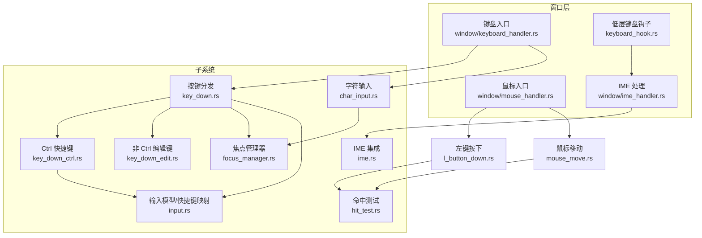
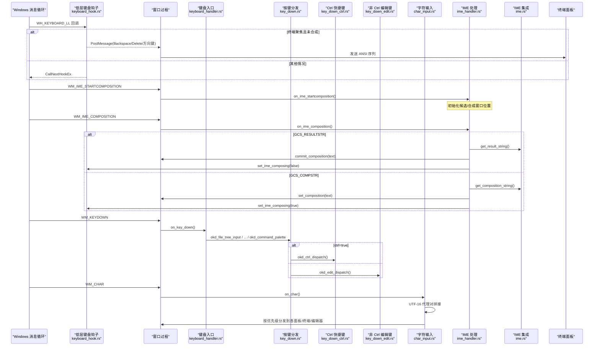
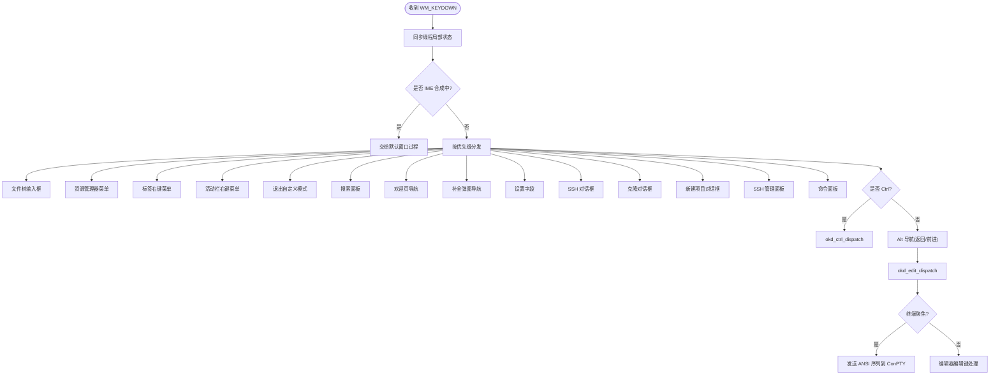
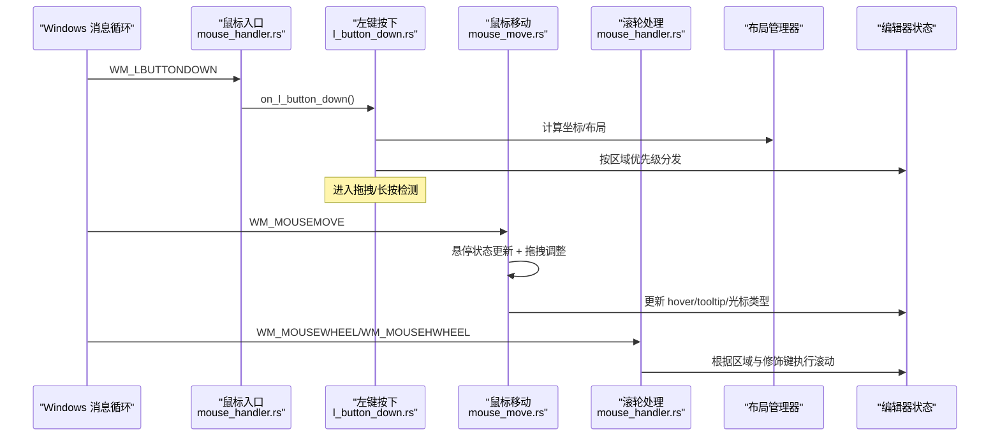
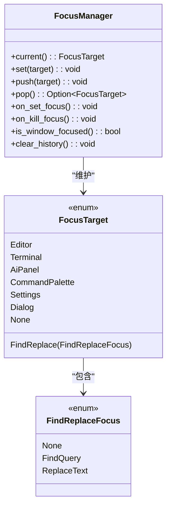
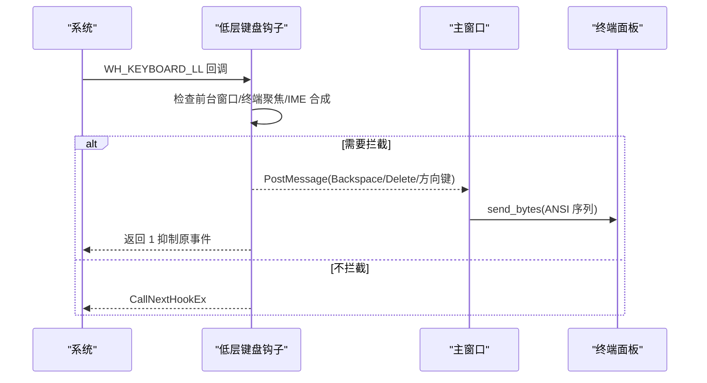
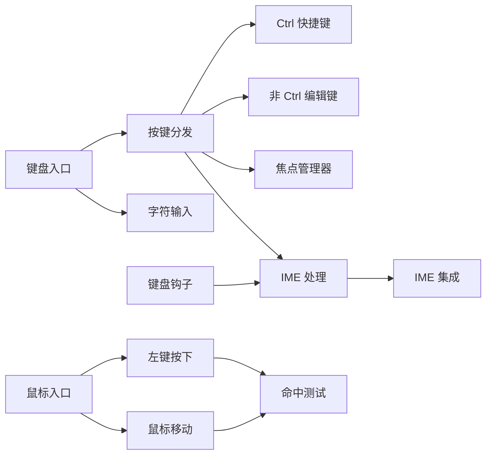

# 输入事件处理

<cite>
**本文引用的文件**   
- [input.rs](file://crates/aether-win32/src/input.rs)
- [keyboard_hook.rs](file://crates/aether-win32/src/keyboard_hook.rs)
- [focus_manager.rs](file://crates/aether-win32/src/focus_manager.rs)
- [keyboard_handler.rs](file://crates/aether-win32/src/window/keyboard_handler.rs)
- [key_down.rs](file://crates/aether-win32/src/window/keyboard_handler/key_down.rs)
- [char_input.rs](file://crates/aether-win32/src/window/keyboard_handler/char_input.rs)
- [key_down_ctrl.rs](file://crates/aether-win32/src/window/keyboard_handler/key_down_ctrl.rs)
- [key_down_edit.rs](file://crates/aether-win32/src/window/keyboard_handler/key_down_edit.rs)
- [mouse_handler.rs](file://crates/aether-win32/src/window/mouse_handler.rs)
- [l_button_down.rs](file://crates/aether-win32/src/window/mouse_handler/l_button_down.rs)
- [mouse_move.rs](file://crates/aether-win32/src/window/mouse_handler/mouse_move.rs)
- [ime_handler.rs](file://crates/aether-win32/src/window/ime_handler.rs)
- [ime.rs](file://crates/aether-win32/src/ime.rs)
- [hit_test.rs](file://crates/aether-win32/src/hit_test.rs)
</cite>

## 目录
1. [简介](#简介)
2. [项目结构](#项目结构)
3. [核心组件](#核心组件)
4. [架构总览](#架构总览)
5. [详细组件分析](#详细组件分析)
6. [依赖关系分析](#依赖关系分析)
7. [性能考量](#性能考量)
8. [故障排查指南](#故障排查指南)
9. [结论](#结论)
10. [附录](#附录)

## 简介
本技术文档聚焦于牧羊人编辑器的输入事件处理系统，覆盖键盘与鼠标两大输入通道、输入法（IME）集成、焦点管理与事件分发优先级、自定义键盘钩子实现原理，以及性能优化与跨平台兼容性建议。目标是帮助开发者理解从底层 Windows 消息到上层编辑器动作的完整链路，并指导扩展与维护。

## 项目结构
输入事件处理主要位于 aether-win32 crate 中，按“窗口层”和“子系统”分层组织：
- 窗口层：键盘与鼠标事件入口、IME 处理、全局键盘钩子
- 子系统：快捷键映射、焦点管理、命中测试、多光标等

图表来源
- [keyboard_handler.rs:1-13](file://crates/aether-win32/src/window/keyboard_handler.rs#L1-L13)
- [mouse_handler.rs:1-277](file://crates/aether-win32/src/window/mouse_handler.rs#L1-L277)
- [ime_handler.rs:1-132](file://crates/aether-win32/src/window/ime_handler.rs#L1-L132)
- [keyboard_hook.rs:1-315](file://crates/aether-win32/src/keyboard_hook.rs#L1-L315)
- [key_down.rs:1-800](file://crates/aether-win32/src/window/keyboard_handler/key_down.rs#L1-L800)
- [key_down_ctrl.rs:1-709](file://crates/aether-win32/src/window/keyboard_handler/key_down_ctrl.rs#L1-L709)
- [key_down_edit.rs:1-591](file://crates/aether-win32/src/window/keyboard_handler/key_down_edit.rs#L1-L591)
- [char_input.rs:1-413](file://crates/aether-win32/src/window/keyboard_handler/char_input.rs#L1-L413)
- [focus_manager.rs:1-193](file://crates/aether-win32/src/focus_manager.rs#L1-L193)
- [ime.rs:1-255](file://crates/aether-win32/src/ime.rs#L1-L255)
- [hit_test.rs:1-245](file://crates/aether-win32/src/hit_test.rs#L1-L245)
- [input.rs:1-355](file://crates/aether-win32/src/input.rs#L1-L355)

章节来源
- [keyboard_handler.rs:1-13](file://crates/aether-win32/src/window/keyboard_handler.rs#L1-L13)
- [mouse_handler.rs:1-277](file://crates/aether-win32/src/window/mouse_handler.rs#L1-L277)

## 核心组件
- 键盘事件入口与分发器：负责 WM_KEYDOWN/WM_CHAR 的接收、状态同步、IME 合成期判断、按优先级路由到各面板/对话框/编辑器。
- 快捷键系统：基于 KeyMap 将虚拟键码与组合键映射为 EditorAction；同时保留硬编码 Ctrl+ 快捷键分支以兼容现有行为。
- 输入法（IME）集成：通过 IMM32 获取合成串/结果串，控制候选窗口位置，并在终端聚焦时旁路 IME 以避免系统级拦截。
- 全局键盘钩子：WH_KEYBOARD_LL 在系统级拦截 Backspace/Delete/方向键，确保终端模式下这些键直达 ConPTY。
- 焦点管理：统一维护当前焦点目标与历史栈，支持窗口失焦恢复与面板间切换。
- 鼠标交互：左键按下/双击/移动/滚轮/横向滚轮，区域命中测试与拖拽调整布局。
- 命中测试：记录可点击区域，辅助 UI 自动化与调试。

章节来源
- [input.rs:1-355](file://crates/aether-win32/src/input.rs#L1-L355)
- [keyboard_hook.rs:1-315](file://crates/aether-win32/src/keyboard_hook.rs#L1-L315)
- [ime.rs:1-255](file://crates/aether-win32/src/ime.rs#L1-L255)
- [focus_manager.rs:1-193](file://crates/aether-win32/src/focus_manager.rs#L1-L193)
- [mouse_handler.rs:1-277](file://crates/aether-win32/src/window/mouse_handler.rs#L1-L277)
- [hit_test.rs:1-245](file://crates/aether-win32/src/hit_test.rs#L1-L245)

## 架构总览
下图展示从 Windows 消息到应用逻辑的关键路径，包括 IME 与全局钩子的协作。

图表来源
- [keyboard_hook.rs:1-315](file://crates/aether-win32/src/keyboard_hook.rs#L1-L315)
- [ime_handler.rs:1-132](file://crates/aether-win32/src/window/ime_handler.rs#L1-L132)
- [ime.rs:1-255](file://crates/aether-win32/src/ime.rs#L1-L255)
- [keyboard_handler.rs:1-13](file://crates/aether-win32/src/window/keyboard_handler.rs#L1-L13)
- [key_down.rs:1-800](file://crates/aether-win32/src/window/keyboard_handler/key_down.rs#L1-L800)
- [key_down_ctrl.rs:1-709](file://crates/aether-win32/src/window/keyboard_handler/key_down_ctrl.rs#L1-L709)
- [key_down_edit.rs:1-591](file://crates/aether-win32/src/window/keyboard_handler/key_down_edit.rs#L1-L591)
- [char_input.rs:1-413](file://crates/aether-win32/src/window/keyboard_handler/char_input.rs#L1-L413)

## 详细组件分析

### 键盘事件处理机制
- 按键映射与组合键
  - KeyMap 提供 (Key, ctrl, shift, alt) -> EditorAction 的查找表，支持字母、功能键、方向键、修饰键组合。
  - from_vk 将 Win32 VIRTUAL_KEY 转换为内部 Key，并结合 ToUnicode 获取字符，适配多键盘布局。
- 快捷键系统
  - 硬编码 Ctrl+ 快捷键分支集中在 key_down_ctrl.rs，涵盖文件操作、视图切换、剪贴板、查找替换、标签页导航、列选择等。
  - KeyMap 作为可扩展的快捷键配置载体，便于未来用户自定义。
- 输入法（IME）集成
  - WM_IME_* 消息由 ime_handler.rs 处理，读取 IMM32 合成串/结果串，更新编辑器 composition 状态，并联动 keyboard_hook.rs 的合成标志。
  - ime.rs 封装 IMM32 API，支持候选窗口定位、DPI 缩放、字体匹配、打开/关闭 IME、临时解绑上下文以旁路 IME。
- 终端模式下的特殊处理
  - 当终端聚焦且未处于 IME 合成期时，非 Ctrl 编辑键直接发送到 ConPTY（ANSI 序列），避免被编辑器消费。
  - 全局键盘钩子在系统级拦截 Backspace/Delete/方向键，绕过 IME 拦截，确保终端删除与方向键可用。

图表来源
- [key_down.rs:1-800](file://crates/aether-win32/src/window/keyboard_handler/key_down.rs#L1-L800)
- [key_down_ctrl.rs:1-709](file://crates/aether-win32/src/window/keyboard_handler/key_down_ctrl.rs#L1-L709)
- [key_down_edit.rs:1-591](file://crates/aether-win32/src/window/keyboard_handler/key_down_edit.rs#L1-L591)

章节来源
- [input.rs:1-355](file://crates/aether-win32/src/input.rs#L1-L355)
- [key_down.rs:1-800](file://crates/aether-win32/src/window/keyboard_handler/key_down.rs#L1-L800)
- [key_down_ctrl.rs:1-709](file://crates/aether-win32/src/window/keyboard_handler/key_down_ctrl.rs#L1-L709)
- [key_down_edit.rs:1-591](file://crates/aether-win32/src/window/keyboard_handler/key_down_edit.rs#L1-L591)
- [char_input.rs:1-413](file://crates/aether-win32/src/window/keyboard_handler/char_input.rs#L1-L413)
- [ime_handler.rs:1-132](file://crates/aether-win32/src/window/ime_handler.rs#L1-L132)
- [ime.rs:1-255](file://crates/aether-win32/src/ime.rs#L1-L255)
- [keyboard_hook.rs:1-315](file://crates/aether-win32/src/keyboard_hook.rs#L1-L315)

### 鼠标交互处理
- 点击检测与双击选词
  - 左键按下按区域优先级分发（对话框、标题栏、用户菜单、上下文菜单、活动栏、面板拖拽、侧边栏、右侧面板、标签栏、查找面板、底部面板、设置面板、欢迎页/编辑器）。
  - 双击在编辑器内容区触发选词。
- 拖拽操作
  - 支持面板尺寸拖拽（右侧面板、底部面板、设置面板导航栏、侧边栏）、活动栏/菜单栏自定义排序拖拽、标签拖拽重排。
  - 拖拽阈值与取消逻辑：移动超过容差则取消长按计时器与拖拽状态。
- 滚轮事件
  - 垂直滚轮：标签栏区域横向滚动；Shift+滚轮或光标在编辑器区域内横向滚动；底部终端面板纵向滚动；侧边栏与主编辑器纵向滚动。
  - 水平滚轮：仅在编辑器区域内响应，按字符宽度换算横向滚动距离。
- 多按钮支持
  - 左键、中键、右键分别有独立处理函数，右键包含按下与释放。

图表来源
- [mouse_handler.rs:1-277](file://crates/aether-win32/src/window/mouse_handler.rs#L1-L277)
- [l_button_down.rs:1-101](file://crates/aether-win32/src/window/mouse_handler/l_button_down.rs#L1-L101)
- [mouse_move.rs:1-800](file://crates/aether-win32/src/window/mouse_handler/mouse_move.rs#L1-L800)

章节来源
- [mouse_handler.rs:1-277](file://crates/aether-win32/src/window/mouse_handler.rs#L1-L277)
- [l_button_down.rs:1-101](file://crates/aether-win32/src/window/mouse_handler/l_button_down.rs#L1-L101)
- [mouse_move.rs:1-800](file://crates/aether-win32/src/window/mouse_handler/mouse_move.rs#L1-L800)

### 输入事件的优先级与分发机制
- 键盘事件优先级
  - 先同步线程局部状态，再检查 IME 合成期。
  - 依次尝试：文件树输入框、各类上下文菜单、自定义模式退出、搜索面板、欢迎页导航、补全弹窗、设置字段、SSH/克隆/新建项目对话框、SSH 管理面板、命令面板。
  - 若 Ctrl 按下，进入 Ctrl 快捷键分发；否则进入非 Ctrl 编辑键分发。
- 字符输入优先级
  - 处理 UTF-16 代理对，确保 BMP 外字符正确拼接。
  - 按优先级分发：文件树输入框、设置字段、搜索面板、SSH/克隆/新建项目对话框、SSH 管理面板、命令面板、查找替换、终端、AI 面板，最后回退到编辑器。
- 焦点管理与事件冒泡
  - FocusManager 维护当前焦点目标与历史栈，窗口失焦时返回 None，重新获得焦点时恢复。
  - 键盘/字符分发在各模块内自行决定“吞掉”消息或继续传播，形成隐式冒泡。

图表来源
- [focus_manager.rs:1-193](file://crates/aether-win32/src/focus_manager.rs#L1-L193)

章节来源
- [key_down.rs:1-800](file://crates/aether-win32/src/window/keyboard_handler/key_down.rs#L1-L800)
- [char_input.rs:1-413](file://crates/aether-win32/src/window/keyboard_handler/char_input.rs#L1-L413)
- [focus_manager.rs:1-193](file://crates/aether-win32/src/focus_manager.rs#L1-L193)

### 自定义键盘钩子的实现原理
- 安装与卸载
  - install 使用 SetWindowsHookExW(WH_KEYBOARD_LL) 安装全局低层键盘钩子，显式传入当前进程模块句柄以满足 LL 钩子要求。
  - uninstall 调用 UnhookWindowsHookEx 安全卸载。
- 过滤与路由
  - 仅在前台窗口为本窗口、终端聚焦且未处于 IME 合成期时拦截 Backspace/Delete/方向键。
  - 通过 PostMessageW 向主窗口投递自定义消息，主窗口将对应字节序列发送到 ConPTY。
- 与 IME 协同
  - IME 合成期通过 set_ime_composing(true) 通知钩子放行，提交后或结束合成时置 false，使后续删除键可达终端。

图表来源
- [keyboard_hook.rs:1-315](file://crates/aether-win32/src/keyboard_hook.rs#L1-L315)
- [ime_handler.rs:1-132](file://crates/aether-win32/src/window/ime_handler.rs#L1-L132)

章节来源
- [keyboard_hook.rs:1-315](file://crates/aether-win32/src/keyboard_hook.rs#L1-L315)
- [ime_handler.rs:1-132](file://crates/aether-win32/src/window/ime_handler.rs#L1-L132)

### 输入法（IME）集成细节
- 合成阶段
  - WM_IME_STARTCOMPOSITION：初始化候选/合成窗口位置。
  - WM_IME_COMPOSITION：GCS_COMPSTR 更新预编辑文本显示；GCS_RESULTSTR 提交结果串并清空合成状态。
  - WM_IME_ENDCOMPOSITION：清除合成串，必要时关闭 IME 以便立即删除。
- 位置与 DPI
  - ImeIntegration 根据 DPI 缩放因子与字体信息设置候选/合成窗口尺寸与位置，随光标移动更新。
- 终端旁路
  - 终端聚焦时 detach_ime_context 解除 IME 关联，避免系统级拦截；恢复时 restore_ime_context。

章节来源
- [ime_handler.rs:1-132](file://crates/aether-win32/src/window/ime_handler.rs#L1-L132)
- [ime.rs:1-255](file://crates/aether-win32/src/ime.rs#L1-L255)

### 快捷键系统与多光标
- 快捷键系统
  - KeyMap 提供统一的键绑定查找接口，支持用户自定义扩展。
  - 当前 Ctrl+ 快捷键仍采用硬编码分支，保证向后兼容。
- 多光标
  - MultiCursor 管理多个光标及其选择范围，支持添加/移除次光标、广播插入/删除等操作。

章节来源
- [input.rs:1-355](file://crates/aether-win32/src/input.rs#L1-L355)
- [key_down_ctrl.rs:1-709](file://crates/aether-win32/src/window/keyboard_handler/key_down_ctrl.rs#L1-L709)

## 依赖关系分析
- 组件耦合
  - 键盘入口依赖各分发模块（Ctrl/编辑键/字符输入），并与焦点管理器、IME 处理、全局钩子紧密协作。
  - 鼠标处理依赖布局管理器与命中测试，用于区域判定与拖拽调整。
- 外部依赖
  - Windows API：键盘/鼠标输入、IME（IMM32）、窗口消息、定时器、光标等。
  - ConPTY：终端输入输出管道。
- 潜在循环依赖
  - 当前设计通过模块化拆分与 thread_local 状态访问降低耦合，未见明显循环依赖。

图表来源
- [keyboard_handler.rs:1-13](file://crates/aether-win32/src/window/keyboard_handler.rs#L1-L13)
- [key_down.rs:1-800](file://crates/aether-win32/src/window/keyboard_handler/key_down.rs#L1-L800)
- [key_down_ctrl.rs:1-709](file://crates/aether-win32/src/window/keyboard_handler/key_down_ctrl.rs#L1-L709)
- [key_down_edit.rs:1-591](file://crates/aether-win32/src/window/keyboard_handler/key_down_edit.rs#L1-L591)
- [char_input.rs:1-413](file://crates/aether-win32/src/window/keyboard_handler/char_input.rs#L1-L413)
- [focus_manager.rs:1-193](file://crates/aether-win32/src/focus_manager.rs#L1-L193)
- [ime_handler.rs:1-132](file://crates/aether-win32/src/window/ime_handler.rs#L1-L132)
- [ime.rs:1-255](file://crates/aether-win32/src/ime.rs#L1-L255)
- [keyboard_hook.rs:1-315](file://crates/aether-win32/src/keyboard_hook.rs#L1-L315)
- [mouse_handler.rs:1-277](file://crates/aether-win32/src/window/mouse_handler.rs#L1-L277)
- [l_button_down.rs:1-101](file://crates/aether-win32/src/window/mouse_handler/l_button_down.rs#L1-L101)
- [mouse_move.rs:1-800](file://crates/aether-win32/src/window/mouse_handler/mouse_move.rs#L1-L800)
- [hit_test.rs:1-245](file://crates/aether-win32/src/hit_test.rs#L1-L245)

## 性能考量
- 消息处理路径优化
  - 早期返回与短路：在对话框/菜单/自定义模式等场景下尽早返回，减少不必要的计算。
  - 悬停与 Tooltip 防抖：使用定时器与移动容差避免频繁重绘。
- 渲染失效最小化
  - 仅在状态变化时 invalidate_window，避免整屏刷新。
- 构建期开销控制
  - 命中测试在 release 构建中为空实现，零运行时开销。
- 输入法与钩子
  - 合成期快速路径：IME 合成期间直接交给默认窗口过程，避免重复处理。
  - 钩子仅拦截必要键，其余放行，降低系统级开销。

[本节为通用性能建议，无需具体文件引用]

## 故障排查指南
- 中文输入无法删除
  - 现象：终端中 Backspace 无效。
  - 排查：确认终端聚焦且 IME 合成标志为 false；检查 keyboard_hook.rs 的拦截逻辑与 ime_handler.rs 的合成标志同步。
- 输入法候选窗口错位
  - 现象：候选窗口不在光标附近。
  - 排查：检查 ime.rs 的 DPI 缩放与位置更新逻辑，确认 update_ime_position 调用时机。
- 快捷键冲突
  - 现象：某些快捷键无响应。
  - 排查：核对 key_down_ctrl.rs 中的分支顺序与条件；考虑迁移至 KeyMap 统一管理。
- 鼠标拖拽异常
  - 现象：拖拽未生效或误触。
  - 排查：检查 mouse_move.rs 的拖拽阈值与状态清理；确认 l_button_down.rs 的区域优先级。

章节来源
- [keyboard_hook.rs:1-315](file://crates/aether-win32/src/keyboard_hook.rs#L1-L315)
- [ime_handler.rs:1-132](file://crates/aether-win32/src/window/ime_handler.rs#L1-L132)
- [ime.rs:1-255](file://crates/aether-win32/src/ime.rs#L1-L255)
- [key_down_ctrl.rs:1-709](file://crates/aether-win32/src/window/keyboard_handler/key_down_ctrl.rs#L1-L709)
- [mouse_move.rs:1-800](file://crates/aether-win32/src/window/mouse_handler/mouse_move.rs#L1-L800)
- [l_button_down.rs:1-101](file://crates/aether-win32/src/window/mouse_handler/l_button_down.rs#L1-L101)

## 结论
牧羊人编辑器的输入事件处理系统采用分层设计与模块化拆分，实现了高内聚、低耦合的事件分发机制。通过全局键盘钩子与 IME 集成的协同，解决了终端模式下删除与方向键的系统级拦截问题；焦点管理与优先级分发确保了多面板/对话框场景下的正确路由。未来可进一步将快捷键统一到 KeyMap，提升可配置性与可测试性。

[本节为总结性内容，无需具体文件引用]

## 附录
- 术语
  - IME：输入法编辑器（Input Method Editor）
  - ConPTY：控制台伪终端（Console Pseudo Terminal）
  - LL 钩子：低层键盘钩子（Low-Level Keyboard Hook）
- 参考实现路径
  - 键盘入口与分发：[keyboard_handler.rs](file://crates/aether-win32/src/window/keyboard_handler.rs)、[key_down.rs](file://crates/aether-win32/src/window/keyboard_handler/key_down.rs)
  - 字符输入与 UTF-16 处理：[char_input.rs](file://crates/aether-win32/src/window/keyboard_handler/char_input.rs)
  - 快捷键与编辑键：[key_down_ctrl.rs](file://crates/aether-win32/src/window/keyboard_handler/key_down_ctrl.rs)、[key_down_edit.rs](file://crates/aether-win32/src/window/keyboard_handler/key_down_edit.rs)
  - 鼠标交互与拖拽：[mouse_handler.rs](file://crates/aether-win32/src/window/mouse_handler.rs)、[l_button_down.rs](file://crates/aether-win32/src/window/mouse_handler/l_button_down.rs)、[mouse_move.rs](file://crates/aether-win32/src/window/mouse_handler/mouse_move.rs)
  - IME 集成与钩子：[ime_handler.rs](file://crates/aether-win32/src/window/ime_handler.rs)、[ime.rs](file://crates/aether-win32/src/ime.rs)、[keyboard_hook.rs](file://crates/aether-win32/src/keyboard_hook.rs)
  - 焦点管理与命中测试：[focus_manager.rs](file://crates/aether-win32/src/focus_manager.rs)、[hit_test.rs](file://crates/aether-win32/src/hit_test.rs)
  - 输入模型与快捷键映射：[input.rs](file://crates/aether-win32/src/input.rs)