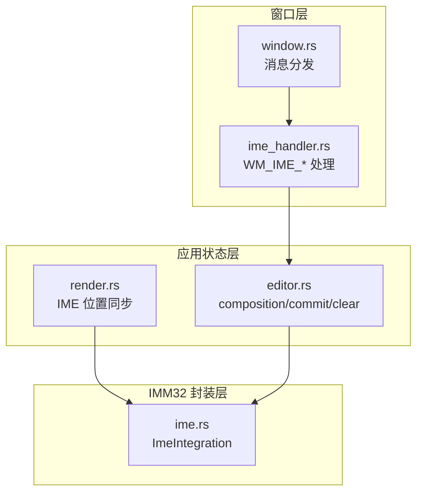
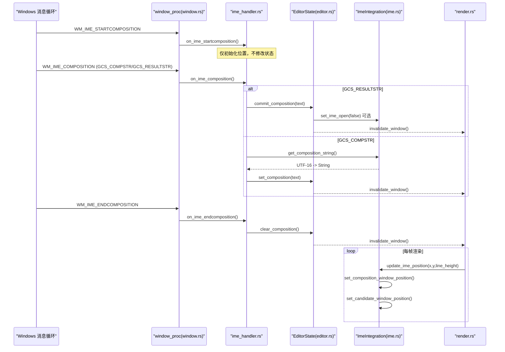
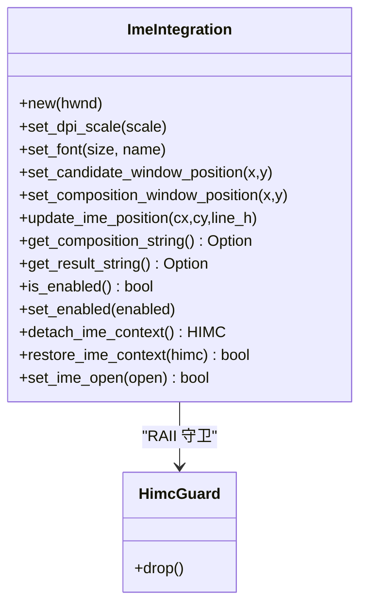
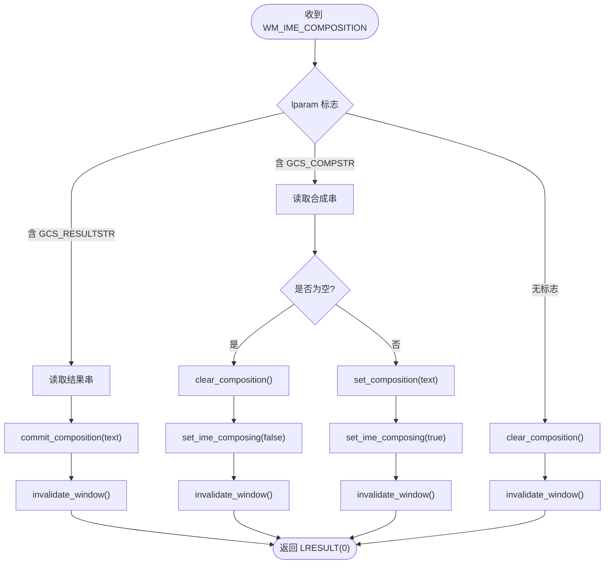
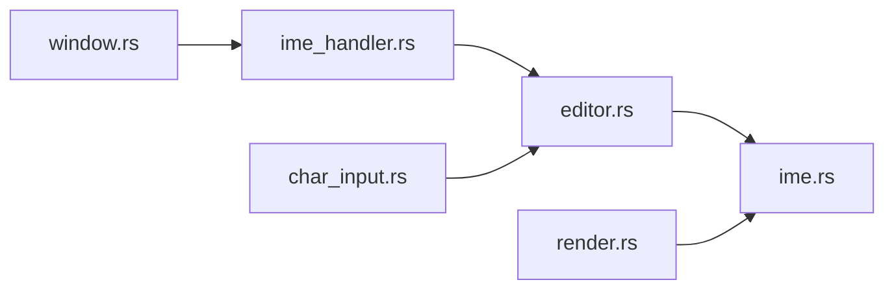

# 输入法集成

<cite>
**本文引用的文件**   
- [ime.rs](file://crates/aether-win32/src/ime.rs)
- [ime_handler.rs](file://crates/aether-win32/src/window/ime_handler.rs)
- [window.rs](file://crates/aether-win32/src/window.rs)
- [editor.rs](file://crates/aether-win32/src/editor.rs)
- [render.rs](file://crates/aether-win32/src/render.rs)
- [char_input.rs](file://crates/aether-win32/src/window/keyboard_handler/char_input.rs)
</cite>

## 目录
1. [简介](#简介)
2. [项目结构](#项目结构)
3. [核心组件](#核心组件)
4. [架构总览](#架构总览)
5. [详细组件分析](#详细组件分析)
6. [依赖关系分析](#依赖关系分析)
7. [性能与多字节字符处理](#性能与多字节字符处理)
8. [错误处理与兼容性](#错误处理与兼容性)
9. [故障排查指南](#故障排查指南)
10. [结论](#结论)

## 简介
本文件面向“牧羊人编辑器”的 Windows 输入法（IME）集成系统，系统性阐述以下主题：
- Windows IME API 的使用方式与中文输入处理机制
- 输入法状态管理：激活、候选窗口显示、预编辑区域（合成串）处理
- 多字节字符与 Unicode 编码支持（UTF-16 到 Rust String）
- 输入法与文本缓冲区的同步机制：增量更新、撤销重做兼容
- 错误处理与跨版本兼容性考虑
- 结合仓库源码的具体实现路径与调用序列，帮助读者快速定位与扩展

## 项目结构
IME 相关代码主要分布在 aether-win32 crate 中，围绕“消息路由—状态管理—渲染同步—底层 API 封装”分层组织：
- 窗口消息路由：window.rs 将 WM_IME_* 消息分发到 ime_handler.rs
- 输入法状态与业务逻辑：editor.rs 维护 composition 状态、提交与清除策略
- 渲染同步：render.rs 在绘制时更新 IME 候选/合成窗口位置
- IMM32 封装：ime.rs 提供对 ImmGetCompositionStringW、ImmSetCandidateWindow、ImmSetCompositionWindow 等 API 的安全封装



图表来源
- [window.rs:342-345](file://crates/aether-win32/src/window.rs#L342-L345)
- [ime_handler.rs:1-132](file://crates/aether-win32/src/window/ime_handler.rs#L1-L132)
- [editor.rs:4730-4846](file://crates/aether-win32/src/editor.rs#L4730-L4846)
- [render.rs:10537-10561](file://crates/aether-win32/src/render.rs#L10537-L10561)
- [ime.rs:1-255](file://crates/aether-win32/src/ime.rs#L1-L255)

章节来源
- [window.rs:342-345](file://crates/aether-win32/src/window.rs#L342-L345)
- [ime_handler.rs:1-132](file://crates/aether-win32/src/window/ime_handler.rs#L1-L132)
- [editor.rs:4730-4846](file://crates/aether-win32/src/editor.rs#L4730-L4846)
- [render.rs:10537-10561](file://crates/aether-win32/src/render.rs#L10537-L10561)
- [ime.rs:1-255](file://crates/aether-win32/src/ime.rs#L1-L255)

## 核心组件
- ImeIntegration（IMM32 封装）
  - 负责获取/释放 HIMC、读取合成串与结果串、设置候选/合成窗口位置、控制 IME 开启状态、临时解关联上下文以旁路系统级拦截。
- 窗口消息处理器（ime_handler.rs）
  - 处理 WM_IME_STARTCOMPOSITION、WM_IME_COMPOSITION、WM_IME_ENDCOMPOSITION、WM_IME_CHAR，协调 EditorState 的合成/提交/清除流程。
- EditorState（编辑器状态）
  - 维护 composition 字段、文件树内联输入的 composition、终端聚焦时的 IME 旁路策略、提交文本的路由（终端 vs 编辑器）。
- 渲染器（render.rs）
  - 在绘制阶段根据光标位置与行高计算物理像素坐标，调用 ImeIntegration 更新候选/合成窗口位置。

章节来源
- [ime.rs:25-243](file://crates/aether-win32/src/ime.rs#L25-L243)
- [ime_handler.rs:9-132](file://crates/aether-win32/src/window/ime_handler.rs#L9-L132)
- [editor.rs:4730-4846](file://crates/aether-win32/src/editor.rs#L4730-L4846)
- [render.rs:10537-10561](file://crates/aether-win32/src/render.rs#L10537-L10561)

## 架构总览
下图展示从用户按键到最终落盘的关键路径，包括 IME 合成期与提交期的分流处理。



图表来源
- [window.rs:342-345](file://crates/aether-win32/src/window.rs#L342-L345)
- [ime_handler.rs:21-118](file://crates/aether-win32/src/window/ime_handler.rs#L21-L118)
- [editor.rs:4730-4846](file://crates/aether-win32/src/editor.rs#L4730-L4846)
- [ime.rs:63-134](file://crates/aether-win32/src/ime.rs#L63-L134)
- [render.rs:10537-10561](file://crates/aether-win32/src/render.rs#L10537-L10561)

## 详细组件分析

### 组件 A：ImeIntegration（IMM32 封装）
职责
- 通过 ImmGetContext/ImmReleaseContext 安全获取/释放 HIMC
- 使用 ImmGetCompositionStringW 读取合成串与结果串（UTF-16），并转换为 Rust String
- 使用 ImmSetCandidateWindow/ImmSetCompositionWindow 设置候选/合成窗口位置
- 使用 ImmSetOpenStatus 切换 IME 是否拦截按键
- 使用 ImmAssociateContext 临时解关联上下文，用于终端场景彻底旁路 IME

关键设计点
- RAII 守卫 HimcGuard 确保作用域退出时释放 HIMC，避免泄漏
- DPI 缩放：基础尺寸按 dpi_scale 换算为物理像素，保证高 DPI 下可读
- 字体信息保留：font_size/font_name 便于后续匹配合成窗口字体（当前未直接设置，预留接口）



图表来源
- [ime.rs:25-243](file://crates/aether-win32/src/ime.rs#L25-L243)

章节来源
- [ime.rs:1-255](file://crates/aether-win32/src/ime.rs#L1-L255)

### 组件 B：IME 消息处理（ime_handler.rs）
职责
- 处理 WM_IME_STARTCOMPOSITION：仅做位置初始化
- 处理 WM_IME_COMPOSITION：优先处理结果串（提交），再处理合成串（预编辑）
- 处理 WM_IME_ENDCOMPOSITION：清理合成串显示，必要时关闭 IME
- 处理 WM_IME_CHAR：阻止 TranslateMessage 重复产生 WM_CHAR，避免重复插入

关键流程
- 进入合成期：set_composition(text)，通知键盘钩子进入合成期
- 提交完成：commit_composition(text)，清空合成串，触发重绘
- 结束合成：clear_composition()，必要时 set_ime_open(false)



图表来源
- [ime_handler.rs:21-93](file://crates/aether-win32/src/window/ime_handler.rs#L21-L93)

章节来源
- [ime_handler.rs:1-132](file://crates/aether-win32/src/window/ime_handler.rs#L1-L132)

### 组件 C：编辑器状态与缓冲区同步（editor.rs）
职责
- 维护 composition 字段与文件树内联输入的 composition
- 提交合成串：区分终端聚焦与非终端聚焦，分别路由到 ConPTY 或编辑器内容
- 清除合成串：统一清理，并在需要时标记脏区域触发局部重绘
- 终端 IME 旁路：set_terminal_ime_bypass 配合低层键盘钩子，解决 Backspace 被 IME 拦截的问题

关键点
- 终端聚焦且运行时：IME 提交文本逐字符送入终端面板，随后立即关闭 IME，使 Backspace 可删除刚提交的汉字
- 非终端聚焦：逐字符广播插入，走编辑器历史与撤销重做体系
- 文件树内联输入：合成串与提交均写入输入框而非主编辑器

```mermaid
sequenceDiagram
participant IH as "ime_handler.rs"
participant ES as "EditorState(editor.rs)"
participant Term as "TerminalPanel"
participant Buff as "Buffer/History"
IH->>ES : commit_composition(text)
alt 终端聚焦且运行中
ES->>Term : send_char(ch) for ch in text
ES->>ES : set_ime_open(false)
else 文件树内联输入
ES->>ES : input.value += text; composition=None
ES->>ES : mark_dirty(sidebar region)
else 普通编辑器
ES->>Buff : broadcast_insert_char(ch) for ch in text
ES->>ES : history.record(...)
end
ES-->>IH : invalidate_window()
```

图表来源
- [editor.rs:4784-4826](file://crates/aether-win32/src/editor.rs#L4784-L4826)
- [ime_handler.rs:34-54](file://crates/aether-win32/src/window/ime_handler.rs#L34-L54)

章节来源
- [editor.rs:4730-4846](file://crates/aether-win32/src/editor.rs#L4730-L4846)

### 组件 D：渲染与 IME 位置同步（render.rs）
职责
- 在绘制阶段计算光标所在位置的物理像素坐标
- 调用 ImeIntegration 设置合成窗口与候选窗口位置，使其跟随光标移动

要点
- 坐标转换：逻辑像素 × dpi_scale → 物理像素
- 行高参与：候选窗口位于光标底部附近，避免遮挡

章节来源
- [render.rs:10537-10561](file://crates/aether-win32/src/render.rs#L10537-L10561)

## 依赖关系分析
- window.rs 作为消息入口，将 WM_IME_* 分派到 ime_handler.rs
- ime_handler.rs 通过 EDITOR_STATE thread_local 访问 EditorState，调用其 composition 相关方法
- editor.rs 内部持有 ImeIntegration 实例，进行 IMM32 交互
- render.rs 在绘制时调用 ImeIntegration 更新位置
- char_input.rs 在 WM_CHAR 路径中检测 IME 合成期，避免重复插入



图表来源
- [window.rs:342-345](file://crates/aether-win32/src/window.rs#L342-L345)
- [ime_handler.rs:1-132](file://crates/aether-win32/src/window/ime_handler.rs#L1-L132)
- [editor.rs:4730-4846](file://crates/aether-win32/src/editor.rs#L4730-L4846)
- [ime.rs:1-255](file://crates/aether-win32/src/ime.rs#L1-L255)
- [char_input.rs:24-52](file://crates/aether-win32/src/window/keyboard_handler/char_input.rs#L24-L52)

章节来源
- [window.rs:342-345](file://crates/aether-win32/src/window.rs#L342-L345)
- [ime_handler.rs:1-132](file://crates/aether-win32/src/window/ime_handler.rs#L1-L132)
- [editor.rs:4730-4846](file://crates/aether-win32/src/editor.rs#L4730-L4846)
- [ime.rs:1-255](file://crates/aether-win32/src/ime.rs#L1-L255)
- [char_input.rs:24-52](file://crates/aether-win32/src/window/keyboard_handler/char_input.rs#L24-L52)

## 性能与多字节字符处理
- 多字节与 Unicode
  - IMM32 返回 UTF-16 数据，ime.rs 通过两次调用 ImmGetCompositionStringW 先获取长度再填充缓冲区，最后用 from_utf16 转为 Rust String，正确处理代理对与多码位字符。
  - 渲染侧在计算前缀宽度时采用 encode_utf16 统计 UTF-16 长度，保证 IME 位置与字形宽度一致。
- 增量更新
  - 合成期仅更新 composition 显示，不修改 buffer；提交时才批量插入字符，减少频繁全量重绘。
  - 使用 invalidate_window 合并多次无效区域，交由 WM_PAINT 统一渲染，降低抖动。
- 撤销重做兼容
  - 提交路径走 broadcast_insert_char，内部记录历史操作（OpType::Insert），天然支持撤销重做。
- 性能建议
  - 保持 IME 位置更新仅在必要时机（光标移动、滚动变化）触发，避免每帧高频调用
  - 合理设置候选/合成窗口 rcArea 尺寸，避免过大导致系统绘制开销增加

章节来源
- [ime.rs:148-196](file://crates/aether-win32/src/ime.rs#L148-L196)
- [render.rs:10537-10561](file://crates/aether-win32/src/render.rs#L10537-L10561)
- [editor.rs:4784-4826](file://crates/aether-win32/src/editor.rs#L4784-L4826)

## 错误处理与兼容性
- 资源释放
  - HimcGuard 在 Drop 中调用 ImmReleaseContext，确保异常路径也能正确释放 HIMC。
- 返回值检查
  - ImmGetCompositionStringW 返回长度/写入数 <= 0 时直接返回 None，避免越界读取。
- 兼容性与差异
  - 终端聚焦时通过 ImmAssociateContext 解关联上下文，彻底旁路 IME 的系统级拦截，解决不同 IME 在“已开启未合成”状态下拦截 Backspace 的差异行为。
  - 提交完成后立即 set_ime_open(false)，提升删除体验一致性。
- FFI 边界稳定性
  - window_proc 使用 catch_unwind 包裹，防止 panic 穿越 FFI 边界导致进程崩溃。

章节来源
- [ime.rs:245-254](file://crates/aether-win32/src/ime.rs#L245-L254)
- [ime.rs:148-196](file://crates/aether-win32/src/ime.rs#L148-L196)
- [ime.rs:208-242](file://crates/aether-win32/src/ime.rs#L208-L242)
- [window.rs:354-372](file://crates/aether-win32/src/window.rs#L354-L372)

## 故障排查指南
- 症状：中文输入后无法立即用 Backspace 删除
  - 原因：IME 处于“已开启未合成”状态拦截了 Backspace
  - 处理：确认 commit_composition 后是否调用了 set_ime_open(false)；终端聚焦时是否使用了 set_terminal_ime_bypass
  - 参考路径
    - [editor.rs:4784-4826](file://crates/aether-win32/src/editor.rs#L4784-L4826)
    - [ime.rs:228-242](file://crates/aether-win32/src/ime.rs#L228-L242)
- 症状：候选窗口位置不正确或遮挡光标
  - 原因：坐标未转换为物理像素或行高计算有误
  - 处理：检查 render.rs 中的逻辑像素到物理像素转换与 line_height 使用
  - 参考路径
    - [render.rs:10537-10561](file://crates/aether-win32/src/render.rs#L10537-L10561)
- 症状：IME 合成串为空但界面仍显示下划线
  - 原因：未正确清理 composition 或未触发重绘
  - 处理：确认 WM_IME_COMPOSITION 无标志分支是否调用 clear_composition 与 invalidate_window
  - 参考路径
    - [ime_handler.rs:85-93](file://crates/aether-win32/src/window/ime_handler.rs#L85-L93)
- 症状：WM_CHAR 重复插入字符
  - 原因：TranslateMessage 从 WM_IME_CHAR 生成 WM_CHAR
  - 处理：确认 on_ime_char 返回 LRESULT(0) 阻止默认处理
  - 参考路径
    - [ime_handler.rs:120-132](file://crates/aether-win32/src/window/ime_handler.rs#L120-L132)
    - [char_input.rs:24-52](file://crates/aether-win32/src/window/keyboard_handler/char_input.rs#L24-L52)

## 结论
本项目通过清晰的分层设计与稳健的错误处理，实现了流畅的中文输入体验：
- 消息路由与状态管理分离，合成期与提交期分流明确
- IMM32 封装安全、可靠，兼顾高 DPI 与多语言 IME
- 渲染与输入同步良好，支持撤销重做与增量更新
- 针对终端场景的 IME 旁路与即时关闭策略，显著改善删除体验