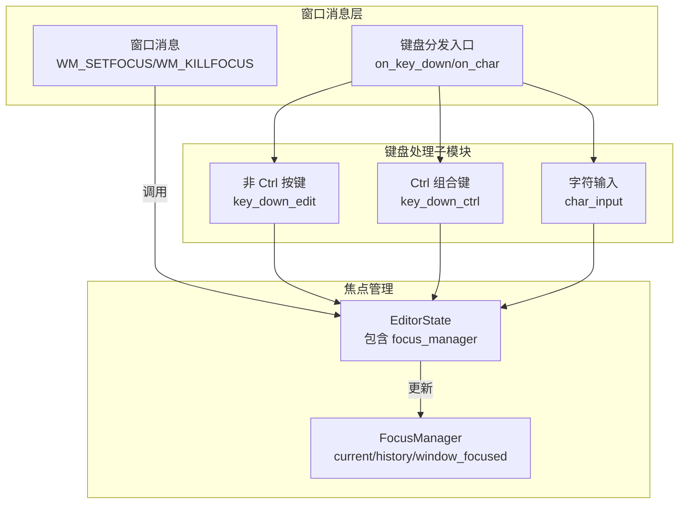
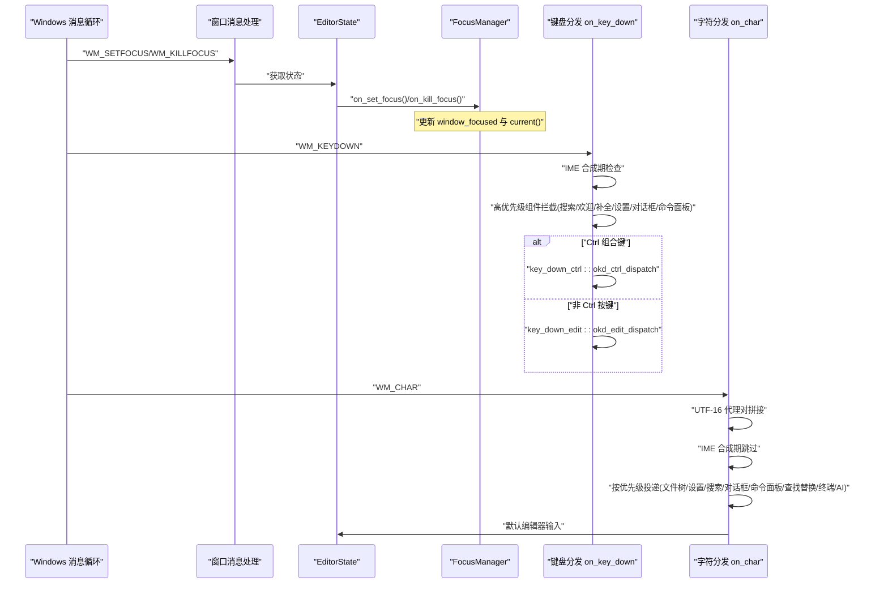
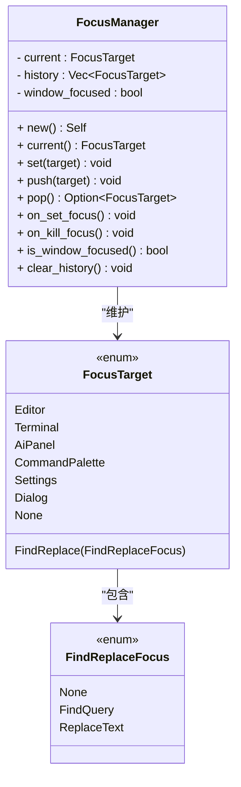
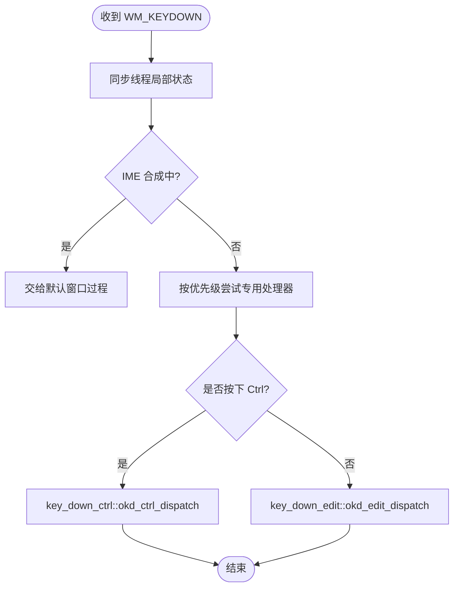
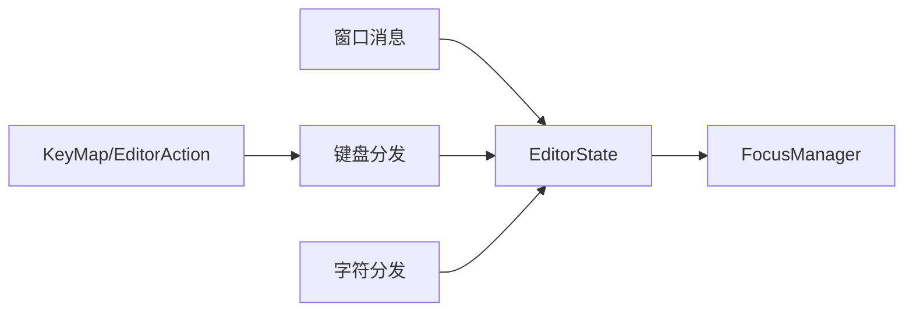

# 输入焦点管理

<cite>
**本文引用的文件**   
- [focus_manager.rs](file://crates/aether-win32/src/focus_manager.rs)
- [window_messages.rs](file://crates/aether-win32/src/window/window_messages.rs)
- [keyboard_handler.rs](file://crates/aether-win32/src/window/keyboard_handler.rs)
- [key_down.rs](file://crates/aether-win32/src/window/keyboard_handler/key_down.rs)
- [key_down_ctrl.rs](file://crates/aether-win32/src/window/keyboard_handler/key_down_ctrl.rs)
- [key_down_edit.rs](file://crates/aether-win32/src/window/keyboard_handler/key_down_edit.rs)
- [char_input.rs](file://crates/aether-win32/src/window/keyboard_handler/char_input.rs)
- [input.rs](file://crates/aether-win32/src/input.rs)
- [editor.rs](file://crates/aether-win32/src/editor.rs)
</cite>

## 目录
1. [简介](#简介)
2. [项目结构](#项目结构)
3. [核心组件](#核心组件)
4. [架构总览](#架构总览)
5. [详细组件分析](#详细组件分析)
6. [依赖关系分析](#依赖关系分析)
7. [性能考虑](#性能考虑)
8. [故障排查指南](#故障排查指南)
9. [结论](#结论)
10. [附录：使用场景与最佳实践](#附录使用场景与最佳实践)

## 简介
本文件系统性梳理牧羊人编辑器的“输入焦点管理”机制，覆盖焦点容器层次、焦点传播规则、不同 UI 组件（编辑器、面板、对话框、工具栏）的焦点切换策略、视觉反馈实现方式、焦点陷阱与循环焦点处理，以及键盘导航支持。文档同时给出关键流程的时序图与流程图，并提供最佳实践与性能优化建议，帮助读者快速理解并正确使用该子系统。

## 项目结构
焦点管理相关代码主要分布在以下模块：
- 窗口消息层：负责 WM_SETFOCUS / WM_KILLFOCUS 等系统消息到应用状态桥接
- 键盘事件分发层：WM_KEYDOWN / WM_CHAR 的高优先级路由与消费
- 统一焦点管理器：维护当前焦点目标与历史栈，提供 push/pop/set/current 等能力
- 编辑器状态：持有 FocusManager 实例，并在多处交互中更新焦点状态
- 快捷键映射：定义 KeyMap 与 EditorAction，为后续可配置快捷键预留接口

图表来源
- [window_messages.rs:516-564](file://crates/aether-win32/src/window/window_messages.rs#L516-L564)
- [keyboard_handler.rs:1-13](file://crates/aether-win32/src/window/keyboard_handler.rs#L1-L13)
- [key_down.rs:17-117](file://crates/aether-win32/src/window/keyboard_handler/key_down.rs#L17-L117)
- [key_down_ctrl.rs:14-28](file://crates/aether-win32/src/window/keyboard_handler/key_down_ctrl.rs#L14-L28)
- [char_input.rs:10-90](file://crates/aether-win32/src/window/keyboard_handler/char_input.rs#L10-L90)
- [focus_manager.rs:40-122](file://crates/aether-win32/src/focus_manager.rs#L40-L122)
- [editor.rs:391-391](file://crates/aether-win32/src/editor.rs#L391-L391)

章节来源
- [window_messages.rs:516-564](file://crates/aether-win32/src/window/window_messages.rs#L516-L564)
- [keyboard_handler.rs:1-13](file://crates/aether-win32/src/window/keyboard_handler.rs#L1-L13)
- [focus_manager.rs:40-122](file://crates/aether-win32/src/focus_manager.rs#L40-L122)
- [editor.rs:391-391](file://crates/aether-win32/src/editor.rs#L391-L391)

## 核心组件
- 统一焦点管理器 FocusManager
  - 维护当前焦点目标 current、历史栈 history、窗口是否拥有焦点 window_focused
  - 提供 set/push/pop/current/is_window_focused/clear_history 等方法
  - 在窗口获得/失去焦点时通过 on_set_focus/on_kill_focus 同步状态
- 焦点目标枚举 FocusTarget
  - 包括编辑器、终端、AI 面板、查找替换（含子焦点）、命令面板、设置、对话框、无焦点等
- 查找替换内部焦点 FindReplaceFocus
  - None / FindQuery / ReplaceText，用于在查找框与替换框之间切换
- 键盘事件分发器
  - on_key_down：按优先级拦截并路由到各子处理器（搜索面板、欢迎页、补全、设置字段、SSH/克隆对话框、命令面板等），再区分 Ctrl 与非 Ctrl 分支
  - on_char：按优先级将字符投递到文件树输入、设置字段、搜索面板、SSH/克隆对话框、新建项目、SSH 管理、命令面板、查找替换、终端、AI 面板，最终回落到编辑器默认
- 编辑器状态 EditorState
  - 持有 FocusManager 实例，并在多处交互中更新焦点状态（如打开/关闭查找替换、切换终端面板、命令面板显示等）

章节来源
- [focus_manager.rs:10-122](file://crates/aether-win32/src/focus_manager.rs#L10-L122)
- [key_down.rs:17-117](file://crates/aether-win32/src/window/keyboard_handler/key_down.rs#L17-L117)
- [char_input.rs:10-90](file://crates/aether-win32/src/window/keyboard_handler/char_input.rs#L10-L90)
- [editor.rs:391-391](file://crates/aether-win32/src/editor.rs#L391-L391)

## 架构总览
焦点管理的整体流程如下：
- 窗口级焦点变化由 WM_SETFOCUS / WM_KILLFOCUS 触发，调用 EditorState.focus_manager.on_set_focus/on_kill_focus，从而控制 current() 返回 None 或真实目标
- 键盘输入进入后，先进行 IME 合成期判断；随后按高优先级顺序尝试各 UI 组件的专用处理器；若未命中，则进入 Ctrl 或非 Ctrl 分支；最终落入编辑器默认逻辑
- 字符输入同理，按优先级依次投递至各输入目标，最后回落到编辑器

图表来源
- [window_messages.rs:516-564](file://crates/aether-win32/src/window/window_messages.rs#L516-L564)
- [key_down.rs:17-117](file://crates/aether-win32/src/window/keyboard_handler/key_down.rs#L17-L117)
- [key_down_ctrl.rs:14-28](file://crates/aether-win32/src/window/keyboard_handler/key_down_ctrl.rs#L14-L28)
- [key_down_edit.rs:13-55](file://crates/aether-win32/src/window/keyboard_handler/key_down_edit.rs#L13-L55)
- [char_input.rs:10-90](file://crates/aether-win32/src/window/keyboard_handler/char_input.rs#L10-L90)

## 详细组件分析

### 焦点管理器 FocusManager
- 职责
  - 维护当前焦点目标与历史栈，支持 push/pop/set/current
  - 响应窗口级焦点变化，保证 current() 在窗口失焦时返回 None
- 数据结构
  - current: FocusTarget
  - history: Vec<FocusTarget>
  - window_focused: bool
- 关键行为
  - push：保存当前焦点到历史栈并切换到新目标
  - pop：恢复到上一个焦点；若历史为空则回退到编辑器
  - on_set_focus/on_kill_focus：标记窗口是否拥有焦点
- 复杂度
  - push/pop/current 均为 O(1)
  - 空间复杂度 O(n)，n 为历史深度（默认容量 8）

图表来源
- [focus_manager.rs:10-122](file://crates/aether-win32/src/focus_manager.rs#L10-L122)

章节来源
- [focus_manager.rs:10-122](file://crates/aether-win32/src/focus_manager.rs#L10-L122)

### 键盘事件分发与焦点传播
- 入口函数 on_key_down
  - 首先同步 thread_local 状态，避免 Alt+Tab 后路由错窗口
  - IME 合成期间直接交给系统默认过程，确保输入法候选更新正常
  - 按优先级尝试多个专用处理器：文件树输入、资源管理器上下文菜单、标签右键菜单、活动栏右键菜单、自定义模式退出、全局搜索面板、欢迎页导航、补全弹窗、设置字段、SSH/克隆对话框、SSH 管理、命令面板
  - Ctrl 组合键走 key_down_ctrl 分支；否则走 key_down_edit 分支
- 非 Ctrl 分支 okd_edit_dispatch
  - 终端聚焦时将按键转换为 ANSI 序列发送到 ConPTY
  - 回车/退格/删除/F3/Esc/方向/Home/End/PageUp/Down/Tab 分别交由对应处理函数
  - Tab 键在查找面板激活时在查找/替换框间切换；否则接受内联补全或插入制表符
- Ctrl 分支 okd_ctrl_dispatch
  - 文件操作、视图切换（侧栏/底部面板/命令面板）、字体缩放、剪贴板、查找/替换/撤销重做、标签页切换、词级移动、列光标等
- 字符输入 on_char
  - 处理 UTF-16 代理对以支持 BMP 外字符
  - IME 合成期间跳过原始字符分发
  - 按优先级投递到文件树输入、设置字段、搜索面板、SSH/克隆对话框、新建项目、SSH 管理、命令面板、查找替换、终端、AI 面板，最终回落到编辑器默认

图表来源
- [key_down.rs:17-117](file://crates/aether-win32/src/window/keyboard_handler/key_down.rs#L17-L117)
- [key_down_edit.rs:13-55](file://crates/aether-win32/src/window/keyboard_handler/key_down_edit.rs#L13-L55)
- [key_down_ctrl.rs:14-28](file://crates/aether-win32/src/window/keyboard_handler/key_down_ctrl.rs#L14-L28)

章节来源
- [key_down.rs:17-117](file://crates/aether-win32/src/window/keyboard_handler/key_down.rs#L17-L117)
- [key_down_edit.rs:13-55](file://crates/aether-win32/src/window/keyboard_handler/key_down_edit.rs#L13-L55)
- [key_down_ctrl.rs:14-28](file://crates/aether-win32/src/window/keyboard_handler/key_down_ctrl.rs#L14-L28)
- [char_input.rs:10-90](file://crates/aether-win32/src/window/keyboard_handler/char_input.rs#L10-L90)

### 窗口级焦点消息与自动保存
- WM_SETFOCUS
  - 调用 focus_manager.on_set_focus()，恢复窗口拥有焦点标志
- WM_KILLFOCUS
  - 调用 focus_manager.on_kill_focus()，使 current() 返回 None
  - 同时触发自动保存（autosave_on_focus_loss），在用户离开编辑场景的瞬间落盘
  - 使用 try_borrow_mut 防止模态对话框消息循环重入导致的 panic

章节来源
- [window_messages.rs:516-564](file://crates/aether-win32/src/window/window_messages.rs#L516-L564)

### 查找替换面板的焦点与键盘导航
- 焦点状态
  - find_visible 与 find_focus 共同决定查找面板是否处于激活状态
  - find_focus 为 FindQuery 或 ReplaceText 时，回车/退格/Tab 等行为分别由相应处理器处理
- 键盘行为
  - Enter：在查找框执行“下一个”，在替换框执行“替换当前并下一个”
  - Backspace：根据当前焦点更新查询或替换文本
  - Tab：在查找/替换框之间循环切换
  - Escape：关闭查找替换面板

章节来源
- [key_down_edit.rs:158-238](file://crates/aether-win32/src/window/keyboard_handler/key_down_edit.rs#L158-L238)
- [key_down_edit.rs:240-308](file://crates/aether-win32/src/window/keyboard_handler/key_down_edit.rs#L240-L308)
- [key_down_edit.rs:536-591](file://crates/aether-win32/src/window/keyboard_handler/key_down_edit.rs#L536-L591)
- [char_input.rs:313-354](file://crates/aether-win32/src/window/keyboard_handler/char_input.rs#L313-L354)

### 终端面板的焦点与输入转发
- 终端聚焦时，非 Ctrl 按键会转换为 ANSI 序列发送到 ConPTY（Enter/Backspace/Delete/Tab/方向键/Home/End）
- Ctrl+C 中断子进程；Ctrl+L 发送 Form Feed 清屏；Ctrl+V 粘贴到终端
- 打开终端面板时自动聚焦并启动 shell，同时启用周期刷新定时器以显示异步输出

章节来源
- [key_down_edit.rs:57-151](file://crates/aether-win32/src/window/keyboard_handler/key_down_edit.rs#L57-L151)
- [key_down_ctrl.rs:30-50](file://crates/aether-win32/src/window/keyboard_handler/key_down_ctrl.rs#L30-L50)
- [key_down_ctrl.rs:325-403](file://crates/aether-win32/src/window/keyboard_handler/key_down_ctrl.rs#L325-L403)
- [key_down_ctrl.rs:165-198](file://crates/aether-win32/src/window/keyboard_handler/key_down_ctrl.rs#L165-L198)

### 命令面板与设置字段的焦点处理
- 命令面板
  - Ctrl+Shift+P 打开并预置 “>” 前缀；Ctrl+P 也打开命令面板
  - 字符输入进入搜索框，Esc 关闭
- 设置字段
  - active_field 存在时，Tab/Shift+Tab 在字段间切换；Enter/Escape 退出编辑；Backspace/Delete 修改内容
  - 下拉框打开时支持 Up/Down 选择、Enter 确认、Escape 关闭

章节来源
- [key_down_ctrl.rs:144-163](file://crates/aether-win32/src/window/keyboard_handler/key_down_ctrl.rs#L144-L163)
- [key_down_ctrl.rs:200-260](file://crates/aether-win32/src/window/keyboard_handler/key_down_ctrl.rs#L200-L260)
- [key_down.rs:513-669](file://crates/aether-win32/src/window/keyboard_handler/key_down.rs#L513-L669)
- [char_input.rs:126-170](file://crates/aether-win32/src/window/keyboard_handler/char_input.rs#L126-L170)
- [char_input.rs:292-311](file://crates/aether-win32/src/window/keyboard_handler/char_input.rs#L292-L311)

### 对话框（SSH/克隆/新建项目）的焦点处理
- SSH 对话框
  - Enter 发起连接（后台线程），Esc 关闭，Tab 切换字段，Backspace/Ctrl+V 支持编辑
- 克隆对话框
  - 激活时优先处理键盘输入，Esc 关闭
- 新建项目对话框
  - 字符输入进入项目名称，Enter 确认，Esc 取消

章节来源
- [key_down.rs:723-789](file://crates/aether-win32/src/window/keyboard_handler/key_down.rs#L723-L789)
- [key_down.rs:791-800](file://crates/aether-win32/src/window/keyboard_handler/key_down.rs#L791-L800)
- [char_input.rs:193-255](file://crates/aether-win32/src/window/keyboard_handler/char_input.rs#L193-L255)

### 快捷键映射与动作
- KeyMap 定义了常用快捷键到 EditorAction 的映射，包括文件操作、编辑操作、视图操作、多光标、AI 触发等
- 当前快捷键硬编码在 window 层，接入 KeyMap 后可支持用户自定义快捷键

章节来源
- [input.rs:119-244](file://crates/aether-win32/src/input.rs#L119-L244)

## 依赖关系分析
- 窗口消息层依赖 EditorState 以访问 focus_manager 和 UI 状态
- 键盘分发层依赖 EDITOR_STATE 全局状态与各子模块（搜索面板、命令面板、终端、AI 面板等）
- FocusManager 被 EditorState 持有，并通过窗口消息回调更新
- 快捷键映射 input.rs 为未来可配置快捷键提供基础类型与动作枚举

图表来源
- [window_messages.rs:516-564](file://crates/aether-win32/src/window/window_messages.rs#L516-L564)
- [key_down.rs:17-117](file://crates/aether-win32/src/window/keyboard_handler/key_down.rs#L17-L117)
- [char_input.rs:10-90](file://crates/aether-win32/src/window/keyboard_handler/char_input.rs#L10-L90)
- [input.rs:119-244](file://crates/aether-win32/src/input.rs#L119-L244)

章节来源
- [window_messages.rs:516-564](file://crates/aether-win32/src/window/window_messages.rs#L516-L564)
- [key_down.rs:17-117](file://crates/aether-win32/src/window/keyboard_handler/key_down.rs#L17-L117)
- [char_input.rs:10-90](file://crates/aether-win32/src/window/keyboard_handler/char_input.rs#L10-L90)
- [input.rs:119-244](file://crates/aether-win32/src/input.rs#L119-L244)

## 性能考虑
- 键盘分发采用“短路优先”策略，首个匹配的处理器即消费消息，减少不必要的遍历
- 终端刷新使用定时器仅在底部面板可见时运行，避免空转
- 渲染路径使用 catch_unwind 捕获 D2D 设备丢失异常，避免崩溃与重复绘制
- 字符输入对 UTF-16 代理对的拼接与 IME 合成期的跳过，避免重复插入与错误字符

[本节为通用性能讨论，不直接分析具体文件]

## 故障排查指南
- 模态对话框导致焦点消息重入
  - 现象：关闭标签页弹出确认对话框时，WM_KILLFOCUS 可能重入导致 panic
  - 解决：窗口消息处理中使用 try_borrow_mut 优雅跳过借用冲突
- IME 合成期按键丢失
  - 现象：中文输入法候选更新异常
  - 解决：IME 合成期间将按键交给默认窗口过程，避免拦截
- 终端输入无效
  - 现象：终端模式下按键未生效
  - 排查：确认 terminal_panel.focused 是否为真；检查 ANSI 序列发送路径

章节来源
- [window_messages.rs:544-564](file://crates/aether-win32/src/window/window_messages.rs#L544-L564)
- [key_down.rs:25-36](file://crates/aether-win32/src/window/keyboard_handler/key_down.rs#L25-L36)
- [key_down_edit.rs:27-43](file://crates/aether-win32/src/window/keyboard_handler/key_down_edit.rs#L27-L43)

## 结论
牧羊人编辑器的输入焦点管理通过“窗口级焦点状态 + 键盘事件高优先级分发 + 统一焦点管理器”的组合，实现了清晰、可扩展且健壮的焦点传播机制。查找替换、终端、命令面板、设置字段与各类对话框均具备完善的键盘导航与焦点切换支持。结合自动保存与 IME 兼容处理，系统在易用性与稳定性方面表现良好。

[本节为总结性内容，不直接分析具体文件]

## 附录：使用场景与最佳实践

### 模态对话框的焦点处理
- 打开对话框时，键盘输入应优先路由到对话框字段；Esc 关闭对话框并恢复之前焦点
- 使用 try_borrow_mut 避免模态消息循环重入导致的借用冲突

章节来源
- [window_messages.rs:544-564](file://crates/aether-win32/src/window/window_messages.rs#L544-L564)
- [key_down.rs:723-789](file://crates/aether-win32/src/window/keyboard_handler/key_down.rs#L723-L789)

### 自动焦点设置
- 打开终端面板时自动聚焦并启动 shell，同时启用刷新定时器
- 打开命令面板时可预置查询前缀（如 “>”）

章节来源
- [key_down_ctrl.rs:165-198](file://crates/aether-win32/src/window/keyboard_handler/key_down_ctrl.rs#L165-L198)
- [key_down_ctrl.rs:144-163](file://crates/aether-win32/src/window/keyboard_handler/key_down_ctrl.rs#L144-L163)

### 键盘导航支持
- 查找替换：Tab 在查找/替换框间循环；Enter 执行查找/替换；Esc 关闭
- 设置字段：Tab/Shift+Tab 切换字段；Enter/Escape 退出编辑；Up/Down 选择下拉项
- 终端：方向键/Home/End 等转换为 ANSI 序列；Ctrl+C 中断；Ctrl+L 清屏

章节来源
- [key_down_edit.rs:536-591](file://crates/aether-win32/src/window/keyboard_handler/key_down_edit.rs#L536-L591)
- [key_down.rs:513-669](file://crates/aether-win32/src/window/keyboard_handler/key_down.rs#L513-L669)
- [key_down_edit.rs:57-151](file://crates/aether-win32/src/window/keyboard_handler/key_down_edit.rs#L57-L151)
- [key_down_ctrl.rs:30-50](file://crates/aether-win32/src/window/keyboard_handler/key_down_ctrl.rs#L30-L50)

### 焦点样式与视觉反馈
- 当前焦点状态主要通过 UI 重绘与状态变更体现（如查找面板高亮、输入框光标闪烁）
- 光标类型根据鼠标区域动态设置（箭头/工字型/手型/调整大小）

章节来源
- [window_messages.rs:566-592](file://crates/aether-win32/src/window/window_messages.rs#L566-L592)
- [window_messages.rs:81-110](file://crates/aether-win32/src/window/window_messages.rs#L81-L110)

### 焦点陷阱与循环焦点
- 查找替换面板内 Tab 在查找/替换框间循环，形成局部焦点环
- 设置字段与下拉框支持 Up/Down 与 Enter 选择，构成小型焦点环
- 建议在新增复杂交互区域时，明确焦点环边界与 Esc 退出路径，避免焦点逃逸

章节来源
- [key_down_edit.rs:536-591](file://crates/aether-win32/src/window/keyboard_handler/key_down_edit.rs#L536-L591)
- [key_down.rs:513-669](file://crates/aether-win32/src/window/keyboard_handler/key_down.rs#L513-L669)