# 键盘输入处理

<cite>
**本文引用的文件列表**
- [keyboard_hook.rs](file://crates/aether-win32/src/keyboard_hook.rs)
- [keyboard_handler.rs](file://crates/aether-win32/src/window/keyboard_handler.rs)
- [key_down.rs](file://crates/aether-win32/src/window/keyboard_handler/key_down.rs)
- [key_down_ctrl.rs](file://crates/aether-win32/src/window/keyboard_handler/key_down_ctrl.rs)
- [key_down_edit.rs](file://crates/aether-win32/src/window/keyboard_handler/key_down_edit.rs)
- [char_input.rs](file://crates/aether-win32/src/window/keyboard_handler/char_input.rs)
- [ime_handler.rs](file://crates/aether-win32/src/window/ime_handler.rs)
- [input.rs](file://crates/aether-win32/src/input.rs)
- [editor.rs](file://crates/aether-win32/src/editor.rs)
- [text_buffer.rs](file://crates/aether-core/src/buffer/text_buffer.rs)
</cite>

## 目录
1. [简介](#简介)
2. [项目结构](#项目结构)
3. [核心组件](#核心组件)
4. [架构总览](#架构总览)
5. [详细组件分析](#详细组件分析)
6. [依赖关系分析](#依赖关系分析)
7. [性能考量](#性能考量)
8. [故障排查指南](#故障排查指南)
9. [结论](#结论)
10. [附录](#附录)

## 简介
本技术文档聚焦于牧羊人编辑器的键盘输入处理系统，覆盖从系统级键盘钩子到窗口消息分发、字符转换、组合键与快捷键映射、多光标编辑以及 IME 输入法协同等关键路径。目标是帮助开发者理解：
- 虚拟键码到字符的转换机制（含多键盘布局）
- Ctrl/Shift/Alt 组合键的处理逻辑与快捷键映射系统
- KeyMap 结构与动作分发机制
- 多光标编辑的键盘操作实现
- 全局键盘钩子的实现细节与终端 Backspace/Delete/方向键直通方案
- 不同键盘布局与多语言输入的处理模式

## 项目结构
键盘输入相关代码主要分布在 aether-win32 模块中，按职责拆分为低层钩子、窗口消息入口、按键分发器、字符处理器、IME 处理器等。

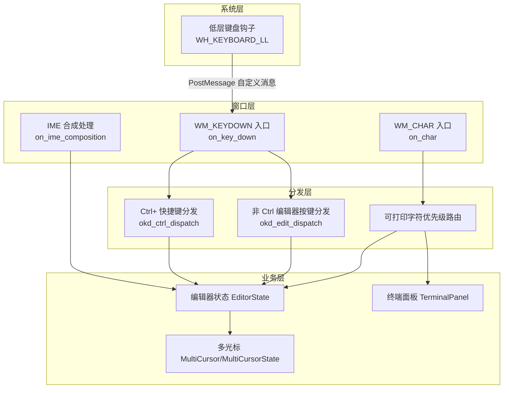

**图表来源**
- [keyboard_hook.rs:151-245](file://crates/aether-win32/src/keyboard_hook.rs#L151-L245)
- [key_down.rs:18-117](file://crates/aether-win32/src/window/keyboard_handler/key_down.rs#L18-L117)
- [char_input.rs:11-90](file://crates/aether-win32/src/window/keyboard_handler/char_input.rs#L11-L90)
- [ime_handler.rs:22-118](file://crates/aether-win32/src/window/ime_handler.rs#L22-L118)
- [key_down_ctrl.rs:15-28](file://crates/aether-win32/src/window/keyboard_handler/key_down_ctrl.rs#L15-L28)
- [key_down_edit.rs:14-55](file://crates/aether-win32/src/window/keyboard_handler/key_down_edit.rs#L14-L55)

**章节来源**
- [keyboard_handler.rs:1-13](file://crates/aether-win32/src/window/keyboard_handler.rs#L1-L13)

## 核心组件
- 低层键盘钩子：在系统级拦截特定编辑键（Backspace/Delete/方向键），绕过 IME 对“已开启未合成”状态的拦截，将事件以自定义消息投递给主窗口，再由主线程写入 ConPTY。
- 窗口消息入口：WM_KEYDOWN 与 WM_CHAR 入口负责同步当前窗口状态、解析修饰键、按优先级分发给各子系统。
- 快捷键映射：KeyMap 提供基于 (Key, ctrl, shift, alt) 的动作查找；实际快捷键逻辑集中在 key_down_ctrl.rs 与 key_down_edit.rs 中。
- 多光标：MultiCursor 与 MultiCursorState 支持添加/删除光标、选择区域、广播插入/删除等操作。
- IME 协同：IME 合成期间不拦截编辑键，提交结果后及时关闭 IME 并允许终端接收 Backspace 等。

**章节来源**
- [keyboard_hook.rs:1-122](file://crates/aether-win32/src/keyboard_hook.rs#L1-L122)
- [input.rs:119-244](file://crates/aether-win32/src/input.rs#L119-L244)
- [key_down_ctrl.rs:15-28](file://crates/aether-win32/src/window/keyboard_handler/key_down_ctrl.rs#L15-L28)
- [key_down_edit.rs:14-55](file://crates/aether-win32/src/window/keyboard_handler/key_down_edit.rs#L14-L55)
- [ime_handler.rs:22-118](file://crates/aether-win32/src/window/ime_handler.rs#L22-L118)
- [text_buffer.rs:174-211](file://crates/aether-core/src/buffer/text_buffer.rs#L174-L211)

## 架构总览
下图展示一次典型键盘输入从系统到应用的全链路流程，包括 IME 合成期与终端聚焦时的特殊处理。

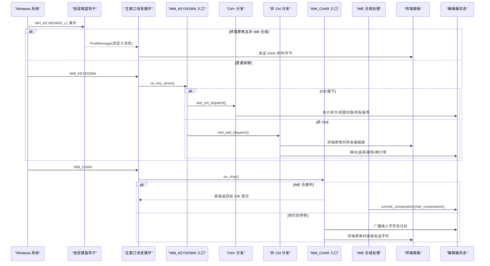

**图表来源**
- [keyboard_hook.rs:151-245](file://crates/aether-win32/src/keyboard_hook.rs#L151-L245)
- [key_down.rs:18-117](file://crates/aether-win32/src/window/keyboard_handler/key_down.rs#L18-L117)
- [key_down_ctrl.rs:15-28](file://crates/aether-win32/src/window/keyboard_handler/key_down_ctrl.rs#L15-L28)
- [key_down_edit.rs:14-55](file://crates/aether-win32/src/window/keyboard_handler/key_down_edit.rs#L14-L55)
- [char_input.rs:11-90](file://crates/aether-win32/src/window/keyboard_handler/char_input.rs#L11-L90)
- [ime_handler.rs:22-118](file://crates/aether-win32/src/window/ime_handler.rs#L22-L118)

## 详细组件分析

### 低层键盘钩子（WH_KEYBOARD_LL）
- 目标：解决 IME “已开启未合成”状态下 Backspace/Delete/方向键被系统吞掉的问题，确保终端模式下这些键能直达 ConPTY。
- 关键点：
  - 使用 SetWindowsHookExW(WH_KEYBOARD_LL, ...) 安装全局钩子，hMod 必须为当前进程模块句柄。
  - 仅在前台窗口为本窗口、终端聚焦且非 IME 合成时拦截特定键。
  - 通过 PostMessageW 向主窗口投递自定义消息，主线程再写入终端输入管道。
  - 维护 TERMINAL_FOCUSED_FLAG 与 IME_COMPOSING_FLAG 供钩子线程读取。

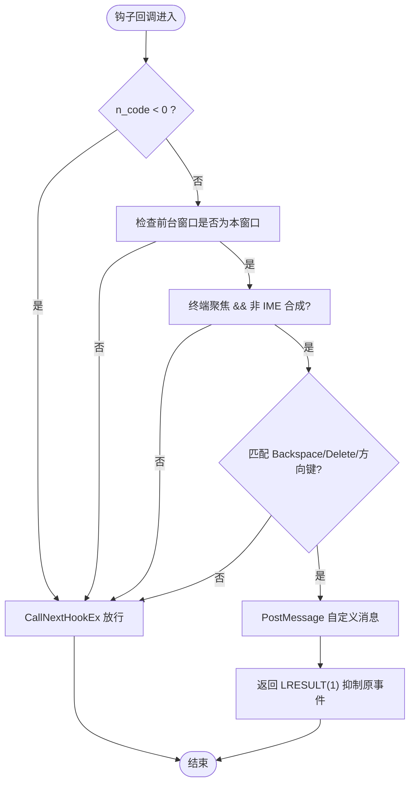

**图表来源**
- [keyboard_hook.rs:151-245](file://crates/aether-win32/src/keyboard_hook.rs#L151-L245)

**章节来源**
- [keyboard_hook.rs:56-122](file://crates/aether-win32/src/keyboard_hook.rs#L56-L122)
- [keyboard_hook.rs:256-315](file://crates/aether-win32/src/keyboard_hook.rs#L256-L315)

### WM_KEYDOWN 入口与分发
- 入口函数 on_key_down 负责：
  - 同步当前窗口状态到 thread_local
  - 解析 VK、Ctrl、Shift 状态
  - IME 合成期直接交给默认窗口过程
  - 按优先级处理文件树输入、上下文菜单、搜索面板、欢迎页、补全弹窗、设置字段、SSH/克隆对话框、命令面板等
  - Ctrl 分支调用 okd_ctrl_dispatch；非 Ctrl 分支调用 okd_edit_dispatch

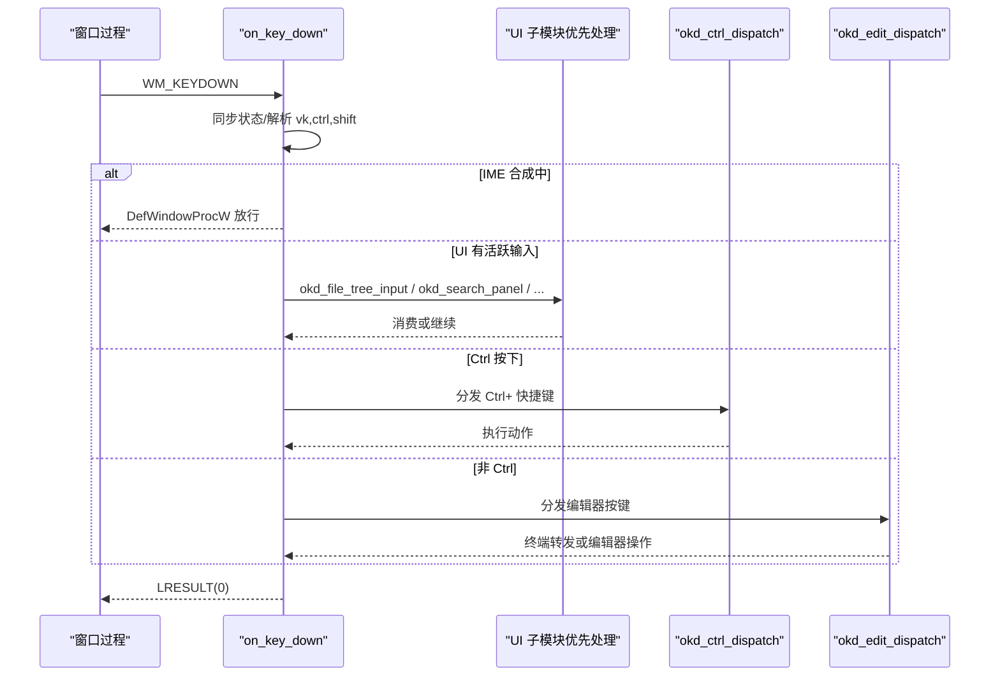

**图表来源**
- [key_down.rs:18-117](file://crates/aether-win32/src/window/keyboard_handler/key_down.rs#L18-L117)
- [key_down_ctrl.rs:15-28](file://crates/aether-win32/src/window/keyboard_handler/key_down_ctrl.rs#L15-L28)
- [key_down_edit.rs:14-55](file://crates/aether-win32/src/window/keyboard_handler/key_down_edit.rs#L14-L55)

**章节来源**
- [key_down.rs:18-117](file://crates/aether-win32/src/window/keyboard_handler/key_down.rs#L18-L117)

### Ctrl+ 快捷键处理（key_down_ctrl.rs）
- 集中处理 Ctrl 组合键，包括：
  - 文件操作：打开文件/文件夹、保存/另存为、新建项目
  - 视图操作：侧栏、底部面板、命令面板、缩放、源代码管理视图
  - 剪贴板：复制/剪切/粘贴/全选（终端聚焦时 Ctrl+C 中断、Ctrl+V 粘贴到终端）
  - 查找/替换/撤销/重做
  - 标签页：切换/关闭/恢复最后关闭的标签
  - 词级移动、文件首末、列光标、内联补全触发等

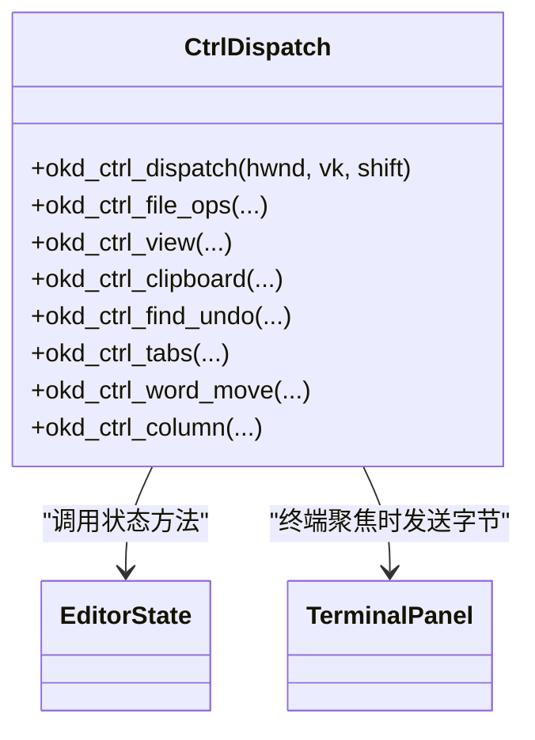

**图表来源**
- [key_down_ctrl.rs:15-28](file://crates/aether-win32/src/window/keyboard_handler/key_down_ctrl.rs#L15-L28)

**章节来源**
- [key_down_ctrl.rs:30-709](file://crates/aether-win32/src/window/keyboard_handler/key_down_ctrl.rs#L30-L709)

### 非 Ctrl 编辑器按键（key_down_edit.rs）
- 处理 Return/Backspace/Delete/F3/Esc/方向键/Home/End/PageUp/Down/Tab 等
- 终端聚焦时，将编辑键转换为 ANSI 序列发送到 ConPTY
- 智能 Home：当已在首个非空白位置时再次按 Home 跳到行首
- Tab：若存在内联补全建议则接受，否则插入制表符

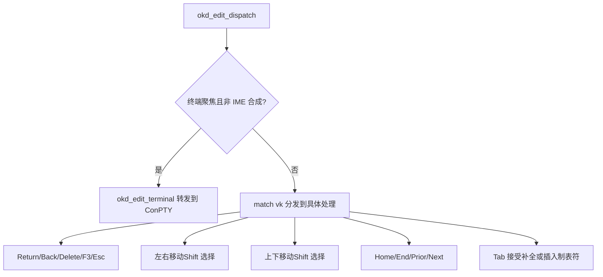

**图表来源**
- [key_down_edit.rs:14-55](file://crates/aether-win32/src/window/keyboard_handler/key_down_edit.rs#L14-L55)

**章节来源**
- [key_down_edit.rs:57-151](file://crates/aether-win32/src/window/keyboard_handler/key_down_edit.rs#L57-L151)
- [key_down_edit.rs:475-534](file://crates/aether-win32/src/window/keyboard_handler/key_down_edit.rs#L475-L534)
- [key_down_edit.rs:536-591](file://crates/aether-win32/src/window/keyboard_handler/key_down_edit.rs#L536-L591)

### WM_CHAR 字符输入与 UTF-16 代理对处理
- 入口 on_char 负责：
  - 处理高代理/低代理对，拼接完整 Unicode 码点
  - IME 合成期跳过原始字符分发（避免重复插入）
  - 按优先级路由到文件树输入、设置字段、搜索面板、SSH/克隆对话框、命令面板、查找替换、终端、AI 面板，最终落到编辑器默认插入

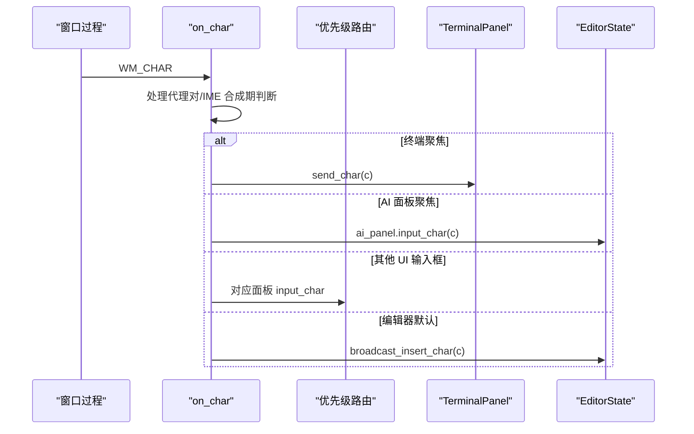

**图表来源**
- [char_input.rs:11-90](file://crates/aether-win32/src/window/keyboard_handler/char_input.rs#L11-L90)

**章节来源**
- [char_input.rs:92-413](file://crates/aether-win32/src/window/keyboard_handler/char_input.rs#L92-L413)

### IME 输入法协同
- 开始合成：初始化候选窗口位置
- 合成串更新：仅更新显示，不修改 buffer
- 结果串提交：清空合成串，逐字符插入；终端聚焦时立即关闭 IME，使 Backspace 可达终端
- 阻止 WM_IME_CHAR 产生 WM_CHAR，避免重复插入

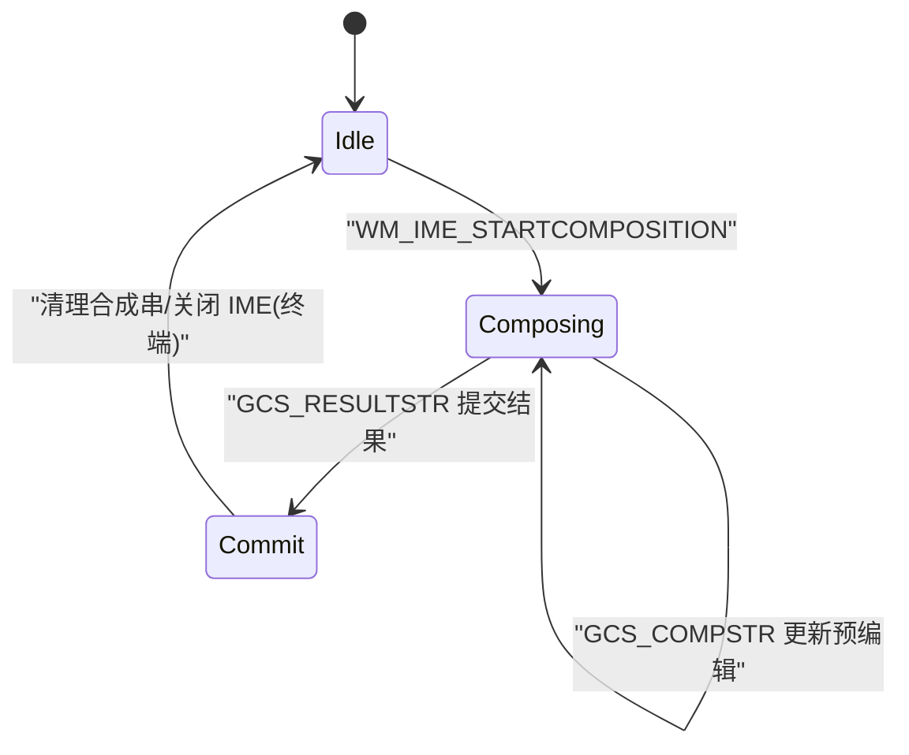

**图表来源**
- [ime_handler.rs:22-118](file://crates/aether-win32/src/window/ime_handler.rs#L22-L118)

**章节来源**
- [ime_handler.rs:1-131](file://crates/aether-win32/src/window/ime_handler.rs#L1-L131)
- [editor.rs:4731-4776](file://crates/aether-win32/src/editor.rs#L4731-L4776)

### 虚拟键码到字符转换与多键盘布局
- KeyMap::from_vk 将 VIRTUAL_KEY 转换为 Key，并对字母和数字进行 Shift 区分
- 对于符号键，使用 ToUnicode 获取当前键盘布局下的字符映射，支持多语言布局
- 该转换用于快捷键匹配与扩展

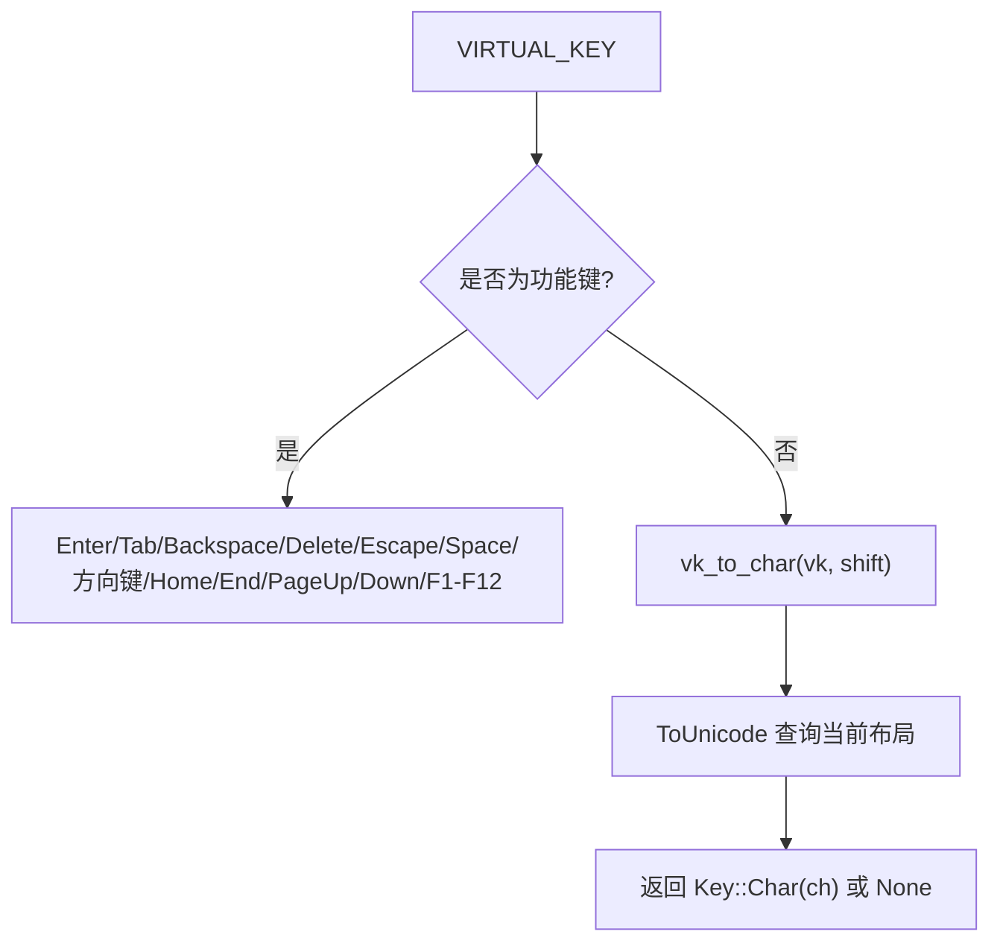

**图表来源**
- [input.rs:210-288](file://crates/aether-win32/src/input.rs#L210-L288)

**章节来源**
- [input.rs:210-288](file://crates/aether-win32/src/input.rs#L210-L288)

### 快捷键映射系统 KeyMap
- KeyMap 使用 HashMap<(Key, bool, bool, bool), EditorAction> 存储绑定
- 提供 lookup 与 from_vk 接口，便于从 Win32 虚拟键码构建匹配键
- 当前快捷键硬编码在 key_down_ctrl.rs 与 key_down_edit.rs 中，KeyMap 作为可扩展的映射结构预留用户自定义能力

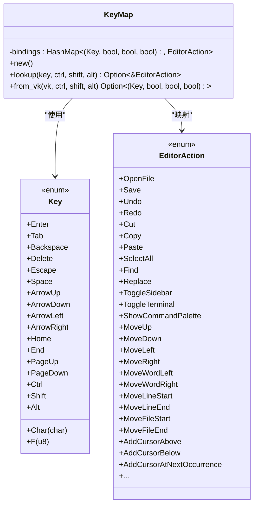

**图表来源**
- [input.rs:119-244](file://crates/aether-win32/src/input.rs#L119-L244)

**章节来源**
- [input.rs:119-244](file://crates/aether-win32/src/input.rs#L119-L244)

### 多光标编辑的键盘操作
- 多光标数据结构：
  - input.rs 中的 MultiCursor/Cursor 提供基础的多光标管理与辅助方法
  - text_buffer.rs 中的 MultiCursorState 提供更丰富的多光标状态（包含 selections、列模式等）
- 广播操作：
  - broadcast_delete_char：多光标退格删除，记录历史并调整后续光标列位
  - broadcast_insert_newline：多光标换行，原子撤销组包裹
  - broadcast_insert_char：多光标插入字符（由 WM_CHAR 默认路径调用）

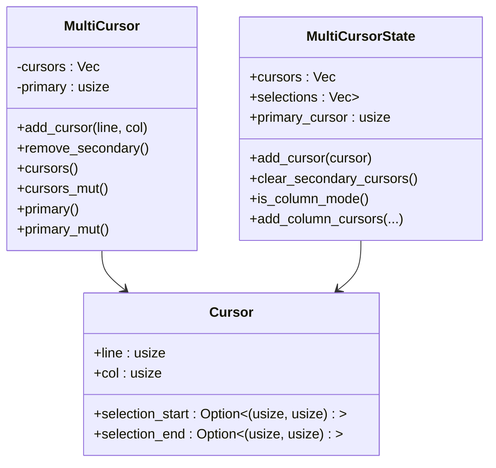

**图表来源**
- [input.rs:290-354](file://crates/aether-win32/src/input.rs#L290-L354)
- [text_buffer.rs:174-211](file://crates/aether-core/src/buffer/text_buffer.rs#L174-L211)

**章节来源**
- [editor.rs:5103-5184](file://crates/aether-win32/src/editor.rs#L5103-L5184)
- [editor.rs:5186-5200](file://crates/aether-win32/src/editor.rs#L5186-L5200)
- [text_buffer.rs:174-211](file://crates/aether-core/src/buffer/text_buffer.rs#L174-L211)

## 依赖关系分析
- keyboard_hook.rs 依赖 Windows API 安装/卸载钩子，并通过自定义消息与主窗口通信
- window/keyboard_handler 模块依赖 EDITOR_STATE 与 invalidate_window 进行状态更新与重绘
- key_down_ctrl.rs 与 key_down_edit.rs 分别依赖 TerminalPanel 与 EditorState
- char_input.rs 与 ime_handler.rs 共同协作处理 IME 合成与字符提交
- input.rs 提供 KeyMap、Key、EditorAction 定义及多光标基础结构

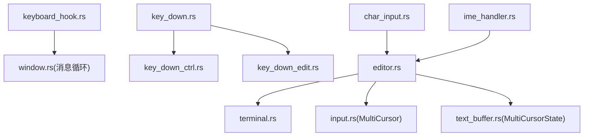

**图表来源**
- [keyboard_hook.rs:1-122](file://crates/aether-win32/src/keyboard_hook.rs#L1-L122)
- [key_down.rs:18-117](file://crates/aether-win32/src/window/keyboard_handler/key_down.rs#L18-L117)
- [char_input.rs:11-90](file://crates/aether-win32/src/window/keyboard_handler/char_input.rs#L11-L90)
- [ime_handler.rs:22-118](file://crates/aether-win32/src/window/ime_handler.rs#L22-L118)
- [input.rs:290-354](file://crates/aether-win32/src/input.rs#L290-L354)
- [text_buffer.rs:174-211](file://crates/aether-core/src/buffer/text_buffer.rs#L174-L211)

**章节来源**
- [keyboard_handler.rs:1-13](file://crates/aether-win32/src/window/keyboard_handler.rs#L1-L13)

## 性能考量
- 低层钩子仅在必要时拦截特定键，其余按键直接 CallNextHookEx，降低开销
- 终端聚焦时通过自定义消息异步写入 ConPTY，避免阻塞 UI 线程
- 多光标广播操作使用批量计算与排序，减少多次遍历带来的性能损耗
- IME 合成期不拦截编辑键，减少不必要的状态判断与消息处理

[本节为通用指导，无需源码引用]

## 故障排查指南
- 终端无法删除中文：确认低层钩子已安装且 TERMINAL_FOCUSED_FLAG 正确设置；检查 IME 合成标志是否在提交后重置
- 中文输入重复插入：确认 WM_IME_CHAR 已被拦截，避免 TranslateMessage 产生 WM_CHAR
- 快捷键无效：检查 Ctrl/Shift/Alt 状态解析是否正确；确认 KeyMap 与分发逻辑是否覆盖目标键
- 多光标行为异常：检查广播操作的索引与列位调整逻辑，确保删除顺序与位置修正正确

**章节来源**
- [keyboard_hook.rs:151-245](file://crates/aether-win32/src/keyboard_hook.rs#L151-L245)
- [ime_handler.rs:120-131](file://crates/aether-win32/src/window/ime_handler.rs#L120-L131)
- [editor.rs:5103-5184](file://crates/aether-win32/src/editor.rs#L5103-L5184)

## 结论
牧羊人编辑器的键盘输入处理系统通过低层钩子、窗口消息分发、IMC 协同与多光标广播等机制，实现了跨平台一致的编辑体验与强大的终端集成能力。KeyMap 结构为未来用户自定义快捷键提供了良好扩展点。整体设计清晰、职责分离明确，具备良好的可维护性与扩展性。

[本节为总结，无需源码引用]

## 附录
- 常用快捷键参考（部分）：
  - Ctrl+O/K/S/N：打开文件/文件夹、保存、新建项目
  - Ctrl+B/J/`：侧栏/底部面板/终端切换
  - Ctrl+F/H/Z/Y：查找/替换/撤销/重做
  - Ctrl+Tab/W/F4：标签页切换/关闭
  - Ctrl+D：添加下一个相同单词光标
  - Ctrl+Alt+Up/Down：列光标
  - Ctrl+Space：触发补全
  - Ctrl+Shift+P：打开命令面板（带 > 前缀）

[本节为概念性内容，无需源码引用]