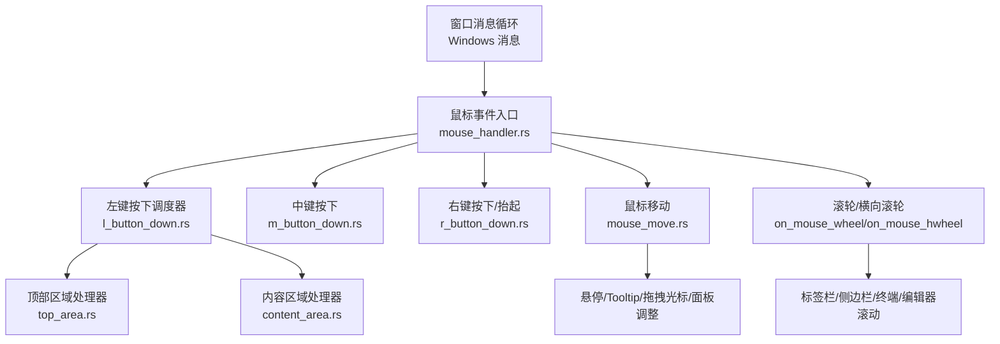
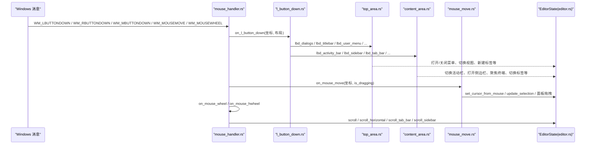
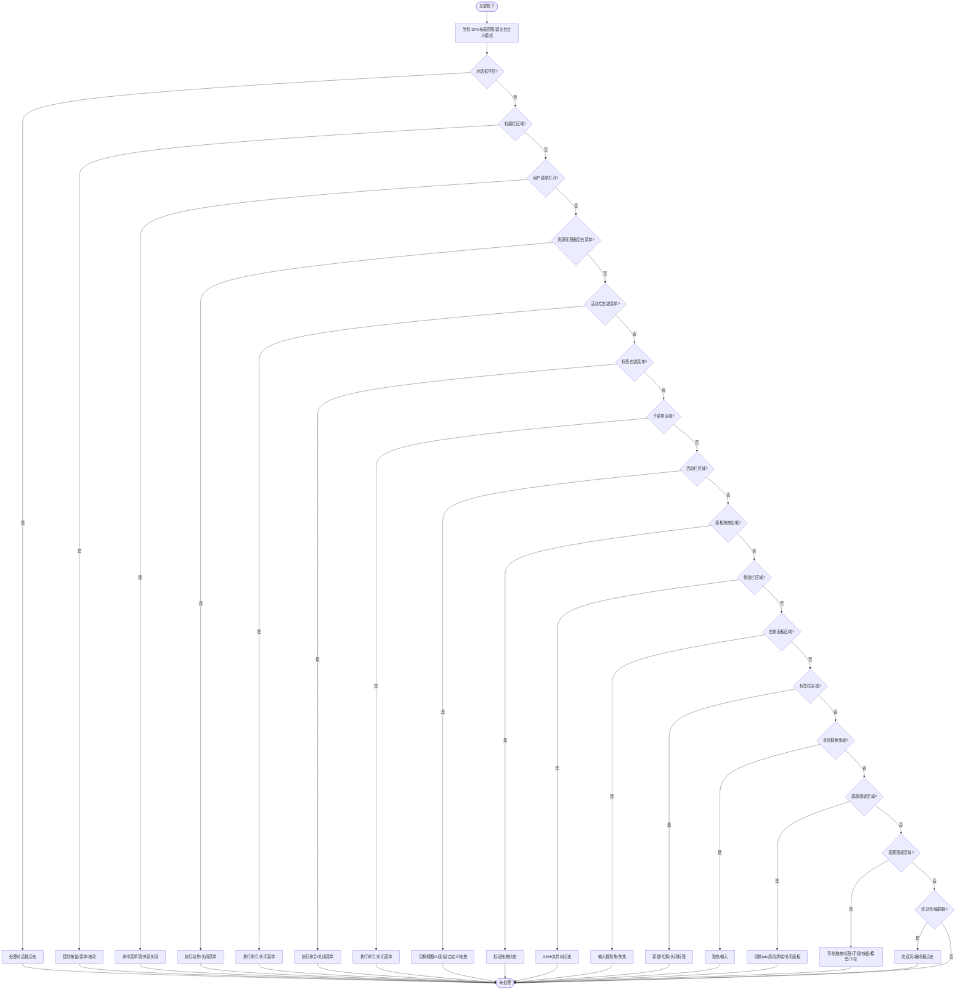
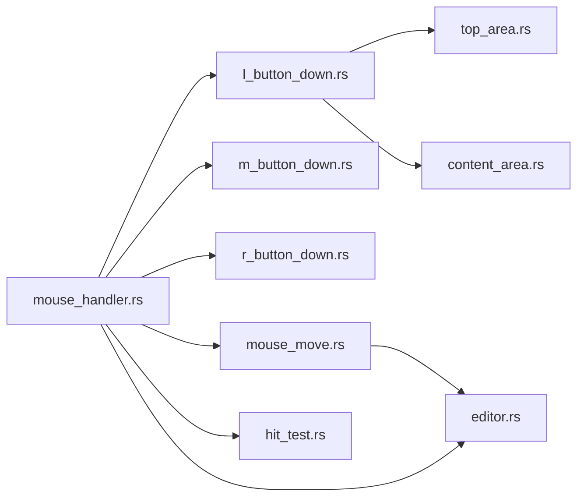

# 鼠标输入处理

<cite>
**本文引用的文件**   
- [mouse_handler.rs](file://crates/aether-win32/src/window/mouse_handler.rs)
- [l_button_down.rs](file://crates/aether-win32/src/window/mouse_handler/l_button_down.rs)
- [content_area.rs](file://crates/aether-win32/src/window/mouse_handler/l_button_down/content_area.rs)
- [top_area.rs](file://crates/aether-win32/src/window/mouse_handler/l_button_down/top_area.rs)
- [m_button_down.rs](file://crates/aether-win32/src/window/mouse_handler/m_button_down.rs)
- [r_button_down.rs](file://crates/aether-win32/src/window/mouse_handler/r_button_down.rs)
- [mouse_move.rs](file://crates/aether-win32/src/window/mouse_handler/mouse_move.rs)
- [editor.rs](file://crates/aether-win32/src/editor.rs)
- [hit_test.rs](file://crates/aether-win32/src/hit_test.rs)
</cite>

## 目录
1. [简介](#简介)
2. [项目结构](#项目结构)
3. [核心组件](#核心组件)
4. [架构总览](#架构总览)
5. [详细组件分析](#详细组件分析)
6. [依赖关系分析](#依赖关系分析)
7. [性能考量](#性能考量)
8. [故障排查指南](#故障排查指南)
9. [结论](#结论)
10. [附录：交互场景与最佳实践](#附录交互场景与最佳实践)

## 简介
本文件面向牧羊人编辑器的鼠标输入处理系统，系统性说明鼠标事件的捕获、分发与处理机制，覆盖左键点击、右键菜单、中键滚轮/关闭标签、鼠标移动与悬停、拖拽（文本选择、界面元素拖拽）、滚动（行/页/横向）等。文档同时解释点击检测算法（内容区域与顶部区域区分）、事件优先级与焦点管理，并提供典型交互示例（双击选词、三击选行、Shift+点击扩展选择等）。

## 项目结构
鼠标输入处理位于 Windows 窗口层，采用“调度器 + 按区域拆分”的模块化设计：
- 顶层调度器：统一解析坐标、DPI 转换、布局克隆、退出自定义模式等公共逻辑
- 子模块：按事件类型（左键、中键、右键、移动）和区域（对话框/标题栏/活动栏/侧边栏/编辑器等）进一步拆分，便于维护与测试
- 状态与渲染分离：所有 UI 状态变更通过 EditorState 完成，随后触发重绘

图表来源
- [mouse_handler.rs:1-277](file://crates/aether-win32/src/window/mouse_handler.rs#L1-L277)
- [l_button_down.rs:1-101](file://crates/aether-win32/src/window/mouse_handler/l_button_down.rs#L1-L101)
- [top_area.rs:1-612](file://crates/aether-win32/src/window/mouse_handler/l_button_down/top_area.rs#L1-L612)
- [content_area.rs:1-800](file://crates/aether-win32/src/window/mouse_handler/l_button_down/content_area.rs#L1-L800)
- [m_button_down.rs:1-58](file://crates/aether-win32/src/window/mouse_handler/m_button_down.rs#L1-L58)
- [r_button_down.rs:1-216](file://crates/aether-win32/src/window/mouse_handler/r_button_down.rs#L1-L216)
- [mouse_move.rs:1-800](file://crates/aether-win32/src/window/mouse_handler/mouse_move.rs#L1-L800)

章节来源
- [mouse_handler.rs:1-277](file://crates/aether-win32/src/window/mouse_handler.rs#L1-L277)
- [l_button_down.rs:1-101](file://crates/aether-win32/src/window/mouse_handler/l_button_down.rs#L1-L101)

## 核心组件
- 事件入口与通用流程
  - 坐标与 DPI：将 LPARAM 中的物理像素转换为逻辑像素；必要时使用 ScreenToClient 获取客户端坐标
  - 布局克隆：在不可变借用下读取布局，避免长时间持有可变引用
  - 自定义模式退出：当点击不在自定义区域时退出活动栏/菜单栏自定义排序
- 左键按下调度器
  - 按优先级依次尝试各区域处理器：对话框 → 标题栏 → 用户菜单 → 资源管理器空白菜单 → 活动栏右键菜单 → 标签右键菜单 → 子菜单 → 活动栏 → 面板拖拽边框 → 侧边栏 → 右侧面板 → 标签栏 → 查找替换面板 → 底部面板 → 设置面板 → 欢迎页或编辑器
- 右键菜单
  - 标签右键：弹出标签上下文菜单并互斥关闭其他菜单
  - 活动栏右键：弹出活动栏上下文菜单
  - 资源管理器空白区域右键：弹出空白区域菜单；命中节点则选中但不弹空白菜单
- 中键按下
  - 仅响应标签栏区域内的中键点击，复用 close_tab 的 dirty 检查逻辑
- 鼠标移动
  - 更新各区域 hover 状态、tooltip 延迟显示、拖拽光标、面板拖拽调整、悬停防抖
- 滚轮与横向滚轮
  - 标签栏内横向滚动标签
  - Shift+滚轮或编辑器区域内横向滚轮实现横向滚动
  - 底部终端面板与侧边栏独立滚动
  - 默认编辑器垂直滚动

章节来源
- [mouse_handler.rs:1-277](file://crates/aether-win32/src/window/mouse_handler.rs#L1-L277)
- [l_button_down.rs:1-101](file://crates/aether-win32/src/window/mouse_handler/l_button_down.rs#L1-L101)
- [r_button_down.rs:1-216](file://crates/aether-win32/src/window/mouse_handler/r_button_down.rs#L1-L216)
- [m_button_down.rs:1-58](file://crates/aether-win32/src/window/mouse_handler/m_button_down.rs#L1-L58)
- [mouse_move.rs:1-800](file://crates/aether-win32/src/window/mouse_handler/mouse_move.rs#L1-L800)

## 架构总览
下图展示鼠标事件从 Windows 消息到具体处理的调用链与数据流。

图表来源
- [mouse_handler.rs:1-277](file://crates/aether-win32/src/window/mouse_handler.rs#L1-L277)
- [l_button_down.rs:1-101](file://crates/aether-win32/src/window/mouse_handler/l_button_down.rs#L1-L101)
- [top_area.rs:1-612](file://crates/aether-win32/src/window/mouse_handler/l_button_down/top_area.rs#L1-L612)
- [content_area.rs:1-800](file://crates/aether-win32/src/window/mouse_handler/l_button_down/content_area.rs#L1-L800)
- [mouse_move.rs:1-800](file://crates/aether-win32/src/window/mouse_handler/mouse_move.rs#L1-L800)
- [editor.rs:5700-5899](file://crates/aether-win32/src/editor.rs#L5700-L5899)

## 详细组件分析

### 左键点击：调度与区域划分
- 调度器职责
  - 统一 DPI 转换、布局克隆、自定义模式退出
  - 按固定优先级顺序尝试各区域处理器，首个返回 Some(LRESULT) 即短路
- 顶部区域（对话框/标题栏/菜单）
  - 对话框优先拦截：SSH/克隆/新建项目对话框点击
  - 标题栏控制按钮与工具栏按钮：最小化/最大化/关闭、用户菜单、设置、右侧面板、底部面板、侧边栏开关、前进/后退占位
  - 标题栏菜单项：展开/收起子菜单，支持长按进入自定义拖拽
  - 标题栏拖动：非按钮/菜单区域触发窗口拖动
- 内容区域（活动栏/侧边栏/面板/编辑器）
  - 活动栏：切换视图、AI 面板显隐、自定义模式下开始拖拽
  - 面板拖拽边框：右侧/底部面板与侧边栏宽度调整
  - 侧边栏：SSH 管理面板操作、文件树点击
  - 右侧 AI 面板：输入框聚焦/失焦
  - 标签栏：新建标签、切换标签、关闭标签（含 dirty 确认弹窗）
  - 查找替换面板：聚焦查询/替换输入
  - 底部面板：切换 Terminal/Problems、自动启动终端、关闭面板
  - 设置面板：导航栏拖拽、标签/字段/按钮/模型列表/下拉框命中

图表来源
- [l_button_down.rs:1-101](file://crates/aether-win32/src/window/mouse_handler/l_button_down.rs#L1-L101)
- [top_area.rs:1-612](file://crates/aether-win32/src/window/mouse_handler/l_button_down/top_area.rs#L1-L612)
- [content_area.rs:1-800](file://crates/aether-win32/src/window/mouse_handler/l_button_down/content_area.rs#L1-L800)

章节来源
- [l_button_down.rs:1-101](file://crates/aether-win32/src/window/mouse_handler/l_button_down.rs#L1-L101)
- [top_area.rs:1-612](file://crates/aether-win32/src/window/mouse_handler/l_button_down/top_area.rs#L1-L612)
- [content_area.rs:1-800](file://crates/aether-win32/src/window/mouse_handler/l_button_down/content_area.rs#L1-L800)

### 右键菜单：标签/活动栏/资源管理器空白区域
- 标签右键
  - 检测是否命中标签体，构建 TabContextMenuState 并在窗口边界内打开
  - 互斥关闭其他已打开的上下文菜单
- 活动栏右键
  - 检测活动栏区域，构建 ActivityBarContextMenuState 并打开
  - 互斥关闭标签与资源管理器菜单
- 资源管理器空白区域右键
  - 仅在侧边栏可见且当前为文件树视图时可能弹出空白菜单
  - 命中“新建文件/文件夹”按钮不弹空白菜单
  - 命中节点：选中节点但不弹空白菜单；空白区域：弹出菜单并清空选中节点

章节来源
- [r_button_down.rs:1-216](file://crates/aether-win32/src/window/mouse_handler/r_button_down.rs#L1-L216)

### 中键按下：关闭标签
- 仅响应标签栏区域内的中键点击
- 复用 close_tab 的 dirty 检查逻辑，与关闭按钮行为一致

章节来源
- [m_button_down.rs:1-58](file://crates/aether-win32/src/window/mouse_handler/m_button_down.rs#L1-L58)

### 鼠标移动：悬停、Tooltip、拖拽光标与面板调整
- 早期返回：对话框/上下文菜单悬停、长按取消、自定义模式拖拽、标签拖拽阈值判定
- 悬停更新：标题栏/菜单栏、活动栏/标签栏、文件树/SSH/源码管理、设置面板、欢迎页、状态栏分区
- Tooltip 防抖与延迟显示：500ms 延迟、4px 移动容差、锚点与计时器
- 拖拽光标与面板调整：右侧/底部面板分隔条、设置面板导航栏、侧边栏分隔条
- 拖拽中更新：设置光标、更新选择、触发重绘

章节来源
- [mouse_move.rs:1-800](file://crates/aether-win32/src/window/mouse_handler/mouse_move.rs#L1-L800)

### 滚轮与横向滚轮：行/页/智能滚动优化
- 标签栏区域：横向滚动标签
- Shift+滚轮：若光标在编辑器区域内，进行横向滚动（基于字符宽度）
- 底部终端面板：向上/向下滚动输出
- 侧边栏：滚动文件树
- 默认：编辑器垂直滚动
- 横向滚轮：仅在编辑器区域内响应，按字符宽度横向滚动

章节来源
- [mouse_handler.rs:154-277](file://crates/aether-win32/src/window/mouse_handler.rs#L154-L277)

### 点击检测算法：内容区域与顶部区域
- 坐标与布局
  - 所有坐标先转换为逻辑像素（除以 dpi_scale），再与布局 Region 进行 contains 判断
- 顶部区域
  - 标题栏按钮/菜单项/拖动区域分别计算矩形范围
  - 子菜单命中基于 active_index 与 item_x_positions
- 内容区域
  - 活动栏/侧边栏/右侧面板/标签栏/查找替换面板/底部面板/设置面板均按各自绘制布局进行命中
  - 标签栏关闭按钮与标签体命中分离，关闭路径需考虑 dirty 状态与模态弹窗时机

章节来源
- [top_area.rs:141-318](file://crates/aether-win32/src/window/mouse_handler/l_button_down/top_area.rs#L141-L318)
- [content_area.rs:282-465](file://crates/aether-win32/src/window/mouse_handler/l_button_down/content_area.rs#L282-L465)

### 拖拽操作：文本选择、界面元素拖拽
- 文本选择
  - 左键按下：start_selection 初始化选择起点与终点
  - 鼠标移动：update_selection 实时更新选择终点
  - 左键抬起：end_selection 结束选择
- 界面元素拖拽
  - 活动栏/菜单栏自定义模式：begin_drag 记录 drag_index/drop_index，移动时更新 drop_index，抬起时 reorder 并持久化
  - 标签拖拽：超过阈值进入拖拽模式，更新 tab_drop_index，抬起时重排标签
  - 面板拖拽：右侧/底部面板与侧边栏分隔条拖拽调整宽度/高度

章节来源
- [editor.rs:5709-5728](file://crates/aether-win32/src/editor.rs#L5709-L5728)
- [mouse_handler.rs:24-111](file://crates/aether-win32/src/window/mouse_handler.rs#L24-L111)
- [mouse_move.rs:140-186](file://crates/aether-win32/src/window/mouse_handler/mouse_move.rs#L140-L186)
- [content_area.rs:17-74](file://crates/aether-win32/src/window/mouse_handler/l_button_down/content_area.rs#L17-L74)

### 鼠标事件优先级与焦点管理
- 事件优先级（左键）
  - 对话框 > 标题栏 > 用户菜单 > 资源管理器空白菜单 > 活动栏右键菜单 > 标签右键菜单 > 子菜单 > 活动栏 > 面板拖拽边框 > 侧边栏 > 右侧面板 > 标签栏 > 查找替换面板 > 底部面板 > 设置面板 > 欢迎页/编辑器
- 焦点管理
  - 左键按下时若终端面板聚焦则取消聚焦并关闭 IME bypass
  - 底部面板点击 Terminal 时聚焦终端并自动启动
  - 设置面板点击后关闭 AI 面板输入焦点
  - 右键按下时若存在文件树内联输入则取消

章节来源
- [l_button_down.rs:17-99](file://crates/aether-win32/src/window/mouse_handler/l_button_down.rs#L17-L99)
- [content_area.rs:531-638](file://crates/aether-win32/src/window/mouse_handler/l_button_down/content_area.rs#L531-L638)
- [r_button_down.rs:40-43](file://crates/aether-win32/src/window/mouse_handler/r_button_down.rs#L40-L43)

### 高级交互示例
- 双击选词
  - 双击编辑器内容区域：定位光标，识别当前词（字母/数字/下划线连续序列），选择该词
- 三击选行
  - 当前代码未直接实现三击选行；可在双击基础上叠加计数逻辑，或在双击后再次双击同一位置选择整行
- Shift+点击扩展选择
  - 当前实现以鼠标移动更新选择终点；Shift+点击可扩展为以 Shift 修饰键将点击位置作为选择终点而不重置起点
- 文件拖放
  - 当前仓库未发现针对编辑器区域的文件拖放实现；如需支持，可在鼠标移动/抬起钩子中检测 DragDrop 状态并解析文件路径插入缓冲区

章节来源
- [mouse_handler.rs:113-152](file://crates/aether-win32/src/window/mouse_handler.rs#L113-L152)
- [editor.rs:5731-5797](file://crates/aether-win32/src/editor.rs#L5731-L5797)

## 依赖关系分析
- 模块耦合
  - mouse_handler.rs 聚合各子模块，低耦合高内聚
  - top_area.rs 与 content_area.rs 分别负责顶部与内容区域，职责清晰
  - editor.rs 提供选择、光标定位、滚动等核心能力
- 外部依赖
  - Windows API：SetCursor、LoadCursorW、SendMessageW、ShowWindow、DestroyWindow、ScreenToClient、GetKeyState、KillTimer/SetTimer 等
  - 布局与主题：LayoutManager、TextRenderer、Theme 等

图表来源
- [mouse_handler.rs:1-277](file://crates/aether-win32/src/window/mouse_handler.rs#L1-L277)
- [l_button_down.rs:1-101](file://crates/aether-win32/src/window/mouse_handler/l_button_down.rs#L1-L101)
- [top_area.rs:1-612](file://crates/aether-win32/src/window/mouse_handler/l_button_down/top_area.rs#L1-L612)
- [content_area.rs:1-800](file://crates/aether-win32/src/window/mouse_handler/l_button_down/content_area.rs#L1-L800)
- [m_button_down.rs:1-58](file://crates/aether-win32/src/window/mouse_handler/m_button_down.rs#L1-L58)
- [r_button_down.rs:1-216](file://crates/aether-win32/src/window/mouse_handler/r_button_down.rs#L1-L216)
- [mouse_move.rs:1-800](file://crates/aether-win32/src/window/mouse_handler/mouse_move.rs#L1-L800)
- [editor.rs:5700-5899](file://crates/aether-win32/src/editor.rs#L5700-L5899)
- [hit_test.rs:1-245](file://crates/aether-win32/src/hit_test.rs#L1-L245)

章节来源
- [mouse_handler.rs:1-277](file://crates/aether-win32/src/window/mouse_handler.rs#L1-L277)
- [hit_test.rs:1-245](file://crates/aether-win32/src/hit_test.rs#L1-L245)

## 性能考量
- 悬停与 Tooltip 防抖
  - 悬停 tooltip 使用定时器与移动容差减少频繁重绘
  - UI Tooltip 采用 500ms 延迟与 4px 容差，避免抖动
- 滚动优化
  - 横向滚动基于字符宽度计算，避免逐像素滚动带来的重绘开销
- 命中测试与调试
  - hit_test.rs 在 debug 构建下记录可点击区域，release 构建空实现零开销

章节来源
- [mouse_move.rs:670-778](file://crates/aether-win32/src/window/mouse_handler/mouse_move.rs#L670-L778)
- [mouse_handler.rs:154-277](file://crates/aether-win32/src/window/mouse_handler.rs#L154-L277)
- [hit_test.rs:1-245](file://crates/aether-win32/src/hit_test.rs#L1-L245)

## 故障排查指南
- RefCell 借用冲突导致卡死
  - 现象：在 borrow_mut() 期间弹出模态对话框，内部消息派发再次尝试 borrow_mut() 引发 panic
  - 解决：在阶段 2 用 borrow() 完成点击检测，drop borrow 后再执行需要弹窗的操作（如关闭标签确认）
- 右键菜单重叠
  - 现象：多个上下文菜单同时显示
  - 解决：打开新菜单前主动关闭其他已打开的菜单
- 终端面板焦点与 IME
  - 现象：切到其他面板后 Backspace 仍被底层钩子拦截
  - 解决：切换面板时取消终端聚焦并关闭 IME bypass
- 滚动方向与 Delta 符号
  - 现象：横向滚动方向与触控板手势相反
  - 解决：根据 delta 符号与 char_width 计算滚动偏移，确保方向一致

章节来源
- [content_area.rs:282-465](file://crates/aether-win32/src/window/mouse_handler/l_button_down/content_area.rs#L282-L465)
- [r_button_down.rs:59-93](file://crates/aether-win32/src/window/mouse_handler/r_button_down.rs#L59-L93)
- [content_area.rs:531-638](file://crates/aether-win32/src/window/mouse_handler/l_button_down/content_area.rs#L531-L638)
- [mouse_handler.rs:240-277](file://crates/aether-win32/src/window/mouse_handler.rs#L240-L277)

## 结论
牧羊人编辑器的鼠标输入处理采用清晰的调度器与区域化处理器设计，兼顾可读性与可维护性。通过严格的优先级与焦点管理、完善的悬停与 Tooltip 机制、以及稳健的拖拽与滚动实现，提供了流畅的用户体验。未来可在三击选行、Shift+点击扩展选择、文件拖放等方面进一步增强。

## 附录：交互场景与最佳实践
- 双击选词
  - 在编辑器内容区域双击，自动选择光标所在词
- 三击选行（建议实现）
  - 在双击基础上增加计数与行边界检测，实现整行选择
- Shift+点击扩展选择（建议实现）
  - 按住 Shift 点击时将点击位置设为选择终点，保持起点不变
- 文件拖放（建议实现）
  - 在鼠标移动/抬起钩子中检测 DragDrop 状态，解析文件路径并插入缓冲区
- 最佳实践
  - 避免在 borrow_mut() 期间弹出模态对话框
  - 使用布局 Region.contains 进行命中测试，保证 DPI 一致性
  - 对高频操作（悬停、滚动）加入防抖与容差，降低重绘频率

[本节为概念性总结，无需列出具体文件来源]