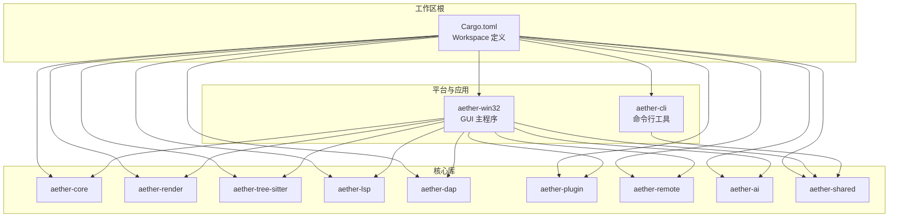
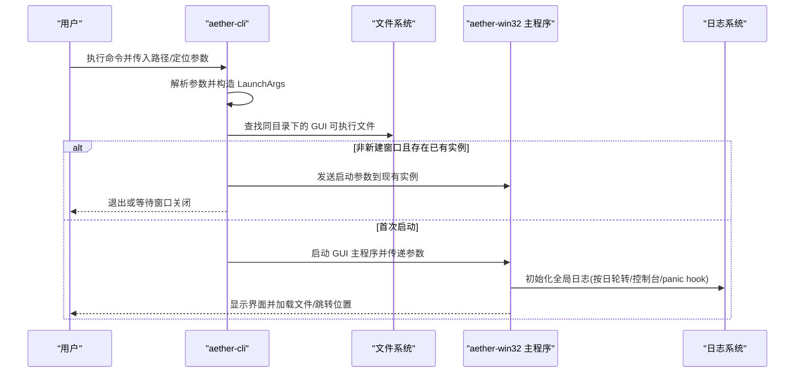
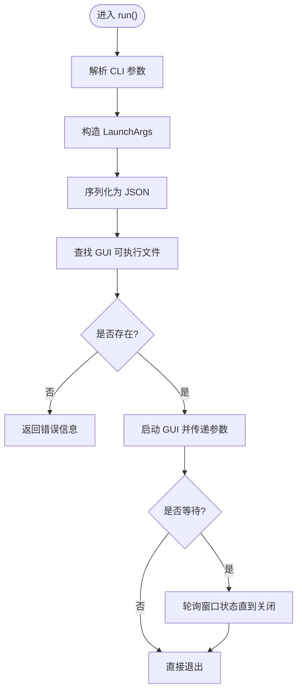
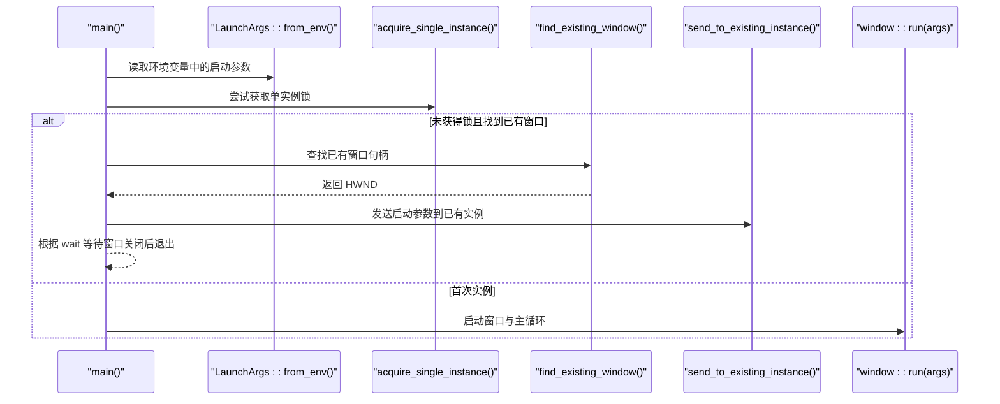
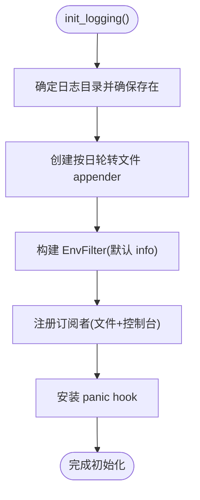
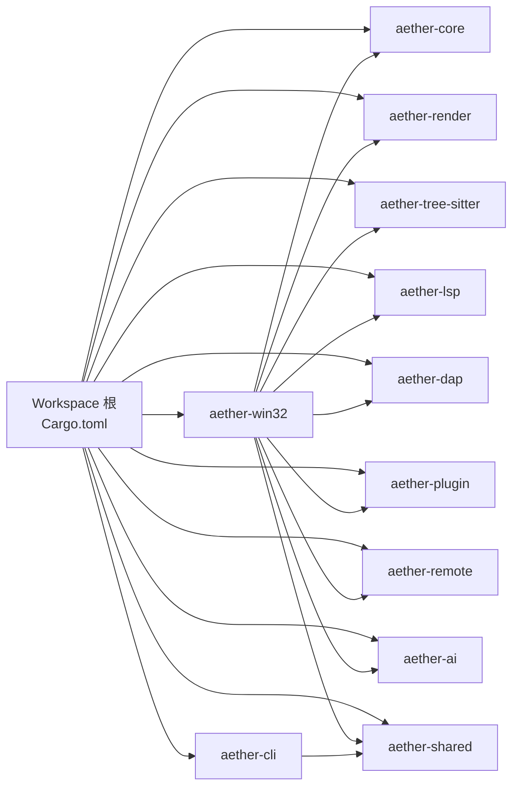
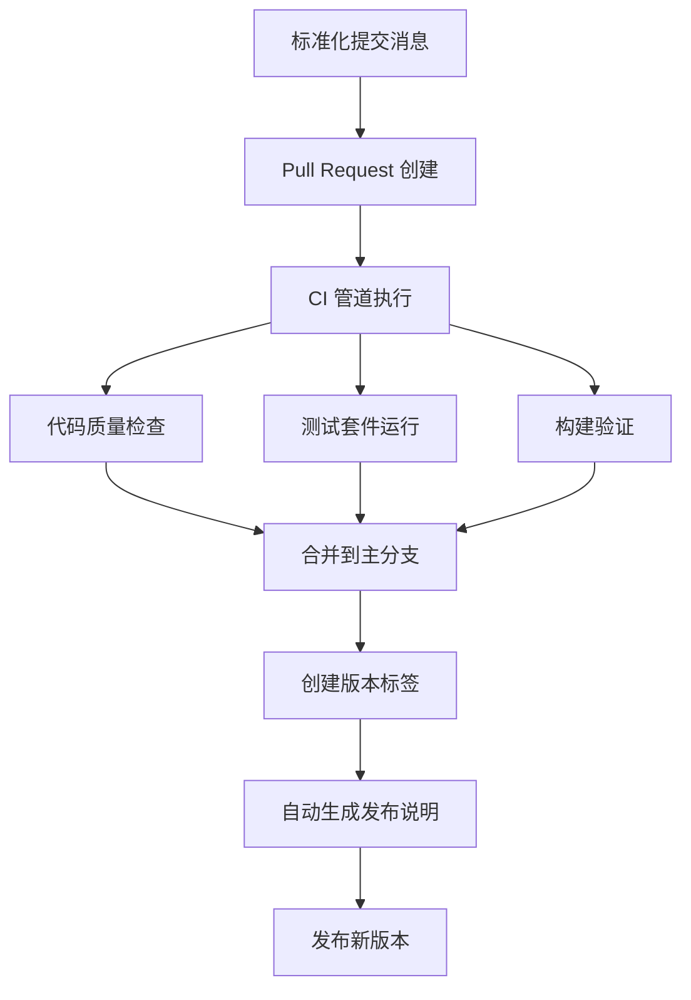

# 开发指南

<cite>
**本文引用的文件**   
- [README.md](file://README.md)
- [CONTRIBUTING.md](file://CONTRIBUTING.md)
- [Cargo.toml](file://Cargo.toml)
- [rust-toolchain.toml](file://rust-toolchain.toml)
- [.cargo/config.toml](file://.cargo/config.toml)
- [scripts/build-release.ps1](file://scripts/build-release.ps1)
- [tests/run_coverage.ps1](file://tests/run_coverage.ps1)
- [tests/generate_coverage_report.ps1](file://tests/generate_coverage_report.ps1)
- [crates/aether-cli/src/main.rs](file://crates/aether-cli/src/main.rs)
- [crates/aether-win32/Cargo.toml](file://crates/aether-win32/Cargo.toml)
- [crates/aether-core/Cargo.toml](file://crates/aether-core/Cargo.toml)
- [crates/aether-win32/src/main.rs](file://crates/aether-win32/src/main.rs)
- [crates/aether-win32/src/logging.rs](file://crates/aether-win32/src/logging.rs)
- [.github/PULL_REQUEST_TEMPLATE.md](file://.github/PULL_REQUEST_TEMPLATE.md)
- [.github/workflows/](file://.github/workflows/)
</cite>

## 更新摘要
**所做更改**   
- 新增 CI/CD 管道改进章节，包括自动发布说明生成和标准化提交消息格式要求
- 更新 Pull Request 模板相关内容，强调标准化的提交消息格式
- 增强持续集成流程的文档说明

## 目录
1. [简介](#简介)
2. [项目结构](#项目结构)
3. [核心组件](#核心组件)
4. [架构总览](#架构总览)
5. [详细组件分析](#详细组件分析)
6. [依赖关系分析](#依赖关系分析)
7. [性能与基准](#性能与基准)
8. [调试与故障排除](#调试与故障排除)
9. [CI/CD 管道与自动化](#cicd-管道与自动化)
10. [新功能开发流程](#新功能开发流程)
11. [常见问题解答](#常见问题解答)
12. [结论](#结论)

## 简介
本指南面向新贡献者与维护者，覆盖从环境搭建、代码规范、提交约定、调试技巧到功能开发的完整流程。项目为基于 Rust + Win32 API 的现代化编辑器，采用 Cargo Workspace 多 Crate 组织，强调高性能、低延迟与可维护性。

## 项目结构
仓库采用 Cargo Workspace 管理多个 crate，按职责拆分：
- aether-core：文本缓冲（Piece Table）、历史栈、词法分析器、文件树数据结构、搜索等
- aether-render：Direct2D/DirectWrite 渲染抽象、主题系统、画笔与文本格式缓存
- aether-win32：Windows 原生 UI 层（窗口、消息循环、菜单、布局、事件处理、应用入口）
- aether-shared：共享配置与持久化设置
- aether-lsp / aether-dap：语言服务器协议与调试适配器协议客户端基础实现
- aether-tree-sitter：语法解析、语言检测、主题映射与高亮
- aether-plugin：插件注册、权限与运行时
- aether-remote：SSH/Git/容器远程操作抽象
- aether-ai：AI 服务接口与请求处理
- aether-cli：命令行启动器，负责解析参数并拉起 GUI 主程序



图表来源
- [Cargo.toml:1-32](file://Cargo.toml#L1-L32)
- [crates/aether-win32/Cargo.toml:1-35](file://crates/aether-win32/Cargo.toml#L1-L35)
- [crates/aether-core/Cargo.toml:1-20](file://crates/aether-core/Cargo.toml#L1-L20)

章节来源
- [README.md:29-46](file://README.md#L29-L46)
- [Cargo.toml:1-32](file://Cargo.toml#L1-L32)

## 核心组件
- 构建与运行
  - 使用 cargo build/cargo run 分别编译与运行 GUI 主程序与 CLI 工具
  - 发布版本优化选项在 workspace 与 .cargo/config.toml 中统一配置
- 单实例与进程间通信
  - CLI 通过序列化启动参数并调用 GUI 主程序；若已有实例则转发参数并可选择等待窗口关闭
- 日志系统
  - 全局日志初始化、按日轮转、控制台输出、panic hook 集成与手动 flush

章节来源
- [README.md:49-88](file://README.md#L49-L88)
- [crates/aether-cli/src/main.rs:29-58](file://crates/aether-cli/src/main.rs#L29-L58)
- [crates/aether-win32/src/main.rs:8-26](file://crates/aether-win32/src/main.rs#L8-L26)
- [crates/aether-win32/src/logging.rs:31-86](file://crates/aether-win32/src/logging.rs#L31-L86)

## 架构总览
下图展示了 CLI 到 GUI 的启动序列以及关键交互点。



图表来源
- [crates/aether-cli/src/main.rs:29-58](file://crates/aether-cli/src/main.rs#L29-L58)
- [crates/aether-win32/src/main.rs:8-26](file://crates/aether-win32/src/main.rs#L8-L26)
- [crates/aether-win32/src/logging.rs:31-86](file://crates/aether-win32/src/logging.rs#L31-L86)

## 详细组件分析

### 命令行工具（aether-cli）
- 功能要点
  - 解析路径、是否新建窗口、是否等待、goto 定位
  - 将参数序列化为 JSON 并通过命令行参数传递给 GUI
  - 自动定位 GUI 可执行文件并与之同目录
- 测试覆盖
  - 对 goto 解析、路径规范化、可执行文件查找、CLI 参数解析等进行单元测试



图表来源
- [crates/aether-cli/src/main.rs:29-58](file://crates/aether-cli/src/main.rs#L29-L58)
- [crates/aether-cli/src/main.rs:60-133](file://crates/aether-cli/src/main.rs#L60-L133)

章节来源
- [crates/aether-cli/src/main.rs:29-133](file://crates/aether-cli/src/main.rs#L29-L133)
- [crates/aether-cli/src/main.rs:135-394](file://crates/aether-cli/src/main.rs#L135-L394)

### GUI 主程序（aether-win32）
- 单实例控制
  - 若非新建窗口且检测到已有实例，则将启动参数发送到已有实例，并根据 wait 决定是否等待窗口关闭
- 窗口运行
  - 首个实例继续初始化窗口与主循环
- 日志初始化
  - 初始化全局日志，支持环境变量 RUST_LOG 控制级别，按日轮转写入临时目录，安装 panic hook



图表来源
- [crates/aether-win32/src/main.rs:8-26](file://crates/aether-win32/src/main.rs#L8-L26)

章节来源
- [crates/aether-win32/src/main.rs:8-52](file://crates/aether-win32/src/main.rs#L8-L52)
- [crates/aether-win32/src/logging.rs:31-86](file://crates/aether-win32/src/logging.rs#L31-L86)

### 日志系统（aether-win32）
- 初始化流程
  - 确定日志目录（优先使用临时目录），创建按日轮转的文件 appender
  - 注册订阅者：EnvFilter、文件层、控制台层
  - 安装 panic hook，确保崩溃前 flush 日志
- 使用建议
  - 通过 RUST_LOG 调整日志级别
  - 关键路径后调用 flush_logs 确保日志落地



图表来源
- [crates/aether-win32/src/logging.rs:31-86](file://crates/aether-win32/src/logging.rs#L31-L86)
- [crates/aether-win32/src/logging.rs:88-124](file://crates/aether-win32/src/logging.rs#L88-L124)

章节来源
- [crates/aether-win32/src/logging.rs:1-124](file://crates/aether-win32/src/logging.rs#L1-L124)

## 依赖关系分析
- 顶层 Workspace 定义了所有成员 crate 与公共包元数据（版本、edition、rust-version）
- aether-win32 作为 GUI 二进制，依赖 core/render/tree-sitter/lsp/dap/plugin/remote/ai/shared 等模块
- aether-core 提供核心算法与数据结构，包含基准测试目标



图表来源
- [Cargo.toml:1-32](file://Cargo.toml#L1-L32)
- [crates/aether-win32/Cargo.toml:1-35](file://crates/aether-win32/Cargo.toml#L1-L35)
- [crates/aether-core/Cargo.toml:1-20](file://crates/aether-core/Cargo.toml#L1-L20)

章节来源
- [Cargo.toml:1-32](file://Cargo.toml#L1-L32)
- [crates/aether-win32/Cargo.toml:1-35](file://crates/aether-win32/Cargo.toml#L1-L35)
- [crates/aether-core/Cargo.toml:1-20](file://crates/aether-core/Cargo.toml#L1-L20)

## 性能与基准
- 构建优化
  - release profile 启用 fat LTO、单 codegen unit、opt-level=3、strip=true、incremental=false
  - 构建目标与 CPU 特性在 .cargo/config.toml 中指定
- 基准测试
  - aether-core 包含 lexer 基准目标，用于评估分词性能
- 覆盖率
  - 通过 llvm-cov 生成报告，脚本会清理并合并 profraw 文件，过滤第三方依赖

章节来源
- [Cargo.toml:24-32](file://Cargo.toml#L24-L32)
- [.cargo/config.toml:11-27](file://.cargo/config.toml#L11-L27)
- [crates/aether-core/Cargo.toml:13-20](file://crates/aether-core/Cargo.toml#L13-L20)
- [tests/run_coverage.ps1:1-12](file://tests/run_coverage.ps1#L1-L12)
- [tests/generate_coverage_report.ps1:1-57](file://tests/generate_coverage_report.ps1#L1-L57)

## 调试与故障排除
- 日志定位
  - 日志目录位于临时目录下 Aether/logs，文件名带日期后缀
  - 可通过 RUST_LOG 调整日志级别；panic 时会自动记录堆栈信息与位置
- 常见构建问题
  - 格式化失败：先运行格式化再检查
  - 编译失败：针对报错文件与行号修复
  - 测试失败：本地复现并修复用例
- 网络与代理
  - 配置 git 代理以解决推送失败
- 覆盖率脚本
  - 若找不到 .profraw 文件或 llvm 工具链路径不正确，需检查 rustup 工具链与 LLVM 工具

章节来源
- [crates/aether-win32/src/logging.rs:11-23](file://crates/aether-win32/src/logging.rs#L11-L23)
- [crates/aether-win32/src/logging.rs:88-124](file://crates/aether-win32/src/logging.rs#L88-L124)
- [CONTRIBUTING.md:164-191](file://CONTRIBUTING.md#L164-L191)
- [CONTRIBUTING.md:224-238](file://CONTRIBUTING.md#L224-L238)
- [tests/generate_coverage_report.ps1:1-18](file://tests/generate_coverage_report.ps1#L1-L18)

## CI/CD 管道与自动化

### 持续集成流程
项目采用 GitHub Actions 进行自动化构建和测试，确保代码质量和一致性。CI 管道包含以下关键步骤：

- **代码质量检查**
  - 自动执行代码格式化检查（cargo fmt）
  - 静态分析（cargo clippy）
  - 单元测试和集成测试
- **构建验证**
  - 多平台交叉编译验证
  - 依赖项安全检查
  - 构建产物完整性验证
- **自动化发布**
  - 标签触发自动发布流程
  - 自动生成发布说明（Release Notes）
  - 二进制文件打包和上传

### 标准化提交消息格式
为确保发布说明的自动生成和版本管理的规范性，项目要求遵循标准化的提交消息格式：

```
<type>(<scope>): <description>

[可选正文]

[可选脚注]
```

**类型（type）规范：**
- `feat`: 新功能
- `fix`: 缺陷修复
- `docs`: 文档变更
- `style`: 代码格式（不影响代码运行的变动）
- `refactor`: 重构（既不是新增功能，也不是修复缺陷）
- `test`: 测试相关
- `chore`: 构建过程或辅助工具的变动
- `perf`: 性能优化
- `ci`: CI/CD 相关变更

**范围（scope）规范：**
- `core`: 核心功能模块
- `win32`: Windows 平台特定功能
- `cli`: 命令行工具
- `render`: 渲染引擎
- `lexer`: 词法分析器
- `plugin`: 插件系统
- `remote`: 远程功能
- `ai`: AI 相关功能
- `build`: 构建系统
- `docs`: 文档
- `test`: 测试
- `ci`: 持续集成

**示例：**
```
feat(core): 添加增量词法分析器支持
fix(win32): 修复内存泄漏问题
docs(readme): 更新安装说明
```

### Pull Request 模板要求
Pull Request 模板现在包含标准化的提交消息格式要求和检查清单：

**必填字段：**
- 变更类型和范围
- 详细描述变更内容
- 影响范围分析
- 测试验证结果
- 向后兼容性说明

**检查清单：**
- [ ] 代码符合格式化标准
- [ ] 所有测试通过
- [ ] 提交消息遵循标准化格式
- [ ] 更新了相关文档
- [ ] 添加了必要的测试用例

### 自动发布说明生成
CI 管道集成了自动发布说明生成功能，基于标准化的提交消息格式自动生成变更日志：

- **变更分类**
  - 新功能（feat）
  - 缺陷修复（fix）
  - 性能改进（perf）
  - 破坏性变更（BREAKING CHANGE）
- **版本管理**
  - 语义化版本控制（SemVer）
  - 自动版本号计算
  - 发布分支策略



**图表来源**
- [.github/PULL_REQUEST_TEMPLATE.md](file://.github/PULL_REQUEST_TEMPLATE.md)
- [.github/workflows/](file://.github/workflows/)

**章节来源**
- [.github/PULL_REQUEST_TEMPLATE.md](file://.github/PULL_REQUEST_TEMPLATE.md)
- [.github/workflows/](file://.github/workflows/)

## 新功能开发流程
- 分支策略
  - 日常开发从 dev 切出 temp/<简短描述>；修复 bug 使用 fix/<问题描述>
  - PR 必须合并到 dev，禁止直接在 dev/main 上提交
- 提交流程
  - 提交前检查清单：格式化、编译、单元测试
  - 提交信息遵循 <type>(<scope>): <description> 格式，正文说明改动点与验证结果
- Fork 与 PR
  - 外部贡献者通过 Fork 提交 PR，保持与上游 dev 同步，必要时 rebase 并强制推送更新
- 合并冲突处理
  - 中止当前合并、拉取最新 dev、rebase 或 merge、手动解决冲突、执行检查清单、强制推送

**更新** 新增了 CI/CD 管道相关的开发流程要求，包括标准化提交消息格式和自动发布说明生成。

章节来源
- [CONTRIBUTING.md:84-96](file://CONTRIBUTING.md#L84-L96)
- [CONTRIBUTING.md:99-110](file://CONTRIBUTING.md#L99-L110)
- [CONTRIBUTING.md:113-145](file://CONTRIBUTING.md#L113-L145)
- [CONTRIBUTING.md:147-161](file://CONTRIBUTING.md#L147-L161)
- [CONTRIBUTING.md:193-221](file://CONTRIBUTING.md#L193-L221)
- [.github/PULL_REQUEST_TEMPLATE.md](file://.github/PULL_REQUEST_TEMPLATE.md)

## 常见问题解答
- 如何快速构建与运行？
  - 使用提供的 PowerShell 脚本一键构建，可选择 release 模式并在构建完成后直接运行 GUI
- 如何打开特定文件并跳转到行列？
  - 通过 CLI 的 --goto 参数支持 file.txt:line:column 或 line:column 形式
- 如何查看日志？
  - 日志位于 %TEMP%/Aether/logs，文件名带日期后缀；可通过 RUST_LOG 调整级别
- 如何处理 CI 失败？
  - 格式化失败：运行格式化并提交修复
  - 编译/测试失败：本地复现并修复，不要跳过测试
- 如何生成覆盖率报告？
  - 运行覆盖率脚本，确保 llvm-tools-preview 已安装且工具链路径正确
- 如何编写符合规范的提交消息？
  - 遵循 <type>(<scope>): <description> 格式，参考 Pull Request 模板中的详细说明
- CI 管道中的自动发布说明如何工作？
  - 基于标准化的提交消息格式自动生成，确保发布记录的完整性和一致性

**更新** 新增了关于标准化提交消息格式和 CI/CD 管道的相关问题解答。

章节来源
- [scripts/build-release.ps1:1-42](file://scripts/build-release.ps1#L1-L42)
- [crates/aether-cli/src/main.rs:82-89](file://crates/aether-cli/src/main.rs#L82-L89)
- [crates/aether-win32/src/logging.rs:11-23](file://crates/aether-win32/src/logging.rs#L11-L23)
- [CONTRIBUTING.md:164-191](file://CONTRIBUTING.md#L164-L191)
- [tests/generate_coverage_report.ps1:1-18](file://tests/generate_coverage_report.ps1#L1-L18)
- [.github/PULL_REQUEST_TEMPLATE.md](file://.github/PULL_REQUEST_TEMPLATE.md)

## 结论
本指南提供了从环境搭建、代码规范、提交约定到调试与功能开发的系统化说明。遵循上述流程与规范，有助于提升协作效率与代码质量，保障编辑器在高负载场景下的稳定性与性能。

**更新** 新增的 CI/CD 管道改进包括自动发布说明生成和标准化提交消息格式要求，进一步提升了项目的自动化水平和团队协作效率。这些改进确保了代码变更的可追溯性和发布过程的标准化，为项目的长期发展奠定了坚实基础。