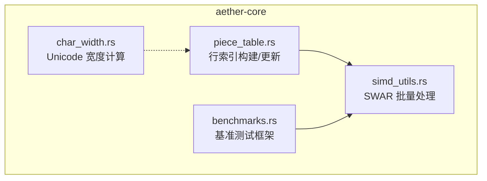
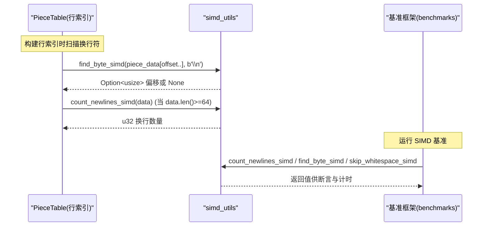
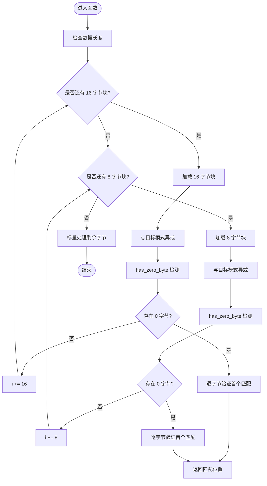
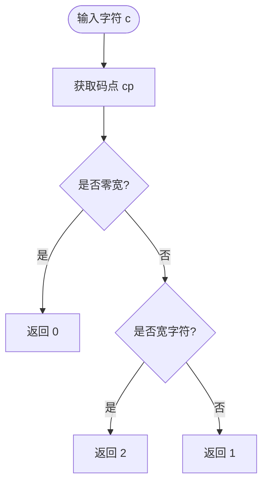
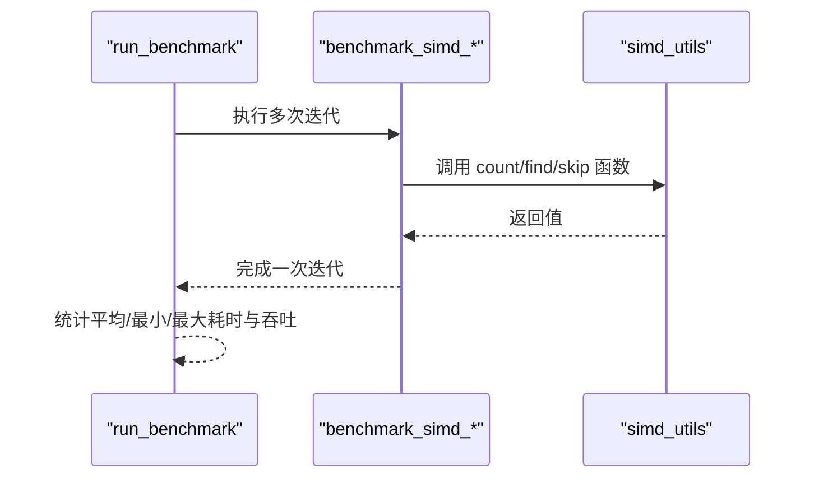
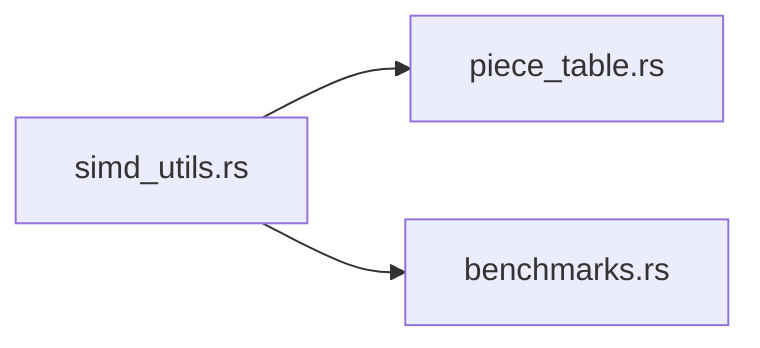

# SIMD 算法优化

<cite>
**本文引用的文件**   
- [simd_utils.rs](file://crates/aether-core/src/simd_utils.rs)
- [char_width.rs](file://crates/aether-core/src/char_width.rs)
- [benchmarks.rs](file://crates/aether-core/src/benchmarks.rs)
- [piece_table.rs](file://crates/aether-core/src/buffer/piece_table.rs)
</cite>

## 目录
1. [引言](#引言)
2. [项目结构](#项目结构)
3. [核心组件](#核心组件)
4. [架构总览](#架构总览)
5. [详细组件分析](#详细组件分析)
6. [依赖关系分析](#依赖关系分析)
7. [性能考量](#性能考量)
8. [故障排查指南](#故障排查指南)
9. [结论](#结论)
10. [附录](#附录)

## 引言
本专题聚焦牧羊人编辑器在文本处理中的 SIMD 算法优化，围绕以下热点路径展开：换行符查找、空白字符跳过、字节搜索、字符串前缀匹配与行长度计算；并深入讨论字符宽度计算的 Unicode 策略（含多字节编码支持）。文档同时给出编译器自动向量化与手动 SWAR 优化的选择原则、基准测试方法与结果解读，以及跨平台兼容性与调试技巧。

## 项目结构
本次优化主要位于 aether-core 库中：
- simd_utils.rs：提供基于 u128/u64 的 SWAR 批量处理工具函数，覆盖换行计数、字节查找、空白跳过、前缀匹配等。
- char_width.rs：实现 Unicode East Asian Width 的精简版，用于精确计算字符显示宽度。
- piece_table.rs：在构建行索引时调用 find_byte_simd 加速扫描换行符，并在大片段上采用 count_newlines_simd。
- benchmarks.rs：提供统一的基准框架与针对 SIMD 函数的基准用例。



图表来源
- [simd_utils.rs:1-553](file://crates/aether-core/src/simd_utils.rs#L1-L553)
- [char_width.rs:1-432](file://crates/aether-core/src/char_width.rs#L1-L432)
- [piece_table.rs:670-797](file://crates/aether-core/src/buffer/piece_table.rs#L670-L797)
- [benchmarks.rs:1-443](file://crates/aether-core/src/benchmarks.rs#L1-L443)

章节来源
- [simd_utils.rs:1-553](file://crates/aether-core/src/simd_utils.rs#L1-L553)
- [char_width.rs:1-432](file://crates/aether-core/src/char_width.rs#L1-L432)
- [piece_table.rs:670-797](file://crates/aether-core/src/buffer/piece_table.rs#L670-L797)
- [benchmarks.rs:1-443](file://crates/aether-core/src/benchmarks.rs#L1-L443)

## 核心组件
- 换行符计数：count_newlines_simd(data)
  - 使用 u128 块进行 XOR + has_zero_byte_u128 快速检测，命中后逐字节精确计数，避免借位传播导致的误计。
  - 剩余部分按 u64 和标量回退。
- 字节查找：find_byte_simd(data, target)
  - 以 u128/u64 块并行比较目标字节，利用 has_zero_byte_* 定位候选位置，再逐字节验证首个真实匹配。
- 空白跳过：skip_whitespace_simd(data, start)
  - 对空格、制表符、回车三类空白做 u128/u64 批量判定，整块全白则直接步进，否则回退逐字节。
- 前缀匹配：starts_with_simd(data, prefix)
  - 按 8/4/1 字节粒度批量比较，提升关键字检测速度。
- 行长度：line_length_simd(data, start)
  - 复用 find_byte_simd 快速定位下一个换行符，返回行内长度。
- 字符分类：classify_chars_simd(...)
  - 将字节分类为字母/数字/空白/其他，便于词法阶段预处理。

章节来源
- [simd_utils.rs:10-82](file://crates/aether-core/src/simd_utils.rs#L10-L82)
- [simd_utils.rs:88-171](file://crates/aether-core/src/simd_utils.rs#L88-L171)
- [simd_utils.rs:176-258](file://crates/aether-core/src/simd_utils.rs#L176-L258)
- [simd_utils.rs:279-335](file://crates/aether-core/src/simd_utils.rs#L279-L335)
- [simd_utils.rs:340-345](file://crates/aether-core/src/simd_utils.rs#L340-L345)
- [simd_utils.rs:352-377](file://crates/aether-core/src/simd_utils.rs#L352-L377)

## 架构总览
SIMD 工具被上层模块消费，形成“底层 SWAR 工具 → 上层数据结构/算法”的分层调用关系。



图表来源
- [piece_table.rs:670-696](file://crates/aether-core/src/buffer/piece_table.rs#L670-L696)
- [piece_table.rs:784-791](file://crates/aether-core/src/buffer/piece_table.rs#L784-L791)
- [benchmarks.rs:236-263](file://crates/aether-core/src/benchmarks.rs#L236-L263)
- [simd_utils.rs:88-171](file://crates/aether-core/src/simd_utils.rs#L88-L171)
- [simd_utils.rs:10-82](file://crates/aether-core/src/simd_utils.rs#L10-L82)

## 详细组件分析

### 组件一：SWAR 文本处理工具集（simd_utils）
该模块通过 u128/u64 块模拟 SIMD 效果，无需外部依赖即可在稳定 Rust 中使用。关键设计点：
- 零字节检测 has_zero_byte_u128/has_zero_byte：利用 x-0x01... 与 ~x 的高位掩码判断是否存在 0 字节。
- 假阳性防护：SWAR 在高字节组合下可能产生误判，因此每次命中后必须逐字节验证，确保返回首个真实匹配。
- 边界处理：优先 16 字节块，其次 8 字节块，最后标量收尾，保证任意长度输入的正确性。



图表来源
- [simd_utils.rs:88-171](file://crates/aether-core/src/simd_utils.rs#L88-L171)
- [simd_utils.rs:262-274](file://crates/aether-core/src/simd_utils.rs#L262-L274)

章节来源
- [simd_utils.rs:10-82](file://crates/aether-core/src/simd_utils.rs#L10-L82)
- [simd_utils.rs:88-171](file://crates/aether-core/src/simd_utils.rs#L88-L171)
- [simd_utils.rs:176-258](file://crates/aether-core/src/simd_utils.rs#L176-L258)
- [simd_utils.rs:279-335](file://crates/aether-core/src/simd_utils.rs#L279-L335)
- [simd_utils.rs:340-345](file://crates/aether-core/src/simd_utils.rs#L340-L345)
- [simd_utils.rs:352-377](file://crates/aether-core/src/simd_utils.rs#L352-L377)

### 组件二：Unicode 字符宽度计算（char_width）
该模块实现 East Asian Width 的精简版，满足编辑器的显示需求：
- 零宽度：控制字符、组合标记、格式控制符、BOM 等归为零宽。
- 宽字符：CJK、全角、Emoji 等归为 2 宽。
- 其余为窄字符，宽度为 1。
- 字符串宽度 str_width 对每个字符累加。



图表来源
- [char_width.rs:17-32](file://crates/aether-core/src/char_width.rs#L17-L32)
- [char_width.rs:40-221](file://crates/aether-core/src/char_width.rs#L40-L221)
- [char_width.rs:224-301](file://crates/aether-core/src/char_width.rs#L224-L301)
- [char_width.rs:304-342](file://crates/aether-core/src/char_width.rs#L304-L342)

章节来源
- [char_width.rs:1-432](file://crates/aether-core/src/char_width.rs#L1-L432)

### 组件三：PieceTable 行索引构建与更新
- 构建行索引：遍历每个 piece 的数据块，循环调用 find_byte_simd 定位换行符，累计全局起始偏移。
- 大片段换行计数：当数据长度达到阈值（≥64），使用 count_newlines_simd 加速。

```mermaid
sequenceDiagram
participant PT as "PieceTable"
participant SU as "simd_utils"
PT->>PT : 遍历 pieces
loop 每个 piece
PT->>SU : find_byte_simd(piece_data[offset..], b'\\n')
alt 找到
SU-->>PT : pos
PT->>PT : 记录全局行起点
PT->>PT : offset += pos + 1
else 未找到
SU-->>PT : None
break
end
end
PT->>SU : count_newlines_simd(data) (data.len()>=64)
SU-->>PT : u32 换行数
```

图表来源
- [piece_table.rs:670-696](file://crates/aether-core/src/buffer/piece_table.rs#L670-L696)
- [piece_table.rs:784-791](file://crates/aether-core/src/buffer/piece_table.rs#L784-L791)
- [simd_utils.rs:88-171](file://crates/aether-core/src/simd_utils.rs#L88-L171)
- [simd_utils.rs:10-82](file://crates/aether-core/src/simd_utils.rs#L10-L82)

章节来源
- [piece_table.rs:670-696](file://crates/aether-core/src/buffer/piece_table.rs#L670-L696)
- [piece_table.rs:784-791](file://crates/aether-core/src/buffer/piece_table.rs#L784-L791)

### 组件四：基准测试框架与 SIMD 用例
- 统一框架 run_benchmark：支持预热、最大时间限制、吞吐统计。
- SIMD 用例：
  - benchmark_simd_newlines：统计 10K 行数据的换行数。
  - benchmark_simd_find_byte：在 10K 行数据中查找换行符。
  - benchmark_simd_skip_whitespace：跳过固定空白串。



图表来源
- [benchmarks.rs:56-87](file://crates/aether-core/src/benchmarks.rs#L56-L87)
- [benchmarks.rs:236-263](file://crates/aether-core/src/benchmarks.rs#L236-L263)
- [simd_utils.rs:10-82](file://crates/aether-core/src/simd_utils.rs#L10-L82)
- [simd_utils.rs:88-171](file://crates/aether-core/src/simd_utils.rs#L88-L171)
- [simd_utils.rs:176-258](file://crates/aether-core/src/simd_utils.rs#L176-L258)

章节来源
- [benchmarks.rs:1-443](file://crates/aether-core/src/benchmarks.rs#L1-L443)

## 依赖关系分析
- simd_utils 作为纯工具模块，无外部依赖，仅使用标准库整数类型与位运算。
- piece_table 依赖 simd_utils 提供的 find_byte_simd 与 count_newlines_simd。
- benchmarks 依赖 simd_utils 暴露的公共接口进行性能评估。



图表来源
- [piece_table.rs:670-696](file://crates/aether-core/src/buffer/piece_table.rs#L670-L696)
- [benchmarks.rs:236-263](file://crates/aether-core/src/benchmarks.rs#L236-L263)
- [simd_utils.rs:10-82](file://crates/aether-core/src/simd_utils.rs#L10-L82)
- [simd_utils.rs:88-171](file://crates/aether-core/src/simd_utils.rs#L88-L171)

章节来源
- [piece_table.rs:670-696](file://crates/aether-core/src/buffer/piece_table.rs#L670-L696)
- [benchmarks.rs:236-263](file://crates/aether-core/src/benchmarks.rs#L236-L263)
- [simd_utils.rs:10-82](file://crates/aether-core/src/simd_utils.rs#L10-L82)
- [simd_utils.rs:88-171](file://crates/aether-core/src/simd_utils.rs#L88-L171)

## 性能考量
- 批处理粒度选择
  - 优先 16 字节块（u128），其次 8 字节块（u64），最后标量。大块减少分支与循环开销，小段保障正确性。
- 假阳性与验证成本
  - SWAR 的 has_zero_byte 可能在高字节组合下产生误判，必须在命中后进行逐字节验证，确保返回首个真实匹配。
- 阈值策略
  - 在 count_line_breaks 中对小于阈值的短数据走标量路径，避免小块上的额外开销。
- 内存访问模式
  - 顺序扫描与对齐读取有利于缓存友好；避免不必要的拷贝，尽量切片引用。
- 编译器自动向量化 vs 手动 SWAR
  - 对于简单循环（如逐字节过滤），现代编译器在 -O2/-O3 下通常能自动向量化；但对于复杂条件（如多类空白判定、非 ASCII 安全校验），手动 SWAR 更可控且可移植。
  - 本项目采用稳定 Rust 的 u128/u64 块模拟 SIMD，不引入 unstable intrinsics，兼顾跨平台与编译稳定性。

[本节为通用指导，不直接分析具体文件]

## 故障排查指南
- 高字节误判问题
  - 现象：包含 CJK 或多字节 UTF-8 序列时，SWAR 可能误报存在目标字节。
  - 解决：在 has_zero_byte 命中后，务必逐字节验证，返回首个真实匹配位置。
  - 参考路径：[simd_utils.rs:119-127](file://crates/aether-core/src/simd_utils.rs#L119-L127)、[simd_utils.rs:150-157](file://crates/aether-core/src/simd_utils.rs#L150-L157)
- 边界情况
  - 空输入、单字节、恰好 16/8 字节边界需覆盖。单元测试已覆盖常见边界。
  - 参考路径：[simd_utils.rs:499-504](file://crates/aether-core/src/simd_utils.rs#L499-L504)、[simd_utils.rs:507-513](file://crates/aether-core/src/simd_utils.rs#L507-L513)
- 行索引一致性
  - 删除/插入后行索引应与重建一致，确保增量更新逻辑正确。
  - 参考路径：[piece_table.rs:843-868](file://crates/aether-core/src/buffer/piece_table.rs#L843-L868)
- 基准回归
  - 若发现性能退化，先确认数据分布（如换行密度）、阈值设置与分支预测影响。
  - 参考路径：[benchmarks.rs:236-263](file://crates/aether-core/src/benchmarks.rs#L236-L263)

章节来源
- [simd_utils.rs:119-127](file://crates/aether-core/src/simd_utils.rs#L119-L127)
- [simd_utils.rs:150-157](file://crates/aether-core/src/simd_utils.rs#L150-L157)
- [simd_utils.rs:499-504](file://crates/aether-core/src/simd_utils.rs#L499-L504)
- [simd_utils.rs:507-513](file://crates/aether-core/src/simd_utils.rs#L507-L513)
- [piece_table.rs:843-868](file://crates/aether-core/src/buffer/piece_table.rs#L843-L868)
- [benchmarks.rs:236-263](file://crates/aether-core/src/benchmarks.rs#L236-L263)

## 结论
本项目在稳定 Rust 环境下，通过 u128/u64 块的 SWAR 技术实现了高效的文本处理工具集，显著提升了换行查找、空白跳过与字节搜索的性能，并与 PieceTable 的行索引构建流程深度集成。字符宽度计算遵循 Unicode East Asian Width 的主要范围，满足编辑器显示需求。基准框架提供了可复用的性能评估手段，便于持续监控与回归。

[本节为总结性内容，不直接分析具体文件]

## 附录

### 编译器自动向量化与手动 SIMD 的选择原则
- 何时优先自动向量化
  - 简单线性循环、无复杂分支、数据连续、可推断的步长与对齐。
- 何时选择手动 SWAR/SIMD
  - 需要多模式并行比较（如空白三类）、非 ASCII 安全校验、复杂条件合并、跨平台稳定要求。
- 本项目实践
  - 使用 u128/u64 块与 has_zero_byte 实现跨平台 SWAR，避免不稳定特性与平台差异。
  - 在 PieceTable 中按需切换标量路径（短数据），平衡开销与收益。

[本节为通用指导，不直接分析具体文件]

### 基准测试方法与结果分析要点
- 方法
  - 使用 run_benchmark 进行预热与限时长测，统计平均/最小/最大耗时与吞吐量。
  - 针对典型场景构造数据（如 10K 行、每行约 100 字符）。
- 结果解读
  - 关注吞吐变化与尾延迟（max time），结合数据分布（换行密度、空白比例）分析瓶颈。
  - 对比标量实现（如 filter/count）与 SWAR 实现的差异，验证优化收益。
- 参考路径
  - [benchmarks.rs:56-87](file://crates/aether-core/src/benchmarks.rs#L56-L87)
  - [benchmarks.rs:236-263](file://crates/aether-core/src/benchmarks.rs#L236-L263)

章节来源
- [benchmarks.rs:56-87](file://crates/aether-core/src/benchmarks.rs#L56-L87)
- [benchmarks.rs:236-263](file://crates/aether-core/src/benchmarks.rs#L236-L263)

### 跨平台兼容性与调试技巧
- 兼容性
  - 使用稳定 Rust 的 u128/u64 块，避免 unstable intrinsics，确保跨平台一致行为。
  - 注意大小端序：代码采用 little-endian 填充块，符合主流平台默认。
- 调试技巧
  - 针对 SWAR 假阳性，增加断言与日志输出，验证逐字节验证路径是否命中。
  - 使用最小化用例（如 16/8 字节边界、全高字节输入）复现问题。
  - 借助单元测试覆盖非 ASCII 与 Emoji 场景，确保宽度计算与字节查找正确。

章节来源
- [simd_utils.rs:414-427](file://crates/aether-core/src/simd_utils.rs#L414-L427)
- [char_width.rs:344-431](file://crates/aether-core/src/char_width.rs#L344-L431)