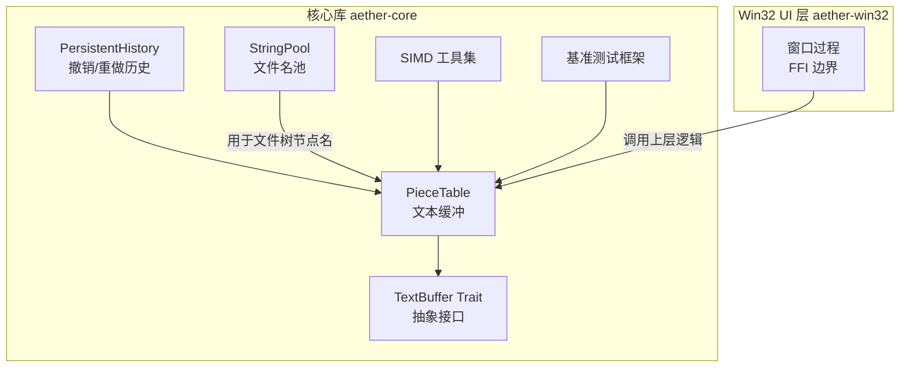
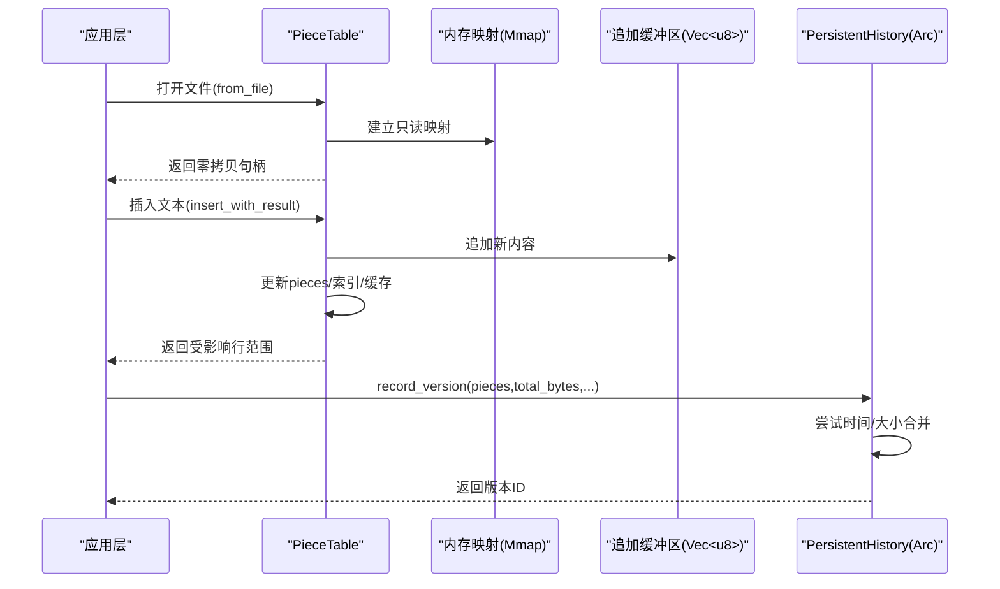
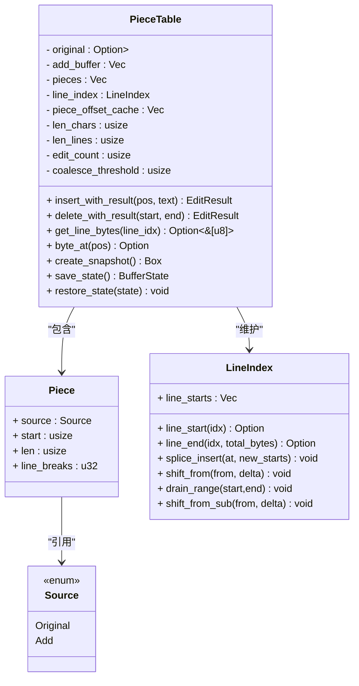
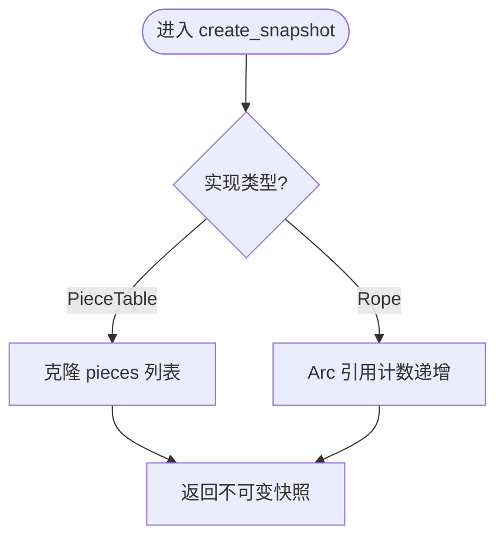
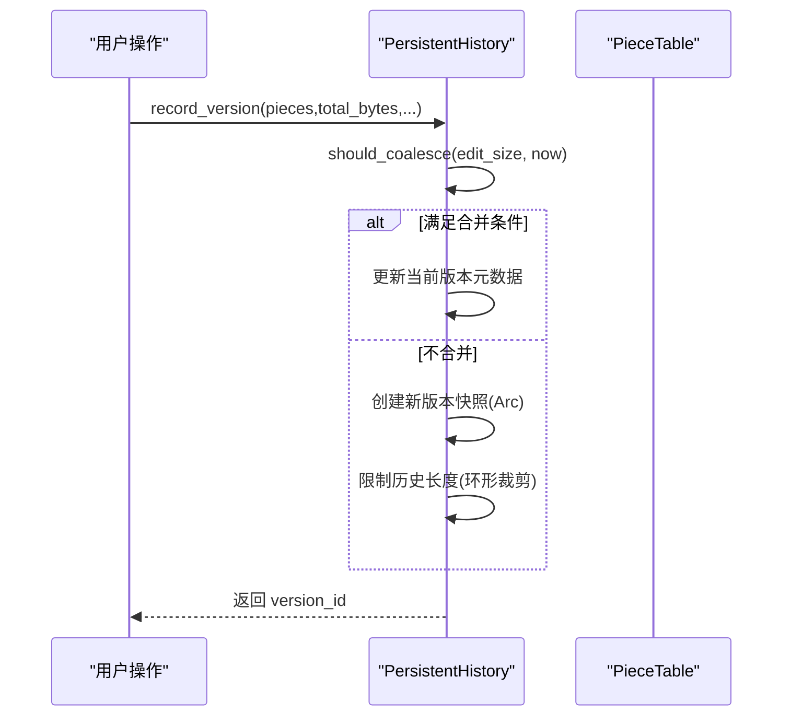
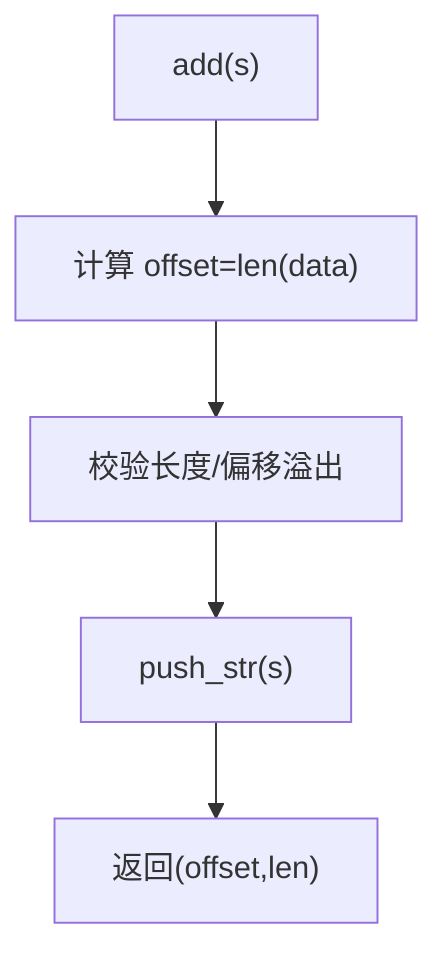
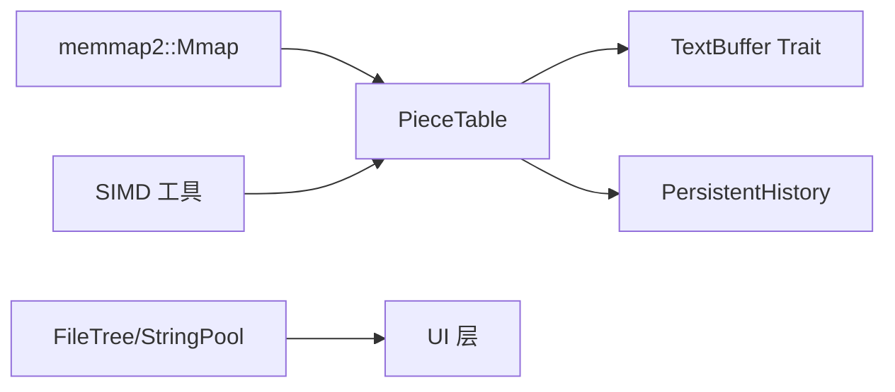

# 内存管理优化

<cite>
**本文引用的文件**
- [Cargo.toml](file://Cargo.toml)
- [README.md](file://README.md)
- [piece_table.rs](file://crates/aether-core/src/buffer/piece_table.rs)
- [text_buffer.rs](file://crates/aether-core/src/buffer/text_buffer.rs)
- [file_tree.rs](file://crates/aether-core/src/workspace/file_tree.rs)
- [persistent_history.rs](file://crates/aether-core/src/persistent_history.rs)
- [simd_utils.rs](file://crates/aether-core/src/simd_utils.rs)
- [benchmarks.rs](file://crates/aether-core/src/benchmarks.rs)
- [benchmark.rs](file://crates/aether-core/examples/benchmark.rs)
- [perf_test.rs](file://crates/aether-core/examples/perf_test.rs)
- [window_proc 片段](file://crates/aether-win32/src/window.rs)
</cite>

## 目录
1. [引言](#引言)
2. [项目结构](#项目结构)
3. [核心组件](#核心组件)
4. [架构总览](#架构总览)
5. [详细组件分析](#详细组件分析)
6. [依赖关系分析](#依赖关系分析)
7. [性能与内存特性](#性能与内存特性)
8. [故障排查指南](#故障排查指南)
9. [结论](#结论)
10. [附录](#附录)

## 引言
本专题聚焦牧羊人编辑器的内存管理优化，围绕 Rust 所有权模型在编辑器中的落地实践展开：包括生命周期与借用检查的优化使用、对象池/内存复用策略、垃圾回收替代方案（零拷贝与共享引用）、内存泄漏检测与预防机制，以及大型项目中基于基准测试与运行时监控的调优经验。文档以 Piece Table 文本缓冲为核心，结合持久化历史、字符串池、SIMD 加速工具与 Win32 窗口过程边界安全等关键实现，给出可操作的优化路径与诊断方法。

## 项目结构
仓库采用 Cargo Workspace 组织，按职责拆分为多个 Crate。与内存管理密切相关的模块集中在 aether-core（文本缓冲、历史、词法、SIMD 工具）与 aether-win32（UI 层与 FFI 边界）。

图表来源
- [piece_table.rs:1-168](file://crates/aether-core/src/buffer/piece_table.rs#L1-L168)
- [text_buffer.rs:1-49](file://crates/aether-core/src/buffer/text_buffer.rs#L1-L49)
- [persistent_history.rs:1-50](file://crates/aether-core/src/persistent_history.rs#L1-L50)
- [file_tree.rs:52-76](file://crates/aether-core/src/workspace/file_tree.rs#L52-L76)
- [simd_utils.rs:1-82](file://crates/aether-core/src/simd_utils.rs#L1-L82)
- [benchmarks.rs:1-87](file://crates/aether-core/src/benchmarks.rs#L1-L87)
- [window_proc 片段:301-317](file://crates/aether-win32/src/window.rs#L301-L317)

章节来源
- [Cargo.toml:1-32](file://Cargo.toml#L1-L32)
- [README.md:29-46](file://README.md#L29-L46)

## 核心组件
- Piece Table 文本缓冲：通过“原始只读映射 + 追加缓冲区”的双缓冲设计，配合片段表与前缀和缓存，实现 O(1) 插入/删除、零拷贝读取与大文件高效打开。
- TextBuffer 抽象：统一字节偏移语义与不可变快照能力，便于后台线程安全访问与多实现解耦。
- PersistentHistory 版本历史：利用 Arc 共享 pieces 与只追加 add_buffer，实现低开销的撤销/重做与时间/大小合并。
- StringPool 字符串池：集中存储短字符串（如文件名），以偏移+长度形式避免重复分配。
- SIMD 工具集：批量查找换行符、空白跳过、前缀匹配等，减少循环开销并提升热点路径吞吐。
- 基准测试框架：提供统一的运行器与结果报告，支撑持续回归与优化验证。

章节来源
- [piece_table.rs:11-34](file://crates/aether-core/src/buffer/piece_table.rs#L11-L34)
- [text_buffer.rs:1-49](file://crates/aether-core/src/buffer/text_buffer.rs#L1-L49)
- [persistent_history.rs:7-50](file://crates/aether-core/src/persistent_history.rs#L7-L50)
- [file_tree.rs:52-76](file://crates/aether-core/src/workspace/file_tree.rs#L52-L76)
- [simd_utils.rs:1-82](file://crates/aether-core/src/simd_utils.rs#L1-L82)
- [benchmarks.rs:11-53](file://crates/aether-core/src/benchmarks.rs#L11-L53)

## 架构总览
从内存视角看，系统遵循“零拷贝优先、共享引用最小化、按需拼接”的原则：
- 大文件打开：使用内存映射（Mmap）作为只读源，避免整份拷贝。
- 编辑写入：新增内容仅追加到 add_buffer，不修改原数据；片段表指向不同来源。
- 历史快照：Arc<Vec<Piece>> 共享片段元数据，add_buffer 只增不减，天然支持持久化。
- 渲染与读取：优先返回切片引用，跨片段时再回退拼接，减少中间分配。
- 字符串池：将高频短串集中存放，降低堆碎片与分配次数。

图表来源
- [piece_table.rs:143-168](file://crates/aether-core/src/buffer/piece_table.rs#L143-L168)
- [piece_table.rs:171-282](file://crates/aether-core/src/buffer/piece_table.rs#L171-L282)
- [persistent_history.rs:66-136](file://crates/aether-core/src/persistent_history.rs#L66-L136)

## 详细组件分析

### Piece Table 文本缓冲
- 数据结构
  - original: Option<Arc<Mmap>>，只读大文件映射，Arc 共享避免快照拷贝。
  - add_buffer: Vec<u8>，只追加不收缩，所有历史版本共享。
  - pieces: Vec<Piece>，有序片段表，指向 original 或 add_buffer。
  - piece_offset_cache: Vec<usize>，前缀和缓存，O(1) 获取总字节数与定位片段。
  - line_index: LineIndex，每行起始字节位置，支持增量更新。
- 关键优化点
  - 零拷贝读取：get_line_bytes/get_text_bytes 尽量返回切片引用，跨片段才拼接。
  - 预分配与扩容：insert 时对 add_buffer 进行容量预估与 reserve，减少重新分配。
  - 自动合并阈值：edit_count 达到阈值后触发 coalesce_pieces，控制碎片数量。
  - 行索引增量维护：update_line_index_for_insert/update_line_index_for_delete 原地 splice/shift，避免全量重建。
  - 字节级快速访问：byte_at 利用二分查找定位片段，避免 String 分配。
- 复杂度与空间
  - 插入/删除：片段表操作为 O(k)（k 为受影响的片段数），配合前缀和缓存使定位接近 O(log n)。
  - 空间：original 与 add_buffer 共享，历史版本仅持有 Arc 引用，额外开销小。

图表来源
- [piece_table.rs:11-56](file://crates/aether-core/src/buffer/piece_table.rs#L11-L56)
- [piece_table.rs:582-641](file://crates/aether-core/src/buffer/piece_table.rs#L582-L641)
- [piece_table.rs:666-710](file://crates/aether-core/src/buffer/piece_table.rs#L666-L710)
- [piece_table.rs:712-780](file://crates/aether-core/src/buffer/piece_table.rs#L712-L780)

章节来源
- [piece_table.rs:11-34](file://crates/aether-core/src/buffer/piece_table.rs#L11-L34)
- [piece_table.rs:143-168](file://crates/aether-core/src/buffer/piece_table.rs#L143-L168)
- [piece_table.rs:171-282](file://crates/aether-core/src/buffer/piece_table.rs#L171-L282)
- [piece_table.rs:430-461](file://crates/aether-core/src/buffer/piece_table.rs#L430-L461)
- [piece_table.rs:496-514](file://crates/aether-core/src/buffer/piece_table.rs#L496-L514)
- [piece_table.rs:582-641](file://crates/aether-core/src/buffer/piece_table.rs#L582-L641)
- [piece_table.rs:666-710](file://crates/aether-core/src/buffer/piece_table.rs#L666-L710)
- [piece_table.rs:712-780](file://crates/aether-core/src/buffer/piece_table.rs#L712-L780)
- [piece_table.rs:1268-1307](file://crates/aether-core/src/buffer/piece_table.rs#L1268-L1307)

### TextBuffer 抽象与快照
- 设计要点
  - 统一字节偏移语义，屏蔽底层实现差异。
  - 提供 create_snapshot 创建不可变快照，供后台线程安全读取。
  - 保存/恢复状态用于 Undo/Redo 的轻量元数据序列化。
- 内存影响
  - 快照对 PieceTable 是轻量的 pieces 列表克隆；对 Rope 可为 Arc 引用计数递增。
  - BufferState 仅序列化片段元数据，不包含实际文本内容，显著降低持久化开销。

图表来源
- [text_buffer.rs:1-49](file://crates/aether-core/src/buffer/text_buffer.rs#L1-L49)
- [text_buffer.rs:61-81](file://crates/aether-core/src/buffer/text_buffer.rs#L61-L81)

章节来源
- [text_buffer.rs:1-49](file://crates/aether-core/src/buffer/text_buffer.rs#L1-L49)
- [text_buffer.rs:61-81](file://crates/aether-core/src/buffer/text_buffer.rs#L61-L81)

### PersistentHistory 版本历史
- 设计要点
  - 环形缓冲区维护历史版本，当前索引指向最新版本。
  - 记录新版本时根据编辑大小与时间窗口尝试合并，减少历史膨胀。
  - 使用 Arc<Vec<Piece>> 共享片段元数据，add_buffer 只追加不删除，天然持久化。
- 内存影响
  - 每个版本仅增加 Arc 引用与少量元数据，内存增长可控。
  - 溢出时优先保留当前版本附近条目，保证用户可撤销能力。

图表来源
- [persistent_history.rs:66-136](file://crates/aether-core/src/persistent_history.rs#L66-L136)
- [persistent_history.rs:138-155](file://crates/aether-core/src/persistent_history.rs#L138-L155)

章节来源
- [persistent_history.rs:7-50](file://crates/aether-core/src/persistent_history.rs#L7-L50)
- [persistent_history.rs:66-136](file://crates/aether-core/src/persistent_history.rs#L66-L136)
- [persistent_history.rs:138-155](file://crates/aether-core/src/persistent_history.rs#L138-L155)

### StringPool 字符串池
- 设计要点
  - 单块连续内存存储短字符串，返回 (offset, len) 元组。
  - 添加时进行溢出检查，避免静默截断导致后续 get 越界。
- 内存影响
  - 减少重复分配与碎片，适合大量短字符串场景（如文件名）。

图表来源
- [file_tree.rs:52-76](file://crates/aether-core/src/workspace/file_tree.rs#L52-L76)

章节来源
- [file_tree.rs:52-76](file://crates/aether-core/src/workspace/file_tree.rs#L52-L76)

### SIMD 工具集与热点路径
- 功能
  - 批量查找换行符、空白跳过、前缀匹配、字符分类等。
  - 使用 SWAR 技巧与逐字节验证，避免假阳性。
- 内存影响
  - 纯栈上处理，无堆分配；显著提升热点路径吞吐，间接降低因频繁分配导致的抖动。

章节来源
- [simd_utils.rs:1-82](file://crates/aether-core/src/simd_utils.rs#L1-L82)
- [simd_utils.rs:84-171](file://crates/aether-core/src/simd_utils.rs#L84-L171)
- [simd_utils.rs:173-258](file://crates/aether-core/src/simd_utils.rs#L173-L258)
- [simd_utils.rs:276-335](file://crates/aether-core/src/simd_utils.rs#L276-L335)

### Win32 窗口过程边界安全
- 设计要点
  - 窗口过程为 FFI 边界，任何 panic 穿越均为未定义行为。
  - 使用 catch_unwind 包裹整个函数体，异常时回退到默认处理，保障进程稳定。
- 内存影响
  - 防止崩溃导致的资源泄露与状态不一致，间接提升内存稳定性。

章节来源
- [window_proc 片段:301-317](file://crates/aether-win32/src/window.rs#L301-L317)

## 依赖关系分析
- 模块耦合
  - PieceTable 依赖 memmap2::Mmap 与 SIMD 工具，提供 TextBuffer 实现。
  - PersistentHistory 依赖 PieceTable 的片段元数据，通过 Arc 共享。
  - FileTree 的 StringPool 独立于文本缓冲，但常用于 UI 层展示。
- 外部依赖
  - memmap2：用于大文件零拷贝映射。
  - serde_json：用于调试协议（DAP）序列化（非内存热点）。
- 潜在循环依赖
  - 当前结构清晰，未见循环导入；历史与缓冲之间为单向依赖。

图表来源
- [piece_table.rs:1-10](file://crates/aether-core/src/buffer/piece_table.rs#L1-L10)
- [text_buffer.rs:1-49](file://crates/aether-core/src/buffer/text_buffer.rs#L1-L49)
- [persistent_history.rs:1-6](file://crates/aether-core/src/persistent_history.rs#L1-L6)
- [file_tree.rs:52-76](file://crates/aether-core/src/workspace/file_tree.rs#L52-L76)

章节来源
- [piece_table.rs:1-10](file://crates/aether-core/src/buffer/piece_table.rs#L1-L10)
- [text_buffer.rs:1-49](file://crates/aether-core/src/buffer/text_buffer.rs#L1-L49)
- [persistent_history.rs:1-6](file://crates/aether-core/src/persistent_history.rs#L1-L6)
- [file_tree.rs:52-76](file://crates/aether-core/src/workspace/file_tree.rs#L52-L76)

## 性能与内存特性
- 零拷贝与共享
  - 大文件打开使用内存映射，避免整份拷贝；快照通过 Arc 共享片段元数据。
- 分配策略
  - add_buffer 预分配与幂次扩容，减少 Vec 重新分配次数。
  - 字符串池集中存储短串，降低堆碎片。
- 算法优化
  - 前缀和缓存使总字节数与片段定位接近 O(1)/O(log n)。
  - 行索引增量更新避免全量重建。
  - SIMD 批量处理热点路径，减少循环开销。
- 基准与回归
  - 提供统一基准框架与示例入口，便于持续验证优化效果。

章节来源
- [piece_table.rs:171-282](file://crates/aether-core/src/buffer/piece_table.rs#L171-L282)
- [piece_table.rs:430-461](file://crates/aether-core/src/buffer/piece_table.rs#L430-L461)
- [piece_table.rs:666-710](file://crates/aether-core/src/buffer/piece_table.rs#L666-L710)
- [simd_utils.rs:1-82](file://crates/aether-core/src/simd_utils.rs#L1-L82)
- [benchmarks.rs:55-87](file://crates/aether-core/src/benchmarks.rs#L55-L87)
- [benchmark.rs:1-18](file://crates/aether-core/examples/benchmark.rs#L1-L18)
- [perf_test.rs:1-18](file://crates/aether-core/examples/perf_test.rs#L1-L18)

## 故障排查指南
- 内存泄漏检测与预防
  - 静态分析：启用 Clippy 与严格警告，避免不安全别名与潜在越界。
  - 运行时监控：使用 Windows 任务管理器/PerfMon 观察进程内存曲线；结合 GUI 冒烟脚本采集初始性能指标。
  - 覆盖率辅助：通过 llvm-cov 生成覆盖率报告，识别未覆盖路径中的潜在风险。
- 常见症状与定位
  - 峰值内存异常：检查 add_buffer 是否过度增长，确认 coalesce 阈值与历史合并策略。
  - 卡顿与抖动：关注 get_text 拼接路径是否频繁触发，考虑扩大零拷贝命中面。
  - 崩溃与不稳定：审查 FFI 边界（窗口过程）是否使用 catch_unwind 保护。
- 诊断流程建议
  - 复现步骤 → 开启日志与统计 → 采集内存快照 → 对比基准结果 → 定位热点路径 → 实施优化 → 回归验证。

章节来源
- [README.md:92-122](file://README.md#L92-L122)
- [generate_coverage_report.ps1:1-56](file://tests/generate_coverage_report.ps1#L1-L56)
- [gui_probe.py:129-162](file://tests/gui_probe.py#L129-L162)
- [window_proc 片段:301-317](file://crates/aether-win32/src/window.rs#L301-L317)

## 结论
本项目在内存管理方面体现了 Rust 所有权模型的优势：通过零拷贝、共享引用与只追加策略，在保证安全性的同时实现了高性能与低延迟。Piece Table 的前缀和缓存、行索引增量更新与 SIMD 加速共同构成高效的文本处理管线；PersistentHistory 借助 Arc 与只追加 add_buffer 实现低成本的历史管理；StringPool 进一步降低短串分配成本。配合严格的 FFI 边界防护与完善的基准测试体系，项目在大型工程实践中具备良好的可扩展性与可维护性。

## 附录
- 构建与发布配置
  - LTO、代码生成单元、优化等级与 panic 策略等均在 workspace 中统一配置，有助于减小二进制体积与提升性能。
- 常用命令
  - 构建 GUI 主程序与 CLI 工具、运行基准测试、执行冒烟测试与覆盖率报告生成。

章节来源
- [Cargo.toml:24-32](file://Cargo.toml#L24-L32)
- [README.md:57-88](file://README.md#L57-L88)
- [README.md:92-122](file://README.md#L92-L122)