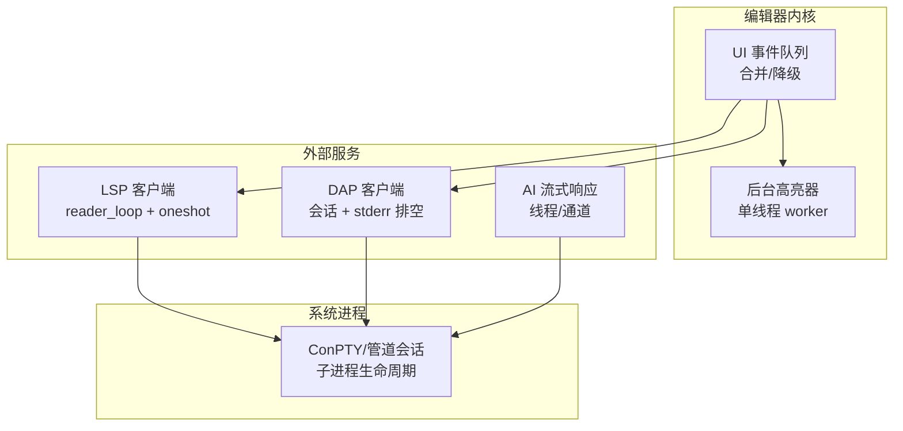
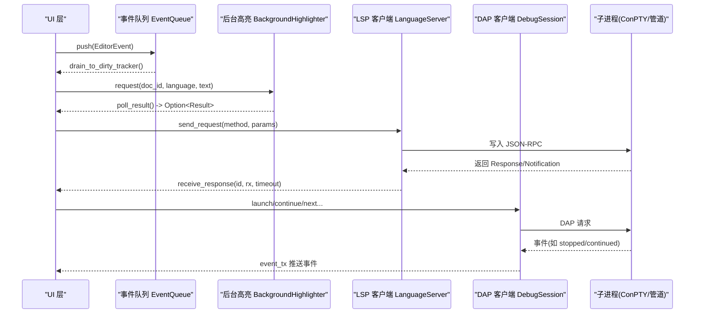
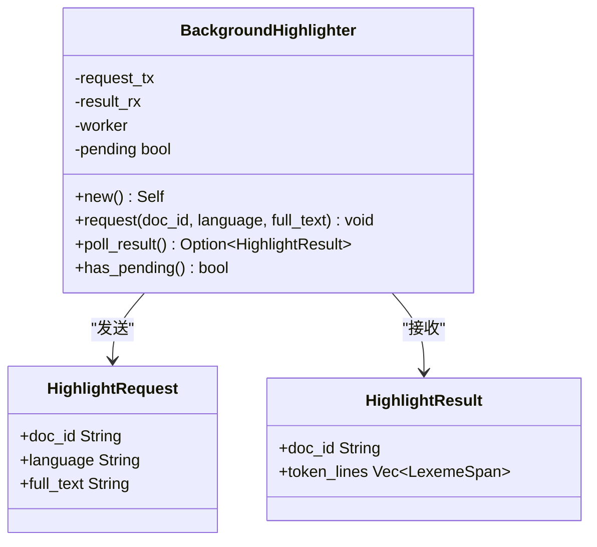
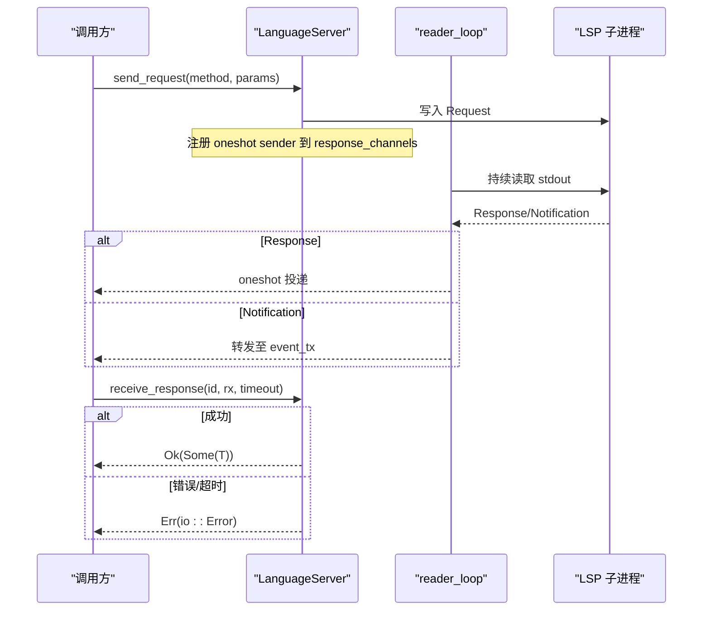
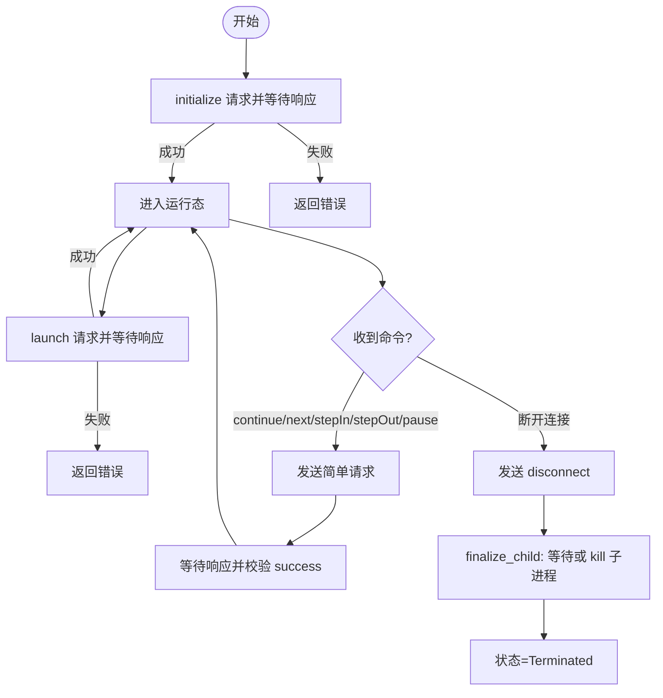
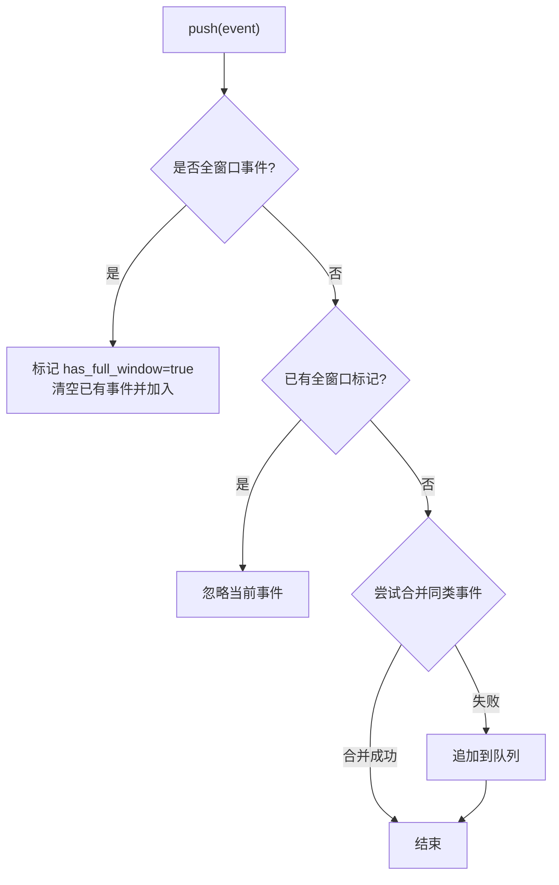
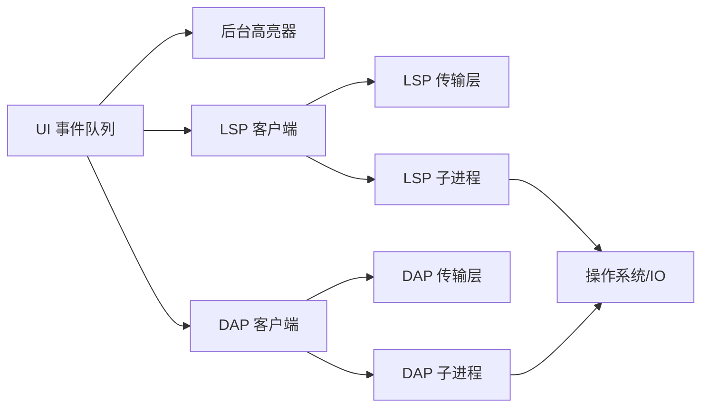

# 任务调度优化

<cite>
**本文引用的文件**   
- [background.rs](file://crates/aether-tree-sitter/src/background.rs)
- [server.rs](file://crates/aether-lsp/src/server.rs)
- [transport.rs](file://crates/aether-lsp/src/transport.rs)
- [session.rs](file://crates/aether-dap/src/session.rs)
- [events.rs](file://crates/aether-win32/src/events.rs)
- [conpty.rs](file://crates/aether-win32/src/conpty.rs)
- [lib.rs](file://crates/aether-ai/src/lib.rs)
</cite>

## 目录
1. [引言](#引言)
2. [项目结构](#项目结构)
3. [核心组件](#核心组件)
4. [架构总览](#架构总览)
5. [详细组件分析](#详细组件分析)
6. [依赖关系分析](#依赖关系分析)
7. [性能考量](#性能考量)
8. [故障排查指南](#故障排查指南)
9. [结论](#结论)
10. [附录](#附录)

## 引言
本文件面向牧羊人编辑器的“后台任务调度与优化”，聚焦以下目标：
- 任务分类与优先级调度机制（含队列实现与动态优先级调整）
- 资源限制策略（CPU、内存、并发度）
- 错误恢复机制（重试、状态持久化、故障转移）
- 监控与调试工具（执行时间统计、资源使用分析、异常追踪）
- 任务间依赖管理与协调（任务链、条件触发、结果共享）
- 任务取消与优雅关闭

通过对代码库中后台高亮、LSP/DAP 会话管理、UI 事件批处理、进程生命周期管理等关键模块的分析，提炼出可复用的调度模式与优化建议。

## 项目结构
本项目采用多 crate 模块化组织，与任务调度相关的核心位置如下：
- aether-tree-sitter：后台语法高亮器（单线程 worker + channel）
- aether-lsp：语言服务器客户端（tokio 异步 reader_loop + oneshot 请求-响应）
- aether-dap：调试适配器客户端（tokio 异步会话 + stderr 排空任务）
- aether-win32：UI 事件队列与合并、ConPTY 子进程生命周期管理
- aether-ai：AI 流式响应与线程池模型（示例性线程创建）

图表来源
- [events.rs:1-200](file://crates/aether-win32/src/events.rs#L1-L200)
- [background.rs:1-126](file://crates/aether-tree-sitter/src/background.rs#L1-L126)
- [server.rs:1-200](file://crates/aether-lsp/src/server.rs#L1-L200)
- [session.rs:1-200](file://crates/aether-dap/src/session.rs#L1-L200)
- [conpty.rs:24-528](file://crates/aether-win32/src/conpty.rs#L24-L528)

章节来源
- [events.rs:1-200](file://crates/aether-win32/src/events.rs#L1-L200)
- [background.rs:1-126](file://crates/aether-tree-sitter/src/background.rs#L1-L126)
- [server.rs:1-200](file://crates/aether-lsp/src/server.rs#L1-L200)
- [session.rs:1-200](file://crates/aether-dap/src/session.rs#L1-L200)
- [conpty.rs:24-528](file://crates/aether-win32/src/conpty.rs#L24-L528)

## 核心组件
- 后台高亮器（BackgroundHighlighter）
  - 单 worker 线程 + 双向 mpsc 通道；主线程非阻塞 request/poll_result；pending 标志避免重复入队
- LSP 客户端（LanguageServer）
  - tokio 异步 reader_loop 独占 stdout；oneshot 配对请求-响应；超时控制与通知转发
- DAP 客户端（DebugSession）
  - tokio 异步会话；stderr 排空任务；disconnect/detach 后强制回收子进程
- UI 事件队列（EventQueue）
  - 帧内批量收集、同类合并、全窗口覆盖局部事件
- ConPTY/管道会话（ConPtySession）
  - 子进程创建、等待、终止、控制台释放等生命周期管理

章节来源
- [background.rs:1-126](file://crates/aether-tree-sitter/src/background.rs#L1-L126)
- [server.rs:1-200](file://crates/aether-lsp/src/server.rs#L1-L200)
- [session.rs:1-200](file://crates/aether-dap/src/session.rs#L1-L200)
- [events.rs:1-200](file://crates/aether-win32/src/events.rs#L1-L200)
- [conpty.rs:24-528](file://crates/aether-win32/src/conpty.rs#L24-L528)

## 架构总览
下图展示从 UI 到后台任务的典型调用路径与数据流：

图表来源
- [events.rs:1-200](file://crates/aether-win32/src/events.rs#L1-L200)
- [background.rs:1-126](file://crates/aether-tree-sitter/src/background.rs#L1-L126)
- [server.rs:1-200](file://crates/aether-lsp/src/server.rs#L1-L200)
- [session.rs:1-200](file://crates/aether-dap/src/session.rs#L1-L200)

## 详细组件分析

### 后台高亮器（BackgroundHighlighter）
- 设计要点
  - 单 worker 线程串行处理请求，避免解析器状态竞争
  - pending 标志 + try_recv 排空旧结果，确保最新语义
  - 非阻塞 API：request/poll_result/has_pending
- 复杂度与性能
  - 请求入队 O(1)，结果轮询 O(k)（k 为残留旧结果数，通常很小）
  - 通过跳过重复请求降低 CPU 抖动
- 错误处理
  - 发送失败即退出循环，防止主线程关闭后泄漏
- 扩展建议
  - 引入优先级队列（按文档活跃度/可见性打分）
  - 增加退避与节流（高频输入时延迟入队）

图表来源
- [background.rs:1-126](file://crates/aether-tree-sitter/src/background.rs#L1-L126)

章节来源
- [background.rs:1-126](file://crates/aether-tree-sitter/src/background.rs#L1-L126)

### LSP 客户端（LanguageServer）
- 设计要点
  - reader_loop 独占 stdout，避免读写互锁
  - oneshot 通道将响应精准投递给对应请求
  - 默认请求超时与 initialize 更长超时
- 并发与资源
  - JoinHandle 持有 reader task，Drop 时 abort 防泄漏
  - stderr 单独排空任务，避免缓冲区满导致阻塞
- 错误处理
  - 超时/EOF/JSON 解析错误均转为 io::Error，携带明确信息
- 扩展建议
  - 增加请求去重与合并（相同方法+参数短时间内合并）
  - 基于活跃度的动态优先级（前台文档优先）

图表来源
- [server.rs:1-200](file://crates/aether-lsp/src/server.rs#L1-L200)
- [transport.rs:1-200](file://crates/aether-lsp/src/transport.rs#L1-L200)

章节来源
- [server.rs:1-200](file://crates/aether-lsp/src/server.rs#L1-L200)
- [transport.rs:1-200](file://crates/aether-lsp/src/transport.rs#L1-L200)

### DAP 客户端（DebugSession）
- 设计要点
  - 启动/初始化/launch 等流程带超时保护
  - disconnect/detach 后等待子进程退出，超时则 kill
  - stderr 排空任务在 finalize_child 中主动 abort
- 状态机
  - 已终止会话忽略除 terminated/exited 之外的延迟事件，防止“复活”
- 扩展建议
  - 对长时间操作（如编译）提供可中断的上下文（CancellationToken）
  - 断点设置失败时的重试与回退策略

图表来源
- [session.rs:1-200](file://crates/aether-dap/src/session.rs#L1-L200)

章节来源
- [session.rs:1-200](file://crates/aether-dap/src/session.rs#L1-L200)

### UI 事件队列（EventQueue）
- 设计要点
  - 帧内批量收集，减少渲染抖动
  - 全窗口事件覆盖局部事件；同类事件合并（滚动、光标移动、选择变化、文本变更行范围合并）
- 扩展建议
  - 引入优先级（如 WindowResized 最高），支持动态权重
  - 结合脏矩形追踪器进行区域级增量渲染

图表来源
- [events.rs:1-200](file://crates/aether-win32/src/events.rs#L1-L200)

章节来源
- [events.rs:1-200](file://crates/aether-win32/src/events.rs#L1-L200)

### 子进程生命周期（ConPtySession）
- 设计要点
  - 统一封装 ConPTY/管道后端
  - Drop 时等待子进程退出，必要时 TerminateProcess，并释放控制台
- 扩展建议
  - 增加优雅停止信号（SIGTERM/SIGINT）与二次强制终止
  - 记录退出码与日志，便于诊断

章节来源
- [conpty.rs:24-528](file://crates/aether-win32/src/conpty.rs#L24-L528)

### AI 流式响应（示例）
- 设计要点
  - 使用线程与通道组合处理流式响应体，限制最大大小，截断错误消息长度
- 扩展建议
  - 接入统一的后台任务池，限制并发与内存上限
  - 增加背压与速率限制

章节来源
- [lib.rs:398-431](file://crates/aether-ai/src/lib.rs#L398-L431)

## 依赖关系分析
- 组件耦合
  - UI 事件队列与渲染解耦，仅通过事件类型与脏区域协作
  - LSP/DAP 客户端与子进程通过传输层抽象（stdio）通信，reader_loop 独占读端
  - 后台高亮器与 UI 通过通道解耦，无共享可变状态
- 外部依赖
  - tokio（异步运行时、task、process、sync）
  - std::sync::mpsc（同步通道用于高亮器）
  - Windows API（ConPTY 相关）

图表来源
- [events.rs:1-200](file://crates/aether-win32/src/events.rs#L1-L200)
- [background.rs:1-126](file://crates/aether-tree-sitter/src/background.rs#L1-L126)
- [server.rs:1-200](file://crates/aether-lsp/src/server.rs#L1-L200)
- [transport.rs:1-200](file://crates/aether-lsp/src/transport.rs#L1-L200)
- [session.rs:1-200](file://crates/aether-dap/src/session.rs#L1-L200)

章节来源
- [events.rs:1-200](file://crates/aether-win32/src/events.rs#L1-L200)
- [background.rs:1-126](file://crates/aether-tree-sitter/src/background.rs#L1-L126)
- [server.rs:1-200](file://crates/aether-lsp/src/server.rs#L1-L200)
- [transport.rs:1-200](file://crates/aether-lsp/src/transport.rs#L1-L200)
- [session.rs:1-200](file://crates/aether-dap/src/session.rs#L1-L200)

## 性能考量
- 任务分类与优先级
  - 建议将任务分为：交互型（UI 事件）、解析型（高亮/索引）、网络型（LSP/DAP/AI）、系统型（文件 I/O）
  - 为交互型赋予最高优先级，解析型次之，网络型根据活跃文档动态调整
- 资源限制
  - CPU：为解析类任务设置时间片与退避；在网络 IO 上避免忙等
  - 内存：对大消息（LSP Header/Body、AI 响应体）设置上限并快速失败
  - 并发：限制后台 worker 数量（例如高亮器单 worker，LSP/DAP 各一 reader_loop）
- 批处理与合并
  - UI 事件合并减少重绘；高亮器跳过重复请求；LSP 请求去重
- 背压与限流
  - 当下游消费慢时，上游应降速或丢弃低优先级任务

[本节为通用指导，不直接分析具体文件]

## 故障排查指南
- 常见症状与定位
  - UI 卡顿：检查高亮器 pending 标志与 poll_result 是否被频繁调用；确认是否有大量未合并事件
  - LSP 无响应：查看 reader_loop 是否存活、response_channels 是否泄漏、是否发生超时
  - DAP 僵尸进程：确认 disconnect/detach 后 finalize_child 是否执行、stderr 排空任务是否 abort
  - 子进程卡死：检查 ConPTY 等待与终止逻辑，确认是否释放控制台句柄
- 建议的诊断手段
  - 为关键路径添加耗时埋点（请求/响应、解析、渲染）
  - 输出事件队列长度与合并统计
  - 记录子进程退出码与错误日志
  - 对大消息进行尺寸限制与告警

章节来源
- [server.rs:1-200](file://crates/aether-lsp/src/server.rs#L1-L200)
- [session.rs:1-200](file://crates/aether-dap/src/session.rs#L1-L200)
- [conpty.rs:24-528](file://crates/aether-win32/src/conpty.rs#L24-L528)
- [events.rs:1-200](file://crates/aether-win32/src/events.rs#L1-L200)

## 结论
本项目在后台任务调度方面已形成若干成熟模式：
- 单 worker + 通道的轻量后台任务（高亮器）
- 异步 reader_loop + oneshot 的请求-响应模型（LSP/DAP）
- UI 事件帧内合并与降级（EventQueue）
- 子进程生命周期统一管理（ConPtySession）

在此基础上，可通过引入优先级队列、动态优先级、背压与限流、更完善的监控与诊断能力，进一步提升稳定性与用户体验。

[本节为总结，不直接分析具体文件]

## 附录

### 任务分类与优先级建议
- 交互型：UI 事件、用户输入（最高优先级）
- 解析型：语法高亮、索引构建（中等优先级，可退避）
- 网络型：LSP/DAP/AI（按活跃文档动态调整）
- 系统型：文件 I/O、磁盘扫描（低优先级，批量处理）

[本节为概念性内容，不直接分析具体文件]

### 任务取消与优雅关闭方案
- 使用 CancellationToken 贯穿调用链，支持中断长时间任务
- 在 Drop/关闭路径中：
  - 中止 reader_loop 与 stderr 排空任务
  - 向子进程发送优雅停止信号，超时后强制终止
  - 清理通道与句柄，避免泄漏

[本节为概念性内容，不直接分析具体文件]