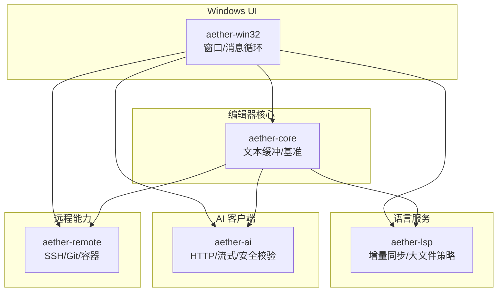
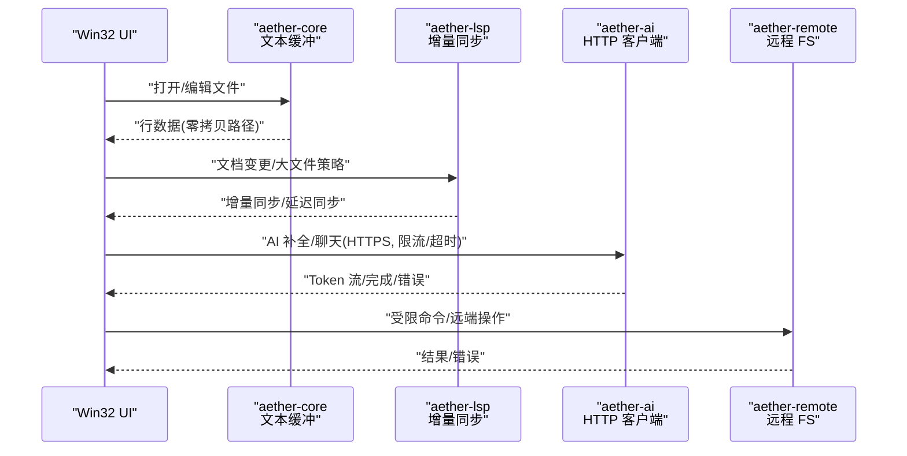
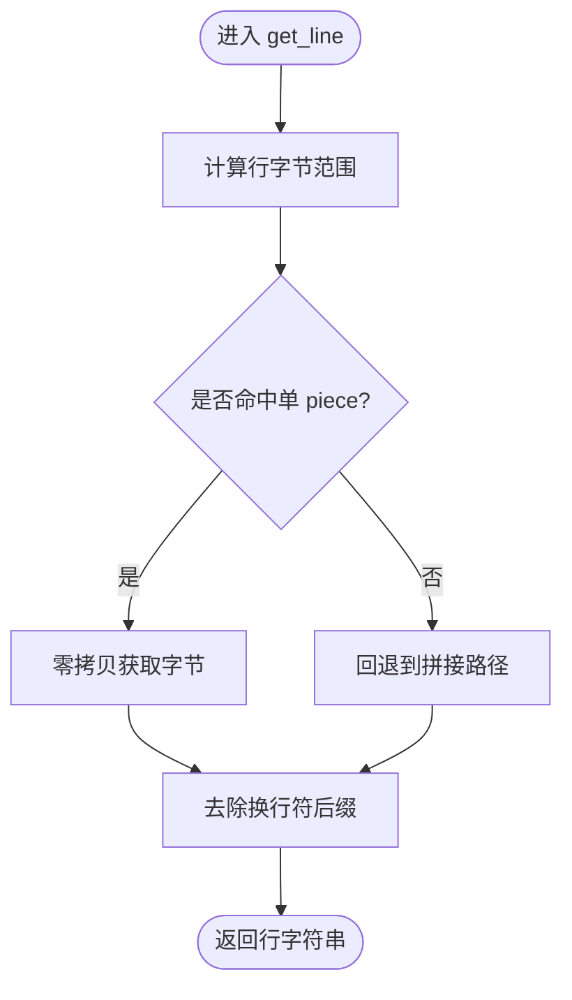
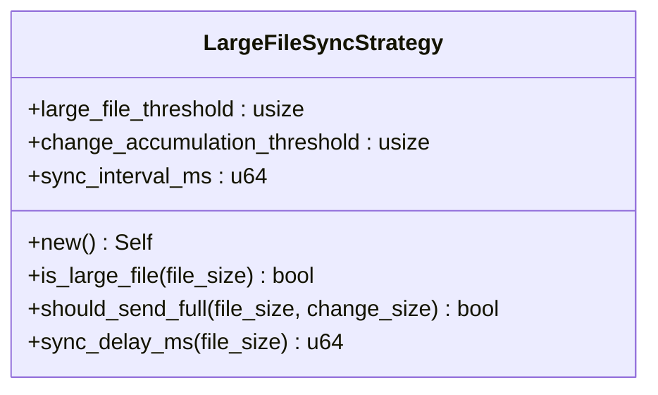
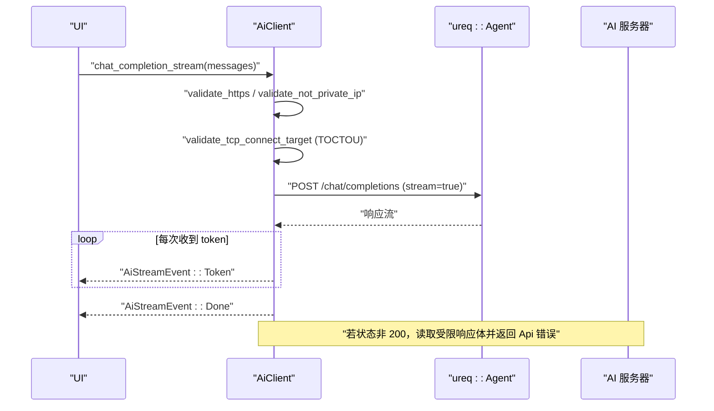
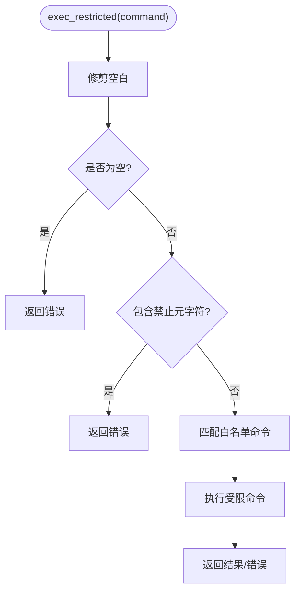
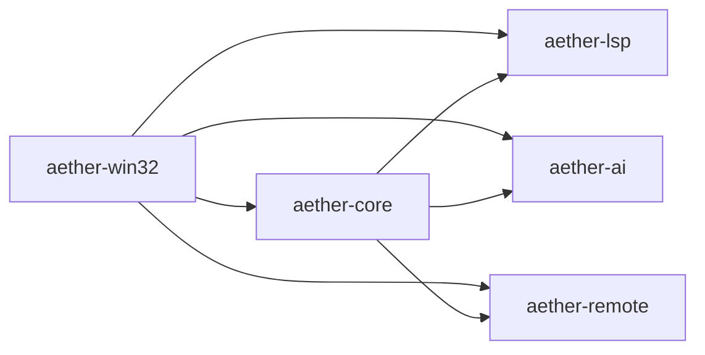
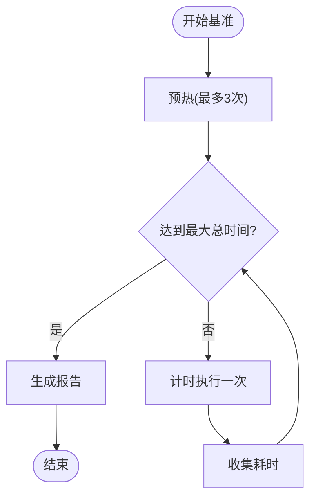

# 异步 IO 优化

<cite>
**本文引用的文件**   
- [README.md](file://README.md)
- [aether-core/src/buffer/piece_table.rs](file://crates/aether-core/src/buffer/piece_table.rs)
- [aether-core/src/benchmarks.rs](file://crates/aether-core/src/benchmarks.rs)
- [aether-lsp/src/incremental_sync.rs](file://crates/aether-lsp/src/incremental_sync.rs)
- [aether-ai/src/lib.rs](file://crates/aether-ai/src/lib.rs)
- [aether-remote/src/remote_fs.rs](file://crates/aether-remote/src/remote_fs.rs)
</cite>

## 目录
1. [引言](#引言)
2. [项目结构](#项目结构)
3. [核心组件](#核心组件)
4. [架构总览](#架构总览)
5. [详细组件分析](#详细组件分析)
6. [依赖分析](#依赖分析)
7. [性能考量](#性能考量)
8. [故障排查指南](#故障排查指南)
9. [结论](#结论)
10. [附录](#附录)

## 引言
本专题聚焦牧羊人编辑器的异步 IO 优化，围绕以下目标展开：
- 文件操作的异步化实现：大文件读取的分块处理、写入缓冲策略与并发控制机制。
- 网络请求的优化策略：连接池管理、请求重试与超时处理。
- 后台任务调度：任务优先级、资源限制与错误恢复。
- 异步 IO 性能监控：I/O 等待时间统计、吞吐量测量与瓶颈识别。
- 内存泄漏防护与资源清理的最佳实践。

本项目采用 Rust + Win32 API，强调“UI 线程不阻塞”，在 README 的设计原则中明确将文件 IO 与远程操作异步化作为性能优先的关键策略之一。

**章节来源**
- [README.md:164-170](file://README.md#L164-L170)

## 项目结构
仓库以 Cargo Workspace 组织，按职责拆分为多个 Crate。与异步 IO 相关的模块主要分布在：
- aether-core：文本缓冲（Piece Table）、基准测试工具等。
- aether-lsp：增量同步与大文件同步策略。
- aether-ai：HTTP 客户端与安全校验、流式响应。
- aether-remote：SSH/Git/容器远程抽象与受限命令执行。
- aether-win32：UI 层（负责调度与事件循环，具体 IO 逻辑下沉至各 crate）。

[此图为概念性结构示意，无需源码映射]

## 核心组件
- 文本缓冲与行访问路径：通过 Piece Table 提供高效的行读取路径，尽量使用零拷贝或最小分配方式获取行数据，避免跨 piece 时的额外拼接开销。
- LSP 增量同步与大文件策略：针对大文件采用差异化同步策略，包括阈值判断、变更量比例决策与延迟同步间隔。
- AI HTTP 客户端：基于 ureq Agent 构建，设置超时与禁用重定向；对响应体进行分块读取并限制最大大小；支持流式事件回传。
- 远程文件系统：提供受限命令执行白名单与 shell 元字符过滤，保障远程操作的安全性。

**章节来源**
- [aether-core/src/buffer/piece_table.rs:464-495](file://crates/aether-core/src/buffer/piece_table.rs#L464-L495)
- [aether-lsp/src/incremental_sync.rs:307-357](file://crates/aether-lsp/src/incremental_sync.rs#L307-L357)
- [aether-ai/src/lib.rs:239-248](file://crates/aether-ai/src/lib.rs#L239-L248)
- [aether-ai/src/lib.rs:402-424](file://crates/aether-ai/src/lib.rs#L402-L424)
- [aether-remote/src/remote_fs.rs:46-69](file://crates/aether-remote/src/remote_fs.rs#L46-L69)

## 架构总览
下图展示了从 UI 触发到各后端异步 IO 的整体流程，涵盖文件读取、LSP 增量同步、AI 网络请求与远程命令执行。

**图表来源**
- [aether-core/src/buffer/piece_table.rs:464-495](file://crates/aether-core/src/buffer/piece_table.rs#L464-L495)
- [aether-lsp/src/incremental_sync.rs:307-357](file://crates/aether-lsp/src/incremental_sync.rs#L307-L357)
- [aether-ai/src/lib.rs:239-248](file://crates/aether-ai/src/lib.rs#L239-L248)
- [aether-ai/src/lib.rs:402-424](file://crates/aether-ai/src/lib.rs#L402-L424)
- [aether-remote/src/remote_fs.rs:46-69](file://crates/aether-remote/src/remote_fs.rs#L46-L69)

## 详细组件分析

### 文件 I/O 与文本缓冲优化
- 行读取优化：优先使用零拷贝路径获取单行字节范围，仅在跨 piece 时回退到拼接路径，减少不必要的分配。
- 全量文本获取：通过统一接口返回完整文本，便于需要整体处理的场景。
- 建议的异步化扩展：
  - 大文件读取：采用分块读取（如固定大小缓冲区），结合异步任务队列，避免阻塞 UI 线程。
  - 写入缓冲：合并频繁小写为批量写入，降低系统调用次数；必要时使用异步写缓冲器。
  - 并发控制：限制同时进行的文件读写任务数，防止磁盘拥塞；对热点文件引入读缓存与失效策略。

**图表来源**
- [aether-core/src/buffer/piece_table.rs:464-495](file://crates/aether-core/src/buffer/piece_table.rs#L464-L495)

**章节来源**
- [aether-core/src/buffer/piece_table.rs:464-495](file://crates/aether-core/src/buffer/piece_table.rs#L464-L495)

### LSP 增量同步与大文件策略
- 大文件阈值与同步间隔：超过阈值的文件采用延迟同步，降低高频同步带来的负载。
- 变更量比例决策：当变更量超过文件大小一定比例时，选择发送完整内容而非增量，提高服务端处理效率。
- 历史清理：定期清理过期历史记录，控制内存占用。

**图表来源**
- [aether-lsp/src/incremental_sync.rs:307-357](file://crates/aether-lsp/src/incremental_sync.rs#L307-L357)

**章节来源**
- [aether-lsp/src/incremental_sync.rs:307-357](file://crates/aether-lsp/src/incremental_sync.rs#L307-L357)

### AI 网络请求优化与安全
- 连接与超时：使用 ureq::AgentBuilder 设置全局超时，禁用自动重定向以防止 SSRF 风险。
- 响应体限制：分块读取响应体，累计大小超过上限即报错，避免内存暴涨。
- 流式事件：通过通道将 Token/Done/Error 事件推送给 UI，保持交互流畅。
- 安全校验：强制 HTTPS、DNS 解析后校验私有地址、TOCTOU 二次校验、云元数据黑名单。

**图表来源**
- [aether-ai/src/lib.rs:239-248](file://crates/aether-ai/src/lib.rs#L239-L248)
- [aether-ai/src/lib.rs:402-424](file://crates/aether-ai/src/lib.rs#L402-L424)
- [aether-ai/src/lib.rs:710-770](file://crates/aether-ai/src/lib.rs#L710-L770)

**章节来源**
- [aether-ai/src/lib.rs:239-248](file://crates/aether-ai/src/lib.rs#L239-L248)
- [aether-ai/src/lib.rs:402-424](file://crates/aether-ai/src/lib.rs#L402-L424)
- [aether-ai/src/lib.rs:710-770](file://crates/aether-ai/src/lib.rs#L710-L770)

### 远程文件系统与受限命令
- 命令白名单与元字符过滤：拒绝包含危险 shell 元字符的命令，仅允许最小化白名单命令，防止注入攻击。
- 安全边界：将远程操作限定在受控范围内，避免任意代码执行。

**图表来源**
- [aether-remote/src/remote_fs.rs:46-69](file://crates/aether-remote/src/remote_fs.rs#L46-L69)

**章节来源**
- [aether-remote/src/remote_fs.rs:46-69](file://crates/aether-remote/src/remote_fs.rs#L46-L69)

## 依赖分析
- 模块耦合关系：
  - UI 层（aether-win32）作为入口，协调核心、LSP、AI 与远程能力。
  - 核心文本缓冲为 LSP 与 AI 提供上下文数据。
  - LSP 与 AI 均依赖外部协议或服务，需关注超时、重试与错误传播。
  - 远程能力提供 SSH/Git/容器抽象，受限于白名单与安全检查。

[此图为概念性依赖示意，无需源码映射]

## 性能考量
- I/O 等待时间统计：
  - 使用基准框架记录关键路径耗时，输出平均/最小/最大时间与吞吐。
  - 建议在文件读取、LSP 同步、AI 请求等关键路径埋点计时。
- 吞吐量测量：
  - 通过迭代次数与总时长计算 ops/s，评估不同策略（如分块大小、缓冲策略）的效果。
- 瓶颈识别：
  - 观察 UI 卡顿与后台任务排队情况，定位磁盘或网络瓶颈。
  - 对比不同阈值（大文件阈值、同步间隔）对用户体验的影响。

**图表来源**
- [aether-core/src/benchmarks.rs:55-87](file://crates/aether-core/src/benchmarks.rs#L55-L87)

**章节来源**
- [aether-core/src/benchmarks.rs:11-53](file://crates/aether-core/src/benchmarks.rs#L11-L53)
- [aether-core/src/benchmarks.rs:55-87](file://crates/aether-core/src/benchmarks.rs#L55-L87)

## 故障排查指南
- 网络请求失败：
  - 检查 HTTPS 配置与 DNS 解析结果，确认未命中私有地址或云元数据黑名单。
  - 查看错误信息是否被截断，避免大量响应体传入 UI。
- 流式中断：
  - 监听 AiStreamEvent::Error，及时提示用户并重试。
- 远程命令异常：
  - 确认命令是否在白名单内，且不含禁止元字符。
- 大文件同步卡顿：
  - 调整大文件阈值与同步间隔，观察变更比例策略是否合理。

**章节来源**
- [aether-ai/src/lib.rs:239-248](file://crates/aether-ai/src/lib.rs#L239-L248)
- [aether-ai/src/lib.rs:402-424](file://crates/aether-ai/src/lib.rs#L402-L424)
- [aether-remote/src/remote_fs.rs:46-69](file://crates/aether-remote/src/remote_fs.rs#L46-L69)

## 结论
通过对文本缓冲、LSP 增量同步、AI 网络请求与远程能力的深入分析，可以形成一套完整的异步 IO 优化方案：
- 文件 I/O：采用分块读取、批量写入与并发控制，确保 UI 流畅。
- 网络请求：设置超时、禁用重定向、限制响应体大小，并结合流式事件提升体验。
- 后台任务：利用阈值与间隔策略，平衡实时性与资源消耗。
- 性能监控：借助基准框架持续度量关键路径，指导调优。
- 安全与健壮性：严格的安全校验与错误处理，保障系统稳定。

[本节为总结性内容，无需源码映射]

## 附录
- 最佳实践清单：
  - 所有外部 IO 必须异步化，避免阻塞 UI 线程。
  - 对大文件采用分块与延迟策略，对小文件保持即时响应。
  - 网络请求统一配置超时与重定向策略，限制响应体大小。
  - 远程命令严格白名单与元字符过滤，杜绝注入风险。
  - 建立统一的错误分类与脱敏展示，保护敏感信息。
  - 持续使用基准测试跟踪性能变化，设定回归阈值。

[本节为通用指导，无需源码映射]