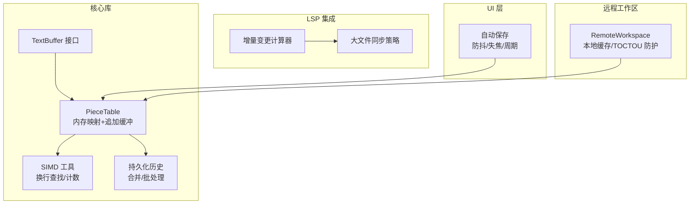
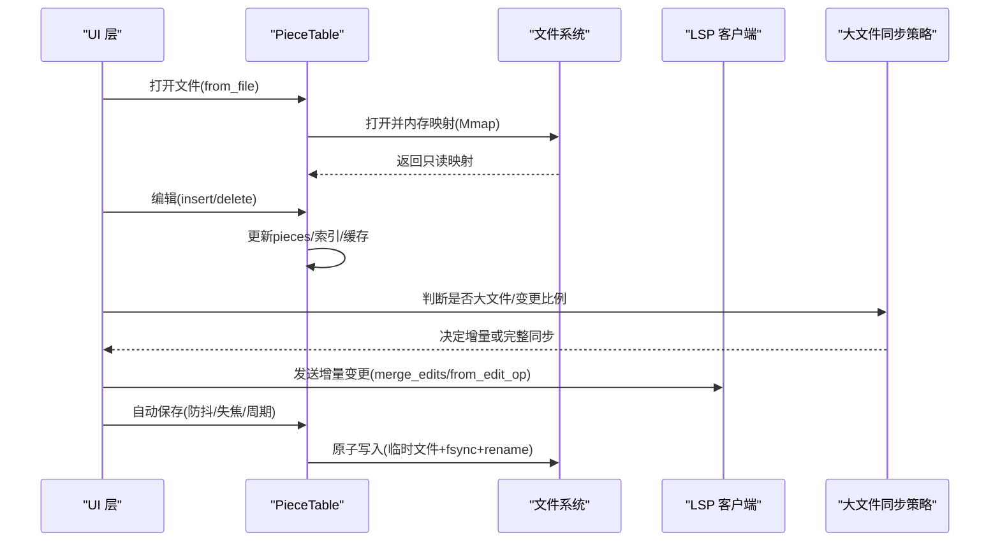
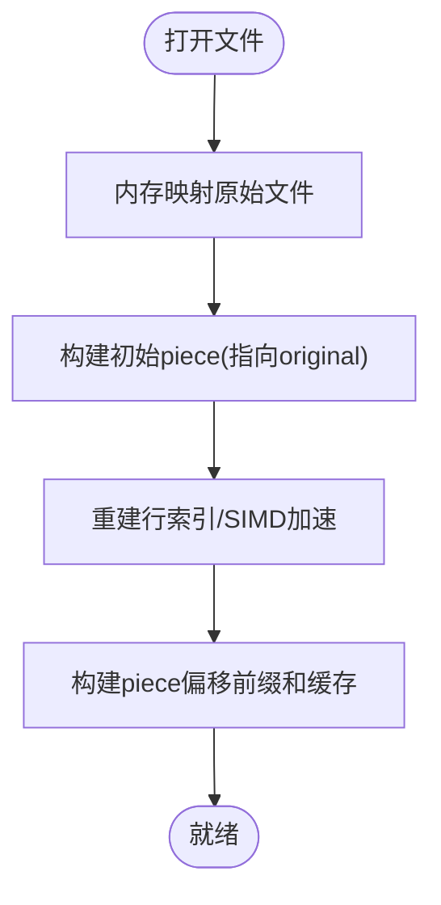
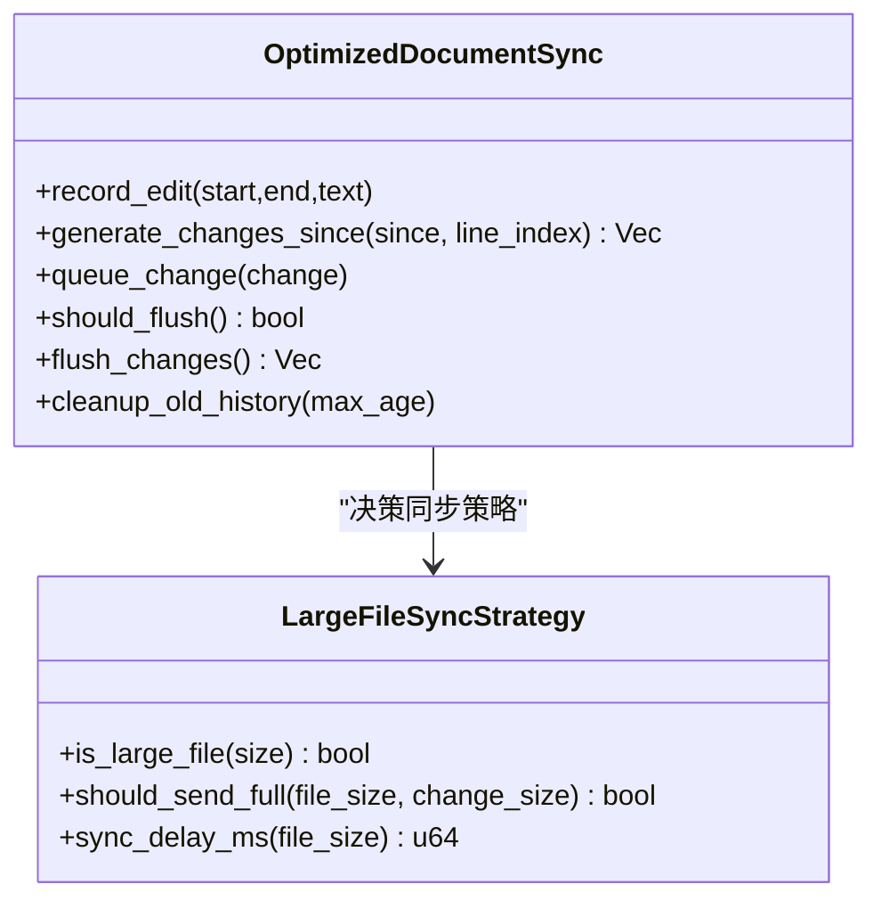
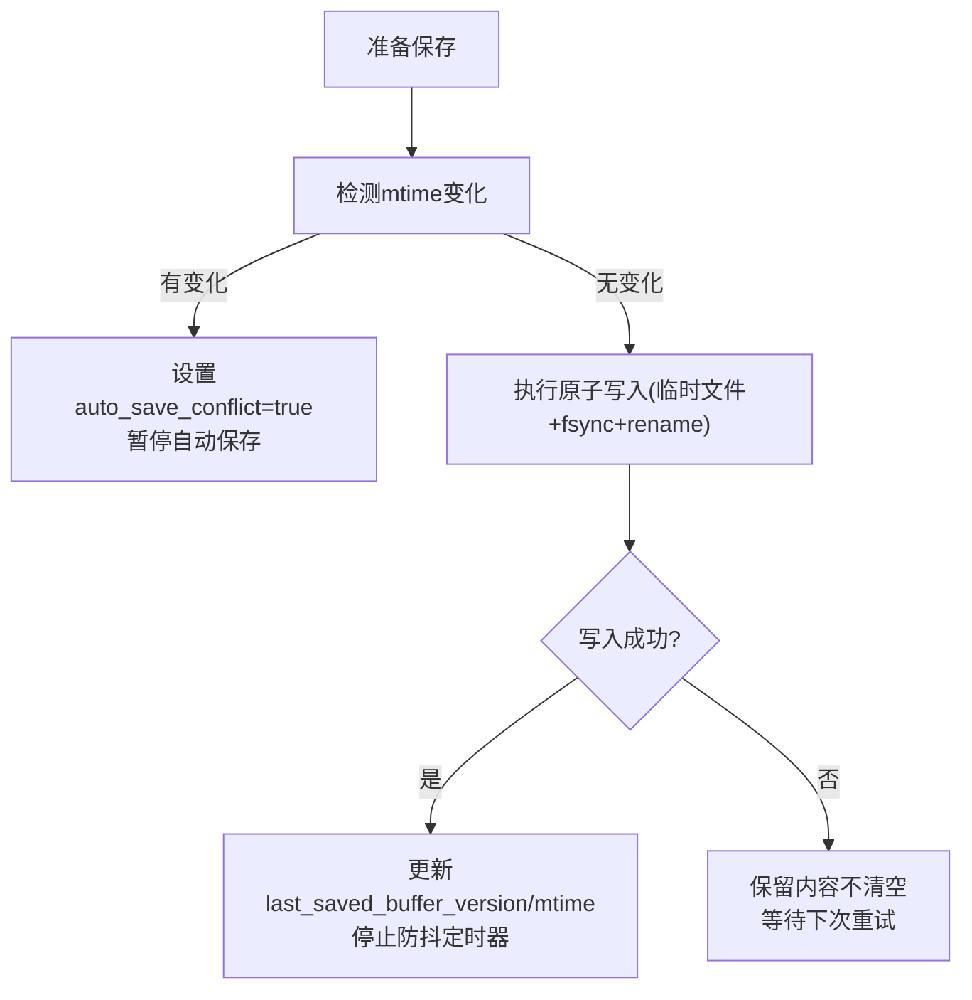
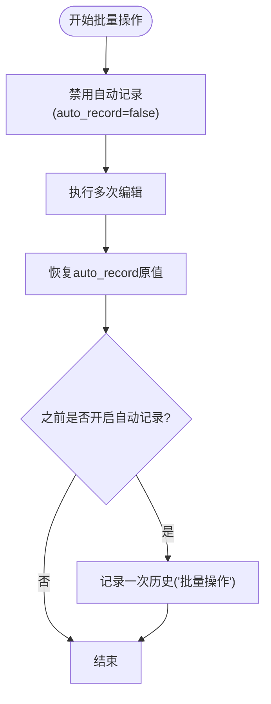
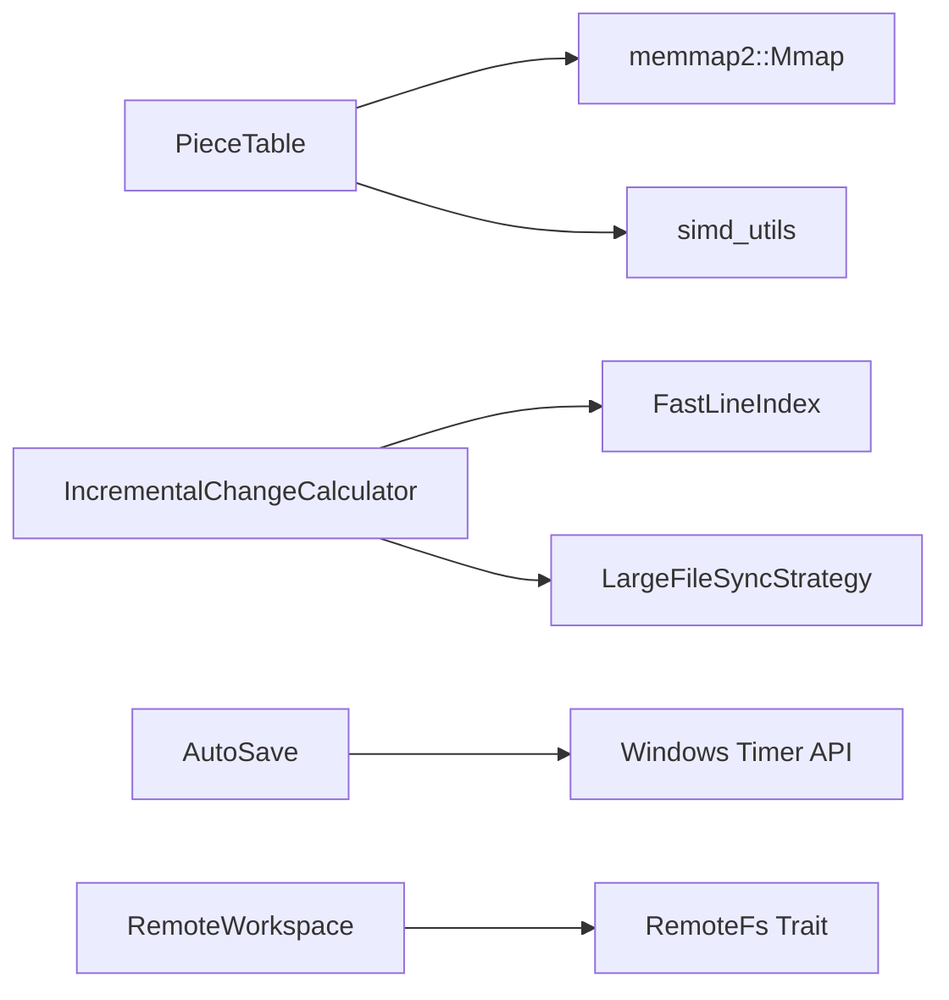

# 文件 IO 优化

<cite>
**本文引用的文件**   
- [crates/aether-core/src/buffer/piece_table.rs](file://crates/aether-core/src/buffer/piece_table.rs)
- [crates/aether-core/src/buffer/text_buffer.rs](file://crates/aether-core/src/buffer/text_buffer.rs)
- [crates/aether-core/src/simd_utils.rs](file://crates/aether-core/src/simd_utils.rs)
- [crates/aether-lsp/src/incremental_sync.rs](file://crates/aether-lsp/src/incremental_sync.rs)
- [crates/aether-win32/src/auto_save.rs](file://crates/aether-win32/src/auto_save.rs)
- [crates/aether-remote/src/workspace.rs](file://crates/aether-remote/src/workspace.rs)
- [crates/aether-core/src/persistent_history.rs](file://crates/aether-core/src/persistent_history.rs)
- [crates/aether-core/src/buffer/history.rs](file://crates/aether-core/src/buffer/history.rs)
- [crates/aether-core/src/benchmarks.rs](file://crates/aether-core/src/benchmarks.rs)
</cite>

## 目录
1. [引言](#引言)
2. [项目结构](#项目结构)
3. [核心组件](#核心组件)
4. [架构总览](#架构总览)
5. [详细组件分析](#详细组件分析)
6. [依赖关系分析](#依赖关系分析)
7. [性能考量](#性能考量)
8. [故障排查指南](#故障排查指南)
9. [结论](#结论)
10. [附录](#附录)

## 引言
本文件面向牧羊人编辑器的“文件 IO 优化”主题，围绕大文件读取、写入缓冲策略、并发控制、性能监控与错误恢复等关键维度进行系统化梳理。重点覆盖：
- 大文件读取的分块处理机制（内存映射、流式读取、缓冲区管理）
- 写入缓冲策略（批量写入、延迟保存、增量同步）
- 并发控制（读写锁、乐观并发、冲突解决）
- 性能监控（I/O 等待时间、吞吐测量、瓶颈识别）
- 资源清理与内存泄漏防护
- 错误处理与恢复模式

## 项目结构
本项目在多个 crate 中实现与 IO 相关的优化能力：
- aether-core：文本缓冲区（PieceTable）、SIMD 加速工具、持久化历史与撤销合并
- aether-lsp：增量变更计算与大文件同步策略
- aether-win32：自动保存策略（防抖/失焦/周期兜底）
- aether-remote：远程工作区缓存、路径安全校验与 TOCTOU 防护

图表来源
- [crates/aether-core/src/buffer/piece_table.rs:1-168](file://crates/aether-core/src/buffer/piece_table.rs#L1-L168)
- [crates/aether-core/src/buffer/text_buffer.rs:1-49](file://crates/aether-core/src/buffer/text_buffer.rs#L1-L49)
- [crates/aether-core/src/simd_utils.rs:1-82](file://crates/aether-core/src/simd_utils.rs#L1-L82)
- [crates/aether-core/src/persistent_history.rs:317-365](file://crates/aether-core/src/persistent_history.rs#L317-L365)
- [crates/aether-lsp/src/incremental_sync.rs:307-357](file://crates/aether-lsp/src/incremental_sync.rs#L307-L357)
- [crates/aether-win32/src/auto_save.rs:1-120](file://crates/aether-win32/src/auto_save.rs#L1-L120)
- [crates/aether-remote/src/workspace.rs:1-123](file://crates/aether-remote/src/workspace.rs#L1-L123)

章节来源
- [crates/aether-core/src/buffer/piece_table.rs:1-168](file://crates/aether-core/src/buffer/piece_table.rs#L1-L168)
- [crates/aether-core/src/buffer/text_buffer.rs:1-49](file://crates/aether-core/src/buffer/text_buffer.rs#L1-L49)
- [crates/aether-core/src/simd_utils.rs:1-82](file://crates/aether-core/src/simd_utils.rs#L1-L82)
- [crates/aether-core/src/persistent_history.rs:317-365](file://crates/aether-core/src/persistent_history.rs#L317-L365)
- [crates/aether-lsp/src/incremental_sync.rs:307-357](file://crates/aether-lsp/src/incremental_sync.rs#L307-L357)
- [crates/aether-win32/src/auto_save.rs:1-120](file://crates/aether-win32/src/auto_save.rs#L1-L120)
- [crates/aether-remote/src/workspace.rs:1-123](file://crates/aether-remote/src/workspace.rs#L1-L123)

## 核心组件
- PieceTable：基于内存映射的原始文件只读视图 + 只追加的 add_buffer；通过片段表 pieces 组织数据，支持 O(1) 插入/删除与零拷贝读取。
- TextBuffer 接口：抽象文本操作，屏蔽底层数据结构差异，提供快照能力用于后台线程安全访问。
- SIMD 工具：对换行符计数、查找、空白跳过等进行 16/8 字节批量加速，提升大文件扫描性能。
- 持久化历史：记录版本、合并小编辑、批量操作减少中间状态，降低历史膨胀与 I/O 压力。
- LSP 增量同步：从编辑操作直接生成变更事件，避免全文对比；大文件策略根据阈值与变更比例选择完整或增量发送。
- 自动保存：组合式触发（空闲防抖、失焦立即、周期兜底），大文件降级策略，内容去重与外部修改冲突检测。
- 远程工作区：本地缓存、路径遍历防护、TOCTOU 二次校验、缓存大小限制与清理。

章节来源
- [crates/aether-core/src/buffer/piece_table.rs:11-34](file://crates/aether-core/src/buffer/piece_table.rs#L11-L34)
- [crates/aether-core/src/buffer/text_buffer.rs:1-49](file://crates/aether-core/src/buffer/text_buffer.rs#L1-L49)
- [crates/aether-core/src/simd_utils.rs:1-82](file://crates/aether-core/src/simd_utils.rs#L1-L82)
- [crates/aether-core/src/persistent_history.rs:317-365](file://crates/aether-core/src/persistent_history.rs#L317-L365)
- [crates/aether-lsp/src/incremental_sync.rs:307-357](file://crates/aether-lsp/src/incremental_sync.rs#L307-L357)
- [crates/aether-win32/src/auto_save.rs:1-120](file://crates/aether-win32/src/auto_save.rs#L1-L120)
- [crates/aether-remote/src/workspace.rs:1-123](file://crates/aether-remote/src/workspace.rs#L1-L123)

## 架构总览
下图展示编辑器打开、编辑、保存与 LSP 同步的关键流程，体现内存映射、增量同步与自动保存的组合效果。

图表来源
- [crates/aether-core/src/buffer/piece_table.rs:143-168](file://crates/aether-core/src/buffer/piece_table.rs#L143-L168)
- [crates/aether-lsp/src/incremental_sync.rs:307-357](file://crates/aether-lsp/src/incremental_sync.rs#L307-L357)
- [crates/aether-win32/src/auto_save.rs:120-178](file://crates/aether-win32/src/auto_save.rs#L120-L178)

## 详细组件分析

### 大文件读取：内存映射与分块处理
- 内存映射文件：使用 memmap2 将原始文件映射为只读视图，避免一次性加载到堆内存，显著降低大文件打开时的内存占用与启动时延。
- 分块处理：通过 pieces 列表组织原始映射与追加缓冲，读取按 piece 边界进行，跨 piece 回退拼接，单 piece 命中走零拷贝路径。
- 行索引与前缀和缓存：重建行索引以支持 O(1) 行号到字节偏移转换；维护 piece_offset_cache 前缀和数组，使 find_piece_at_byte 二分查找达到 O(log n)。
- SIMD 加速：换行符计数与查找采用 16/8 字节批量比较，提升大文件扫描速度。

图表来源
- [crates/aether-core/src/buffer/piece_table.rs:143-168](file://crates/aether-core/src/buffer/piece_table.rs#L143-L168)
- [crates/aether-core/src/buffer/piece_table.rs:666-710](file://crates/aether-core/src/buffer/piece_table.rs#L666-L710)
- [crates/aether-core/src/simd_utils.rs:1-82](file://crates/aether-core/src/simd_utils.rs#L1-L82)

章节来源
- [crates/aether-core/src/buffer/piece_table.rs:143-168](file://crates/aether-core/src/buffer/piece_table.rs#L143-L168)
- [crates/aether-core/src/buffer/piece_table.rs:601-652](file://crates/aether-core/src/buffer/piece_table.rs#L601-L652)
- [crates/aether-core/src/simd_utils.rs:1-82](file://crates/aether-core/src/simd_utils.rs#L1-L82)

### 写入缓冲策略：批量写入、延迟保存与增量同步
- 批量写入：write_to 方法按 pieces 顺序写出，避免全量 String 分配；未编辑文件可直接从 mmap 零拷贝写出。
- 延迟保存：自动保存模块组合三种触发方式，大文件场景延长防抖间隔并关闭周期保存，仅保留失焦保存，降低 IO 抖动。
- 增量同步：LSP 侧从编辑操作直接生成变更事件，避免全文对比；当变更超过文件大小一半时切换为完整内容更高效。

图表来源
- [crates/aether-lsp/src/incremental_sync.rs:192-305](file://crates/aether-lsp/src/incremental_sync.rs#L192-L305)
- [crates/aether-lsp/src/incremental_sync.rs:307-357](file://crates/aether-lsp/src/incremental_sync.rs#L307-L357)

章节来源
- [crates/aether-core/src/buffer/piece_table.rs:496-514](file://crates/aether-core/src/buffer/piece_table.rs#L496-L514)
- [crates/aether-win32/src/auto_save.rs:47-120](file://crates/aether-win32/src/auto_save.rs#L47-L120)
- [crates/aether-lsp/src/incremental_sync.rs:307-357](file://crates/aether-lsp/src/incremental_sync.rs#L307-L357)

### 并发控制：读写锁、乐观并发与冲突解决
- 乐观并发：自动保存前检测磁盘 mtime 与 last_known_mtime，若检测到外部修改则暂停自动保存并提示用户，避免静默覆盖。
- 冲突解决：手动保存会复位 auto_save_conflict 并更新基线 mtime；自动保存失败不丢弃内容，等待下次重试。
- 远程工作区 TOCTOU 防护：在 canonicalize 验证后再次 canonicalize 确认写入路径仍在缓存目录内，防止符号链接替换导致的越界写入。

图表来源
- [crates/aether-win32/src/auto_save.rs:139-198](file://crates/aether-win32/src/auto_save.rs#L139-L198)
- [crates/aether-remote/src/workspace.rs:79-94](file://crates/aether-remote/src/workspace.rs#L79-L94)

章节来源
- [crates/aether-win32/src/auto_save.rs:139-198](file://crates/aether-win32/src/auto_save.rs#L139-L198)
- [crates/aether-remote/src/workspace.rs:79-94](file://crates/aether-remote/src/workspace.rs#L79-L94)

### 缓冲区管理与撤销合并
- 撤销组与合并：history 模块支持撤销组 begin_group/end_group，组内记录不合并；非组模式下根据操作类型与相邻性决定是否合并，减少历史膨胀。
- 批量操作：persistent_history 提供 with_batch 包装，批量编辑期间不记录中间状态，结束后统一记录一次，降低历史与 I/O 压力。

图表来源
- [crates/aether-core/src/persistent_history.rs:347-363](file://crates/aether-core/src/persistent_history.rs#L347-L363)
- [crates/aether-core/src/buffer/history.rs:91-100](file://crates/aether-core/src/buffer/history.rs#L91-L100)

章节来源
- [crates/aether-core/src/persistent_history.rs:347-363](file://crates/aether-core/src/persistent_history.rs#L347-L363)
- [crates/aether-core/src/buffer/history.rs:91-100](file://crates/aether-core/src/buffer/history.rs#L91-L100)

### 远程工作区缓存与清理
- 路径安全：validate_local_path 规范化路径并检查是否在缓存目录内，防止路径遍历攻击。
- 缓存大小限制：超过最大缓存阈值时自动清理最旧文件至目标大小以下，避免无限增长。
- 写入后二次校验：canonicalize 后再校验，确保 TOCTOU 窗口下未被替换为符号链接导致越界。

章节来源
- [crates/aether-remote/src/workspace.rs:28-56](file://crates/aether-remote/src/workspace.rs#L28-L56)
- [crates/aether-remote/src/workspace.rs:154-206](file://crates/aether-remote/src/workspace.rs#L154-L206)
- [crates/aether-remote/src/workspace.rs:79-94](file://crates/aether-remote/src/workspace.rs#L79-L94)

## 依赖关系分析
- PieceTable 依赖 memmap2 进行内存映射，依赖 simd_utils 进行高效换行查找与计数。
- LSP 增量同步依赖 FastLineIndex 进行 UTF-16 位置转换，LargeFileSyncStrategy 提供大文件策略。
- 自动保存依赖 EditorState 中的 buffer 与 app_settings，结合 Windows SetTimer/KillTimer 实现防抖与周期触发。
- 远程工作区依赖 RemoteFs trait 抽象远程文件系统，封装本地缓存与安全检查。

图表来源
- [crates/aether-core/src/buffer/piece_table.rs:1-10](file://crates/aether-core/src/buffer/piece_table.rs#L1-L10)
- [crates/aether-core/src/simd_utils.rs:1-82](file://crates/aether-core/src/simd_utils.rs#L1-L82)
- [crates/aether-lsp/src/incremental_sync.rs:96-190](file://crates/aether-lsp/src/incremental_sync.rs#L96-L190)
- [crates/aether-win32/src/auto_save.rs:27-107](file://crates/aether-win32/src/auto_save.rs#L27-L107)
- [crates/aether-remote/src/workspace.rs:1-26](file://crates/aether-remote/src/workspace.rs#L1-L26)

章节来源
- [crates/aether-core/src/buffer/piece_table.rs:1-10](file://crates/aether-core/src/buffer/piece_table.rs#L1-L10)
- [crates/aether-core/src/simd_utils.rs:1-82](file://crates/aether-core/src/simd_utils.rs#L1-L82)
- [crates/aether-lsp/src/incremental_sync.rs:96-190](file://crates/aether-lsp/src/incremental_sync.rs#L96-L190)
- [crates/aether-win32/src/auto_save.rs:27-107](file://crates/aether-win32/src/auto_save.rs#L27-L107)
- [crates/aether-remote/src/workspace.rs:1-26](file://crates/aether-remote/src/workspace.rs#L1-L26)

## 性能考量
- 大文件打开：内存映射避免全量加载，配合行索引与前缀和缓存，显著提升后续定位与渲染性能。
- 写入路径：write_to 按 piece 顺序写出，避免中间 String 分配；未编辑文件可零拷贝写出。
- 自动保存：大文件降级策略减少 IO 频率，内容去重避免无意义写盘。
- 基准测试：benchmarks 模块提供运行基准、统计平均/最小/最大时间与吞吐量，便于评估优化效果。

章节来源
- [crates/aether-core/src/buffer/piece_table.rs:496-514](file://crates/aether-core/src/buffer/piece_table.rs#L496-L514)
- [crates/aether-win32/src/auto_save.rs:47-120](file://crates/aether-win32/src/auto_save.rs#L47-L120)
- [crates/aether-core/src/benchmarks.rs:37-89](file://crates/aether-core/src/benchmarks.rs#L37-L89)

## 故障排查指南
- 自动保存失败：检查 is_dirty 与 buffer_version 去重逻辑，确认 save_file 原子写入路径是否成功；查看 status_message 中的错误信息。
- 外部修改冲突：detect_autosave_conflict 检测到 mtime 变化会暂停自动保存，需手动保存或重新载入。
- 远程缓存异常：validate_local_path 与 TOCTOU 二次校验失败会报错并删除越界文件，检查路径规范与符号链接情况。
- 历史膨胀：persistent_history 的 coalesce 与 with_batch 可减少中间状态，必要时调整合并阈值与时间窗口。

章节来源
- [crates/aether-win32/src/auto_save.rs:139-198](file://crates/aether-win32/src/auto_save.rs#L139-L198)
- [crates/aether-remote/src/workspace.rs:79-94](file://crates/aether-remote/src/workspace.rs#L79-L94)
- [crates/aether-core/src/persistent_history.rs:317-365](file://crates/aether-core/src/persistent_history.rs#L317-L365)

## 结论
通过内存映射、分块处理、SIMD 加速、增量同步与自动保存的组合优化，牧羊人编辑器在大文件 IO 方面实现了低内存占用、高吞吐与稳定用户体验。同时，乐观并发与冲突检测保障了数据安全，远程工作区的 TOCTOU 防护提升了安全性。建议持续利用基准测试与监控指标指导进一步优化。

## 附录
- 术语说明
  - 内存映射：操作系统将文件映射到进程地址空间，无需显式 read/write 即可访问。
  - 增量同步：仅传输变更部分而非全文，降低网络与 CPU 开销。
  - 原子写入：通过临时文件 + fsync + rename 保证崩溃一致性。
- 最佳实践
  - 大文件优先使用内存映射与零拷贝路径。
  - 自动保存结合内容去重与冲突检测，避免无效 IO 与覆盖风险。
  - 远程操作严格校验路径与 TOCTOU 窗口，防止越界写入。