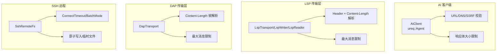
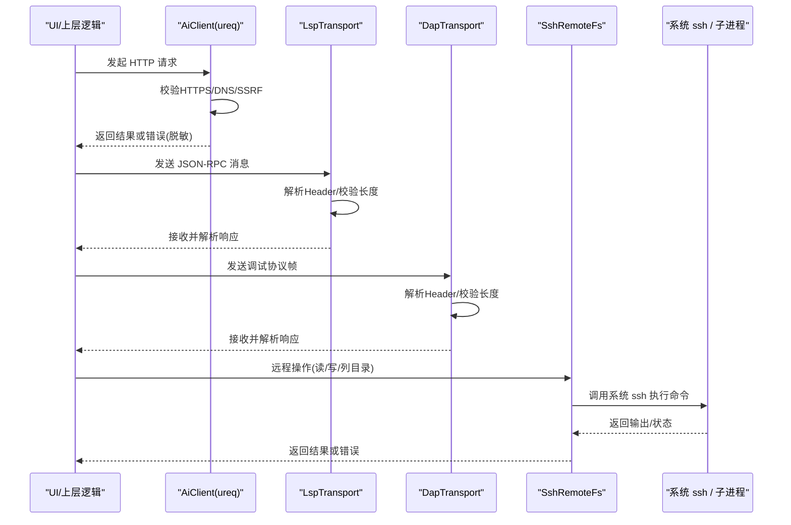
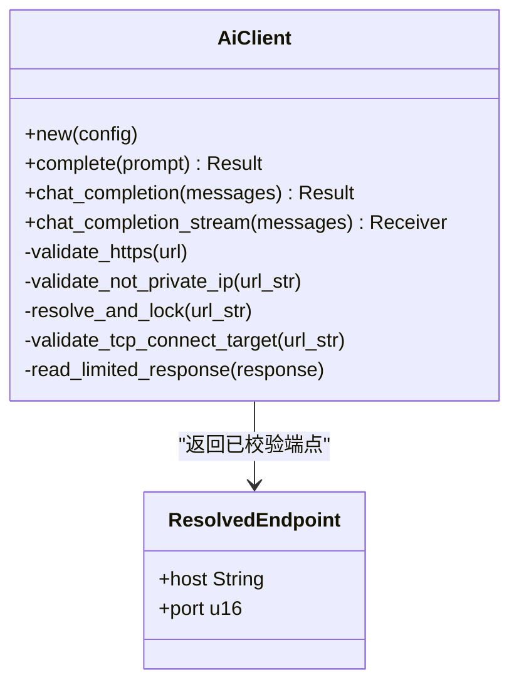
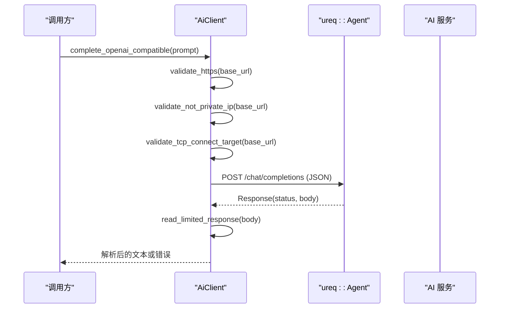
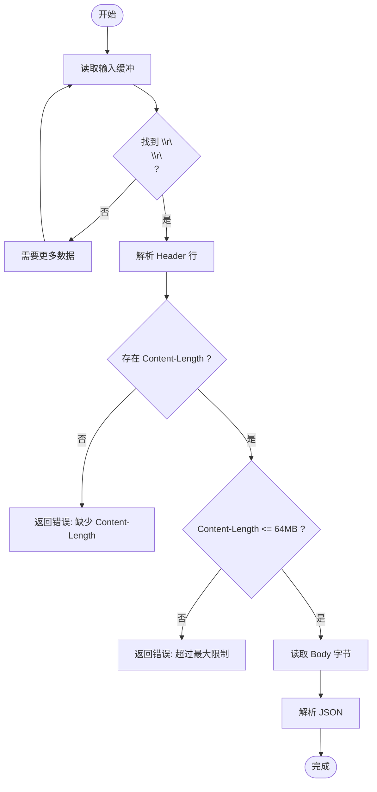
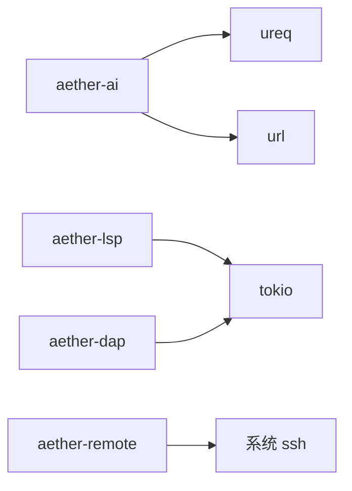

# 网络 IO 优化

<cite>
**本文引用的文件**   
- [crates/aether-ai/src/lib.rs](file://crates/aether-ai/src/lib.rs)
- [crates/aether-ai/Cargo.toml](file://crates/aether-ai/Cargo.toml)
- [crates/aether-lsp/src/transport.rs](file://crates/aether-lsp/src/transport.rs)
- [crates/aether-dap/src/transport.rs](file://crates/aether-dap/src/transport.rs)
- [crates/aether-remote/src/ssh.rs](file://crates/aether-remote/src/ssh.rs)
- [crates/aether-core/src/benchmarks.rs](file://crates/aether-core/src/benchmarks.rs)
</cite>

## 目录
1. [简介](#简介)
2. [项目结构](#项目结构)
3. [核心组件](#核心组件)
4. [架构总览](#架构总览)
5. [详细组件分析](#详细组件分析)
6. [依赖分析](#依赖分析)
7. [性能考量](#性能考量)
8. [故障排查指南](#故障排查指南)
9. [结论](#结论)
10. [附录](#附录)

## 简介
本文件聚焦牧羊人编辑器的网络 IO 优化，围绕以下主题展开：
- 网络连接池与复用、空闲回收与健康检查
- 请求重试策略（指数退避、失败分类、最大重试次数）
- 超时处理（连接超时、请求超时、整体操作超时）
- 网络性能监控（延迟、带宽利用率、错误率）
- 连接安全（TLS、证书校验、凭据管理）
- 异步请求取消与资源清理

说明：仓库中 HTTP 客户端基于 ureq，其 Agent 默认启用连接复用；LSP/DAP 通过 stdio 与子进程通信；SSH 远程功能通过系统 ssh 二进制执行。下文将结合源码实现进行逐项分析与建议。

## 项目结构
与网络 IO 相关的核心位置：
- AI 客户端：HTTP 调用、DNS/SSRF 防护、响应体限制、流式事件
- LSP/DAP 传输层：JSON-RPC over stdio 的帧编解码、头部与消息大小限制、stderr 防阻塞
- SSH 远程：shell out 模式调用系统 ssh，连接测试、命令执行、原子写入
- 基准工具：通用基准运行器，可用于网络 IO 压测与对比

图表来源
- [crates/aether-ai/src/lib.rs:239-248](file://crates/aether-ai/src/lib.rs#L239-L248)
- [crates/aether-ai/src/lib.rs:270-401](file://crates/aether-ai/src/lib.rs#L270-L401)
- [crates/aether-ai/src/lib.rs:402-424](file://crates/aether-ai/src/lib.rs#L402-L424)
- [crates/aether-lsp/src/transport.rs:11-108](file://crates/aether-lsp/src/transport.rs#L11-L108)
- [crates/aether-lsp/src/transport.rs:164-208](file://crates/aether-lsp/src/transport.rs#L164-L208)
- [crates/aether-dap/src/transport.rs:11-93](file://crates/aether-dap/src/transport.rs#L11-L93)
- [crates/aether-remote/src/ssh.rs:130-154](file://crates/aether-remote/src/ssh.rs#L130-L154)
- [crates/aether-remote/src/ssh.rs:285-321](file://crates/aether-remote/src/ssh.rs#L285-L321)

章节来源
- [crates/aether-ai/src/lib.rs:239-248](file://crates/aether-ai/src/lib.rs#L239-L248)
- [crates/aether-lsp/src/transport.rs:11-108](file://crates/aether-lsp/src/transport.rs#L11-L108)
- [crates/aether-dap/src/transport.rs:11-93](file://crates/aether-dap/src/transport.rs#L11-L93)
- [crates/aether-remote/src/ssh.rs:130-154](file://crates/aether-remote/src/ssh.rs#L130-L154)

## 核心组件
- AiClient：封装 ureq::Agent，提供统一 HTTP 接口，内置 HTTPS 强制、DNS/SSRF 校验、响应体上限、错误脱敏等。
- LspTransport/LspWriter/LspReader：负责 JSON-RPC over stdio 的编码/解码，包含头部解析、长度校验与缓冲区管理。
- DapTransport：调试适配器 JSON-RPC over stdio 的帧收发，含头部与内容长度限制。
- SshRemoteFs：通过系统 ssh 执行远程操作，支持连接测试、原子写入、目录列举等。

章节来源
- [crates/aether-ai/src/lib.rs:194-248](file://crates/aether-ai/src/lib.rs#L194-L248)
- [crates/aether-lsp/src/transport.rs:11-108](file://crates/aether-lsp/src/transport.rs#L11-L108)
- [crates/aether-dap/src/transport.rs:11-93](file://crates/aether-dap/src/transport.rs#L11-L93)
- [crates/aether-remote/src/ssh.rs:101-164](file://crates/aether-remote/src/ssh.rs#L101-L164)

## 架构总览
下图展示从 UI 到各网络后端的调用路径与安全/限流要点。

图表来源
- [crates/aether-ai/src/lib.rs:438-514](file://crates/aether-ai/src/lib.rs#L438-L514)
- [crates/aether-lsp/src/transport.rs:66-108](file://crates/aether-lsp/src/transport.rs#L66-L108)
- [crates/aether-dap/src/transport.rs:26-93](file://crates/aether-dap/src/transport.rs#L26-L93)
- [crates/aether-remote/src/ssh.rs:265-374](file://crates/aether-remote/src/ssh.rs#L265-L374)

## 详细组件分析

### 网络连接池与复用
- 连接复用：AiClient 使用 ureq::AgentBuilder 构建 Agent，ureq 默认启用连接复用，减少握手开销。
- 空闲回收与健康检查：当前未显式配置空闲回收与健康检查。若需精细控制，可在 Agent 层面调整相关参数或在业务层做健康探测。

章节来源
- [crates/aether-ai/src/lib.rs:239-248](file://crates/aether-ai/src/lib.rs#L239-L248)
- [crates/aether-ai/Cargo.toml:9](file://crates/aether-ai/Cargo.toml#L9)

### 请求重试策略
- 现状：当前代码未实现自动重试。建议在业务层封装重试策略，按失败类型分类（如 429/5xx/网络错误），采用指数退避与抖动，设置最大重试次数与熔断阈值。
- 建议：
  - 失败分类：网络错误、超时、服务端 4xx/5xx、认证失败
  - 指数退避：base_delay * 2^attempt + jitter
  - 最大重试：可配置（例如 3 次）
  - 幂等性：仅对 GET/HEAD 等幂等方法重试，POST 需谨慎

[本节为通用建议，不直接分析具体文件]

### 超时处理机制
- 请求超时：AiClient 在 Agent 构造时设置了全局超时（秒级）。
- 连接超时：SSH 连接测试使用 ConnectTimeout=5 秒；LSP/DAP 通过 tokio 异步 IO，可结合超时任务包装。
- 整体操作超时：可在上层用 tokio::time::timeout 包裹长耗时操作。

章节来源
- [crates/aether-ai/src/lib.rs:239-248](file://crates/aether-ai/src/lib.rs#L239-L248)
- [crates/aether-remote/src/ssh.rs:130-154](file://crates/aether-remote/src/ssh.rs#L130-L154)

### 网络性能监控
- 延迟测量：可使用基准工具 run_benchmark 对关键路径（如 AI 请求、LSP 往返）进行计时统计。
- 带宽利用率：可通过读取/写入字节数与耗时估算吞吐。
- 错误率统计：记录各类错误（网络、超时、解析、API 错误码）占比。

章节来源
- [crates/aether-core/src/benchmarks.rs:55-87](file://crates/aether-core/src/benchmarks.rs#L55-L87)

### 连接安全考虑
- TLS 与证书校验：
  - 强制 HTTPS：AiClient 校验 base_url 必须以 https:// 开头。
  - DNS/SSRF 防护：解析域名后进行私有/保留地址校验，并在请求前二次校验，阻断常见云元数据端点。
- 凭据管理：
  - API Key 前置空值检查，避免无密钥请求。
  - SSH 支持密钥与 Agent 认证，密码模式在 shell out 下不支持。

章节来源
- [crates/aether-ai/src/lib.rs:260-268](file://crates/aether-ai/src/lib.rs#L260-L268)
- [crates/aether-ai/src/lib.rs:270-401](file://crates/aether-ai/src/lib.rs#L270-L401)
- [crates/aether-ai/src/lib.rs:469-476](file://crates/aether-ai/src/lib.rs#L469-L476)
- [crates/aether-remote/src/ssh.rs:130-154](file://crates/aether-remote/src/ssh.rs#L130-L154)

### 异步网络请求的取消与资源清理
- LSP/DAP：基于 tokio 异步 IO，reader/writer 分离，避免互锁；stderr 后台 drain 防止管道阻塞。
- SSH：每次操作独立调用系统 ssh，无持久连接；原子写入通过临时文件 + mv 保证一致性。
- 取消策略：上层可用 tokio::select! 或超时任务取消长时间等待；确保关闭读写通道与释放句柄。

章节来源
- [crates/aether-lsp/src/transport.rs:11-108](file://crates/aether-lsp/src/transport.rs#L11-L108)
- [crates/aether-dap/src/transport.rs:11-93](file://crates/aether-dap/src/transport.rs#L11-L93)
- [crates/aether-remote/src/ssh.rs:285-321](file://crates/aether-remote/src/ssh.rs#L285-L321)

#### 类图：AI 客户端与安全校验

图表来源
- [crates/aether-ai/src/lib.rs:194-248](file://crates/aether-ai/src/lib.rs#L194-L248)
- [crates/aether-ai/src/lib.rs:232-237](file://crates/aether-ai/src/lib.rs#L232-L237)
- [crates/aether-ai/src/lib.rs:270-401](file://crates/aether-ai/src/lib.rs#L270-L401)

#### 序列图：AI 完整请求流程（OpenAI 兼容）

图表来源
- [crates/aether-ai/src/lib.rs:460-514](file://crates/aether-ai/src/lib.rs#L460-L514)
- [crates/aether-ai/src/lib.rs:402-424](file://crates/aether-ai/src/lib.rs#L402-L424)

#### 流程图：LSP 头部解析与长度限制

图表来源
- [crates/aether-lsp/src/transport.rs:164-208](file://crates/aether-lsp/src/transport.rs#L164-L208)

## 依赖分析
- aether-ai 依赖 ureq 作为 HTTP 客户端，url 用于严格 URL 解析。
- aether-lsp 与 aether-dap 依赖 tokio 进行异步 IO 与进程管理。
- aether-remote 通过系统 ssh 执行远程命令，零运行时库依赖。

图表来源
- [crates/aether-ai/Cargo.toml:9-10](file://crates/aether-ai/Cargo.toml#L9-L10)
- [crates/aether-lsp/Cargo.toml:11](file://crates/aether-lsp/Cargo.toml#L11)
- [crates/aether-dap/Cargo.toml:10](file://crates/aether-dap/Cargo.toml#L10)
- [crates/aether-remote/src/ssh.rs:1-11](file://crates/aether-remote/src/ssh.rs#L1-L11)

章节来源
- [crates/aether-ai/Cargo.toml:9-10](file://crates/aether-ai/Cargo.toml#L9-L10)
- [crates/aether-lsp/Cargo.toml:11](file://crates/aether-lsp/Cargo.toml#L11)
- [crates/aether-dap/Cargo.toml:10](file://crates/aether-dap/Cargo.toml#L10)
- [crates/aether-remote/src/ssh.rs:1-11](file://crates/aether-remote/src/ssh.rs#L1-L11)

## 性能考量
- 连接复用：利用 ureq Agent 的连接复用降低握手成本。
- 头部与消息限制：LSP/DAP 均限制头部与消息大小，避免 OOM。
- 流式处理：AI 支持流式事件，可降低首字延迟。
- 基准测试：使用 run_benchmark 对关键路径进行压测与回归对比。

章节来源
- [crates/aether-lsp/src/transport.rs:164-208](file://crates/aether-lsp/src/transport.rs#L164-L208)
- [crates/aether-dap/src/transport.rs:40-93](file://crates/aether-dap/src/transport.rs#L40-L93)
- [crates/aether-ai/src/lib.rs:706-770](file://crates/aether-ai/src/lib.rs#L706-L770)
- [crates/aether-core/src/benchmarks.rs:55-87](file://crates/aether-core/src/benchmarks.rs#L55-L87)

## 故障排查指南
- 连接失败：
  - SSH：检查 BatchMode 与 ConnectTimeout，确认密钥与 known_hosts 配置。
  - AI：检查 HTTPS 与 DNS 解析是否命中公网 IP，查看错误脱敏信息。
- 解析错误：
  - LSP/DAP：确认 Content-Length 头存在且数值合法，JSON 格式正确。
- 性能问题：
  - 使用基准工具定位瓶颈，关注头部解析与消息大小限制触发情况。

章节来源
- [crates/aether-remote/src/ssh.rs:130-154](file://crates/aether-remote/src/ssh.rs#L130-L154)
- [crates/aether-ai/src/lib.rs:260-268](file://crates/aether-ai/src/lib.rs#L260-L268)
- [crates/aether-lsp/src/transport.rs:164-208](file://crates/aether-lsp/src/transport.rs#L164-L208)
- [crates/aether-dap/src/transport.rs:40-93](file://crates/aether-dap/src/transport.rs#L40-L93)

## 结论
本项目在网络 IO 方面已具备较好的基础：
- 安全：强制 HTTPS、DNS/SSRF 校验、响应体大小限制、错误脱敏
- 稳定：LSP/DAP 头部与消息大小限制、stderr 防阻塞
- 易用：SSH 远程通过系统 ssh，简化依赖

建议后续增强：
- 引入可配置的重试与指数退避（仅限幂等操作）
- 精细化连接池参数与健康检查
- 完善端到端监控指标（延迟、吞吐、错误率）

[本节为总结性内容，不直接分析具体文件]

## 附录
- 术语
  - SSRF：服务器端请求伪造
  - TOCTOU：时间条件竞争
  - JSON-RPC：轻量级 RPC 协议
  - stdio：标准输入输出

[本节为概念性内容，不直接分析具体文件]