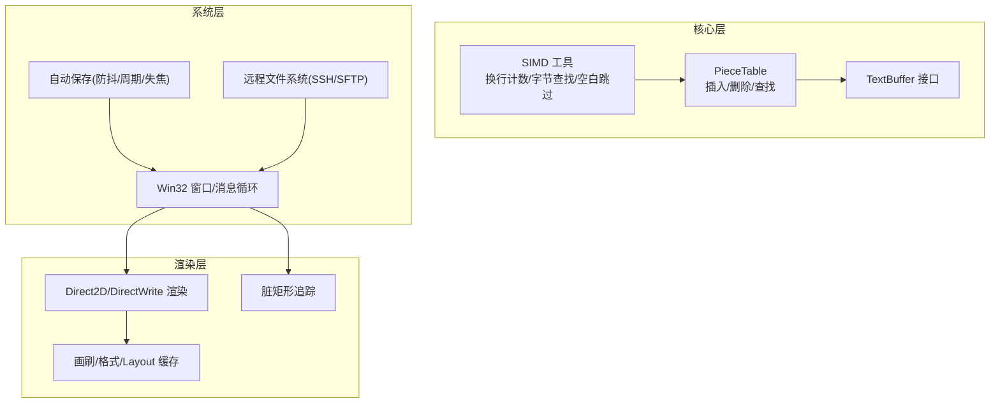
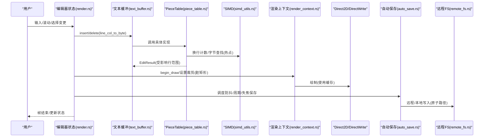
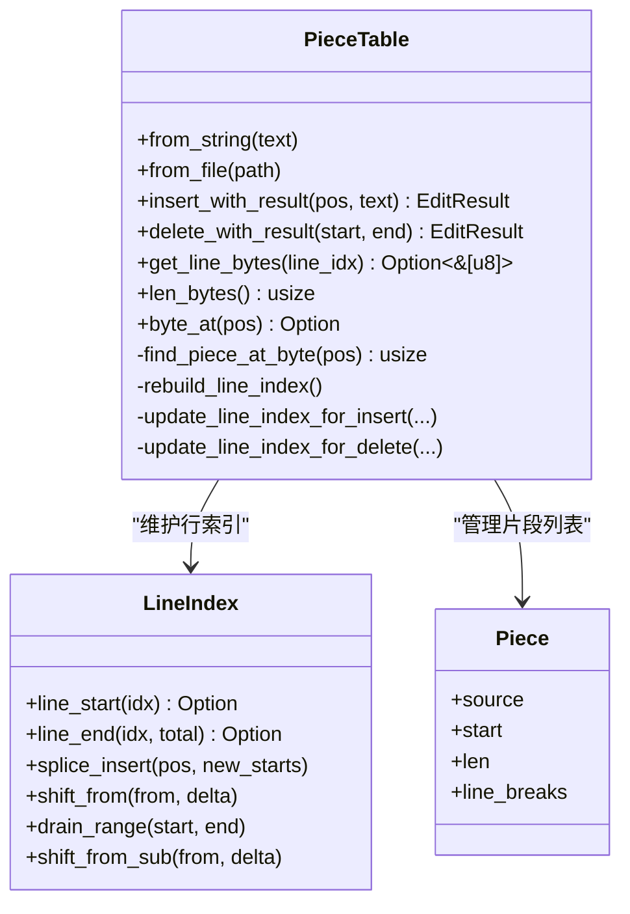
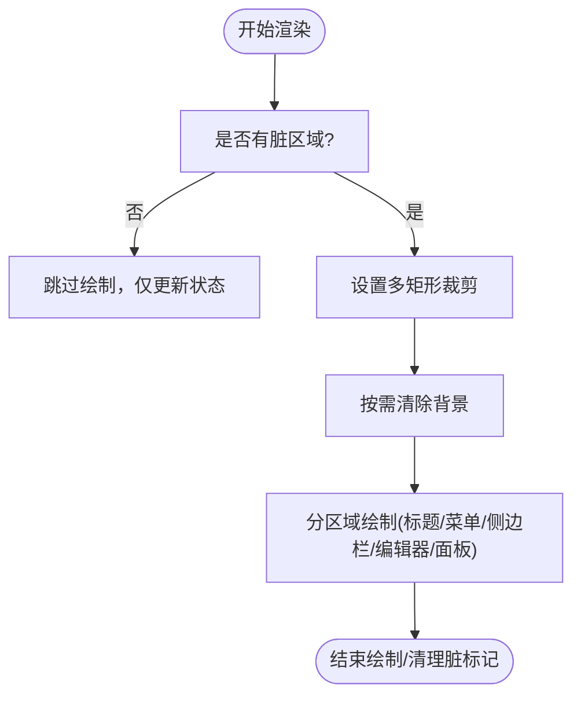
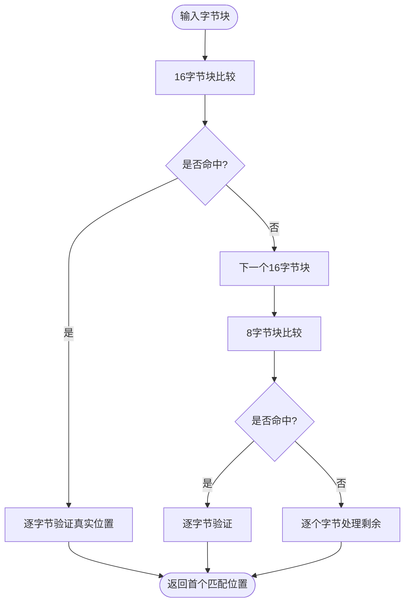
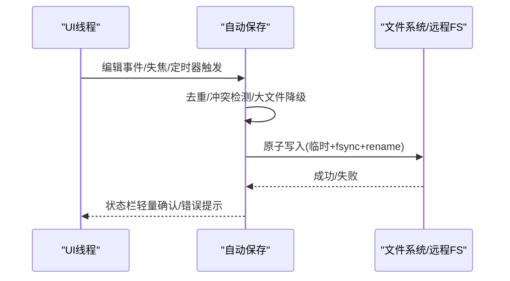
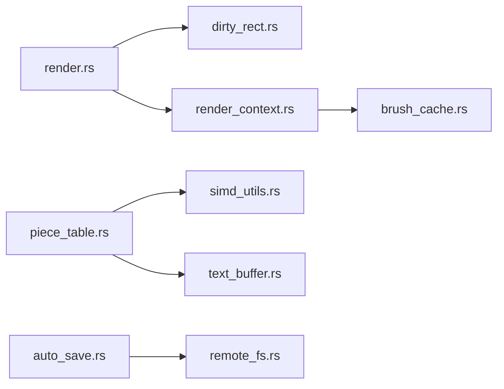

# 性能优化

<cite>
**本文引用的文件**   
- [piece_table.rs](file://crates/aether-core/src/buffer/piece_table.rs)
- [text_buffer.rs](file://crates/aether-core/src/buffer/text_buffer.rs)
- [simd_utils.rs](file://crates/aether-core/src/simd_utils.rs)
- [benchmarks.rs](file://crates/aether-core/src/benchmarks.rs)
- [benchmark.rs](file://crates/aether-core/examples/benchmark.rs)
- [perf_test.rs](file://crates/aether-core/examples/perf_test.rs)
- [render.rs](file://crates/aether-win32/src/render.rs)
- [dirty_rect.rs](file://crates/aether-win32/src/dirty_rect.rs)
- [brush_cache.rs](file://crates/aether-render/src/d2d/brush_cache.rs)
- [text.rs](file://crates/aether-render/src/d2d/text.rs)
- [render_context.rs](file://crates/aether-win32/src/render_context.rs)
- [auto_save.rs](file://crates/aether-win32/src/auto_save.rs)
- [remote_fs.rs](file://crates/aether-remote/src/remote_fs.rs)
</cite>

## 目录
1. [引言](#引言)
2. [项目结构](#项目结构)
3. [核心组件](#核心组件)
4. [架构总览](#架构总览)
5. [详细组件分析](#详细组件分析)
6. [依赖关系分析](#依赖关系分析)
7. [性能考量](#性能考量)
8. [故障排查指南](#故障排查指南)
9. [结论](#结论)
10. [附录](#附录)

## 引言
本专题聚焦牧羊人编辑器的性能优化，围绕以下关键主题展开：
- Piece Table 数据结构在大规模文本编辑中的表现与复杂度
- Direct2D/DirectWrite 渲染优化（脏矩形、绘制缓存、GPU 加速利用）
- SIMD 指令集在热点函数中的应用与收益
- 异步 IO 策略（自动保存、远程文件系统）
- 基准测试方法与结果解读，帮助定位瓶颈并持续优化

## 项目结构
本项目采用多 crate 分层组织：
- aether-core：核心数据与算法（PieceTable、SIMD、增量词法、搜索等）
- aether-render：Direct2D/DirectWrite 渲染抽象与缓存
- aether-win32：Windows UI 集成（渲染循环、脏矩形、自动保存等）
- aether-remote：远程文件系统抽象与安全命令执行

图表来源
- [piece_table.rs:1-170](file://crates/aether-core/src/buffer/piece_table.rs#L1-L170)
- [simd_utils.rs:1-170](file://crates/aether-core/src/simd_utils.rs#L1-L170)
- [text_buffer.rs:1-60](file://crates/aether-core/src/buffer/text_buffer.rs#L1-L60)
- [brush_cache.rs:1-120](file://crates/aether-render/src/d2d/brush_cache.rs#L1-L120)
- [dirty_rect.rs:1-120](file://crates/aether-win32/src/dirty_rect.rs#L1-L120)
- [render.rs:60-120](file://crates/aether-win32/src/render.rs#L60-L120)
- [auto_save.rs:1-120](file://crates/aether-win32/src/auto_save.rs#L1-L120)
- [remote_fs.rs:1-120](file://crates/aether-remote/src/remote_fs.rs#L1-L120)

章节来源
- [piece_table.rs:1-170](file://crates/aether-core/src/buffer/piece_table.rs#L1-L170)
- [text_buffer.rs:1-60](file://crates/aether-core/src/buffer/text_buffer.rs#L1-L60)
- [simd_utils.rs:1-170](file://crates/aether-core/src/simd_utils.rs#L1-L170)
- [brush_cache.rs:1-120](file://crates/aether-render/src/d2d/brush_cache.rs#L1-L120)
- [dirty_rect.rs:1-120](file://crates/aether-win32/src/dirty_rect.rs#L1-L120)
- [render.rs:60-120](file://crates/aether-win32/src/render.rs#L60-L120)
- [auto_save.rs:1-120](file://crates/aether-win32/src/auto_save.rs#L1-L120)
- [remote_fs.rs:1-120](file://crates/aether-remote/src/remote_fs.rs#L1-L120)

## 核心组件
- PieceTable：以片段表管理原始文件与追加缓冲区，支持 O(1) 级别插入/删除（片段级），配合前缀和缓存与行索引实现高效定位与行操作。
- SIMD 工具：提供换行符计数、字节查找、空白跳过等 SWAR 风格批量处理，显著降低热点路径开销。
- 渲染缓存：画刷、文本格式、TextLayout 的预计算与回退 HashMap 缓存，减少 COM 对象创建与分配。
- 脏矩形：按区域类型合并重叠矩形，避免全窗口重绘；无变化时直接跳过渲染。
- 自动保存：基于定时器组合策略（防抖、失焦、周期兜底），大文件降级，内容去重与冲突检测。
- 远程文件系统：统一读写/监听接口，受限命令白名单与元字符过滤保障安全。

章节来源
- [piece_table.rs:11-170](file://crates/aether-core/src/buffer/piece_table.rs#L11-L170)
- [simd_utils.rs:1-170](file://crates/aether-core/src/simd_utils.rs#L1-L170)
- [brush_cache.rs:1-120](file://crates/aether-render/src/d2d/brush_cache.rs#L1-L120)
- [dirty_rect.rs:1-120](file://crates/aether-win32/src/dirty_rect.rs#L1-L120)
- [auto_save.rs:1-120](file://crates/aether-win32/src/auto_save.rs#L1-L120)
- [remote_fs.rs:1-120](file://crates/aether-remote/src/remote_fs.rs#L1-L120)

## 架构总览
下图展示从输入到渲染的关键路径，以及后台任务与 IO 的交互。

图表来源
- [render.rs:60-120](file://crates/aether-win32/src/render.rs#L60-L120)
- [text_buffer.rs:1-60](file://crates/aether-core/src/buffer/text_buffer.rs#L1-L60)
- [piece_table.rs:170-282](file://crates/aether-core/src/buffer/piece_table.rs#L170-L282)
- [simd_utils.rs:1-170](file://crates/aether-core/src/simd_utils.rs#L1-L170)
- [render_context.rs:60-120](file://crates/aether-win32/src/render_context.rs#L60-L120)
- [auto_save.rs:120-220](file://crates/aether-win32/src/auto_save.rs#L120-L220)
- [remote_fs.rs:1-120](file://crates/aether-remote/src/remote_fs.rs#L1-L120)

## 详细组件分析

### Piece Table 数据结构与复杂度
- 插入/删除
  - 将新内容追加到只追加缓冲区，通过拆分/插入片段完成逻辑修改，避免移动大量数据。
  - 行索引增量更新，避免全量重建；碎片数量超过阈值后触发合并，维持片段规模可控。
  - 时间复杂度：片段插入/删除为 O(k + n)（k 为受影响的片段数，n 为 pieces 长度），但 k 通常很小；行索引增量为 O(m)（m 为受影响行数）。
- 查找
  - 字节偏移→片段：使用前缀和缓存二分查找，O(log n)。
  - 行号→字节范围：行索引 O(1)。
  - 单字节访问：O(log n)，用于逐字节扫描场景。
- 读取
  - 单 piece 命中可零拷贝返回切片；跨 piece 回退拼接。
  - 全文写入：按片段顺序写出，避免中间 String 分配。

图表来源
- [piece_table.rs:11-170](file://crates/aether-core/src/buffer/piece_table.rs#L11-L170)
- [piece_table.rs:666-781](file://crates/aether-core/src/buffer/piece_table.rs#L666-L781)

章节来源
- [piece_table.rs:11-170](file://crates/aether-core/src/buffer/piece_table.rs#L11-L170)
- [piece_table.rs:170-282](file://crates/aether-core/src/buffer/piece_table.rs#L170-L282)
- [piece_table.rs:430-462](file://crates/aether-core/src/buffer/piece_table.rs#L430-L462)
- [piece_table.rs:577-641](file://crates/aether-core/src/buffer/piece_table.rs#L577-L641)
- [piece_table.rs:666-781](file://crates/aether-core/src/buffer/piece_table.rs#L666-L781)

### Direct2D 渲染优化
- 脏矩形与裁剪
  - 根据状态变化推断最小重绘区域，合并重叠矩形，必要时降级为全窗口重绘。
  - 多矩形并集裁剪，避免单一包围盒导致的过度重绘。
- 绘制缓存
  - 画刷缓存：常用颜色预存数组 + HashMap 回退，限制最大条目数。
  - 文本格式缓存：预置常用对齐/权重组合，避免每帧创建 IDWriteTextFormat。
  - TextLayout 缓存：相同 token 文本复用布局，减少 COM 对象分配。
- GPU 加速利用
  - 通过 Direct2D 硬件加速路径绘制，结合裁剪与缓存降低 CPU/GPU 压力。

图表来源
- [render.rs:190-410](file://crates/aether-win32/src/render.rs#L190-L410)
- [dirty_rect.rs:100-220](file://crates/aether-win32/src/dirty_rect.rs#L100-L220)
- [brush_cache.rs:1-120](file://crates/aether-render/src/d2d/brush_cache.rs#L1-L120)
- [render_context.rs:100-160](file://crates/aether-win32/src/render_context.rs#L100-L160)

章节来源
- [render.rs:190-410](file://crates/aether-win32/src/render.rs#L190-L410)
- [dirty_rect.rs:100-220](file://crates/aether-win32/src/dirty_rect.rs#L100-L220)
- [brush_cache.rs:1-120](file://crates/aether-render/src/d2d/brush_cache.rs#L1-L120)
- [render_context.rs:100-160](file://crates/aether-win32/src/render_context.rs#L100-L160)

### SIMD 指令集应用与效果
- 换行符计数：SWAR 风格 16/8 字节批量比较，命中后再逐字节验证，避免假阳性。
- 字节查找：同模式快速定位目标字节，广泛用于行边界与分隔符扫描。
- 空白跳过：批量检测空格/制表符/回车，提升词法与解析速度。
- 适用场景：文本预处理、行分割、关键字前缀匹配等热点路径。

图表来源
- [simd_utils.rs:1-170](file://crates/aether-core/src/simd_utils.rs#L1-L170)

章节来源
- [simd_utils.rs:1-170](file://crates/aether-core/src/simd_utils.rs#L1-L170)

### 异步 IO 处理策略
- 自动保存
  - 防抖：用户停止输入后延迟保存，SetTimer 天然重置计时。
  - 失焦立即保存：切换焦点时触发。
  - 周期兜底：防止长时间输入导致防抖永不触发；大文件降级关闭周期保存。
  - 内容去重：buffer_version 未变则跳过写盘。
  - 冲突检测：mtime 变化暂停自动保存并提示。
- 远程文件系统
  - 统一接口：read/write/list/watch/exec。
  - 受限命令白名单与 shell 元字符过滤，防止注入。
  - Git 信息获取与受限参数校验，避免路径遍历与标志注入。

图表来源
- [auto_save.rs:120-220](file://crates/aether-win32/src/auto_save.rs#L120-L220)
- [remote_fs.rs:1-120](file://crates/aether-remote/src/remote_fs.rs#L1-L120)

章节来源
- [auto_save.rs:120-220](file://crates/aether-win32/src/auto_save.rs#L120-L220)
- [remote_fs.rs:1-120](file://crates/aether-remote/src/remote_fs.rs#L1-L120)

### 基准测试方法与结果分析
- 测试套件
  - PieceTable：加载、插入、删除、行读取、全文读取、快照、编辑吞吐。
  - SIMD：换行计数、字节查找、空白跳过。
  - 增量词法：全量 vs 增量更新对比。
- 运行方式
  - 示例程序入口：examples/benchmark.rs 与 examples/perf_test.rs。
  - 内部框架：run_benchmark(name, iterations, max_total_secs, f) 统计平均/最小/最大时间与吞吐量。
- 结果解读建议
  - 关注 avg_time 与 throughput，识别热点路径。
  - 对比不同数据集规模（行数/行长）下的增长趋势，评估复杂度。
  - 对频繁操作的场景（如大量小插入）重点关注碎片合并阈值与行索引增量更新成本。

章节来源
- [benchmarks.rs:105-228](file://crates/aether-core/src/benchmarks.rs#L105-L228)
- [benchmarks.rs:234-263](file://crates/aether-core/src/benchmarks.rs#L234-L263)
- [benchmarks.rs:269-334](file://crates/aether-core/src/benchmarks.rs#L269-L334)
- [benchmark.rs:1-18](file://crates/aether-core/examples/benchmark.rs#L1-L18)
- [perf_test.rs:1-18](file://crates/aether-core/examples/perf_test.rs#L1-L18)

## 依赖关系分析
- 模块耦合
  - render.rs 依赖 dirty_rect.rs 进行脏区域推断与裁剪，依赖 brush_cache.rs 与 render_context.rs 进行资源管理与绘制。
  - PieceTable 依赖 simd_utils.rs 进行热点扫描，依赖 text_buffer.rs 提供的接口契约。
  - auto_save.rs 依赖 EditorState 的保存路径与配置，间接依赖 remote_fs.rs 的远程能力。
- 外部依赖
  - Direct2D/DirectWrite 用于高性能绘制与文本布局。
  - memmap2 用于大文件内存映射，避免一次性加载。

图表来源
- [render.rs:190-410](file://crates/aether-win32/src/render.rs#L190-L410)
- [dirty_rect.rs:100-220](file://crates/aether-win32/src/dirty_rect.rs#L100-L220)
- [render_context.rs:100-160](file://crates/aether-win32/src/render_context.rs#L100-L160)
- [brush_cache.rs:1-120](file://crates/aether-render/src/d2d/brush_cache.rs#L1-L120)
- [piece_table.rs:170-282](file://crates/aether-core/src/buffer/piece_table.rs#L170-L282)
- [simd_utils.rs:1-170](file://crates/aether-core/src/simd_utils.rs#L1-L170)
- [text_buffer.rs:1-60](file://crates/aether-core/src/buffer/text_buffer.rs#L1-L60)
- [auto_save.rs:120-220](file://crates/aether-win32/src/auto_save.rs#L120-L220)
- [remote_fs.rs:1-120](file://crates/aether-remote/src/remote_fs.rs#L1-L120)

章节来源
- [render.rs:190-410](file://crates/aether-win32/src/render.rs#L190-L410)
- [dirty_rect.rs:100-220](file://crates/aether-win32/src/dirty_rect.rs#L100-L220)
- [render_context.rs:100-160](file://crates/aether-win32/src/render_context.rs#L100-L160)
- [brush_cache.rs:1-120](file://crates/aether-render/src/d2d/brush_cache.rs#L1-L120)
- [piece_table.rs:170-282](file://crates/aether-core/src/buffer/piece_table.rs#L170-L282)
- [simd_utils.rs:1-170](file://crates/aether-core/src/simd_utils.rs#L1-L170)
- [text_buffer.rs:1-60](file://crates/aether-core/src/buffer/text_buffer.rs#L1-L60)
- [auto_save.rs:120-220](file://crates/aether-win32/src/auto_save.rs#L120-L220)
- [remote_fs.rs:1-120](file://crates/aether-remote/src/remote_fs.rs#L1-L120)

## 性能考量
- 数据结构层面
  - 优先使用字节偏移与行索引，避免 UTF-8 字符边界反复计算。
  - 控制碎片规模：合理设置合并阈值，平衡片段数量与插入成本。
- 渲染层面
  - 尽量保持局部重绘，避免频繁的全窗口重绘。
  - 充分利用缓存（画刷/格式/Layout），减少 COM 对象创建。
- 算法层面
  - 热点路径使用 SIMD 批量处理，注意假阳性后的精确验证。
  - 文本宽度计算采用 Unicode East Asian Width 精简实现，兼顾正确性与性能。
- IO 层面
  - 自动保存去重与冲突检测避免无效写盘。
  - 大文件降级策略保证交互流畅性。

## 故障排查指南
- 设备丢失（D2DERR_RECREATE_TARGET）
  - 现象：end_draw 返回特定错误码。
  - 处理：重建渲染目标与缓存资源，确保下次绘制正常。
- 脏矩形异常
  - 现象：界面闪烁或黑块。
  - 处理：检查多矩形裁剪路径与欢迎页背景填充逻辑，确保各区域覆盖完整。
- 自动保存冲突
  - 现象：提示“文件已被外部修改”，自动保存暂停。
  - 处理：手动保存或重新载入，复位冲突状态。
- 远程命令拒绝
  - 现象：exec_restricted 报错“不在白名单”或“包含禁止的 shell 元字符”。
  - 处理：调整命令为白名单内且不含危险字符。

章节来源
- [render.rs:704-746](file://crates/aether-win32/src/render.rs#L704-L746)
- [render.rs:410-475](file://crates/aether-win32/src/render.rs#L410-L475)
- [auto_save.rs:160-220](file://crates/aether-win32/src/auto_save.rs#L160-L220)
- [remote_fs.rs:50-94](file://crates/aether-remote/src/remote_fs.rs#L50-L94)

## 结论
通过 Piece Table 的高效片段管理、SIMD 热点优化、Direct2D 渲染缓存与脏矩形裁剪、以及稳健的异步 IO 策略，牧羊人编辑器在大规模文本编辑与高刷新率 UI 下具备良好性能与稳定性。建议持续通过基准测试跟踪关键指标，并结合实际工作负载调优碎片合并阈值、缓存容量与自动保存策略。

## 附录
- 基准入口
  - examples/benchmark.rs 与 examples/perf_test.rs 提供一键运行全部测试。
- 相关 API 路径参考
  - PieceTable 插入/删除：[piece_table.rs:170-282](file://crates/aether-core/src/buffer/piece_table.rs#L170-L282)
  - 行索引增量更新：[piece_table.rs:712-781](file://crates/aether-core/src/buffer/piece_table.rs#L712-L781)
  - SIMD 换行计数/查找：[simd_utils.rs:1-170](file://crates/aether-core/src/simd_utils.rs#L1-L170)
  - 渲染主循环与裁剪：[render.rs:190-410](file://crates/aether-win32/src/render.rs#L190-L410)
  - 画刷/格式/Layout 缓存：[brush_cache.rs:1-120](file://crates/aether-render/src/d2d/brush_cache.rs#L1-L120)
  - 自动保存策略：[auto_save.rs:120-220](file://crates/aether-win32/src/auto_save.rs#L120-L220)
  - 远程文件系统安全：[remote_fs.rs:50-94](file://crates/aether-remote/src/remote_fs.rs#L50-L94)