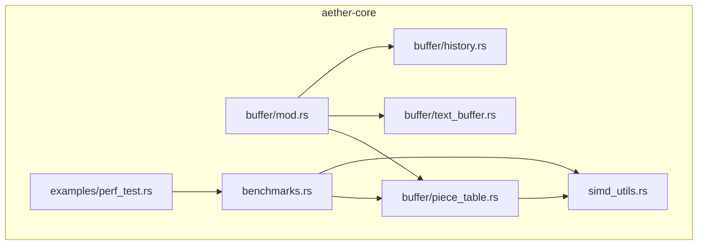
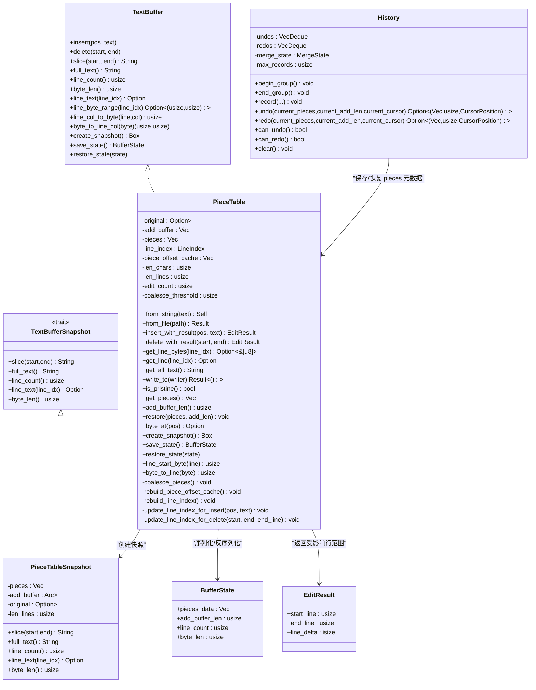
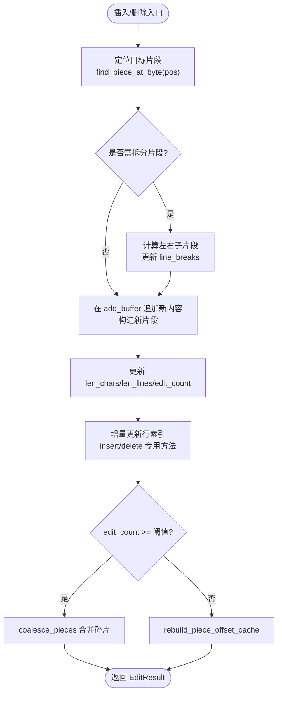
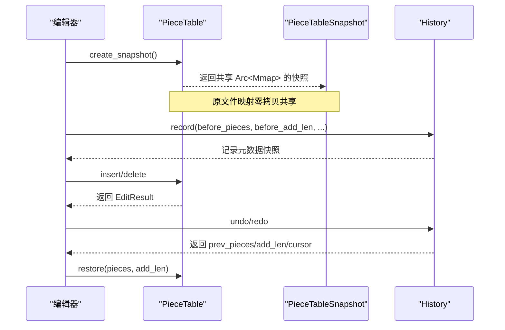
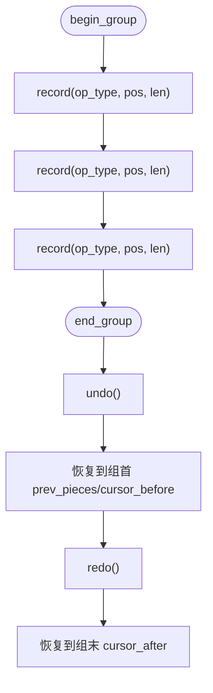
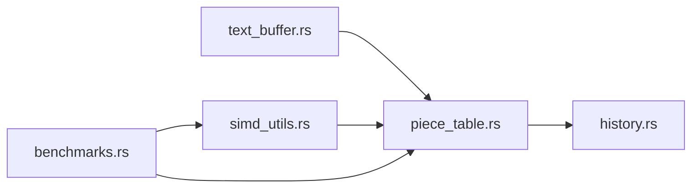

# 数据结构优化

<cite>
**本文引用的文件**
- [piece_table.rs](file://crates/aether-core/src/buffer/piece_table.rs)
- [text_buffer.rs](file://crates/aether-core/src/buffer/text_buffer.rs)
- [history.rs](file://crates/aether-core/src/buffer/history.rs)
- [simd_utils.rs](file://crates/aether-core/src/simd_utils.rs)
- [benchmarks.rs](file://crates/aether-core/src/benchmarks.rs)
- [perf_test.rs](file://crates/aether-core/examples/perf_test.rs)
</cite>

## 目录
1. [引言](#引言)
2. [项目结构](#项目结构)
3. [核心组件](#核心组件)
4. [架构总览](#架构总览)
5. [详细组件分析](#详细组件分析)
6. [依赖关系分析](#依赖关系分析)
7. [性能考量与基准](#性能考量与基准)
8. [故障排查指南](#故障排查指南)
9. [结论](#结论)
10. [附录](#附录)

## 引言
本专题聚焦牧羊人编辑器的文本缓冲区数据结构优化，围绕 Piece Table 的实现原理、内存布局与碎片管理、大文件加载的零拷贝与延迟加载策略、快照系统与写时复制（Copy-on-Write）模式、以及版本控制优化展开。文档同时给出可复用的性能基准测试方法与结果解读建议，并提供内存使用分析与优化建议，帮助读者理解并进一步调优编辑器的高性能文本处理路径。

## 项目结构
与数据结构优化直接相关的代码集中在 aether-core 的 buffer 模块中：
- piece_table.rs：Piece Table 的核心实现，包含插入/删除、行索引、前缀和缓存、碎片合并、快照与状态保存恢复等。
- text_buffer.rs：定义 TextBuffer trait 与相关类型（光标、选择、编辑结果、多光标状态），作为上层抽象。
- history.rs：基于 Piece Table 快照的高效撤销/重做系统，支持撤销组与操作合并。
- simd_utils.rs：SIMD 加速工具（换行计数、字节查找、空白跳过等）。
- benchmarks.rs / perf_test.rs：统一的基准测试框架与示例入口。

图表来源
- [mod.rs:1-9](file://crates/aether-core/src/buffer/mod.rs#L1-L9)
- [piece_table.rs:1-34](file://crates/aether-core/src/buffer/piece_table.rs#L1-L34)
- [text_buffer.rs:1-49](file://crates/aether-core/src/buffer/text_buffer.rs#L1-L49)
- [history.rs:1-16](file://crates/aether-core/src/buffer/history.rs#L1-L16)
- [simd_utils.rs:1-11](file://crates/aether-core/src/simd_utils.rs#L1-L11)
- [benchmarks.rs:1-10](file://crates/aether-core/src/benchmarks.rs#L1-L10)
- [perf_test.rs:1-18](file://crates/aether-core/examples/perf_test.rs#L1-L18)

章节来源
- [mod.rs:1-9](file://crates/aether-core/src/buffer/mod.rs#L1-L9)
- [piece_table.rs:1-34](file://crates/aether-core/src/buffer/piece_table.rs#L1-L34)
- [text_buffer.rs:1-49](file://crates/aether-core/src/buffer/text_buffer.rs#L1-L49)
- [history.rs:1-16](file://crates/aether-core/src/buffer/history.rs#L1-L16)
- [simd_utils.rs:1-11](file://crates/aether-core/src/simd_utils.rs#L1-L11)
- [benchmarks.rs:1-10](file://crates/aether-core/src/benchmarks.rs#L1-L10)
- [perf_test.rs:1-18](file://crates/aether-core/examples/perf_test.rs#L1-L18)

## 核心组件
- PieceTable：高性能文本缓冲区，维护原始文件映射（只读）、追加缓冲区（只追加）、有序片段表、行索引与前缀和缓存；提供 O(1) 量级的插入/删除（在片段层面为常数级元数据更新，片段列表插入/删除为 O(n) 但受阈值合并控制），零拷贝读取单片段范围，支持快照与状态持久化。
- TextBuffer trait：统一文本编辑接口，屏蔽底层数据结构差异，便于替换或扩展。
- History：基于 Piece 元数据快照的撤销/重做栈，支持撤销组与快速合并，避免重复记录。
- SIMD 工具：批量检测换行符、查找字节、跳过空白，提升初始化与扫描性能。
- 基准测试：覆盖加载、插入、删除、行读取、全文读取、快照创建、编辑吞吐等场景。

章节来源
- [piece_table.rs:11-34](file://crates/aether-core/src/buffer/piece_table.rs#L11-L34)
- [text_buffer.rs:1-49](file://crates/aether-core/src/buffer/text_buffer.rs#L1-L49)
- [history.rs:1-16](file://crates/aether-core/src/buffer/history.rs#L1-L16)
- [simd_utils.rs:1-11](file://crates/aether-core/src/simd_utils.rs#L1-L11)
- [benchmarks.rs:104-228](file://crates/aether-core/src/benchmarks.rs#L104-L228)

## 架构总览
下图展示了 Piece Table 在编辑器中的角色与关键交互：TextBuffer 抽象由 PieceTable 实现；History 通过保存/恢复 Piece 元数据实现撤销/重做；SIMD 工具用于加速行索引重建与扫描；基准测试对 PieceTable 的关键路径进行量化评估。

图表来源
- [text_buffer.rs:1-49](file://crates/aether-core/src/buffer/text_buffer.rs#L1-L49)
- [piece_table.rs:11-34](file://crates/aether-core/src/buffer/piece_table.rs#L11-L34)
- [piece_table.rs:1062-1104](file://crates/aether-core/src/buffer/piece_table.rs#L1062-L1104)
- [history.rs:1-16](file://crates/aether-core/src/buffer/history.rs#L1-L16)
- [text_buffer.rs:61-81](file://crates/aether-core/src/buffer/text_buffer.rs#L61-L81)
- [text_buffer.rs:142-171](file://crates/aether-core/src/buffer/text_buffer.rs#L142-L171)

## 详细组件分析

### Piece Table 数据结构与算法
- 内存布局
  - original：Arc<Mmap>，指向原始文件的只读内存映射，避免大文件加载时的全量拷贝。
  - add_buffer：Vec<u8>，只追加不收缩，所有新增内容写入此处，减少频繁移动。
  - pieces：Vec<Piece>，按全局顺序排列的片段列表，每个片段引用 original 或 add_buffer 的一段连续字节。
  - line_index：每行的起始字节偏移数组，支持 O(1) 行号到字节偏移转换。
  - piece_offset_cache：piece 起始字节偏移的前缀和数组，末尾哨兵为总字节数，使 len_bytes 与定位达到 O(1)/O(log n)。
  - len_chars/len_lines/edit_count/coalesce_threshold：统计与碎片合并阈值。

- 插入与删除
  - insert_with_result/delete_with_result：在目标位置找到对应 piece，必要时拆分片段，将新内容以新 piece 插入 add_buffer，并增量更新行索引与前缀和缓存；超过阈值触发 coalesce_pieces 合并相邻同源片段，降低碎片数量。
  - 复杂度：片段定位 O(log n)（使用前缀和缓存二分），片段插入/删除 O(k)（k 为受影响的片段数），行索引增量更新 O(m)（m 为受影响行数）。

- 读取与零拷贝
  - get_line_bytes/get_text_bytes：若目标范围完全落在单个片段内，直接返回 &[u8] 切片，零拷贝；跨片段则回退拼接。
  - write_to：按片段顺序写出，避免中间 String 分配，适合未编辑的大文件直接写出 mmap 内容。

- 行索引与字节偏移
  - rebuild_line_index：使用 SIMD 加速换行符查找，构建每行起始偏移。
  - update_line_index_for_insert/update_line_index_for_delete：增量调整后续行偏移并插入/删除新行起点，避免全量重建。
  - byte_to_line/line_col_to_byte：利用行索引二分与边界处理，高效完成行列与字节偏移互转。

- 碎片管理与合并
  - coalesce_pieces：仅合并相邻且同源的 Add 片段，Original 片段不可合并（因为它们是 mmap 引用），合并后重建前缀和缓存。

- 快照与状态
  - create_snapshot：克隆 pieces 与 Arc<Mmap>，共享 original 映射，避免大文件拷贝；add_buffer 当前仍为 clone（未来可改为 Arc<Vec<u8>> 实现真正零拷贝）。
  - save_state/restore_state：序列化 pieces 元数据（source/start/len/line_breaks）与长度信息，恢复时严格校验边界与一致性，防止损坏数据导致越界。

图表来源
- [piece_table.rs:170-282](file://crates/aether-core/src/buffer/piece_table.rs#L170-L282)
- [piece_table.rs:289-408](file://crates/aether-core/src/buffer/piece_table.rs#L289-L408)
- [piece_table.rs:698-710](file://crates/aether-core/src/buffer/piece_table.rs#L698-L710)
- [piece_table.rs:1483-1516](file://crates/aether-core/src/buffer/piece_table.rs#L1483-L1516)

章节来源
- [piece_table.rs:11-34](file://crates/aether-core/src/buffer/piece_table.rs#L11-L34)
- [piece_table.rs:143-168](file://crates/aether-core/src/buffer/piece_table.rs#L143-L168)
- [piece_table.rs:170-282](file://crates/aether-core/src/buffer/piece_table.rs#L170-L282)
- [piece_table.rs:289-408](file://crates/aether-core/src/buffer/piece_table.rs#L289-L408)
- [piece_table.rs:430-461](file://crates/aether-core/src/buffer/piece_table.rs#L430-L461)
- [piece_table.rs:496-520](file://crates/aether-core/src/buffer/piece_table.rs#L496-L520)
- [piece_table.rs:666-696](file://crates/aether-core/src/buffer/piece_table.rs#L666-L696)
- [piece_table.rs:712-780](file://crates/aether-core/src/buffer/piece_table.rs#L712-L780)
- [piece_table.rs:1268-1279](file://crates/aether-core/src/buffer/piece_table.rs#L1268-L1279)
- [piece_table.rs:1281-1307](file://crates/aether-core/src/buffer/piece_table.rs#L1281-L1307)
- [piece_table.rs:1310-1467](file://crates/aether-core/src/buffer/piece_table.rs#L1310-L1467)
- [piece_table.rs:1483-1516](file://crates/aether-core/src/buffer/piece_table.rs#L1483-L1516)

### 文本缓冲区的内存映射与零拷贝
- 大文件加载：from_file 使用 memmap2::Mmap 将文件映射到虚拟内存，避免一次性拷贝到堆；original 字段为 Arc<Mmap>，多个快照共享同一映射，显著降低打开大文件时的内存占用与时间。
- 零拷贝读取：get_line_bytes/get_text_bytes 在单片段命中时直接返回底层切片，无需额外分配；write_to 按片段顺序写出，避免中间字符串拼接。
- 延迟加载：由于 mmap 按需分页，操作系统负责页面加载，编辑器可在后台线程访问而不阻塞 UI。

章节来源
- [piece_table.rs:143-168](file://crates/aether-core/src/buffer/piece_table.rs#L143-L168)
- [piece_table.rs:430-461](file://crates/aether-core/src/buffer/piece_table.rs#L430-L461)
- [piece_table.rs:496-520](file://crates/aether-core/src/buffer/piece_table.rs#L496-L520)
- [piece_table.rs:1268-1279](file://crates/aether-core/src/buffer/piece_table.rs#L1268-L1279)

### 快照系统与写时复制（CoW）模式
- 快照创建：create_snapshot 克隆 pieces 与 Arc<Mmap>，共享 original 映射；add_buffer 当前仍为 clone，未来可改为 Arc<Vec<u8>> 以实现真正的零拷贝快照。
- 写时复制：当需要修改 add_buffer 时，先检查是否存在其他快照持有该 buffer；若存在，则复制一份再修改，确保快照的不可变性。当前实现中 add_buffer 尚未采用 Arc+CoW，但可通过引入 Arc 与写时复制策略进一步优化。
- 版本控制：save_state/restore_state 序列化 pieces 元数据，结合 History 的撤销/重做栈，形成轻量级版本控制能力。

图表来源
- [piece_table.rs:1268-1279](file://crates/aether-core/src/buffer/piece_table.rs#L1268-L1279)
- [history.rs:101-200](file://crates/aether-core/src/buffer/history.rs#L101-L200)
- [history.rs:202-312](file://crates/aether-core/src/buffer/history.rs#L202-L312)
- [piece_table.rs:1281-1307](file://crates/aether-core/src/buffer/piece_table.rs#L1281-L1307)

章节来源
- [piece_table.rs:1268-1279](file://crates/aether-core/src/buffer/piece_table.rs#L1268-L1279)
- [history.rs:101-200](file://crates/aether-core/src/buffer/history.rs#L101-L200)
- [history.rs:202-312](file://crates/aether-core/src/buffer/history.rs#L202-L312)
- [piece_table.rs:1281-1307](file://crates/aether-core/src/buffer/piece_table.rs#L1281-L1307)

### 撤销/重做与撤销组
- 记录策略：record 保存编辑前的 pieces 元数据与光标位置，支持插入/删除/替换三类操作；相同位置快速连续输入会合并为一条记录，减少历史栈膨胀。
- 撤销组：begin_group/end_group 标记一组操作，组内记录不合并，撤销时一次性回到组首状态，重做时整体恢复。
- 队列优化：使用 VecDeque 存储 undos/redos，淘汰旧记录为 O(1)，避免 O(n) 移除开销。

图表来源
- [history.rs:88-99](file://crates/aether-core/src/buffer/history.rs#L88-L99)
- [history.rs:101-200](file://crates/aether-core/src/buffer/history.rs#L101-L200)
- [history.rs:202-312](file://crates/aether-core/src/buffer/history.rs#L202-L312)

章节来源
- [history.rs:1-16](file://crates/aether-core/src/buffer/history.rs#L1-L16)
- [history.rs:88-99](file://crates/aether-core/src/buffer/history.rs#L88-L99)
- [history.rs:101-200](file://crates/aether-core/src/buffer/history.rs#L101-L200)
- [history.rs:202-312](file://crates/aether-core/src/buffer/history.rs#L202-L312)

### SIMD 加速与行索引重建
- 换行符计数：count_newlines_simd 使用 16/8 字节批量比较与 SWAR 技巧快速检测换行符，随后逐字节精确计数，避免借位传播导致的误计。
- 字节查找：find_byte_simd 同样采用批量比较与逐字节验证，确保高字节字符不会触发假阳性。
- 空白跳过：skip_whitespace_simd 批量检测空格、制表符、回车，加速词法分析预处理。
- 行索引重建：rebuild_line_index 遍历 pieces，调用 find_byte_simd 批量查找换行符，构建 line_starts 并同步重建 piece_offset_cache。

章节来源
- [simd_utils.rs:11-82](file://crates/aether-core/src/simd_utils.rs#L11-L82)
- [simd_utils.rs:89-171](file://crates/aether-core/src/simd_utils.rs#L89-L171)
- [simd_utils.rs:176-258](file://crates/aether-core/src/simd_utils.rs#L176-L258)
- [piece_table.rs:666-696](file://crates/aether-core/src/buffer/piece_table.rs#L666-L696)

## 依赖关系分析
- 模块耦合
  - piece_table.rs 依赖 text_buffer.rs 的 trait 与类型（EditResult、BufferState 等），并通过 simd_utils.rs 加速扫描。
  - history.rs 依赖 piece_table.rs 的 Piece 类型，保存/恢复元数据。
  - benchmarks.rs 依赖 piece_table.rs 与 simd_utils.rs 进行性能测量。
- 外部依赖
  - memmap2::Mmap：用于大文件内存映射，实现零拷贝加载与共享。
- 潜在循环依赖
  - 当前结构无循环依赖，buffer 模块内部通过 mod.rs 导出公共类型，保持清晰分层。

图表来源
- [text_buffer.rs:1-49](file://crates/aether-core/src/buffer/text_buffer.rs#L1-L49)
- [piece_table.rs:1-34](file://crates/aether-core/src/buffer/piece_table.rs#L1-L34)
- [simd_utils.rs:1-11](file://crates/aether-core/src/simd_utils.rs#L1-L11)
- [history.rs:1-16](file://crates/aether-core/src/buffer/history.rs#L1-L16)
- [benchmarks.rs:1-10](file://crates/aether-core/src/benchmarks.rs#L1-L10)

章节来源
- [text_buffer.rs:1-49](file://crates/aether-core/src/buffer/text_buffer.rs#L1-L49)
- [piece_table.rs:1-34](file://crates/aether-core/src/buffer/piece_table.rs#L1-L34)
- [simd_utils.rs:1-11](file://crates/aether-core/src/simd_utils.rs#L1-L11)
- [history.rs:1-16](file://crates/aether-core/src/buffer/history.rs#L1-L16)
- [benchmarks.rs:1-10](file://crates/aether-core/src/benchmarks.rs#L1-L10)

## 性能考量与基准
- 设计要点
  - O(1) 插入/删除：在片段层面为常数级元数据更新；片段列表操作为 O(k)，但通过 coalesce_threshold 控制碎片增长，降低 k。
  - 零拷贝读取：单片段命中直接返回底层切片，避免分配；write_to 顺序写出，避免中间字符串。
  - 行索引与偏移缓存：前缀和缓存使 len_bytes 与定位达到 O(1)/O(log n)，大幅减少线性扫描。
  - SIMD 加速：换行计数与字节查找批量处理，提升初始化与扫描速度。
  - 快照与状态：共享 Arc<Mmap> 避免大文件拷贝；序列化 pieces 元数据轻量持久化。

- 基准测试套件
  - 加载：from_string/from_file（含 10K/100K 行生成数据）
  - 插入/删除：单次与多次累积插入、随机删除
  - 读取：行读取采样、全文读取
  - 快照：快照创建耗时
  - 编辑吞吐：模拟真实编辑混合操作
  - SIMD：换行计数、字节查找、空白跳过
  - 增量词法：全量 vs 增量更新对比

- 运行方式
  - 使用 examples/perf_test.rs 入口执行 run_all_benchmarks，输出各测试项的平均/最小/最大时间与吞吐量。

- 结果解读建议
  - 关注平均耗时与吞吐量的稳定性，观察峰值（max）是否异常，反映 GC/分配抖动。
  - 对比不同数据规模（1K/5K/10K/100K 行）下的缩放行为，验证 O(log n)/O(1) 优势。
  - 关注碎片合并阈值对性能的影响，适当调整 coalesce_threshold 平衡碎片数量与合并成本。

章节来源
- [benchmarks.rs:104-228](file://crates/aether-core/src/benchmarks.rs#L104-L228)
- [benchmarks.rs:234-263](file://crates/aether-core/src/benchmarks.rs#L234-L263)
- [benchmarks.rs:269-334](file://crates/aether-core/src/benchmarks.rs#L269-L334)
- [benchmarks.rs:398-443](file://crates/aether-core/src/benchmarks.rs#L398-L443)
- [perf_test.rs:1-18](file://crates/aether-core/examples/perf_test.rs#L1-L18)

## 故障排查指南
- 行索引不一致
  - 现象：删除跨行文本后，行索引与重建结果不一致。
  - 排查：确认 update_line_index_for_delete 的 drain 范围与 shift 逻辑是否正确，参考测试用例验证。
- 跨片段读取返回空
  - 现象：get_line_bytes 返回 None，回退到 get_text 拼接。
  - 排查：确认目标范围是否跨越多个片段；必要时优化合并阈值以减少碎片。
- 撤销组行为异常
  - 现象：撤销组内记录被合并或撤销未回到组首。
  - 排查：确认 begin_group/end_group 的使用与 record 的 in_group/group_start 标记。
- 状态恢复失败
  - 现象：restore_state_checked 返回错误，放弃恢复。
  - 排查：检查 pieces_data 长度是否为固定大小整数倍、source/start/len/line_breaks 边界、add_buffer_len 一致性。

章节来源
- [piece_table.rs:842-868](file://crates/aether-core/src/buffer/piece_table.rs#L842-L868)
- [piece_table.rs:952-959](file://crates/aether-core/src/buffer/piece_table.rs#L952-L959)
- [history.rs:585-680](file://crates/aether-core/src/buffer/history.rs#L585-L680)
- [piece_table.rs:1310-1467](file://crates/aether-core/src/buffer/piece_table.rs#L1310-L1467)

## 结论
Piece Table 在牧羊人编辑器中提供了高效的文本编辑能力：通过只追加的 add_buffer、内存映射的 original、有序片段表与行索引/前缀和缓存，实现了接近 O(1) 的插入/删除体验与零拷贝读取；配合 SIMD 加速与碎片合并策略，显著提升了大文件加载与高频编辑的性能。快照系统与撤销/重做机制基于元数据快照与撤销组，兼顾了功能性与性能。基准测试覆盖了关键路径，可作为持续优化的依据。

## 附录
- 术语
  - 片段（Piece）：引用 original 或 add_buffer 的连续字节段。
  - 前缀和缓存（piece_offset_cache）：piece 起始字节偏移的累加数组，末尾哨兵为总字节数。
  - 撤销组：一组不可合并的操作，撤销时整体回到组首状态。
- 优化建议
  - 将 add_buffer 改为 Arc<Vec<u8>> 并在写入时实现写时复制，进一步提升快照零拷贝效果。
  - 动态调整 coalesce_threshold，根据实际编辑模式优化碎片数量与合并成本。
  - 在渲染路径优先使用 get_line_bytes，减少跨片段拼接带来的分配与拷贝。
  - 针对超大文件，考虑分段懒加载与按需重建行索引，降低初始开销。