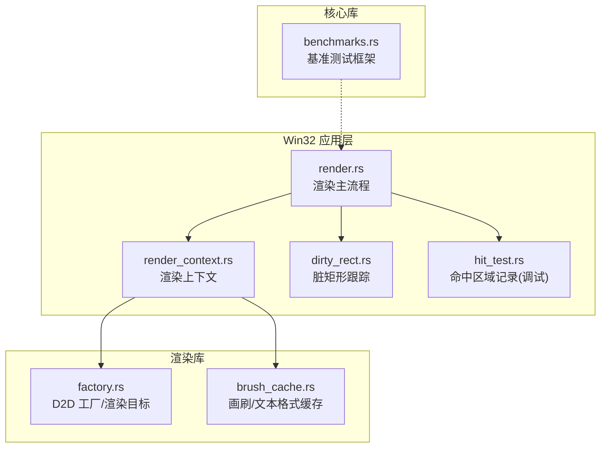
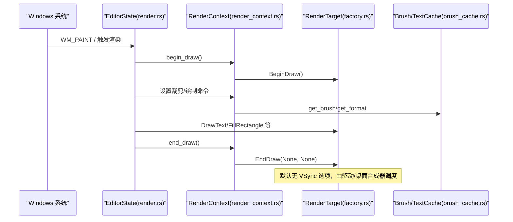
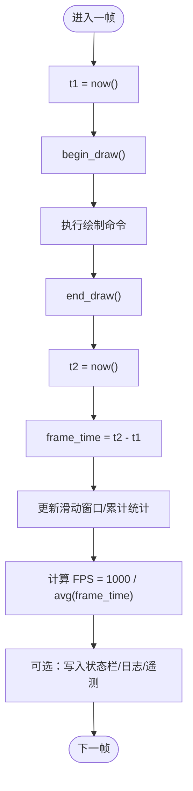
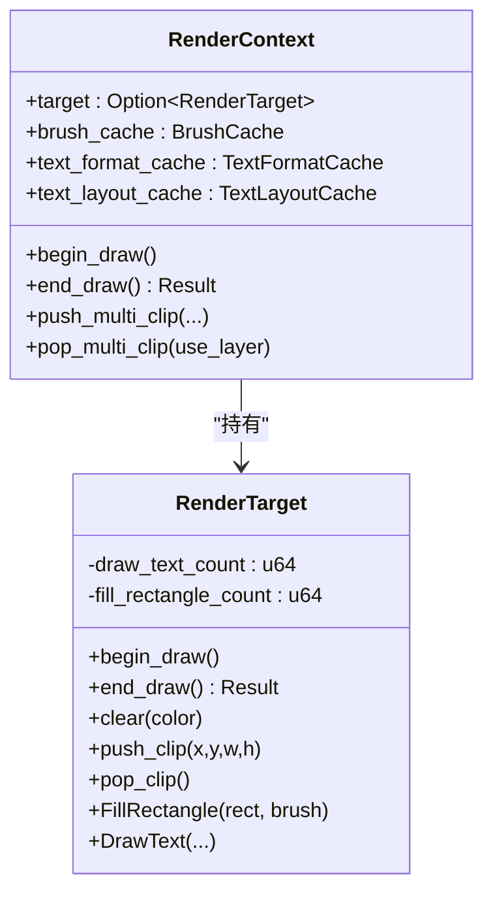
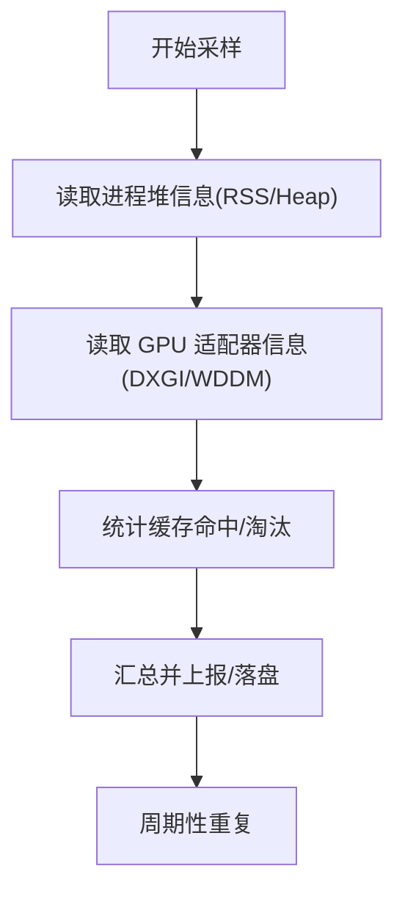
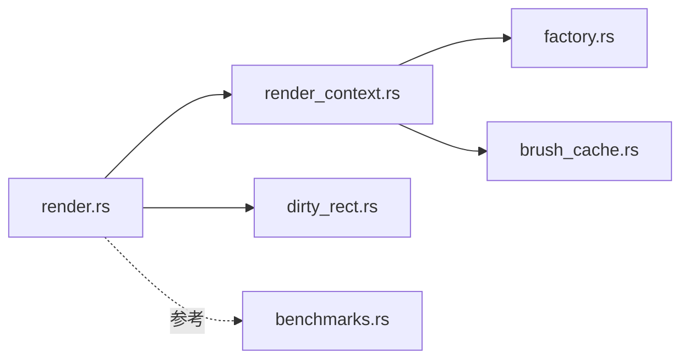

# 性能监控

<cite>
**本文引用的文件**   
- [crates/aether-win32/src/render.rs](file://crates/aether-win32/src/render.rs)
- [crates/aether-win32/src/render_context.rs](file://crates/aether-win32/src/render_context.rs)
- [crates/aether-render/src/d2d/factory.rs](file://crates/aether-render/src/d2d/factory.rs)
- [crates/aether-render/src/d2d/brush_cache.rs](file://crates/aether-render/src/d2d/brush_cache.rs)
- [crates/aether-core/src/benchmarks.rs](file://crates/aether-core/src/benchmarks.rs)
- [crates/aether-win32/src/dirty_rect.rs](file://crates/aether-win32/src/dirty_rect.rs)
- [crates/aether-win32/src/hit_test.rs](file://crates/aether-win32/src/hit_test.rs)
</cite>

## 目录
1. [简介](#简介)
2. [项目结构](#项目结构)
3. [核心组件](#核心组件)
4. [架构总览](#架构总览)
5. [详细组件分析](#详细组件分析)
6. [依赖分析](#依赖分析)
7. [性能考量](#性能考量)
8. [故障排查指南](#故障排查指南)
9. [结论](#结论)
10. [附录](#附录)

## 简介
本文件面向牧羊人编辑器的渲染性能监控系统，聚焦以下目标：
- 帧率统计的实现原理（VSync 同步、帧时间测量与 FPS 计算）
- 绘制调用计数器使用方法（DrawPrimitive、DrawText 等关键 API 的调用频率监控）
- 内存占用分析工具（堆内存泄漏检测、GPU 内存使用、缓存命中率统计）
- 性能基准测试框架的使用指南（自定义用例编写与结果对比）
- 性能回归检测与自动化监控配置
- 生产环境性能数据收集与上报机制

说明：仓库中未提供现成的“帧率统计”“绘制调用计数”“内存分析”“回归检测”“生产上报”模块。下文在严格依据现有代码的基础上，给出基于 Direct2D/DirectWrite 渲染路径的可行方案与集成建议，并明确标注哪些为现有实现、哪些为扩展建议。

## 项目结构
与渲染性能相关的关键位置：
- 渲染主循环与绘制入口：aether-win32/render.rs
- 渲染上下文封装：aether-win32/render_context.rs
- D2D 工厂与渲染目标：aether-render/d2d/factory.rs
- 画刷与文本格式缓存：aether-render/d2d/brush_cache.rs
- 脏矩形与局部重绘：aether-win32/dirty_rect.rs
- 命中区域记录（调试/测试构建）：aether-win32/hit_test.rs
- 基准测试框架：aether-core/benchmarks.rs

图表来源
- [crates/aether-win32/src/render.rs](file://crates/aether-win32/src/render.rs)
- [crates/aether-win32/src/render_context.rs](file://crates/aether-win32/src/render_context.rs)
- [crates/aether-render/src/d2d/factory.rs](file://crates/aether-render/src/d2d/factory.rs)
- [crates/aether-render/src/d2d/brush_cache.rs](file://crates/aether-render/src/d2d/brush_cache.rs)
- [crates/aether-win32/src/dirty_rect.rs](file://crates/aether-win32/src/dirty_rect.rs)
- [crates/aether-win32/src/hit_test.rs](file://crates/aether-win32/src/hit_test.rs)
- [crates/aether-core/src/benchmarks.rs](file://crates/aether-core/src/benchmarks.rs)

章节来源
- [crates/aether-win32/src/render.rs](file://crates/aether-win32/src/render.rs)
- [crates/aether-win32/src/render_context.rs](file://crates/aether-win32/src/render_context.rs)
- [crates/aether-render/src/d2d/factory.rs](file://crates/aether-render/src/d2d/factory.rs)
- [crates/aether-render/src/d2d/brush_cache.rs](file://crates/aether-render/src/d2d/brush_cache.rs)
- [crates/aether-win32/src/dirty_rect.rs](file://crates/aether-win32/src/dirty_rect.rs)
- [crates/aether-win32/src/hit_test.rs](file://crates/aether-win32/src/hit_test.rs)
- [crates/aether-core/src/benchmarks.rs](file://crates/aether-core/src/benchmarks.rs)

## 核心组件
- 渲染上下文 RenderContext：封装 D2D 渲染目标、画刷缓存、文本格式缓存与 TextLayout 缓存，提供 begin/end_draw、裁剪、设备丢失处理等能力。
- D2D 工厂与渲染目标：创建硬件加速的 HWND 渲染目标，支持 DPI 更新、多矩形裁剪（PushLayer + GeometryGroup）。
- 画刷与文本格式缓存：预存常用颜色与文本格式，降低每帧对象创建开销；包含 LRU 式回退策略。
- 脏矩形跟踪：合并小区域、阈值降级为全窗口重绘，减少无效绘制。
- 命中区域记录（调试）：仅在 debug 构建启用，输出可点击区域 JSONL，便于外部自动化测试。
- 基准测试框架：通用 run_benchmark 与 BenchmarkResult，用于 CPU 侧算法与数据结构性能评估。

章节来源
- [crates/aether-win32/src/render_context.rs](file://crates/aether-win32/src/render_context.rs)
- [crates/aether-render/src/d2d/factory.rs](file://crates/aether-render/src/d2d/factory.rs)
- [crates/aether-render/src/d2d/brush_cache.rs](file://crates/aether-render/src/d2d/brush_cache.rs)
- [crates/aether-win32/src/dirty_rect.rs](file://crates/aether-win32/src/dirty_rect.rs)
- [crates/aether-win32/src/hit_test.rs](file://crates/aether-win32/src/hit_test.rs)
- [crates/aether-core/src/benchmarks.rs](file://crates/aether-core/src/benchmarks.rs)

## 架构总览
下图展示从 Win32 消息到 GPU 提交的一次典型渲染帧流程，以及性能监控可扩展点。

图表来源
- [crates/aether-win32/src/render.rs](file://crates/aether-win32/src/render.rs)
- [crates/aether-win32/src/render_context.rs](file://crates/aether-win32/src/render_context.rs)
- [crates/aether-render/src/d2d/factory.rs](file://crates/aether-render/src/d2d/factory.rs)
- [crates/aether-render/src/d2d/brush_cache.rs](file://crates/aether-render/src/d2d/brush_cache.rs)

## 详细组件分析

### 帧率统计（FPS/VSync/帧时间）
现状
- 当前渲染目标创建时未显式开启 VSync（PresentOptions 为 0），EndDraw 也未指定 PresentOptions，因此是否垂直同步取决于驱动/桌面合成器行为。
- 未见内置的帧时间采集与 FPS 统计模块。

建议实现（不改变现有 API 的前提下）
- 在 render.rs 的主渲染循环中，于 begin_draw 前与 end_draw 后分别采样高精度时钟，得到 frame_time_ms。
- 维护滑动窗口平均（如最近 60 帧）计算 FPS，并在状态栏或调试面板显示。
- 若需强制 VSync，可在创建渲染目标时设置合适的 PresentOptions，或在 EndDraw 时传入带 VSync 的 PresentOptions（需确认 windows-rs 绑定可用参数）。

章节来源
- [crates/aether-render/src/d2d/factory.rs](file://crates/aether-render/src/d2d/factory.rs)
- [crates/aether-win32/src/render_context.rs](file://crates/aether-win32/src/render_context.rs)
- [crates/aether-win32/src/render.rs](file://crates/aether-win32/src/render.rs)

### 绘制调用计数器（DrawPrimitive/DrawText 等）
现状
- 渲染逻辑直接调用 ID2D1HwndRenderTarget 的 FillRectangle、DrawText 等方法，未见全局绘制调用计数。
- 存在大量文本绘制与几何填充调用，适合通过计数器进行热点定位。

建议实现
- 在 RenderContext 或 RenderTarget 包装层增加计数器：
  - draw_text_count、fill_rectangle_count、draw_line_count 等
  - 每帧重置，按秒聚合输出
- 将计数器暴露给 UI（状态栏/调试面板），并可导出到日志或遥测后端。
- 对高频调用路径（如行号、语法高亮文本）结合脏矩形与裁剪，减少不必要的绘制。

图表来源
- [crates/aether-win32/src/render_context.rs](file://crates/aether-win32/src/render_context.rs)
- [crates/aether-render/src/d2d/factory.rs](file://crates/aether-render/src/d2d/factory.rs)

章节来源
- [crates/aether-win32/src/render.rs](file://crates/aether-win32/src/render.rs)
- [crates/aether-win32/src/render_context.rs](file://crates/aether-win32/src/render_context.rs)
- [crates/aether-render/src/d2d/factory.rs](file://crates/aether-render/src/d2d/factory.rs)

### 内存占用分析（堆/GPU/缓存命中率）
现状
- 未发现堆内存泄漏检测或 GPU 内存查询模块。
- 已实现两类缓存：
  - 画刷缓存 BrushCache：预存数组 + HashMap，超过上限时清空回退缓存（简单 LRU 替代）。
  - 文本格式缓存 TextFormatCache：预存常用格式，避免重复创建 COM 对象。
  - 文本布局缓存 TextLayoutCache：避免每帧重复创建 TextLayout。

建议实现
- 堆内存：
  - Windows 平台可使用 GetProcessHeap/HeapQueryInformation 或第三方 crate（如 heaptrack、mimalloc stats）定期采样 RSS/堆大小。
  - 在 EditorState 生命周期关键点（打开大文件、切换主题、插件加载）前后采样，辅助定位增长趋势。
- GPU 内存：
  - 可通过 DXGI Adapter QueryInterface 获取 IDXGIInfoQueue 或 WDDM 信息（需要管理员权限），或使用 Visual Studio Graphics Debugger 离线分析。
- 缓存命中率：
  - 在 BrushCache::get_brush 与 TextFormatCache::get_format 中统计 hit/miss，计算命中率与淘汰次数，作为优化指标。

章节来源
- [crates/aether-render/src/d2d/brush_cache.rs](file://crates/aether-render/src/d2d/brush_cache.rs)
- [crates/aether-win32/src/render_context.rs](file://crates/aether-win32/src/render_context.rs)

### 脏矩形与局部重绘
现状
- DirtyRectTracker 负责标记脏区域、合并与阈值降级为全窗口重绘，配合 RenderTarget 的 push/pop_clip 与多矩形裁剪（GeometryGroup + PushLayer）。

建议
- 将脏矩形数量、合并次数、最终绘制面积占比纳入性能面板，帮助识别过度重绘场景。
- 针对频繁更新的区域（状态栏、标签页）优先走单矩形快路径，减少 Layer 创建。

章节来源
- [crates/aether-win32/src/dirty_rect.rs](file://crates/aether-win32/src/dirty_rect.rs)
- [crates/aether-render/src/d2d/factory.rs](file://crates/aether-render/src/d2d/factory.rs)
- [crates/aether-win32/src/render_context.rs](file://crates/aether-win32/src/render_context.rs)

### 命中区域记录（调试/测试）
现状
- hit_test.rs 在 debug 构建下记录每帧可点击区域，输出 JSONL 供外部自动化测试读取；release 构建为空实现零开销。

用途
- 可用于 UI 自动化与回归测试，间接反映界面元素布局稳定性。

章节来源
- [crates/aether-win32/src/hit_test.rs](file://crates/aether-win32/src/hit_test.rs)

### 基准测试框架
现状
- aether-core/benchmarks.rs 提供 run_benchmark 与 BenchmarkResult，支持最大时长限制、预热、吞吐统计与报告输出。
- 已覆盖 PieceTable、SIMD、增量词法分析等场景。

用法要点
- 使用 run_benchmark(name, iterations, max_total_secs, closure) 包裹被测代码。
- 使用 run_all_benchmarks 统一运行套件并打印汇总。
- 可将结果持久化并与基线对比，用于回归检测。

章节来源
- [crates/aether-core/src/benchmarks.rs](file://crates/aether-core/src/benchmarks.rs)

## 依赖分析
- render.rs 依赖 RenderContext 提供的 begin/end_draw、裁剪与资源初始化。
- RenderContext 依赖 D2DFactory/RenderTarget 与 BrushCache/TextFormatCache/TextLayoutCache。
- dirty_rect.rs 与 RenderTarget 的多矩形裁剪协同工作，影响实际绘制面积。
- benchmarks.rs 独立于渲染管线，主要用于 CPU 侧算法与数据结构性能评估。

图表来源
- [crates/aether-win32/src/render.rs](file://crates/aether-win32/src/render.rs)
- [crates/aether-win32/src/render_context.rs](file://crates/aether-win32/src/render_context.rs)
- [crates/aether-render/src/d2d/factory.rs](file://crates/aether-render/src/d2d/factory.rs)
- [crates/aether-render/src/d2d/brush_cache.rs](file://crates/aether-render/src/d2d/brush_cache.rs)
- [crates/aether-win32/src/dirty_rect.rs](file://crates/aether-win32/src/dirty_rect.rs)
- [crates/aether-core/src/benchmarks.rs](file://crates/aether-core/src/benchmarks.rs)

## 性能考量
- 避免每帧创建 COM 对象：利用 BrushCache、TextFormatCache、TextLayoutCache 复用对象，减少分配与销毁成本。
- 合理使用裁剪与脏矩形：尽量走单矩形快路径，必要时使用多矩形裁剪以减少重绘面积。
- 控制文本绘制量：对不可见区域跳过 DrawText；对频繁更新文本采用增量布局缓存。
- 帧时间稳定：在可能的情况下开启 VSync，避免撕裂与抖动；同时监控长尾帧。
- 基准先行：新增功能前先写基准用例，确保不会引入退化。

[本节为通用指导，无需源码引用]

## 故障排查指南
- 设备丢失（D2DERR_RECREATE_TARGET）：
  - 现象：end_draw 返回特定错误码，需重建渲染目标与清理缓存。
  - 处理：调用 handle_device_lost 重置 target 与缓存，随后重新初始化。
- 多矩形裁剪失败：
  - 现象：GeometryGroup/PushLayer 失败。
  - 处理：回退为包围盒 AxisAlignedClip，保证渲染正确性。
- 命中区域为空（release 构建）：
  - 现象：debug 构建下正常，release 构建为空实现。
  - 处理：确认构建模式，仅 debug/test 构建启用。

章节来源
- [crates/aether-win32/src/render.rs](file://crates/aether-win32/src/render.rs)
- [crates/aether-win32/src/render_context.rs](file://crates/aether-win32/src/render_context.rs)
- [crates/aether-render/src/d2d/factory.rs](file://crates/aether-render/src/d2d/factory.rs)
- [crates/aether-win32/src/hit_test.rs](file://crates/aether-win32/src/hit_test.rs)

## 结论
本项目已具备高性能渲染的基础设施（D2D 硬件加速、丰富的缓存、脏矩形与多矩形裁剪），但尚未内置完整的“帧率统计、绘制调用计数、内存分析、回归检测与生产上报”模块。建议在现有渲染上下文中以最小侵入方式扩展这些能力，并通过基准测试与 CI 流水线保障长期稳定性。

[本节为总结，无需源码引用]

## 附录

### 自定义基准用例编写指南
- 选择 run_benchmark 包裹被测函数，合理设置迭代次数与最大总时长。
- 生成代表性数据集（如大文件、复杂语法树），确保用例贴近真实负载。
- 将结果保存到文件或标准输出，便于后续对比。

章节来源
- [crates/aether-core/src/benchmarks.rs](file://crates/aether-core/src/benchmarks.rs)

### 性能回归检测与自动化监控（建议）
- 本地：在 PR 阶段运行关键基准用例，比较与基线的差异，超阈则阻断合并。
- CI：在 GitHub Actions 中安装 Rust 工具链，执行基准套件并归档结果。
- 存储：将每次运行的结果（JSON/CSV）上传至对象存储或数据库，形成时序图。
- 告警：当平均帧时间上升或吞吐量下降超过阈值时发出告警。

[本节为通用建议，无需源码引用]

### 生产环境性能数据收集与上报（建议）
- 收集项：FPS、帧时间分布、绘制调用计数、缓存命中率、脏矩形面积占比、堆内存快照。
- 上报策略：按分钟聚合，压缩后异步上报至遥测服务；敏感信息脱敏。
- 开关与隐私：提供运行时开关，允许用户关闭遥测；遵循隐私合规要求。

[本节为通用建议，无需源码引用]