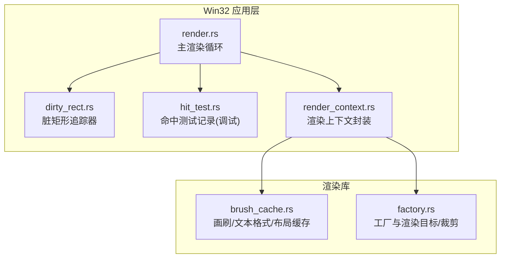
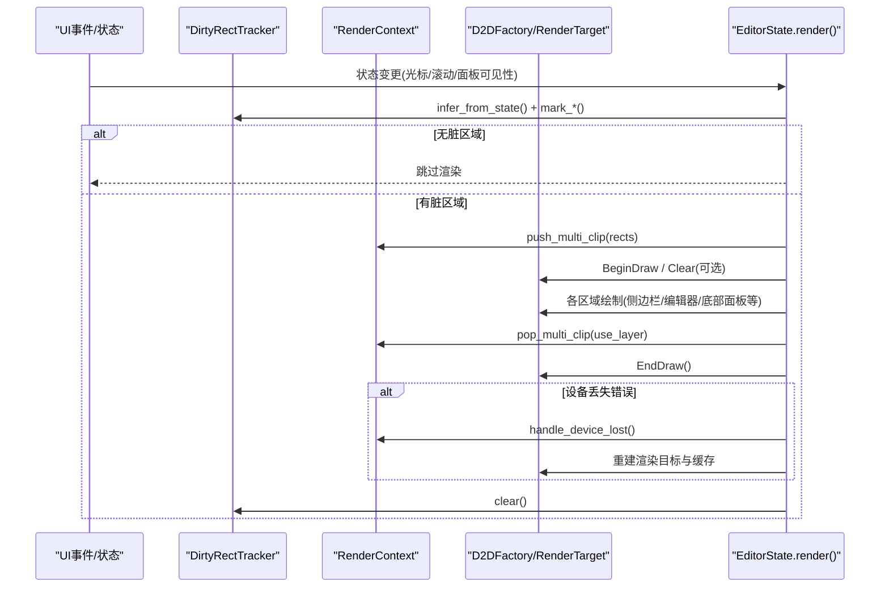
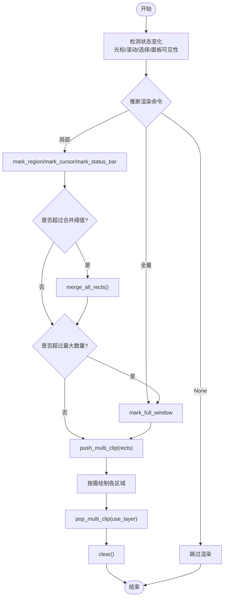
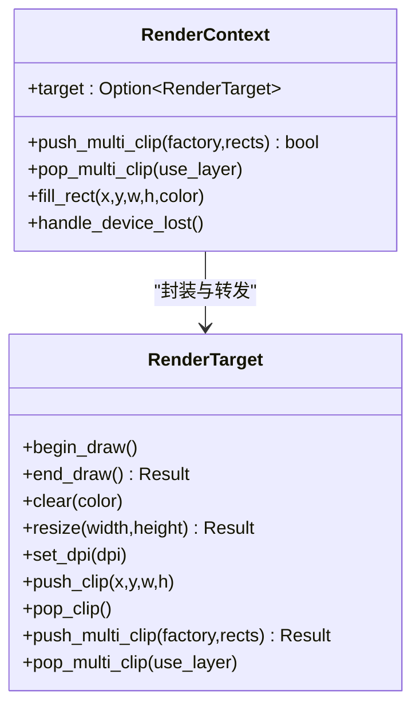
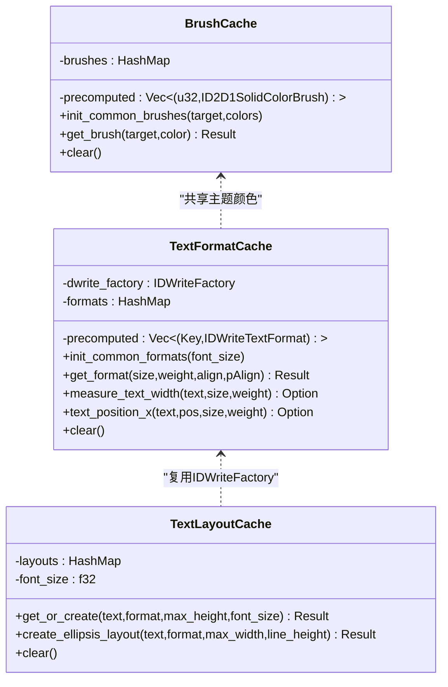
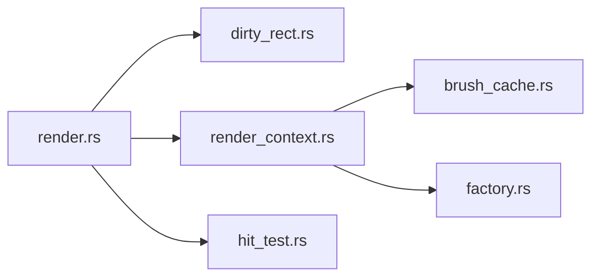

# 渲染优化

<cite>
**本文引用的文件列表**
- [crates/aether-win32/src/render.rs](file://crates/aether-win32/src/render.rs)
- [crates/aether-win32/src/dirty_rect.rs](file://crates/aether-win32/src/dirty_rect.rs)
- [crates/aether-render/src/d2d/brush_cache.rs](file://crates/aether-render/src/d2d/brush_cache.rs)
- [crates/aether-render/src/d2d/factory.rs](file://crates/aether-render/src/d2d/factory.rs)
- [crates/aether-win32/src/render_context.rs](file://crates/aether-win32/src/render_context.rs)
- [crates/aether-win32/src/hit_test.rs](file://crates/aether-win32/src/hit_test.rs)
- [crates/aether-core/src/benchmarks.rs](file://crates/aether-core/src/benchmarks.rs)
</cite>

## 目录
1. [简介](#简介)
2. [项目结构](#项目结构)
3. [核心组件](#核心组件)
4. [架构总览](#架构总览)
5. [详细组件分析](#详细组件分析)
6. [依赖关系分析](#依赖关系分析)
7. [性能考量](#性能考量)
8. [故障排查指南](#故障排查指南)
9. [结论](#结论)
10. [附录](#附录)

## 简介
本专题聚焦牧羊人编辑器的 Direct2D 渲染管线优化，围绕以下目标展开：
- 脏矩形计算算法：区域合并、重叠检测与增量更新策略
- 绘制缓存机制：位图缓存、字体缓存、颜色缓存的失效策略
- GPU 加速利用：顶点缓冲与纹理贴图的使用现状与建议
- 渲染性能监控：帧率统计、绘制调用计数、内存占用分析方法
- 不同硬件配置下的调优建议与最佳实践

## 项目结构
本项目采用多 crate 组织，渲染相关代码主要分布在 aether-win32（UI 与渲染编排）与 aether-render（Direct2D/DirectWrite 资源与工具）。

图表来源
- [crates/aether-win32/src/render.rs:62-780](file://crates/aether-win32/src/render.rs#L62-L780)
- [crates/aether-win32/src/dirty_rect.rs:88-366](file://crates/aether-win32/src/dirty_rect.rs#L88-L366)
- [crates/aether-win32/src/render_context.rs:10-226](file://crates/aether-win32/src/render_context.rs#L10-L226)
- [crates/aether-render/src/d2d/brush_cache.rs:30-106](file://crates/aether-render/src/d2d/brush_cache.rs#L30-L106)
- [crates/aether-render/src/d2d/factory.rs:15-271](file://crates/aether-render/src/d2d/factory.rs#L15-L271)
- [crates/aether-win32/src/hit_test.rs:1-207](file://crates/aether-win32/src/hit_test.rs#L1-L207)

章节来源
- [crates/aether-win32/src/render.rs:62-780](file://crates/aether-win32/src/render.rs#L62-L780)
- [crates/aether-win32/src/dirty_rect.rs:88-366](file://crates/aether-win32/src/dirty_rect.rs#L88-L366)
- [crates/aether-render/src/d2d/brush_cache.rs:30-106](file://crates/aether-render/src/d2d/brush_cache.rs#L30-L106)
- [crates/aether-render/src/d2d/factory.rs:15-271](file://crates/aether-render/src/d2d/factory.rs#L15-L271)
- [crates/aether-win32/src/render_context.rs:10-226](file://crates/aether-win32/src/render_context.rs#L10-L226)
- [crates/aether-win32/src/hit_test.rs:1-207](file://crates/aether-win32/src/hit_test.rs#L1-L207)

## 核心组件
- 脏矩形追踪器：负责标记需要重绘的区域、按类型合并重叠矩形、在数量过多时降级为全窗口重绘。
- 渲染上下文：封装 D2D 渲染目标、画刷/文本格式/布局缓存，提供多矩形并集裁剪能力。
- 画刷与文本缓存：预存常用颜色画笔与文本格式，避免每帧创建 COM 对象；TextLayout 缓存减少重复布局构建。
- 工厂与渲染目标：管理硬件加速渲染目标、DPI 设置、轴对齐裁剪与几何组裁剪。

章节来源
- [crates/aether-win32/src/dirty_rect.rs:88-366](file://crates/aether-win32/src/dirty_rect.rs#L88-L366)
- [crates/aether-win32/src/render_context.rs:10-226](file://crates/aether-win32/src/render_context.rs#L10-L226)
- [crates/aether-render/src/d2d/brush_cache.rs:30-106](file://crates/aether-render/src/d2d/brush_cache.rs#L30-L106)
- [crates/aether-render/src/d2d/factory.rs:15-271](file://crates/aether-render/src/d2d/factory.rs#L15-L271)

## 架构总览
下图展示了从状态变化到最终绘制的关键流程，包括脏矩形推断、多矩形裁剪、按需绘制与设备丢失恢复。

图表来源
- [crates/aether-win32/src/render.rs:62-780](file://crates/aether-win32/src/render.rs#L62-L780)
- [crates/aether-win32/src/dirty_rect.rs:368-426](file://crates/aether-win32/src/dirty_rect.rs#L368-L426)
- [crates/aether-win32/src/render_context.rs:107-155](file://crates/aether-win32/src/render_context.rs#L107-L155)
- [crates/aether-render/src/d2d/factory.rs:172-263](file://crates/aether-render/src/d2d/factory.rs#L172-L263)

## 详细组件分析

### 脏矩形计算与增量更新
- 区域类型与标记：支持标题栏、菜单栏、活动栏、侧边栏、编辑器内容、标签栏、状态栏、右侧面板、底部面板、对话框、全窗口等类型。
- 重叠检测与合并：同类型且相交的矩形会合并，降低绘制调用次数。
- 阈值与降级：当脏矩形数量超过阈值或最大限制时，触发全窗口重绘，保证稳定性。
- 渲染命令推断：根据光标移动、选择变化、滚动、面板可见性等状态推断最小必要重绘范围。

图表来源
- [crates/aether-win32/src/dirty_rect.rs:120-162](file://crates/aether-win32/src/dirty_rect.rs#L120-L162)
- [crates/aether-win32/src/dirty_rect.rs:336-356](file://crates/aether-win32/src/dirty_rect.rs#L336-L356)
- [crates/aether-win32/src/dirty_rect.rs:368-426](file://crates/aether-win32/src/dirty_rect.rs#L368-L426)
- [crates/aether-win32/src/render.rs:394-410](file://crates/aether-win32/src/render.rs#L394-L410)

章节来源
- [crates/aether-win32/src/dirty_rect.rs:88-366](file://crates/aether-win32/src/dirty_rect.rs#L88-L366)
- [crates/aether-win32/src/render.rs:284-383](file://crates/aether-win32/src/render.rs#L284-L383)

### 多矩形并集裁剪与层级控制
- 单矩形快路径：使用 PushAxisAlignedClip 快速裁剪。
- 多矩形路径：通过 ID2D1GeometryGroup（Union）+ PushLayer 实现真正的多矩形并集裁剪，避免合并为单一包围盒导致的重绘面积膨胀。
- 回退策略：若多矩形裁剪失败，回退为包围盒裁剪，确保鲁棒性。

图表来源
- [crates/aether-render/src/d2d/factory.rs:143-271](file://crates/aether-render/src/d2d/factory.rs#L143-L271)
- [crates/aether-win32/src/render_context.rs:107-155](file://crates/aether-win32/src/render_context.rs#L107-L155)

章节来源
- [crates/aether-render/src/d2d/factory.rs:172-263](file://crates/aether-render/src/d2d/factory.rs#L172-L263)
- [crates/aether-win32/src/render_context.rs:107-155](file://crates/aether-win32/src/render_context.rs#L107-L155)

### 绘制缓存机制与失效策略
- 颜色画刷缓存（BrushCache）
  - 预存常用颜色画笔（小数组线性扫描），未命中则回退 HashMap。
  - 超出最大条目数时清空回退缓存，避免无界增长。
  - 设备丢失时清空所有缓存。
- 文本格式缓存（TextFormatCache）
  - 预存常用格式（左对齐、右对齐、居中），键包含字号、字重、对齐方式。
  - 超出最大条目数时清空回退缓存。
  - 提供测量文本宽度与位置的工具方法。
- 文本布局缓存（TextLayoutCache）
  - 基于文本内容与格式缓存 IDWriteTextLayout，避免重复创建。
  - 字号变化时自动清空缓存；超出上限时清空。
  - 提供带省略号的布局创建接口用于单行截断场景。

图表来源
- [crates/aether-render/src/d2d/brush_cache.rs:30-106](file://crates/aether-render/src/d2d/brush_cache.rs#L30-L106)
- [crates/aether-render/src/d2d/brush_cache.rs:113-374](file://crates/aether-render/src/d2d/brush_cache.rs#L113-L374)
- [crates/aether-render/src/d2d/brush_cache.rs:384-477](file://crates/aether-render/src/d2d/brush_cache.rs#L384-L477)

章节来源
- [crates/aether-render/src/d2d/brush_cache.rs:30-106](file://crates/aether-render/src/d2d/brush_cache.rs#L30-L106)
- [crates/aether-render/src/d2d/brush_cache.rs:113-374](file://crates/aether-render/src/d2d/brush_cache.rs#L113-L374)
- [crates/aether-render/src/d2d/brush_cache.rs:384-477](file://crates/aether-render/src/d2d/brush_cache.rs#L384-L477)

### GPU 加速利用现状与建议
- 现状
  - 渲染目标类型为硬件加速（D2D1_RENDER_TARGET_TYPE_HARDWARE），启用 GPU 加速。
  - 文本绘制使用 DirectWrite 与 IDWriteTextLayout，结合缓存减少 CPU 开销。
  - 图标与矢量图形通过几何绘制，未显式使用自定义顶点缓冲区。
- 建议
  - 对高频重复的图标/按钮形状，可考虑将几何转换为纹理贴图进行批渲染，减少几何构造与混合开销。
  - 对于大量相同样式的矩形/线条，可使用统一的顶点缓冲与索引缓冲批量提交，降低驱动交互次数。
  - 大背景或复杂阴影效果可预合成至离屏纹理，按需贴入，减少每帧几何计算。

章节来源
- [crates/aether-render/src/d2d/factory.rs:42-62](file://crates/aether-render/src/d2d/factory.rs#L42-L62)
- [crates/aether-render/src/d2d/brush_cache.rs:384-477](file://crates/aether-render/src/d2d/brush_cache.rs#L384-L477)

### 性能监控工具与方法
- 基准框架
  - 提供通用基准运行器，支持预热、迭代计时、吞吐统计，可用于评估渲染子系统的耗时。
- 命中测试记录（调试构建）
  - 记录每帧可点击区域，便于自动化测试与可视化分析；release 构建下零开销。
- 建议指标
  - 帧率统计：以基准框架统计 render() 平均耗时，换算 FPS。
  - 绘制调用计数：在关键绘制函数入口/出口处计数（如 FillRectangle、DrawText、DrawEllipse），观察热点。
  - 内存占用分析：关注缓存大小（画刷/文本格式/布局）、位图与纹理尺寸，避免无界增长。

章节来源
- [crates/aether-core/src/benchmarks.rs:55-87](file://crates/aether-core/src/benchmarks.rs#L55-L87)
- [crates/aether-win32/src/hit_test.rs:59-172](file://crates/aether-win32/src/hit_test.rs#L59-L172)

## 依赖关系分析
- 耦合与内聚
  - render.rs 作为编排中心，依赖 dirty_rect.rs 进行增量更新决策，依赖 render_context.rs 进行资源访问与裁剪控制。
  - render_context.rs 聚合 brush_cache、text_format_cache、text_layout_cache，提升内聚度，避免 EditorState 持有过多资源引用。
- 外部依赖
  - Direct2D 工厂与渲染目标由 factory.rs 管理，提供硬件加速渲染目标与多矩形裁剪。
  - DirectWrite 工厂与文本布局由 brush_cache.rs 中的缓存模块管理，减少 COM 对象创建成本。
- 潜在循环依赖
  - 当前结构清晰，未见循环导入；如需扩展，应保持“上层编排、下层资源”的分层原则。

图表来源
- [crates/aether-win32/src/render.rs:62-780](file://crates/aether-win32/src/render.rs#L62-L780)
- [crates/aether-win32/src/dirty_rect.rs:88-366](file://crates/aether-win32/src/dirty_rect.rs#L88-L366)
- [crates/aether-win32/src/render_context.rs:10-226](file://crates/aether-win32/src/render_context.rs#L10-L226)
- [crates/aether-render/src/d2d/brush_cache.rs:30-106](file://crates/aether-render/src/d2d/brush_cache.rs#L30-L106)
- [crates/aether-render/src/d2d/factory.rs:15-271](file://crates/aether-render/src/d2d/factory.rs#L15-L271)
- [crates/aether-win32/src/hit_test.rs:1-207](file://crates/aether-win32/src/hit_test.rs#L1-L207)

章节来源
- [crates/aether-win32/src/render.rs:62-780](file://crates/aether-win32/src/render.rs#L62-L780)
- [crates/aether-win32/src/render_context.rs:10-226](file://crates/aether-win32/src/render_context.rs#L10-L226)

## 性能考量
- 脏矩形合并与降级
  - 合理设置 merge_threshold 与 max_rects，避免过多小矩形导致裁剪与绘制开销上升。
  - 在频繁变化的场景（如终端输出）优先使用行级或区域级标记，而非全窗口重绘。
- 多矩形裁剪
  - 多矩形并集裁剪能显著减少无效绘制，但需权衡几何组创建与 PushLayer 的开销；单矩形走快路径已优化。
- 缓存命中率
  - 预初始化常用颜色与文本格式，提高预存数组命中率，减少 HashMap 查找与 COM 对象创建。
  - TextLayout 缓存对高频重复文本收益明显，注意字号变化时的清理策略。
- 设备丢失处理
  - 捕获设备丢失错误后，及时清理并重建渲染目标与缓存，避免后续绘制异常。

[本节为通用指导，不直接分析具体文件]

## 故障排查指南
- 常见问题
  - 黑屏或区域缺失：检查欢迎页与脏矩形裁剪组合时的背景填充逻辑，确保被裁剪区域正确覆盖。
  - 设备丢失：EndDraw 返回特定错误码时需重建渲染目标与缓存。
  - 文本错位：确保 TextLayout 与测量函数保持一致（不含 null 终止符），避免宽度偏差。
- 定位手段
  - 使用基准框架统计 render() 耗时，定位慢点。
  - 在 debug 构建下启用命中测试记录，验证 UI 区域与交互一致性。
  - 观察缓存大小与条目数，必要时调整最大条目数以控制内存增长。

章节来源
- [crates/aether-win32/src/render.rs:704-746](file://crates/aether-win32/src/render.rs#L704-L746)
- [crates/aether-render/src/d2d/brush_cache.rs:384-477](file://crates/aether-render/src/d2d/brush_cache.rs#L384-L477)
- [crates/aether-win32/src/hit_test.rs:59-172](file://crates/aether-win32/src/hit_test.rs#L59-L172)

## 结论
本项目在 Direct2D 渲染管线上实现了较为完善的脏矩形增量更新、多矩形并集裁剪与丰富的绘制缓存机制，有效降低了不必要的重绘与 COM 对象创建开销。GPU 加速已通过硬件渲染目标启用，未来可在几何转纹理、批量顶点缓冲等方面进一步优化。配合基准框架与命中测试记录，可系统化地进行性能分析与问题定位。

[本节为总结，不直接分析具体文件]

## 附录
- 最佳实践清单
  - 优先使用区域级标记，避免全窗口重绘。
  - 预初始化常用颜色与文本格式，提升缓存命中率。
  - 对高频重复元素考虑纹理化与批量绘制。
  - 严格处理设备丢失，确保资源重建与缓存清理。
  - 使用基准框架与命中测试记录持续监控性能与交互质量。

[本节为补充说明，不直接分析具体文件]