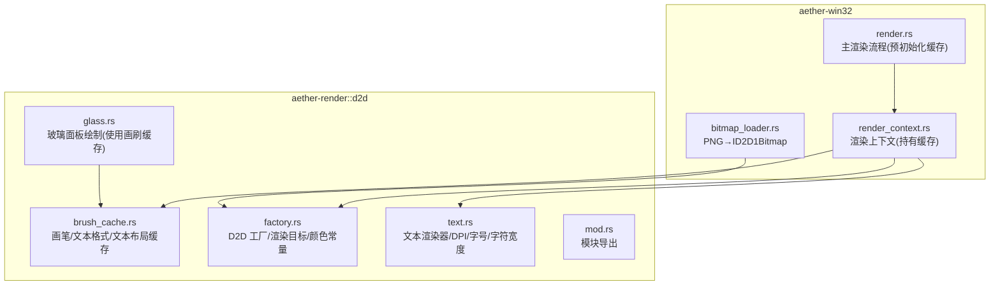
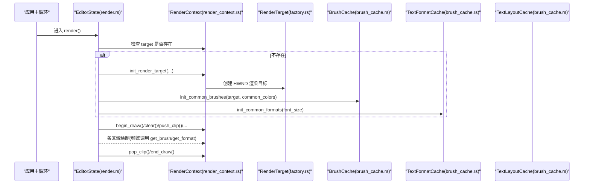
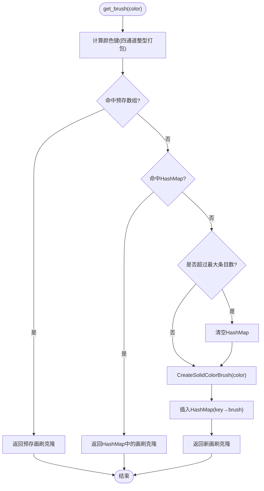
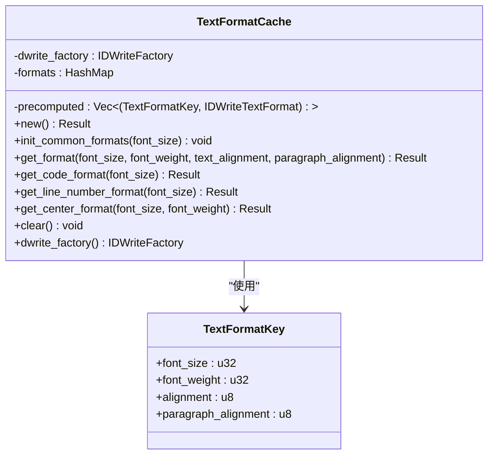
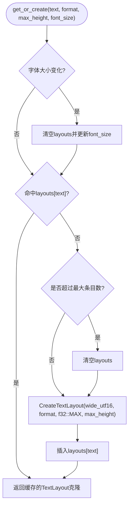
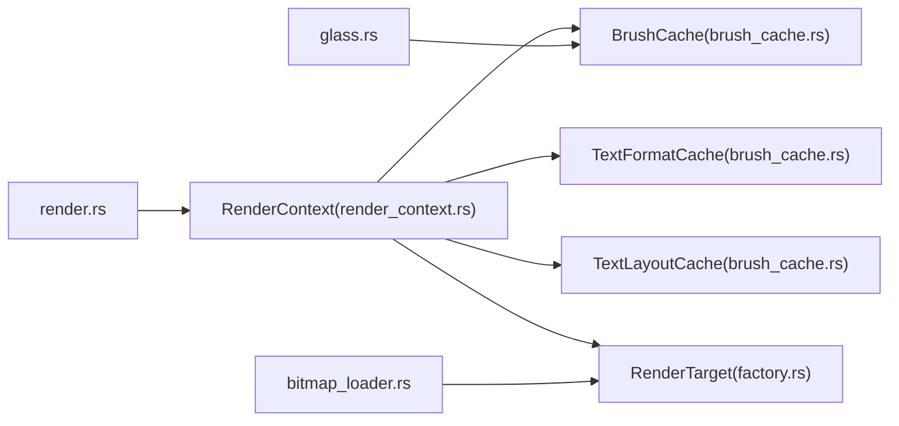

# 渲染缓存

<cite>
**本文引用的文件**   
- [brush_cache.rs](file://crates/aether-render/src/d2d/brush_cache.rs)
- [factory.rs](file://crates/aether-render/src/d2d/factory.rs)
- [text.rs](file://crates/aether-render/src/d2d/text.rs)
- [glass.rs](file://crates/aether-render/src/d2d/glass.rs)
- [mod.rs](file://crates/aether-render/src/d2d/mod.rs)
- [render_context.rs](file://crates/aether-win32/src/render_context.rs)
- [render.rs](file://crates/aether-win32/src/render.rs)
- [bitmap_loader.rs](file://crates/aether-win32/src/bitmap_loader.rs)
</cite>

## 目录
1. [简介](#简介)
2. [项目结构](#项目结构)
3. [核心组件](#核心组件)
4. [架构总览](#架构总览)
5. [详细组件分析](#详细组件分析)
6. [依赖关系分析](#依赖关系分析)
7. [性能考量](#性能考量)
8. [故障排查指南](#故障排查指南)
9. [结论](#结论)
10. [附录](#附录)

## 简介
本文件面向牧羊人编辑器的渲染子系统，聚焦 Direct2D 资源缓存体系与相关优化策略。文档围绕以下目标展开：
- 画笔缓存（Brush Cache）、字体缓存（TextFormatCache）与文本布局缓存（TextLayoutCache）的实现原理
- 颜色缓存的键生成与一致性保证
- 缓存失效策略：容量上限、设备丢失清理、字体大小变化触发清理等
- 位图缓存与纹理复用：PNG 解码到 ID2D1Bitmap 的流程与注意事项
- 命中率统计与性能监控工具的使用建议
- 不同场景下的缓存配置建议与最佳实践
- 常见问题诊断与解决方案

## 项目结构
渲染缓存相关代码主要位于 aether-render 的 d2d 模块，并在 aether-win32 中集成使用。关键组织方式如下：
- aether-render/src/d2d
  - brush_cache.rs：画笔缓存、文本格式缓存、文本布局缓存
  - factory.rs：Direct2D 工厂与渲染目标封装、颜色常量
  - text.rs：文本渲染器（含 DPI/字号自适应与字符宽度测量）
  - glass.rs：玻璃面板绘制辅助（大量使用画刷缓存）
  - mod.rs：模块导出
- aether-win32/src
  - render_context.rs：渲染上下文，统一持有并初始化各类缓存
  - render.rs：主渲染流程，负责在渲染目标就绪后预初始化常用资源
  - bitmap_loader.rs：PNG 解码为 ID2D1Bitmap（位图创建）

图示来源
- [brush_cache.rs:1-120](file://crates/aether-render/src/d2d/brush_cache.rs#L1-L120)
- [factory.rs:14-142](file://crates/aether-render/src/d2d/factory.rs#L14-L142)
- [text.rs:14-132](file://crates/aether-render/src/d2d/text.rs#L14-L132)
- [glass.rs:1-62](file://crates/aether-render/src/d2d/glass.rs#L1-L62)
- [mod.rs:1-5](file://crates/aether-render/src/d2d/mod.rs#L1-L5)
- [render_context.rs:1-46](file://crates/aether-win32/src/render_context.rs#L1-L46)
- [render.rs:100-134](file://crates/aether-win32/src/render.rs#L100-L134)
- [bitmap_loader.rs:1-77](file://crates/aether-win32/src/bitmap_loader.rs#L1-L77)

章节来源
- [mod.rs:1-5](file://crates/aether-render/src/d2d/mod.rs#L1-L5)
- [render_context.rs:1-46](file://crates/aether-win32/src/render_context.rs#L1-L46)
- [render.rs:100-134](file://crates/aether-win32/src/render.rs#L100-L134)

## 核心组件
- 画笔缓存 BrushCache
  - 预存常用颜色画笔的小数组 + HashMap 回退
  - 提供 init_common_brushes/get_brush/clear 接口
- 文本格式缓存 TextFormatCache
  - 预存常用文本格式（左对齐/右对齐/居中）+ HashMap 回退
  - 提供 init_common_formats/get_format/get_code_format/get_line_number_format/get_center_format/clear
- 文本布局缓存 TextLayoutCache
  - 基于文本内容缓存 IDWriteTextLayout，避免每帧重复创建
  - 字体大小变化时自动清空；超出条目数时整体清空
- 渲染上下文 RenderContext
  - 统一持有 D2D 渲染目标、BrushCache、TextFormatCache、TextLayoutCache
  - 提供 init_render_target/init_common_resources/handle_device_lost 等方法
- 文本渲染器 TextRenderer
  - 管理 DirectWrite 工厂与文本格式，支持 DPI 缩放与字号调整
  - 提供字符宽度测量与行渲染方法
- 玻璃面板绘制 glass
  - 通过 BrushCache 获取画刷进行填充与描边
- 位图加载 bitmap_loader
  - PNG 解码为 BGRA8 预乘 alpha 数据，再调用 CreateBitmap 创建 ID2D1Bitmap

章节来源
- [brush_cache.rs:25-106](file://crates/aether-render/src/d2d/brush_cache.rs#L25-L106)
- [brush_cache.rs:108-314](file://crates/aether-render/src/d2d/brush_cache.rs#L108-L314)
- [brush_cache.rs:376-477](file://crates/aether-render/src/d2d/brush_cache.rs#L376-L477)
- [render_context.rs:10-46](file://crates/aether-win32/src/render_context.rs#L10-L46)
- [text.rs:14-132](file://crates/aether-render/src/d2d/text.rs#L14-L132)
- [glass.rs:12-62](file://crates/aether-render/src/d2d/glass.rs#L12-L62)
- [bitmap_loader.rs:12-77](file://crates/aether-win32/src/bitmap_loader.rs#L12-L77)

## 架构总览
渲染缓存系统以 RenderContext 为中心，聚合所有与 Direct2D/DirectWrite 相关的可复用资源。主渲染流程在首次或设备丢失重建后，预初始化常用画刷与文本格式，从而在后续渲染路径中命中缓存，减少 COM 对象分配与跨层调用开销。

图示来源
- [render.rs:100-134](file://crates/aether-win32/src/render.rs#L100-L134)
- [render_context.rs:33-46](file://crates/aether-win32/src/render_context.rs#L33-L46)
- [factory.rs:33-63](file://crates/aether-render/src/d2d/factory.rs#L33-L63)
- [brush_cache.rs:51-99](file://crates/aether-render/src/d2d/brush_cache.rs#L51-L99)
- [brush_cache.rs:141-194](file://crates/aether-render/src/d2d/brush_cache.rs#L141-L194)

## 详细组件分析

### 画笔缓存（BrushCache）
- 设计要点
  - 预存常用颜色画笔的小数组（线性扫描），提高热点命中速度
  - 未命中则回退到 HashMap；超过最大条目数时清空回退缓存，防止无界增长
  - 颜色键生成采用四通道整型打包，并对浮点分量做 round 处理，避免精度差异导致缓存分裂
- 关键行为
  - init_common_brushes：在渲染目标就绪后一次性预建常用主题色画刷
  - get_brush：查找顺序为“预存数组 → HashMap → 新建”，新建后插入 HashMap
  - clear：设备丢失时清空全部缓存
- 复杂度与性能
  - 预存数组长度较小（≤16），线性扫描常数极小，适合高频命中
  - HashMap 作为稀疏集合，平均 O(1) 查找；但受限于最大条目数，存在周期性全量清空带来的抖动风险
- 失效策略
  - 显式 clear（设备丢失）
  - 容量上限触发清空（简单替代 LRU）

图示来源
- [brush_cache.rs:68-99](file://crates/aether-render/src/d2d/brush_cache.rs#L68-L99)
- [brush_cache.rs:479-487](file://crates/aether-render/src/d2d/brush_cache.rs#L479-L487)

章节来源
- [brush_cache.rs:25-106](file://crates/aether-render/src/d2d/brush_cache.rs#L25-L106)
- [brush_cache.rs:479-487](file://crates/aether-render/src/d2d/brush_cache.rs#L479-L487)

### 字体缓存（TextFormatCache）
- 设计要点
  - 预存最常用的三种文本格式（代码左对齐、行号右对齐、居中）
  - 其他组合走 HashMap；超过最大条目数时清空回退缓存
  - 字体大小以整数化 key（乘以 10）避免浮点精度问题
- 关键行为
  - init_common_formats：在字体大小确定后预建常用格式
  - get_format/get_code_format/get_line_number_format/get_center_format：按参数构造 key 并查找/创建
  - clear：设备丢失或需要重置时清空
- 复杂度与性能
  - 预存数组极短（≤3），线性扫描几乎零开销
  - HashMap 用于非热点组合，平均 O(1)

图示来源
- [brush_cache.rs:108-194](file://crates/aether-render/src/d2d/brush_cache.rs#L108-L194)
- [brush_cache.rs:229-303](file://crates/aether-render/src/d2d/brush_cache.rs#L229-L303)

章节来源
- [brush_cache.rs:108-194](file://crates/aether-render/src/d2d/brush_cache.rs#L108-L194)
- [brush_cache.rs:229-303](file://crates/aether-render/src/d2d/brush_cache.rs#L229-L303)

### 文本布局缓存（TextLayoutCache）
- 设计要点
  - 以文本内容为 key 缓存 IDWriteTextLayout，显著降低 COM 对象创建次数
  - 字体大小变化时自动清空缓存，确保布局与当前字号一致
  - 超出最大条目数时整体清空，避免内存膨胀
- 关键行为
  - get_or_create(text, format, max_height, font_size)：查缓存/必要时创建并插入
  - create_ellipsis_layout：为单行省略号场景创建专用布局（不参与共享缓存）
  - clear：设备丢失或字体变化时清空
- 复杂度与性能
  - 字符串哈希与比较成本与文本长度相关；编辑器中常见 token 重复率高，命中收益大

图示来源
- [brush_cache.rs:405-442](file://crates/aether-render/src/d2d/brush_cache.rs#L405-L442)
- [brush_cache.rs:449-476](file://crates/aether-render/src/d2d/brush_cache.rs#L449-L476)

章节来源
- [brush_cache.rs:376-477](file://crates/aether-render/src/d2d/brush_cache.rs#L376-L477)

### 颜色缓存（颜色键与一致性）
- 颜色键生成将 RGBA 浮点分量映射为 0-255 整型并打包为 u32，同时对浮点值进行 round，避免如 0.47*255=119.85 截断误差导致的键不一致
- 该策略确保相同视觉颜色在不同来源（主题、计算、反序列化）下获得一致的缓存键

章节来源
- [brush_cache.rs:479-487](file://crates/aether-render/src/d2d/brush_cache.rs#L479-L487)

### 位图缓存与纹理贴图复用
- 当前仓库未实现专门的位图缓存层，但提供了从 PNG 字节创建 ID2D1Bitmap 的工具函数
- 典型用法：在欢迎页/空占位页等场景中，对同一图片数据进行解码并创建位图；若需复用，可在上层维护一个“文件名/哈希 → ID2D1Bitmap”的缓存表
- 注意事项
  - 像素格式要求 BGRA8 + 预乘 alpha
  - 某些环境可能不支持特定属性，已内置回退逻辑尝试默认属性

章节来源
- [bitmap_loader.rs:12-77](file://crates/aether-win32/src/bitmap_loader.rs#L12-L77)

### 玻璃面板绘制与画刷缓存协作
- glass 模块通过 BrushCache 获取背景、边框、阴影等画刷，避免每帧重复创建
- 典型流程：fill background → optional border strips → glow/shadow layers

章节来源
- [glass.rs:12-62](file://crates/aether-render/src/d2d/glass.rs#L12-L62)

## 依赖关系分析
- 组件耦合
  - RenderContext 聚合 BrushCache、TextFormatCache、TextLayoutCache 与 RenderTarget
  - 主渲染流程在 EditorState.render 中负责在渲染目标就绪后预初始化常用资源
  - glass 模块依赖 BrushCache
  - bitmap_loader 依赖 Direct2D 渲染目标与像素格式
- 外部依赖
  - Direct2D：ID2D1HwndRenderTarget、ID2D1SolidColorBrush、ID2D1Factory1 等
  - DirectWrite：IDWriteFactory、IDWriteTextFormat、IDWriteTextLayout 等

图示来源
- [render_context.rs:10-46](file://crates/aether-win32/src/render_context.rs#L10-L46)
- [render.rs:100-134](file://crates/aether-win32/src/render.rs#L100-L134)
- [glass.rs:1-62](file://crates/aether-render/src/d2d/glass.rs#L1-62)
- [bitmap_loader.rs:1-77](file://crates/aether-win32/src/bitmap_loader.rs#L1-L77)

章节来源
- [render_context.rs:10-46](file://crates/aether-win32/src/render_context.rs#L10-L46)
- [render.rs:100-134](file://crates/aether-win32/src/render.rs#L100-L134)

## 性能考量
- 命中优先路径
  - 预存数组线性扫描适用于极小集合，命中代价极低
  - 文本布局缓存对高频重复 token 的收益显著
- 淘汰策略
  - 当前采用“达到上限后整体清空”的简单策略，实现成本低，但存在周期性抖动
  - 如需更平滑的淘汰，可引入 LRU 或 LFU（例如维护访问计数或使用有序容器）
- 内存占用监控
  - 可通过记录各缓存的 entries 数量与估算单个对象大小来近似监控内存占用
  - 建议在调试构建中输出缓存统计信息（条目数、命中率、清空次数）
- 增量更新
  - 文本布局缓存按文本内容 key 区分，天然支持增量：仅当文本变化时才重建
  - 位图层面可按“文件名/哈希”在上层维护缓存，避免重复解码与创建

[本节为通用性能讨论，不直接分析具体文件]

## 故障排查指南
- 设备丢失（D2DERR_RECREATE_TARGET）
  - 现象：EndDraw 返回错误码 0x8899000C
  - 处理：调用 handle_device_lost 清空渲染目标与缓存，随后重建渲染目标并重新预初始化常用资源
- 字体大小或 DPI 变化导致布局错乱
  - 现象：光标位置、点击命中与文本渲染不一致
  - 原因：TextLayout 与 TextFormat 的 key 包含字号；若未正确感知变化，可能导致旧布局被复用
  - 处理：确保 TextLayoutCache 在 font_size 变化时清空；TextRenderer.set_dpi_scale/set_font_size 会重建格式与测量值
- 颜色不一致导致缓存分裂
  - 现象：相同颜色多次创建画刷
  - 原因：浮点精度差异导致 color_key 不同
  - 处理：确认颜色键生成使用 round；统一颜色来源（主题常量）
- 多矩形裁剪异常
  - 现象：局部重绘区域过大或无效
  - 处理：使用 push_multi_clip/pop_multi_clip 的正确配对；单矩形走快路径，多矩形走 Layer 几何掩码路径

章节来源
- [render.rs:704-710](file://crates/aether-win32/src/render.rs#L704-L710)
- [render_context.rs:219-225](file://crates/aether-win32/src/render_context.rs#L219-L225)
- [brush_cache.rs:405-416](file://crates/aether-render/src/d2d/brush_cache.rs#L405-L416)
- [text.rs:74-102](file://crates/aether-render/src/d2d/text.rs#L74-L102)
- [brush_cache.rs:479-487](file://crates/aether-render/src/d2d/brush_cache.rs#L479-L487)
- [render_context.rs:107-155](file://crates/aether-win32/src/render_context.rs#L107-L155)

## 结论
本项目在 Direct2D/DirectWrite 资源管理方面采用了“预存热点 + 回退 HashMap + 容量上限清空”的组合策略，兼顾了实现简洁性与运行时性能。针对更严格的内存控制与更平滑的淘汰曲线，可进一步引入 LRU/LFU 与可视化监控指标。位图层面虽未内置缓存，但已有可靠的创建工具，便于在上层扩展。

[本节为总结性内容，不直接分析具体文件]

## 附录

### 缓存命中率统计与性能监控（建议）
- 在 BrushCache/TextFormatCache/TextLayoutCache 中增加统计字段：
  - hits/misses/clears
  - 当前条目数与最大条目数
- 在调试构建中定期输出统计摘要（例如每秒一次）
- 结合 UI 显示“缓存命中率”、“最近清空时间”等指标，辅助定位热点与抖动

[本节为通用建议，不直接分析具体文件]

### 不同场景下的缓存配置建议
- 常规编辑场景
  - 预存画笔槽位保持 16 左右，覆盖主题常用色
  - 文本格式预存 3 种（左/右/居中）
  - 文本布局缓存上限 512，足以覆盖常见 token 集
- 高 DPI/动态字号
  - 确保在 DPI 或字号变化时清空 TextLayoutCache
  - 预初始化常用格式在新字号下重建
- 大量图标/位图
  - 在上层维护“文件名/哈希 → ID2D1Bitmap”的缓存表，避免重复解码与创建
  - 注意 BGRA8 预乘 alpha 的要求与兼容性回退

[本节为通用建议，不直接分析具体文件]