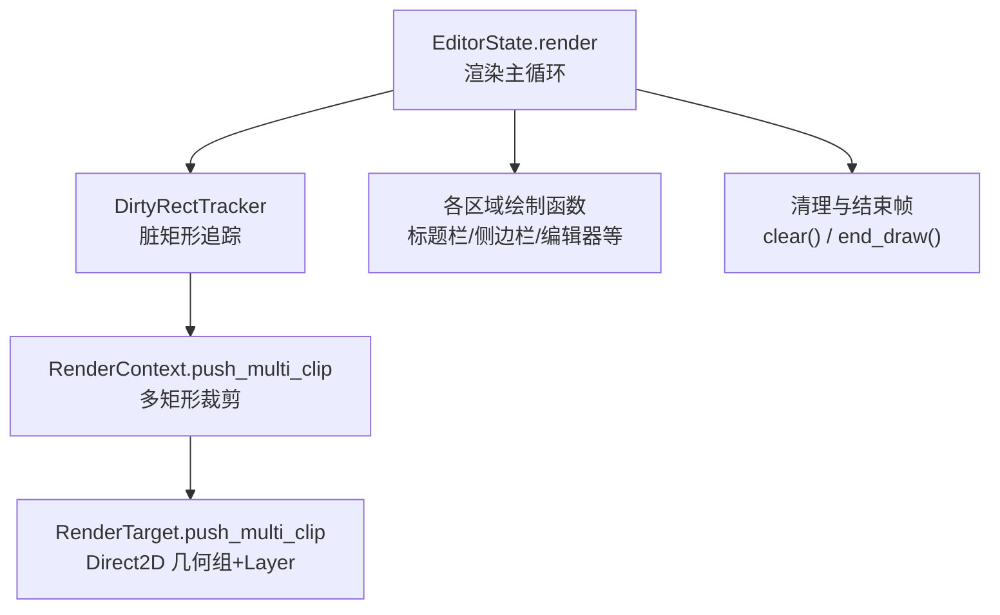
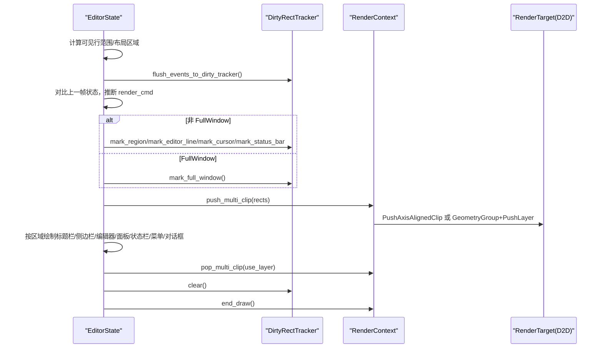
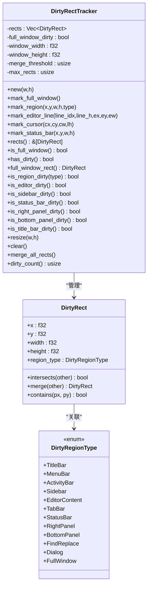
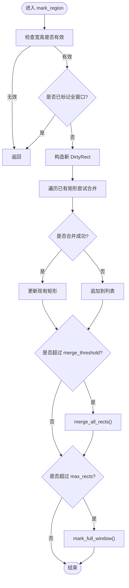
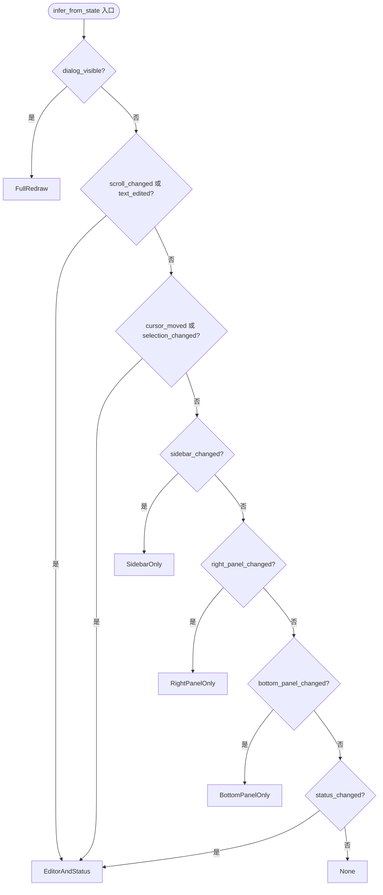
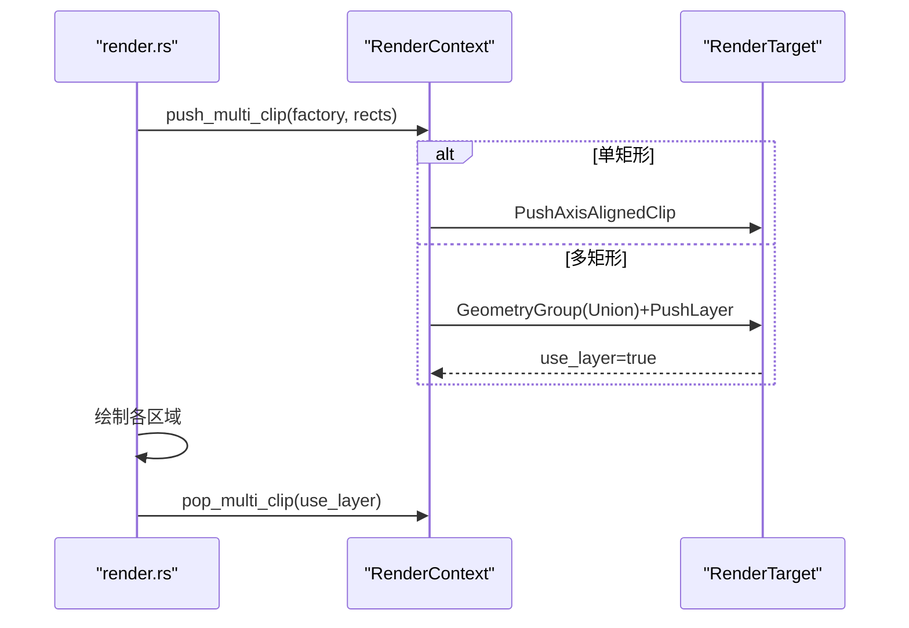
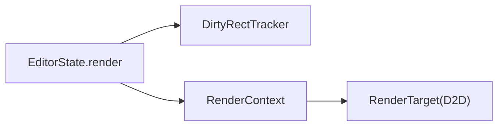

# 脏矩形系统

<cite>
**本文引用的文件**   
- [dirty_rect.rs](file://crates/aether-win32/src/dirty_rect.rs)
- [render.rs](file://crates/aether-win32/src/render.rs)
- [render_context.rs](file://crates/aether-win32/src/render_context.rs)
- [factory.rs](file://crates/aether-render/src/d2d/factory.rs)
</cite>

## 目录
1. [简介](#简介)
2. [项目结构](#项目结构)
3. [核心组件](#核心组件)
4. [架构总览](#架构总览)
5. [详细组件分析](#详细组件分析)
6. [依赖关系分析](#依赖关系分析)
7. [性能考量与调优](#性能考量与调优)
8. [故障排查指南](#故障排查指南)
9. [结论](#结论)
10. [附录：测试用例与基准](#附录测试用例与基准)

## 简介
本文件系统性梳理牧羊人编辑器的“脏矩形系统”，围绕 DirtyRectTracker 的实现原理、区域类型分类、重叠检测与合并策略、标记 API 的使用场景与性能影响、全窗口重绘触发条件与降级机制（merge_threshold 与 max_rects），以及 RenderCommand 的智能推断逻辑进行深度解析。同时给出渲染管线中的裁剪与多矩形并集优化路径，并提供测试用例分析与性能基准建议。

## 项目结构
脏矩形系统主要位于 Win32 UI 层与渲染上下文之间，关键文件如下：
- 脏矩形定义与追踪器：crates/aether-win32/src/dirty_rect.rs
- 渲染主流程与脏矩形集成：crates/aether-win32/src/render.rs
- 渲染上下文封装（含多矩形裁剪）：crates/aether-win32/src/render_context.rs
- Direct2D 底层裁剪实现（单/多矩形）：crates/aether-render/src/d2d/factory.rs

图表来源
- [render.rs:395-410](file://crates/aether-win32/src/render.rs#L395-L410)
- [render_context.rs:107-148](file://crates/aether-win32/src/render_context.rs#L107-L148)
- [factory.rs:164-172](file://crates/aether-render/src/d2d/factory.rs#L164-L172)

章节来源
- [dirty_rect.rs:1-112](file://crates/aether-win32/src/dirty_rect.rs#L1-L112)
- [render.rs:395-410](file://crates/aether-win32/src/render.rs#L395-L410)
- [render_context.rs:107-148](file://crates/aether-win32/src/render_context.rs#L107-L148)
- [factory.rs:164-172](file://crates/aether-render/src/d2d/factory.rs#L164-L172)

## 核心组件
- 区域类型枚举：用于区分标题栏、菜单栏、活动栏、侧边栏、编辑器内容区、标签栏、状态栏、右侧面板、底部面板、查找替换面板、对话框、全窗口等。
- 脏矩形结构：包含坐标、宽高与区域类型，提供相交判断、合并、点包含等方法。
- 脏矩形追踪器：维护当前帧的脏矩形列表、是否全窗口重绘标志、窗口尺寸、合并阈值与最大矩形数量；提供 mark_region/mark_editor_line/mark_cursor/mark_status_bar/mark_full_window/resize/clear 等接口，以及 is_*_dirty 查询方法。
- 渲染命令推断：根据状态变化选择最优渲染策略（None/EditorOnly/EditorAndStatus/SidebarOnly/RightPanelOnly/BottomPanelOnly/FullRedraw）。

章节来源
- [dirty_rect.rs:8-112](file://crates/aether-win32/src/dirty_rect.rs#L8-L112)
- [dirty_rect.rs:368-426](file://crates/aether-win32/src/dirty_rect.rs#L368-L426)

## 架构总览
脏矩形系统与渲染管线的交互流程如下：

图表来源
- [render.rs:284-365](file://crates/aether-win32/src/render.rs#L284-L365)
- [render.rs:395-410](file://crates/aether-win32/src/render.rs#L395-L410)
- [render.rs:698-702](file://crates/aether-win32/src/render.rs#L698-L702)
- [render_context.rs:107-148](file://crates/aether-win32/src/render_context.rs#L107-L148)
- [factory.rs:164-172](file://crates/aether-render/src/d2d/factory.rs#L164-L172)

## 详细组件分析

### 区域类型与数据结构
- 区域类型覆盖 UI 所有可独立更新的面板与控件，便于细粒度增量重绘。
- DirtyRect 提供 O(1) 相交判断与合并，支持快速判定是否需要局部重绘。

图表来源
- [dirty_rect.rs:8-112](file://crates/aether-win32/src/dirty_rect.rs#L8-L112)
- [dirty_rect.rs:368-426](file://crates/aether-win32/src/dirty_rect.rs#L368-L426)

章节来源
- [dirty_rect.rs:8-112](file://crates/aether-win32/src/dirty_rect.rs#L8-L112)

### 重叠检测算法与矩形合并策略
- 相交检测：基于 AABB 标准公式，时间复杂度 O(1)。
- 合并策略：
  - 插入时优先尝试与同类型已有矩形合并，减少列表长度。
  - 当 rects 数量超过 merge_threshold 时，执行批量合并（O(n^2) 最坏），降低后续渲染裁剪开销。
  - 当 rects 数量超过 max_rects 时，直接降级为全窗口重绘，避免过多小矩形导致裁剪/合成成本过高。

图表来源
- [dirty_rect.rs:120-162](file://crates/aether-win32/src/dirty_rect.rs#L120-L162)
- [dirty_rect.rs:336-356](file://crates/aether-win32/src/dirty_rect.rs#L336-L356)

章节来源
- [dirty_rect.rs:120-162](file://crates/aether-win32/src/dirty_rect.rs#L120-L162)
- [dirty_rect.rs:336-356](file://crates/aether-win32/src/dirty_rect.rs#L336-L356)

### 标记方法与使用场景
- mark_region：通用区域标记，适用于任意面板/控件的局部更新。
- mark_editor_line：将某一行高亮/变更映射为 EditorContent 区域的脏矩形，常用于行内语法高亮、选中行背景等。
- mark_cursor：仅标记光标所在行高度范围内的窄条区域，适合光标闪烁、输入字符等高频小更新。
- mark_status_bar：状态栏文本/图标变化时使用。

性能影响要点：
- 频繁调用 mark_cursor/mark_editor_line 会累积大量小矩形，需依赖 merge_threshold 及时合并，避免列表膨胀。
- 若同一帧多次标记相同区域，应利用同类型合并逻辑减少重复。
- 在存在 dialog_visible 或 active_tab_changed 等全局布局变化时，上层会强制 mark_full_window，此时局部标记会被忽略，避免不一致。

章节来源
- [dirty_rect.rs:164-203](file://crates/aether-win32/src/dirty_rect.rs#L164-L203)
- [render.rs:284-365](file://crates/aether-win32/src/render.rs#L284-L365)

### 全窗口重绘触发条件与降级机制
触发条件（部分由渲染主流程决定）：
- 标签页切换（active_tab_changed）：为避免旧像素残留，强制全量重绘。
- 底部面板可见性变化（bottom_panel_changed）：重大布局变更，强制全量重绘。
- 设置面板轮询结果变化、SSH/克隆/命令面板显示等：上层逻辑可能调用 mark_full_window。
- 窗口 resize/DPI 变化：tracker.resize 内部会标记全窗口。

降级机制：
- merge_threshold：当 rects 数量超过该阈值时，主动合并，减少裁剪/绘制次数。
- max_rects：当 rects 数量超过该上限时，直接降级为全窗口重绘，保证渲染稳定性。

章节来源
- [render.rs:214-223](file://crates/aether-win32/src/render.rs#L214-L223)
- [render.rs:224-282](file://crates/aether-win32/src/render.rs#L224-L282)
- [dirty_rect.rs:114-118](file://crates/aether-win32/src/dirty_rect.rs#L114-L118)
- [dirty_rect.rs:324-328](file://crates/aether-win32/src/dirty_rect.rs#L324-L328)

### RenderCommand 智能推断逻辑
infer_from_state 根据状态变化选择最优渲染策略：
- dialog_visible → FullRedraw
- scroll_changed 或 text_edited → EditorAndStatus
- cursor_moved 或 selection_changed → EditorAndStatus
- sidebar_changed → SidebarOnly
- right_panel_changed → RightPanelOnly
- bottom_panel_changed → BottomPanelOnly
- status_changed → EditorAndStatus
- 无变化 → None（REQ-P0-06：避免无变化时的全窗口重绘）

渲染主流程会根据推断结果调用相应的 mark_* 方法，或在 has_dirty 为 false 时跳过整帧渲染。

图表来源
- [dirty_rect.rs:387-426](file://crates/aether-win32/src/dirty_rect.rs#L387-L426)

章节来源
- [dirty_rect.rs:387-426](file://crates/aether-win32/src/dirty_rect.rs#L387-L426)
- [render.rs:284-365](file://crates/aether-win32/src/render.rs#L284-L365)

### 多矩形裁剪与渲染路径
- 当存在脏矩形且非全窗口时，渲染主流程通过 RenderContext.push_multi_clip 设置多矩形并集裁剪。
- 单矩形走快路径（PushAxisAlignedClip），多矩形走 GeometryGroup+PushLayer 路径，失败时回退为包围盒 AxisAlignedClip。
- 渲染结束后统一 pop_multi_clip，确保裁剪栈正确平衡。

图表来源
- [render.rs:395-410](file://crates/aether-win32/src/render.rs#L395-L410)
- [render.rs:698-702](file://crates/aether-win32/src/render.rs#L698-L702)
- [render_context.rs:107-148](file://crates/aether-win32/src/render_context.rs#L107-L148)
- [factory.rs:164-172](file://crates/aether-render/src/d2d/factory.rs#L164-L172)

章节来源
- [render.rs:395-410](file://crates/aether-win32/src/render.rs#L395-L410)
- [render_context.rs:107-148](file://crates/aether-win32/src/render_context.rs#L107-L148)
- [factory.rs:164-172](file://crates/aether-render/src/d2d/factory.rs#L164-L172)

## 依赖关系分析
- DirtyRectTracker 被 EditorState.render 调用，负责收集脏区域。
- RenderContext 作为渲染资源与裁剪 API 的封装，向上暴露 push/pop_multi_clip。
- RenderTarget 在 aether-render 中实现 Direct2D 的具体裁剪路径。

图表来源
- [render.rs:284-365](file://crates/aether-win32/src/render.rs#L284-L365)
- [render_context.rs:107-148](file://crates/aether-win32/src/render_context.rs#L107-L148)

章节来源
- [render.rs:284-365](file://crates/aether-win32/src/render.rs#L284-L365)
- [render_context.rs:107-148](file://crates/aether-win32/src/render_context.rs#L107-L148)

## 性能考量与调优
- merge_threshold 与 max_rects 调优建议：
  - 默认值：merge_threshold=8，max_rects=16。对于高频小更新（如光标闪烁、行级高亮），可适当提高 merge_threshold，减少每帧合并次数；但过大会增加单次合并成本。
  - 当出现大量分散的小矩形（例如复杂搜索高亮、多处语法错误提示），建议降低 max_rects，尽早降级为全窗口重绘，避免多矩形裁剪带来的合成开销。
- 区域类型隔离：尽量将不同区域类型的标记分开，避免跨类型合并导致的包围盒膨胀。
- 裁剪路径选择：单矩形快路径优先；多矩形路径在失败时回退为包围盒，应避免极端碎片化矩形集合。
- 无变化跳过渲染：REQ-P0-06 在无状态变化时返回 None，配合 has_dirty 短路，显著降低空转帧开销。

[本节为通用指导，不直接分析具体文件]

## 故障排查指南
- 设备丢失处理：end_draw 捕获特定错误码后重建渲染目标与常用资源，确保后续渲染正常。
- 欢迎页背景问题：在脏矩形裁剪下，欢迎页会手动填充侧边栏/活动栏/右侧面板/底部面板背景，避免黑色空洞。
- 命中区域调试：每帧开始清除命中区域，并在帧末写入文件，便于定位交互热点。

章节来源
- [render.rs:704-746](file://crates/aether-win32/src/render.rs#L704-L746)
- [render.rs:411-474](file://crates/aether-win32/src/render.rs#L411-L474)
- [render.rs:68-70](file://crates/aether-win32/src/render.rs#L68-L70)
- [render.rs:778-779](file://crates/aether-win32/src/render.rs#L778-L779)

## 结论
脏矩形系统通过区域类型细分、高效的重叠检测与合并策略、以及智能的渲染命令推断，在保证视觉一致性的前提下最大化局部重绘收益。结合多矩形并集裁剪与降级机制，系统在高频交互与大范围布局变化间取得良好平衡。合理配置 merge_threshold 与 max_rects，并结合 REQ-P0-06 的无变化跳过策略，可进一步提升整体渲染性能。

[本节为总结性内容，不直接分析具体文件]

## 附录：测试用例与基准

### 测试用例分析（来自 dirty_rect.rs）
- 相交与包含：验证 intersects/contains 边界行为（相切不算重叠、边界包含规则）。
- 合并：验证两个矩形的最小外接矩形合并结果。
- 初始状态：首帧 full_window_dirty=true，has_dirty=true。
- 基本标记与清除：mark_region 后 has_dirty=true，clear 后恢复干净。
- 零/负尺寸过滤：无效尺寸被忽略。
- 同类型合并与不同类型不合并：验证 region_type 隔离。
- 全窗口覆盖：mark_full_window 后局部标记被忽略，rects 清空。
- resize：更新窗口尺寸并标记全窗口。
- 区域脏标志：is_*_dirty 对各自区域类型生效。
- 批量合并：merge_all_rects 对相交矩形进行合并。
- 辅助标记：mark_editor_line/mark_cursor 生成正确的坐标与尺寸。
- 降级：超过 max_rects 自动转为全窗口重绘。
- 渲染命令推断：覆盖 dialog_visible、滚动/文本/光标/选择/侧边栏/右侧面板/底部面板/状态栏等分支，以及无变化返回 None。

章节来源
- [dirty_rect.rs:428-706](file://crates/aether-win32/src/dirty_rect.rs#L428-L706)

### 性能基准建议
仓库提供了通用的基准框架与示例（aether-core/benchmarks.rs、examples/benchmark.rs、benches/lexer_bench.rs），可用于扩展脏矩形系统的基准测试，例如：
- 不同 merge_threshold/max_rects 组合下的平均帧耗时与绘制调用次数。
- 高频 mark_cursor/mark_editor_line 场景下的合并效率与裁剪面积统计。
- 多矩形裁剪 vs 单矩形快路径的性能差异。

[本节为通用指导，不直接分析具体文件]