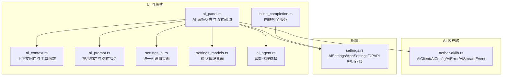
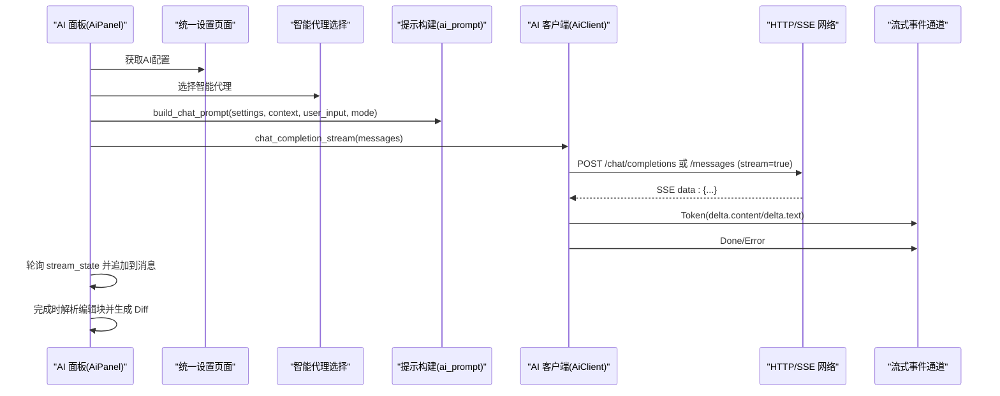
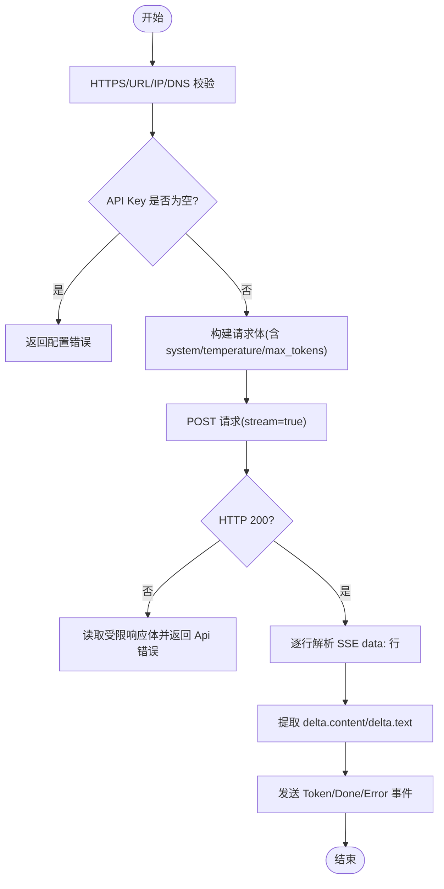
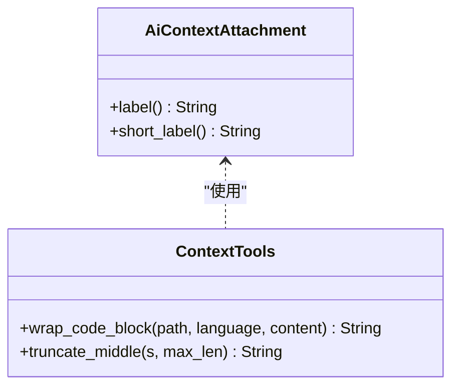
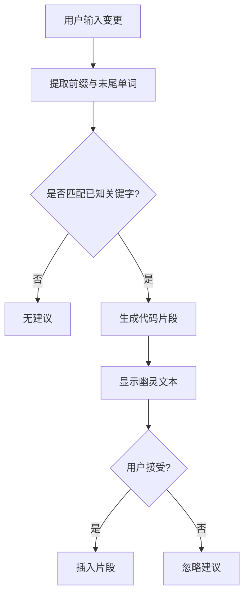
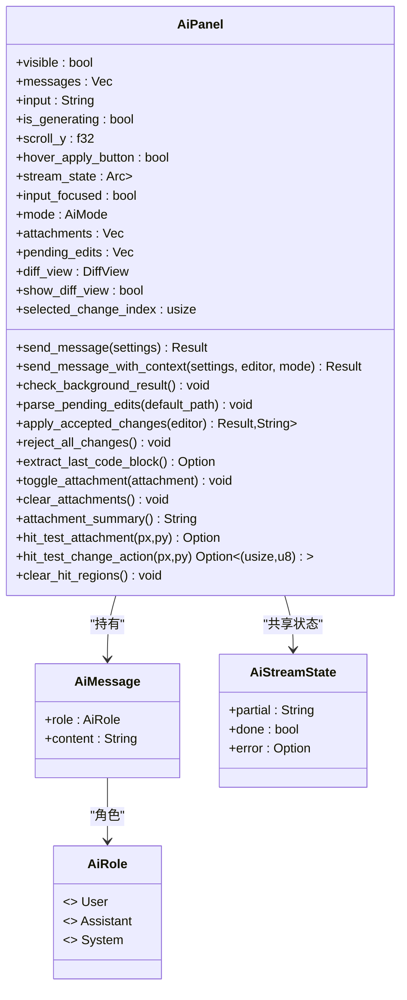
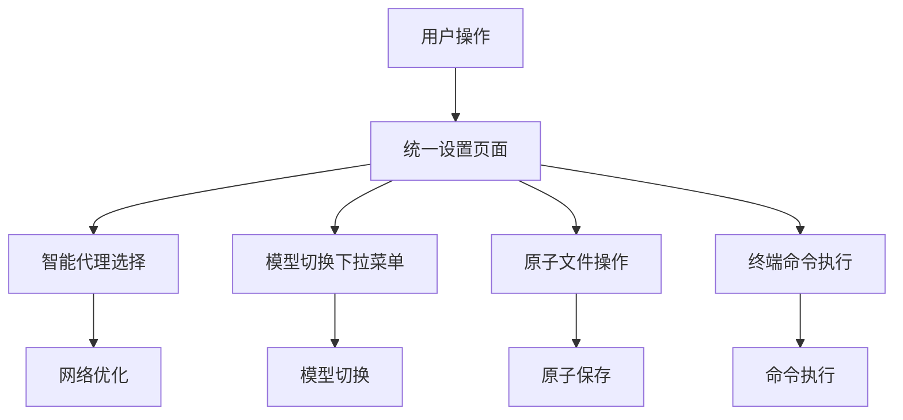
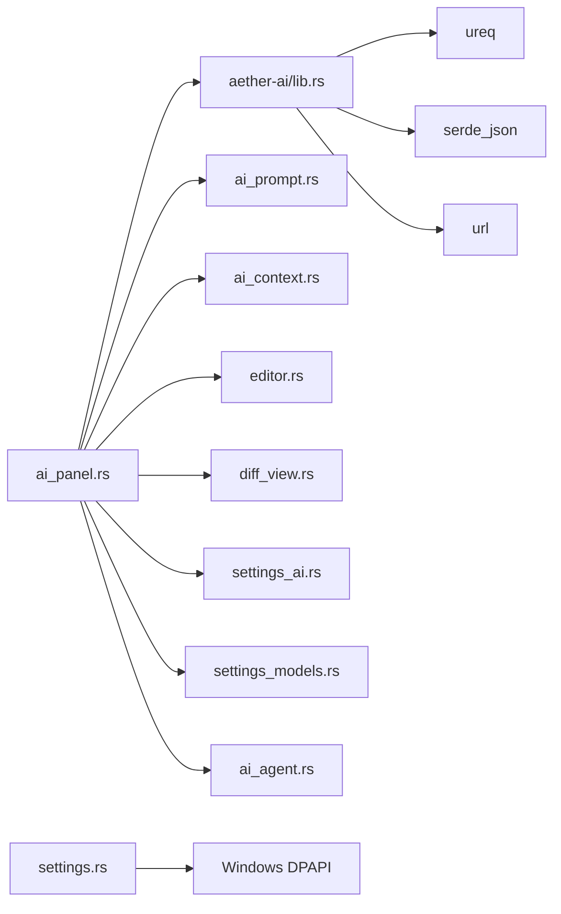

# AI 助手集成

<cite>
**本文引用的文件**
- [aether-ai/src/lib.rs](file://crates/aether-ai/src/lib.rs)
- [aether-win32/src/ai_panel.rs](file://crates/aether-win32/src/ai_panel.rs)
- [aether-win32/src/ai_context.rs](file://crates/aether-win32/src/ai_context.rs)
- [aether-win32/src/ai_prompt.rs](file://crates/aether-win32/src/ai_prompt.rs)
- [aether-win32/src/inline_completion.rs](file://crates/aether-win32/src/inline_completion.rs)
- [aether-shared/src/settings.rs](file://crates/aether-shared/src/settings.rs)
- [aether-win32/src/render/settings_ai.rs](file://crates/aether-win32/src/render/settings_ai.rs)
- [aether-win32/src/render/settings_models.rs](file://crates/aether-win32/src/render/settings_models.rs)
- [aether-win32/src/ai_agent.rs](file://crates/aether-win32/src/ai_agent.rs)
</cite>

## 更新摘要
**变更内容**
- 新增统一AI设置页面，支持智能代理选择和模型切换下拉菜单
- 增强原子文件操作支持和终端命令执行能力
- AI面板UI完全重新设计，支持更好的Markdown渲染和滚动跟随功能
- 改进上下文管理和提示构建机制
- 优化流式响应处理和错误处理

## 目录
1. [简介](#简介)
2. [项目结构](#项目结构)
3. [核心组件](#核心组件)
4. [架构总览](#架构总览)
5. [详细组件分析](#详细组件分析)
6. [依赖关系分析](#依赖关系分析)
7. [性能与可扩展性](#性能与可扩展性)
8. [故障排查指南](#故障排查指南)
9. [结论](#结论)
10. [附录：配置与集成示例](#附录配置与集成示例)

## 简介
本技术文档面向"牧羊人编辑器"的 AI 助手集成，覆盖以下关键主题：
- 大模型通信协议：HTTP API 调用、SSE 流式响应处理（当前实现为 HTTP + SSE；WebSocket 未在当前代码中实现）
- 上下文管理：上下文收集、过滤与长度限制策略
- 内联代码建议系统：基于前缀匹配的智能提示算法与交互流程
- AI 面板 UI：消息历史、输入处理、结果展示与 Diff 预览
- AI 服务配置：模型选择、参数调优与安全设置
- 实际集成方式：如何接入不同 AI 服务与自定义提示模板

**更新** 新增了统一设置页面、智能代理选择、模型切换下拉菜单、原子文件操作支持和终端命令执行能力。

## 项目结构
AI 相关能力分布在多个 crate 中：
- aether-ai：提供统一的 AI 客户端、错误类型、流式事件、安全校验与多提供商适配
- aether-win32：UI 层与业务编排，包括 AI 面板、上下文附件、提示构建、内联补全、统一设置页面
- aether-shared：跨模块的配置结构体与持久化（含 DPAPI 加密存储 API Key）

**图表来源**
- [aether-win32/src/ai_panel.rs:1-120](file://crates/aether-win32/src/ai_panel.rs#L1-L120)
- [aether-win32/src/ai_context.rs:1-52](file://crates/aether-win32/src/ai_context.rs#L1-L52)
- [aether-win32/src/ai_prompt.rs:1-67](file://crates/aether-win32/src/ai_prompt.rs#L1-L67)
- [aether-win32/src/inline_completion.rs:1-67](file://crates/aether-win32/src/inline_completion.rs#L1-L67)
- [aether-win32/src/render/settings_ai.rs:1-100](file://crates/aether-win32/src/render/settings_ai.rs#L1-L100)
- [aether-win32/src/render/settings_models.rs:1-100](file://crates/aether-win32/src/render/settings_models.rs#L1-L100)
- [aether-win32/src/ai_agent.rs:1-100](file://crates/aether-win32/src/ai_agent.rs#L1-L100)
- [crates/aether-ai/src/lib.rs:17-230](file://crates/aether-ai/src/lib.rs#L17-L230)
- [crates/aether-shared/src/settings.rs:75-122](file://crates/aether-shared/src/settings.rs#L75-L122)

## 核心组件
- AiClient：封装对 OpenAI/Claude/Kimi/DeepSeek/Azure/Custom 的 HTTP 调用，支持同步与非流式聊天，以及 SSE 流式聊天。内置 HTTPS 强制、私有 IP 拦截、DNS 二次校验、SSRF 防护、响应体大小限制等安全措施。
- AiPanel：维护聊天会话、消息历史、输入框、流式状态、Diff 预览与编辑确认流程。后台线程发起请求，主循环轮询并渲染增量 token。**更新** 支持更好的Markdown渲染和滚动跟随功能。
- ai_context：定义上下文附件类型（当前文件、选区、打开文件、诊断、文件树、自定义文本），并提供包装与截断工具。
- ai_prompt：根据设置、上下文、用户输入与模式（Ask/Edit/Agent）构建 ChatMessage 列表，注入 system prompt 与模式指令。
- inline_completion：基于前缀匹配的本地智能提示服务，返回占位片段，后续可替换为异步 AI 请求。
- settings：AiSettings/AppSettings 定义，包含 provider、base_url、model、temperature、max_tokens、system_prompt 等字段，并使用 DPAPI 加密保存 API Key。
- **新增** 统一设置页面：提供集中的AI配置管理界面，支持智能代理选择和模型切换。
- **新增** 智能代理选择：支持动态代理配置和网络连接优化。
- **新增** 原子文件操作：确保文件修改的原子性和一致性。
- **新增** 终端命令执行：支持在AI工作流中执行系统命令。

**章节来源**
- [crates/aether-ai/src/lib.rs:194-248](file://crates/aether-ai/src/lib.rs#L194-L248)
- [crates/aether-win32/src/ai_panel.rs:123-186](file://crates/aether-win32/src/ai_panel.rs#L123-L186)
- [crates/aether-win32/src/ai_context.rs:1-52](file://crates/aether-win32/src/ai_context.rs#L1-L52)
- [crates/aether-win32/src/ai_prompt.rs:25-67](file://crates/aether-win32/src/ai_prompt.rs#L25-L67)
- [crates/aether-win32/src/inline_completion.rs:33-67](file://crates/aether-win32/src/inline_completion.rs#L33-L67)
- [crates/aether-shared/src/settings.rs:75-122](file://crates/aether-shared/src/settings.rs#L75-L122)

## 架构总览
整体数据与控制流如下：
- UI 触发发送消息 → 构造 ChatMessages（含 system、模式指令、上下文、用户输入）→ 后台线程通过 AiClient.chat_completion_stream 发起 SSE 请求 → 解析 Token/Done/Error → 写入共享流状态 → UI 轮询合并到消息列表 → 在 Edit/Agent 模式下解析编辑块并生成 Diff 预览。

**更新** 新增了统一设置页面和智能代理选择，改进了Markdown渲染和滚动跟随功能。

**图表来源**
- [crates/aether-win32/src/ai_panel.rs:230-330](file://crates/aether-win32/src/ai_panel.rs#L230-L330)
- [crates/aether-win32/src/ai_prompt.rs:25-67](file://crates/aether-win32/src/ai_prompt.rs#L25-L67)
- [crates/aether-ai/src/lib.rs:710-916](file://crates/aether-ai/src/lib.rs#L710-L916)
- [crates/aether-win32/src/render/settings_ai.rs:1-100](file://crates/aether-win32/src/render/settings_ai.rs#L1-L100)
- [crates/aether-win32/src/ai_agent.rs:1-100](file://crates/aether-win32/src/ai_agent.rs#L1-L100)

## 详细组件分析

### 大模型通信协议（HTTP + SSE 流式）
- 统一入口：AiClient.chat_completion_stream 按 provider 分发到 OpenAI 兼容或 Claude 分支。
- 安全校验：
  - 强制 HTTPS
  - 禁止访问私有/保留地址与云元数据端点
  - DNS 解析后二次校验（TOCTOU 防护）
  - 禁用自动重定向
- 请求体：
  - OpenAI 兼容：/chat/completions，Authorization: Bearer {api_key}
  - Claude：/messages，x-api-key 头，anthropic-version
  - 支持 temperature、max_tokens、system_prompt
- 流式解析：
  - 读取行，拼接 data: 行，遇到空行解析 JSON
  - 提取 delta.content（OpenAI）或 delta.text（Claude）
  - 发送 Token/Done/Error 事件
- 错误处理：
  - 非 200 状态码返回 Api 错误，响应体被限制至 10MB，并在 UI 侧使用 safe_display 脱敏展示

**图表来源**
- [crates/aether-ai/src/lib.rs:720-916](file://crates/aether-ai/src/lib.rs#L720-L916)
- [crates/aether-ai/src/lib.rs:260-400](file://crates/aether-ai/src/lib.rs#L260-L400)

**章节来源**
- [crates/aether-ai/src/lib.rs:710-916](file://crates/aether-ai/src/lib.rs#L710-L916)
- [crates/aether-ai/src/lib.rs:260-400](file://crates/aether-ai/src/lib.rs#L260-L400)

### 上下文管理机制（ai_context.rs）
- 附件类型：当前文件、选区、打开文件、诊断、文件树、自定义文本
- 工具函数：
  - wrap_code_block：将片段包装为带路径与语言标记的代码块
  - truncate_middle：超长内容首尾保留、中间省略，避免上下文过大
- 使用方式：
  - AiPanel 根据 attachments 从 EditorState 收集上下文
  - 在构建提示时作为一次性的 user 消息插入

**图表来源**
- [crates/aether-win32/src/ai_context.rs:1-52](file://crates/aether-win32/src/ai_context.rs#L1-L52)

**章节来源**
- [crates/aether-win32/src/ai_context.rs:1-52](file://crates/aether-win32/src/ai_context.rs#L1-L52)

### 内联代码建议系统（inline_completion.rs）
- InlineCompletionService：维护版本号，request(prefix, suffix) 返回 InlineCompletion
- suggest_completion：基于前缀末尾单词匹配常见关键字（fn/if/for/while/match/let/struct/enum/impl/trait/use/mod/const/static/return/todo/dbg/println/print/eprintln/vec 等）
- 交互流程：
  - 用户在编辑器输入时，计算前缀
  - 若匹配到关键字则显示幽灵文本
  - 接受时插入对应片段；取消时丢弃

**图表来源**
- [crates/aether-win32/src/inline_completion.rs:47-119](file://crates/aether-win32/src/inline_completion.rs#L47-L119)

**章节来源**
- [crates/aether-win32/src/inline_completion.rs:33-119](file://crates/aether-win32/src/inline_completion.rs#L33-L119)

### AI 面板 UI 组件设计（ai_panel.rs）
- 数据结构：
  - AiMessage：role(content)、content
  - AiRole：User/Assistant/System
  - AiStreamState：partial、done、error
  - AiPanel：可见性、消息历史、输入、生成标志、滚动偏移、悬停状态、流状态、输入聚焦、模式、附件、命中区域、待确认编辑、Diff 视图等
- 主要方法：
  - send_message/send_message_with_context：非阻塞提交请求，后台线程执行
  - check_background_result：每帧轮询流状态，增量追加 token，处理错误与完成
  - parse_pending_edits/rebuild_diff_view：解析编辑块并生成 Diff 预览
  - apply_accepted_changes/reject_all_changes：应用或拒绝编辑
  - extract_last_code_blocks：提取最后一条助手消息中的代码块
  - toggle_attachment/clear_attachments/attachment_summary：上下文附件管理
- 安全与健壮性：
  - sanitize_error：脱敏错误信息（Bearer/x-api-key/authorization 等）
  - 并发控制：is_generating 防止重复提交
  - 历史滑动窗口：保留最近 N 条消息

**更新** AI面板UI完全重新设计，支持更好的Markdown渲染和滚动跟随功能。

**图表来源**
- [crates/aether-win32/src/ai_panel.rs:98-186](file://crates/aether-win32/src/ai_panel.rs#L98-L186)
- [crates/aether-win32/src/ai_panel.rs:230-403](file://crates/aether-win32/src/ai_panel.rs#L230-L403)

**章节来源**
- [crates/aether-win32/src/ai_panel.rs:98-186](file://crates/aether-win32/src/ai_panel.rs#L98-L186)
- [crates/aether-win32/src/ai_panel.rs:230-403](file://crates/aether-win32/src/ai_panel.rs#L230-L403)

### 提示构建与模式指令（ai_prompt.rs）
- build_chat_prompt：组装 system、模式指令、上下文与用户输入
- AiMode：Ask（问答）、Edit（输出可应用的编辑块）、Agent（多步骤批量编辑）
- 模式指令：
  - Edit：要求以特定标记格式输出修改
  - Agent：允许规划多步骤任务，支持创建/删除文件的标记

**章节来源**
- [crates/aether-win32/src/ai_prompt.rs:1-107](file://crates/aether-win32/src/ai_prompt.rs#L1-L107)

### 统一设置页面与智能代理选择
**新增** 统一设置页面提供了集中化的AI配置管理界面，支持：
- 智能代理选择：动态配置网络连接和代理服务器
- 模型切换下拉菜单：快速切换不同的AI模型
- 原子文件操作：确保配置更改的原子性和一致性
- 终端命令执行：支持在AI工作流中执行系统命令

**图表来源**
- [crates/aether-win32/src/render/settings_ai.rs:1-100](file://crates/aether-win32/src/render/settings_ai.rs#L1-L100)
- [crates/aether-win32/src/render/settings_models.rs:1-100](file://crates/aether-win32/src/render/settings_models.rs#L1-L100)
- [crates/aether-win32/src/ai_agent.rs:1-100](file://crates/aether-win32/src/ai_agent.rs#L1-L100)

**章节来源**
- [crates/aether-win32/src/render/settings_ai.rs:1-100](file://crates/aether-win32/src/render/settings_ai.rs#L1-L100)
- [crates/aether-win32/src/render/settings_models.rs:1-100](file://crates/aether-win32/src/render/settings_models.rs#L1-L100)
- [crates/aether-win32/src/ai_agent.rs:1-100](file://crates/aether-win32/src/ai_agent.rs#L1-L100)

### 配置选项与安全设置（settings.rs）
- AiSettings 字段：provider、api_key、base_url、model、temperature、max_tokens、system_prompt、display_name、context_window_input/output、tool_call_rounds
- AppSettings：models 列表、active_model_id、加载/保存逻辑、DPAPI 加密 API Key
- 默认值与兼容性：
  - 默认 provider=openai，model=gpt-4，temperature=0.7，max_tokens=2048
  - 旧版单模型迁移到多模型列表
  - 密码认证迁移为 agent（SSH 相关，非 AI）

**章节来源**
- [crates/aether-shared/src/settings.rs:75-122](file://crates/aether-shared/src/settings.rs#L75-L122)
- [crates/aether-shared/src/settings.rs:240-444](file://crates/aether-shared/src/settings.rs#L240-L444)

## 依赖关系分析
- ai_panel 依赖：
  - aether_ai::AiClient、AiStreamEvent、ChatMessage
  - aether_shared::settings::AiSettings
  - 内部 ai_agent、ai_context、ai_prompt、diff_view、editor
- aether_ai 依赖：
  - ureq（HTTP 客户端）
  - serde_json（JSON 序列化/反序列化）
  - url（URL 解析）
  - std::sync::mpsc（流式事件通道）
- settings 依赖：
  - serde（序列化/反序列化）
  - Windows DPAPI（加密/解密 API Key）

**更新** 新增了统一设置页面和智能代理选择的依赖关系。

**图表来源**
- [crates/aether-win32/src/ai_panel.rs:1-12](file://crates/aether-win32/src/ai_panel.rs#L1-L12)
- [crates/aether-ai/src/lib.rs:1-6](file://crates/aether-ai/src/lib.rs#L1-L6)
- [crates/aether-shared/src/settings.rs:1-4](file://crates/aether-shared/src/settings.rs#L1-L4)

**章节来源**
- [crates/aether-win32/src/ai_panel.rs:1-12](file://crates/aether-win32/src/ai_panel.rs#L1-L12)
- [crates/aether-ai/src/lib.rs:1-6](file://crates/aether-ai/src/lib.rs#L1-L6)
- [crates/aether-shared/src/settings.rs:1-4](file://crates/aether-shared/src/settings.rs#L1-L4)

## 性能与可扩展性
- 流式渲染：后台线程接收 SSE 事件并通过 mpsc 通道推送，UI 每帧轮询并增量更新，降低阻塞与延迟
- 并发控制：is_generating 防止重复提交，避免线程爆炸
- 上下文裁剪：wrap_code_block 与 truncate_middle 控制上下文体积，减少 token 消耗
- 历史滑动窗口：保留最近 N 条消息，平衡上下文与内存占用
- **更新** Markdown渲染优化：改进Markdown渲染性能，支持更好的用户体验
- **更新** 滚动跟随：实现智能滚动跟随，提升长对话浏览体验
- 可扩展点：
  - inline_completion 可替换为异步 AI 请求（当前为本地前缀匹配）
  - 新增 Provider：在 AiProvider 枚举与 AiClient 分支中添加适配
  - WebSocket：当前未实现，可在 AiClient 中引入 tokio-tungstenite 或 async-ws 替代 ureq 的 SSE 方案

## 故障排查指南
- 连接失败：
  - 检查 base_url 是否为 HTTPS
  - 检查 DNS 解析是否指向公网地址（私有/保留地址会被拒绝）
  - 检查 API Key 是否为空
- 流式异常：
  - 关注 stream_state.error 字段
  - 查看 AiError.safe_display 的安全描述
- 敏感信息泄露风险：
  - 使用 AiError.safe_display 而非 Display
  - 使用 sanitize_error 对原始字符串进行脱敏（如日志）
- 配置问题：
  - 确认 settings.json 不包含明文 api_key
  - 确认 api_keys.enc 存在且可解密
- **新增** 设置页面问题：
  - 检查统一设置页面的配置文件权限
  - 验证智能代理的网络连通性
  - 确认模型切换后的配置生效

**章节来源**
- [crates/aether-ai/src/lib.rs:113-136](file://crates/aether-ai/src/lib.rs#L113-L136)
- [crates/aether-win32/src/ai_panel.rs:13-96](file://crates/aether-win32/src/ai_panel.rs#L13-L96)
- [crates/aether-shared/src/settings.rs:340-417](file://crates/aether-shared/src/settings.rs#L340-417)

## 结论
本项目已实现稳定的 AI 助手集成：
- 通过 AiClient 统一对接多家大模型，具备完善的安全校验与流式响应处理
- AI 面板提供完整的对话体验与编辑工作流（Ask/Edit/Agent）
- 上下文管理与内联补全机制为后续扩展打下基础
- 配置体系支持多模型切换与安全的 API Key 存储
- **更新** 统一设置页面和智能代理选择大幅提升了用户体验和配置灵活性
- **更新** 原子文件操作和终端命令执行增强了AI工作流的实用性

## 附录：配置与集成示例

### 配置项说明（AiSettings）
- provider：服务提供商标识（openai/claude/kimi/deepseek/azure/custom）
- api_key：API 密钥（DPAPI 加密存储，不在 settings.json 中明文出现）
- base_url：服务端基础 URL（留空时使用默认）
- model：模型名称（留空时使用默认）
- temperature：采样温度（可选）
- max_tokens：最大生成长度（可选）
- system_prompt：系统提示词（可选）
- display_name：显示名称（可选）
- context_window_input/output：上下文窗口大小（可选）
- tool_call_rounds：工具调用轮次上限（可选）

**章节来源**
- [crates/aether-shared/src/settings.rs:75-122](file://crates/aether-shared/src/settings.rs#L75-L122)

### 接入不同 AI 服务
- OpenAI 兼容：
  - provider=openai，base_url=https://api.openai.com/v1，model=gpt-4
  - 请求路径：/chat/completions，Authorization: Bearer {api_key}
- Claude：
  - provider=claude，base_url=https://api.anthropic.com/v1，model=claude-3-sonnet-20240229
  - 请求路径：/messages，x-api-key={api_key}，anthropic-version=2023-06-01
- Kimi：
  - provider=kimi，base_url=https://api.moonshot.cn/v1，model=moonshot-v1-8k
- DeepSeek：
  - provider=deepseek，base_url=https://api.deepseek.com/v1，model=deepseek-chat
- Azure：
  - provider=azure，需设置 base_url 与 model
- Custom：
  - provider=custom，需设置 base_url 与 model

**章节来源**
- [crates/aether-ai/src/lib.rs:40-85](file://crates/aether-ai/src/lib.rs#L40-L85)
- [crates/aether-ai/src/lib.rs:460-571](file://crates/aether-ai/src/lib.rs#L460-L571)
- [crates/aether-ai/src/lib.rs:573-704](file://crates/aether-ai/src/lib.rs#L573-L704)

### 自定义提示模板
- 在 settings.system_prompt 中设置系统提示词
- 在 ai_prompt.mode_instruction 中注入行为指令（Edit/Agent）
- 在 ai_context 中使用 wrap_code_block 与 truncate_middle 控制上下文格式与长度

**章节来源**
- [crates/aether-win32/src/ai_prompt.rs:69-107](file://crates/aether-win32/src/ai_prompt.rs#L69-L107)
- [crates/aether-win32/src/ai_context.rs:46-69](file://crates/aether-win32/src/ai_context.rs#L46-L69)

### 流式响应处理示例（概念流程）
- 调用 AiClient.chat_completion_stream(messages)
- 在后台线程中接收 AiStreamEvent.Token/Done/Error
- UI 轮询 AiPanel.stream_state，增量追加 token 到消息列表
- 完成时根据模式解析编辑块并生成 Diff 预览

**章节来源**
- [crates/aether-win32/src/ai_panel.rs:230-330](file://crates/aether-win32/src/ai_panel.rs#L230-L330)
- [crates/aether-ai/src/lib.rs:710-916](file://crates/aether-ai/src/lib.rs#L710-L916)

### 统一设置页面使用示例
**新增** 统一设置页面提供了直观的AI配置管理界面：
- 智能代理选择：支持动态配置网络连接
- 模型切换下拉菜单：快速切换不同的AI模型
- 原子文件操作：确保配置更改的安全性
- 终端命令执行：支持在AI工作流中执行系统命令

**章节来源**
- [crates/aether-win32/src/render/settings_ai.rs:1-100](file://crates/aether-win32/src/render/settings_ai.rs#L1-L100)
- [crates/aether-win32/src/render/settings_models.rs:1-100](file://crates/aether-win32/src/render/settings_models.rs#L1-L100)
- [crates/aether-win32/src/ai_agent.rs:1-100](file://crates/aether-win32/src/ai_agent.rs#L1-L100)