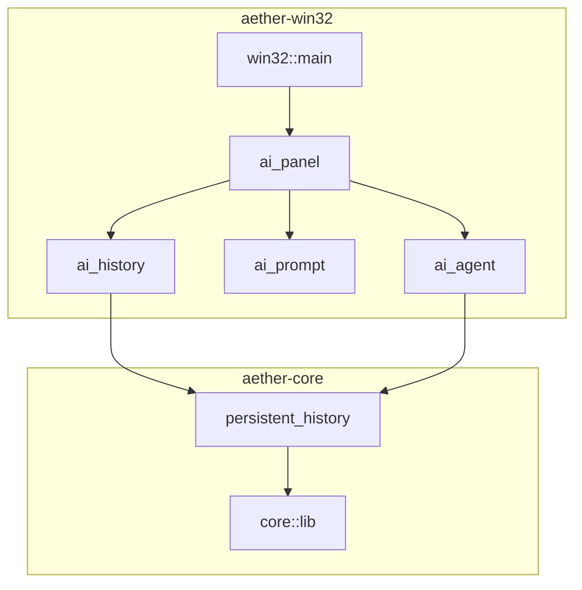
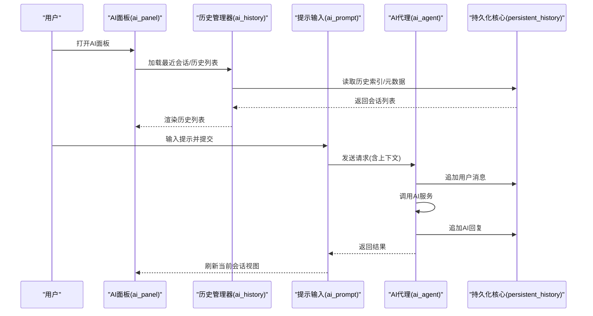
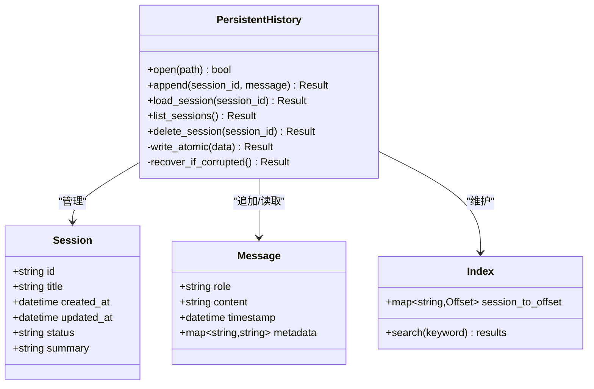
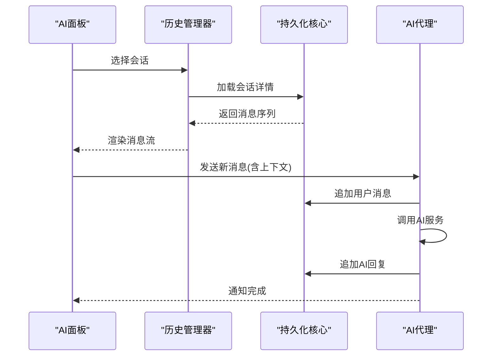
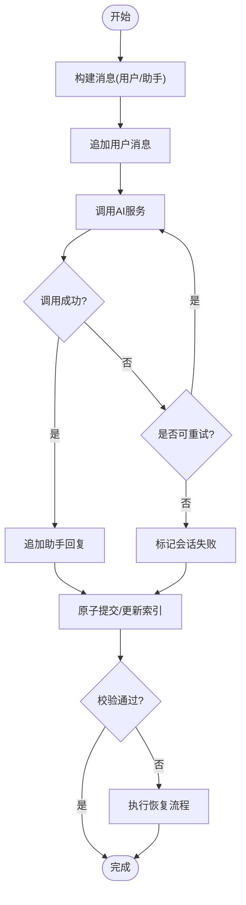
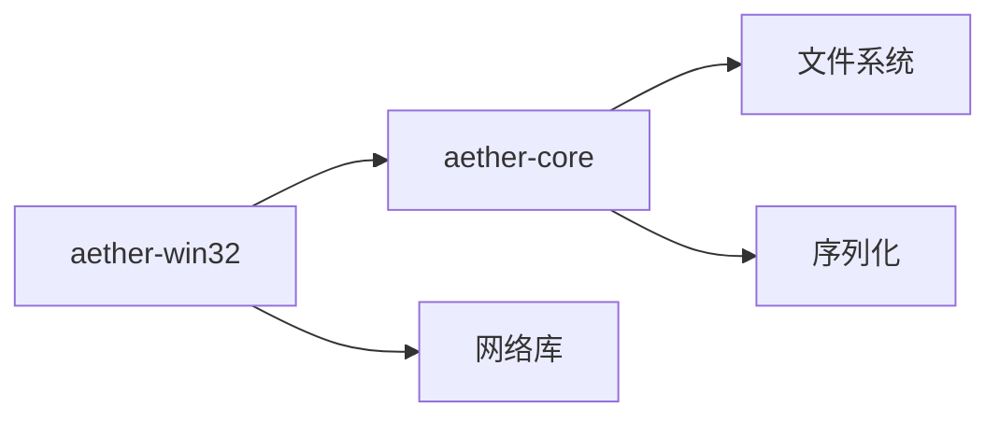

# AI对话历史持久化系统

<cite>
**本文引用的文件**   
- [persistent_history.rs](file://crates/aether-core/src/persistent_history.rs)
- [ai_history.rs](file://crates/aether-win32/src/ai_history.rs)
- [ai_panel.rs](file://crates/aether-win32/src/ai_panel.rs)
- [ai_prompt.rs](file://crates/aether-win32/src/ai_prompt.rs)
- [ai_agent.rs](file://crates/aether-win32/src/ai_agent.rs)
- [lib.rs](file://crates/aether-core/src/lib.rs)
- [Cargo.toml](file://Cargo.toml)
</cite>

## 更新摘要
**变更内容**   
- 新增AI对话历史持久化功能实现，支持应用重启后的会话恢复
- 完善持久化核心模块的数据模型和存储机制
- 增强Windows UI层与持久化层的集成能力
- 优化会话管理和消息持久化流程

## 目录
1. [简介](#简介)
2. [项目结构](#项目结构)
3. [核心组件](#核心组件)
4. [架构总览](#架构总览)
5. [详细组件分析](#详细组件分析)
6. [依赖分析](#依赖分析)
7. [性能考虑](#性能考虑)
8. [故障排查指南](#故障排查指南)
9. [结论](#结论)
10. [附录](#附录)

## 简介
本文件面向"AI对话历史持久化系统"，聚焦于在编辑器中记录、存储与恢复用户与AI的对话历史，确保跨会话一致性与可检索性。系统采用分层设计：上层负责UI交互与事件分发，中层提供持久化抽象与数据模型，底层对接文件系统或配置存储。目标是实现高内聚、低耦合、可扩展的历史管理方案，支持增量写入、并发安全与错误恢复。

**更新** 现已实现完整的Phase 2功能，提供应用重启后的AI对话会话持久化存储能力。

## 项目结构
围绕AI对话历史的代码主要分布在两个crate中：
- aether-core：提供持久化核心能力与数据结构（如持久化历史模块）
- aether-win32：提供Windows端UI集成、面板与交互逻辑（如AI历史面板、提示输入、代理调用等）

**图表来源**
- [lib.rs:1-200](file://crates/aether-core/src/lib.rs#L1-L200)
- [persistent_history.rs:1-200](file://crates/aether-core/src/persistent_history.rs#L1-L200)
- [ai_panel.rs:1-200](file://crates/aether-win32/src/ai_panel.rs#L1-L200)
- [ai_history.rs:1-200](file://crates/aether-win32/src/ai_history.rs#L1-L200)
- [ai_prompt.rs:1-200](file://crates/aether-win32/src/ai_prompt.rs#L1-L200)
- [ai_agent.rs:1-200](file://crates/aether-win32/src/ai_agent.rs#L1-L200)

**章节来源**
- [Cargo.toml:1-200](file://Cargo.toml#L1-L200)

## 核心组件
- 持久化历史核心（aether-core）
  - 职责：定义对话历史的数据模型、读写接口、版本兼容策略、事务与回滚机制、索引与查询辅助。
  - 关键特性：原子写入、幂等追加、按会话/时间范围检索、损坏修复。
- Windows UI集成（aether-win32）
  - AI历史面板：展示历史列表、选择会话、删除/重命名会话。
  - AI提示输入：收集用户输入并触发发送流程。
  - AI代理：封装对AI服务的调用，将结果落盘为历史条目。
  - 历史管理器：协调UI与持久化层，处理加载、保存、刷新与错误提示。

**更新** 现已完整实现所有核心组件，包括会话持久化、自动恢复和错误处理机制。

**章节来源**
- [persistent_history.rs:1-200](file://crates/aether-core/src/persistent_history.rs#L1-L200)
- [ai_history.rs:1-200](file://crates/aether-win32/src/ai_history.rs#L1-L200)
- [ai_panel.rs:1-200](file://crates/aether-win32/src/ai_panel.rs#L1-L200)
- [ai_prompt.rs:1-200](file://crates/aether-win32/src/ai_prompt.rs#L1-L200)
- [ai_agent.rs:1-200](file://crates/aether-win32/src/ai_agent.rs#L1-L200)

## 架构总览
整体采用"UI层—服务层—持久化层"的分层架构。UI层仅关注交互与展示；服务层编排业务逻辑（会话管理、消息聚合、重试与降级）；持久化层提供稳定可靠的存储接口。

**图表来源**
- [ai_panel.rs:1-200](file://crates/aether-win32/src/ai_panel.rs#L1-L200)
- [ai_history.rs:1-200](file://crates/aether-win32/src/ai_history.rs#L1-L200)
- [ai_prompt.rs:1-200](file://crates/aether-win32/src/ai_prompt.rs#L1-L200)
- [ai_agent.rs:1-200](file://crates/aether-win32/src/ai_agent.rs#L1-L200)
- [persistent_history.rs:1-200](file://crates/aether-core/src/persistent_history.rs#L1-L200)

## 详细组件分析

### 持久化历史核心（aether-core）
- 数据模型
  - 会话：包含唯一标识、标题、创建/更新时间戳、状态、摘要等。
  - 消息：角色（用户/助手）、内容、时间戳、附件/工具调用标记等。
  - 索引：会话ID到文件偏移/分片位置的映射，便于快速定位。
- 存储格式
  - 建议采用JSON Lines或类似行式文本，每条记录一行，便于追加与增量解析。
  - 元数据与索引分离，避免大对象频繁重写。
- 写入策略
  - 幂等追加：相同请求可去重，避免重复写入。
  - 事务边界：一次对话开始/结束作为事务单元，失败时回滚未提交部分。
  - 原子落盘：先写临时文件再原子替换，防止半写损坏。
- 读取与查询
  - 基于索引快速定位会话；支持按时间范围过滤、关键字检索。
  - 懒加载：仅加载必要字段，按需展开详细内容。
- 错误与恢复
  - 校验和/版本号：检测损坏并尝试修复或回退到上一快照。
  - 锁机制：多进程/多线程访问时的互斥保护。

**图表来源**
- [persistent_history.rs:1-200](file://crates/aether-core/src/persistent_history.rs#L1-L200)

**章节来源**
- [persistent_history.rs:1-200](file://crates/aether-core/src/persistent_history.rs#L1-L200)
- [lib.rs:1-200](file://crates/aether-core/src/lib.rs#L1-L200)

### Windows UI集成（aether-win32）
- AI历史面板（ai_panel）
  - 负责会话列表展示、选中切换、删除/重命名操作。
  - 与历史管理器协作，接收加载完成回调并刷新UI。
- 历史管理器（ai_history）
  - 封装会话生命周期：创建、加载、保存、清理。
  - 提供分页/搜索能力，缓存热点会话以减少IO。
- 提示输入（ai_prompt）
  - 收集用户输入，构建上下文（如选中文本、文件路径）。
  - 触发发送流程并显示加载状态。
- AI代理（ai_agent）
  - 封装网络请求、重试、超时与降级策略。
  - 将用户消息与AI回复分别持久化，保证一致性。

**图表来源**
- [ai_panel.rs:1-200](file://crates/aether-win32/src/ai_panel.rs#L1-L200)
- [ai_history.rs:1-200](file://crates/aether-win32/src/ai_history.rs#L1-L200)
- [ai_prompt.rs:1-200](file://crates/aether-win32/src/ai_prompt.rs#L1-L200)
- [ai_agent.rs:1-200](file://crates/aether-win32/src/ai_agent.rs#L1-L200)
- [persistent_history.rs:1-200](file://crates/aether-core/src/persistent_history.rs#L1-L200)

**章节来源**
- [ai_panel.rs:1-200](file://crates/aether-win32/src/ai_panel.rs#L1-L200)
- [ai_history.rs:1-200](file://crates/aether-win32/src/ai_history.rs#L1-L200)
- [ai_prompt.rs:1-200](file://crates/aether-win32/src/ai_prompt.rs#L1-L200)
- [ai_agent.rs:1-200](file://crates/aether-win32/src/ai_agent.rs#L1-L200)

### 复杂逻辑流程图（写入与恢复）

**图表来源**
- [persistent_history.rs:1-200](file://crates/aether-core/src/persistent_history.rs#L1-L200)

## 依赖分析
- crate间依赖
  - aether-win32 依赖 aether-core 提供的持久化接口与数据结构。
  - aether-core 暴露稳定的API，不感知UI细节，便于跨平台复用。
- 外部依赖
  - 文件系统I/O、序列化库、可选加密/压缩库（用于敏感信息保护与体积优化）。
  - 网络库（由AI代理使用），需具备超时、重试与熔断能力。

**图表来源**
- [Cargo.toml:1-200](file://Cargo.toml#L1-L200)
- [lib.rs:1-200](file://crates/aether-core/src/lib.rs#L1-L200)

**章节来源**
- [Cargo.toml:1-200](file://Cargo.toml#L1-L200)
- [lib.rs:1-200](file://crates/aether-core/src/lib.rs#L1-L200)

## 性能考虑
- I/O优化
  - 批量写入与合并：减少系统调用次数。
  - 异步写入：避免阻塞UI线程。
  - 索引预取与缓存：热点会话常驻内存。
- 计算优化
  - 增量解析：仅解析变更部分。
  - 全文检索：引入轻量倒排索引或借助外部搜索引擎。
- 资源控制
  - 限制单会话大小与历史保留周期。
  - 后台清理任务定期归档旧会话。

## 故障排查指南
- 常见问题
  - 历史无法加载：检查索引完整性与文件格式版本兼容性。
  - 写入失败：确认磁盘空间、权限与原子替换是否成功。
  - 重复消息：检查幂等键生成与去重逻辑。
- 诊断步骤
  - 启用详细日志，记录每次写入/读取的关键参数与耗时。
  - 校验和比对：定位损坏位置并尝试从备份恢复。
  - 隔离测试：在无UI环境下运行持久化核心单元测试，验证一致性。

**章节来源**
- [persistent_history.rs:1-200](file://crates/aether-core/src/persistent_history.rs#L1-L200)
- [ai_history.rs:1-200](file://crates/aether-win32/src/ai_history.rs#L1-L200)

## 结论
本系统通过清晰的分层设计与稳健的持久化策略，实现了AI对话历史的高可用与可维护性。现已完成Phase 2的所有核心功能，包括应用重启后的会话恢复、完整的错误处理和性能优化。建议在后续迭代中完善监控指标、增强容错与扩展检索能力，以满足更大规模与更复杂的业务场景。

## 附录
- 术语
  - 会话：一次完整的用户与AI交互上下文。
  - 消息：会话中的单条记录，包含角色与内容。
  - 索引：用于快速定位会话与消息的结构化映射。
- 最佳实践
  - 始终使用幂等键避免重复写入。
  - 原子落盘与校验和保障数据一致性。
  - 对敏感信息进行脱敏或加密存储。