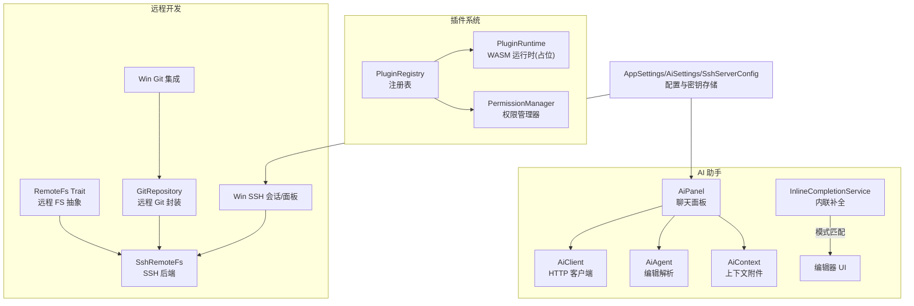
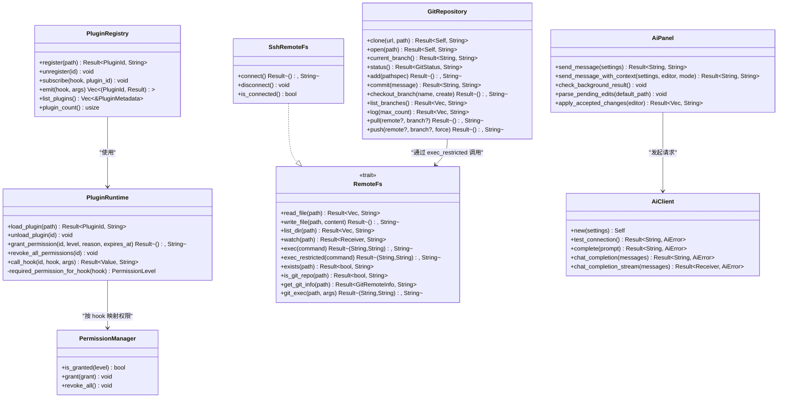
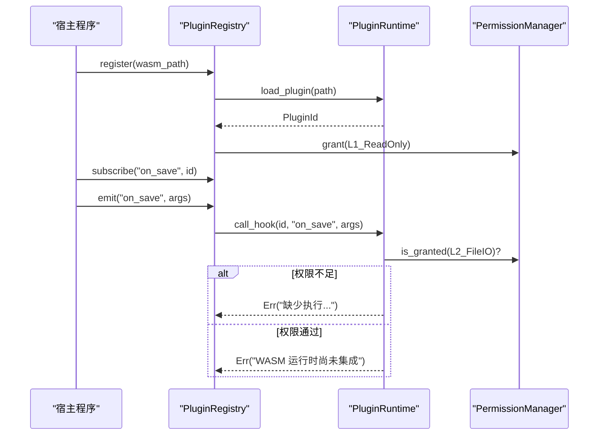
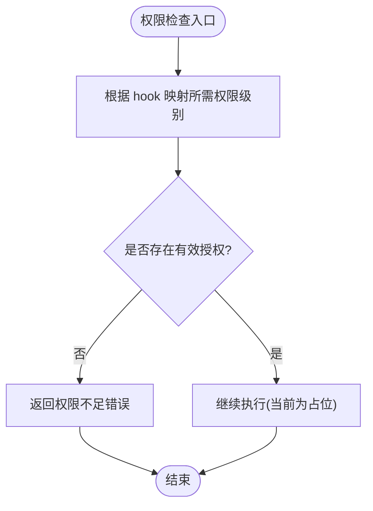
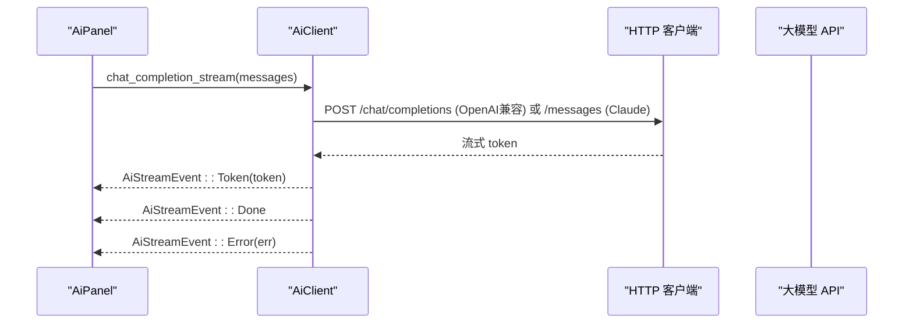
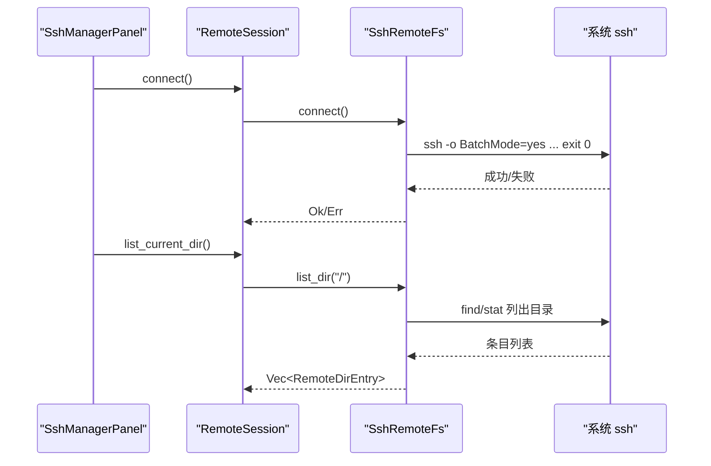
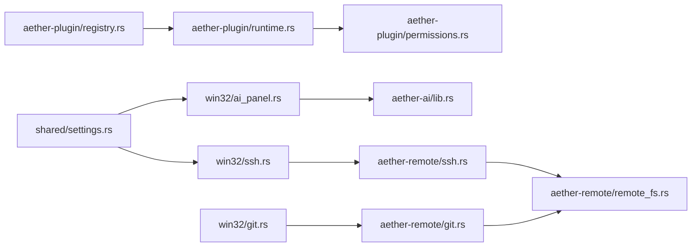

# 扩展系统

<cite>
**本文引用的文件**   
- [crates/aether-plugin/src/lib.rs](file://crates/aether-plugin/src/lib.rs)
- [crates/aether-plugin/src/registry.rs](file://crates/aether-plugin/src/registry.rs)
- [crates/aether-plugin/src/permissions.rs](file://crates/aether-plugin/src/permissions.rs)
- [crates/aether-plugin/src/runtime.rs](file://crates/aether-plugin/src/runtime.rs)
- [crates/aether-ai/src/lib.rs](file://crates/aether-ai/src/lib.rs)
- [crates/aether-win32/src/ai_agent.rs](file://crates/aether-win32/src/ai_agent.rs)
- [crates/aether-win32/src/ai_context.rs](file://crates/aether-win32/src/ai_context.rs)
- [crates/aether-win32/src/ai_panel.rs](file://crates/aether-win32/src/ai_panel.rs)
- [crates/aether-win32/src/inline_completion.rs](file://crates/aether-win32/src/inline_completion.rs)
- [crates/aether-remote/src/lib.rs](file://crates/aether-remote/src/lib.rs)
- [crates/aether-remote/src/ssh.rs](file://crates/aether-remote/src/ssh.rs)
- [crates/aether-remote/src/remote_fs.rs](file://crates/aether-remote/src/remote_fs.rs)
- [crates/aether-remote/src/git.rs](file://crates/aether-remote/src/git.rs)
- [crates/aether-win32/src/ssh.rs](file://crates/aether-win32/src/ssh.rs)
- [crates/aether-win32/src/git.rs](file://crates/aether-win32/src/git.rs)
- [crates/aether-shared/src/settings.rs](file://crates/aether-shared/src/settings.rs)
</cite>

## 目录
1. [简介](#简介)
2. [项目结构](#项目结构)
3. [核心组件](#核心组件)
4. [架构总览](#架构总览)
5. [详细组件分析](#详细组件分析)
6. [依赖分析](#依赖分析)
7. [性能考量](#性能考量)
8. [故障排查指南](#故障排查指南)
9. [结论](#结论)
10. [附录：插件开发指南](#附录插件开发指南)

## 简介
本文件面向“牧羊人编辑器”的扩展系统，系统性阐述以下能力与实现要点：
- 插件架构设计：插件注册机制、权限管理系统、WASM 运行时环境（当前为占位实现）
- AI 助手集成接口：大模型通信协议、上下文管理、内联建议生成
- 远程开发支持：SSH 连接管理、远程文件系统抽象、Git 集成
- 扩展点识别与实现：钩子系统、事件监听与回调机制
- 插件开发完整指南：项目结构、API 使用与部署流程

## 项目结构
扩展系统相关代码主要分布在以下 crate 中：
- aether-plugin：插件生命周期、注册表、权限管理与 WASM 运行时骨架
- aether-ai：AI 客户端、多提供商适配、流式响应与安全校验
- aether-remote：远程文件系统抽象、SSH 后端、Git 工具封装
- aether-win32：UI 层对 AI 面板、SSH 会话、Git 集成的编排与状态管理
- aether-shared：应用设置（含 AI 配置、SSH 服务器配置、密钥加密存储）

图表来源
- [crates/aether-plugin/src/registry.rs:1-108](file://crates/aether-plugin/src/registry.rs#L1-L108)
- [crates/aether-plugin/src/runtime.rs:1-187](file://crates/aether-plugin/src/runtime.rs#L1-L187)
- [crates/aether-plugin/src/permissions.rs:1-100](file://crates/aether-plugin/src/permissions.rs#L1-L100)
- [crates/aether-ai/src/lib.rs:194-248](file://crates/aether-ai/src/lib.rs#L194-L248)
- [crates/aether-win32/src/ai_panel.rs:123-186](file://crates/aether-win32/src/ai_panel.rs#L123-L186)
- [crates/aether-win32/src/ai_agent.rs:1-56](file://crates/aether-win32/src/ai_agent.rs#L1-L56)
- [crates/aether-win32/src/ai_context.rs:1-44](file://crates/aether-win32/src/ai_context.rs#L1-L44)
- [crates/aether-win32/src/inline_completion.rs:33-67](file://crates/aether-win32/src/inline_completion.rs#L33-L67)
- [crates/aether-remote/src/remote_fs.rs:26-94](file://crates/aether-remote/src/remote_fs.rs#L26-L94)
- [crates/aether-remote/src/ssh.rs:101-164](file://crates/aether-remote/src/ssh.rs#L101-L164)
- [crates/aether-remote/src/git.rs:115-184](file://crates/aether-remote/src/git.rs#L115-L184)
- [crates/aether-win32/src/ssh.rs:119-182](file://crates/aether-win32/src/ssh.rs#L119-L182)
- [crates/aether-win32/src/git.rs:342-427](file://crates/aether-win32/src/git.rs#L342-L427)
- [crates/aether-shared/src/settings.rs:75-122](file://crates/aether-shared/src/settings.rs#L75-L122)

章节来源
- [crates/aether-plugin/src/lib.rs:1-8](file://crates/aether-plugin/src/lib.rs#L1-L8)
- [crates/aether-remote/src/lib.rs:1-18](file://crates/aether-remote/src/lib.rs#L1-L18)

## 核心组件
- 插件注册表与生命周期
  - 负责加载 WASM 插件、维护元数据、订阅/触发钩子、卸载清理。
- 权限管理系统
  - 四级权限（只读 UI、文件 IO、网络访问、系统命令），支持过期时间、包含关系判定。
- WASM 运行时（占位）
  - 验证魔数与大小、分配 ID、默认授予 L1 权限；call_hook 已接入权限检查，但尚未集成 wasmtime。
- AI 助手
  - 统一 AiClient 对接 OpenAI/Claude/Kimi/DeepSeek/Azure/Custom；提供安全校验、流式响应、错误脱敏。
- 远程开发
  - RemoteFs trait 抽象 SSH/容器等后端；SshRemoteFs 通过系统 ssh 二进制执行命令；GitRepository 封装 git 操作。
- 内联建议
  - InlineCompletionService 基于前缀关键字匹配返回代码片段，后续可扩展为异步 AI 请求。

章节来源
- [crates/aether-plugin/src/registry.rs:17-108](file://crates/aether-plugin/src/registry.rs#L17-L108)
- [crates/aether-plugin/src/permissions.rs:1-94](file://crates/aether-plugin/src/permissions.rs#L1-L94)
- [crates/aether-plugin/src/runtime.rs:1-187](file://crates/aether-plugin/src/runtime.rs#L1-L187)
- [crates/aether-ai/src/lib.rs:194-248](file://crates/aether-ai/src/lib.rs#L194-L248)
- [crates/aether-remote/src/remote_fs.rs:26-94](file://crates/aether-remote/src/remote_fs.rs#L26-L94)
- [crates/aether-remote/src/ssh.rs:101-164](file://crates/aether-remote/src/ssh.rs#L101-L164)
- [crates/aether-remote/src/git.rs:115-184](file://crates/aether-remote/src/git.rs#L115-L184)
- [crates/aether-win32/src/inline_completion.rs:33-67](file://crates/aether-win32/src/inline_completion.rs#L33-L67)

## 架构总览
下图展示扩展系统与 AI、远程开发、UI 层的交互关系。

图表来源
- [crates/aether-plugin/src/registry.rs:17-108](file://crates/aether-plugin/src/registry.rs#L17-L108)
- [crates/aether-plugin/src/runtime.rs:1-187](file://crates/aether-plugin/src/runtime.rs#L1-L187)
- [crates/aether-plugin/src/permissions.rs:1-94](file://crates/aether-plugin/src/permissions.rs#L1-L94)
- [crates/aether-remote/src/remote_fs.rs:26-186](file://crates/aether-remote/src/remote_fs.rs#L26-L186)
- [crates/aether-remote/src/ssh.rs:101-164](file://crates/aether-remote/src/ssh.rs#L101-L164)
- [crates/aether-remote/src/git.rs:115-505](file://crates/aether-remote/src/git.rs#L115-L505)
- [crates/aether-ai/src/lib.rs:194-248](file://crates/aether-ai/src/lib.rs#L194-L248)
- [crates/aether-win32/src/ai_panel.rs:123-186](file://crates/aether-win32/src/ai_panel.rs#L123-L186)

## 详细组件分析

### 插件注册与钩子系统
- 注册流程
  - 加载 WASM 插件并创建默认元数据，分配唯一 ID，初始化权限管理器（默认授予 L1）。
- 钩子订阅与触发
  - 以 hook 名称为键维护订阅者列表；emit 时遍历订阅者并调用 call_hook。
- 权限控制
  - 根据 hook 名称映射所需权限级别；未满足则拒绝执行。

图表来源
- [crates/aether-plugin/src/registry.rs:34-91](file://crates/aether-plugin/src/registry.rs#L34-L91)
- [crates/aether-plugin/src/runtime.rs:95-175](file://crates/aether-plugin/src/runtime.rs#L95-L175)
- [crates/aether-plugin/src/permissions.rs:62-94](file://crates/aether-plugin/src/permissions.rs#L62-L94)

章节来源
- [crates/aether-plugin/src/registry.rs:17-108](file://crates/aether-plugin/src/registry.rs#L17-L108)
- [crates/aether-plugin/src/runtime.rs:1-187](file://crates/aether-plugin/src/runtime.rs#L1-L187)
- [crates/aether-plugin/src/permissions.rs:1-94](file://crates/aether-plugin/src/permissions.rs#L1-L94)

### 权限管理系统
- 权限级别与包含关系
  - L1 只读 UI → L2 文件 IO → L3 网络访问 → L4 系统命令；高阶包含低阶。
- 授权记录
  - 支持 granted_at、expires_at、reason；过期或未来 granted_at 视为无效。
- 运行时策略
  - 新插件默认仅 L1；按 hook 名映射所需权限；未知 hook 默认 L1。

图表来源
- [crates/aether-plugin/src/runtime.rs:159-175](file://crates/aether-plugin/src/runtime.rs#L159-L175)
- [crates/aether-plugin/src/permissions.rs:15-44](file://crates/aether-plugin/src/permissions.rs#L15-L44)
- [crates/aether-plugin/src/permissions.rs:84-94](file://crates/aether-plugin/src/permissions.rs#L84-L94)

章节来源
- [crates/aether-plugin/src/permissions.rs:1-94](file://crates/aether-plugin/src/permissions.rs#L1-L94)
- [crates/aether-plugin/src/runtime.rs:159-175](file://crates/aether-plugin/src/runtime.rs#L159-L175)

### WASM 运行时环境（占位）
- 插件加载
  - 校验文件存在性、魔数、大小限制；分配递增 ID；注入默认 L1 权限。
- 钩子调用
  - 先进行权限检查，再尝试调用 WASM 函数（当前返回“未集成”错误）。

章节来源
- [crates/aether-plugin/src/runtime.rs:33-87](file://crates/aether-plugin/src/runtime.rs#L33-L87)
- [crates/aether-plugin/src/runtime.rs:127-157](file://crates/aether-plugin/src/runtime.rs#L127-L157)

### AI 助手集成接口
- 大模型通信协议
  - 统一 AiClient 适配 OpenAI/Claude/Kimi/DeepSeek/Azure/Custom；支持非流式与流式响应。
- 安全校验
  - HTTPS 强制、禁止私有/本地 IP、DNS 二次校验、黑名单云元数据端点、响应体大小限制、错误消息截断与脱敏。
- 上下文管理
  - AiContextAttachment 标记当前文件、选区、打开文件、诊断、文件树、自定义文本；AiPanel 组装提示词并发送。
- 内联建议生成
  - InlineCompletionService 基于前缀关键字匹配返回代码片段；可演进为异步 AI 请求。

图表来源
- [crates/aether-ai/src/lib.rs:710-770](file://crates/aether-ai/src/lib.rs#L710-L770)
- [crates/aether-ai/src/lib.rs:460-514](file://crates/aether-ai/src/lib.rs#L460-L514)
- [crates/aether-ai/src/lib.rs:516-571](file://crates/aether-ai/src/lib.rs#L516-L571)
- [crates/aether-win32/src/ai_panel.rs:230-330](file://crates/aether-win32/src/ai_panel.rs#L230-L330)

章节来源
- [crates/aether-ai/src/lib.rs:194-248](file://crates/aether-ai/src/lib.rs#L194-L248)
- [crates/aether-ai/src/lib.rs:270-400](file://crates/aether-ai/src/lib.rs#L270-L400)
- [crates/aether-win32/src/ai_panel.rs:123-186](file://crates/aether-win32/src/ai_panel.rs#L123-L186)
- [crates/aether-win32/src/ai_context.rs:1-44](file://crates/aether-win32/src/ai_context.rs#L1-L44)
- [crates/aether-win32/src/inline_completion.rs:33-67](file://crates/aether-win32/src/inline_completion.rs#L33-L67)

### 远程开发支持
- SSH 连接管理
  - Win 层 SshConnectionDialog/SshManagerPanel 管理表单与状态；底层 SshRemoteFs 通过系统 ssh 执行命令，支持 Agent/Key 认证（密码认证禁用）。
- 远程文件系统抽象
  - RemoteFs trait 定义 read/write/list/watch/exec 等接口；SshRemoteFs 实现并通过管道写入避免注入。
- Git 集成
  - 远程侧 GitRepository 通过 exec_restricted 白名单执行 git 命令；本地侧 GitIntegration/GitCommand 封装常用操作。

图表来源
- [crates/aether-win32/src/ssh.rs:128-182](file://crates/aether-win32/src/ssh.rs#L128-L182)
- [crates/aether-remote/src/ssh.rs:130-164](file://crates/aether-remote/src/ssh.rs#L130-L164)
- [crates/aether-remote/src/remote_fs.rs:327-374](file://crates/aether-remote/src/remote_fs.rs#L327-L374)

章节来源
- [crates/aether-remote/src/ssh.rs:101-164](file://crates/aether-remote/src/ssh.rs#L101-L164)
- [crates/aether-remote/src/remote_fs.rs:26-94](file://crates/aether-remote/src/remote_fs.rs#L26-L94)
- [crates/aether-remote/src/git.rs:115-184](file://crates/aether-remote/src/git.rs#L115-L184)
- [crates/aether-win32/src/ssh.rs:119-182](file://crates/aether-win32/src/ssh.rs#L119-L182)
- [crates/aether-win32/src/git.rs:342-427](file://crates/aether-win32/src/git.rs#L342-L427)

### 扩展点识别与实现方式
- 钩子系统
  - 以字符串 hook 名作为扩展点标识；插件通过 subscribe 注册；宿主通过 emit 分发。
- 权限绑定
  - 每个 hook 映射到固定权限级别；未知 hook 默认 L1，最小权限原则。
- 事件监听与回调
  - 当前为同步调用链；未来可在 WASM 运行时集成后改为异步回调。

章节来源
- [crates/aether-plugin/src/registry.rs:67-91](file://crates/aether-plugin/src/registry.rs#L67-L91)
- [crates/aether-plugin/src/runtime.rs:159-175](file://crates/aether-plugin/src/runtime.rs#L159-L175)

## 依赖分析
- 组件耦合
  - PluginRegistry 强依赖 PluginRuntime 与 PermissionManager；AiPanel 依赖 AiClient 与上下文模块；RemoteFs 被 SSH/Git 实现复用。
- 外部依赖
  - ai 模块依赖 ureq 做 HTTP 请求；远程模块依赖系统 ssh/git 二进制；Windows 平台使用 DPAPI 加密密钥。
- 潜在循环依赖
  - 当前未见循环导入；各模块职责清晰。

图表来源
- [crates/aether-plugin/src/registry.rs:1-32](file://crates/aether-plugin/src/registry.rs#L1-L32)
- [crates/aether-plugin/src/runtime.rs:1-31](file://crates/aether-plugin/src/runtime.rs#L1-L31)
- [crates/aether-plugin/src/permissions.rs:1-20](file://crates/aether-plugin/src/permissions.rs#L1-L20)
- [crates/aether-win32/src/ai_panel.rs:1-12](file://crates/aether-win32/src/ai_panel.rs#L1-L12)
- [crates/aether-ai/src/lib.rs:1-6](file://crates/aether-ai/src/lib.rs#L1-L6)
- [crates/aether-remote/src/ssh.rs:1-18](file://crates/aether-remote/src/ssh.rs#L1-L18)
- [crates/aether-remote/src/remote_fs.rs:1-25](file://crates/aether-remote/src/remote_fs.rs#L1-L25)
- [crates/aether-remote/src/git.rs:1-11](file://crates/aether-remote/src/git.rs#L1-L11)
- [crates/aether-win32/src/ssh.rs:1-5](file://crates/aether-win32/src/ssh.rs#L1-L5)
- [crates/aether-win32/src/git.rs:1-5](file://crates/aether-win32/src/git.rs#L1-L5)
- [crates/aether-shared/src/settings.rs:1-18](file://crates/aether-shared/src/settings.rs#L1-L18)

章节来源
- [crates/aether-plugin/src/lib.rs:1-8](file://crates/aether-plugin/src/lib.rs#L1-L8)
- [crates/aether-remote/src/lib.rs:1-18](file://crates/aether-remote/src/lib.rs#L1-L18)

## 性能考量
- 插件加载
  - 魔数与大小校验在加载阶段完成，避免过大插件影响内存；ID 自增避免冲突。
- AI 请求
  - 流式响应降低首字延迟；后台线程处理 HTTP，UI 轮询结果；限制输入长度与历史窗口。
- 远程 I/O
  - SSH 写文件采用临时文件+原子 mv，减少中断风险；目录列举使用批量 stat 减少往返。
- Git 操作
  - porcelain 格式解析提升稳定性；分支/提交查询使用高效参数。

[本节为通用指导，不直接分析具体文件]

## 故障排查指南
- 插件相关
  - 注册失败：检查 WASM 魔数与文件大小；确认路径存在。
  - 钩子执行失败：确认权限是否足够；注意当前 WASM 未集成会返回特定错误。
- AI 相关
  - 连接测试失败：检查 Base URL 是否为 HTTPS、API Key 是否设置、DNS 解析是否命中私有地址。
  - 流式错误：查看 stream_state.error 字段，确保敏感信息已被脱敏。
- 远程相关
  - SSH 连接失败：确认系统安装 OpenSSH、用户/主机不以 '-' 开头、密钥路径正确。
  - Git 操作失败：检查 exec_restricted 白名单与参数合法性（不含 '..'、绝对路径等）。

章节来源
- [crates/aether-plugin/src/runtime.rs:33-87](file://crates/aether-plugin/src/runtime.rs#L33-L87)
- [crates/aether-plugin/src/runtime.rs:127-157](file://crates/aether-plugin/src/runtime.rs#L127-L157)
- [crates/aether-ai/src/lib.rs:270-400](file://crates/aether-ai/src/lib.rs#L270-L400)
- [crates/aether-win32/src/ai_panel.rs:230-330](file://crates/aether-win32/src/ai_panel.rs#L230-L330)
- [crates/aether-remote/src/ssh.rs:130-164](file://crates/aether-remote/src/ssh.rs#L130-L164)
- [crates/aether-remote/src/remote_fs.rs:51-94](file://crates/aether-remote/src/remote_fs.rs#L51-L94)

## 结论
扩展系统以“注册表+运行时+权限”为核心，结合 AI 助手与远程开发能力，形成可扩展的编辑器生态。当前 WASM 运行时处于占位阶段，权限与钩子框架已就绪；AI 与远程模块具备完善的安全与可用性保障。下一步重点在于集成真实 WASM 引擎、完善插件 API 文档与示例，以及持续强化安全边界。

[本节为总结，不直接分析具体文件]

## 附录：插件开发指南
- 项目结构
  - 输出为符合魔数的 WASM 文件；遵循最小权限原则声明所需 hook。
- 插件 API 使用
  - 注册钩子：在插件生命周期中向宿主注册所需 hook。
  - 权限要求：根据 hook 类型准备相应权限（如 write_file 需要 L2）。
  - 事件回调：通过宿主 emit 触发，接收 JSON 参数与返回值。
- 部署流程
  - 将编译产物放置于指定目录；宿主通过 register 加载；如需更高权限，由管理员授予。
- 调试建议
  - 优先验证 WASM 魔数与大小；逐步放开权限；关注运行时返回的错误信息。

[本节为概念性指导，不直接分析具体文件]