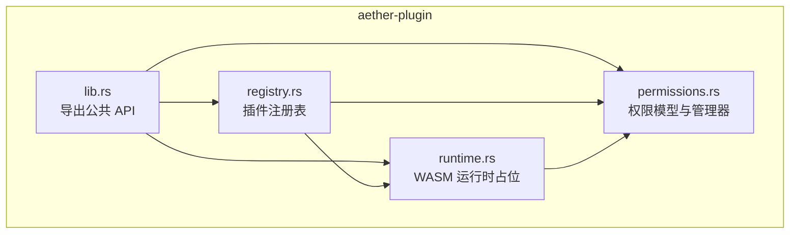
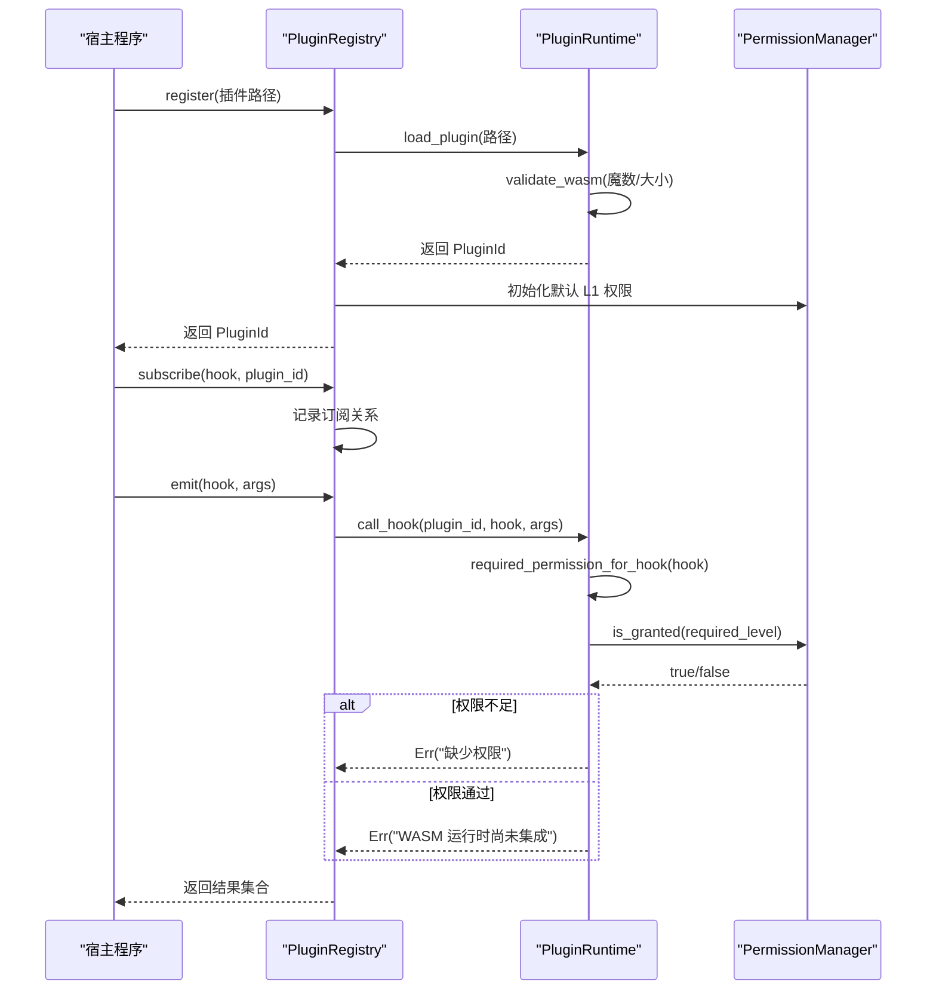
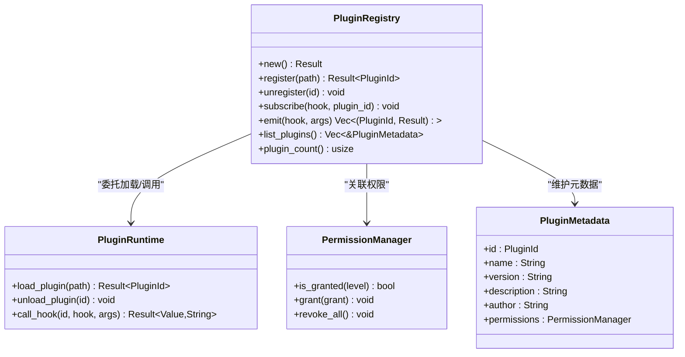
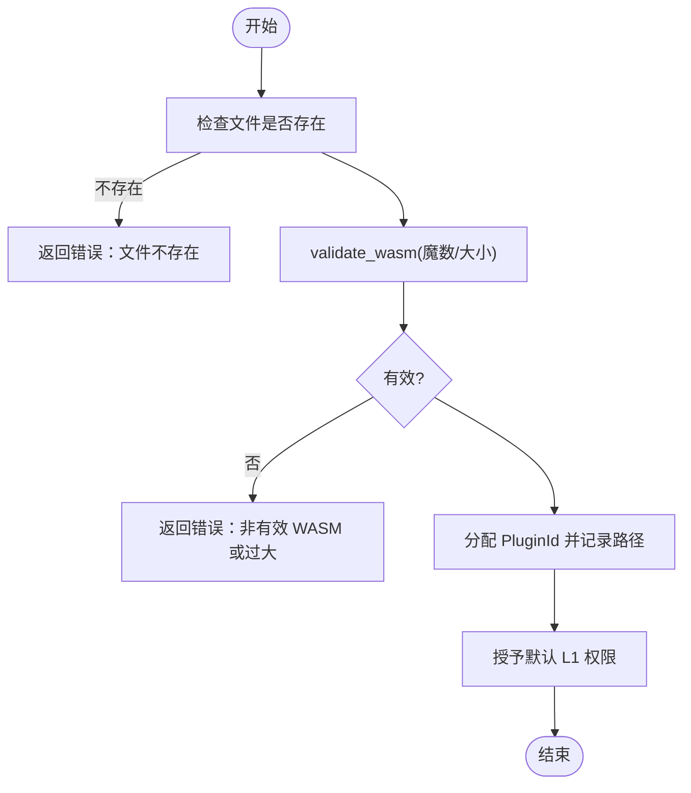
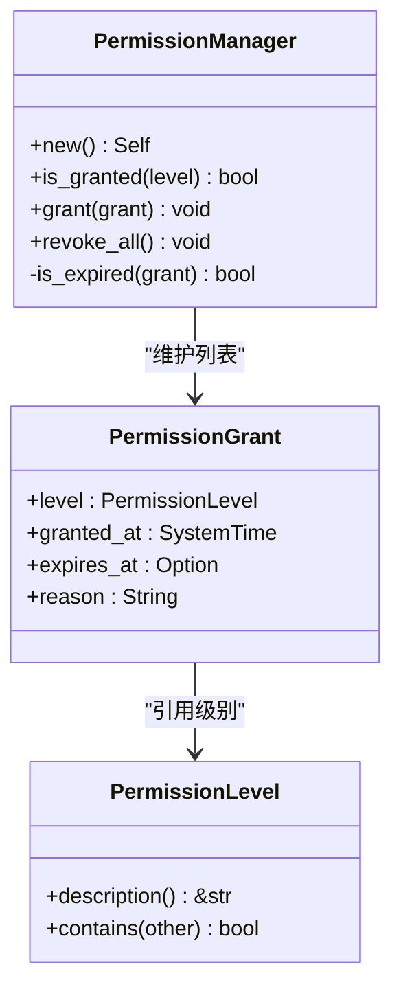
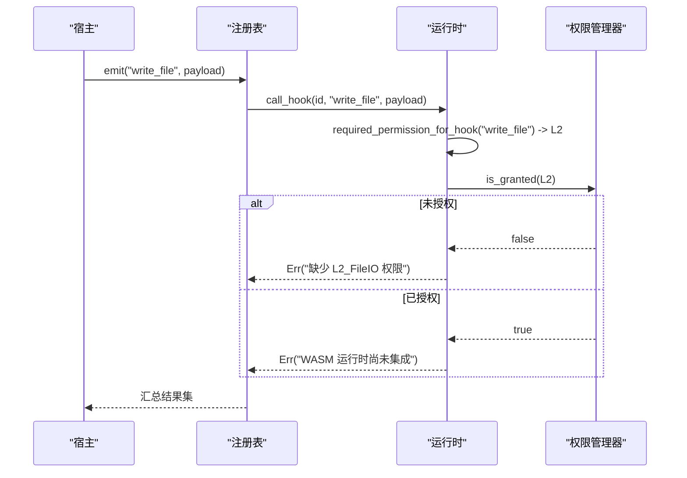
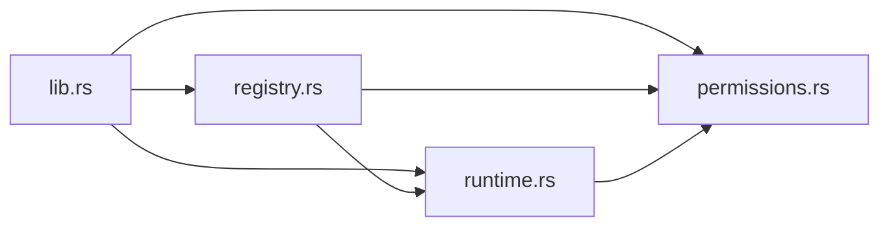

# 插件架构设计

<cite>
**本文引用的文件列表**
- [crates/aether-plugin/src/lib.rs](file://crates/aether-plugin/src/lib.rs)
- [crates/aether-plugin/src/registry.rs](file://crates/aether-plugin/src/registry.rs)
- [crates/aether-plugin/src/runtime.rs](file://crates/aether-plugin/src/runtime.rs)
- [crates/aether-plugin/src/permissions.rs](file://crates/aether-plugin/src/permissions.rs)
- [README.md](file://README.md)
</cite>

## 目录
1. [简介](#简介)
2. [项目结构](#项目结构)
3. [核心组件](#核心组件)
4. [架构总览](#架构总览)
5. [详细组件分析](#详细组件分析)
6. [依赖关系分析](#依赖关系分析)
7. [性能与安全考量](#性能与安全考量)
8. [故障排查指南](#故障排查指南)
9. [结论](#结论)
10. [附录：开发最佳实践与示例](#附录开发最佳实践与示例)

## 简介
本文件面向“牧羊人编辑器”的插件系统，聚焦以下目标：
- 深入解释插件注册机制与生命周期管理（PluginRegistry）
- 说明 WASM 运行时环境的安全隔离机制（沙箱、内存与资源限制）
- 阐述权限管理系统（PermissionLevel 与 PermissionGrant）
- 描述插件与宿主程序的通信协议（事件传递、数据交换、错误处理）
- 提供插件开发最佳实践（项目结构、API 使用、调试技巧）
- 给出完整的代码示例路径，展示如何创建、注册和卸载插件

## 项目结构
插件子系统位于 crates/aether-plugin，采用模块划分清晰的设计：
- lib.rs：对外暴露公共 API（类型与模块）
- registry.rs：插件注册表，负责插件生命周期与钩子分发
- runtime.rs：WASM 插件运行时（当前为占位实现），负责加载、权限校验与钩子调用
- permissions.rs：权限模型与管理器，定义权限级别与授权记录

图表来源
- [crates/aether-plugin/src/lib.rs:1-8](file://crates/aether-plugin/src/lib.rs#L1-L8)
- [crates/aether-plugin/src/registry.rs:1-108](file://crates/aether-plugin/src/registry.rs#L1-L108)
- [crates/aether-plugin/src/runtime.rs:1-187](file://crates/aether-plugin/src/runtime.rs#L1-L187)
- [crates/aether-plugin/src/permissions.rs:1-100](file://crates/aether-plugin/src/permissions.rs#L1-L100)

章节来源
- [README.md:29-46](file://README.md#L29-L46)
- [crates/aether-plugin/src/lib.rs:1-8](file://crates/aether-plugin/src/lib.rs#L1-L8)

## 核心组件
- PluginId：插件唯一标识，用于在运行时与注册表中定位插件实例
- PluginRuntime：WASM 插件运行时（当前为占位实现），负责：
  - 加载与验证 WASM 插件（魔数检查、大小限制）
  - 授予与撤销权限
  - 根据钩子名称判定所需权限级别
  - 调用插件钩子（当前返回“未集成”错误，避免误判成功）
- PluginRegistry：插件注册表，负责：
  - 注册与卸载插件
  - 维护插件元数据（ID、名称、版本等）
  - 订阅与触发钩子（事件分发）
  - 清理钩子订阅关系
- PermissionLevel：权限级别枚举（L1_ReadOnly、L2_FileIO、L3_Network、L4_System）
- PermissionManager：权限管理器，维护授权记录并支持过期时间校验
- PermissionGrant：单次授权记录（包含级别、授予时间、可选过期时间与原因）

章节来源
- [crates/aether-plugin/src/runtime.rs:9-21](file://crates/aether-plugin/src/runtime.rs#L9-L21)
- [crates/aether-plugin/src/registry.rs:6-23](file://crates/aether-plugin/src/registry.rs#L6-L23)
- [crates/aether-plugin/src/permissions.rs:1-13](file://crates/aether-plugin/src/permissions.rs#L1-L13)
- [crates/aether-plugin/src/permissions.rs:47-60](file://crates/aether-plugin/src/permissions.rs#L47-L60)

## 架构总览
整体流程围绕“注册—授权—订阅—触发—执行”展开。当前运行时处于占位阶段，但权限与注册逻辑已完整可用。

图表来源
- [crates/aether-plugin/src/registry.rs:34-91](file://crates/aether-plugin/src/registry.rs#L34-L91)
- [crates/aether-plugin/src/runtime.rs:59-157](file://crates/aether-plugin/src/runtime.rs#L59-L157)
- [crates/aether-plugin/src/permissions.rs:67-72](file://crates/aether-plugin/src/permissions.rs#L67-L72)

## 详细组件分析

### 插件注册表（PluginRegistry）
职责与行为：
- 新建与默认构造：内部持有运行时与插件映射、钩子订阅映射
- 注册插件：委托运行时加载，生成默认元数据（名称来自文件名、版本固定、作者与描述为空），并为插件分配默认 L1 权限
- 卸载插件：从运行时移除、从元数据映射删除、从所有钩子订阅中剔除
- 订阅钩子：将插件 ID 加入指定钩子的订阅列表
- 触发钩子：遍历订阅者，逐个调用运行时钩子，收集结果（含错误信息）
- 查询接口：列出插件元数据、统计数量

复杂度与注意事项：
- 订阅与触发均为 O(n) 操作（n 为订阅者数量）
- 卸载时清理所有钩子订阅，避免悬挂引用

图表来源
- [crates/aether-plugin/src/registry.rs:17-102](file://crates/aether-plugin/src/registry.rs#L17-L102)
- [crates/aether-plugin/src/registry.rs:6-15](file://crates/aether-plugin/src/registry.rs#L6-L15)
- [crates/aether-plugin/src/runtime.rs:23-187](file://crates/aether-plugin/src/runtime.rs#L23-L187)
- [crates/aether-plugin/src/permissions.rs:56-100](file://crates/aether-plugin/src/permissions.rs#L56-L100)

章节来源
- [crates/aether-plugin/src/registry.rs:17-102](file://crates/aether-plugin/src/registry.rs#L17-L102)

### WASM 运行时（PluginRuntime，占位实现）
安全与资源控制要点：
- 魔数校验：仅接受以 WASM 魔数开头的二进制文件
- 大小限制：最大插件体积 50MB，防止恶意大文件
- ID 溢出保护：当 u32::MAX 耗尽时拒绝新插件
- 默认最小权限：新加载插件仅授予 L1_ReadOnly
- 权限检查：按钩子名映射到所需权限级别；未知钩子默认要求 L1（最安全）
- 钩子调用：当前返回“未集成”错误，避免误判成功

图表来源
- [crates/aether-plugin/src/runtime.rs:33-87](file://crates/aether-plugin/src/runtime.rs#L33-L87)

章节来源
- [crates/aether-plugin/src/runtime.rs:33-175](file://crates/aether-plugin/src/runtime.rs#L33-L175)

### 权限系统（PermissionLevel 与 PermissionManager）
权限级别：
- L1_ReadOnly：只读 UI 访问
- L2_FileIO：文件读写
- L3_Network：网络访问
- L4_System：系统命令执行

包含关系：
- L4 包含所有级别
- L3 包含 L3/L2/L1
- L2 包含 L2/L1
- L1 仅包含自身

授权记录（PermissionGrant）：
- 包含级别、授予时间、可选过期时间、原因
- 过期判断：若 expires_at 存在且早于当前时间，或 granted_at 晚于当前时间，则视为无效

图表来源
- [crates/aether-plugin/src/permissions.rs:1-45](file://crates/aether-plugin/src/permissions.rs#L1-L45)
- [crates/aether-plugin/src/permissions.rs:47-94](file://crates/aether-plugin/src/permissions.rs#L47-L94)

章节来源
- [crates/aether-plugin/src/permissions.rs:1-94](file://crates/aether-plugin/src/permissions.rs#L1-L94)

### 插件与宿主通信协议（事件、数据、错误）
- 事件传递：通过钩子名称（hook）进行订阅与触发，参数使用 JSON 值（serde_json::Value）
- 数据交换：emit 返回每个订阅者的结果（Result<Value, String>），便于宿主统一处理成功与失败
- 错误处理：
  - 权限不足：明确提示缺少的权限级别
  - 未集成：当前运行时未接入 wasmtime，返回显式错误而非 Ok(Null)，避免误判
  - 未加载：对未注册的插件 ID 直接报错

图表来源
- [crates/aether-plugin/src/registry.rs:75-91](file://crates/aether-plugin/src/registry.rs#L75-L91)
- [crates/aether-plugin/src/runtime.rs:127-175](file://crates/aether-plugin/src/runtime.rs#L127-L175)
- [crates/aether-plugin/src/permissions.rs:67-72](file://crates/aether-plugin/src/permissions.rs#L67-L72)

章节来源
- [crates/aether-plugin/src/registry.rs:75-91](file://crates/aether-plugin/src/registry.rs#L75-L91)
- [crates/aether-plugin/src/runtime.rs:127-175](file://crates/aether-plugin/src/runtime.rs#L127-L175)

## 依赖关系分析
- 模块内依赖：
  - registry.rs 依赖 runtime.rs 与 permissions.rs
  - runtime.rs 依赖 permissions.rs
  - lib.rs 聚合导出各模块公共类型
- 外部依赖：
  - serde_json：用于事件参数与返回值的数据交换
  - 未来集成：wasmtime（当前注释指出需要该依赖以实现真正的 WASM 执行）

图表来源
- [crates/aether-plugin/src/lib.rs:1-8](file://crates/aether-plugin/src/lib.rs#L1-L8)
- [crates/aether-plugin/src/registry.rs:1-5](file://crates/aether-plugin/src/registry.rs#L1-L5)
- [crates/aether-plugin/src/runtime.rs:1-5](file://crates/aether-plugin/src/runtime.rs#L1-L5)
- [crates/aether-plugin/src/permissions.rs:1-13](file://crates/aether-plugin/src/permissions.rs#L1-L13)

章节来源
- [crates/aether-plugin/src/lib.rs:1-8](file://crates/aether-plugin/src/lib.rs#L1-L8)

## 性能与安全考量
- 性能
  - 注册与卸载为 O(1) 插入/删除（HashMap）
  - 订阅与触发为 O(n) 线性扫描（n 为订阅者数量）
  - 钩子调用在当前占位实现中不产生实际 WASM 开销
- 安全
  - 魔数校验与大小限制防止非法与超大插件
  - 权限最小化原则：默认仅授予 L1，按需提升
  - 过期时间校验防止“过去时间”或“未来时间”的异常授权
  - 未知钩子默认要求 L1，遵循“默认拒绝”策略

[本节为通用指导，无需具体文件分析]

## 故障排查指南
常见问题与定位方法：
- 插件文件不存在：检查路径是否正确，确保 .wasm 文件存在
- 非有效 WASM 格式：确认编译产物为标准 WASM 二进制，魔数正确
- 插件过大：超过 50MB 将被拒绝，需优化插件体积
- 权限不足：查看所需权限级别（如 L2_FileIO），并通过宿主授予相应权限
- 未集成错误：当前运行时未接入 wasmtime，属于预期行为；集成后应能正常执行钩子

章节来源
- [crates/aether-plugin/src/runtime.rs:33-87](file://crates/aether-plugin/src/runtime.rs#L33-L87)
- [crates/aether-plugin/src/runtime.rs:127-175](file://crates/aether-plugin/src/runtime.rs#L127-L175)
- [crates/aether-plugin/src/permissions.rs:84-94](file://crates/aether-plugin/src/permissions.rs#L84-L94)

## 结论
当前插件架构已完成注册、权限与钩子分发的核心骨架，具备完善的安全边界与可扩展性。运行时部分为占位实现，后续接入 wasmtime 后即可实现真正的 WASM 沙箱执行。权限模型与最小授权策略为插件生态提供了坚实的安全基础。

[本节为总结，无需具体文件分析]

## 附录：开发最佳实践与示例

### 插件项目结构规范
- 输出标准 WASM 二进制文件，确保魔数正确
- 控制插件体积不超过 50MB
- 建议将插件功能按能力拆分，减少不必要的权限需求

[本节为通用指导，无需具体文件分析]

### API 使用指南
- 创建注册表：使用默认构造或 new()
- 注册插件：传入 .wasm 路径，获取 PluginId
- 授予权限：根据需要调用 grant_permission，设置过期时间与原因
- 订阅钩子：在注册表上调用 subscribe，绑定插件与钩子名
- 触发钩子：调用 emit，处理返回的结果集合
- 卸载插件：调用 unregister，清理运行时与订阅关系

章节来源
- [crates/aether-plugin/src/registry.rs:34-102](file://crates/aether-plugin/src/registry.rs#L34-L102)
- [crates/aether-plugin/src/runtime.rs:95-126](file://crates/aether-plugin/src/runtime.rs#L95-L126)

### 调试技巧
- 打印日志：在宿主侧记录 emit 返回的错误信息，快速定位权限或集成问题
- 单元测试：参考现有测试用例，覆盖注册、订阅、触发、权限授予与撤销场景
- 权限矩阵：为不同钩子建立权限需求清单，确保最小授权

章节来源
- [crates/aether-plugin/src/registry.rs:110-319](file://crates/aether-plugin/src/registry.rs#L110-L319)
- [crates/aether-plugin/src/runtime.rs:189-561](file://crates/aether-plugin/src/runtime.rs#L189-L561)

### 完整示例（代码片段路径）
以下为关键步骤的代码片段路径，便于读者对照实现：
- 创建注册表与默认构造
  - [crates/aether-plugin/src/registry.rs:25-32](file://crates/aether-plugin/src/registry.rs#L25-L32)
- 注册插件并获取 ID
  - [crates/aether-plugin/src/registry.rs:34-54](file://crates/aether-plugin/src/registry.rs#L34-L54)
- 授予权限（例如 L2_FileIO）
  - [crates/aether-plugin/src/runtime.rs:95-118](file://crates/aether-plugin/src/runtime.rs#L95-L118)
- 订阅钩子
  - [crates/aether-plugin/src/registry.rs:67-73](file://crates/aether-plugin/src/registry.rs#L67-L73)
- 触发钩子并处理结果
  - [crates/aether-plugin/src/registry.rs:75-91](file://crates/aether-plugin/src/registry.rs#L75-L91)
- 卸载插件
  - [crates/aether-plugin/src/registry.rs:56-65](file://crates/aether-plugin/src/registry.rs#L56-L65)

章节来源
- [crates/aether-plugin/src/registry.rs:25-91](file://crates/aether-plugin/src/registry.rs#L25-L91)
- [crates/aether-plugin/src/runtime.rs:95-118](file://crates/aether-plugin/src/runtime.rs#L95-L118)