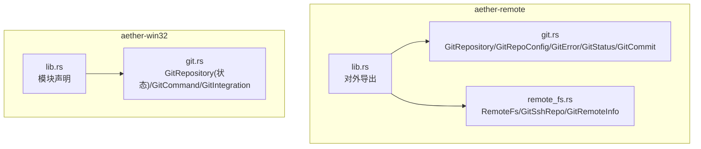
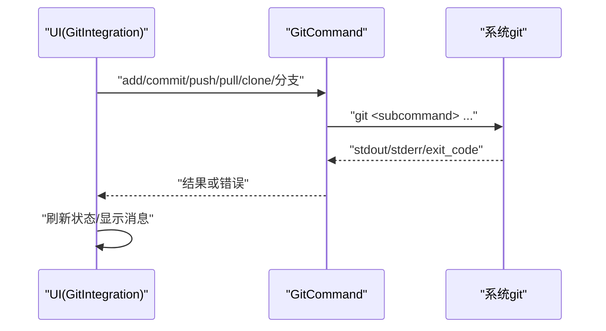
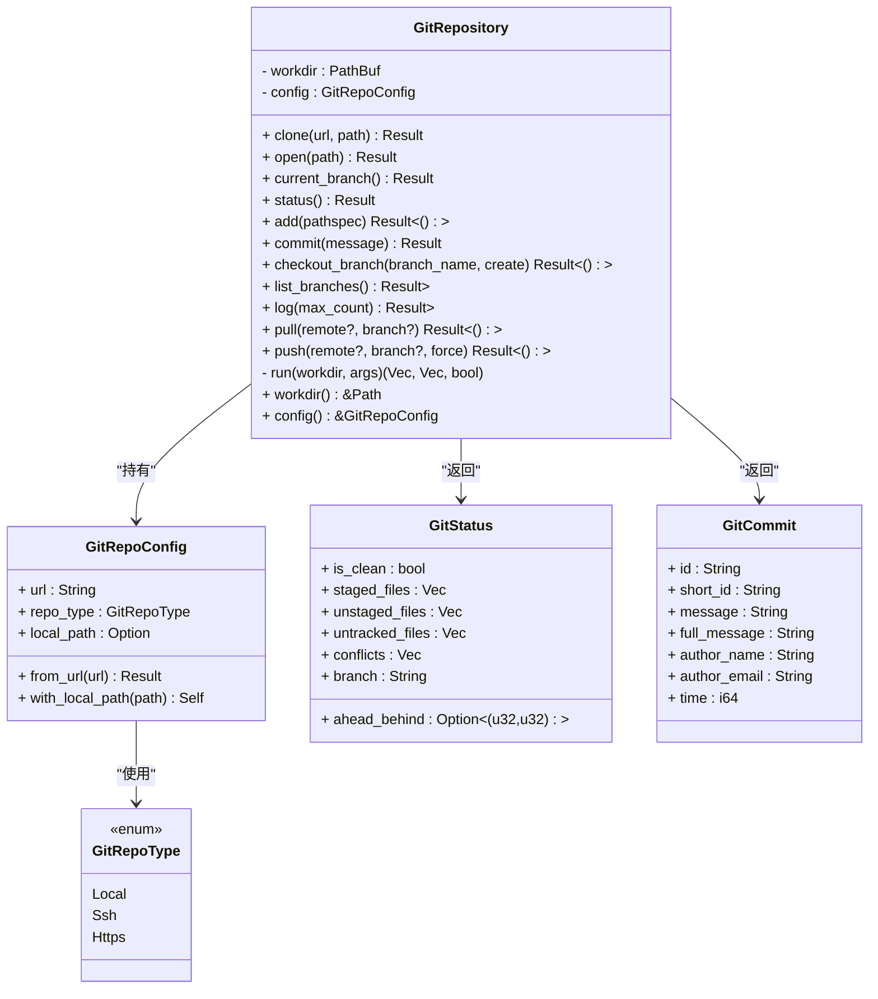
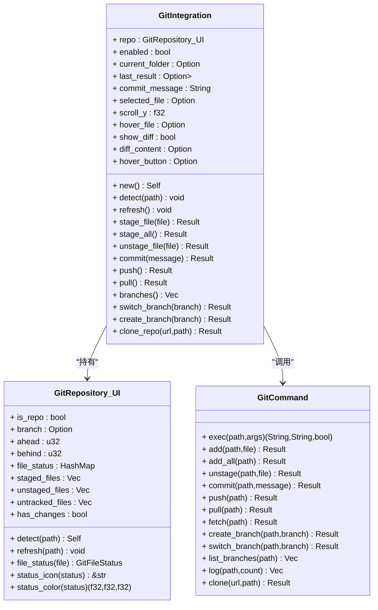
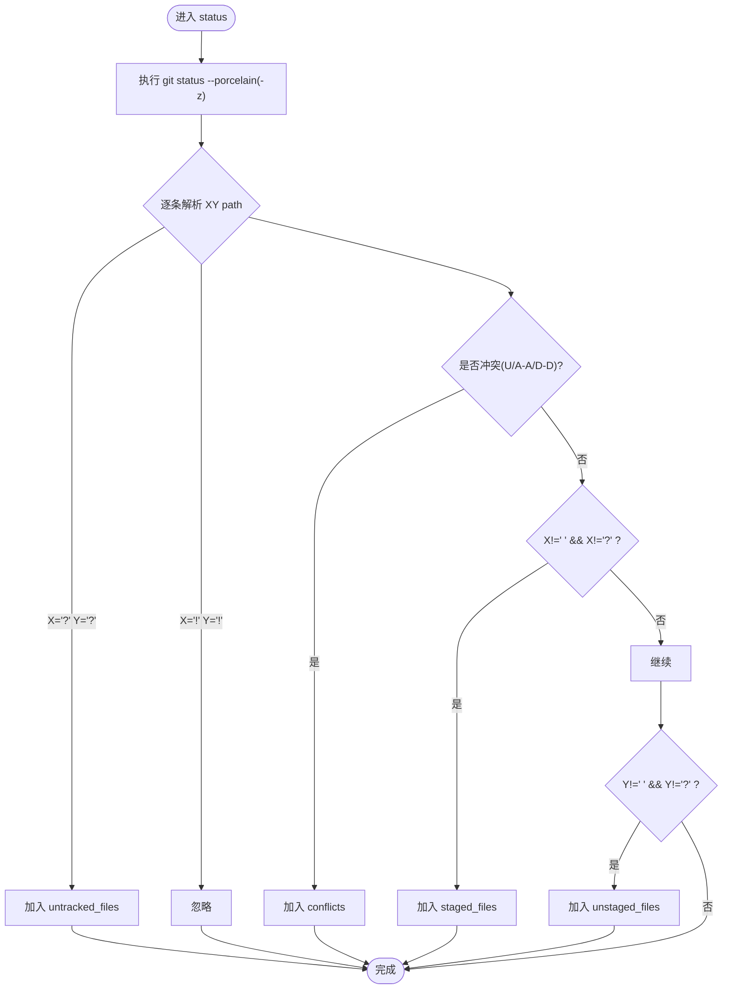
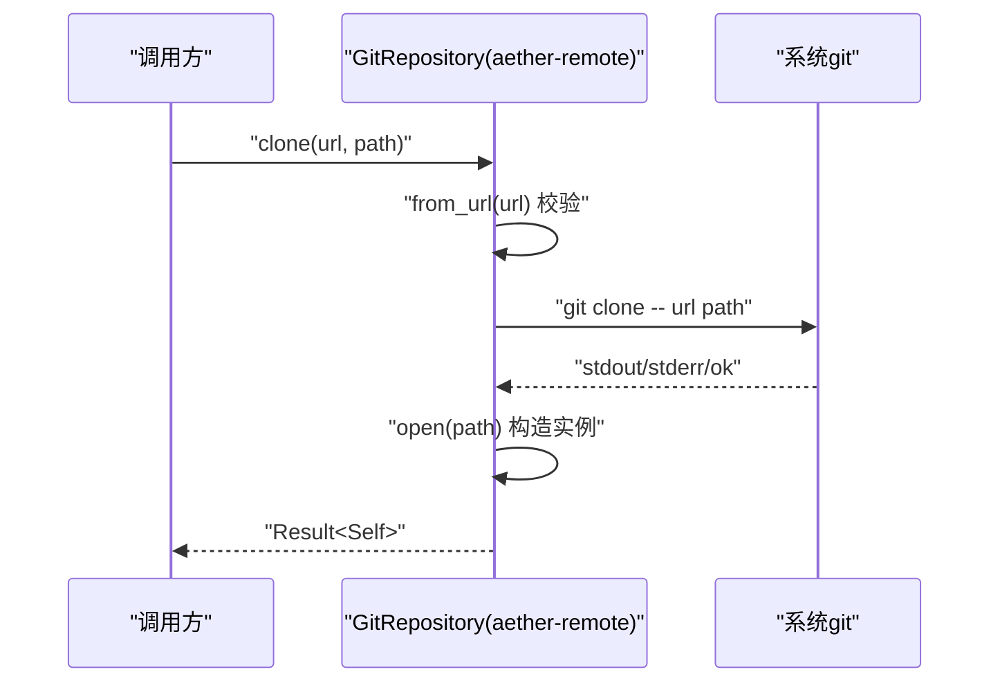
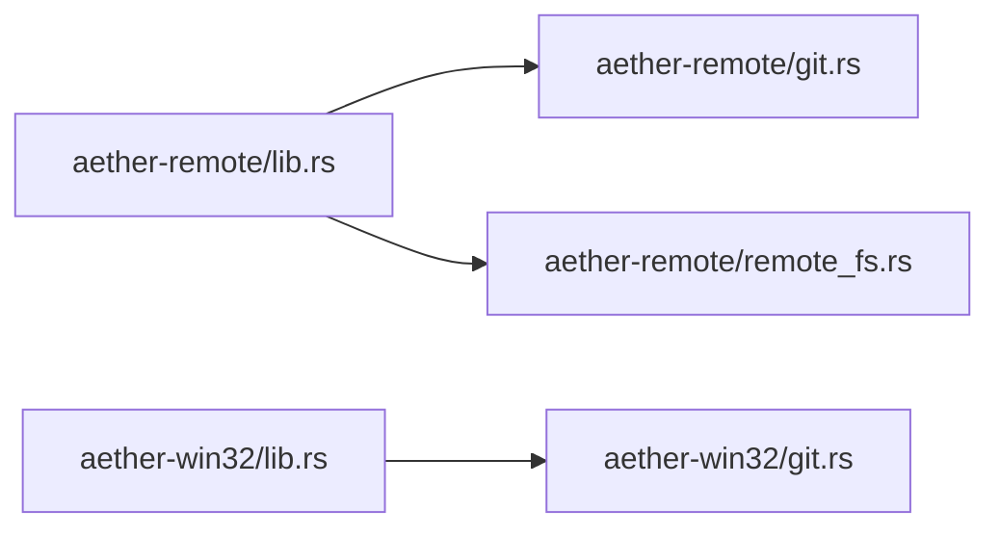

# Git 集成

<cite>
**本文引用的文件**   
- [aether-remote/src/git.rs](file://crates/aether-remote/src/git.rs)
- [aether-remote/src/remote_fs.rs](file://crates/aether-remote/src/remote_fs.rs)
- [aether-remote/src/lib.rs](file://crates/aether-remote/src/lib.rs)
- [aether-win32/src/git.rs](file://crates/aether-win32/src/git.rs)
- [aether-win32/src/lib.rs](file://crates/aether-win32/src/lib.rs)
- [aether-shared/src/settings.rs](file://crates/aether-shared/src/settings.rs)
</cite>

## 目录
1. [简介](#简介)
2. [项目结构](#项目结构)
3. [核心组件](#核心组件)
4. [架构总览](#架构总览)
5. [详细组件分析](#详细组件分析)
6. [依赖关系分析](#依赖关系分析)
7. [性能考量](#性能考量)
8. [故障排除指南](#故障排除指南)
9. [结论](#结论)
10. [附录](#附录)

## 简介
本技术文档聚焦于牧羊人编辑器的 Git 集成模块，系统性阐述以下方面：
- GitRepository 结构设计（仓库发现、配置管理、状态跟踪）
- 远程操作（克隆、推送、拉取、分支管理）
- 状态监控（工作区状态检测、未提交更改识别、冲突检测）
- 命令封装（异步执行策略、错误处理、输出解析）
- 服务器支持（SSH、HTTPS、自定义协议适配）
- 配置选项（用户信息、忽略规则、钩子）
- 与编辑器其他功能的集成（版本控制面板、差异比较）
- 故障排除与性能优化建议

## 项目结构
Git 相关代码分布在两个 crate 中：
- aether-remote：面向远程/容器场景的通用 Git 能力，提供 GitRepository、GitRepoConfig、GitError、GitStatus、GitCommit 等类型，以及通过系统 git CLI 的调用封装。
- aether-win32：Windows 平台 UI 侧的轻量 Git 集成，提供 GitRepository（用于 UI 状态展示）、GitCommand（命令执行器）、GitIntegration（UI 集成管理器）。

图表来源
- [aether-remote/src/lib.rs:1-18](file://crates/aether-remote/src/lib.rs#L1-L18)
- [aether-win32/src/lib.rs:1-54](file://crates/aether-win32/src/lib.rs#L1-L54)

章节来源
- [aether-remote/src/lib.rs:1-18](file://crates/aether-remote/src/lib.rs#L1-L18)
- [aether-win32/src/lib.rs:1-54](file://crates/aether-win32/src/lib.rs#L1-L54)

## 核心组件
- GitRepository（aether-remote）：基于系统 git CLI 的仓库管理器，提供 clone/open/current_branch/status/add/commit/log/push/pull/list_branches/checkout_branch 等方法，并返回结构化状态与提交记录。
- GitRepoConfig/GitRepoType：仓库 URL 解析与类型判定（Local/Ssh/Https），支持设置本地路径。
- GitError：统一错误类型，覆盖克隆、拉取、推送、检出、提交、分支、合并、获取、状态、无效仓库、配置、认证、未安装等场景。
- GitStatus/GitCommit：状态与提交记录的强类型表示。
- GitRepository（aether-win32）：面向 UI 的状态快照，包含 is_repo、branch、ahead/behind、file_status、staged/unstaged/untracked、has_changes 等字段。
- GitCommand：对 git 子命令的薄封装，提供 add/commit/push/pull/fetch/clone/分支管理等便捷方法。
- GitIntegration：将 GitCommand 与 UI 状态结合，提供 stage/unstage/commit/push/pull/branches/switch/create/clone 等操作，并维护 diff 视图缓存与按钮悬停状态。

章节来源
- [aether-remote/src/git.rs:115-505](file://crates/aether-remote/src/git.rs#L115-L505)
- [aether-remote/src/git.rs:27-68](file://crates/aether-remote/src/git.rs#L27-L68)
- [aether-remote/src/git.rs:70-113](file://crates/aether-remote/src/git.rs#L70-L113)
- [aether-remote/src/git.rs:507-531](file://crates/aether-remote/src/git.rs#L507-L531)
- [aether-win32/src/git.rs:19-31](file://crates/aether-win32/src/git.rs#L19-L31)
- [aether-win32/src/git.rs:186-340](file://crates/aether-win32/src/git.rs#L186-L340)
- [aether-win32/src/git.rs:342-562](file://crates/aether-win32/src/git.rs#L342-L562)

## 架构总览
整体采用“上层 UI 集成 + 下层命令封装 + 系统 git CLI”的分层设计：
- UI 层（aether-win32）：GitIntegration 暴露给界面，负责交互流程与状态刷新；GitRepository 提供快速状态快照；GitCommand 负责具体命令执行。
- 通用层（aether-remote）：GitRepository 提供更完整的仓库管理能力（含 pull --ff-only、log 格式化、分支校验等），并通过 remote_fs 提供 SSH/容器环境下的受限命令执行与 Git 信息提取。

图表来源
- [aether-win32/src/git.rs:186-340](file://crates/aether-win32/src/git.rs#L186-L340)
- [aether-win32/src/git.rs:342-562](file://crates/aether-win32/src/git.rs#L342-L562)

## 详细组件分析

### GitRepository（aether-remote）
职责与特性：
- 仓库发现与打开：open 检查 .git 目录存在性，读取 origin URL 推断 repo_type，构造 GitRepoConfig。
- 当前分支：symbolic-ref --short HEAD，detached HEAD 时返回 "detached"。
- 状态监控：status 使用 porcelain v1 -z 格式，按 XY path 解析 staged/unstaged/untracked/conflicts，标记 is_clean。
- 暂存与提交：add 与 commit，commit 后通过 rev-parse HEAD 获取新提交 full hash。
- 分支管理：checkout_branch(create=true/false)、list_branches，并对以 '-' 开头的参数进行安全校验。
- 历史查询：log 使用自定义 format 分隔符，解析为 GitCommit 列表，空仓库返回空列表而非错误。
- 远程操作：pull 仅允许 fast-forward，非 ff 返回错误；push 支持 force 标志。
- 错误处理：run 统一捕获 stdout/stderr/成功标志，上层方法包装为 GitError。

图表来源
- [aether-remote/src/git.rs:115-505](file://crates/aether-remote/src/git.rs#L115-L505)
- [aether-remote/src/git.rs:27-68](file://crates/aether-remote/src/git.rs#L27-L68)
- [aether-remote/src/git.rs:507-531](file://crates/aether-remote/src/git.rs#L507-L531)

章节来源
- [aether-remote/src/git.rs:115-505](file://crates/aether-remote/src/git.rs#L115-L505)
- [aether-remote/src/git.rs:27-68](file://crates/aether-remote/src/git.rs#L27-L68)
- [aether-remote/src/git.rs:507-531](file://crates/aether-remote/src/git.rs#L507-L531)

### GitRepository（aether-win32）与 GitCommand
职责与特性：
- GitRepository（UI 状态）：detect 扫描 .git 目录，get_branch 从 .git/HEAD 解析分支名，get_status 解析 porcelain 输出，构建 file_status 映射与 staged/unstaged/untracked 列表，计算 has_changes。
- GitCommand：exec 统一执行 git 子命令，封装 add/commit/push/pull/fetch/clone/分支管理等方法，clone 前进行协议白名单校验。
- GitIntegration：组合 GitRepository 与 GitCommand，提供 stage/unstage/commit/push/pull/branches/switch/create/clone 等高层 API，并在每次操作后 refresh 状态，记录 last_result 与 diff 内容缓存。

图表来源
- [aether-win32/src/git.rs:19-31](file://crates/aether-win32/src/git.rs#L19-L31)
- [aether-win32/src/git.rs:186-340](file://crates/aether-win32/src/git.rs#L186-L340)
- [aether-win32/src/git.rs:342-562](file://crates/aether-win32/src/git.rs#L342-L562)

章节来源
- [aether-win32/src/git.rs:19-31](file://crates/aether-win32/src/git.rs#L19-L31)
- [aether-win32/src/git.rs:186-340](file://crates/aether-win32/src/git.rs#L186-L340)
- [aether-win32/src/git.rs:342-562](file://crates/aether-win32/src/git.rs#L342-L562)

### 状态监控与冲突检测
- aether-remote：status 使用 porcelain v1 -z 格式，逐条解析 XY path，识别 Untracked、Ignored、Staged、Unstaged、Conflict（U/A-A/D-D），并汇总到 GitStatus。
- aether-win32：get_status 解析 porcelain 输出，构建 file_status 映射，区分 Added/Modified/Deleted/Renamed/Copied/Untracked/Conflict，并生成 staged/unstaged/untracked 列表。

图表来源
- [aether-remote/src/git.rs:199-257](file://crates/aether-remote/src/git.rs#L199-L257)
- [aether-win32/src/git.rs:74-140](file://crates/aether-win32/src/git.rs#L74-L140)

章节来源
- [aether-remote/src/git.rs:199-257](file://crates/aether-remote/src/git.rs#L199-L257)
- [aether-win32/src/git.rs:74-140](file://crates/aether-win32/src/git.rs#L74-L140)

### 远程 Git 操作实现
- 克隆：aether-remote 的 clone 先校验 URL 格式，再执行 git clone，成功后 open 目标路径；aether-win32 的 GitCommand::clone 在 exec 前进行协议白名单校验（https/http/git@/ssh://git://）。
- 拉取：aether-remote 的 pull 强制 --ff-only，非 fast-forward 返回错误，避免自动 merge；aether-win32 的 pull 直接执行 git pull。
- 推送：aether-remote 的 push 支持 force 标志；aether-win32 的 push 默认不带 force。
- 分支管理：aether-remote 的 checkout_branch 对以 '-' 开头的分支名进行安全校验；list_branches 使用 --format 输出短名；aether-win32 提供 create/switch/list 方法。

图表来源
- [aether-remote/src/git.rs:123-146](file://crates/aether-remote/src/git.rs#L123-L146)
- [aether-remote/src/git.rs:148-184](file://crates/aether-remote/src/git.rs#L148-L184)
- [aether-win32/src/git.rs:316-339](file://crates/aether-win32/src/git.rs#L316-L339)

章节来源
- [aether-remote/src/git.rs:123-146](file://crates/aether-remote/src/git.rs#L123-L146)
- [aether-remote/src/git.rs:148-184](file://crates/aether-remote/src/git.rs#L148-L184)
- [aether-win32/src/git.rs:316-339](file://crates/aether-win32/src/git.rs#L316-L339)

### Git 命令封装与错误处理
- 统一执行：aether-remote 的 run 与 aether-win32 的 GitCommand::exec 均封装 Command::new("git")，返回 stdout/stderr/success。
- 错误分类：aether-remote 定义 GitError 枚举，涵盖各操作的失败原因；aether-win32 使用 Result<String,String> 返回 stderr 作为错误信息。
- 输出解析：aether-remote 的 log 使用自定义分隔符（NUL 字段、RS 记录）解析提交详情；status 使用 -z 与空格分隔的 XY path 解析。

章节来源
- [aether-remote/src/git.rs:484-494](file://crates/aether-remote/src/git.rs#L484-L494)
- [aether-remote/src/git.rs:70-113](file://crates/aether-remote/src/git.rs#L70-L113)
- [aether-remote/src/git.rs:353-396](file://crates/aether-remote/src/git.rs#L353-L396)
- [aether-win32/src/git.rs:186-201](file://crates/aether-win32/src/git.rs#L186-L201)

### Git 服务器支持与协议适配
- SSH：aether-remote 的 GitRepoConfig::from_url 识别 ssh:// 与 git@ 格式；remote_fs 中的 GitSshRepo 支持 git@host:repo.git 与 ssh://user@host:port/repo.git 解析。
- HTTPS：GitRepoConfig::from_url 识别 https:// 协议。
- 自定义协议：aether-win32 的 GitCommand::clone 限制协议白名单（https/http/git@/ssh://git://），拒绝危险协议。
- 远程受限执行：remote_fs 的 git_exec 对路径与参数进行严格校验，防止注入与路径遍历。

章节来源
- [aether-remote/src/git.rs:43-68](file://crates/aether-remote/src/git.rs#L43-L68)
- [aether-remote/src/remote_fs.rs:218-253](file://crates/aether-remote/src/remote_fs.rs#L218-L253)
- [aether-win32/src/git.rs:316-339](file://crates/aether-win32/src/git.rs#L316-L339)
- [aether-remote/src/remote_fs.rs:162-185](file://crates/aether-remote/src/remote_fs.rs#L162-L185)

### Git 配置选项
- 用户信息：测试 fixture 通过 git config user.name/email 初始化仓库，确保提交不报错。
- 忽略规则：status 解析忽略条目（'! !')，UI 层可据此过滤显示。
- 钩子配置：仓库级钩子由 git 自身管理，本模块不直接修改钩子脚本；如需自动化，应在外部工具链中处理。

章节来源
- [aether-remote/src/tests.rs:34-41](file://crates/aether-remote/src/tests.rs#L34-L41)
- [aether-remote/src/git.rs:237-239](file://crates/aether-remote/src/git.rs#L237-L239)

### 与编辑器其他功能的集成
- 版本控制面板：GitIntegration 维护当前文件夹、选中文件、滚动偏移、按钮悬停状态，并提供 stage/unstage/commit/push/pull/分支切换等入口。
- 差异比较：GitIntegration 提供 show_diff 与 diff_content 缓存字段，便于在 UI 中渲染差异视图（diff_view 模块在其他文件中实现）。

章节来源
- [aether-win32/src/git.rs:342-380](file://crates/aether-win32/src/git.rs#L342-L380)
- [aether-win32/src/git.rs:382-427](file://crates/aether-win32/src/git.rs#L382-L427)

## 依赖关系分析
- aether-remote 的 lib.rs 导出 GitRepository、GitRepoConfig、GitError、GitStatus、GitCommit 等类型，供上层使用。
- aether-win32 的 lib.rs 声明 git 模块，使 UI 层能访问 GitIntegration 与 GitCommand。
- remote_fs 提供 GitSshRepo 与 GitRemoteInfo，辅助 SSH 与远程 Git 信息提取。

图表来源
- [aether-remote/src/lib.rs:1-18](file://crates/aether-remote/src/lib.rs#L1-L18)
- [aether-win32/src/lib.rs:1-54](file://crates/aether-win32/src/lib.rs#L1-L54)

章节来源
- [aether-remote/src/lib.rs:1-18](file://crates/aether-remote/src/lib.rs#L1-L18)
- [aether-win32/src/lib.rs:1-54](file://crates/aether-win32/src/lib.rs#L1-L54)

## 性能考量
- 状态刷新频率：UI 层应合理控制 refresh 频率，避免频繁触发 git status 导致 IO 压力。
- 大仓库日志：log 接口支持 max_count 限制，避免一次性加载过多提交。
- 并行执行：当前实现为同步阻塞调用，若需提升响应性，可在 UI 线程外执行命令（如后台任务），但需注意线程安全与状态一致性。
- 输出解析效率：porcelain 解析已尽量使用字节索引与固定分隔符，减少 UTF-8 转换开销。

[本节为通用指导，无需特定文件引用]

## 故障排除指南
- 未安装 git：aether-remote 提供 git_available 检测，失败时引导用户下载；错误类型包含 GitNotInstalled。
- 认证失败：SSH 密钥或 agent 配置不正确会导致 push/pull 失败，错误类型为 AuthenticationError。
- 非 fast-forward 拉取：pull 仅允许 --ff-only，遇到需要手动合并的情况会返回 PullFailed。
- 非法参数：checkout_branch/push/pull 对以 '-' 开头的参数进行校验，防止被解析为 flag。
- 远程受限执行：remote_fs 的 git_exec 对路径与参数进行白名单与元字符过滤，非法输入会返回错误。

章节来源
- [aether-remote/src/git.rs:15-25](file://crates/aether-remote/src/git.rs#L15-L25)
- [aether-remote/src/git.rs:70-113](file://crates/aether-remote/src/git.rs#L70-L113)
- [aether-remote/src/git.rs:298-322](file://crates/aether-remote/src/git.rs#L298-L322)
- [aether-remote/src/git.rs:398-436](file://crates/aether-remote/src/git.rs#L398-L436)
- [aether-remote/src/remote_fs.rs:162-185](file://crates/aether-remote/src/remote_fs.rs#L162-L185)

## 结论
牧羊人编辑器的 Git 集成采用分层设计与系统 git CLI 调用的方式，兼顾跨平台兼容性与功能完整性。aether-remote 提供稳健的仓库管理与状态监控能力，aether-win32 则面向 UI 提供简洁易用的集成接口。通过严格的参数校验、协议白名单与错误分类，系统在安全性与可用性之间取得平衡。后续可考虑引入异步执行与增量状态更新以提升性能与用户体验。

[本节为总结，无需特定文件引用]

## 附录
- 配置迁移与安全策略：aether-shared 的 settings 模块在加载时会禁用密码认证并迁移为 Agent，体现纵深防御策略。

章节来源
- [aether-shared/src/settings.rs:305-330](file://crates/aether-shared/src/settings.rs#L305-L330)