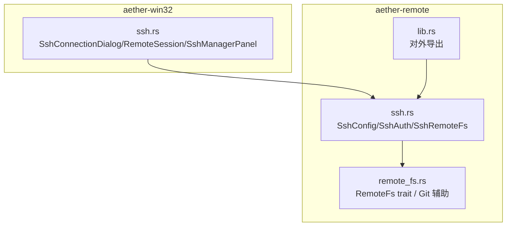
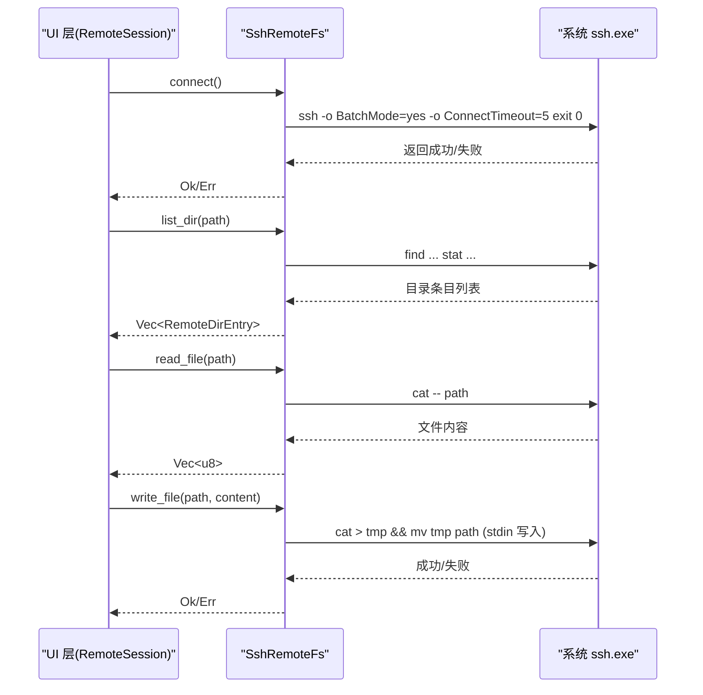
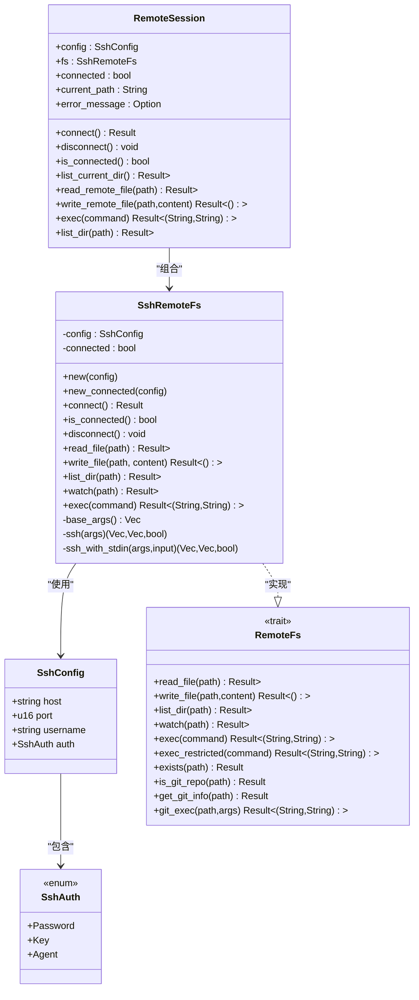
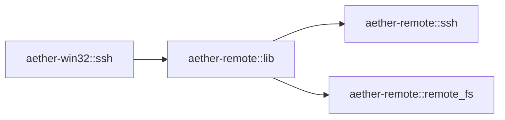

# SSH 连接管理

<cite>
**本文引用的文件**   
- [crates/aether-remote/src/ssh.rs](file://crates/aether-remote/src/ssh.rs)
- [crates/aether-remote/src/remote_fs.rs](file://crates/aether-remote/src/remote_fs.rs)
- [crates/aether-remote/src/lib.rs](file://crates/aether-remote/src/lib.rs)
- [crates/aether-win32/src/ssh.rs](file://crates/aether-win32/src/ssh.rs)
</cite>

## 目录
1. [简介](#简介)
2. [项目结构](#项目结构)
3. [核心组件](#核心组件)
4. [架构总览](#架构总览)
5. [详细组件分析](#详细组件分析)
6. [依赖关系分析](#依赖关系分析)
7. [性能与超时](#性能与超时)
8. [故障排除指南](#故障排除指南)
9. [结论](#结论)
10. [附录：配置示例与安全建议](#附录配置示例与安全建议)

## 简介
本技术文档聚焦于牧羊人编辑器的 SSH 连接管理模块，围绕以下目标展开：
- 解释 SshConfig 配置结构与认证方式（密码、公钥、代理）
- 说明连接池与会话生命周期（当前实现为无持久连接的 shell out 模式）
- 阐述错误处理与异常恢复策略
- 提供配置示例、最佳实践与调优建议
- 给出使用场景与故障排除指引

该模块通过调用系统 OpenSSH 客户端执行远程操作，面向 Windows 开发者，编译期零依赖，运行期依赖系统 ssh。

## 项目结构
SSH 相关代码主要分布在两个 crate：
- aether-remote：提供 SSH 远程文件系统抽象与具体实现（基于系统 ssh 二进制）
- aether-win32：UI 层会话管理与对话框状态，封装底层 SSH 能力

图表来源
- [crates/aether-remote/src/ssh.rs:1-120](file://crates/aether-remote/src/ssh.rs#L1-L120)
- [crates/aether-remote/src/remote_fs.rs:1-60](file://crates/aether-remote/src/remote_fs.rs#L1-L60)
- [crates/aether-remote/src/lib.rs:1-18](file://crates/aether-remote/src/lib.rs#L1-L18)
- [crates/aether-win32/src/ssh.rs:1-120](file://crates/aether-win32/src/ssh.rs#L1-L120)

章节来源
- [crates/aether-remote/src/ssh.rs:1-120](file://crates/aether-remote/src/ssh.rs#L1-L120)
- [crates/aether-remote/src/remote_fs.rs:1-60](file://crates/aether-remote/src/remote_fs.rs#L1-L60)
- [crates/aether-remote/src/lib.rs:1-18](file://crates/aether-remote/src/lib.rs#L1-L18)
- [crates/aether-win32/src/ssh.rs:1-120](file://crates/aether-win32/src/ssh.rs#L1-L120)

## 核心组件
- SshConfig：包含主机名、端口、用户名与认证方式
- SshAuth：认证方式枚举（密码、密钥、Agent）
- SshRemoteFs：基于系统 ssh 的远程文件系统实现，实现 RemoteFs trait
- RemoteSession/UI 面板：在 UI 层维护会话状态、连接与文件树展示

章节来源
- [crates/aether-remote/src/ssh.rs:70-100](file://crates/aether-remote/src/ssh.rs#L70-L100)
- [crates/aether-remote/src/ssh.rs:101-165](file://crates/aether-remote/src/ssh.rs#L101-L165)
- [crates/aether-win32/src/ssh.rs:119-182](file://crates/aether-win32/src/ssh.rs#L119-L182)

## 架构总览
整体采用“进程外调用 + 无持久连接”的轻量架构：每次文件读写或命令执行均独立启动一次 ssh 子进程，避免引入复杂连接池与长连接管理。UI 层负责会话状态与用户交互，底层仅关注安全参数组装与命令执行。

图表来源
- [crates/aether-remote/src/ssh.rs:130-165](file://crates/aether-remote/src/ssh.rs#L130-L165)
- [crates/aether-remote/src/ssh.rs:265-321](file://crates/aether-remote/src/ssh.rs#L265-L321)
- [crates/aether-remote/src/ssh.rs:327-374](file://crates/aether-remote/src/ssh.rs#L327-L374)
- [crates/aether-win32/src/ssh.rs:140-182](file://crates/aether-win32/src/ssh.rs#L140-L182)

## 详细组件分析

### SshConfig 与 SshAuth 配置结构
- SshConfig
  - host：远程主机名或 IP
  - port：SSH 端口（默认 22）
  - username：登录用户名
  - auth：认证方式（SshAuth）
- SshAuth
  - Password：密码认证（shell out 模式下不可用，connect 会拒绝）
  - Key：公钥认证，支持可选 passphrase
  - Agent：使用本地 ssh-agent 进行认证

注意：
- 默认认证方式为 Agent
- 密码认证在 connect 阶段被显式拒绝，避免无 tty 交互导致的阻塞

章节来源
- [crates/aether-remote/src/ssh.rs:70-99](file://crates/aether-remote/src/ssh.rs#L70-L99)
- [crates/aether-remote/src/ssh.rs:42-68](file://crates/aether-remote/src/ssh.rs#L42-L68)
- [crates/aether-remote/src/ssh.rs:130-154](file://crates/aether-remote/src/ssh.rs#L130-L154)

### 身份验证机制
- 密码认证：在 shell out 模式下不支持（无 TTY），connect 直接报错并提示改用密钥或 Agent
- 公钥认证：通过 -i 指定私钥路径；若提供 passphrase，由 ssh 自行处理
- 代理认证：不传 -i，依赖本地 ssh-agent 完成认证

安全加固：
- base_args 中强制设置 StrictHostKeyChecking=accept-new，首次连接自动接受新主机密钥
- 对用户名和主机名前缀做“-”校验，防止选项注入（如 -oProxyCommand=calc.exe）

章节来源
- [crates/aether-remote/src/ssh.rs:166-202](file://crates/aether-remote/src/ssh.rs#L166-L202)
- [crates/aether-remote/src/ssh.rs:130-154](file://crates/aether-remote/src/ssh.rs#L130-L154)

### 连接与会话生命周期
- 连接建立：connect 执行一次轻量测试命令 exit 0，成功后标记 connected=true
- 保持活跃：由于无持久连接，is_connected 仅为软状态标志；实际每次 IO 都会重新发起 ssh 子进程
- 优雅关闭：disconnect 仅重置软状态；无需发送断开信号

设计取舍：
- 无连接池：每次操作独立启动 ssh，避免长连接带来的复杂性
- 后台线程优化：new_connected 可跳过重复探测，但需确保配置已通过 connect 验证

章节来源
- [crates/aether-remote/src/ssh.rs:130-165](file://crates/aether-remote/src/ssh.rs#L130-L165)
- [crates/aether-remote/src/ssh.rs:117-128](file://crates/aether-remote/src/ssh.rs#L117-L128)

### 文件操作与命令执行
- 读取文件：cat -- path（二进制安全）
- 写入文件：原子写入——先写入临时文件再 mv 到目标路径，失败时尝试清理临时文件
- 列出目录：find + stat 一次性获取属性，空目录返回空列表
- 执行命令：exec 将远程 stdout/stderr 转发至本地，带审计日志

安全与健壮性：
- 路径单引号包裹，内部单引号转义，避免注入
- 写入失败时 best-effort 清理临时文件
- exec 记录审计日志

章节来源
- [crates/aether-remote/src/ssh.rs:265-321](file://crates/aether-remote/src/ssh.rs#L265-L321)
- [crates/aether-remote/src/ssh.rs:327-374](file://crates/aether-remote/src/ssh.rs#L327-L374)
- [crates/aether-remote/src/ssh.rs:381-401](file://crates/aether-remote/src/ssh.rs#L381-L401)

### UI 层会话与面板
- RemoteSession：封装 SshRemoteFs，提供 connect/disconnect/is_connected/list/read/write/exec 等便捷方法
- SshConnectionDialog：收集用户输入，生成 SshConfig；默认禁用密码认证
- SshManagerPanel：服务器列表增删改查，表单校验，循环切换认证类型（Agent ↔ Key）

章节来源
- [crates/aether-win32/src/ssh.rs:119-182](file://crates/aether-win32/src/ssh.rs#L119-L182)
- [crates/aether-win32/src/ssh.rs:22-117](file://crates/aether-win32/src/ssh.rs#L22-L117)
- [crates/aether-win32/src/ssh.rs:426-599](file://crates/aether-win32/src/ssh.rs#L426-L599)

### 类图（代码级）

图表来源
- [crates/aether-remote/src/ssh.rs:70-165](file://crates/aether-remote/src/ssh.rs#L70-L165)
- [crates/aether-remote/src/remote_fs.rs:26-186](file://crates/aether-remote/src/remote_fs.rs#L26-L186)
- [crates/aether-win32/src/ssh.rs:119-182](file://crates/aether-win32/src/ssh.rs#L119-L182)

## 依赖关系分析
- aether-remote::ssh 暴露 SshConfig、SshAuth、SshRemoteFs、ssh_available 等对外 API
- aether-remote::remote_fs 定义 RemoteFs trait 及通用工具（Git 辅助、受限命令白名单）
- aether-win32::ssh 依赖 aether-remote 提供的类型，构建 UI 会话与面板

图表来源
- [crates/aether-remote/src/lib.rs:1-18](file://crates/aether-remote/src/lib.rs#L1-L18)
- [crates/aether-win32/src/ssh.rs:1-10](file://crates/aether-win32/src/ssh.rs#L1-L10)

章节来源
- [crates/aether-remote/src/lib.rs:1-18](file://crates/aether-remote/src/lib.rs#L1-L18)
- [crates/aether-win32/src/ssh.rs:1-10](file://crates/aether-win32/src/ssh.rs#L1-L10)

## 性能与超时
- 连接超时：connect 使用 ConnectTimeout=5 秒，避免长时间阻塞
- 批处理模式：BatchMode=yes 禁止交互式提示，保证非阻塞
- 无连接复用：每次操作独立启动 ssh，适合低频访问；高频批量操作建议在上层合并请求或缓存结果
- 原子写入：写文件采用临时文件 + mv，减少断连导致的数据损坏风险
- 目录列举：find + stat 一次性拉取属性，降低往返开销

章节来源
- [crates/aether-remote/src/ssh.rs:130-154](file://crates/aether-remote/src/ssh.rs#L130-L154)
- [crates/aether-remote/src/ssh.rs:285-321](file://crates/aether-remote/src/ssh.rs#L285-L321)
- [crates/aether-remote/src/ssh.rs:327-374](file://crates/aether-remote/src/ssh.rs#L327-L374)

## 故障排除指南
常见问题与定位步骤：
- 未安装 ssh
  - 现象：ssh_available 返回 false
  - 处理：引导用户安装 OpenSSH，参考 SSH_DOWNLOAD_URL
- 密码认证失败
  - 现象：connect 报错提示不支持密码认证
  - 处理：改用密钥或 Agent 认证
- 连接失败
  - 现象：connect 返回错误信息，包含 stderr/stdout
  - 处理：检查网络连通性、端口、用户名与密钥配置
- 目录不存在
  - 现象：list_dir 报目录不存在
  - 处理：确认路径正确，必要时创建目录
- 写入失败
  - 现象：write_file 失败，可能残留临时文件
  - 处理：手动清理临时文件，检查权限与磁盘空间
- 命令执行失败
  - 现象：exec 返回错误输出
  - 处理：查看 stderr 定位原因，确认远程命令可用性与权限

章节来源
- [crates/aether-remote/src/ssh.rs:30-40](file://crates/aether-remote/src/ssh.rs#L30-L40)
- [crates/aether-remote/src/ssh.rs:130-154](file://crates/aether-remote/src/ssh.rs#L130-L154)
- [crates/aether-remote/src/ssh.rs:327-348](file://crates/aether-remote/src/ssh.rs#L327-L348)
- [crates/aether-remote/src/ssh.rs:310-321](file://crates/aether-remote/src/ssh.rs#L310-L321)
- [crates/aether-remote/src/ssh.rs:381-401](file://crates/aether-remote/src/ssh.rs#L381-L401)

## 结论
该 SSH 模块以最小依赖与最简模型实现了可靠的远程文件访问与命令执行能力。通过严格的参数校验、原子写入与受限命令白名单，兼顾了安全性与稳定性。对于需要高并发或低延迟的场景，可在上层引入缓存与批处理策略，或在未来考虑引入真正的 SSH 库以实现连接复用与更细粒度的控制。

## 附录：配置示例与安全建议

### 配置示例（文本描述）
- 使用 Agent 认证
  - host: 远程主机名或 IP
  - port: 22（或自定义端口）
  - username: 登录用户名
  - auth: Agent
- 使用密钥认证
  - host: 远程主机名或 IP
  - port: 22（或自定义端口）
  - username: 登录用户名
  - auth: Key{path: 私钥文件路径, passphrase: 可选}

注意：
- 密码认证在当前实现中不可用，请优先使用 Agent 或密钥认证
- 建议在 UI 层保存服务器配置时禁用密码认证入口，避免误配

### 安全建议
- 始终使用密钥或 Agent 认证，避免明文密码
- 限制 SSH 主机密钥策略：accept-new 仅在受控环境使用，生产环境建议预置 known_hosts
- 严格校验用户名与主机名前缀，防止选项注入
- 使用 exec_restricted 白名单执行受限命令，过滤 shell 元字符
- 定期轮换密钥与口令，妥善保管私钥文件

### 性能调优参数（建议）
- ConnectTimeout：根据网络情况调整，默认 5 秒
- BatchMode：保持启用，避免交互阻塞
- 批量操作：合并多次 IO 请求，减少子进程启动开销
- 目录遍历：按需懒加载，避免一次性加载深层目录

章节来源
- [crates/aether-remote/src/ssh.rs:166-202](file://crates/aether-remote/src/ssh.rs#L166-L202)
- [crates/aether-remote/src/remote_fs.rs:46-94](file://crates/aether-remote/src/remote_fs.rs#L46-L94)
- [crates/aether-win32/src/ssh.rs:80-106](file://crates/aether-win32/src/ssh.rs#L80-L106)
- [crates/aether-win32/src/ssh.rs:532-599](file://crates/aether-win32/src/ssh.rs#L532-L599)