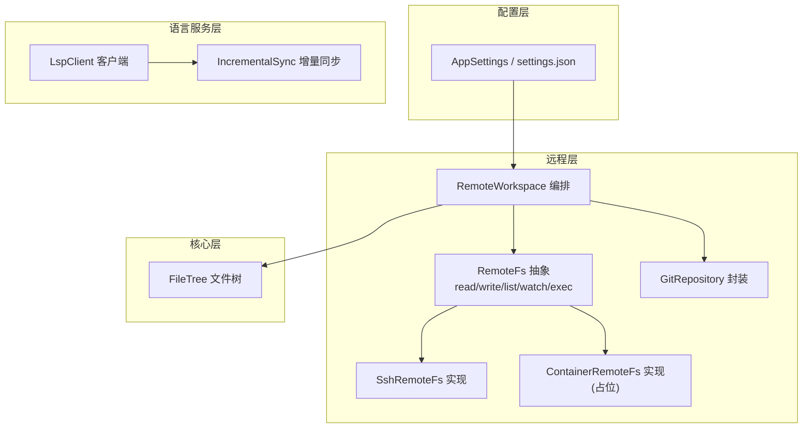
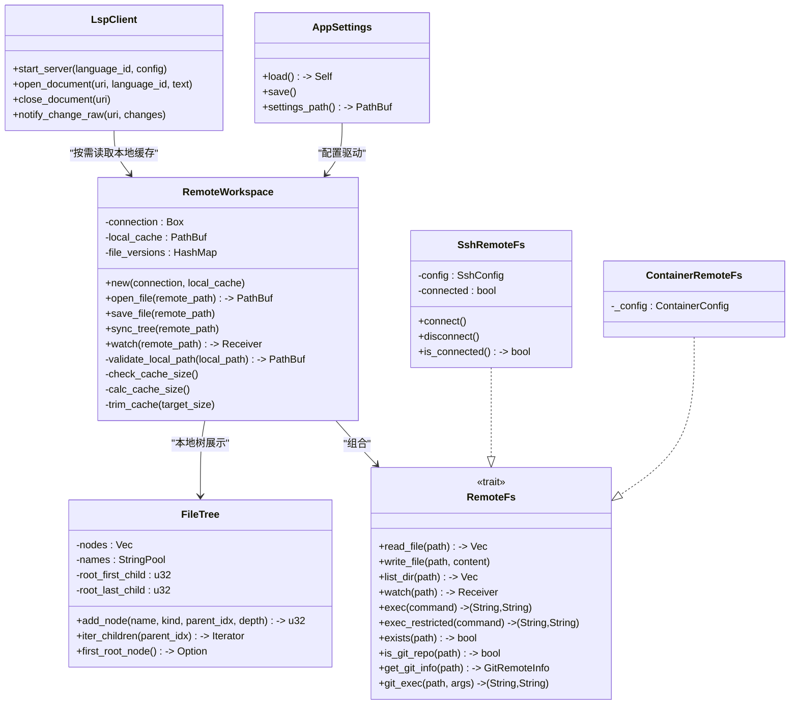
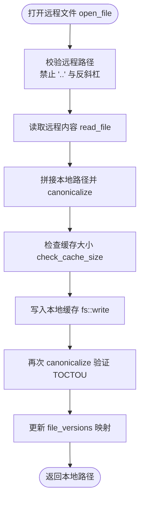
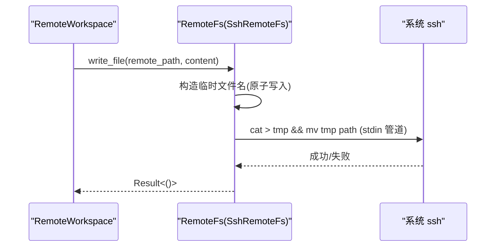
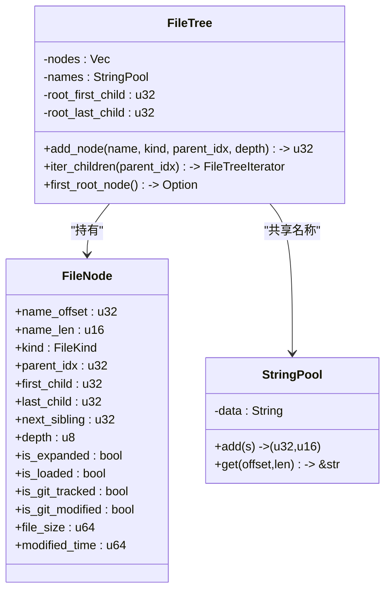
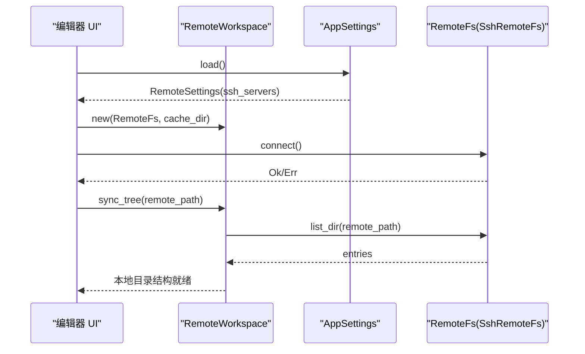
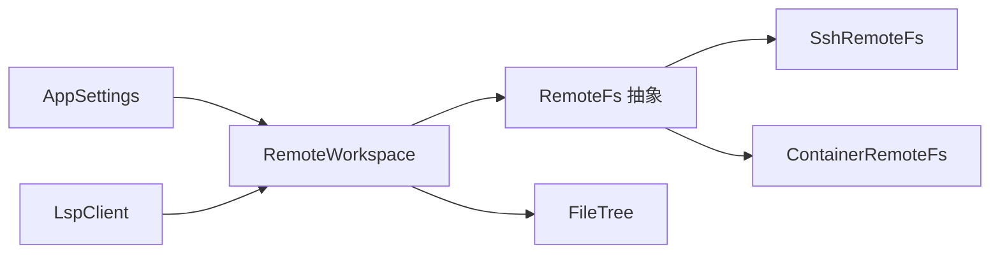

# 工作区管理

<cite>
**本文引用的文件**   
- [crates/aether-remote/src/lib.rs](file://crates/aether-remote/src/lib.rs)
- [crates/aether-remote/src/workspace.rs](file://crates/aether-remote/src/workspace.rs)
- [crates/aether-remote/src/remote_fs.rs](file://crates/aether-remote/src/remote_fs.rs)
- [crates/aether-remote/src/ssh.rs](file://crates/aether-remote/src/ssh.rs)
- [crates/aether-remote/src/container.rs](file://crates/aether-remote/src/container.rs)
- [crates/aether-remote/src/git.rs](file://crates/aether-remote/src/git.rs)
- [crates/aether-core/src/workspace/file_tree.rs](file://crates/aether-core/src/workspace/file_tree.rs)
- [crates/aether-shared/src/settings.rs](file://crates/aether-shared/src/settings.rs)
- [crates/aether-lsp/src/incremental_sync.rs](file://crates/aether-lsp/src/incremental_sync.rs)
- [crates/aether-lsp/src/client.rs](file://crates/aether-lsp/src/client.rs)
</cite>

## 目录
1. [简介](#简介)
2. [项目结构](#项目结构)
3. [核心组件](#核心组件)
4. [架构总览](#架构总览)
5. [详细组件分析](#详细组件分析)
6. [依赖关系分析](#依赖关系分析)
7. [性能考量](#性能考量)
8. [故障排查指南](#故障排查指南)
9. [结论](#结论)
10. [附录：配置示例与最佳实践](#附录配置示例与最佳实践)

## 简介
本技术文档聚焦于牧羊人编辑器的远程工作区管理模块，围绕 RemoteWorkspace 的架构设计、项目结构与文件树构建、依赖关系管理、工作区初始化流程、文件监听机制、工作区配置管理、多语言支持（LSP）、工作区生命周期管理以及共享协作能力进行系统化说明。文档同时提供可视化图表、关键实现路径引用与最佳实践建议，帮助读者快速理解并高效使用远程工作区功能。

## 项目结构
远程工作区相关代码主要分布在 aether-remote 与 aether-core、aether-shared、aether-lsp 等 crate 中：
- aether-remote：远程文件系统抽象与实现（SSH、容器）、远程工作区编排、Git 集成
- aether-core：本地文件树数据结构与遍历
- aether-shared：应用设置持久化（settings.json）与远程服务器配置
- aether-lsp：增量同步与语言服务器客户端

图示来源
- [crates/aether-remote/src/remote_fs.rs:26-186](file://crates/aether-remote/src/remote_fs.rs#L26-L186)
- [crates/aether-remote/src/ssh.rs:101-165](file://crates/aether-remote/src/ssh.rs#L101-L165)
- [crates/aether-remote/src/container.rs:21-38](file://crates/aether-remote/src/container.rs#L21-L38)
- [crates/aether-remote/src/workspace.rs:8-26](file://crates/aether-remote/src/workspace.rs#L8-L26)
- [crates/aether-remote/src/git.rs:115-184](file://crates/aether-remote/src/git.rs#L115-L184)
- [crates/aether-core/src/workspace/file_tree.rs:1-22](file://crates/aether-core/src/workspace/file_tree.rs#L1-L22)
- [crates/aether-shared/src/settings.rs:214-246](file://crates/aether-shared/src/settings.rs#L214-L246)
- [crates/aether-lsp/src/client.rs:87-112](file://crates/aether-lsp/src/client.rs#L87-L112)
- [crates/aether-lsp/src/incremental_sync.rs:192-227](file://crates/aether-lsp/src/incremental_sync.rs#L192-L227)

章节来源
- [crates/aether-remote/src/lib.rs:1-18](file://crates/aether-remote/src/lib.rs#L1-L18)
- [crates/aether-core/src/workspace/mod.rs:1-2](file://crates/aether-core/src/workspace/mod.rs#L1-L2)

## 核心组件
- RemoteWorkspace：远程工作区编排器，负责本地缓存、版本跟踪、安全校验、目录同步与事件转发。
- RemoteFs 抽象与实现：统一 SSH 与容器后端的文件访问接口，包含受限命令执行与 Git 辅助方法。
- SshRemoteFs：基于系统 ssh 的二进制调用实现，提供读写、目录列举与受限 exec。
- ContainerRemoteFs：容器后端占位实现，预留 exec 白名单与审计日志。
- FileTree：紧凑内存布局的文件树，用于本地 UI 展示与懒加载。
- AppSettings：settings.json 解析与持久化，含远程 SSH 服务器配置与安全迁移。
- LspClient 与 IncrementalSync：语言服务器管理与增量变更计算。

章节来源
- [crates/aether-remote/src/workspace.rs:8-26](file://crates/aether-remote/src/workspace.rs#L8-L26)
- [crates/aether-remote/src/remote_fs.rs:26-186](file://crates/aether-remote/src/remote_fs.rs#L26-L186)
- [crates/aether-remote/src/ssh.rs:101-165](file://crates/aether-remote/src/ssh.rs#L101-L165)
- [crates/aether-remote/src/container.rs:21-38](file://crates/aether-remote/src/container.rs#L21-L38)
- [crates/aether-core/src/workspace/file_tree.rs:1-22](file://crates/aether-core/src/workspace/file_tree.rs#L1-L22)
- [crates/aether-shared/src/settings.rs:214-246](file://crates/aether-shared/src/settings.rs#L214-L246)
- [crates/aether-lsp/src/client.rs:87-112](file://crates/aether-lsp/src/client.rs#L87-L112)
- [crates/aether-lsp/src/incremental_sync.rs:192-227](file://crates/aether-lsp/src/incremental_sync.rs#L192-L227)

## 架构总览
远程工作区通过 RemoteFs 抽象屏蔽底层差异（SSH/容器），由 RemoteWorkspace 协调本地缓存与远程数据的一致性；UI 侧使用 FileTree 展示目录结构；配置由 AppSettings 管理；语言服务通过 LspClient 启动并按需增量同步。

图示来源
- [crates/aether-remote/src/workspace.rs:8-26](file://crates/aether-remote/src/workspace.rs#L8-L26)
- [crates/aether-remote/src/remote_fs.rs:26-186](file://crates/aether-remote/src/remote_fs.rs#L26-L186)
- [crates/aether-remote/src/ssh.rs:101-165](file://crates/aether-remote/src/ssh.rs#L101-L165)
- [crates/aether-remote/src/container.rs:21-38](file://crates/aether-remote/src/container.rs#L21-L38)
- [crates/aether-core/src/workspace/file_tree.rs:1-22](file://crates/aether-core/src/workspace/file_tree.rs#L1-L22)
- [crates/aether-shared/src/settings.rs:214-246](file://crates/aether-shared/src/settings.rs#L214-L246)
- [crates/aether-lsp/src/client.rs:87-112](file://crates/aether-lsp/src/client.rs#L87-L112)

## 详细组件分析

### RemoteWorkspace 设计与实现
- 职责
  - 维护本地缓存目录，确保所有写入均在缓存内（防路径遍历）。
  - 打开远程文件时按需下载到本地缓存，保存修改时回写远程。
  - 同步远程目录结构到本地缓存，创建必要目录。
  - 暴露 watch 通道以接收 FsEvent（由后端决定是否支持）。
  - 限制缓存大小，按最旧文件清理至目标阈值。
- 安全要点
  - 打开/保存前对远程路径做“..”和反斜杠检查。
  - 本地路径 canonicalize 后校验仍在缓存根下，并在写入后进行 TOCTOU 二次校验。
  - 目录条目名过滤非法字符，避免注入。
- 缓存策略
  - 最大缓存大小常量控制，超过阈值自动裁剪至目标的 80%。
  - 递归统计目录大小，按修改时间升序删除最旧文件。

图示来源
- [crates/aether-remote/src/workspace.rs:58-100](file://crates/aether-remote/src/workspace.rs#L58-L100)
- [crates/aether-remote/src/workspace.rs:154-206](file://crates/aether-remote/src/workspace.rs#L154-L206)

章节来源
- [crates/aether-remote/src/workspace.rs:28-100](file://crates/aether-remote/src/workspace.rs#L28-L100)
- [crates/aether-remote/src/workspace.rs:125-147](file://crates/aether-remote/src/workspace.rs#L125-L147)
- [crates/aether-remote/src/workspace.rs:154-206](file://crates/aether-remote/src/workspace.rs#L154-L206)
- [crates/aether-remote/src/workspace.rs:228-232](file://crates/aether-remote/src/workspace.rs#L228-L232)

### RemoteFs 抽象与受限命令执行
- 抽象能力
  - 文件读写、目录列举、事件监听、存在性检查、Git 信息获取与受限 git 执行。
- 安全白名单
  - exec_restricted 内置 shell 元字符过滤与最小化命令白名单，记录审计日志。
  - git_exec 对参数进行严格校验，防止标志注入与路径穿越。
- Git 辅助
  - is_git_repo 通过 list_dir 检测 .git 目录。
  - get_git_info 使用受限命令获取远端 URL、当前分支与未提交变更状态。

图示来源
- [crates/aether-remote/src/remote_fs.rs:46-94](file://crates/aether-remote/src/remote_fs.rs#L46-L94)
- [crates/aether-remote/src/remote_fs.rs:162-186](file://crates/aether-remote/src/remote_fs.rs#L162-L186)
- [crates/aether-remote/src/ssh.rs:285-321](file://crates/aether-remote/src/ssh.rs#L285-L321)

章节来源
- [crates/aether-remote/src/remote_fs.rs:26-186](file://crates/aether-remote/src/remote_fs.rs#L26-L186)
- [crates/aether-remote/src/ssh.rs:265-403](file://crates/aether-remote/src/ssh.rs#L265-L403)

### SSH 后端实现要点
- 连接与认证
  - connect 使用 BatchMode=yes 与 ConnectTimeout=5 测试连通性，拒绝密码认证。
  - base_args 组装用户@主机、端口与密钥参数，并对用户名/主机名前缀进行“-”防护。
- 文件操作
  - read_file 使用 cat 二进制安全传输。
  - write_file 采用 stdin 管道 + 同目录临时文件 + mv 原子替换，失败时尝试清理临时文件。
  - list_dir 使用 find + stat 一次性获取属性，兼容空目录。
- 事件监听
  - watch 返回不支持错误（SSH 场景暂不支持）。

章节来源
- [crates/aether-remote/src/ssh.rs:130-165](file://crates/aether-remote/src/ssh.rs#L130-L165)
- [crates/aether-remote/src/ssh.rs:166-203](file://crates/aether-remote/src/ssh.rs#L166-L203)
- [crates/aether-remote/src/ssh.rs:265-379](file://crates/aether-remote/src/ssh.rs#L265-L379)

### 容器后端（占位）
- 仅实现 exec 白名单与审计日志，文件读写与监听尚未实现。
- 容器名校验仅允许字母数字、连字符、下划线与点，防止注入 Docker 标志。

章节来源
- [crates/aether-remote/src/container.rs:40-124](file://crates/aether-remote/src/container.rs#L40-L124)

### 文件树构建（本地展示）
- FileTree 采用紧凑内存布局：扁平节点数组 + 字符串池 + 首尾子节点指针 + 兄弟链表。
- 支持 O(1) 尾插入、懒加载标记（is_loaded）、展开状态（is_expanded）与 Git 状态字段预留。
- 迭代器提供按父节点遍历子节点的能力，便于 UI 增量渲染。

图示来源
- [crates/aether-core/src/workspace/file_tree.rs:1-43](file://crates/aether-core/src/workspace/file_tree.rs#L1-L43)
- [crates/aether-core/src/workspace/file_tree.rs:52-76](file://crates/aether-core/src/workspace/file_tree.rs#L52-L76)
- [crates/aether-core/src/workspace/file_tree.rs:78-158](file://crates/aether-core/src/workspace/file_tree.rs#L78-L158)

章节来源
- [crates/aether-core/src/workspace/file_tree.rs:1-213](file://crates/aether-core/src/workspace/file_tree.rs#L1-L213)

### 工作区初始化流程
- 远程路径验证
  - 解析 URI（支持 ssh://host/path 与 container://name/path）。
  - 校验远程路径不含路径遍历组件。
- 配置文件加载
  - 从 settings.json 加载远程 SSH 服务器配置列表。
  - 加载时自动迁移 password 认证为 agent，保证安全基线。
- 项目模板应用
  - 若仓库为空或首次打开，可结合 Git 克隆与目录同步（由上层 UI 触发）。
- 连接建立
  - 调用后端 connect 测试连通性（SSH），成功后进入可用状态。

图示来源
- [crates/aether-remote/src/workspace.rs:234-251](file://crates/aether-remote/src/workspace.rs#L234-L251)
- [crates/aether-shared/src/settings.rs:240-338](file://crates/aether-shared/src/settings.rs#L240-L338)
- [crates/aether-remote/src/ssh.rs:130-165](file://crates/aether-remote/src/ssh.rs#L130-L165)
- [crates/aether-remote/src/workspace.rs:125-147](file://crates/aether-remote/src/workspace.rs#L125-L147)

章节来源
- [crates/aether-remote/src/workspace.rs:234-251](file://crates/aether-remote/src/workspace.rs#L234-L251)
- [crates/aether-shared/src/settings.rs:240-338](file://crates/aether-shared/src/settings.rs#L240-L338)
- [crates/aether-remote/src/ssh.rs:130-165](file://crates/aether-remote/src/ssh.rs#L130-L165)

### 文件监听机制
- 事件类型
  - Created、Modified、Deleted、Renamed。
- 后端支持情况
  - SSH 后端 watch 返回不支持错误；容器后端同样不支持。
- 工作区转发
  - RemoteWorkspace.watch 直接转发后端 Receiver，上层可据此实现增量刷新。

章节来源
- [crates/aether-remote/src/remote_fs.rs:14-21](file://crates/aether-remote/src/remote_fs.rs#L14-L21)
- [crates/aether-remote/src/ssh.rs:376-379](file://crates/aether-remote/src/ssh.rs#L376-L379)
- [crates/aether-remote/src/container.rs:53-56](file://crates/aether-remote/src/container.rs#L53-L56)
- [crates/aether-remote/src/workspace.rs:228-232](file://crates/aether-remote/src/workspace.rs#L228-L232)

### 工作区配置管理
- settings.json 处理
  - 加载默认值、兼容旧版模型列表、激活模型同步、损坏备份与恢复。
  - API 密钥加密存储（DPAPI），不在 JSON 中明文出现。
- 远程服务器配置
  - 保存 SSH 服务器列表，禁用 password 认证并迁移为 agent。
- 环境变量注入
  - 当前实现未显式注入环境变量；可在 LspClient 启动时扩展 env 字段。

章节来源
- [crates/aether-shared/src/settings.rs:240-338](file://crates/aether-shared/src/settings.rs#L240-L338)
- [crates/aether-shared/src/settings.rs:340-417](file://crates/aether-shared/src/settings.rs#L340-L417)
- [crates/aether-shared/src/settings.rs:175-212](file://crates/aether-shared/src/settings.rs#L175-L212)
- [crates/aether-lsp/src/client.rs:605-638](file://crates/aether-lsp/src/client.rs#L605-L638)

### 多语言支持与工具链管理
- 语言服务器发现
  - default_server_config 根据 language_id 返回默认命令与参数（如 rust-analyzer、pylsp、clangd 等）。
- 增量同步
  - IncrementalChangeCalculator 基于编辑操作生成 TextDocumentContentChangeEvent，减少全文对比。
  - FastLineIndex 提供高效的 UTF-16 位置与字节偏移转换。
- 大文件优化
  - LargeFileSyncStrategy 针对大文件延迟同步与完整内容发送策略。

章节来源
- [crates/aether-lsp/src/client.rs:605-638](file://crates/aether-lsp/src/client.rs#L605-L638)
- [crates/aether-lsp/src/incremental_sync.rs:1-80](file://crates/aether-lsp/src/incremental_sync.rs#L1-L80)
- [crates/aether-lsp/src/incremental_sync.rs:96-190](file://crates/aether-lsp/src/incremental_sync.rs#L96-L190)
- [crates/aether-lsp/src/incremental_sync.rs:307-357](file://crates/aether-lsp/src/incremental_sync.rs#L307-L357)

### 工作区生命周期管理
- 启动
  - 解析 URI、加载配置、建立连接、同步目录结构。
- 停止
  - 断开 SSH 连接（软状态重置），释放本地缓存句柄。
- 重启
  - 重新 connect 并触发一次 sync_tree 刷新。
- 清理
  - 触发 check_cache_size 与 trim_cache，回收旧文件。

章节来源
- [crates/aether-remote/src/ssh.rs:130-165](file://crates/aether-remote/src/ssh.rs#L130-L165)
- [crates/aether-remote/src/workspace.rs:154-206](file://crates/aether-remote/src/workspace.rs#L154-L206)

### 工作区共享与协作
- 权限控制
  - 通过 exec_restricted 白名单与 shell 元字符过滤限制远程命令执行范围。
  - SSH 用户名/主机名前缀校验，防止选项注入。
- 同步策略
  - 本地缓存 + 按需下载 + 原子写入（临时文件+mv）保障一致性。
  - 文件版本映射用于简单去重与增量判断（可扩展为 mtime/etag）。

章节来源
- [crates/aether-remote/src/remote_fs.rs:46-94](file://crates/aether-remote/src/remote_fs.rs#L46-L94)
- [crates/aether-remote/src/ssh.rs:166-203](file://crates/aether-remote/src/ssh.rs#L166-L203)
- [crates/aether-remote/src/workspace.rs:58-100](file://crates/aether-remote/src/workspace.rs#L58-L100)

## 依赖关系分析
- 模块耦合
  - RemoteWorkspace 依赖 RemoteFs 抽象，具体由 SshRemoteFs/ContainerRemoteFs 实现。
  - FileTree 独立于远程层，仅用于本地展示。
  - AppSettings 提供配置，不直接依赖远程实现。
  - LspClient 与 RemoteWorkspace 解耦，通过本地缓存路径访问文件。
- 外部依赖
  - SSH 后端依赖系统 ssh 二进制。
  - Git 封装依赖系统 git 二进制。

图示来源
- [crates/aether-remote/src/workspace.rs:8-26](file://crates/aether-remote/src/workspace.rs#L8-L26)
- [crates/aether-remote/src/remote_fs.rs:26-186](file://crates/aether-remote/src/remote_fs.rs#L26-L186)
- [crates/aether-remote/src/ssh.rs:101-165](file://crates/aether-remote/src/ssh.rs#L101-L165)
- [crates/aether-remote/src/container.rs:21-38](file://crates/aether-remote/src/container.rs#L21-L38)
- [crates/aether-core/src/workspace/file_tree.rs:1-22](file://crates/aether-core/src/workspace/file_tree.rs#L1-L22)
- [crates/aether-shared/src/settings.rs:214-246](file://crates/aether-shared/src/settings.rs#L214-L246)
- [crates/aether-lsp/src/client.rs:87-112](file://crates/aether-lsp/src/client.rs#L87-L112)

章节来源
- [crates/aether-remote/src/lib.rs:1-18](file://crates/aether-remote/src/lib.rs#L1-L18)

## 性能考量
- 本地缓存
  - 限制最大缓存大小，按最旧文件清理，避免无限增长。
  - 写入前检查大小，降低频繁 I/O 开销。
- 目录同步
  - 使用 list_dir 批量获取条目，减少往返次数。
- 增量同步
  - LSP 侧基于编辑历史生成增量变更，避免全文对比。
  - 大文件策略延迟同步与条件全量发送，平衡带宽与响应。

[本节为通用指导，无需特定文件来源]

## 故障排查指南
- SSH 连接失败
  - 确认系统已安装 OpenSSH 且 ssh 在 PATH 中。
  - 检查密钥路径与 Agent 配置，避免密码认证。
- 写入失败
  - 检查远程磁盘空间与权限。
  - 查看临时文件是否残留，必要时手动清理。
- 配置损坏
  - settings.json 解析失败会备份为 .json.corrupt 并回退默认配置。
- 命令被拒绝
  - exec_restricted 白名单限制导致，检查命令是否在允许列表中。

章节来源
- [crates/aether-remote/src/ssh.rs:34-40](file://crates/aether-remote/src/ssh.rs#L34-L40)
- [crates/aether-remote/src/ssh.rs:285-321](file://crates/aether-remote/src/ssh.rs#L285-L321)
- [crates/aether-shared/src/settings.rs:327-338](file://crates/aether-shared/src/settings.rs#L327-L338)
- [crates/aether-remote/src/remote_fs.rs:46-94](file://crates/aether-remote/src/remote_fs.rs#L46-L94)

## 结论
RemoteWorkspace 通过统一的 RemoteFs 抽象与严格的本地缓存策略，实现了跨 SSH/容器的远程工作区管理能力。配合 FileTree 的高效展示、AppSettings 的安全配置与 LSP 的增量同步，整体架构在保证安全性的同时兼顾了性能与可用性。后续可在容器后端完善文件操作与事件监听，进一步增强协作体验。

[本节为总结，无需特定文件来源]

## 附录：配置示例与最佳实践
- settings.json 关键项
  - remote.ssh_servers：保存多个 SSH 服务器配置，auth_type 建议使用 agent 或 key。
  - ui.last_workspace：记录上次打开的工作区路径。
- 远程工作区 URI
  - ssh://user@host/path 或 container://name/path。
- 最佳实践
  - 始终启用 exec_restricted 白名单，避免任意命令执行。
  - 使用原子写入与 TOCTOU 校验，确保写入一致性。
  - 合理设置缓存上限，定期清理旧文件。
  - 为大文件启用延迟同步与合并策略，提升交互流畅度。

章节来源
- [crates/aether-shared/src/settings.rs:175-212](file://crates/aether-shared/src/settings.rs#L175-L212)
- [crates/aether-shared/src/settings.rs:214-246](file://crates/aether-shared/src/settings.rs#L214-L246)
- [crates/aether-remote/src/workspace.rs:234-251](file://crates/aether-remote/src/workspace.rs#L234-L251)
- [crates/aether-remote/src/remote_fs.rs:46-94](file://crates/aether-remote/src/remote_fs.rs#L46-L94)
- [crates/aether-lsp/src/incremental_sync.rs:307-357](file://crates/aether-lsp/src/incremental_sync.rs#L307-L357)