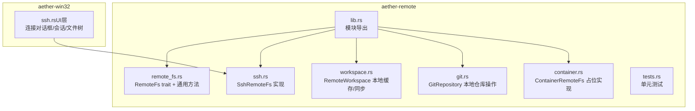
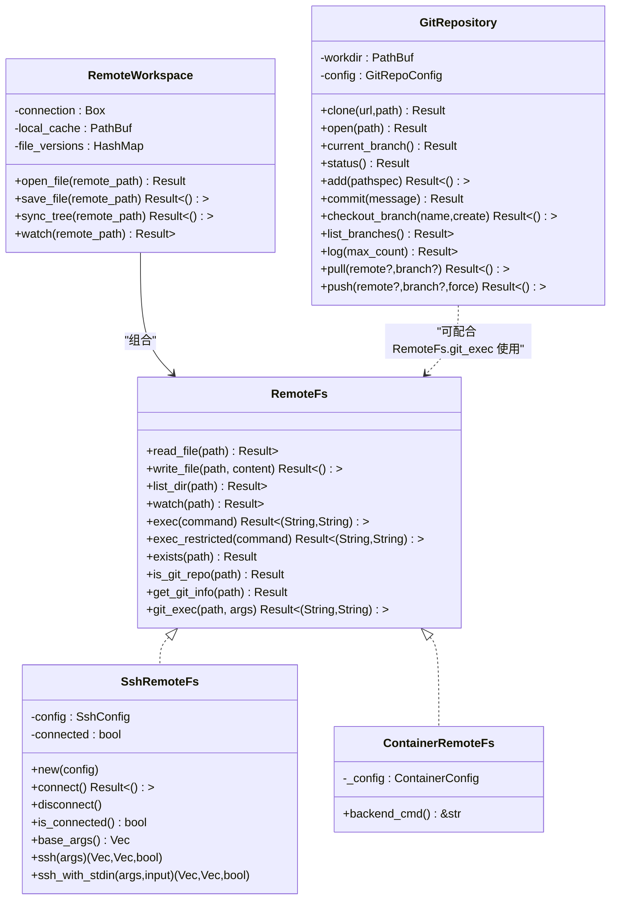
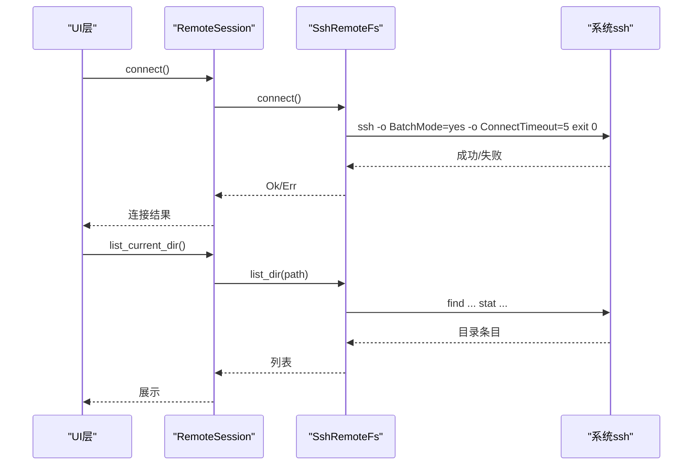
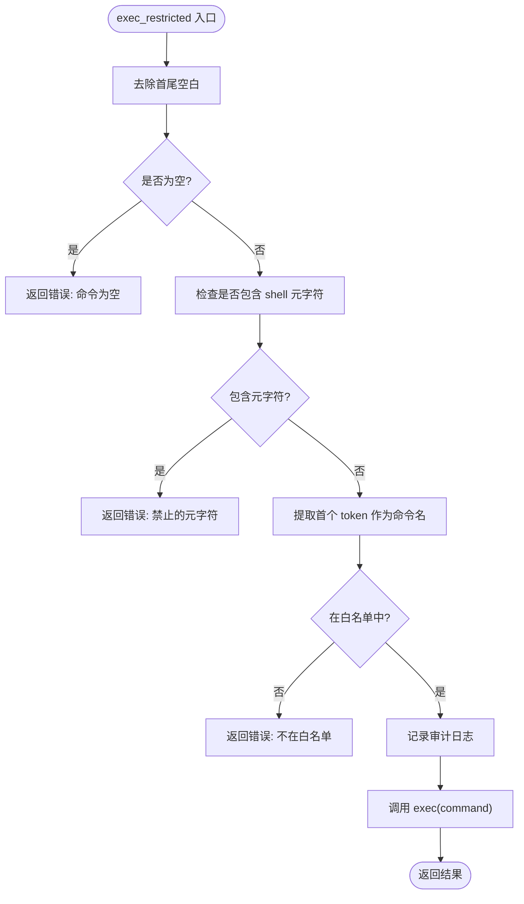
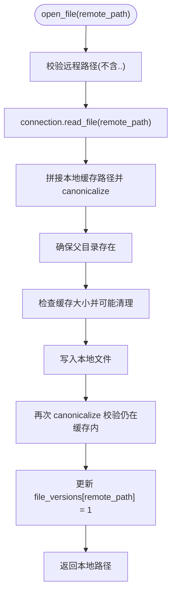
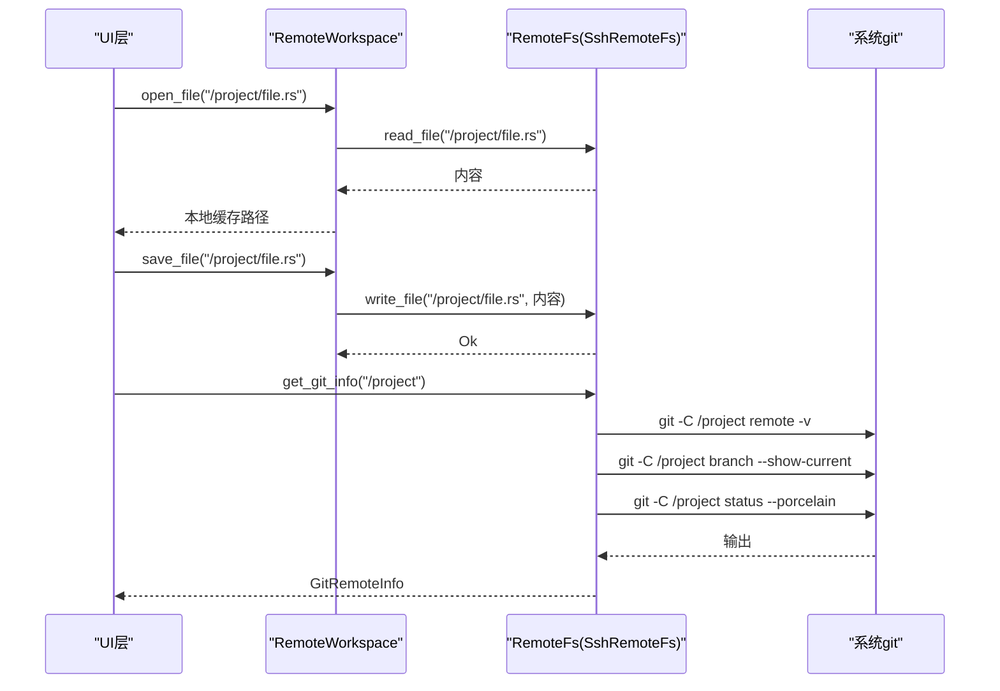
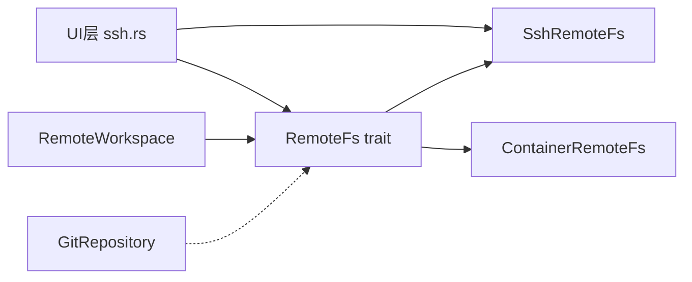

# 远程开发支持

<cite>
**本文引用的文件列表**
- [lib.rs](file://crates/aether-remote/src/lib.rs)
- [ssh.rs](file://crates/aether-remote/src/ssh.rs)
- [remote_fs.rs](file://crates/aether-remote/src/remote_fs.rs)
- [workspace.rs](file://crates/aether-remote/src/workspace.rs)
- [git.rs](file://crates/aether-remote/src/git.rs)
- [container.rs](file://crates/aether-remote/src/container.rs)
- [tests.rs](file://crates/aether-remote/src/tests.rs)
- [ssh.rs（UI层）](file://crates/aether-win32/src/ssh.rs)
- [Cargo.toml（aether-remote）](file://crates/aether-remote/Cargo.toml)
- [README.md](file://README.md)
</cite>

## 目录
1. [简介](#简介)
2. [项目结构](#项目结构)
3. [核心组件](#核心组件)
4. [架构总览](#架构总览)
5. [详细组件分析](#详细组件分析)
6. [依赖关系分析](#依赖关系分析)
7. [性能与优化](#性能与优化)
8. [配置指南](#配置指南)
9. [使用场景与故障排除](#使用场景与故障排除)
10. [结论](#结论)

## 简介
本技术文档聚焦牧羊人编辑器的“远程开发支持”，围绕以下目标展开：
- SSH 连接管理机制：认证、会话状态、命令执行模型
- 远程文件系统抽象层：RemoteFs trait 接口与具体实现（SSH、容器占位）
- Git 集成：本地与远程仓库操作、状态同步
- 工作区管理：远程路径解析、本地缓存、目录同步
- 增量同步机制：文件变更检测、差异计算与网络传输优化（结合 LSP 增量同步能力）
- 完整配置指南：SSH 密钥、代理、性能调优
- 实际使用场景与故障排除

## 项目结构
远程开发相关代码主要位于 aether-remote crate，并在 UI 层提供 SSH 连接对话框与管理面板。

图表来源
- [lib.rs:1-18](file://crates/aether-remote/src/lib.rs#L1-L18)
- [remote_fs.rs:1-268](file://crates/aether-remote/src/remote_fs.rs#L1-L268)
- [ssh.rs:1-403](file://crates/aether-remote/src/ssh.rs#L1-L403)
- [workspace.rs:1-251](file://crates/aether-remote/src/workspace.rs#L1-L251)
- [git.rs:1-531](file://crates/aether-remote/src/git.rs#L1-L531)
- [container.rs:1-130](file://crates/aether-remote/src/container.rs#L1-L130)
- [ssh.rs（UI层）:1-610](file://crates/aether-win32/src/ssh.rs#L1-L610)

章节来源
- [README.md:1-198](file://README.md#L1-L198)
- [Cargo.toml（aether-remote）:1-13](file://crates/aether-remote/Cargo.toml#L1-L13)

## 核心组件
- RemoteFs trait：统一远程文件系统访问接口，包含读/写/列目录/监听/受限命令执行等能力，并提供若干通用安全校验与 Git 辅助方法。
- SshRemoteFs：基于系统 ssh 二进制进行 shell out 调用，实现 RemoteFs；无持久连接，每次操作独立进程。
- ContainerRemoteFs：容器后端占位实现，仅实现 exec 白名单校验与审计日志，其他方法未实现。
- RemoteWorkspace：封装远程连接与本地缓存，负责按需下载、保存回写、目录同步、缓存大小控制与 TOCTOU 防护。
- GitRepository：通过系统 git 二进制完成克隆、提交、分支、拉取/推送、日志等操作，并内置参数与路径安全校验。
- UI 层 SSH 管理：提供连接对话框、会话状态、远程文件树与服务器管理面板。

章节来源
- [remote_fs.rs:26-186](file://crates/aether-remote/src/remote_fs.rs#L26-L186)
- [ssh.rs:101-263](file://crates/aether-remote/src/ssh.rs#L101-L263)
- [container.rs:21-124](file://crates/aether-remote/src/container.rs#L21-L124)
- [workspace.rs:8-232](file://crates/aether-remote/src/workspace.rs#L8-L232)
- [git.rs:115-505](file://crates/aether-remote/src/git.rs#L115-L505)
- [ssh.rs（UI层）:119-182](file://crates/aether-win32/src/ssh.rs#L119-L182)

## 架构总览
整体采用“抽象接口 + 多后端实现”的架构，上层通过 RemoteFs trait 屏蔽底层差异；工作区在本地维护缓存以优化交互体验；Git 操作通过系统 git 二进制完成，避免引入重型库。

图表来源
- [remote_fs.rs:26-186](file://crates/aether-remote/src/remote_fs.rs#L26-L186)
- [ssh.rs:101-263](file://crates/aether-remote/src/ssh.rs#L101-L263)
- [container.rs:21-124](file://crates/aether-remote/src/container.rs#L21-L124)
- [workspace.rs:8-232](file://crates/aether-remote/src/workspace.rs#L8-L232)
- [git.rs:115-505](file://crates/aether-remote/src/git.rs#L115-L505)

## 详细组件分析

### SSH 连接管理与会话
- 设计取舍：面向 Windows 开发者，依赖系统 OpenSSH 客户端，编译期零依赖，运行期通过 shell out 调用 ssh.exe。
- 认证方式：支持 Agent 与密钥认证；密码认证在 shell out 模式下不可用（无 tty），connect 阶段会拒绝。
- 连接模型：无持久连接，每次操作独立启动 ssh 子进程；connected 为软状态标志，用于跳过重复探测。
- 安全加固：
  - base_args 中严格过滤用户名/主机名不以“-”开头，防止注入为 SSH 选项。
  - 写入采用原子替换策略：先写入临时文件再 mv，避免断连导致损坏。
  - 所有 exec 输出均记录审计日志。
- 错误处理：连接失败时返回 stderr/stdout 拼接的错误信息，便于定位。

图表来源
- [ssh.rs:130-164](file://crates/aether-remote/src/ssh.rs#L130-L164)
- [ssh.rs:265-403](file://crates/aether-remote/src/ssh.rs#L265-L403)
- [ssh.rs（UI层）:128-182](file://crates/aether-win32/src/ssh.rs#L128-L182)

章节来源
- [ssh.rs:1-403](file://crates/aether-remote/src/ssh.rs#L1-L403)
- [ssh.rs（UI层）:1-610](file://crates/aether-win32/src/ssh.rs#L1-L610)

### 远程文件系统抽象层（RemoteFs）
- 接口定义：统一 read/write/list/watch/exec 等能力，默认 exec 返回未实现错误，供各后端覆盖。
- 安全与通用方法：
  - exec_restricted：严格的命令白名单 + shell 元字符过滤，防止命令注入。
  - exists/is_git_repo/get_git_info/git_exec：基于 list_dir 与受控 exec 的安全实现。
- 数据模型：RemoteDirEntry、FsEvent、GitRemoteInfo、GitSshRepo。

图表来源
- [remote_fs.rs:46-94](file://crates/aether-remote/src/remote_fs.rs#L46-L94)

章节来源
- [remote_fs.rs:1-268](file://crates/aether-remote/src/remote_fs.rs#L1-L268)

### 工作区管理（RemoteWorkspace）
- 功能要点：
  - open_file：从远程读取文件到本地缓存，创建父目录，更新版本计数。
  - save_file：将本地修改写回远程，递增版本计数。
  - sync_tree：将远程目录结构同步到本地缓存（仅创建目录）。
  - watch：透传到后端（SSH 不支持，返回错误）。
- 安全与健壮性：
  - 路径遍历防护：对远程路径与本地规范路径双重校验，TOCTOU 二次验证。
  - 缓存大小控制：超过阈值自动清理最旧文件至目标的 80%。
- URI 解析：支持 ssh://host/path 与 container://name/path。

图表来源
- [workspace.rs:58-100](file://crates/aether-remote/src/workspace.rs#L58-L100)
- [workspace.rs:154-206](file://crates/aether-remote/src/workspace.rs#L154-L206)

章节来源
- [workspace.rs:1-251](file://crates/aether-remote/src/workspace.rs#L1-L251)

### Git 集成与远程操作
- 本地仓库操作：通过系统 git 二进制完成 clone/open/status/add/commit/checkout/log/push/pull 等。
- 安全校验：
  - 分支名/远程名不得以“-”开头，防止被 git 解析为 flag。
  - pull 默认 --ff-only，非快进合并返回错误，引导手动处理。
- 远程 Git 信息：通过 RemoteFs.get_git_info 获取 remote URL、当前分支、是否有未提交更改。
- GitSshRepo：解析 SSH URL 提取主机与端口，便于后续连接构建。

图表来源
- [workspace.rs:58-123](file://crates/aether-remote/src/workspace.rs#L58-L123)
- [remote_fs.rs:127-186](file://crates/aether-remote/src/remote_fs.rs#L127-L186)
- [git.rs:123-494](file://crates/aether-remote/src/git.rs#L123-L494)

章节来源
- [git.rs:1-531](file://crates/aether-remote/src/git.rs#L1-L531)
- [remote_fs.rs:188-268](file://crates/aether-remote/src/remote_fs.rs#L188-L268)

### 容器后端（占位）
- 当前仅实现 exec 白名单校验与审计日志，其余方法返回未实现错误。
- 容器名校验：仅允许字母数字、连字符、下划线和点，防止注入 Docker/Podman 标志。
- 读写命令分离：只读与写入白名单分别定义，写入操作额外审计。

章节来源
- [container.rs:1-130](file://crates/aether-remote/src/container.rs#L1-L130)

## 依赖关系分析
- aether-remote 内部模块耦合度低，RemoteFs trait 作为稳定边界，SSH/容器实现解耦。
- UI 层通过 aether_remote::ssh 暴露的类型与函数进行连接与会话管理。
- Git 模块独立于 RemoteFs，但可通过 RemoteFs.git_exec 协同使用。

图表来源
- [lib.rs:1-18](file://crates/aether-remote/src/lib.rs#L1-L18)
- [ssh.rs（UI层）:1-610](file://crates/aether-win32/src/ssh.rs#L1-L610)
- [remote_fs.rs:1-268](file://crates/aether-remote/src/remote_fs.rs#L1-L268)
- [workspace.rs:1-251](file://crates/aether-remote/src/workspace.rs#L1-L251)
- [git.rs:1-531](file://crates/aether-remote/src/git.rs#L1-L531)

章节来源
- [lib.rs:1-18](file://crates/aether-remote/src/lib.rs#L1-L18)

## 性能与优化
- SSH 模式：
  - 无持久连接，适合轻量操作；频繁小文件 IO 建议批量或压缩传输。
  - 写入采用原子替换，避免中断导致损坏，但会增加一次 mv 开销。
- 工作区缓存：
  - 最大 500MB，超过阈值按最旧优先清理至 80%，减少磁盘占用。
  - 打开/保存流程包含多次 canonicalize 与安全检查，带来少量 CPU 开销，但提升安全性。
- Git 操作：
  - 使用系统 git，避免加载大型库；status 使用 porcelain v1 -z 格式高效解析。
- LSP 增量同步（参考 aether-lsp）：
  - 大文件策略：超过阈值的文件延迟同步，变更量过大时发送完整内容更高效。
  - 历史裁剪：限制历史记录长度与过期清理，降低内存占用。

章节来源
- [workspace.rs:154-206](file://crates/aether-remote/src/workspace.rs#L154-L206)
- [git.rs:200-257](file://crates/aether-remote/src/git.rs#L200-L257)
- [incremental_sync.rs（LSP）:307-357](file://crates/aether-lsp/src/incremental_sync.rs#L307-L357)

## 配置指南
- SSH 密钥管理：
  - 推荐使用 ssh-agent 或私钥文件认证；密码认证在 shell out 模式下不可用。
  - 若使用私钥，请确保路径正确且权限合理；可在 ~/.ssh/config 中配置别名与端口。
- 代理设置：
  - 通过系统 ssh 的 ProxyCommand 或环境变量配置代理；确保代理可达且凭据有效。
- 性能调优：
  - 调整 SSH 超时与批处理模式已在实现中启用；如需更细粒度控制，可在 base_args 扩展参数。
  - 合理设置工作区缓存上限与清理比例，避免磁盘膨胀。
- Git 环境：
  - 确保系统已安装 git 且在 PATH 中；首次使用可通过 git_available 检测并引导安装。

章节来源
- [ssh.rs:30-40](file://crates/aether-remote/src/ssh.rs#L30-L40)
- [ssh.rs:166-202](file://crates/aether-remote/src/ssh.rs#L166-L202)
- [git.rs:15-25](file://crates/aether-remote/src/git.rs#L15-L25)

## 使用场景与故障排除
- 典型场景：
  - 远程浏览与编辑：通过 RemoteWorkspace.open_file/save_file 实现按需下载与回写。
  - 远程 Git 操作：使用 RemoteFs.get_git_info 获取远程仓库信息，结合 GitRepository 进行本地仓库管理。
  - 容器内开发：ContainerRemoteFs 预留 exec 通道，后续可扩展文件操作。
- 常见问题：
  - 连接失败：检查 ssh 可用性与网络连通；确认用户名/主机名不以“-”开头；查看 stderr/stdout 错误信息。
  - 写入失败：确认远程路径同目录可写；临时文件清理逻辑会尽力删除残留。
  - 路径遍历报错：检查远程路径是否包含“..”或非法字符；本地规范路径校验失败将被拒绝。
  - Git 操作失败：确认仓库存在 .git；分支名/远程名合法；非快进合并需手动处理。
- 调试建议：
  - 启用 exec 审计日志，观察命令执行上下文。
  - 使用 tests.rs 中的用例思路构造最小复现，逐步隔离问题。

章节来源
- [ssh.rs:130-164](file://crates/aether-remote/src/ssh.rs#L130-L164)
- [ssh.rs:285-321](file://crates/aether-remote/src/ssh.rs#L285-L321)
- [workspace.rs:28-56](file://crates/aether-remote/src/workspace.rs#L28-L56)
- [git.rs:148-184](file://crates/aether-remote/src/git.rs#L148-L184)
- [tests.rs:300-400](file://crates/aether-remote/src/tests.rs#L300-L400)

## 结论
本项目通过清晰的抽象与安全的实现，提供了可靠的远程开发基础能力：
- RemoteFs trait 统一了不同后端的访问方式，SSH 与容器后端解耦清晰。
- SshRemoteFs 以 shell out 模式实现，兼顾零依赖与易用性，同时强化安全校验与审计。
- RemoteWorkspace 提供本地缓存与目录同步，显著提升交互体验。
- Git 集成通过系统 git 完成，具备完善的参数与路径校验，保障稳定性。
- 增量同步能力在 LSP 层已有良好实践，可为远程文件编辑提供更高效的同步策略。

未来可考虑：
- 引入持久化 SSH 连接池以减少进程开销。
- 完善容器后端的文件操作实现。
- 扩展远程文件监听与事件驱动同步。