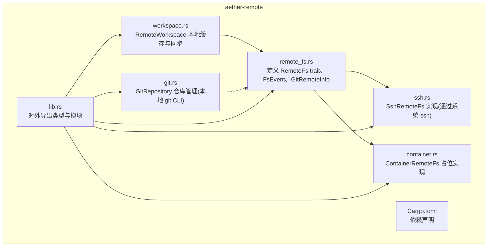
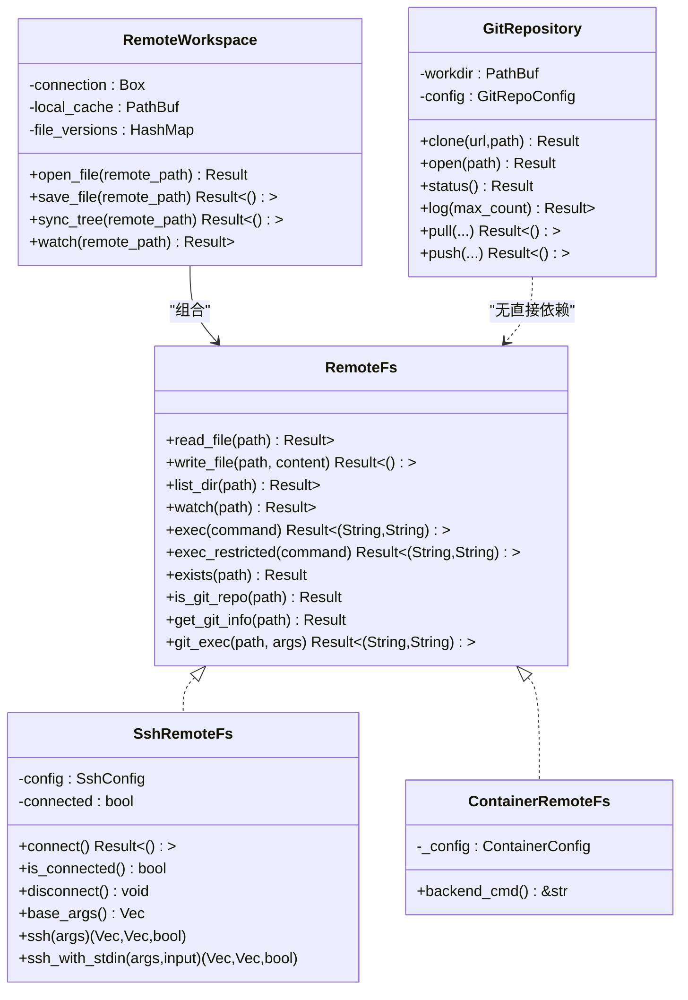
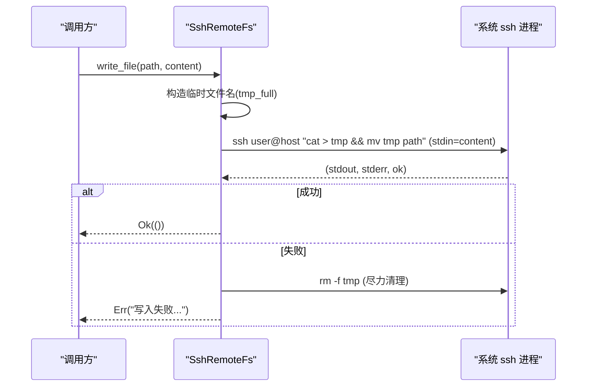
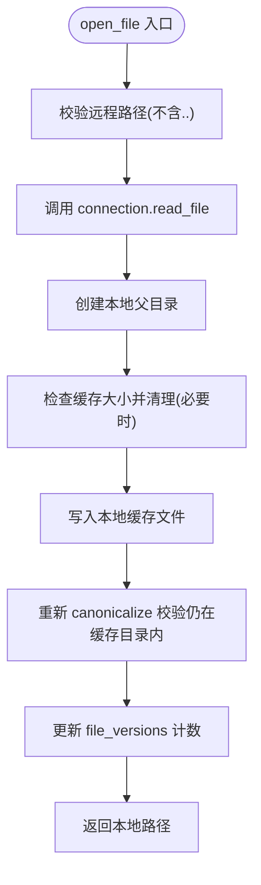
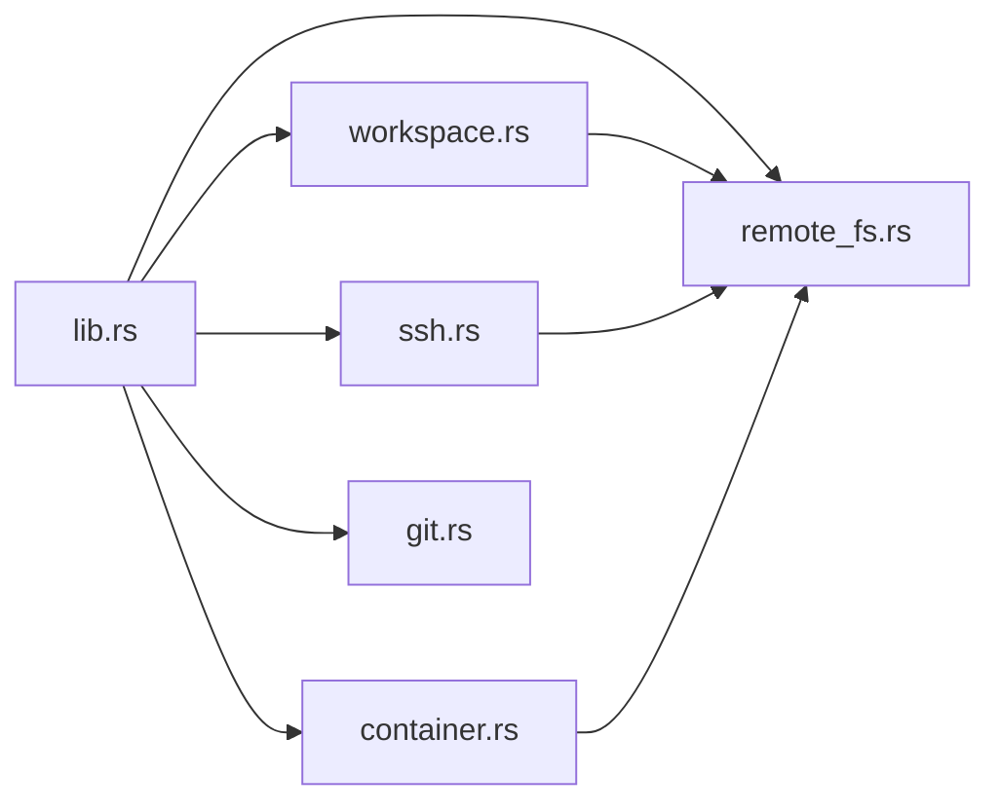

# 远程文件系统

<cite>
**本文引用的文件**
- [remote_fs.rs](file://crates/aether-remote/src/remote_fs.rs)
- [ssh.rs](file://crates/aether-remote/src/ssh.rs)
- [container.rs](file://crates/aether-remote/src/container.rs)
- [workspace.rs](file://crates/aether-remote/src/workspace.rs)
- [git.rs](file://crates/aether-remote/src/git.rs)
- [lib.rs](file://crates/aether-remote/src/lib.rs)
- [Cargo.toml](file://crates/aether-remote/Cargo.toml)
- [tests.rs](file://crates/aether-remote/src/tests.rs)
</cite>

## 目录
1. [简介](#简介)
2. [项目结构](#项目结构)
3. [核心组件](#核心组件)
4. [架构总览](#架构总览)
5. [详细组件分析](#详细组件分析)
6. [依赖关系分析](#依赖关系分析)
7. [性能与优化](#性能与优化)
8. [故障排查指南](#故障排查指南)
9. [结论](#结论)
10. [附录：扩展新后端开发指南](#附录扩展新后端开发指南)

## 简介
本技术文档聚焦牧羊人编辑器的“远程文件系统抽象层”，围绕 RemoteFs trait 接口设计、SshRemoteFs 实现原理、增量同步机制、事件系统、缓存策略，以及扩展新后端的开发指南展开。目标是帮助读者理解并安全高效地接入多种远程环境（SSH、容器等），并在编辑器中提供一致的文件访问体验。

## 项目结构
aether-remote crate 提供了统一的远程文件系统抽象与若干具体后端实现，并通过 workspace 模块提供本地缓存与基础同步能力。

图表来源
- [remote_fs.rs:1-268](file://crates/aether-remote/src/remote_fs.rs#L1-L268)
- [ssh.rs:1-403](file://crates/aether-remote/src/ssh.rs#L1-L403)
- [container.rs:1-130](file://crates/aether-remote/src/container.rs#L1-L130)
- [workspace.rs:1-251](file://crates/aether-remote/src/workspace.rs#L1-L251)
- [git.rs:1-531](file://crates/aether-remote/src/git.rs#L1-L531)
- [lib.rs:1-18](file://crates/aether-remote/src/lib.rs#L1-L18)
- [Cargo.toml:1-13](file://crates/aether-remote/Cargo.toml#L1-L13)

章节来源
- [lib.rs:1-18](file://crates/aether-remote/src/lib.rs#L1-L18)
- [Cargo.toml:1-13](file://crates/aether-remote/Cargo.toml#L1-L13)

## 核心组件
- RemoteFs trait：统一文件读取、写入、目录遍历、命令执行、监听变更的接口，并提供安全的受限命令执行默认实现。
- SshRemoteFs：基于系统 OpenSSH 客户端的 SSH 后端，支持密钥认证，原子写入、批量目录扫描等。
- ContainerRemoteFs：容器后端占位实现，包含 exec 白名单与安全校验。
- RemoteWorkspace：封装 RemoteFs 连接，提供本地缓存、路径校验、目录同步、容量清理等。
- GitRepository：基于系统 git 的二进制封装，提供克隆、状态、提交历史、分支操作等。

章节来源
- [remote_fs.rs:26-216](file://crates/aether-remote/src/remote_fs.rs#L26-L216)
- [ssh.rs:101-403](file://crates/aether-remote/src/ssh.rs#L101-L403)
- [container.rs:21-124](file://crates/aether-remote/src/container.rs#L21-L124)
- [workspace.rs:8-232](file://crates/aether-remote/src/workspace.rs#L8-L232)
- [git.rs:115-531](file://crates/aether-remote/src/git.rs#L115-L531)

## 架构总览
RemoteFs 作为抽象层，屏蔽底层差异；SshRemoteFs 和 ContainerRemoteFs 分别实现不同传输协议；RemoteWorkspace 在调用方与后端之间提供本地缓存与一致性保障；GitRepository 独立于 RemoteFs，面向本地工作区进行版本控制交互。

图表来源
- [remote_fs.rs:26-216](file://crates/aether-remote/src/remote_fs.rs#L26-L216)
- [ssh.rs:101-403](file://crates/aether-remote/src/ssh.rs#L101-L403)
- [container.rs:21-124](file://crates/aether-remote/src/container.rs#L21-L124)
- [workspace.rs:8-232](file://crates/aether-remote/src/workspace.rs#L8-L232)
- [git.rs:115-531](file://crates/aether-remote/src/git.rs#L115-L531)

## 详细组件分析

### RemoteFs trait 接口设计
- 文件操作
  - read_file/write_file：二进制安全读写，错误以字符串形式返回便于上层处理。
  - list_dir：返回 RemoteDirEntry 列表，包含名称、是否目录、大小、修改时间。
- 目录遍历与存在性检查
  - exists：优先使用 list_dir 判断目录，若失败则尝试父目录枚举匹配文件名，避免读取整个文件。
  - is_git_repo：通过检查 .git 目录是否存在判定是否为 Git 仓库。
- 事件监听
  - watch：返回 mpsc::Receiver<FsEvent>，由后端决定是否支持。
- 命令执行与安全
  - exec：默认未实现，要求后端覆盖以便审计与限制。
  - exec_restricted：内置严格白名单与 shell 元字符过滤，防止注入；记录审计日志。
- Git 集成
  - get_git_info：通过受限命令获取远端 URL、当前分支、是否有未提交更改。
  - git_exec：对参数进行严格校验，禁止以 '-' 开头、路径遍历等危险模式。

章节来源
- [remote_fs.rs:26-216](file://crates/aether-remote/src/remote_fs.rs#L26-L216)

### SshRemoteFs 工作原理
- 连接与认证
  - connect：使用 BatchMode=yes 与 ConnectTimeout 测试连通性；不支持密码认证（shell out 无 TTY）。
  - base_args：组装 ssh 参数，包括 StrictHostKeyChecking=accept-new、端口、私钥路径、目标主机。
  - 用户名/主机名校验：拒绝以 '-' 开头的值，防止被解释为配置选项。
- 网络传输协议
  - 通过系统 ssh 二进制执行远程命令；读文件使用 cat，写文件通过 stdin 管道写入临时文件再原子 mv。
  - 目录列举使用 find + stat 一次性获取属性，减少往返。
- 原子写入与并发安全
  - write_file：生成唯一临时文件名（进程ID+纳秒时间戳+原子计数器），确保同纳秒内多次写入不碰撞；失败时尽力清理临时文件。
- 事件监听
  - watch：SSH 后端不支持，返回错误。
- 命令执行
  - exec：记录审计日志，转发 stdout/stderr。

图表来源
- [ssh.rs:285-321](file://crates/aether-remote/src/ssh.rs#L285-L321)

章节来源
- [ssh.rs:101-403](file://crates/aether-remote/src/ssh.rs#L101-L403)

### 容器后端 ContainerRemoteFs
- 仅实现 exec 方法，包含严格的 shell 元字符过滤与命令白名单（区分只读与写入）；容器名合法性校验。
- 文件操作与 watch 尚未实现，返回错误。

章节来源
- [container.rs:21-124](file://crates/aether-remote/src/container.rs#L21-L124)

### RemoteWorkspace 本地缓存与同步
- 打开与保存
  - open_file：从远程读取内容到本地缓存，创建必要目录，更新版本计数。
  - save_file：将本地缓存内容写回远程，递增版本计数。
- 目录同步
  - sync_tree：根据远程目录条目在本地创建对应目录结构，跳过非法名称（含路径遍历或斜杠）。
- 路径安全
  - validate_local_path：规范化路径并校验位于缓存目录内，防范路径遍历。
  - TOCTOU 防护：写入后再次 canonicalize 验证，若越界则删除越界文件并报错。
- 容量管理
  - check_cache_size/calc_cache_size/trim_cache：超过阈值时按最旧文件清理至目标比例。
- 事件监听
  - watch：透传到后端，由后端决定是否支持。

图表来源
- [workspace.rs:58-100](file://crates/aether-remote/src/workspace.rs#L58-L100)

章节来源
- [workspace.rs:8-232](file://crates/aether-remote/src/workspace.rs#L8-L232)

### GitRepository 仓库管理
- 通过系统 git 二进制完成克隆、打开、状态查询、提交历史、分支切换、拉取与推送等操作。
- 关键安全措施：
  - 参数校验：防止 remote/branch 名称以 '-' 开头被解析为 flag。
  - 状态解析：使用 porcelain v1 -z 格式，正确识别冲突、暂存与非跟踪文件。
  - 日志解析：自定义分隔符与字段顺序，兼容空仓库场景。

章节来源
- [git.rs:115-531](file://crates/aether-remote/src/git.rs#L115-L531)

## 依赖关系分析
- 模块间依赖
  - lib.rs 导出所有公共类型与模块。
  - workspace 依赖 remote_fs trait。
  - ssh 与 container 均实现 remote_fs trait。
  - git 独立于 remote_fs，主要与本地 git CLI 交互。
- 外部依赖
  - serde/serde_json：序列化/反序列化。
  - shell-escape：辅助转义（尽管当前实现多采用单引号包裹与白名单校验）。

图表来源
- [lib.rs:1-18](file://crates/aether-remote/src/lib.rs#L1-L18)
- [Cargo.toml:1-13](file://crates/aether-remote/Cargo.toml#L1-L13)

章节来源
- [lib.rs:1-18](file://crates/aether-remote/src/lib.rs#L1-L18)
- [Cargo.toml:1-13](file://crates/aether-remote/Cargo.toml#L1-L13)

## 性能与优化
- SSH 后端
  - 目录列举：使用 find + stat 一次性获取属性，减少多次往返。
  - 原子写入：临时文件 + mv 保证幂等与一致性，避免断连导致损坏。
  - 进程复用：当前实现每次操作独立调用 ssh 进程，无持久连接；如需更高吞吐可考虑引入持久通道或 SFTP 库。
- 缓存策略
  - 本地缓存上限与自动清理，避免磁盘无限增长。
  - 版本计数用于简单变更追踪，可扩展为基于 mtime 或哈希的差异检测。
- Git 操作
  - 使用 porcelain 与固定分隔符解析，提升稳定性与性能。
  - 分支/拉取/推送参数严格校验，降低误用风险。

[本节为通用指导，无需源码引用]

## 故障排查指南
- SSH 连接问题
  - 现象：connect 失败或 read/write/list/exec 报“未连接”。
  - 排查：确认已调用 connect；检查密钥配置与 known_hosts；确认非密码认证模式。
- 写入失败
  - 现象：write_file 返回错误。
  - 排查：查看 stderr/stdout；确认远程权限；检查临时文件清理逻辑。
- 目录为空或不存在的错误
  - 现象：list_dir 返回错误或空结果。
  - 排查：确认路径存在；空目录 find 无输出但退出码为 0，需区分处理。
- 容器命令被拒绝
  - 现象：exec 报“不在白名单”或“包含禁止的 shell 元字符”。
  - 排查：调整命令为白名单允许项；避免任何元字符。
- 路径遍历与 TOCTOU
  - 现象：open_file/save_file 报路径超出缓存目录。
  - 排查：检查远程路径是否包含 '..' 或 Windows 反斜杠；确认符号链接替换攻击。

章节来源
- [ssh.rs:130-164](file://crates/aether-remote/src/ssh.rs#L130-L164)
- [ssh.rs:285-321](file://crates/aether-remote/src/ssh.rs#L285-L321)
- [ssh.rs:327-374](file://crates/aether-remote/src/ssh.rs#L327-L374)
- [container.rs:58-124](file://crates/aether-remote/src/container.rs#L58-L124)
- [workspace.rs:28-94](file://crates/aether-remote/src/workspace.rs#L28-L94)

## 结论
RemoteFs trait 提供了统一且安全的远程文件访问抽象；SshRemoteFs 通过系统 OpenSSH 实现了稳定可靠的 SSH 后端；RemoteWorkspace 在易用性与安全性之间取得平衡，提供本地缓存与基础同步；GitRepository 为本地工作区提供完整的版本控制能力。整体设计强调安全（白名单、元字符过滤、路径规范）、稳健（原子写入、TOCTOU 防护）与可扩展（trait 抽象、多后端）。

[本节为总结，无需源码引用]

## 附录：扩展新后端开发指南
- 实现要求
  - 实现 RemoteFs trait 的所有必需方法：read_file、write_file、list_dir、watch、exec。
  - 若需要受限命令执行，请覆盖 exec_restricted 或遵循其默认白名单与元字符过滤策略。
  - 对于 Git 相关功能，建议复用 RemoteFs 提供的 get_git_info 与 git_exec 默认实现，并确保 exec_restricted 行为符合预期。
- 安全注意事项
  - 对用户输入进行严格校验，拒绝路径遍历与危险字符。
  - 对命令执行实施白名单与最小权限原则。
  - 对本地缓存路径进行规范化与边界检查，防范 TOCTOU。
- 性能考虑
  - 尽量批量操作以减少网络往返（如一次性列出目录、合并写入）。
  - 使用原子写入避免中断导致的数据不一致。
  - 合理设置超时与重试策略，提升鲁棒性。
- 事件监听
  - 若后端支持文件系统事件，实现 watch 返回 Receiver<FsEvent>；否则返回错误明确说明不支持。
- 示例参考
  - 参考 SshRemoteFs 与 ContainerRemoteFs 的实现方式，结合各自传输协议特性进行适配。

章节来源
- [remote_fs.rs:26-216](file://crates/aether-remote/src/remote_fs.rs#L26-L216)
- [ssh.rs:101-403](file://crates/aether-remote/src/ssh.rs#L101-L403)
- [container.rs:21-124](file://crates/aether-remote/src/container.rs#L21-L124)
- [workspace.rs:8-232](file://crates/aether-remote/src/workspace.rs#L8-L232)