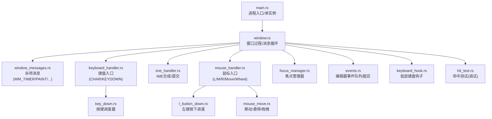
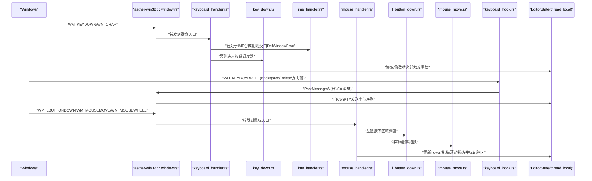
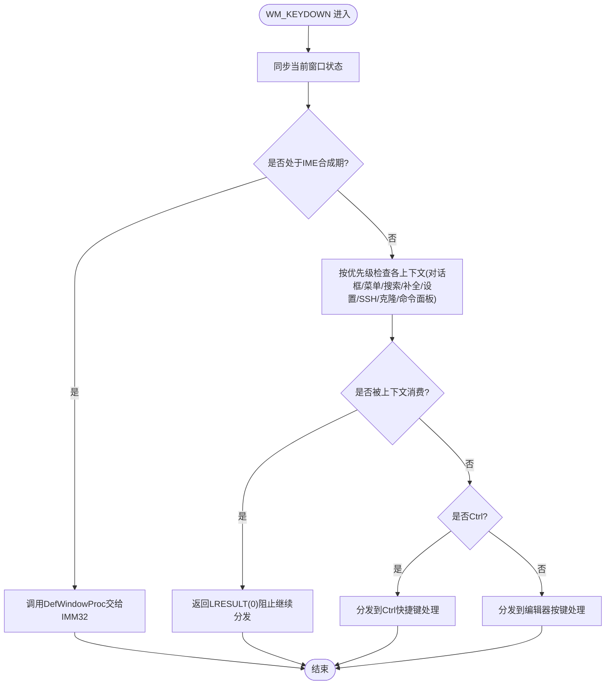
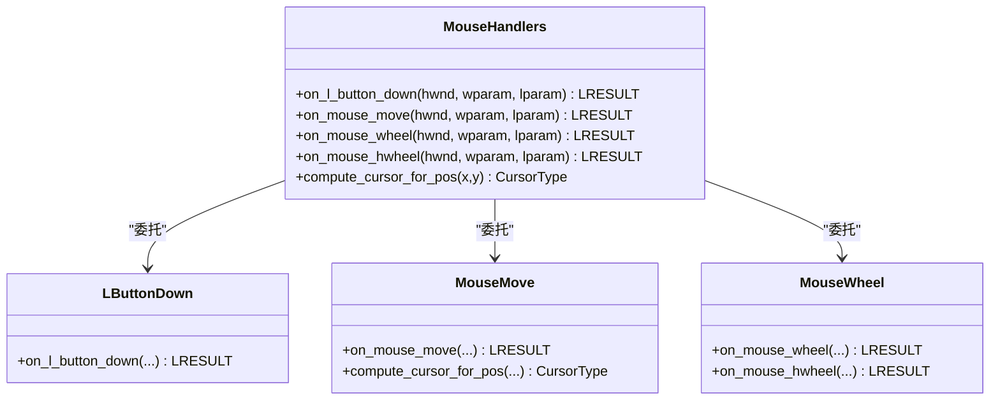
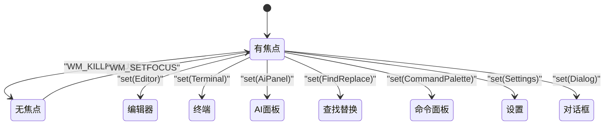
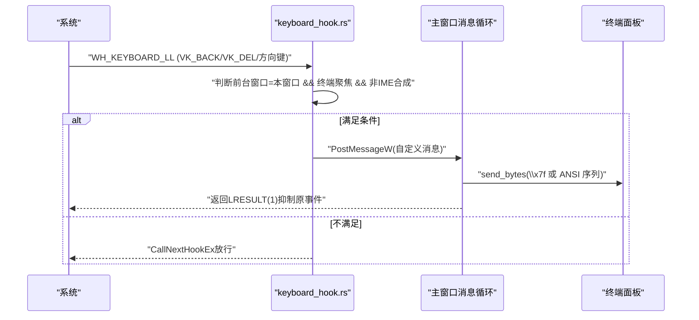
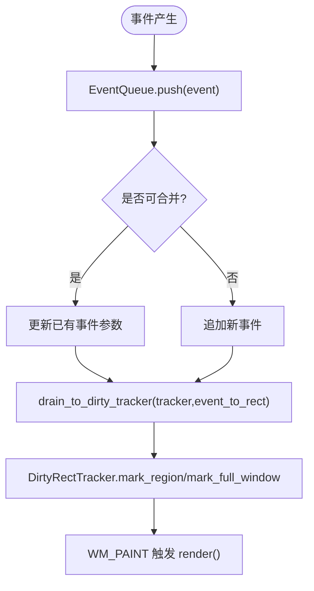
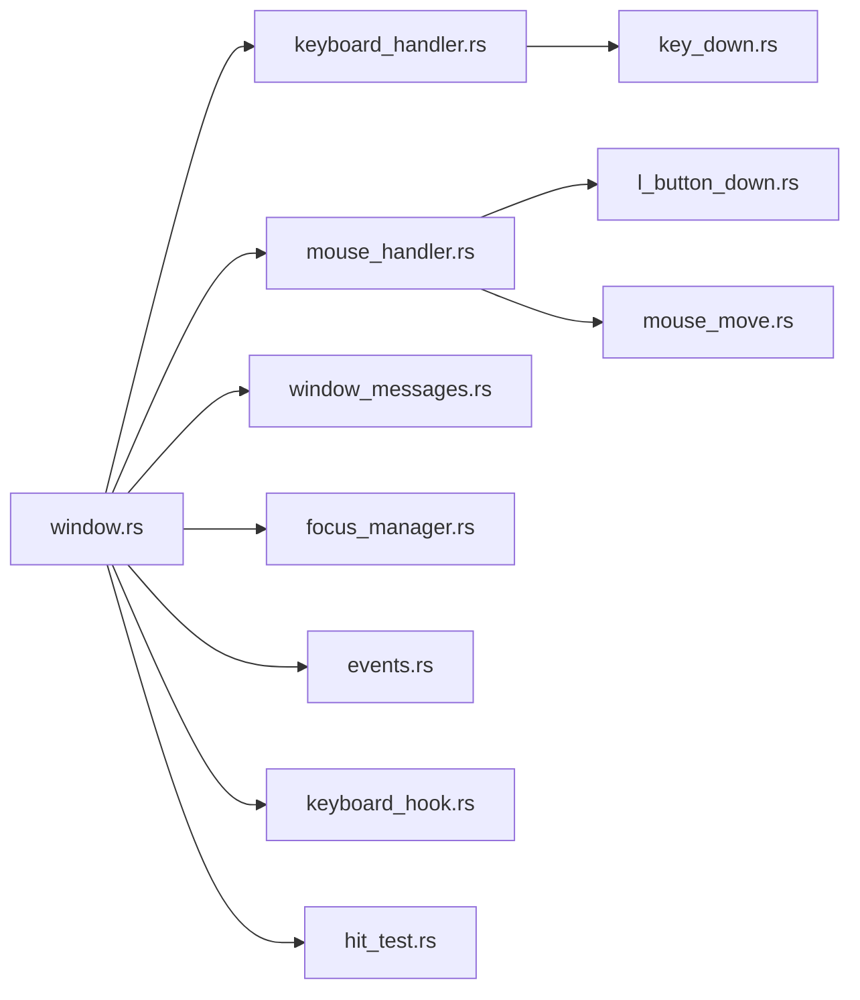

# UI 事件系统

<cite>
**本文引用的文件**   
- [main.rs](file://crates/aether-win32/src/main.rs)
- [window.rs](file://crates/aether-win32/src/window.rs)
- [window_messages.rs](file://crates/aether-win32/src/window/window_messages.rs)
- [keyboard_handler.rs](file://crates/aether-win32/src/window/keyboard_handler.rs)
- [key_down.rs](file://crates/aether-win32/src/window/keyboard_handler/key_down.rs)
- [ime_handler.rs](file://crates/aether-win32/src/window/ime_handler.rs)
- [mouse_handler.rs](file://crates/aether-win32/src/window/mouse_handler.rs)
- [l_button_down.rs](file://crates/aether-win32/src/window/mouse_handler/l_button_down.rs)
- [mouse_move.rs](file://crates/aether-win32/src/window/mouse_handler/mouse_move.rs)
- [focus_manager.rs](file://crates/aether-win32/src/focus_manager.rs)
- [input.rs](file://crates/aether-win32/src/input.rs)
- [events.rs](file://crates/aether-win32/src/events.rs)
- [keyboard_hook.rs](file://crates/aether-win32/src/keyboard_hook.rs)
- [hit_test.rs](file://crates/aether-win32/src/hit_test.rs)
</cite>

## 目录
1. [引言](#引言)
2. [项目结构](#项目结构)
3. [核心组件](#核心组件)
4. [架构总览](#架构总览)
5. [详细组件分析](#详细组件分析)
6. [依赖关系分析](#依赖关系分析)
7. [性能考量](#性能考量)
8. [故障排查指南](#故障排查指南)
9. [结论](#结论)
10. [附录](#附录)

## 引言
本文件面向牧羊人编辑器的 UI 事件系统，系统性阐述 Win32 消息循环、窗口消息分发与处理流程；深入解析键盘事件链（含输入法 IME、快捷键绑定与组合键）、鼠标交互（点击、拖拽、滚轮）；说明输入焦点管理、事件冒泡与阻止传播机制；并提供自定义控件的事件处理指南与性能优化建议。文档以源码为依据，结合时序图、类图和流程图帮助读者快速理解并扩展该子系统。

## 项目结构
UI 事件系统位于 aether-win32 模块中，围绕“窗口过程 + 子模块处理器”的组织方式展开：
- 主入口与消息循环：main.rs 负责单实例控制与启动；window.rs 注册窗口类、创建窗口、运行消息循环。
- 消息分发：window.rs 将 WM_* 路由到 window_messages.rs 与各 handler 子模块。
- 键盘与 IME：keyboard_handler.rs 聚合 WM_CHAR/WM_KEYDOWN；ime_handler.rs 处理合成串与提交。
- 鼠标：mouse_handler.rs 聚合左/中/右键与移动、滚轮；具体区域逻辑拆分到 l_button_down.rs、mouse_move.rs 等。
- 焦点与事件总线：focus_manager.rs 维护焦点目标与历史栈；events.rs 提供编辑器级事件队列与脏区映射。
- 低层钩子：keyboard_hook.rs 通过 WH_KEYBOARD_LL 拦截特定按键直达终端。
- 命中测试：hit_test.rs 在调试构建下记录可点击区域，辅助自动化测试。

图表来源
- [main.rs:1-52](file://crates/aether-win32/src/main.rs#L1-L52)
- [window.rs:114-173](file://crates/aether-win32/src/window.rs#L114-L173)
- [window_messages.rs:19-40](file://crates/aether-win32/src/window/window_messages.rs#L19-L40)
- [keyboard_handler.rs:1-13](file://crates/aether-win32/src/window/keyboard_handler.rs#L1-L13)
- [key_down.rs:17-117](file://crates/aether-win32/src/window/keyboard_handler/key_down.rs#L17-L117)
- [ime_handler.rs:9-132](file://crates/aether-win32/src/window/ime_handler.rs#L9-L132)
- [mouse_handler.rs:1-277](file://crates/aether-win32/src/window/mouse_handler.rs#L1-L277)
- [l_button_down.rs:17-101](file://crates/aether-win32/src/window/mouse_handler/l_button_down.rs#L17-L101)
- [mouse_move.rs:20-78](file://crates/aether-win32/src/window/mouse_handler/mouse_move.rs#L20-L78)
- [focus_manager.rs:40-122](file://crates/aether-win32/src/focus_manager.rs#L40-L122)
- [events.rs:1-186](file://crates/aether-win32/src/events.rs#L1-L186)
- [keyboard_hook.rs:56-122](file://crates/aether-win32/src/keyboard_hook.rs#L56-L122)
- [hit_test.rs:1-179](file://crates/aether-win32/src/hit_test.rs#L1-L179)

章节来源
- [main.rs:1-52](file://crates/aether-win32/src/main.rs#L1-L52)
- [window.rs:114-173](file://crates/aether-win32/src/window.rs#L114-L173)

## 核心组件
- 窗口过程与消息循环
  - 注册窗口类、创建窗口、进入 GetMessageW/TranslateMessage/DispatchMessageW 循环。
  - 使用 thread_local 保存当前窗口的 EditorState 引用，供各消息处理器访问。
- 消息分发
  - 通用消息（定时器、绘制、尺寸变化、DPI 变更、焦点、光标等）集中在 window_messages.rs。
  - 键盘/鼠标/IME 分别由对应子模块统一入口函数进行优先级调度。
- 键盘事件链
  - WM_CHAR：字符输入（含多字节代理对拼接）。
  - WM_KEYDOWN：按键调度器按上下文（对话框、搜索面板、补全、设置、SSH/克隆对话框、命令面板等）优先处理，再分派 Ctrl 与非 Ctrl 分支。
  - IME：WM_IME_STARTCOMPOSITION/COMPOSITION/ENDCOMPOSITION/CHAR 协同，区分合成串与结果串，避免重复插入。
- 鼠标事件链
  - 左键按下：按区域优先级依次尝试（对话框、标题栏、活动栏、侧边栏、标签栏、右侧/底部面板、欢迎页/编辑器内容等），支持长按检测与自定义排序拖拽。
  - 移动：更新各区域 hover 状态、tooltip 延迟显示、拖拽调整面板大小、标签拖拽重排。
  - 滚轮：Shift+滚轮横向滚动、标签栏横向滚动、底部终端滚动、侧边栏滚动、默认垂直滚动。
- 焦点管理
  - FocusManager 维护当前焦点目标与历史栈，窗口获得/失去焦点时同步状态，支持回退。
- 事件总线与脏区
  - EventQueue 收集一帧内事件，合并同类事件，映射为 DirtyRegionType，驱动局部或全窗口重绘。
- 低层键盘钩子
  - WH_KEYBOARD_LL 全局钩子，仅在前台为本窗口且终端聚焦且非 IME 合成期时，拦截 Backspace/Delete/方向键，投递自定义消息至主线程写入 ConPTY。

章节来源
- [window.rs:57-110](file://crates/aether-win32/src/window.rs#L57-L110)
- [window_messages.rs:19-40](file://crates/aether-win32/src/window/window_messages.rs#L19-L40)
- [keyboard_handler.rs:1-13](file://crates/aether-win32/src/window/keyboard_handler.rs#L1-L13)
- [key_down.rs:17-117](file://crates/aether-win32/src/window/keyboard_handler/key_down.rs#L17-L117)
- [ime_handler.rs:9-132](file://crates/aether-win32/src/window/ime_handler.rs#L9-L132)
- [mouse_handler.rs:1-277](file://crates/aether-win32/src/window/mouse_handler.rs#L1-L277)
- [l_button_down.rs:17-101](file://crates/aether-win32/src/window/mouse_handler/l_button_down.rs#L17-L101)
- [mouse_move.rs:20-78](file://crates/aether-win32/src/window/mouse_handler/mouse_move.rs#L20-L78)
- [focus_manager.rs:40-122](file://crates/aether-win32/src/focus_manager.rs#L40-L122)
- [events.rs:1-186](file://crates/aether-win32/src/events.rs#L1-L186)
- [keyboard_hook.rs:56-122](file://crates/aether-win32/src/keyboard_hook.rs#L56-L122)

## 架构总览
下图展示从 Windows 消息到应用内部处理的端到端路径，包括键盘、鼠标、IME 与低层钩子的协作。

图表来源
- [window.rs:114-173](file://crates/aether-win32/src/window.rs#L114-L173)
- [keyboard_handler.rs:1-13](file://crates/aether-win32/src/window/keyboard_handler.rs#L1-L13)
- [key_down.rs:17-117](file://crates/aether-win32/src/window/keyboard_handler/key_down.rs#L17-L117)
- [ime_handler.rs:9-132](file://crates/aether-win32/src/window/ime_handler.rs#L9-L132)
- [mouse_handler.rs:1-277](file://crates/aether-win32/src/window/mouse_handler.rs#L1-L277)
- [l_button_down.rs:17-101](file://crates/aether-win32/src/window/mouse_handler/l_button_down.rs#L17-L101)
- [mouse_move.rs:20-78](file://crates/aether-win32/src/window/mouse_handler/mouse_move.rs#L20-L78)
- [keyboard_hook.rs:56-122](file://crates/aether-win32/src/keyboard_hook.rs#L56-L122)

## 详细组件分析

### 键盘事件处理链（含 IME、快捷键、组合键）
- 入口与优先级
  - keyboard_handler.rs 暴露 on_char/on_key_down。on_key_down 先同步当前窗口状态，再按上下文优先级检查（文件树输入框、各类上下文菜单、搜索面板、欢迎页、补全弹窗、设置字段、SSH/克隆对话框、命令面板等），最后分派 Ctrl 与非 Ctrl 分支。
- IME 支持
  - ime_handler.rs 处理 WM_IME_STARTCOMPOSITION/COMPOSITION/ENDCOMPOSITION/CHAR。
  - COMPOSITION 中优先处理 GCS_RESULTSTR（已提交文本），再处理 GCS_COMPSTR（预编辑文本），并在合成期通过 keyboard_hook 的 IME_COMPOSING_FLAG 告知底层钩子放行相关按键。
- 快捷键与组合键
  - input.rs 定义 Key/KeyBinding/KeyMap，包含常用 Ctrl/Shift/Alt 组合到 EditorAction 的映射，便于后续接入用户自定义快捷键。
  - key_down_ctrl.rs（由 keyboard_handler 引入）用于 Ctrl 分支的快速匹配与动作派发。
- 阻止传播与冒泡
  - 当某上下文（如对话框、搜索面板、补全弹窗）消费了按键，直接返回 LRESULT(0)，阻止继续向下分发；未匹配的键则返回 None 让上层继续尝试。

图表来源
- [keyboard_handler.rs:1-13](file://crates/aether-win32/src/window/keyboard_handler.rs#L1-L13)
- [key_down.rs:17-117](file://crates/aether-win32/src/window/keyboard_handler/key_down.rs#L17-L117)
- [ime_handler.rs:9-132](file://crates/aether-win32/src/window/ime_handler.rs#L9-L132)
- [input.rs:119-244](file://crates/aether-win32/src/input.rs#L119-L244)

章节来源
- [keyboard_handler.rs:1-13](file://crates/aether-win32/src/window/keyboard_handler.rs#L1-L13)
- [key_down.rs:17-117](file://crates/aether-win32/src/window/keyboard_handler/key_down.rs#L17-L117)
- [ime_handler.rs:9-132](file://crates/aether-win32/src/window/ime_handler.rs#L9-L132)
- [input.rs:119-244](file://crates/aether-win32/src/input.rs#L119-L244)

### 鼠标事件处理机制（点击、拖拽、滚轮）
- 左键按下
  - l_button_down.rs 作为调度器，按区域优先级依次尝试：对话框、标题栏、用户菜单、资源管理器空白区域上下文菜单、活动栏上下文菜单、标签上下文菜单、子菜单、活动栏、面板拖拽、侧边栏、右侧面板、标签栏、查找面板、底部面板、设置面板、欢迎页/编辑器内容。
  - 支持长按检测（LP_TIMER_ID）与自定义模式拖拽（活动栏/菜单栏排序）。
- 移动与悬停
  - mouse_move.rs 更新各区域 hover 状态、tooltip 延迟显示（500ms 延迟、4px 容差）、拖拽调整面板大小、标签拖拽重排。
  - compute_cursor_for_pos 根据位置计算光标类型（Arrow/IBeam/Hand/SizeWE/SizeNS）。
- 滚轮
  - mouse_handler.rs 实现 WM_MOUSEWHEEL/WM_MOUSEHWHEEL：Shift+滚轮横向滚动、标签栏横向滚动、底部终端滚动、侧边栏滚动、默认垂直滚动。

图表来源
- [mouse_handler.rs:1-277](file://crates/aether-win32/src/window/mouse_handler.rs#L1-L277)
- [l_button_down.rs:17-101](file://crates/aether-win32/src/window/mouse_handler/l_button_down.rs#L17-L101)
- [mouse_move.rs:20-78](file://crates/aether-win32/src/window/mouse_handler/mouse_move.rs#L20-L78)

章节来源
- [mouse_handler.rs:1-277](file://crates/aether-win32/src/window/mouse_handler.rs#L1-L277)
- [l_button_down.rs:17-101](file://crates/aether-win32/src/window/mouse_handler/l_button_down.rs#L17-L101)
- [mouse_move.rs:20-78](file://crates/aether-win32/src/window/mouse_handler/mouse_move.rs#L20-L78)

### 输入焦点管理与事件冒泡/阻止传播
- 焦点目标
  - focus_manager.rs 定义 FocusTarget（编辑器、终端、AI 面板、查找替换、命令面板、设置、对话框、无焦点），维护 current/history/window_focused。
- 窗口级焦点同步
  - window_messages.rs 的 on_set_focus/on_kill_focus 调用 FocusManager 同步窗口焦点状态；失焦时触发自动保存。
- 冒泡与阻止
  - 键盘/鼠标处理采用“上下文优先”的分发策略：若某上下文（对话框、搜索面板、补全弹窗等）消费了事件，立即返回 LRESULT(0) 阻止继续分发；否则返回 None 让上层继续尝试。

图表来源
- [focus_manager.rs:40-122](file://crates/aether-win32/src/focus_manager.rs#L40-L122)
- [window_messages.rs:516-564](file://crates/aether-win32/src/window/window_messages.rs#L516-L564)

章节来源
- [focus_manager.rs:40-122](file://crates/aether-win32/src/focus_manager.rs#L40-L122)
- [window_messages.rs:516-564](file://crates/aether-win32/src/window/window_messages.rs#L516-L564)

### 低层键盘钩子与终端直通
- 安装与卸载
  - keyboard_hook.rs 使用 SetWindowsHookExW(WH_KEYBOARD_LL) 安装全局钩子，仅在后台窗口为本窗口时生效；UnhookWindowsHookEx 卸载。
- 过滤条件
  - 仅处理 VK_BACK/VK_DELETE/VK_UP/DOWN/LEFT/RIGHT；忽略注入按键；仅在 TERMINAL_FOCUSED_FLAG=true 且 IME_COMPOSING_FLAG=false 时拦截。
- 路由到终端
  - 拦截后 PostMessageW 到主窗口自定义消息，主线程将 ANSI 转义序列或 \x7f 写入 ConPTY。

图表来源
- [keyboard_hook.rs:56-122](file://crates/aether-win32/src/keyboard_hook.rs#L56-L122)
- [keyboard_hook.rs:151-245](file://crates/aether-win32/src/keyboard_hook.rs#L151-L245)
- [keyboard_hook.rs:256-315](file://crates/aether-win32/src/keyboard_hook.rs#L256-L315)

章节来源
- [keyboard_hook.rs:56-122](file://crates/aether-win32/src/keyboard_hook.rs#L56-L122)
- [keyboard_hook.rs:151-245](file://crates/aether-win32/src/keyboard_hook.rs#L151-L245)
- [keyboard_hook.rs:256-315](file://crates/aether-win32/src/keyboard_hook.rs#L256-L315)

### 渲染与脏区联动（事件→重绘）
- 事件入队与合并
  - events.rs 的 EventQueue 收集一帧内事件，合并连续滚动/光标移动/选择变化/文本变化行范围，全窗口事件会清空局部事件。
- 脏区映射
  - EditorEvent.region_type() 映射到 DirtyRegionType；drain_to_dirty_tracker 将事件转换为矩形并标记。
- 统一渲染
  - window_messages.rs 的 on_paint 强制在无脏区时标记全窗口，避免重影；render 包裹 catch_unwind 防止 D2D 设备丢失导致 panic。

图表来源
- [events.rs:76-186](file://crates/aether-win32/src/events.rs#L76-L186)
- [window_messages.rs:478-514](file://crates/aether-win32/src/window/window_messages.rs#L478-L514)

章节来源
- [events.rs:76-186](file://crates/aether-win32/src/events.rs#L76-L186)
- [window_messages.rs:478-514](file://crates/aether-win32/src/window/window_messages.rs#L478-L514)

### 自定义控件的事件处理指南
- 新增键盘上下文
  - 在 key_down.rs 的 on_key_down 中添加新的 okd_xxx 函数，按优先级尽早返回 LRESULT(0) 消费按键；必要时在 Ctrl 分支或编辑器分支中补充处理。
- 新增鼠标区域
  - 在 l_button_down.rs 的调度器中增加新的 lbd_xxx 函数，按区域优先级尝试；在 mouse_move.rs 中更新 hover/拖拽状态；在 mouse_handler.rs 中处理滚轮行为。
- 焦点与 IME
  - 若控件需要独立焦点，更新 FocusManager 的 FocusTarget 或在相应消息中调用 push/pop；IME 合成期间确保将按键交由 DefWindowProc。
- 事件与脏区
  - 通过 invalidate_window 触发 WM_PAINT；如需细粒度重绘，使用 dirty tracker 的 mark_region 并结合 EditorEvent 的 region_type。

章节来源
- [key_down.rs:17-117](file://crates/aether-win32/src/window/keyboard_handler/key_down.rs#L17-L117)
- [l_button_down.rs:17-101](file://crates/aether-win32/src/window/mouse_handler/l_button_down.rs#L17-L101)
- [mouse_move.rs:20-78](file://crates/aether-win32/src/window/mouse_handler/mouse_move.rs#L20-L78)
- [focus_manager.rs:40-122](file://crates/aether-win32/src/focus_manager.rs#L40-L122)
- [window.rs:66-75](file://crates/aether-win32/src/window.rs#L66-L75)

## 依赖关系分析
- 耦合与内聚
  - window.rs 作为中心枢纽，内聚窗口生命周期与消息循环；各 handler 子模块高内聚各自职责，通过显式导入降低耦合。
- 外部依赖
  - windows crate 提供 Win32 API；aether-shared/settings 用于持久化窗口状态；aether-lsp 异步事件通过自定义消息投递到 UI 线程。
- 潜在循环
  - 通过 thread_local 共享 EditorState，避免跨模块直接持有引用导致的循环依赖。

图表来源
- [window.rs:13-30](file://crates/aether-win32/src/window.rs#L13-L30)
- [keyboard_handler.rs:1-13](file://crates/aether-win32/src/window/keyboard_handler.rs#L1-L13)
- [mouse_handler.rs:1-16](file://crates/aether-win32/src/window/mouse_handler.rs#L1-L16)
- [window_messages.rs:1-18](file://crates/aether-win32/src/window/window_messages.rs#L1-L18)

章节来源
- [window.rs:13-30](file://crates/aether-win32/src/window.rs#L13-L30)
- [keyboard_handler.rs:1-13](file://crates/aether-win32/src/window/keyboard_handler.rs#L1-L13)
- [mouse_handler.rs:1-16](file://crates/aether-win32/src/window/mouse_handler.rs#L1-L16)
- [window_messages.rs:1-18](file://crates/aether-win32/src/window/window_messages.rs#L1-L18)

## 性能考量
- 事件合并与脏区
  - EventQueue 合并连续事件，减少无效重绘；drain_to_dirty_tracker 精确标记脏区，避免全窗口刷新。
- 统一渲染
  - 通过 invalidate_window 触发 WM_PAINT，Windows 自动合并多次失效，避免双重渲染；on_paint 强制全窗口重绘以防重影。
- DPI 与资源重建
  - DPI 变化时重建渲染目标与缓存，保证一致性；按需重启定时器（如终端刷新）避免空转。
- 低层钩子开销
  - 仅在前台为本窗口且必要条件下拦截，其他情况直接 CallNextHookEx，最小化钩子成本。
- 调试命中测试
  - hit_test.rs 在 debug 构建下记录可点击区域，release 构建零开销。

[本节为通用指导，无需列出具体文件来源]

## 故障排查指南
- 中文输入无法删除终端内容
  - 确认 keyboard_hook.rs 已安装且 TERMINAL_FOCUSED_FLAG=true；检查 IME_COMPOSING_FLAG 是否在合成期被置位；查看自定义消息是否到达主线程。
- 双击选词无效
  - 确认窗口类启用 CS_DBLCLKS；检查 on_l_button_dblclk 的区域判定与 DPI 缩放转换。
- 滚轮方向异常
  - 检查 Shift 状态获取与 ScreenToClient 坐标转换；确认 delta 符号与 char_width 换算。
- 焦点切换后快捷键误响应
  - 检查 FocusManager.current() 与上下文优先级；确认对话框/搜索面板等是否提前消费了按键。
- 渲染重影或崩溃
  - 查看 on_paint 的 catch_unwind 日志；确认 dirty tracker 是否正确标记全窗口；检查 DPI 变更后资源重建。

章节来源
- [keyboard_hook.rs:151-245](file://crates/aether-win32/src/keyboard_hook.rs#L151-L245)
- [mouse_handler.rs:113-152](file://crates/aether-win32/src/window/mouse_handler.rs#L113-L152)
- [mouse_handler.rs:154-277](file://crates/aether-win32/src/window/mouse_handler.rs#L154-L277)
- [focus_manager.rs:40-122](file://crates/aether-win32/src/focus_manager.rs#L40-L122)
- [window_messages.rs:478-514](file://crates/aether-win32/src/window/window_messages.rs#L478-L514)

## 结论
本事件系统以“窗口过程为中心、子模块处理器为边界”的架构实现了健壮的 Win32 消息分发与处理。通过上下文优先的键盘/鼠标调度、IME 深度集成、低层钩子直通终端、以及事件合并与脏区驱动的渲染，系统在功能完整性与性能之间取得良好平衡。扩展自定义控件时，遵循“优先级调度 + 明确消费/放行 + 精准脏区标记”的原则即可无缝融入现有体系。

[本节为总结性内容，无需列出具体文件来源]

## 附录
- 关键常量与定时器
  - LP_TIMER_ID/HOVER_TIMER_ID/TERM_TIMER_ID/CARET_TIMER_ID 等用于长按、悬停提示、终端刷新与光标闪烁。
- 快捷键架构
  - input.rs 的 KeyMap 预留用户自定义能力，当前硬编码于窗口层，未来可迁移至配置驱动。
- 命中测试输出
  - debug 构建下生成 tests/gui_hit_regions.jsonl，便于自动化验证可点击区域。

章节来源
- [window.rs:36-54](file://crates/aether-win32/src/window.rs#L36-L54)
- [input.rs:119-244](file://crates/aether-win32/src/input.rs#L119-L244)
- [hit_test.rs:84-142](file://crates/aether-win32/src/hit_test.rs#L84-L142)