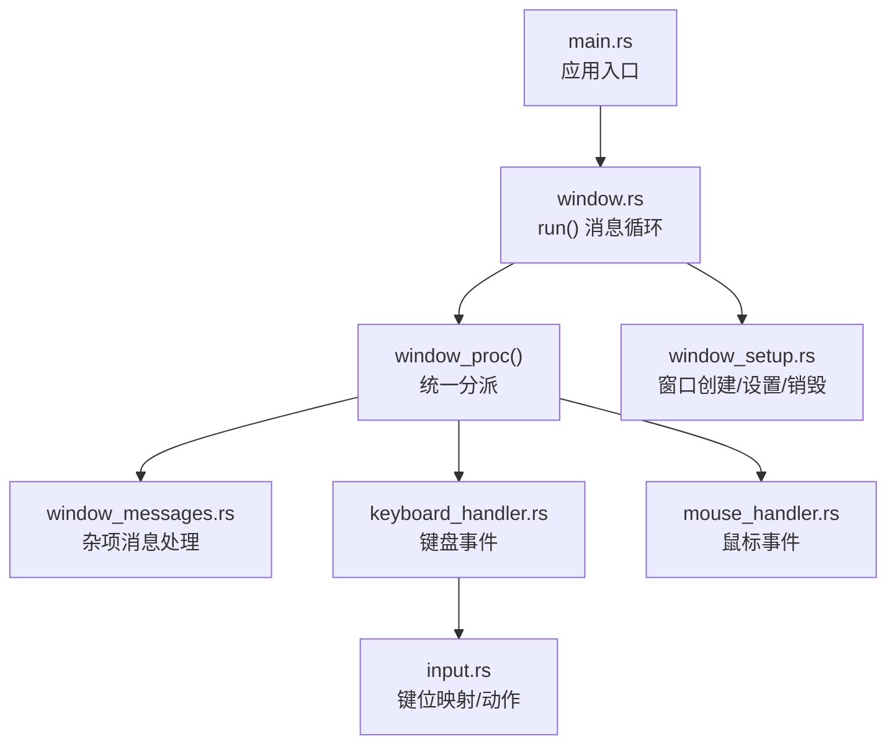
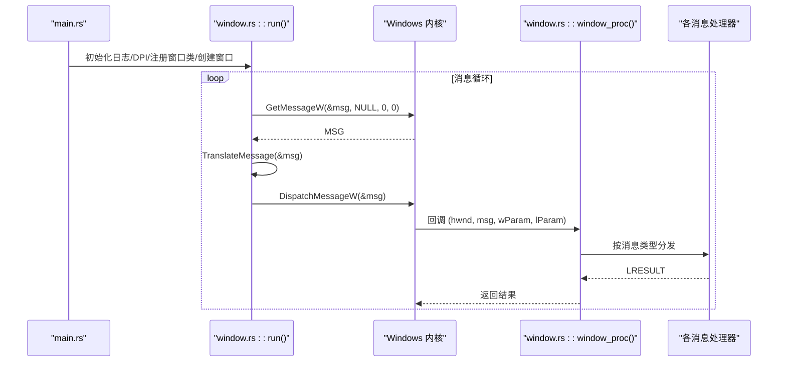
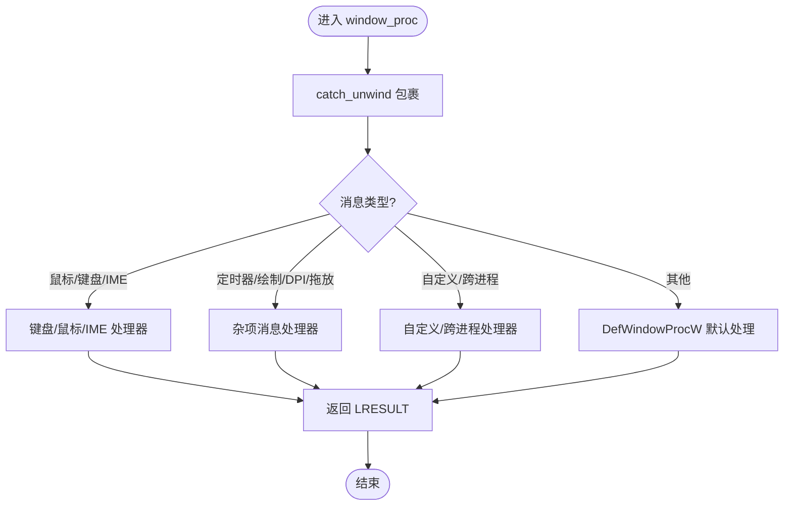
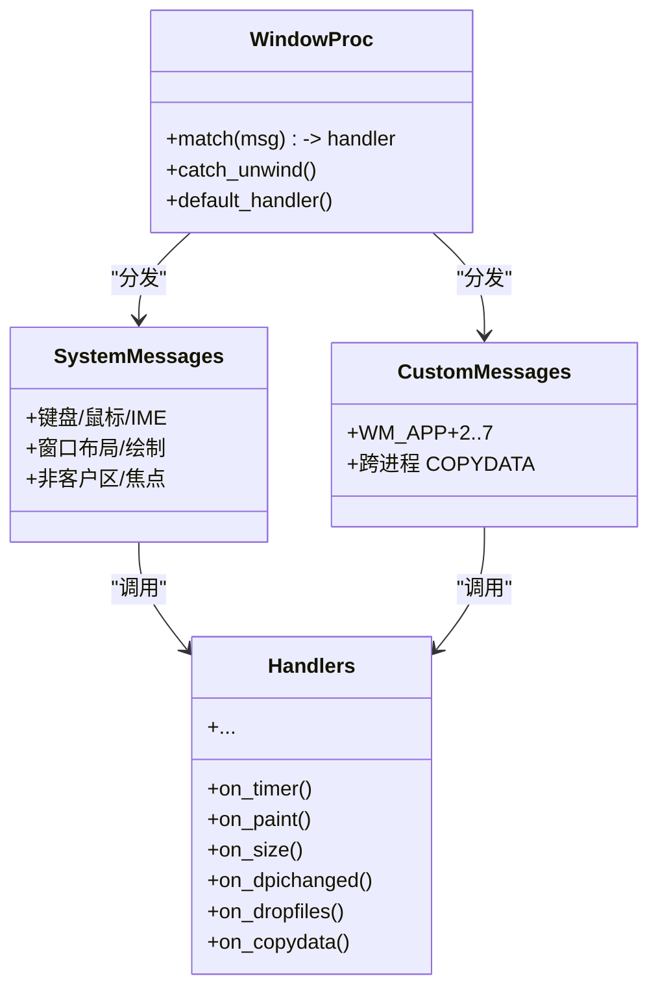
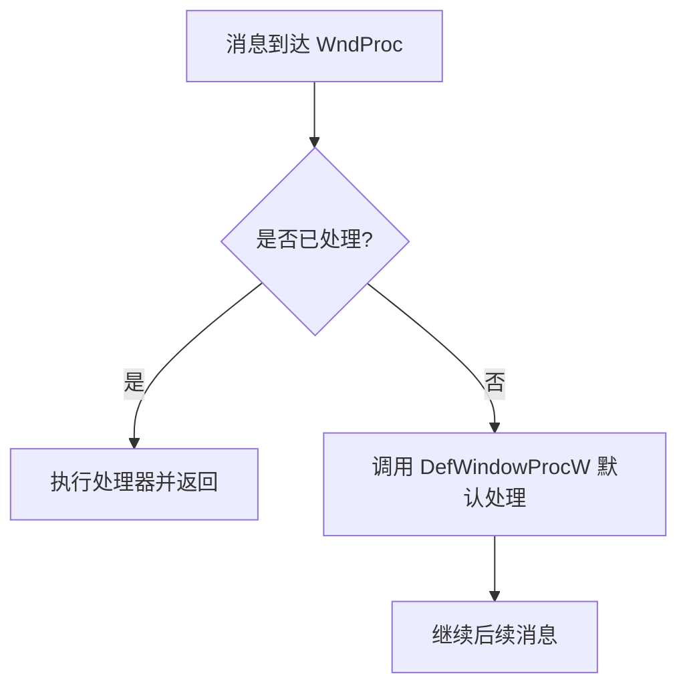
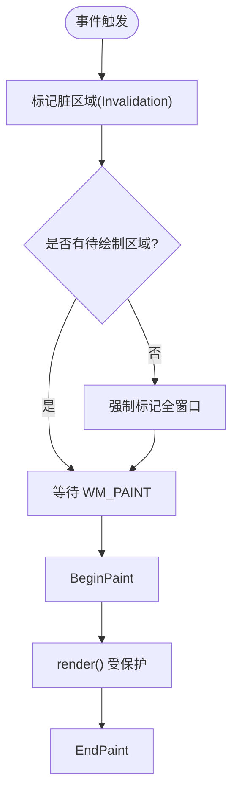
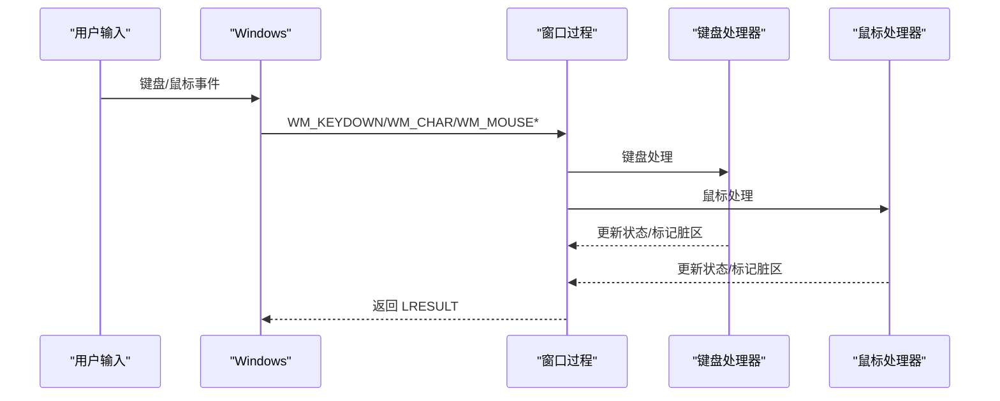
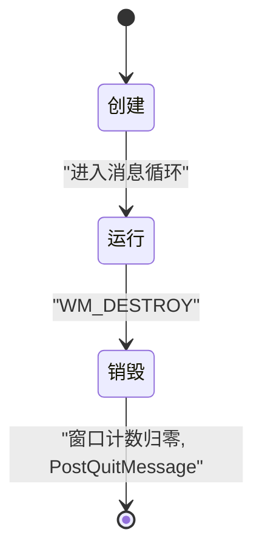
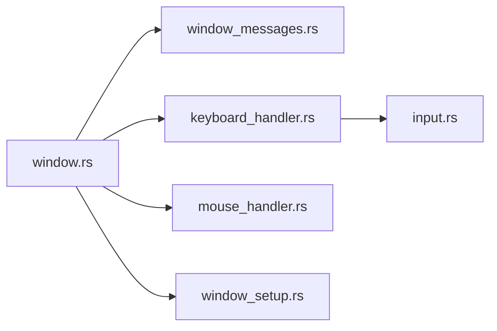

# Win32 消息循环

<cite>
**本文引用的文件**   
- [main.rs](file://crates/aether-win32/src/main.rs)
- [window.rs](file://crates/aether-win32/src/window.rs)
- [window_messages.rs](file://crates/aether-win32/src/window/window_messages.rs)
- [window_setup.rs](file://crates/aether-win32/src/window/window_setup.rs)
- [keyboard_handler.rs](file://crates/aether-win32/src/window/keyboard_handler.rs)
- [mouse_handler.rs](file://crates/aether-win32/src/window/mouse_handler.rs)
- [input.rs](file://crates/aether-win32/src/input.rs)
</cite>

## 目录
1. [简介](#简介)
2. [项目结构](#项目结构)
3. [核心组件](#核心组件)
4. [架构总览](#架构总览)
5. [详细组件分析](#详细组件分析)
6. [依赖关系分析](#依赖关系分析)
7. [性能考量](#性能考量)
8. [故障排查指南](#故障排查指南)
9. [结论](#结论)
10. [附录](#附录)

## 简介
本技术文档围绕 Win32 消息循环系统，结合仓库中 aether-win32 模块的实现，系统性阐述 Windows 应用程序的消息驱动架构。重点包括：
- 主线程消息循环与窗口过程（WndProc）的职责边界
- GetMessage、TranslateMessage、DispatchMessage 的调用链路与作用
- 窗口消息分类与处理机制（系统消息、用户自定义消息、跨进程消息等）
- 消息队列工作原理、优先级与异步处理模式
- 消息过滤、拦截与扩展机制的实现要点
- 性能优化技巧与调试方法

## 项目结构
aether-win32 采用“按功能分层 + 子模块拆分”的组织方式：
- 顶层入口 main.rs 负责单实例控制与启动流程
- window.rs 定义窗口类、创建窗口、消息循环与统一窗口过程
- window_messages.rs 集中处理杂项窗口消息（WM_TIMER、WM_PAINT、DPI、拖放等）
- window_setup.rs 负责窗口创建、DPI 感知、DWM 效果、持久化与销毁逻辑
- keyboard_handler.rs / mouse_handler.rs 将键盘与鼠标事件处理拆分为子模块
- input.rs 提供输入抽象（按键映射、动作枚举、多光标等）



图表来源
- [main.rs:8-26](file://crates/aether-win32/src/main.rs#L8-L26)
- [window.rs:114-173](file://crates/aether-win32/src/window.rs#L114-L173)
- [window.rs:301-372](file://crates/aether-win32/src/window.rs#L301-L372)
- [window_messages.rs:1-598](file://crates/aether-win32/src/window/window_messages.rs#L1-L598)
- [window_setup.rs:1-325](file://crates/aether-win32/src/window/window_setup.rs#L1-L325)
- [keyboard_handler.rs:1-13](file://crates/aether-win32/src/window/keyboard_handler.rs#L1-L13)
- [mouse_handler.rs:1-277](file://crates/aether-win32/src/window/mouse_handler.rs#L1-L277)
- [input.rs:1-355](file://crates/aether-win32/src/input.rs#L1-L355)

章节来源
- [main.rs:8-26](file://crates/aether-win32/src/main.rs#L8-L26)
- [window.rs:114-173](file://crates/aether-win32/src/window.rs#L114-L173)

## 核心组件
- 消息循环与窗口过程
  - run() 中完成 DPI 感知、窗口类注册、首窗口创建后进入 while 循环，使用 GetMessageW 取消息、TranslateMessage 转换字符、DispatchMessageW 分发到窗口过程。
  - window_proc() 作为统一入口，根据消息类型路由到具体处理器；对 panic 进行 catch_unwind 保护，避免 FFI 边界崩溃。
- 消息处理子系统
  - 杂项消息：定时器、绘制、DPI、焦点、非客户区命中测试、拖放、COPYDATA 等集中在 window_messages.rs。
  - 键盘/鼠标：在 window.rs 中匹配 WM_KEYDOWN/WM_CHAR 等，转发至 keyboard_handler.rs 和 mouse_handler.rs 的子模块。
- 窗口生命周期与状态
  - window_setup.rs 负责 DPI 感知、DWM 背景、窗口矩形恢复、持久化、COPYDATA 接收、WM_DESTROY 清理与退出条件。
  - window.rs 维护 thread_local 编辑器状态、窗口计数、无效区域标记等。

章节来源
- [window.rs:114-173](file://crates/aether-win32/src/window.rs#L114-L173)
- [window.rs:301-372](file://crates/aether-win32/src/window.rs#L301-L372)
- [window_messages.rs:1-598](file://crates/aether-win32/src/window/window_messages.rs#L1-L598)
- [window_setup.rs:1-325](file://crates/aether-win32/src/window/window_setup.rs#L1-L325)

## 架构总览
下图展示从进程启动到消息派发与处理的完整链路，以及关键 API 的使用位置。



图表来源
- [main.rs:8-26](file://crates/aether-win32/src/main.rs#L8-L26)
- [window.rs:114-173](file://crates/aether-win32/src/window.rs#L114-L173)
- [window.rs:301-372](file://crates/aether-win32/src/window.rs#L301-L372)

## 详细组件分析

### 消息循环与窗口过程
- 消息循环
  - 使用 GetMessageW 阻塞式获取消息，TranslateMessage 将虚拟键转换为 WM_CHAR，DispatchMessageW 投递到窗口过程。
  - 当 GetMessageW 返回 0（收到 WM_QUIT）时退出循环。
- 窗口过程
  - 通过 match 分支将消息路由到对应处理器；对未知消息回退到默认处理。
  - 整个函数体被 catch_unwind 包裹，确保异常不会穿越 FFI 边界导致进程崩溃。



图表来源
- [window.rs:301-372](file://crates/aether-win32/src/window.rs#L301-L372)

章节来源
- [window.rs:114-173](file://crates/aether-win32/src/window.rs#L114-L173)
- [window.rs:301-372](file://crates/aether-win32/src/window.rs#L301-L372)

### 消息分类与处理机制
- 系统消息
  - 输入：WM_KEYDOWN、WM_CHAR、WM_MOUSE*、WM_MOUSEWHEEL/HWHEEL、WM_SETCURSOR、WM_SETFOCUS/KILLFOCUS
  - 窗口：WM_SIZE、WM_DPICHANGED、WM_NCACTIVATE、WM_NCCALCSIZE、WM_NCHITTEST、WM_ERASEBKGND、WM_PAINT、WM_DESTROY
  - 拖放：WM_DROPFILES
- 用户自定义消息
  - 使用 WM_APP + N 系列消息承载内部任务完成通知（如 LSP 事件、文件夹扫描批次、SSH/Git 异步完成等）。
- 跨进程消息
  - WM_COPYDATA 用于接收来自第二实例或 CLI 的启动参数，实现单实例复用与参数转发。



图表来源
- [window.rs:301-372](file://crates/aether-win32/src/window.rs#L301-L372)
- [window_messages.rs:1-598](file://crates/aether-win32/src/window/window_messages.rs#L1-L598)
- [window_setup.rs:251-267](file://crates/aether-win32/src/window/window_setup.rs#L251-L267)

章节来源
- [window_messages.rs:1-598](file://crates/aether-win32/src/window/window_messages.rs#L1-L598)
- [window_setup.rs:251-267](file://crates/aether-win32/src/window/window_setup.rs#L251-L267)

### 消息队列、优先级与异步处理
- 消息队列
  - 每个 UI 线程拥有独立消息队列；GetMessageW 从当前线程队列取消息。
  - TranslateMessage 仅做虚拟键到字符的转换，不改变队列顺序。
- 优先级
  - Windows 内部对消息有固定优先级（如 WM_PAINT 合并、WM_QUIT 优先），但应用层通常不应依赖特定顺序，应保证处理幂等与可合并。
- 异步处理模式
  - 后台任务完成后通过 PostMessageW 发送自定义消息（WM_APP+N）到 UI 线程，由窗口过程统一处理并触发重绘。
  - 示例：LSP 事件、文件夹扫描批次、SSH/Git 操作完成等。

```mermaid
sequenceDiagram
participant BG as "后台任务"
participant UI as "UI 线程"
participant Loop as "消息循环"
participant Proc as "窗口过程"
BG->>UI : PostMessageW(WM_APP+X, ...)
Loop->>Loop : GetMessageW()
Loop->>Proc : DispatchMessageW()
Proc->>Proc : on_wm_app_X(...)
Proc->>UI : invalidate_window()
UI->>UI : WM_PAINT 合并渲染
```

图表来源
- [window_messages.rs:176-222](file://crates/aether-win32/src/window/window_messages.rs#L176-L222)
- [window.rs:66-75](file://crates/aether-win32/src/window.rs#L66-L75)

章节来源
- [window_messages.rs:176-222](file://crates/aether-win32/src/window/window_messages.rs#L176-L222)
- [window.rs:66-75](file://crates/aether-win32/src/window.rs#L66-L75)

### 消息过滤、拦截与扩展机制
- 过滤与拦截
  - 在窗口过程中对消息进行精确匹配与拦截，未处理的消息交由 DefWindowProcW 默认处理。
  - 非客户区命中测试（WM_NCHITTEST）自定义边框调整大小与拖动行为。
- 扩展点
  - 新增自定义消息：遵循 WM_APP + N 约定，在窗口过程中添加分支，并在相应处理器中实现逻辑。
  - 跨进程通信：使用 WM_COPYDATA 传递结构化数据（如启动参数），在 on_copydata 中解析与应用。
  - 低层钩子集成：通过自定义消息将底层键盘钩子事件投递给主窗口，绕过 IME 拦截。



图表来源
- [window.rs:301-372](file://crates/aether-win32/src/window.rs#L301-L372)
- [window_messages.rs:420-465](file://crates/aether-win32/src/window/window_messages.rs#L420-L465)
- [window_setup.rs:251-267](file://crates/aether-win32/src/window/window_setup.rs#L251-L267)

章节来源
- [window.rs:301-372](file://crates/aether-win32/src/window.rs#L301-L372)
- [window_messages.rs:420-465](file://crates/aether-win32/src/window/window_messages.rs#L420-L465)
- [window_setup.rs:251-267](file://crates/aether-win32/src/window/window_setup.rs#L251-L267)

### 绘制与重绘策略
- 脏区域与合并绘制
  - 使用 InvalidateRect 标记失效区域，Windows 自动合并多次失效为一次 WM_PAINT，避免双重渲染。
  - 在 WM_PAINT 中若脏区为空则强制全窗口标记，防止重影。
- 设备丢失保护
  - 渲染路径中使用 catch_unwind 捕获 D2D 资源创建中的 panic，记录诊断并优雅跳过本次绘制。



图表来源
- [window.rs:66-75](file://crates/aether-win32/src/window.rs#L66-L75)
- [window_messages.rs:478-514](file://crates/aether-win32/src/window/window_messages.rs#L478-L514)

章节来源
- [window.rs:66-75](file://crates/aether-win32/src/window.rs#L66-L75)
- [window_messages.rs:478-514](file://crates/aether-win32/src/window/window_messages.rs#L478-L514)

### 键盘与鼠标事件处理
- 键盘
  - WM_KEYDOWN/WM_CHAR 经 keyboard_handler.rs 子模块处理，支持多键盘布局与 ToUnicode 转换。
  - 快捷键映射在 input.rs 中定义 KeyMap，便于未来扩展用户自定义快捷键。
- 鼠标
  - mouse_handler.rs 处理点击、双击、滚轮、横向滚轮、光标设置等；包含长按检测、面板拖拽、标签页拖拽重排等交互。
  - 滚动逻辑区分标签栏、侧边栏、底部终端与编辑器区域，支持 Shift+滚轮横向滚动。



图表来源
- [window.rs:301-372](file://crates/aether-win32/src/window.rs#L301-L372)
- [keyboard_handler.rs:1-13](file://crates/aether-win32/src/window/keyboard_handler.rs#L1-L13)
- [mouse_handler.rs:1-277](file://crates/aether-win32/src/window/mouse_handler.rs#L1-L277)
- [input.rs:1-355](file://crates/aether-win32/src/input.rs#L1-L355)

章节来源
- [keyboard_handler.rs:1-13](file://crates/aether-win32/src/window/keyboard_handler.rs#L1-L13)
- [mouse_handler.rs:1-277](file://crates/aether-win32/src/window/mouse_handler.rs#L1-L277)
- [input.rs:1-355](file://crates/aether-win32/src/input.rs#L1-L355)

### 窗口生命周期与退出条件
- 创建
  - create_editor_window 计算恢复矩形、启用 DWM 效果、接受拖放、初始化编辑器状态并存储到 GWLP_USERDATA。
- 销毁
  - WM_DESTROY 中卸载键盘钩子、持久化窗口状态、递减全局窗口计数，当所有窗口关闭时发出 WM_QUIT 退出消息循环。



图表来源
- [window.rs:179-297](file://crates/aether-win32/src/window.rs#L179-L297)
- [window_setup.rs:269-325](file://crates/aether-win32/src/window/window_setup.rs#L269-L325)

章节来源
- [window.rs:179-297](file://crates/aether-win32/src/window.rs#L179-L297)
- [window_setup.rs:269-325](file://crates/aether-win32/src/window/window_setup.rs#L269-L325)

## 依赖关系分析
- 模块耦合
  - window.rs 聚合各子模块处理器，形成“中心调度”的耦合点；消息处理逻辑分散在 window_messages.rs、keyboard_handler.rs、mouse_handler.rs，保持高内聚。
- 外部依赖
  - windows crate 提供 Win32 API 绑定；DWM、GDI、HiDpi、Shell 等子系统通过该绑定访问。
- 潜在循环依赖
  - 当前结构未见直接循环导入；通过子模块 re-export 降低耦合度。



图表来源
- [window.rs:13-30](file://crates/aether-win32/src/window.rs#L13-L30)
- [keyboard_handler.rs:1-13](file://crates/aether-win32/src/window/keyboard_handler.rs#L1-L13)
- [mouse_handler.rs:1-277](file://crates/aether-win32/src/window/mouse_handler.rs#L1-L277)
- [input.rs:1-355](file://crates/aether-win32/src/input.rs#L1-L355)
- [window_setup.rs:1-325](file://crates/aether-win32/src/window/window_setup.rs#L1-L325)

章节来源
- [window.rs:13-30](file://crates/aether-win32/src/window.rs#L13-L30)

## 性能考量
- 渲染合并
  - 使用 InvalidateRect 而非直接 render()，利用 Windows 的 WM_PAINT 合并机制减少重复绘制。
- 定时器节流
  - 使用多个定时器（悬停提示、终端刷新、光标闪烁、长按检测、自动保存）配合 KillTimer 与可见性判断，避免空转。
- DPI 自适应
  - 在 WM_DPICHANGED 中重建渲染目标与缓存，避免尺寸不一致导致的额外重绘。
- 设备丢失容错
  - 渲染路径 catch_unwind 捕获 panic，避免 GPU 驱动问题导致崩溃。
- 输入响应
  - 鼠标滚轮与横向滚轮针对区域判定，减少不必要的滚动计算；Shift+滚轮横向滚动提升大行代码浏览效率。

[本节为通用指导，无需列出具体文件来源]

## 故障排查指南
- 窗口过程 panic
  - 现象：界面无响应或崩溃。
  - 定位：检查 window_proc 的 catch_unwind 输出日志，确认消息类型与错误信息。
- 渲染重影
  - 现象：旧帧残留。
  - 定位：确认 WM_PAINT 中对脏区的强制标记逻辑是否生效，检查 invalidate_window 调用路径。
- 自定义消息未处理
  - 现象：后台任务完成后 UI 无更新。
  - 定位：核对 WM_APP+N 分支是否存在，PostMessageW 参数是否正确，invalidate_window 是否被调用。
- 跨进程参数未生效
  - 现象：二次启动未打开指定文件或文件夹。
  - 定位：检查 WM_COPYDATA 解析与 apply_launch_args 流程，确认 copydata_result 返回值。
- 键盘输入被 IME 拦截
  - 现象：终端无法删除汉字。
  - 定位：确认低层键盘钩子安装成功，自定义消息（Backspace/Delete/方向键）是否投递到主窗口。

章节来源
- [window.rs:301-372](file://crates/aether-win32/src/window.rs#L301-L372)
- [window_messages.rs:478-514](file://crates/aether-win32/src/window/window_messages.rs#L478-L514)
- [window_setup.rs:251-267](file://crates/aether-win32/src/window/window_setup.rs#L251-L267)

## 结论
本项目在 Win32 消息循环方面采用了清晰的分层与模块化设计：
- 以 window.rs 为中心的消息分发与防护机制，确保稳定性与可扩展性
- 通过自定义消息与 WM_COPYDATA 实现异步与跨进程通信
- 使用 InvalidateRect 与 WM_PAINT 合并渲染，提高绘制性能
- 完善的 DPI 适配与 DWM 效果，提升用户体验
- 键盘/鼠标处理细粒度拆分，便于维护与扩展

[本节为总结，无需列出具体文件来源]

## 附录
- 关键 API 使用位置参考
  - 消息循环：GetMessageW、TranslateMessage、DispatchMessageW
  - 窗口过程：window_proc 统一分发
  - 绘制：InvalidateRect、WM_PAINT
  - 自定义消息：WM_APP + N
  - 跨进程：WM_COPYDATA
  - 非客户区：WM_NCHITTEST、WM_NCCALCSIZE、WM_NCACTIVATE
  - DPI：WM_DPICHANGED、SetProcessDpiAwarenessContext/SetProcessDpiAwareness
  - 拖放：DragAcceptFiles、WM_DROPFILES

章节来源
- [window.rs:114-173](file://crates/aether-win32/src/window.rs#L114-L173)
- [window.rs:301-372](file://crates/aether-win32/src/window.rs#L301-L372)
- [window_messages.rs:1-598](file://crates/aether-win32/src/window/window_messages.rs#L1-L598)
- [window_setup.rs:1-325](file://crates/aether-win32/src/window/window_setup.rs#L1-L325)