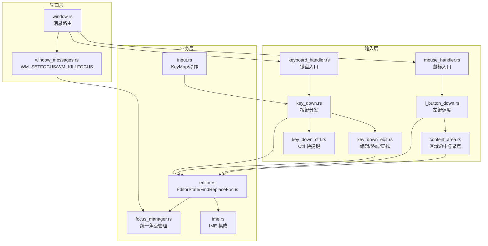
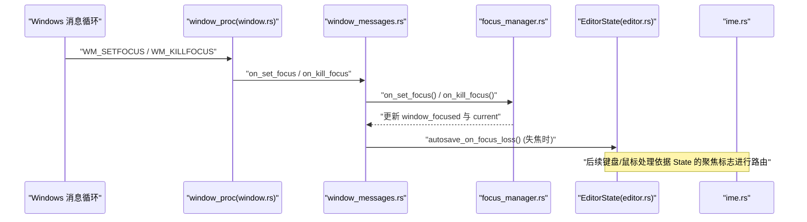
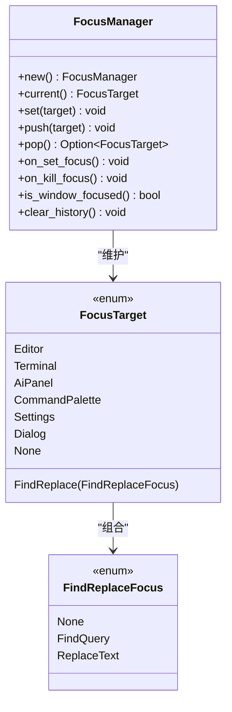
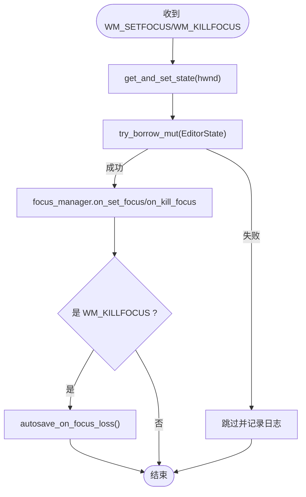
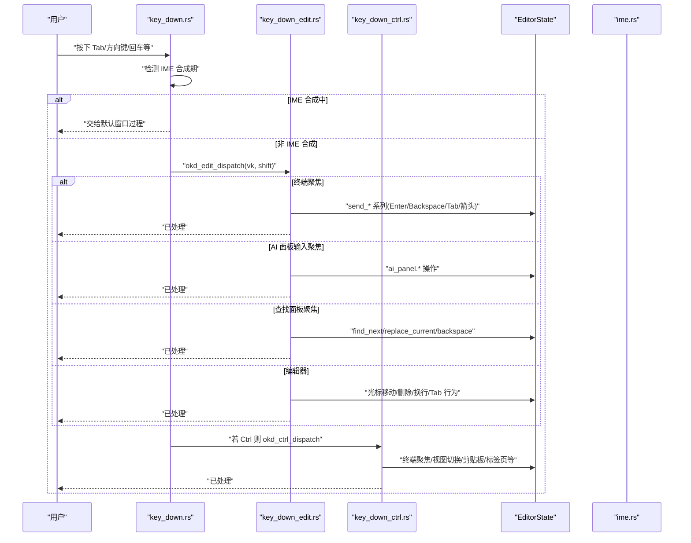
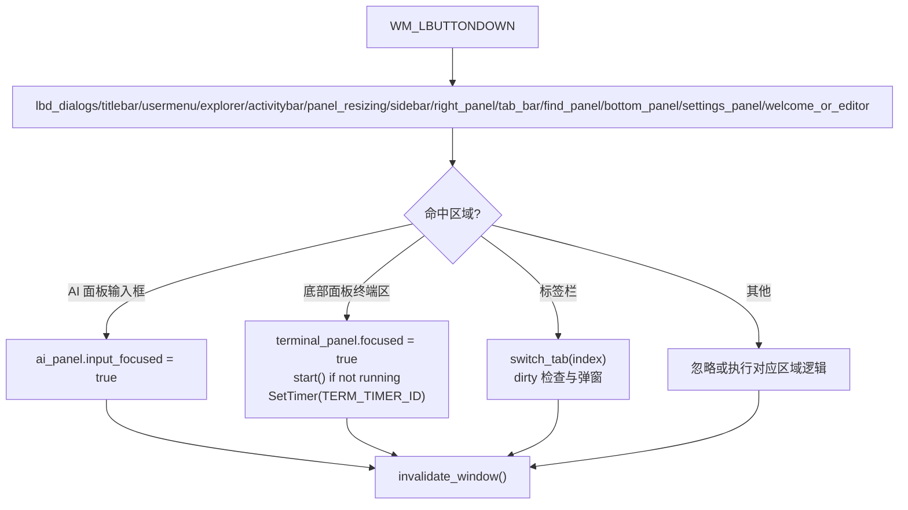
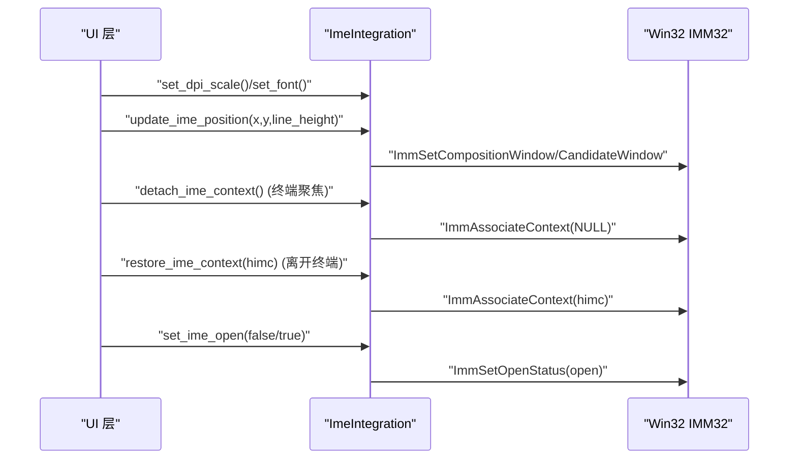
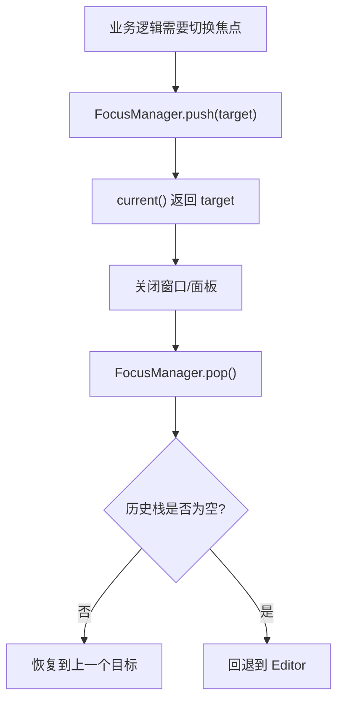
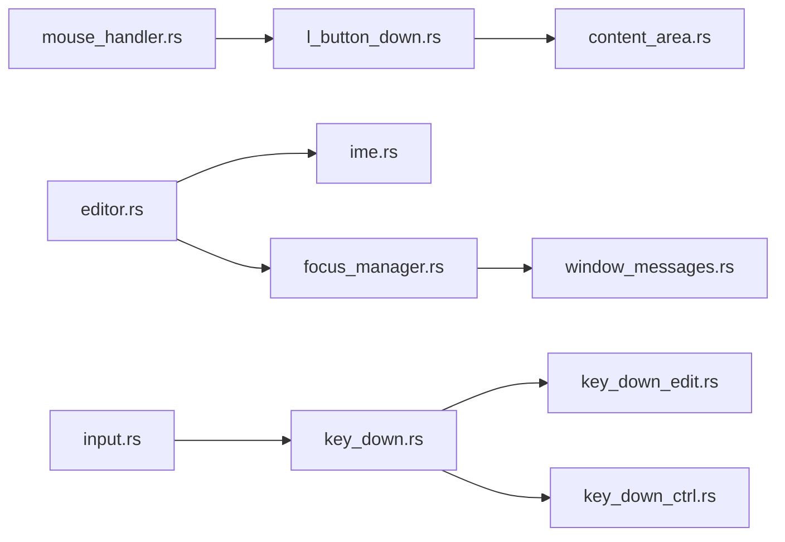

# 输入焦点管理

<cite>
**本文引用的文件**   
- [focus_manager.rs](file://crates/aether-win32/src/focus_manager.rs)
- [window_messages.rs](file://crates/aether-win32/src/window/window_messages.rs)
- [keyboard_handler.rs](file://crates/aether-win32/src/window/keyboard_handler.rs)
- [key_down.rs](file://crates/aether-win32/src/window/keyboard_handler/key_down.rs)
- [key_down_edit.rs](file://crates/aether-win32/src/window/keyboard_handler/key_down_edit.rs)
- [key_down_ctrl.rs](file://crates/aether-win32/src/window/keyboard_handler/key_down_ctrl.rs)
- [mouse_handler.rs](file://crates/aether-win32/src/window/mouse_handler.rs)
- [l_button_down.rs](file://crates/aether-win32/src/window/mouse_handler/l_button_down.rs)
- [content_area.rs](file://crates/aether-win32/src/window/mouse_handler/l_button_down/content_area.rs)
- [ime.rs](file://crates/aether-win32/src/ime.rs)
- [input.rs](file://crates/aether-win32/src/input.rs)
- [editor.rs](file://crates/aether-win32/src/editor.rs)
- [window.rs](file://crates/aether-win32/src/window.rs)
</cite>

## 目录
1. [简介](#简介)
2. [项目结构](#项目结构)
3. [核心组件](#核心组件)
4. [架构总览](#架构总览)
5. [详细组件分析](#详细组件分析)
6. [依赖关系分析](#依赖关系分析)
7. [性能考量](#性能考量)
8. [故障排查指南](#故障排查指南)
9. [结论](#结论)
10. [附录](#附录)

## 简介
本技术文档围绕 Windows 应用中的“输入焦点管理”展开，结合仓库中 aether-win32 模块的实现，系统性说明：
- 焦点概念与层次结构（窗口级、面板级、控件级）
- SetFocus/GetFocus 等 API 的使用与在本项目中的落地方式
- 焦点切换逻辑：Tab 键导航、鼠标点击转移、程序化控制
- 多窗口焦点管理与跨进程焦点同步机制
- 输入法（IME）焦点关联、状态管理与切换处理
- 焦点可视化指示、焦点陷阱与可访问性支持
- 最佳实践与常见问题解决方案

## 项目结构
本项目采用分层与按功能域组织的方式。与焦点相关的代码主要分布在以下位置：
- 统一焦点管理器：focus_manager.rs
- 窗口消息分发与焦点事件：window.rs、window_messages.rs
- 键盘输入与焦点相关快捷键：keyboard_handler.rs 及其子模块 key_down.rs、key_down_edit.rs、key_down_ctrl.rs
- 鼠标交互与焦点转移：mouse_handler.rs 及其子模块 l_button_down.rs、content_area.rs
- IME 集成与候选/合成窗口定位：ime.rs
- 编辑器全局状态与查找替换焦点：editor.rs
- 输入抽象与快捷键映射：input.rs

图表来源
- [window.rs:340-373](file://crates/aether-win32/src/window.rs#L340-L373)
- [window_messages.rs:515-564](file://crates/aether-win32/src/window/window_messages.rs#L515-L564)
- [keyboard_handler.rs:1-13](file://crates/aether-win32/src/window/keyboard_handler.rs#L1-L13)
- [key_down.rs:1-117](file://crates/aether-win32/src/window/keyboard_handler/key_down.rs#L1-L117)
- [key_down_edit.rs:1-591](file://crates/aether-win32/src/window/keyboard_handler/key_down_edit.rs#L1-L591)
- [key_down_ctrl.rs:1-709](file://crates/aether-win32/src/window/keyboard_handler/key_down_ctrl.rs#L1-L709)
- [mouse_handler.rs:1-277](file://crates/aether-win32/src/window/mouse_handler.rs#L1-L277)
- [l_button_down.rs:1-101](file://crates/aether-win32/src/window/mouse_handler/l_button_down.rs#L1-L101)
- [content_area.rs:1-800](file://crates/aether-win32/src/window/mouse_handler/l_button_down/content_area.rs#L1-L800)
- [focus_manager.rs:1-193](file://crates/aether-win32/src/focus_manager.rs#L1-L193)
- [ime.rs:1-255](file://crates/aether-win32/src/ime.rs#L1-L255)
- [input.rs:1-355](file://crates/aether-win32/src/input.rs#L1-L355)
- [editor.rs:1-200](file://crates/aether-win32/src/editor.rs#L1-L200)

章节来源
- [window.rs:340-373](file://crates/aether-win32/src/window.rs#L340-L373)
- [window_messages.rs:515-564](file://crates/aether-win32/src/window/window_messages.rs#L515-L564)
- [keyboard_handler.rs:1-13](file://crates/aether-win32/src/window/keyboard_handler.rs#L1-L13)
- [mouse_handler.rs:1-277](file://crates/aether-win32/src/window/mouse_handler.rs#L1-L277)
- [focus_manager.rs:1-193](file://crates/aether-win32/src/focus_manager.rs#L1-L193)
- [ime.rs:1-255](file://crates/aether-win32/src/ime.rs#L1-L255)
- [input.rs:1-355](file://crates/aether-win32/src/input.rs#L1-L355)
- [editor.rs:1-200](file://crates/aether-win32/src/editor.rs#L1-L200)

## 核心组件
- 统一焦点管理器 FocusManager
  - 维护当前焦点目标、历史栈与窗口是否拥有焦点的状态
  - 提供 push/pop/set/current 等方法，配合 WM_SETFOCUS/WM_KILLFOCUS 实现窗口级焦点恢复
- 编辑器全局状态 EditorState
  - 包含终端面板聚焦、AI 面板输入聚焦、查找替换面板聚焦等细粒度焦点标志
  - 提供 find_focus（FindReplaceFocus）、terminal_panel.focused、ai_panel.input_focused 等字段
- IME 集成 ImeIntegration
  - 负责候选窗口与合成窗口定位、DPI 缩放、打开/关闭 IME、临时解绑 HIMC 以旁路系统拦截
- 键盘/鼠标处理器
  - 键盘：根据当前焦点目标将按键路由到终端、AI 面板、查找替换或编辑器
  - 鼠标：通过区域命中测试设置相应面板的聚焦状态

章节来源
- [focus_manager.rs:1-193](file://crates/aether-win32/src/focus_manager.rs#L1-L193)
- [editor.rs:1-200](file://crates/aether-win32/src/editor.rs#L1-L200)
- [ime.rs:1-255](file://crates/aether-win32/src/ime.rs#L1-L255)
- [key_down_edit.rs:1-591](file://crates/aether-win32/src/window/keyboard_handler/key_down_edit.rs#L1-L591)
- [content_area.rs:1-800](file://crates/aether-win32/src/window/mouse_handler/l_button_down/content_area.rs#L1-L800)

## 架构总览
下图展示了从 Windows 消息到焦点管理的完整链路，包括窗口级焦点、面板级聚焦与 IME 联动。

图表来源
- [window.rs:340-373](file://crates/aether-win32/src/window.rs#L340-L373)
- [window_messages.rs:515-564](file://crates/aether-win32/src/window/window_messages.rs#L515-L564)
- [focus_manager.rs:1-193](file://crates/aether-win32/src/focus_manager.rs#L1-L193)
- [editor.rs:1-200](file://crates/aether-win32/src/editor.rs#L1-L200)

## 详细组件分析

### 统一焦点管理器 FocusManager
- 职责
  - 维护当前焦点目标（编辑器、终端、AI 面板、查找替换、命令面板、设置、对话框、无焦点）
  - 维护焦点历史栈，支持 push/pop 回退
  - 响应窗口获得/失去焦点，current() 在窗口失焦时返回 None
- 关键方法
  - new()/set()/push()/pop()/current()/is_window_focused()/clear_history()
  - on_set_focus()/on_kill_focus()
- 设计要点
  - 使用 Vec 作为历史栈，容量预分配提升性能
  - 当 pop 为空时回退到默认编辑器焦点，保证用户体验一致性

图表来源
- [focus_manager.rs:1-193](file://crates/aether-win32/src/focus_manager.rs#L1-L193)

章节来源
- [focus_manager.rs:1-193](file://crates/aether-win32/src/focus_manager.rs#L1-L193)

### 窗口级焦点消息处理
- WM_SETFOCUS/WM_KILLFOCUS 由 window_messages.rs 处理
  - 调用 focus_manager.on_set_focus()/on_kill_focus()
  - 失焦时触发自动保存 autosave_on_focus_loss()
- 注意
  - 使用 try_borrow_mut() 避免模态对话框消息循环重入导致的 RefCell panic

图表来源
- [window_messages.rs:515-564](file://crates/aether-win32/src/window/window_messages.rs#L515-L564)

章节来源
- [window_messages.rs:515-564](file://crates/aether-win32/src/window/window_messages.rs#L515-L564)

### 键盘焦点路由与 Tab 导航
- 入口
  - keyboard_handler.rs 暴露 on_key_down/on_char
  - key_down.rs 负责按键分发，优先检查 IME 合成期、各面板激活状态
- 非 Ctrl 编辑键
  - key_down_edit.rs 根据 terminal_panel.focused、ai_panel.input_focused、find_visible+find_focus 决定路由
  - Tab 键在查找面板内切换 FindQuery/ReplaceText；否则接受内联补全或插入制表符
- Ctrl 快捷键
  - key_down_ctrl.rs 处理 Ctrl+` 打开/关闭终端并设置 terminal_panel.focused 与 IME 旁路

图表来源
- [keyboard_handler.rs:1-13](file://crates/aether-win32/src/window/keyboard_handler.rs#L1-L13)
- [key_down.rs:1-117](file://crates/aether-win32/src/window/keyboard_handler/key_down.rs#L1-L117)
- [key_down_edit.rs:1-591](file://crates/aether-win32/src/window/keyboard_handler/key_down_edit.rs#L1-L591)
- [key_down_ctrl.rs:1-709](file://crates/aether-win32/src/window/keyboard_handler/key_down_ctrl.rs#L1-L709)

章节来源
- [key_down.rs:1-117](file://crates/aether-win32/src/window/keyboard_handler/key_down.rs#L1-L117)
- [key_down_edit.rs:1-591](file://crates/aether-win32/src/window/keyboard_handler/key_down_edit.rs#L1-L591)
- [key_down_ctrl.rs:1-709](file://crates/aether-win32/src/window/keyboard_handler/key_down_ctrl.rs#L1-L709)

### 鼠标点击焦点转移
- 入口
  - mouse_handler.rs 暴露 on_l_button_down 等
  - l_button_down.rs 按优先级依次尝试各区域处理器
- 内容区域
  - content_area.rs 对活动栏、侧边栏、右侧 AI 面板、底部面板、标签栏等进行命中测试
  - 点击 AI 面板输入框 → ai_panel.input_focused = true
  - 点击底部面板终端区域 → terminal_panel.focused = true，必要时启动终端与刷新定时器
  - 点击标签栏 → 切换标签页（含未保存确认流程）

图表来源
- [mouse_handler.rs:1-277](file://crates/aether-win32/src/window/mouse_handler.rs#L1-L277)
- [l_button_down.rs:1-101](file://crates/aether-win32/src/window/mouse_handler/l_button_down.rs#L1-L101)
- [content_area.rs:1-800](file://crates/aether-win32/src/window/mouse_handler/l_button_down/content_area.rs#L1-L800)

章节来源
- [l_button_down.rs:1-101](file://crates/aether-win32/src/window/mouse_handler/l_button_down.rs#L1-L101)
- [content_area.rs:1-800](file://crates/aether-win32/src/window/mouse_handler/l_button_down/content_area.rs#L1-L800)

### 输入法（IME）焦点关联与状态管理
- 集成点
  - ime.rs 提供 ImeIntegration：候选/合成窗口定位、DPI 缩放、读取合成串/结果串、打开/关闭 IME、解绑/恢复 HIMC
- 与焦点联动
  - 终端聚焦时：通过 set_terminal_ime_bypass(true) 解绑 IME，避免 Backspace 等被系统拦截
  - 中文提交后：可关闭 IME 以便立即用 Backspace 删除汉字
  - DPI 变化时：重新设置 IME 窗口尺寸与字体信息

图表来源
- [ime.rs:1-255](file://crates/aether-win32/src/ime.rs#L1-L255)
- [key_down_ctrl.rs:1-709](file://crates/aether-win32/src/window/keyboard_handler/key_down_ctrl.rs#L1-L709)

章节来源
- [ime.rs:1-255](file://crates/aether-win32/src/ime.rs#L1-L255)
- [key_down_ctrl.rs:1-709](file://crates/aether-win32/src/window/keyboard_handler/key_down_ctrl.rs#L1-L709)

### 程序化焦点控制与焦点历史
- 程序化控制
  - FocusManager::set()/push()/pop() 用于在业务逻辑中直接设置焦点目标
  - 例如：打开查找面板时 push(FindReplace)，关闭时 pop() 回到上一目标
- 窗口级焦点恢复
  - WM_SETFOCUS 时 on_set_focus() 标记窗口有焦点，current() 返回真实目标
  - WM_KILLFOCUS 时 on_kill_focus() 标记窗口无焦点，current() 返回 None

图表来源
- [focus_manager.rs:1-193](file://crates/aether-win32/src/focus_manager.rs#L1-L193)

章节来源
- [focus_manager.rs:1-193](file://crates/aether-win32/src/focus_manager.rs#L1-L193)

### 多窗口焦点管理与跨进程焦点同步
- 多窗口
  - 窗口创建通过自定义消息 WM_APP+2 触发 create_editor_window，新窗口独立拥有自己的消息循环与焦点状态
- 跨进程
  - 终端 ConPTY 通过发送字节序列与子进程通信，焦点在 UI 层通过 terminal_panel.focused 控制
  - 跨进程焦点同步通常依赖操作系统级别（如 SetForegroundWindow），本项目在 UI 层通过窗口消息与状态标志协调

章节来源
- [window_messages.rs:164-174](file://crates/aether-win32/src/window/window_messages.rs#L164-L174)
- [key_down_ctrl.rs:1-709](file://crates/aether-win32/src/window/keyboard_handler/key_down_ctrl.rs#L1-L709)

### 焦点可视化指示与焦点陷阱
- 可视化指示
  - 通过 WM_SETCURSOR 设置不同区域的鼠标光标类型（Arrow/IBeam/Hand/SizeWE/SizeNS）
  - 查找替换面板、设置面板、标签栏等区域均有明确的命中测试与绘制反馈
- 焦点陷阱
  - 在特定面板（搜索、欢迎页、设置字段、SSH/克隆对话框）内部拦截 Tab/方向键/回车/Esc，防止误触编辑器
  - 模态对话框弹出时避免在持有 RefMut 期间调用 MessageBox/TaskDialog，防止消息循环重入导致 panic

章节来源
- [window_messages.rs:566-592](file://crates/aether-win32/src/window/window_messages.rs#L566-L592)
- [key_down.rs:1-117](file://crates/aether-win32/src/window/keyboard_handler/key_down.rs#L1-L117)
- [content_area.rs:1-800](file://crates/aether-win32/src/window/mouse_handler/l_button_down/content_area.rs#L1-L800)

### 可访问性支持
- 当前实现未显式接入 UIA（Windows 可访问性接口），但可通过扩展：
  - 为各面板与控件暴露名称、角色、状态
  - 支持屏幕阅读器朗读焦点变化与面板标题
  - 确保键盘导航顺序符合视觉顺序

[本节为通用建议，不直接分析具体文件]

## 依赖关系分析
- 低耦合高内聚
  - FocusManager 仅关注焦点状态与历史栈，不依赖渲染细节
  - EditorState 聚合各面板聚焦标志，作为键盘/鼠标处理的决策依据
  - IME 集成独立于 UI 布局，通过坐标与 DPI 参数适配
- 外部依赖
  - Win32 IMM32 API（ImmGetContext/ImmSetCandidateWindow/ImmSetCompositionWindow/ImmSetOpenStatus）
  - Win32 消息循环（WM_SETFOCUS/WM_KILLFOCUS/WM_KEYDOWN/WM_CHAR/WM_LBUTTONDOWN/WM_SETCURSOR）

图表来源
- [focus_manager.rs:1-193](file://crates/aether-win32/src/focus_manager.rs#L1-L193)
- [window_messages.rs:515-564](file://crates/aether-win32/src/window/window_messages.rs#L515-L564)
- [keyboard_handler.rs:1-13](file://crates/aether-win32/src/window/keyboard_handler.rs#L1-L13)
- [key_down.rs:1-117](file://crates/aether-win32/src/window/keyboard_handler/key_down.rs#L1-L117)
- [key_down_edit.rs:1-591](file://crates/aether-win32/src/window/keyboard_handler/key_down_edit.rs#L1-L591)
- [key_down_ctrl.rs:1-709](file://crates/aether-win32/src/window/keyboard_handler/key_down_ctrl.rs#L1-L709)
- [mouse_handler.rs:1-277](file://crates/aether-win32/src/window/mouse_handler.rs#L1-L277)
- [l_button_down.rs:1-101](file://crates/aether-win32/src/window/mouse_handler/l_button_down.rs#L1-L101)
- [content_area.rs:1-800](file://crates/aether-win32/src/window/mouse_handler/l_button_down/content_area.rs#L1-L800)
- [ime.rs:1-255](file://crates/aether-win32/src/ime.rs#L1-L255)
- [input.rs:1-355](file://crates/aether-win32/src/input.rs#L1-L355)
- [editor.rs:1-200](file://crates/aether-win32/src/editor.rs#L1-L200)

章节来源
- [focus_manager.rs:1-193](file://crates/aether-win32/src/focus_manager.rs#L1-L193)
- [window_messages.rs:515-564](file://crates/aether-win32/src/window/window_messages.rs#L515-L564)
- [keyboard_handler.rs:1-13](file://crates/aether-win32/src/window/keyboard_handler.rs#L1-L13)
- [mouse_handler.rs:1-277](file://crates/aether-win32/src/window/mouse_handler.rs#L1-L277)
- [ime.rs:1-255](file://crates/aether-win32/src/ime.rs#L1-L255)
- [input.rs:1-355](file://crates/aether-win32/src/input.rs#L1-L355)
- [editor.rs:1-200](file://crates/aether-win32/src/editor.rs#L1-L200)

## 性能考量
- 避免不必要的重绘
  - 仅在状态变更后调用 invalidate_window()，减少 WM_PAINT 频率
- 定时器优化
  - 终端刷新定时器 TERM_TIMER_ID 在底部面板不可见时停止，避免空转
- 内存与借用
  - 使用 try_borrow_mut() 避免模态对话框消息循环重入导致的 RefCell panic
- IME 上下文管理
  - 使用 RAII HimcGuard 确保 ImmReleaseContext 正确释放，避免资源泄漏

章节来源
- [window_messages.rs:63-79](file://crates/aether-win32/src/window/window_messages.rs#L63-L79)
- [window_messages.rs:515-564](file://crates/aether-win32/src/window/window_messages.rs#L515-L564)
- [ime.rs:245-255](file://crates/aether-win32/src/ime.rs#L245-L255)

## 故障排查指南
- 症状：点击关闭标签页时应用卡死或崩溃
  - 原因：在 borrow_mut() 持有期间弹出模态对话框，消息循环派发 WM_KILLFOCUS/WM_PAINT，再次尝试 borrow_mut() 导致 panic
  - 解决：先 drop borrow，再弹窗；确认后重新 borrow_mut() 执行关闭
- 症状：终端中无法删除汉字
  - 原因：IME 处于“已开启未合成”状态，系统拦截 Backspace
  - 解决：终端聚焦时 detach_ime_context() 或 set_ime_open(false)，离开终端后 restore_ime_context()
- 症状：窗口失焦后未自动保存
  - 原因：未正确处理 WM_KILLFOCUS 或 try_borrow_mut() 失败
  - 解决：确保 on_kill_focus() 调用 autosave_on_focus_loss()，并记录调试日志

章节来源
- [content_area.rs:282-465](file://crates/aether-win32/src/window/mouse_handler/l_button_down/content_area.rs#L282-L465)
- [ime.rs:208-243](file://crates/aether-win32/src/ime.rs#L208-L243)
- [window_messages.rs:515-564](file://crates/aether-win32/src/window/window_messages.rs#L515-L564)

## 结论
本项目通过统一的焦点管理器、清晰的键盘/鼠标路由与完善的 IME 集成，实现了稳健的输入焦点管理。窗口级与面板级焦点状态分离，既保证了用户体验的一致性，又便于扩展与维护。未来可在可访问性与跨进程焦点同步方面进一步增强。

## 附录
- 常用 API 与用法
  - SetFocus/GetFocus：Windows API，用于设置/获取拥有焦点的窗口句柄；本项目通过 WM_SETFOCUS/WM_KILLFOCUS 在窗口层处理焦点变化
  - ImmSetCandidateWindow/ImmSetCompositionWindow：IME 候选/合成窗口定位
  - ImmSetOpenStatus：打开/关闭 IME 拦截
  - ImmAssociateContext：解绑/恢复 IME 上下文
- 最佳实践
  - 在面板打开/关闭时使用 push/pop 管理焦点历史
  - 在模态对话框弹出前释放所有可变借用
  - 终端聚焦时旁路 IME，离开时恢复
  - 使用 try_borrow_mut() 防御重入风险
  - 仅在状态变更时触发重绘，避免频繁 WM_PAINT

[本节为通用建议，不直接分析具体文件]