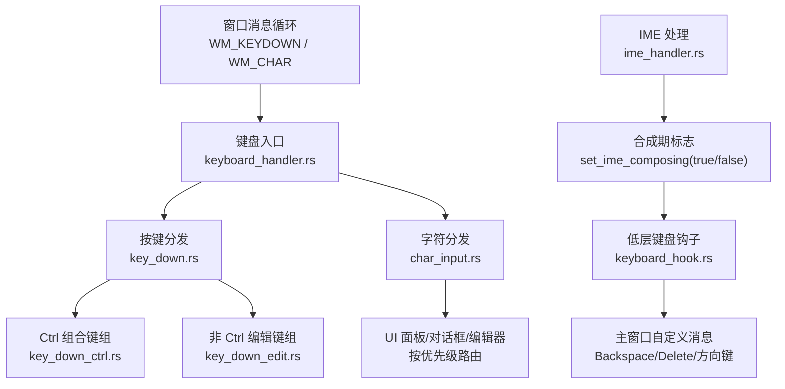
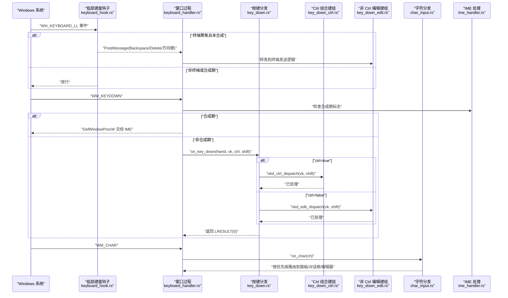
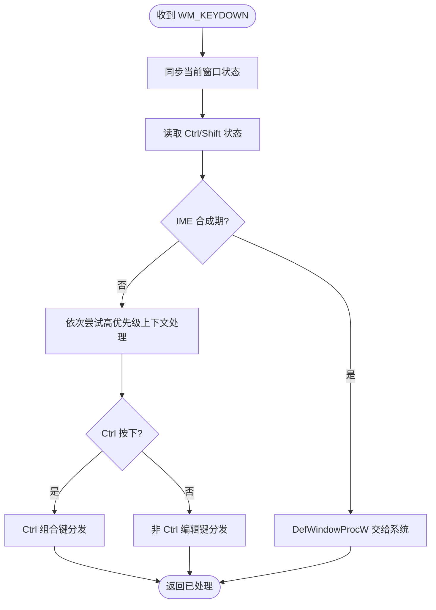
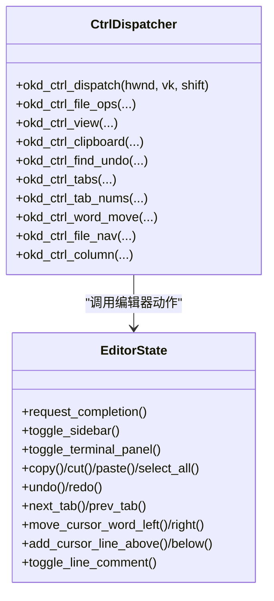
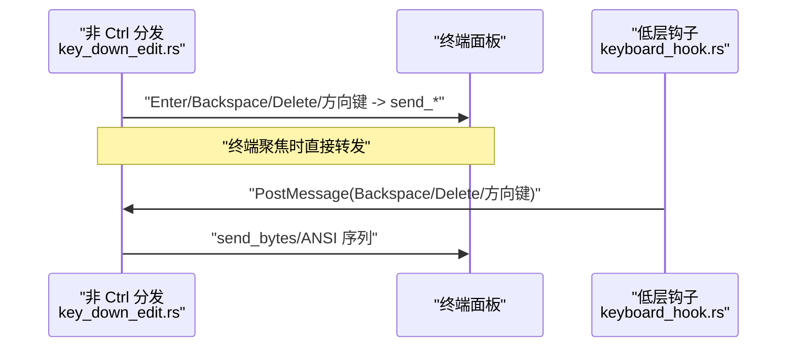
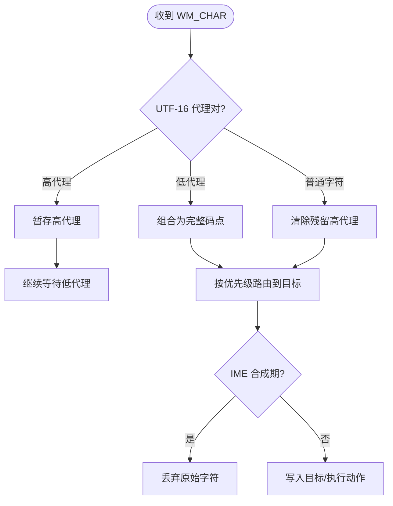
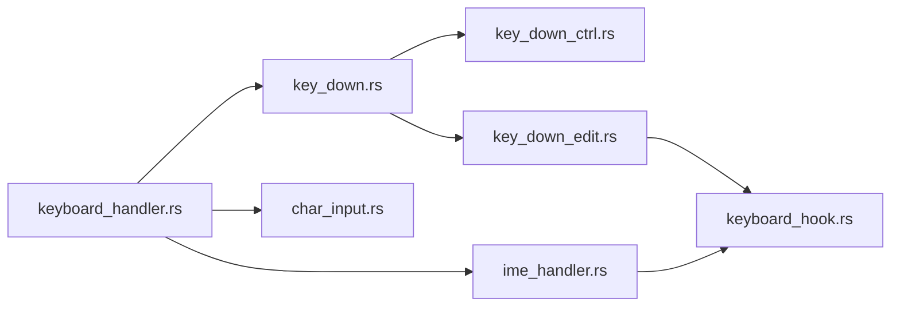

# 修饰键组合处理

<cite>
**本文引用的文件**
- [keyboard_handler.rs](file://crates/aether-win32/src/window/keyboard_handler.rs)
- [key_down.rs](file://crates/aether-win32/src/window/keyboard_handler/key_down.rs)
- [key_down_ctrl.rs](file://crates/aether-win32/src/window/keyboard_handler/key_down_ctrl.rs)
- [key_down_edit.rs](file://crates/aether-win32/src/window/keyboard_handler/key_down_edit.rs)
- [char_input.rs](file://crates/aether-win32/src/window/keyboard_handler/char_input.rs)
- [input.rs](file://crates/aether-win32/src/input.rs)
- [keyboard_hook.rs](file://crates/aether-win32/src/keyboard_hook.rs)
- [ime_handler.rs](file://crates/aether-win32/src/window/ime_handler.rs)
</cite>

## 目录
1. [简介](#简介)
2. [项目结构](#项目结构)
3. [核心组件](#核心组件)
4. [架构总览](#架构总览)
5. [详细组件分析](#详细组件分析)
6. [依赖关系分析](#依赖关系分析)
7. [性能与响应优化](#性能与响应优化)
8. [故障排查指南](#故障排查指南)
9. [结论](#结论)
10. [附录](#附录)

## 简介
本技术文档聚焦于“修饰键组合处理系统”，围绕 Ctrl、Alt、Shift 等修饰键的状态检测、组合键识别、快捷键绑定优先级与命令分发、冲突检测与智能解析、全局快捷键与编辑器内部快捷键的协调机制，以及修饰键状态的持久化、记忆与恢复进行系统性说明。同时给出组合键处理的性能优化与响应时间优化策略，帮助读者理解并扩展该子系统。

## 项目结构
键盘输入处理位于 aether-win32 模块中，采用“入口调度 + 按场景拆分”的结构：
- 入口层：统一接收 WM_KEYDOWN 和 WM_CHAR，同步当前窗口状态，提取修饰键状态（Ctrl/Shift/Alt），并按优先级分发给各子处理器。
- 控制流层：
  - key_down.rs：WM_KEYDOWN 主调度器，负责 IME 合成期判断、上下文菜单/面板优先拦截、Ctrl 与非 Ctrl 分流。
  - key_down_ctrl.rs：Ctrl+ 组合键分组处理（文件操作、视图切换、剪贴板、查找/撤销重做、标签页、词级移动、列光标等）。
  - key_down_edit.rs：非 Ctrl 编辑键处理（回车、退格、删除、方向键、Home/End/PageUp/PageDown、Tab 等），并在终端聚焦时转发到 ConPTY。
  - char_input.rs：WM_CHAR 字符输入分发，支持 UTF-16 代理对拼接，按优先级路由到各 UI 面板/对话框/编辑器。
- 全局钩子层：keyboard_hook.rs 安装 WH_KEYBOARD_LL 低层键盘钩子，在 IME 之前拦截 Backspace/Delete/方向键，确保终端模式下可删汉字。
- IME 协同：ime_handler.rs 管理合成期标志，避免重复插入与误拦截。
- 快捷键映射骨架：input.rs 定义了 KeyBinding、KeyMap 等数据结构，为未来用户自定义快捷键预留接口。

图表来源
- [keyboard_handler.rs:1-12](file://crates/aether-win32/src/window/keyboard_handler.rs#L1-L12)
- [key_down.rs:18-117](file://crates/aether-win32/src/window/keyboard_handler/key_down.rs#L18-L117)
- [key_down_ctrl.rs:15-28](file://crates/aether-win32/src/window/keyboard_handler/key_down_ctrl.rs#L15-L28)
- [key_down_edit.rs:14-55](file://crates/aether-win32/src/window/keyboard_handler/key_down_edit.rs#L14-L55)
- [char_input.rs:11-90](file://crates/aether-win32/src/window/keyboard_handler/char_input.rs#L11-L90)
- [keyboard_hook.rs:151-245](file://crates/aether-win32/src/keyboard_hook.rs#L151-L245)
- [ime_handler.rs:22-93](file://crates/aether-win32/src/window/ime_handler.rs#L22-L93)

章节来源
- [keyboard_handler.rs:1-12](file://crates/aether-win32/src/window/keyboard_handler.rs#L1-L12)
- [key_down.rs:18-117](file://crates/aether-win32/src/window/keyboard_handler/key_down.rs#L18-L117)
- [char_input.rs:11-90](file://crates/aether-win32/src/window/keyboard_handler/char_input.rs#L11-L90)
- [keyboard_hook.rs:151-245](file://crates/aether-win32/src/keyboard_hook.rs#L151-L245)
- [ime_handler.rs:22-93](file://crates/aether-win32/src/window/ime_handler.rs#L22-L93)

## 核心组件
- 修饰键状态检测
  - 在 WM_KEYDOWN 入口处通过系统 API 读取 Ctrl/Shift/Alt 状态，作为后续分发的依据。
  - 在 Ctrl 分支内，必要时再次读取 Alt 以支持 Ctrl+Alt+方向键等多修饰组合。
- 组合键识别与优先级
  - 先处理高优先级上下文（IME 合成期、各种面板/对话框可见性、文件树输入框激活等），再进入 Ctrl 与非 Ctrl 分流。
  - Ctrl 分支下按功能域分组调用多个辅助函数，每个函数只关注一组相关快捷键，降低耦合。
- 命令分发逻辑
  - 非 Ctrl 路径：根据 VK 码直接调用对应编辑动作；若终端聚焦则转发 ANSI 序列到 ConPTY。
  - Ctrl 路径：按功能域分发至文件操作、视图切换、剪贴板、查找/撤销重做、标签页、词级移动、列光标等。
- 全局快捷键与编辑器内部快捷键协调
  - 全局钩子在 IME 合成期放行，仅在终端聚焦且未合成时拦截特定键，避免影响其他应用。
  - 编辑器内部通过状态位（如 terminal_panel.focused）决定按键是否被终端消费。
- 修饰键状态持久化、记忆与恢复
  - 当前实现未显式持久化修饰键状态；状态由系统 API 实时获取。
  - 如需记忆用户偏好（例如默认 Alt 行为），可在设置系统中扩展并加载。

章节来源
- [key_down.rs:18-117](file://crates/aether-win32/src/window/keyboard_handler/key_down.rs#L18-L117)
- [key_down_ctrl.rs:15-28](file://crates/aether-win32/src/window/keyboard_handler/key_down_ctrl.rs#L15-L28)
- [key_down_edit.rs:14-55](file://crates/aether-win32/src/window/keyboard_handler/key_down_edit.rs#L14-L55)
- [keyboard_hook.rs:151-245](file://crates/aether-win32/src/keyboard_hook.rs#L151-L245)

## 架构总览
下图展示了从系统级钩子到窗口消息再到具体命令调用的完整链路，包括 IME 合成期的协作与终端模式的特殊处理。

图表来源
- [keyboard_hook.rs:151-245](file://crates/aether-win32/src/keyboard_hook.rs#L151-L245)
- [keyboard_handler.rs:1-12](file://crates/aether-win32/src/window/keyboard_handler.rs#L1-L12)
- [key_down.rs:18-117](file://crates/aether-win32/src/window/keyboard_handler/key_down.rs#L18-L117)
- [key_down_ctrl.rs:15-28](file://crates/aether-win32/src/window/keyboard_handler/key_down_ctrl.rs#L15-L28)
- [key_down_edit.rs:14-55](file://crates/aether-win32/src/window/keyboard_handler/key_down_edit.rs#L14-L55)
- [char_input.rs:11-90](file://crates/aether-win32/src/window/keyboard_handler/char_input.rs#L11-L90)
- [ime_handler.rs:22-93](file://crates/aether-win32/src/window/ime_handler.rs#L22-L93)

## 详细组件分析

### 修饰键状态检测与组合键识别
- 修饰键读取时机
  - 在 WM_KEYDOWN 入口处立即读取 Ctrl/Shift 状态，用于后续分流与匹配。
  - 在需要多修饰组合的场景（如 Ctrl+Alt+方向键）再次读取 Alt 状态。
- 组合键识别流程
  - 先判定 IME 合成期，若是则直接交由系统默认窗口过程处理，避免干扰输入法。
  - 依次尝试各类上下文菜单/面板/对话框的高优先级处理（如搜索面板、欢迎页导航、补全弹窗、设置字段、SSH/克隆对话框、命令面板等）。
  - 若检测到 Ctrl，则进入 Ctrl 组合键分发；否则进入非 Ctrl 编辑键分发。
- 冲突检测与智能解析
  - 通过“上下文优先 + 修饰键分流”的方式天然规避冲突：例如文件树输入框激活时吞掉所有 Ctrl 快捷键，防止编辑器误响应。
  - 在 Ctrl 分支内，按功能域分组处理，减少跨域冲突概率。

图表来源
- [key_down.rs:18-117](file://crates/aether-win32/src/window/keyboard_handler/key_down.rs#L18-L117)

章节来源
- [key_down.rs:18-117](file://crates/aether-win32/src/window/keyboard_handler/key_down.rs#L18-L117)

### Ctrl 组合键处理与命令分发
- 分组设计
  - 文件操作：打开文件/文件夹、保存/另存为、新建项目。
  - 视图切换：侧栏、底部面板、命令面板、源代码管理视图、字体缩放。
  - 剪贴板：复制/剪切/粘贴/全选，终端聚焦时 Ctrl+C 中断进程。
  - 查找/撤销重做：Ctrl+F/H/Z/Y 等。
  - 标签页：切换/关闭/恢复最后关闭的标签、数字跳转。
  - 词级移动与列光标：Ctrl+Left/Right 词级移动，Ctrl+Alt+Up/Down 列光标。
  - 文件首末与注释：Ctrl+Home/End/D/OEM_2。
- 冲突规避
  - 终端聚焦时 Ctrl+C 不执行复制而是中断进程，避免与编辑器复制冲突。
  - Ctrl+Space 触发 LSP 补全请求，避免与 AI 面板快捷键冲突（AI 入口改为活动栏右键/工具栏）。

图表来源
- [key_down_ctrl.rs:15-28](file://crates/aether-win32/src/window/keyboard_handler/key_down_ctrl.rs#L15-L28)
- [key_down_ctrl.rs:53-122](file://crates/aether-win32/src/window/keyboard_handler/key_down_ctrl.rs#L53-L122)
- [key_down_ctrl.rs:125-198](file://crates/aether-win32/src/window/keyboard_handler/key_down_ctrl.rs#L125-L198)
- [key_down_ctrl.rs:327-403](file://crates/aether-win32/src/window/keyboard_handler/key_down_ctrl.rs#L327-L403)
- [key_down_ctrl.rs:406-458](file://crates/aether-win32/src/window/keyboard_handler/key_down_ctrl.rs#L406-L458)
- [key_down_ctrl.rs:461-495](file://crates/aether-win32/src/window/keyboard_handler/key_down_ctrl.rs#L461-L495)
- [key_down_ctrl.rs:578-625](file://crates/aether-win32/src/window/keyboard_handler/key_down_ctrl.rs#L578-L625)
- [key_down_ctrl.rs:628-667](file://crates/aether-win32/src/window/keyboard_handler/key_down_ctrl.rs#L628-L667)
- [key_down_ctrl.rs:670-709](file://crates/aether-win32/src/window/keyboard_handler/key_down_ctrl.rs#L670-L709)

章节来源
- [key_down_ctrl.rs:15-28](file://crates/aether-win32/src/window/keyboard_handler/key_down_ctrl.rs#L15-L28)
- [key_down_ctrl.rs:53-122](file://crates/aether-win32/src/window/keyboard_handler/key_down_ctrl.rs#L53-L122)
- [key_down_ctrl.rs:125-198](file://crates/aether-win32/src/window/keyboard_handler/key_down_ctrl.rs#L125-L198)
- [key_down_ctrl.rs:327-403](file://crates/aether-win32/src/window/keyboard_handler/key_down_ctrl.rs#L327-L403)
- [key_down_ctrl.rs:406-458](file://crates/aether-win32/src/window/keyboard_handler/key_down_ctrl.rs#L406-L458)
- [key_down_ctrl.rs:461-495](file://crates/aether-win32/src/window/keyboard_handler/key_down_ctrl.rs#L461-L495)
- [key_down_ctrl.rs:578-625](file://crates/aether-win32/src/window/keyboard_handler/key_down_ctrl.rs#L578-L625)
- [key_down_ctrl.rs:628-667](file://crates/aether-win32/src/window/keyboard_handler/key_down_ctrl.rs#L628-L667)
- [key_down_ctrl.rs:670-709](file://crates/aether-win32/src/window/keyboard_handler/key_down_ctrl.rs#L670-L709)

### 非 Ctrl 编辑键处理与终端集成
- 编辑键处理
  - 回车：终端/AI/查找/编辑器各自处理；编辑器在多光标模式下广播换行。
  - 退格/删除：终端/AI/查找/编辑器各自处理；编辑器在有选区时删除选区，否则单光标/多光标删除。
  - 方向键/Home/End/PageUp/PageDown：支持 Shift 选择与 Smart Home 行为。
  - Tab：查找面板焦点切换；编辑器接受内联补全或插入制表符。
- 终端集成
  - 终端聚焦时将编辑键转换为 ANSI 序列发送到 ConPTY，保证终端交互一致。
  - 低层钩子额外拦截 Backspace/Delete/方向键，绕过 IME 系统级拦截，确保中文可删。

图表来源
- [key_down_edit.rs:14-55](file://crates/aether-win32/src/window/keyboard_handler/key_down_edit.rs#L14-L55)
- [key_down_edit.rs:59-151](file://crates/aether-win32/src/window/keyboard_handler/key_down_edit.rs#L59-L151)
- [keyboard_hook.rs:256-297](file://crates/aether-win32/src/keyboard_hook.rs#L256-L297)

章节来源
- [key_down_edit.rs:14-55](file://crates/aether-win32/src/window/keyboard_handler/key_down_edit.rs#L14-L55)
- [key_down_edit.rs:59-151](file://crates/aether-win32/src/window/keyboard_handler/key_down_edit.rs#L59-L151)
- [keyboard_hook.rs:256-297](file://crates/aether-win32/src/keyboard_hook.rs#L256-L297)

### 字符输入分发与 UTF-16 代理对处理
- UTF-16 代理对拼接
  - 高代理暂存，等待低代理组合为完整码点，支持 BMP 外字符（emoji、CJK 扩展 B 等）。
- 优先级路由
  - 文件树输入框 → 设置面板字段 → 搜索面板 → SSH/克隆/新建项目对话框 → SSH 管理面板 → 命令面板 → 查找替换面板 → 终端 → AI 面板 → 编辑器默认。
- IME 协同
  - 合成期跳过原始字符分发，避免重复插入；提交结果通过 IME 专用消息处理。

图表来源
- [char_input.rs:11-90](file://crates/aether-win32/src/window/keyboard_handler/char_input.rs#L11-L90)
- [ime_handler.rs:22-93](file://crates/aether-win32/src/window/ime_handler.rs#L22-L93)

章节来源
- [char_input.rs:11-90](file://crates/aether-win32/src/window/keyboard_handler/char_input.rs#L11-L90)
- [ime_handler.rs:22-93](file://crates/aether-win32/src/window/ime_handler.rs#L22-L93)

### 全局快捷键与编辑器内部快捷键协调
- 全局钩子策略
  - 仅在前台窗口为本应用时拦截；终端聚焦且未合成时才拦截特定键，其余情况放行。
  - 将拦截到的按键转为自定义消息投递到主窗口，再由主窗口转发到终端发送逻辑。
- 编辑器内部策略
  - 通过状态位（terminal_panel.focused、find_visible、command_palette.visible 等）决定按键是否被面板/对话框消费。
  - 文件树输入框激活时吞掉所有 Ctrl 快捷键，防止编辑器误响应。

章节来源
- [keyboard_hook.rs:151-245](file://crates/aether-win32/src/keyboard_hook.rs#L151-L245)
- [key_down.rs:81-117](file://crates/aether-win32/src/window/keyboard_handler/key_down.rs#L81-L117)

### 快捷键绑定骨架与可扩展性
- 数据结构
  - KeyBinding：包含键类型与修饰键状态，指向一个编辑器动作。
  - KeyMap：维护 (Key, ctrl, shift, alt) → EditorAction 的映射，提供 from_vk 转换与 lookup 查询。
- 现状与规划
  - 当前快捷键硬编码在分发函数中；KeyMap 为未来用户自定义快捷键预留接口。
  - 接入后可实现配置驱动的快捷键解析与冲突检测。

章节来源
- [input.rs:40-125](file://crates/aether-win32/src/input.rs#L40-L125)
- [input.rs:127-244](file://crates/aether-win32/src/input.rs#L127-L244)

## 依赖关系分析
- 组件耦合
  - keyboard_handler.rs 聚合 key_down.rs 与 char_input.rs，二者分别依赖 key_down_ctrl.rs 与 key_down_edit.rs。
  - key_down_edit.rs 与 keyboard_hook.rs 协作，确保终端模式下的按键直达 ConPTY。
  - ime_handler.rs 与 keyboard_hook.rs 通过合成期标志协同，避免误拦截与重复插入。
- 外部依赖
  - Windows 系统 API：GetKeyState、SetWindowsHookExW、CallNextHookEx、PostMessageW、Imm32 相关消息。
  - ConPTY 终端：通过发送字节序列与 ANSI 转义序列完成交互。

图表来源
- [keyboard_handler.rs:1-12](file://crates/aether-win32/src/window/keyboard_handler.rs#L1-L12)
- [key_down.rs:18-117](file://crates/aether-win32/src/window/keyboard_handler/key_down.rs#L18-L117)
- [char_input.rs:11-90](file://crates/aether-win32/src/window/keyboard_handler/char_input.rs#L11-L90)
- [keyboard_hook.rs:151-245](file://crates/aether-win32/src/keyboard_hook.rs#L151-L245)
- [ime_handler.rs:22-93](file://crates/aether-win32/src/window/ime_handler.rs#L22-L93)

章节来源
- [keyboard_handler.rs:1-12](file://crates/aether-win32/src/window/keyboard_handler.rs#L1-L12)
- [key_down.rs:18-117](file://crates/aether-win32/src/window/keyboard_handler/key_down.rs#L18-L117)
- [char_input.rs:11-90](file://crates/aether-win32/src/window/keyboard_handler/char_input.rs#L11-L90)
- [keyboard_hook.rs:151-245](file://crates/aether-win32/src/keyboard_hook.rs#L151-L245)
- [ime_handler.rs:22-93](file://crates/aether-win32/src/window/ime_handler.rs#L22-L93)

## 性能与响应优化
- 快速路径与短路
  - 在入口处尽早判断 IME 合成期与上下文状态，命中即短路返回，减少后续分支开销。
  - Ctrl 分支内按功能域分组，避免不必要的条件判断。
- 最小化状态访问
  - 使用 thread_local 同步当前窗口状态，避免跨线程/跨窗口状态错乱导致的额外同步成本。
- 异步与定时器
  - 终端刷新使用定时器周期更新，避免阻塞 UI 线程；连接等操作移至后台线程。
- 去抖与节流
  - 自动保存模块采用防抖与周期兜底策略，虽非直接针对键盘，但体现了整体系统的性能理念，可借鉴到高频输入场景（如搜索面板实时更新）。
- 低层钩子优化
  - 仅拦截必要键（Backspace/Delete/方向键），其余放行，降低钩子处理开销。

[本节为通用指导，无需列出具体文件来源]

## 故障排查指南
- 中文无法删除问题
  - 现象：IME 开启但未合成时，Backspace 无效。
  - 原因：IMM32 在系统级拦截了 Backspace，导致 WM_KEYDOWN 未到达窗口。
  - 解决：安装 WH_KEYBOARD_LL 低层钩子，在 IME 之前拦截并注入自定义消息，主窗口转发到终端发送逻辑。
- 重复插入字符
  - 现象：IME 提交后出现重复字符。
  - 原因：WM_IME_COMPOSITION 与 WM_CHAR 同时处理。
  - 解决：IME 合成期跳过 WM_CHAR 分发，提交结果仅通过 IME 专用消息处理。
- 终端模式下快捷键误触
  - 现象：终端聚焦时 Ctrl+C 仍执行复制。
  - 解决：在 Ctrl 组合键分发中优先检测终端聚焦，Ctrl+C 中断进程而非复制。
- 面板/对话框劫持输入
  - 现象：面板可见时编辑器仍可输入。
  - 解决：在分发前检查面板/对话框可见性与焦点状态，命中则消费按键并返回。

章节来源
- [keyboard_hook.rs:151-245](file://crates/aether-win32/src/keyboard_hook.rs#L151-L245)
- [ime_handler.rs:22-93](file://crates/aether-win32/src/window/ime_handler.rs#L22-L93)
- [key_down_ctrl.rs:327-403](file://crates/aether-win32/src/window/keyboard_handler/key_down_ctrl.rs#L327-L403)
- [key_down.rs:81-117](file://crates/aether-win32/src/window/keyboard_handler/key_down.rs#L81-L117)

## 结论
本系统通过“入口调度 + 场景分流 + 低层钩子 + IME 协同”的架构，实现了稳健的修饰键组合处理与快捷键分发。其优势在于：
- 清晰的分层与职责划分，便于扩展与维护。
- 基于上下文与修饰键的优先级策略，有效规避冲突。
- 低层钩子与 IME 协同，解决了多语言环境下的终端删除难题。
未来可通过 KeyMap 引入配置驱动的快捷键解析与冲突检测，进一步提升灵活性与用户体验。

[本节为总结，无需列出具体文件来源]

## 附录
- 术语
  - 修饰键：Ctrl、Alt、Shift 等组合键。
  - 合成期：IME 正在构建候选串的阶段。
  - 低层钩子：WH_KEYBOARD_LL，系统级键盘事件拦截。
- 参考实现位置
  - 入口与分发：keyboard_handler.rs、key_down.rs、char_input.rs
  - Ctrl 组合键：key_down_ctrl.rs
  - 非 Ctrl 编辑键：key_down_edit.rs
  - 低层钩子：keyboard_hook.rs
  - IME 协同：ime_handler.rs
  - 快捷键骨架：input.rs

[本节为附录，无需列出具体文件来源]