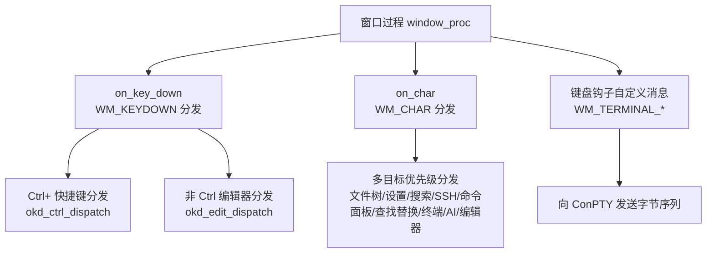
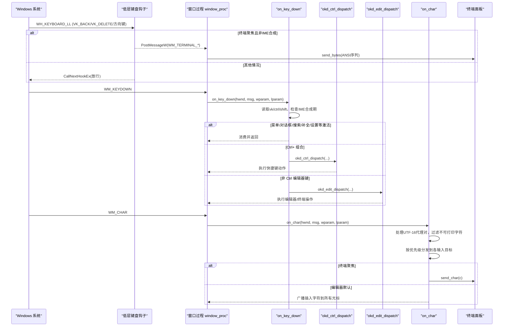
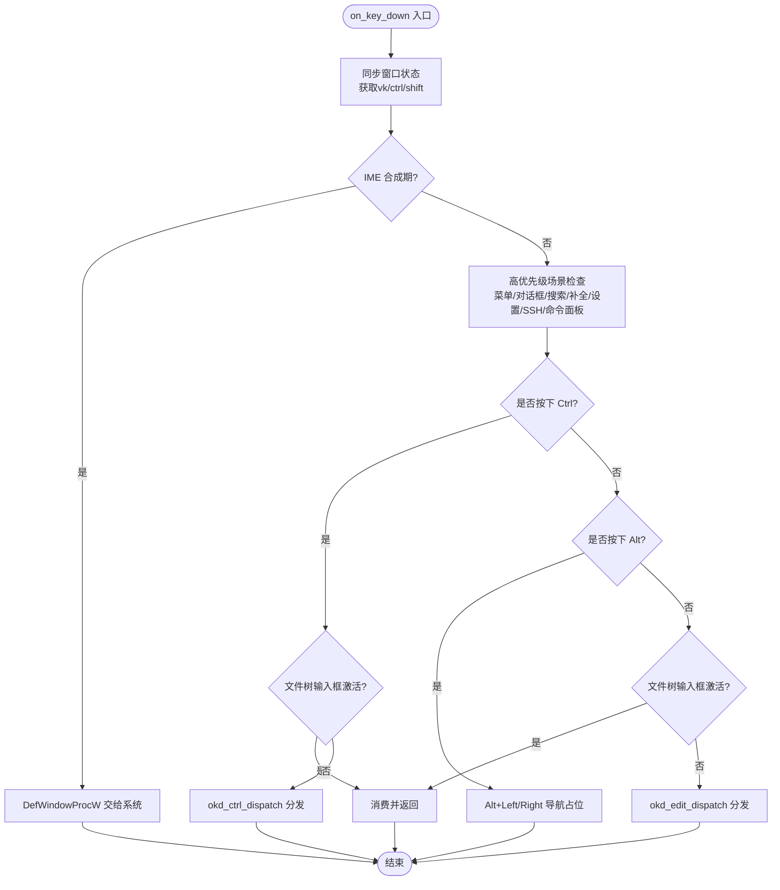
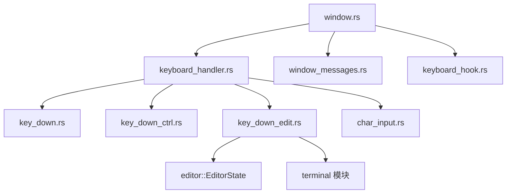

# 基础按键处理

<cite>
**本文引用的文件列表**
- [window.rs](file://crates/aether-win32/src/window.rs)
- [keyboard_handler.rs](file://crates/aether-win32/src/window/keyboard_handler.rs)
- [key_down.rs](file://crates/aether-win32/src/window/keyboard_handler/key_down.rs)
- [key_down_ctrl.rs](file://crates/aether-win32/src/window/keyboard_handler/key_down_ctrl.rs)
- [key_down_edit.rs](file://crates/aether-win32/src/window/keyboard_handler/key_down_edit.rs)
- [char_input.rs](file://crates/aether-win32/src/window/keyboard_handler/char_input.rs)
- [window_messages.rs](file://crates/aether-win32/src/window/window_messages.rs)
- [keyboard_hook.rs](file://crates/aether-win32/src/keyboard_hook.rs)
</cite>

## 目录
1. [简介](#简介)
2. [项目结构](#项目结构)
3. [核心组件](#核心组件)
4. [架构总览](#架构总览)
5. [详细组件分析](#详细组件分析)
6. [依赖关系分析](#依赖关系分析)
7. [性能考虑](#性能考虑)
8. [故障排查指南](#故障排查指南)
9. [结论](#结论)
10. [附录](#附录)

## 简介
本技术文档聚焦于 Windows 平台下的基础按键处理系统，围绕 WM_KEYDOWN 消息的完整处理流程展开，涵盖虚拟键码识别、按键状态检测、重复按键与释放机制、特殊功能键（F1-F12、方向键、Home/End、Page Up/Down）的处理实现、事件生命周期管理与性能优化策略。同时给出按键映射表设计思路、自定义快捷键绑定方案以及冲突解决机制，并提供调试技巧与常见问题解决方案。

## 项目结构
按键处理相关代码位于 aether-win32 窗体模块中，采用“入口窗口过程 + 键盘处理器子模块”的分层组织方式：
- 窗口过程负责消息分发与线程局部状态同步
- 键盘处理模块按 Ctrl 与非 Ctrl 分支拆分，进一步拆分为编辑器专用逻辑与字符输入分发
- 低层键盘钩子用于在 IME 拦截前将特定编辑键路由到终端

图表来源
- [window.rs:301-373](file://crates/aether-win32/src/window.rs#L301-L373)
- [keyboard_handler.rs:1-13](file://crates/aether-win32/src/window/keyboard_handler.rs#L1-L13)
- [key_down.rs:17-117](file://crates/aether-win32/src/window/keyboard_handler/key_down.rs#L17-L117)
- [char_input.rs:10-90](file://crates/aether-win32/src/window/keyboard_handler/char_input.rs#L10-L90)
- [keyboard_hook.rs:37-46](file://crates/aether-win32/src/keyboard_hook.rs#L37-L46)

章节来源
- [window.rs:301-373](file://crates/aether-win32/src/window.rs#L301-L373)
- [keyboard_handler.rs:1-13](file://crates/aether-win32/src/window/keyboard_handler.rs#L1-L13)

## 核心组件
- 窗口过程与状态同步
  - 窗口过程统一接收所有消息，并在进入消息处理前通过 get_and_set_state 将当前窗口状态同步至 thread_local，避免多窗口焦点切换导致键盘路由错误。
  - 使用 invalidate_window 触发 WM_PAINT 合并重绘，避免直接 render 导致的重复绘制。
- 键盘处理入口
  - on_key_down 负责 WM_KEYDOWN 的解析与分发，提取 vk、ctrl、shift 等修饰键状态，并优先处理 IME 合成期、上下文菜单、对话框、搜索面板、补全弹窗等 UI 场景，再按 Ctrl 与非 Ctrl 分支派发。
- Ctrl+ 快捷键分发
  - okd_ctrl_dispatch 将 Ctrl+ 组合键按功能分组调用：文件操作、视图切换、缩放、剪贴板、查找/撤销重做、标签页管理、词级移动、列光标等。
- 非 Ctrl 编辑器按键分发
  - okd_edit_dispatch 处理 Return/Back/Delete/F3/Esc/方向键/Home/End/PageUp/Down/Tab 等，并在终端聚焦时优先将按键转换为 ANSI 序列发送到 ConPTY。
- 字符输入分发
  - on_char 负责 WM_CHAR 的 UTF-16 代理对拼接与可打印字符分发，按优先级投递到各输入目标（文件树、设置、搜索、SSH、克隆、新建项目、SSH 管理、命令面板、查找替换、终端、AI 面板），最终回落到编辑器默认插入。
- 低层键盘钩子
  - 安装 WH_KEYBOARD_LL 全局钩子，在 IME 之前拦截 Backspace/Delete/方向键，当终端聚焦且未处于 IME 合成期时，抑制原事件并通过自定义消息将对应字节序列发送到终端。

章节来源
- [window.rs:71-110](file://crates/aether-win32/src/window.rs#L71-L110)
- [key_down.rs:17-117](file://crates/aether-win32/src/window/keyboard_handler/key_down.rs#L17-L117)
- [key_down_ctrl.rs:14-28](file://crates/aether-win32/src/window/keyboard_handler/key_down_ctrl.rs#L14-L28)
- [key_down_edit.rs:13-55](file://crates/aether-win32/src/window/keyboard_handler/key_down_edit.rs#L13-L55)
- [char_input.rs:10-90](file://crates/aether-win32/src/window/keyboard_handler/char_input.rs#L10-L90)
- [keyboard_hook.rs:56-122](file://crates/aether-win32/src/keyboard_hook.rs#L56-L122)

## 架构总览
下图展示了从系统消息到具体处理的端到端路径，包括 IME 合成期的特殊处理与低层钩子的旁路通道。

图表来源
- [window.rs:301-373](file://crates/aether-win32/src/window.rs#L301-L373)
- [keyboard_hook.rs:151-245](file://crates/aether-win32/src/keyboard_hook.rs#L151-L245)
- [key_down.rs:17-117](file://crates/aether-win32/src/window/keyboard_handler/key_down.rs#L17-L117)
- [key_down_ctrl.rs:14-28](file://crates/aether-win32/src/window/keyboard_handler/key_down_ctrl.rs#L14-L28)
- [key_down_edit.rs:13-55](file://crates/aether-win32/src/window/keyboard_handler/key_down_edit.rs#L13-L55)
- [char_input.rs:10-90](file://crates/aether-win32/src/window/keyboard_handler/char_input.rs#L10-L90)

## 详细组件分析

### WM_KEYDOWN 处理流程与虚拟键码识别
- 入口函数 on_key_down 首先同步当前窗口状态，提取 VIRTUAL_KEY、Ctrl、Shift 状态。
- IME 合成期间直接交由 DefWindowProcW 处理，确保中文/日文输入法能正常更新或取消合成串。
- 高优先级场景依次检查：文件树内联输入框、资源管理器空白区域上下文菜单、标签右键菜单、活动栏右键菜单、自定义模式退出、全局搜索面板、欢迎页导航、补全弹窗、设置字段、SSH 对话框、克隆对话框、新建项目对话框、SSH 管理面板、命令面板。
- Ctrl 分支：若文件树输入框激活则吞掉所有 Ctrl 快捷键；否则调用 okd_ctrl_dispatch 进行快捷键分发。
- Alt 导航：Alt+Left/Right 占位实现，显示状态消息。
- 非 Ctrl 分支：若文件树输入框激活则吞掉所有非 Ctrl 编辑器按键；否则调用 okd_edit_dispatch 进行编辑器按键分发。

图表来源
- [key_down.rs:17-117](file://crates/aether-win32/src/window/keyboard_handler/key_down.rs#L17-L117)

章节来源
- [key_down.rs:17-117](file://crates/aether-win32/src/window/keyboard_handler/key_down.rs#L17-L117)

### 按键状态检测、重复按键与释放机制
- 状态检测：通过 GetKeyState 查询 Ctrl、Shift、Alt 修饰键状态，结合 EDITOR_STATE 中的 UI 状态（如 terminal_panel.focused、composition.is_some、search_panel.visible 等）决定按键路由。
- 重复按键：Windows 在用户长按时会重复发送 WM_KEYDOWN，本系统未显式去抖，由上层 UI 逻辑自行处理（例如搜索面板、补全弹窗的连续导航）。
- 按键释放：系统会发送 WM_KEYUP，但本仓库未在当前键盘处理模块中显式处理 WM_KEYUP，通常不需要为纯文本编辑与快捷键场景单独处理释放。

章节来源
- [key_down.rs:17-117](file://crates/aether-win32/src/window/keyboard_handler/key_down.rs#L17-L117)
- [key_down_edit.rs:13-55](file://crates/aether-win32/src/window/keyboard_handler/key_down_edit.rs#L13-L55)

### 特殊功能键处理实现
- F1-F12：当前代码未对 F1-F12 进行专门处理，属于未定义行为，可由扩展点添加。
- 方向键：
  - 非 Ctrl：okd_edit_left_right / okd_edit_up_down 处理光标移动与 Shift 选择。
  - Ctrl+方向键：okd_ctrl_word_move 实现词级移动与 Shift 选择。
  - 终端聚焦：okd_edit_terminal 将方向键转换为 ANSI 序列发送到 ConPTY。
- Home/End/Prior/Next：
  - okd_edit_home_end_page 处理行首末、文件首末、翻页滚动。
  - Home 支持 Smart Home（已在首个非空白位置时跳到行首）。
- Tab：
  - 查找面板激活时用于焦点切换。
  - 编辑器默认接受内联补全建议或插入制表符。

章节来源
- [key_down_edit.rs:448-591](file://crates/aether-win32/src/window/keyboard_handler/key_down_edit.rs#L448-L591)
- [key_down_edit.rs:350-446](file://crates/aether-win32/src/window/keyboard_handler/key_down_edit.rs#L350-L446)
- [key_down_edit.rs:57-151](file://crates/aether-win32/src/window/keyboard_handler/key_down_edit.rs#L57-L151)
- [key_down_ctrl.rs:577-625](file://crates/aether-win32/src/window/keyboard_handler/key_down_ctrl.rs#L577-L625)

### 按键事件的生命周期管理与渲染优化
- 生命周期：
  - 窗口过程统一接收消息，进入处理前同步 thread_local 状态，保证多窗口下键盘输入路由正确。
  - 键盘处理修改状态后调用 invalidate_window，由 WM_PAINT 统一驱动渲染，避免双重绘制。
- 性能优化：
  - 使用 InvalidateRect 合并多次重绘请求。
  - 终端刷新定时器 TERM_TIMER_ID 周期性触发重绘以显示异步输出，底部面板不可见时自动停止定时器。
  - DPI 变化时重建渲染目标与缓存，确保尺寸一致。

章节来源
- [window.rs:71-75](file://crates/aether-win32/src/window.rs#L71-L75)
- [window_messages.rs:63-79](file://crates/aether-win32/src/window/window_messages.rs#L63-L79)
- [window_messages.rs:345-394](file://crates/aether-win32/src/window/window_messages.rs#L345-L394)

### 按键映射表设计与自定义快捷键绑定
- 现有映射表（Ctrl+ 快捷键）：
  - 文件操作：Ctrl+O/K/S/N
  - 视图切换：Ctrl+Space/B/P/`/J/E/G
  - 字体缩放：Ctrl+=/-/0
  - 剪贴板：Ctrl+C/X/V/A（终端聚焦时 Ctrl+C 中断进程）
  - 查找/撤销重做：Ctrl+F/H/Z/Y
  - 标签页：Ctrl+Tab/W/F4/T（Shift）、Ctrl+1-9
  - 词级移动：Ctrl+Left/Right（含 Shift）
  - 文件首末/添加光标/注释：Ctrl+Home/End/D/OEM_2
  - 列光标：Ctrl+Alt+Up/Down
- 自定义绑定建议：
  - 在 okd_ctrl_dispatch 中添加新的匹配分支，遵循现有分组风格（文件操作、视图、缩放、剪贴板、查找/撤销、标签页、词级移动、文件导航、列光标、终端清屏）。
  - 为避免冲突，新增快捷键需检查是否与现有组合重叠，必要时调整 Shift/Alt 修饰键组合。
  - 对于非 Ctrl 快捷键，可在 okd_edit_dispatch 中添加新分支，注意与终端聚焦时的转义序列发送逻辑保持一致。

章节来源
- [key_down_ctrl.rs:14-28](file://crates/aether-win32/src/window/keyboard_handler/key_down_ctrl.rs#L14-L28)
- [key_down_ctrl.rs:52-122](file://crates/aether-win32/src/window/keyboard_handler/key_down_ctrl.rs#L52-L122)
- [key_down_ctrl.rs:124-198](file://crates/aether-win32/src/window/keyboard_handler/key_down_ctrl.rs#L124-L198)
- [key_down_ctrl.rs:200-260](file://crates/aether-win32/src/window/keyboard_handler/key_down_ctrl.rs#L200-L260)
- [key_down_ctrl.rs:262-323](file://crates/aether-win32/src/window/keyboard_handler/key_down_ctrl.rs#L262-L323)
- [key_down_ctrl.rs:325-403](file://crates/aether-win32/src/window/keyboard_handler/key_down_ctrl.rs#L325-L403)
- [key_down_ctrl.rs:405-458](file://crates/aether-win32/src/window/keyboard_handler/key_down_ctrl.rs#L405-L458)
- [key_down_ctrl.rs:460-495](file://crates/aether-win32/src/window/keyboard_handler/key_down_ctrl.rs#L460-L495)
- [key_down_ctrl.rs:497-575](file://crates/aether-win32/src/window/keyboard_handler/key_down_ctrl.rs#L497-L575)
- [key_down_ctrl.rs:577-625](file://crates/aether-win32/src/window/keyboard_handler/key_down_ctrl.rs#L577-L625)
- [key_down_ctrl.rs:627-667](file://crates/aether-win32/src/window/keyboard_handler/key_down_ctrl.rs#L627-L667)
- [key_down_ctrl.rs:669-709](file://crates/aether-win32/src/window/keyboard_handler/key_down_ctrl.rs#L669-L709)

### 快捷键冲突解决机制
- 冲突检测：新增快捷键需在 okd_ctrl_dispatch 或 okd_edit_dispatch 中进行唯一性检查，避免与现有组合重叠。
- 修饰键区分：利用 Ctrl+Shift、Ctrl+Alt 组合降低冲突概率。
- 场景隔离：不同 UI 场景（如命令面板、查找替换、终端）拥有独立的路由分支，可减少跨场景冲突。
- 降级策略：当检测到冲突时，优先保留常用快捷键（如 Ctrl+S、Ctrl+F），为新功能提供替代组合。

章节来源
- [key_down_ctrl.rs:14-28](file://crates/aether-win32/src/window/keyboard_handler/key_down_ctrl.rs#L14-L28)
- [key_down_edit.rs:13-55](file://crates/aether-win32/src/window/keyboard_handler/key_down_edit.rs#L13-L55)

### 调试技巧与常见问题
- 日志与追踪：
  - 在 on_char 中记录收到的字符码点，便于排查 UTF-16 代理对拼接问题。
  - 在键盘钩子中使用 tracing::trace/debug 记录拦截与路由决策。
- 常见问题：
  - IME 合成期按键被系统拦截：on_key_down/on_char 已检测 composition 状态并交由系统处理，确保中文/日文输入正常。
  - 终端无法删除汉字：低层键盘钩子在 IME 之前拦截 Backspace/Delete/方向键，并将对应字节序列发送到 ConPTY。
  - 多窗口焦点错乱：get_and_set_state 确保每个窗口消息处理前同步 thread_local 状态。
  - 重复绘制闪烁：使用 invalidate_window 合并重绘，避免直接 render。

章节来源
- [char_input.rs:10-90](file://crates/aether-win32/src/window/keyboard_handler/char_input.rs#L10-L90)
- [keyboard_hook.rs:151-245](file://crates/aether-win32/src/keyboard_hook.rs#L151-L245)
- [window.rs:71-110](file://crates/aether-win32/src/window.rs#L71-L110)

## 依赖关系分析
- 模块耦合：
  - window.rs 作为入口，依赖 keyboard_handler 子模块与 window_messages 子模块。
  - keyboard_handler 内部按功能拆分为 key_down、key_down_ctrl、key_down_edit、char_input，职责清晰，耦合度低。
  - keyboard_hook 通过自定义消息与主窗口过程通信，解耦了低层钩子与业务逻辑。
- 外部依赖：
  - windows crate 提供 Win32 API 访问。
  - editor::EditorState 提供编辑器状态与操作接口。
  - terminal 模块提供终端面板的输入发送能力。

图表来源
- [window.rs:13-26](file://crates/aether-win32/src/window.rs#L13-L26)
- [keyboard_handler.rs:6-13](file://crates/aether-win32/src/window/keyboard_handler.rs#L6-L13)
- [key_down_edit.rs:9-11](file://crates/aether-win32/src/window/keyboard_handler/key_down_edit.rs#L9-L11)

章节来源
- [window.rs:13-26](file://crates/aether-win32/src/window.rs#L13-L26)
- [keyboard_handler.rs:6-13](file://crates/aether-win32/src/window/keyboard_handler.rs#L6-L13)

## 性能考虑
- 消息合并：invalidate_window 使用 InvalidateRect 合并多次重绘请求，减少 WM_PAINT 频率。
- 定时器控制：终端刷新定时器仅在底部面板可见时运行，不可见时自动停止，避免空转。
- 状态同步：get_and_set_state 在消息入口处同步 thread_local 状态，避免昂贵的状态查找与错误路由。
- 渲染保护：render 路径使用 catch_unwind 捕获 D2D 设备丢失异常，优雅跳过本次绘制，防止崩溃。

章节来源
- [window.rs:71-75](file://crates/aether-win32/src/window.rs#L71-L75)
- [window_messages.rs:63-79](file://crates/aether-win32/src/window/window_messages.rs#L63-L79)
- [window_messages.rs:478-514](file://crates/aether-win32/src/window/window_messages.rs#L478-L514)

## 故障排查指南
- 症状：中文输入法下 Backspace 无法删除终端内容
  - 原因：IME 系统级拦截导致 WM_KEYDOWN 未到达窗口过程
  - 解决：低层键盘钩子拦截并发送 \x7f 到终端
  - 参考：[keyboard_hook.rs:151-245](file://crates/aether-win32/src/keyboard_hook.rs#L151-L245)
- 症状：多窗口下键盘输入路由到错误窗口
  - 原因：thread_local 状态未同步
  - 解决：在消息处理前调用 get_and_set_state
  - 参考：[window.rs:100-110](file://crates/aether-win32/src/window.rs#L100-L110)
- 症状：频繁重绘导致界面闪烁
  - 原因：直接调用 render 而非 invalidate_window
  - 解决：统一使用 invalidate_window 触发 WM_PAINT
  - 参考：[window.rs:71-75](file://crates/aether-win32/src/window.rs#L71-L75)

章节来源
- [keyboard_hook.rs:151-245](file://crates/aether-win32/src/keyboard_hook.rs#L151-L245)
- [window.rs:100-110](file://crates/aether-win32/src/window.rs#L100-L110)
- [window.rs:71-75](file://crates/aether-win32/src/window.rs#L71-L75)

## 结论
本按键处理系统通过分层设计与优先级分发，实现了稳健的 WM_KEYDOWN/WM_CHAR 处理流程，兼顾 IME 兼容性、终端直通与多 UI 场景的交互需求。通过低层键盘钩子解决了 IME 拦截导致的终端编辑问题，结合 invalidate_window 与定时器控制实现了良好的性能表现。未来可扩展 F1-F12 等功能键支持，并进一步完善自定义快捷键配置与冲突检测机制。

## 附录
- 术语说明：
  - VK：Virtual Key，虚拟键码
  - IME：Input Method Editor，输入法编辑器
  - ConPTY：Console Pseudo Terminal，控制台伪终端
  - ANSI 序列：终端控制序列，用于表示方向键、删除键等
- 相关文件索引：
  - 窗口过程与状态同步：[window.rs](file://crates/aether-win32/src/window.rs)
  - 键盘处理入口与分发：[keyboard_handler.rs](file://crates/aether-win32/src/window/keyboard_handler.rs)、[key_down.rs](file://crates/aether-win32/src/window/keyboard_handler/key_down.rs)
  - Ctrl+ 快捷键：[key_down_ctrl.rs](file://crates/aether-win32/src/window/keyboard_handler/key_down_ctrl.rs)
  - 非 Ctrl 编辑器键：[key_down_edit.rs](file://crates/aether-win32/src/window/keyboard_handler/key_down_edit.rs)
  - 字符输入分发：[char_input.rs](file://crates/aether-win32/src/window/keyboard_handler/char_input.rs)
  - 低层键盘钩子：[keyboard_hook.rs](file://crates/aether-win32/src/keyboard_hook.rs)
  - 杂项窗口消息：[window_messages.rs](file://crates/aether-win32/src/window/window_messages.rs)